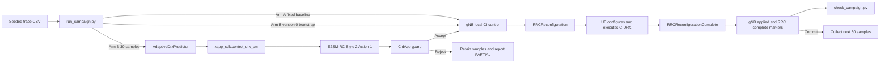
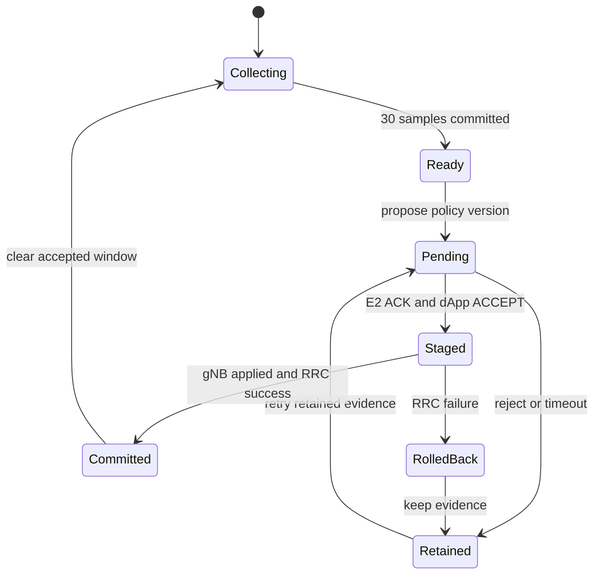

<!-- SPDX-License-Identifier: CC-BY-4.0 -->

# Adaptive C-DRX A/B Manual Reproduction

**Table of Contents**

[[_TOC_]]

## 1. Scenario

This guide reproduces the adaptive RRC_CONNECTED C-DRX validation for one RedCap UE. DRX controls when the UE monitors PDCCH; it does not put the gNB to sleep.

The frozen v1 experiment has four independent campaigns:

| Campaign | Control arm | Direction |
|---|---|---|
| `arm-a-dl` | Fixed `drx-320-10`, applied once through local gNB control | Downlink |
| `arm-b-dl` | Python predictor through E2SM-RC and the C dApp guard | Downlink |
| `arm-a-ul` | Fixed `drx-320-10`, applied once through local gNB control | Uplink |
| `arm-b-ul` | Python predictor through E2SM-RC and the C dApp guard | Uplink |

Each campaign contains 330 scheduled arrivals. Arrivals 1-30 warm up the predictor; arrivals 31-330 form the 300-record scored population. Every scored policy window contains 30 arrivals.

Arm B uses E2SM-RC Service Style 2, Action 1, RAN Parameter 1 for the Long DRX Cycle Length. The xApp owns the 30-sample statistics and bounded fallback because the standard message carries only the UE ID and long cycle. The C dApp guard selects the paired On Duration and validates the UE state, policy version, cooldown, legal profile, and rollback state.



The current evidence proves focused tests, an importable Python 3.12 FlexRIC bridge, and E2-enabled gNB/UE builds. It does **not** prove a completed RFsim A/B campaign or physical power reduction.

## 2. Prerequisites

Run all repository commands from the repository root.

Required local tools and runtime services:

- Python 3.10 or newer.
- CMake, Ninja, a C/C++ compiler, and the OAI build dependencies.
- iPerf2 with `--txstart-time`, `--trip-times`, and `-R` support.
- Docker Compose, an operational OAI CN5G, one connected RedCap RFsim UE, a gNB-DU E2 node, and nearRT-RIC.
- Synchronized client/server clocks when interpreting iPerf2 trip-time measurements.
- A continuously appended combined gNB/UE runtime log.

Check the traffic tool before generating evidence:

```bash
python3 --version
iperf --version
iperf --help | grep -E -- '--txstart-time|--trip-times|--reverse'
```

### 2.1 Local-control requirement

The gNB must load the telnet CI module. The campaign runner's default `127.0.0.1:9091` works only when it shares the gNB network namespace. For the supplied RFsim bridge, use the gNB address explicitly:

```text
--telnetsrv --telnetsrv.shrmod ci --telnetsrv.listenaddr 192.168.70.140 --telnetsrv.listenport 9091
```

Both arms require this surface: Arm A applies policy version 1 once, while Arm B applies the reserved version-0 rollback bootstrap only on fresh, unconfigured DRX state. The UE must also load `ciUE` on `192.168.71.150:8091` for scored Active-Time counters.

### 2.2 Arm B Python/FlexRIC requirement

FlexRIC requires SWIG 4.1 or newer. The Python wrapper, service-model plugins, RIC, and gNB must all use `E2AP_V3` and `KPM_V3_00`. Use the isolated build and project configuration below; do not fall back to `/usr/local/lib/flexric`:

```bash
export PYTHONPATH=/tmp/flexric-adaptive-drx-v3/src/xApp/swig
export FLEXRIC_CONF_FILE=/home/tonywang/OAI/Red_cap_openairinterface5g/ci-scripts/yaml_files/5g_rfsimulator_flexric_redcap/conf/flexric.conf
export FLEXRIC_LIBS_DIR=/tmp/flexric-adaptive-drx-v3/plugins/
swig -version
python3 -c 'import xapp_sdk; print(xapp_sdk.__file__)'
```

The system SWIG remains 4.0.2, but the repository-provided `cmake_targets/swig/swig` is 4.1.1. The isolated `xapp_sdk` build/import gate passes with Python 3.12; use that exact build output and do not weaken the version requirement.

### 2.3 Traffic and control namespace requirement

Run Python and `xapp_sdk` on the host, and use `--traffic-prefix "docker exec rfsim5g-oai-nr-ue1_redcap"` so only iPerf2 runs in the UE namespace. The host must reach the gNB/UE telnet addresses. Verify that the UE image contains iPerf2 before `--execute`.

### 2.4 Absolute-time replay requirement

Use `adaptive_drx.py rebase` before every sequential campaign. It verifies the source hashes, preserves every interval, and writes new future timestamps and hashes. Each campaign still requires a fresh gNB/UE stack so version 0 is accepted only as the initial Arm B bootstrap.

Use a fresh gNB state for each independent campaign. Otherwise policy versions starting again at 1 can be rejected as stale.

## 3. Build and Focused Tests

Enable the telnet server when building the gNB control surface:

```bash
cmake -S . -B /tmp/oai-e2-agent-build -GNinja -DE2_AGENT=ON -DENABLE_TELNETSRV=ON
cmake --build /tmp/oai-e2-agent-build \
  --target nr-softmodem nr-uesoftmodem telnetsrv_ci telnetsrv_ciUE -j2
```

Build the Python xApp bridge with the repository SWIG 4.1.1 and one consistent Python installation:

```bash
PYTHON_BIN=$(command -v python3)
PYTHON_INCLUDE=$(python3 -c 'import sysconfig; print(sysconfig.get_path("include"))')
PYTHON_LIBRARY=$(python3 -c 'import os,sysconfig; print(os.path.join(sysconfig.get_config_var("LIBDIR"),sysconfig.get_config_var("LDLIBRARY")))')
cmake -S openair2/E2AP/flexric -B /tmp/flexric-adaptive-drx-v3 -GNinja \
  -DXAPP_MULTILANGUAGE=ON -DUNIT_TEST=FALSE \
  -DE2AP_VERSION=E2AP_V3 -DKPM_VERSION=KPM_V3_00 \
  -DSWIG_EXECUTABLE="$PWD/cmake_targets/swig/swig" \
  -DPython3_EXECUTABLE="$PYTHON_BIN" -DPYTHON_EXECUTABLE="$PYTHON_BIN" \
  -DPYTHON_INCLUDE_DIR="$PYTHON_INCLUDE" -DPYTHON_LIBRARY="$PYTHON_LIBRARY"
cmake --build /tmp/flexric-adaptive-drx-v3 --target xapp_sdk -j2
mkdir -p /tmp/flexric-adaptive-drx-v3/plugins
find /tmp/flexric-adaptive-drx-v3/src/sm -type f -name 'lib*_sm.so' \
  -exec ln -sft /tmp/flexric-adaptive-drx-v3/plugins {} +
export PYTHONPATH=/tmp/flexric-adaptive-drx-v3/src/xApp/swig
export FLEXRIC_CONF_FILE=/home/tonywang/OAI/Red_cap_openairinterface5g/ci-scripts/yaml_files/5g_rfsimulator_flexric_redcap/conf/flexric.conf
export FLEXRIC_LIBS_DIR=/tmp/flexric-adaptive-drx-v3/plugins/
python3 -B -c 'import xapp_sdk; assert hasattr(xapp_sdk, "control_drx_sm")'
```

Build and run the focused C-DRX tests:

```bash
cmake --preset tests
cmake --build --preset tests --target test_nr_ue_drx test_nr_redcap_rc_ctrl test_nr_gnb_drx -j2
ctest --test-dir cmake_targets/ran_build/build_test \
  --output-on-failure \
  -R '^(test_nr_ue_drx|test_nr_redcap_rc_ctrl|test_nr_gnb_drx)$'
```

Run the deterministic trace, predictor, and checker tests:

```bash
python3 -B agent_doc/Project_management/projects/redcap_dapp_xapp_sdk_test_validation_v1/scripts/adaptive_drx/test_adaptive_drx.py -v
python3 -B agent_doc/Project_management/projects/redcap_dapp_xapp_sdk_test_validation_v1/scripts/adaptive_drx/test_campaign_evidence.py -v
```

Expected focused results are three passing CTest targets, 10 adaptive Python tests, and 3 evidence tests. These are implementation checks, not RFsim campaign evidence.

## 4. Generate the Deterministic Trace

Choose and record the trace seed. Arm A is always `drx-320-10`; there is no profile seed. The start epoch must be in the future:

```bash
RUN_ID=$(date +%F_%H-%M-%S)
RUN_DIR="test_log/runtime_logs/adaptive_drx_${RUN_ID}"
START_EPOCH_US=$(date -d '+10 minutes' +%s%6N)
mkdir -p "$RUN_DIR"

python3 -B agent_doc/Project_management/projects/redcap_dapp_xapp_sdk_test_validation_v1/scripts/adaptive_drx/adaptive_drx.py generate \
  --output-dir "$RUN_DIR" \
  --trace-seed 41 \
  --start-epoch-us "$START_EPOCH_US"
```

The command writes:

- `adaptive_drx_campaign_manifest_v1.json`
- `adaptive_drx_downlink_trace.csv`
- `adaptive_drx_uplink_trace.csv`

Check the population and record the trace hashes:

```bash
wc -l "$RUN_DIR"/adaptive_drx_*_trace.csv
sha256sum "$RUN_DIR"/adaptive_drx_*_trace.csv
grep -E '"(trace_seed|initial_profile|id)"' "$RUN_DIR/adaptive_drx_campaign_manifest_v1.json"
```

Each CSV must contain 331 lines: one header plus 330 arrivals.

Before the next sequential campaign, preserve the intervals and assign a future epoch:

```bash
NEXT_DIR="${RUN_DIR}_next"
python3 -B agent_doc/Project_management/projects/redcap_dapp_xapp_sdk_test_validation_v1/scripts/adaptive_drx/adaptive_drx.py rebase \
  --manifest "$RUN_DIR/adaptive_drx_campaign_manifest_v1.json" \
  --output-dir "$NEXT_DIR" \
  --start-epoch-us "$(date -d '+10 minutes' +%s%6N)"
```

## 5. Plan and Run the A/B Campaigns

### 5.1 Generate command plans without RFsim claims

Set the iPerf2 server address reachable through the UE data path. Planning intentionally exits with status 2 after writing the 330-command JSONL because runtime evidence is absent:

```bash
IPERF_SERVER=192.168.72.135
UE_PDU_ADDRESS=10.0.0.2

for CAMPAIGN in arm-a-dl arm-b-dl arm-a-ul arm-b-ul; do
  python3 -B agent_doc/Project_management/projects/redcap_dapp_xapp_sdk_test_validation_v1/scripts/adaptive_drx/run_campaign.py \
    --manifest "$RUN_DIR/adaptive_drx_campaign_manifest_v1.json" \
    --campaign-id "$CAMPAIGN" \
    --server "$IPERF_SERVER" \
    --bind-address "$UE_PDU_ADDRESS" \
    --command-plan "$RUN_DIR/${CAMPAIGN}.plan.jsonl"
  test "$?" -eq 2
done

wc -l "$RUN_DIR"/*.plan.jsonl
```

Each plan must contain 330 JSON records. `[PLAN]` followed by `[BLOCKED]` is the expected plan-only result and must not be relabeled PASS.

### 5.2 Start the persistent iPerf2 server

Run the server in the external data-network namespace and leave it running for one campaign:

```bash
iperf -s -u -i 1
```

The UE-side runner uses normal mode for uplink and `-R` reverse mode for downlink. With `--launch-lead-ms 250`, UL starts the client 250 ms early and lets `--txstart-time` own source transmission timing. The iPerf2 reverse server does not honor the client's `--txstart-time`, so DL launches at the scheduled epoch with no lead. Do not use process-start time as the arrival timestamp; the generated CSV remains the timing source of truth.

### 5.3 Prepare the RFsim control surface

The following starts only the RAN/RIC services. The CN5G must already be operational, the UE must have a PDU session, and local images must contain the source under test:

```bash
COMPOSE_DIR=ci-scripts/yaml_files/5g_rfsimulator_flexric_redcap
export REGISTRY=
export TAG=latest
export GNB_IMG=oai-gnb
export NRUE_IMG=oai-nr-ue
export MMTC_GNB_EXTRA_OPTIONS="--telnetsrv --telnetsrv.shrmod ci --telnetsrv.listenaddr 192.168.70.140 --telnetsrv.listenport 9091 --gNBs.[0].do_CSIRS 0 --gNBs.[0].do_SRS 0"

docker compose \
  -f "$COMPOSE_DIR/docker-compose.yml" \
  -f "$COMPOSE_DIR/docker-compose.mmtc.yml" \
  up -d nearRT-RIC oai-gnb oai-nr-ue1
```

In a separate terminal, append both gNB and UE logs to one file:

```bash
docker compose \
  -f "$COMPOSE_DIR/docker-compose.yml" \
  -f "$COMPOSE_DIR/docker-compose.mmtc.yml" \
  logs -f --no-color --no-log-prefix oai-gnb oai-nr-ue1 | tee -a "$RUN_DIR/runtime.log"
```

This topology command is not a complete campaign wrapper. Confirm the namespace, PDU session, iPerf route, control port, and xApp import before using `--execute`.

### 5.4 Execute one Arm A campaign

Replace the example RNTI with the connected UE C-RNTI. Run this from the verified UE traffic namespace and against a future trace:

```bash
python3 -B agent_doc/Project_management/projects/redcap_dapp_xapp_sdk_test_validation_v1/scripts/adaptive_drx/run_campaign.py \
  --manifest "$RUN_DIR/adaptive_drx_campaign_manifest_v1.json" \
  --campaign-id arm-a-dl \
  --server "$IPERF_SERVER" \
  --bind-address "$UE_PDU_ADDRESS" \
  --command-plan "$RUN_DIR/arm-a-dl.runtime.jsonl" \
  --metrics-csv "$RUN_DIR/arm-a-dl.metrics.csv" \
  --summary-json "$RUN_DIR/arm-a-dl.summary.json" \
  --traffic-prefix "docker exec rfsim5g-oai-nr-ue1_redcap" \
  --execute \
  --rnti 0x1234 \
  --gnb-control-host 192.168.70.140 \
  --gnb-control-port 9091 \
  --ue-control-host 192.168.71.150 \
  --ue-control-port 8091 \
  --runtime-log "$RUN_DIR/runtime.log" \
  --control-timeout-s 10 \
  --launch-lead-ms 250
```

Use `arm-a-ul` for the independent uplink campaign. Restart with fresh state and use `rebase` before the next sequential campaign.

### 5.5 Execute one Arm B campaign

This command is valid only after the SWIG import, shared UE-traffic/FlexRIC namespace, E2 connection, and approved rollback baseline are proven. Replace the example RRC UE ID:

```bash
export PYTHONPATH=/tmp/flexric-adaptive-drx-v3/src/xApp/swig
export FLEXRIC_CONF_FILE=/home/tonywang/OAI/Red_cap_openairinterface5g/ci-scripts/yaml_files/5g_rfsimulator_flexric_redcap/conf/flexric.conf
export FLEXRIC_LIBS_DIR=/tmp/flexric-adaptive-drx-v3/plugins/
python3 -B agent_doc/Project_management/projects/redcap_dapp_xapp_sdk_test_validation_v1/scripts/adaptive_drx/run_campaign.py \
  --manifest "$RUN_DIR/adaptive_drx_campaign_manifest_v1.json" \
  --campaign-id arm-b-dl \
  --server "$IPERF_SERVER" \
  --bind-address "$UE_PDU_ADDRESS" \
  --command-plan "$RUN_DIR/arm-b-dl.runtime.jsonl" \
  --metrics-csv "$RUN_DIR/arm-b-dl.metrics.csv" \
  --summary-json "$RUN_DIR/arm-b-dl.summary.json" \
  --traffic-prefix "docker exec rfsim5g-oai-nr-ue1_redcap" \
  --execute \
  --rnti 0x1234 \
  --rrc-ue-id 17 \
  --node-index 0 \
  --gnb-control-host 192.168.70.140 \
  --gnb-control-port 9091 \
  --ue-control-host 192.168.71.150 \
  --ue-control-port 8091 \
  --runtime-log "$RUN_DIR/runtime.log" \
  --control-timeout-s 10 \
  --launch-lead-ms 250
```

Use `arm-b-ul` for the independent uplink campaign. On fresh DRX state, the runner automatically commits `drx-320-10` as reserved bootstrap version 0 before the first FlexRIC request. Reusing a configured stack must fail rather than overwrite its policy history.

### 5.6 Capture receiver timestamps

Start one filtered capture before the campaign. For DL, capture packets received by the UE; for UL, capture packets received by the persistent server:

```bash
# DL example; use `udp and dst port 5001` in oai-ext-dn for UL.
docker exec rfsim5g-oai-nr-ue1_redcap \
  tcpdump -tt -n -l -i oaitun_ue1 'udp and src port 5001' \
  > "$RUN_DIR/arm-b-dl.receive.tcpdump.log" &
CAPTURE_PID=$!
```

After the campaign, stop that capture and correlate its first packet per scored trace window:

```bash
kill "$CAPTURE_PID"
python3 -B agent_doc/Project_management/projects/redcap_dapp_xapp_sdk_test_validation_v1/scripts/adaptive_drx/adaptive_drx.py receive-csv \
  --manifest "$RUN_DIR/adaptive_drx_campaign_manifest_v1.json" \
  --campaign-id arm-b-dl \
  --capture-log "$RUN_DIR/arm-b-dl.receive.tcpdump.log" \
  --output "$RUN_DIR/arm-b-dl.receive.csv"
```

The capture must contain only inbound iPerf2 UDP data for the selected campaign. Missing or out-of-window timestamps remain `[PARTIAL]`.

## 6. Validate the Evidence

Validate each campaign separately:

```bash
python3 -B agent_doc/Project_management/projects/redcap_dapp_xapp_sdk_test_validation_v1/scripts/adaptive_drx/check_campaign.py \
  --manifest "$RUN_DIR/adaptive_drx_campaign_manifest_v1.json" \
  --campaign-id arm-b-dl \
  --metrics-csv "$RUN_DIR/arm-b-dl.metrics.csv" \
  --receive-csv "$RUN_DIR/arm-b-dl.receive.csv" \
  --summary-json "$RUN_DIR/arm-b-dl.summary.json" \
  --rnti 0x1234 \
  --log "$RUN_DIR/runtime.log"
```

A runtime PASS requires all 300 unique scored records, ten policy versions with exactly 30 records each, source timestamps matching the trace, approved profiles, and every required marker correlated by policy version.

Arm B requires this marker chain:

```text
[RedCap DRX][xApp request]
[RedCap DRX][E2 ACK]
[RedCap DRX][dApp ACCEPT]
[RedCap DRX][gNB applied]
[RedCap DRX][RRC complete] ... outcome success
```

`Configured Connected DRX` and `Received RRCReconfigurationComplete` must also be present in the combined evidence. Missing data or a missing marker is `[PARTIAL]` or `[BLOCKED]`, never PASS.

The frozen implementation evidence is:

- `test_log/build_logs/build_e2_agent_telnet_gnb_ue_2026-07-11_16-02-bootstrap-metrics.log`
- `test_log/build_logs/build_xapp_sdk_2026-07-11_15-13-45_swig411.log`
- `test_log/compiler_logs/xapp_sdk_import_2026-07-11_15-13-45_swig411.log`
- `test_log/compiler_logs/ctest_adaptive_drx_final_2026-07-11_01-04-00.log`
- `test_log/compiler_logs/test_adaptive_drx_python_2026-07-11_00-57-00.log`

These files prove builds and focused tests only. No accepted four-campaign runtime result currently exists.

## 7. Rollback

The gNB stores the previously applied profile. If RRC reconfiguration reports failure, `nr_gnb_drx_fail_reconfiguration()` restores the prior scheduler profile and the handler emits:

```text
[RedCap DRX][rollback]
[RedCap DRX][RRC complete] ... outcome failure
```

An internal `nr_mac_rollback_drx_policy()` path can stage the saved previous profile with a new version, but no campaign-runner or telnet command currently exposes that function. Do not invent a manual rollback command. Stop the campaign, preserve the trace, JSONL, metrics, and logs, and use a fresh topology if operator-triggered recovery is required.

The optional DRX Command MAC CE is disabled in the approved v1 profiles. It is not a rollback mechanism and must not be enabled as a substitute for RRC reconfiguration.



## 8. Troubleshooting

| Symptom | Meaning and action |
|---|---|
| System `SWIG Version 4.0.2` | Use the repository SWIG 4.1.1 path recorded in the build section; do not lower the requirement. |
| `No module named xapp_sdk` | Point `PYTHONPATH` at a successfully built FlexRIC Python module in the runner's interpreter. |
| RIC/xApp crashes during E42 setup or control | A v2/v3 wrapper-plugin mismatch is likely. Confirm the CMake cache says `E2AP_V3` and `KPM_V3_00`, then export the exact `PYTHONPATH`, `FLEXRIC_CONF_FILE`, and `FLEXRIC_LIBS_DIR` from Section 2.2. Do not mix the v3 wrapper with v2 plugins under `/usr/local/lib/flexric`. |
| Reverse DL sends before the scheduled epoch or yields only 299 receiver timestamps | Use the current runner with `--launch-lead-ms 250`. It applies the lead only to UL and launches reverse DL exactly at `scheduled_source_tx_time_us`; do not add a generic DL lead or edit the trace. |
| `first --txstart-time is not in the future` | Use `rebase` with a future epoch; do not edit trace rows manually. |
| gNB control connection refused | Enable `telnetsrv`, load `shrmod ci`, and pass the reachable gNB address and port. |
| `rollback_unavailable` | Start from fresh DRX state and allow the runner's reserved version-0 bootstrap to complete. |
| `stale_policy_version` | Restart with fresh per-campaign gNB state or use a strictly newer correlated request ID. |
| `[RedCap DRX][control timeout]` | Keep the 30-sample window and inspect the missing request, ACK, decision, applied, or completion marker. |
| iPerf cannot reach the server | Run the client in the UE data namespace and verify the PDU session and route. |
| Plan command exits 2 | Expected for plan-only output; it is not runtime evidence. |
| Checker returns PARTIAL | Preserve all artifacts and report exactly which policy version or marker is missing. |

RFsim can report PDCCH-monitoring and DRX-active-time proxies. It cannot prove physical UE power consumption.

## 9. Trace Code Guide

Read one accepted Arm B policy in this order:

| Step | File and symbol | Input | Output or marker | Next trace point |
|---|---|---|---|---|
| 1 | `scripts/adaptive_drx/adaptive_drx.py`: `write_campaign_manifest()` / `rebase_campaign_manifest()` | Trace seed and future epoch | Manifest and paired/rebased DL/UL CSVs | `run_campaign.main()` |
| 2 | `scripts/adaptive_drx/run_campaign.py`: `main()` | One campaign and 30 intervals | Fixed Arm A baseline or adaptive intent | `AdaptiveDrxPredictor.propose()` or local CI control |
| 3 | `adaptive_drx.py`: `AdaptiveDrxPredictor.propose()` | Exactly 30 samples | Statistics and approved long-cycle request | `xapp_sdk.control_drx_sm()` |
| 4 | `openair2/E2AP/flexric/src/xApp/swig/swig_wrapper.cpp`: `control_drx_sm()` | RRC UE ID and long cycle | E2SM-RC control request | `write_ctrl_rc_sm()` |
| 5 | `openair2/E2AP/RAN_FUNCTION/O-RAN/ran_func_rc.c`: `write_ctrl_rc_sm()` | Style 2 / Action 1 message | xApp request and E2 ACK markers | `apply_redcap_drx_control()` |
| 6 | `openair2/E3AP/sdk/redcap_dapp_sdk.c`: `redcap_dapp_guard_e2_drx_cycle()` | Version, UE state, cycle, rollback state | dApp ACCEPT or REJECT | `nr_mac_apply_drx_policy()` |
| 7 | `openair2/LAYER2/NR_MAC_gNB/gNB_scheduler_primitives.c`: `nr_mac_apply_drx_policy()` | Accepted profile | Staged CellGroup reconfiguration | UE `configure_drx()` |
| 8 | `openair2/LAYER2/NR_MAC_UE/config_ue.c`: `configure_drx()` | RRC `DRX-Config` | `Configured Connected DRX` | UE Active Time functions |
| 9 | `openair2/LAYER2/NR_MAC_gNB/mac_rrc_dl_handler.c` | RRC completion result | gNB applied, RRC complete, or rollback marker | `check_campaign.check()` |
| 10 | `scripts/adaptive_drx/check_campaign.py`: `check()` | Manifest, metrics/receive CSVs, summary, log | PASS, PARTIAL, or BLOCKED | Preserve the evidence package |
