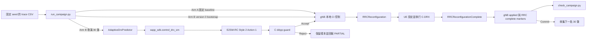
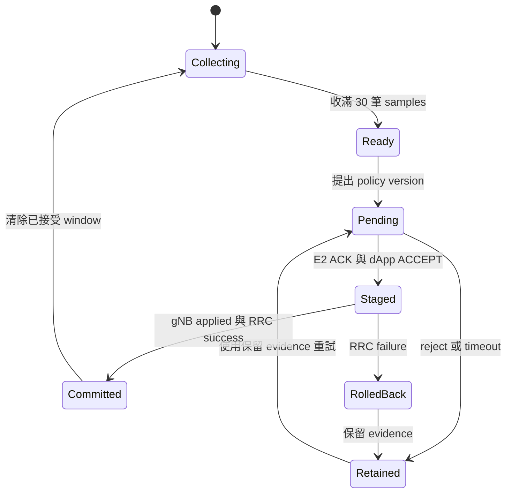

<!-- SPDX-License-Identifier: CC-BY-4.0 -->

# Adaptive C-DRX A/B 手動重建指南

**目錄**

[[_TOC_]]

## 1. 測試情境

本指南用於重建單一 RedCap UE 的 RRC_CONNECTED C-DRX 驗證。DRX 控制 UE 監聽 PDCCH 的時機，並不會讓 gNB 進入睡眠。

凍結的 v1 實驗包含四個彼此獨立的 campaign：

| Campaign | 控制組別 | 方向 |
|---|---|---|
| `arm-a-dl` | 透過 gNB 本地控制介面只套用一次固定 `drx-320-10` | Downlink |
| `arm-b-dl` | Python predictor 經 E2SM-RC 與 C dApp guard | Downlink |
| `arm-a-ul` | 透過 gNB 本地控制介面只套用一次固定 `drx-320-10` | Uplink |
| `arm-b-ul` | Python predictor 經 E2SM-RC 與 C dApp guard | Uplink |

每個 campaign 有 330 次排程到達。第 1-30 次用於 predictor warm-up，第 31-330 次才是 300 筆正式評分資料。每個正式 policy window 固定包含 30 次到達。

Arm B 使用 E2SM-RC Service Style 2、Action 1、RAN Parameter 1 傳遞 Long DRX Cycle Length。標準訊息只攜帶 UE ID 與 long cycle，因此 30-sample 統計與 bounded fallback 由 xApp 負責；C dApp guard 驗證 UE 狀態、policy version、cooldown、合法 profile 與 rollback state。



目前 evidence 已證明 focused tests、Python 3.12 可 import FlexRIC bridge，以及 E2-enabled gNB/UE build；尚未證明完整 RFsim A/B campaign或實體耗電下降。

## 2. 前置需求

所有 repository 指令都從 repository root 執行。

需要以下本地工具與 runtime services：

- Python 3.10 以上。
- CMake、Ninja、C/C++ compiler 與 OAI build dependencies。
- 支援 `--txstart-time`、`--trip-times` 與 `-R` 的 iPerf2。
- Docker Compose、可運作的 OAI CN5G、單一已連線的 RedCap RFsim UE、gNB-DU E2 node 與 nearRT-RIC。
- 解讀 iPerf2 trip-time 前，client/server clock 必須同步。
- 持續追加內容的 gNB/UE combined runtime log。

產生 evidence 前先檢查 traffic tool：

```bash
python3 --version
iperf --version
iperf --help | grep -E -- '--txstart-time|--trip-times|--reverse'
```

### 2.1 本地控制需求

gNB 必須載入 telnet CI module。Campaign runner 預設的 `127.0.0.1:9091` 只有在 runner 與 gNB 共用 network namespace 時才正確。使用目前 RFsim bridge 時，請明確指定 gNB address：

```text
--telnetsrv --telnetsrv.shrmod ci --telnetsrv.listenaddr 192.168.70.140 --telnetsrv.listenport 9091
```

兩組都需要此介面：Arm A 只套用一次 version 1；Arm B 只允許在全新、尚未配置 DRX 的狀態套用保留的 version-0 rollback bootstrap。UE 也必須在 `192.168.71.150:8091` 載入 `ciUE`，才能取得 scored Active-Time counters。

### 2.2 Arm B Python/FlexRIC 需求

FlexRIC 需要 SWIG 4.1 以上。Python wrapper、service-model plugins、RIC 與 gNB 必須一致使用 `E2AP_V3` 與 `KPM_V3_00`。請使用下列隔離 build 與專案設定，不可 fallback 到 `/usr/local/lib/flexric`：

```bash
export PYTHONPATH=/tmp/flexric-adaptive-drx-v3/src/xApp/swig
export FLEXRIC_CONF_FILE=/home/tonywang/OAI/Red_cap_openairinterface5g/ci-scripts/yaml_files/5g_rfsimulator_flexric_redcap/conf/flexric.conf
export FLEXRIC_LIBS_DIR=/tmp/flexric-adaptive-drx-v3/plugins/
swig -version
python3 -c 'import xapp_sdk; print(xapp_sdk.__file__)'
```

系統 SWIG 仍為 4.0.2，但 repository 的 `cmake_targets/swig/swig` 是 4.1.1。隔離的 `xapp_sdk` build 與 Python 3.12 import gate 已通過；必須使用該 build output，不可降低版本需求。

### 2.3 Traffic 與 control namespace 需求

Python 與 `xapp_sdk` 在 host 執行，並傳入 `--traffic-prefix "docker exec rfsim5g-oai-nr-ue1_redcap"`，只讓 iPerf2 進入 UE namespace。Host 必須可連到 gNB/UE telnet address；使用 `--execute` 前也要確認 UE image 內有 iPerf2。

### 2.4 Absolute-time replay 需求

每個 sequential campaign 前使用 `adaptive_drx.py rebase`。它會驗證來源 hash、保留每個 interval，並寫入新的 future timestamps 與 hashes。每個 campaign 仍需 fresh gNB/UE stack，確保 version 0 只作為 Arm B 初始 bootstrap。

每個獨立 campaign 都要使用全新的 gNB state，否則重新從 1 開始的 policy version 會被判定為 stale。

## 3. 編譯與 Focused Tests

編譯 gNB control surface 時要啟用 telnet server：

```bash
cmake -S . -B /tmp/oai-e2-agent-build -GNinja -DE2_AGENT=ON -DENABLE_TELNETSRV=ON
cmake --build /tmp/oai-e2-agent-build \
  --target nr-softmodem nr-uesoftmodem telnetsrv_ci telnetsrv_ciUE -j2
```

使用 repository SWIG 4.1.1 與同一套 Python 安裝來編譯 Python xApp bridge：

```bash
PYTHON_BIN=$(command -v python3)
PYTHON_INCLUDE=$(python3 -c 'import sysconfig; print(sysconfig.get_path("include"))')
PYTHON_LIBRARY=$(python3 -c 'import os,sysconfig; print(os.path.join(sysconfig.get_config_var("LIBDIR"),sysconfig.get_config_var("LDLIBRARY")))')
cmake -S openair2/E2AP/flexric -B /tmp/flexric-adaptive-drx-v3 -GNinja \
  -DXAPP_MULTILANGUAGE=ON -DUNIT_TEST=FALSE \
  -DE2AP_VERSION=E2AP_V3 -DKPM_VERSION=KPM_V3_00 \
  -DSWIG_EXECUTABLE="$PWD/cmake_targets/swig/swig" \
  -DPython3_EXECUTABLE="$PYTHON_BIN" -DPYTHON_EXECUTABLE="$PYTHON_BIN" \
  -DPYTHON_INCLUDE_DIR="$PYTHON_INCLUDE" -DPYTHON_LIBRARY="$PYTHON_LIBRARY"
cmake --build /tmp/flexric-adaptive-drx-v3 --target xapp_sdk -j2
mkdir -p /tmp/flexric-adaptive-drx-v3/plugins
find /tmp/flexric-adaptive-drx-v3/src/sm -type f -name 'lib*_sm.so' \
  -exec ln -sft /tmp/flexric-adaptive-drx-v3/plugins {} +
export PYTHONPATH=/tmp/flexric-adaptive-drx-v3/src/xApp/swig
export FLEXRIC_CONF_FILE=/home/tonywang/OAI/Red_cap_openairinterface5g/ci-scripts/yaml_files/5g_rfsimulator_flexric_redcap/conf/flexric.conf
export FLEXRIC_LIBS_DIR=/tmp/flexric-adaptive-drx-v3/plugins/
python3 -B -c 'import xapp_sdk; assert hasattr(xapp_sdk, "control_drx_sm")'
```

編譯並執行 focused C-DRX tests：

```bash
cmake --preset tests
cmake --build --preset tests --target test_nr_ue_drx test_nr_redcap_rc_ctrl test_nr_gnb_drx -j2
ctest --test-dir cmake_targets/ran_build/build_test \
  --output-on-failure \
  -R '^(test_nr_ue_drx|test_nr_redcap_rc_ctrl|test_nr_gnb_drx)$'
```

執行 deterministic trace、predictor 與 checker tests：

```bash
python3 -B agent_doc/Project_management/projects/redcap_dapp_xapp_sdk_test_validation_v1/scripts/adaptive_drx/test_adaptive_drx.py -v
python3 -B agent_doc/Project_management/projects/redcap_dapp_xapp_sdk_test_validation_v1/scripts/adaptive_drx/test_campaign_evidence.py -v
```

預期結果是三個 CTest targets、10 個 adaptive Python tests 與 3 個 evidence tests 全部通過。這些結果屬於 implementation checks，不是 RFsim campaign evidence。

## 4. 產生 Deterministic Trace

選擇並記錄 trace seed。Arm A 固定為 `drx-320-10`，沒有 profile seed；start epoch 必須在未來：

```bash
RUN_ID=$(date +%F_%H-%M-%S)
RUN_DIR="test_log/runtime_logs/adaptive_drx_${RUN_ID}"
START_EPOCH_US=$(date -d '+10 minutes' +%s%6N)
mkdir -p "$RUN_DIR"

python3 -B agent_doc/Project_management/projects/redcap_dapp_xapp_sdk_test_validation_v1/scripts/adaptive_drx/adaptive_drx.py generate \
  --output-dir "$RUN_DIR" \
  --trace-seed 41 \
  --start-epoch-us "$START_EPOCH_US"
```

此指令會產生：

- `adaptive_drx_campaign_manifest_v1.json`
- `adaptive_drx_downlink_trace.csv`
- `adaptive_drx_uplink_trace.csv`

檢查 population 並記錄 trace hashes：

```bash
wc -l "$RUN_DIR"/adaptive_drx_*_trace.csv
sha256sum "$RUN_DIR"/adaptive_drx_*_trace.csv
grep -E '"(trace_seed|initial_profile|id)"' "$RUN_DIR/adaptive_drx_campaign_manifest_v1.json"
```

每個 CSV 必須有 331 行：一行 header 加上 330 次 arrivals。

下一個 sequential campaign 前，保留 intervals 並配置新的 future epoch：

```bash
NEXT_DIR="${RUN_DIR}_next"
python3 -B agent_doc/Project_management/projects/redcap_dapp_xapp_sdk_test_validation_v1/scripts/adaptive_drx/adaptive_drx.py rebase \
  --manifest "$RUN_DIR/adaptive_drx_campaign_manifest_v1.json" \
  --output-dir "$NEXT_DIR" \
  --start-epoch-us "$(date -d '+10 minutes' +%s%6N)"
```

## 5. 規劃並執行 A/B Campaigns

### 5.1 在不宣稱 RFsim 結果的情況下產生 command plans

設定可由 UE data path 到達的 iPerf2 server address。Planning mode 寫完 330-command JSONL 後會刻意用 status 2 結束，因為此時沒有 runtime evidence：

```bash
IPERF_SERVER=192.168.72.135
UE_PDU_ADDRESS=10.0.0.2

for CAMPAIGN in arm-a-dl arm-b-dl arm-a-ul arm-b-ul; do
  python3 -B agent_doc/Project_management/projects/redcap_dapp_xapp_sdk_test_validation_v1/scripts/adaptive_drx/run_campaign.py \
    --manifest "$RUN_DIR/adaptive_drx_campaign_manifest_v1.json" \
    --campaign-id "$CAMPAIGN" \
    --server "$IPERF_SERVER" \
    --bind-address "$UE_PDU_ADDRESS" \
    --command-plan "$RUN_DIR/${CAMPAIGN}.plan.jsonl"
  test "$?" -eq 2
done

wc -l "$RUN_DIR"/*.plan.jsonl
```

每份 plan 必須有 330 筆 JSON records。`[PLAN]` 後接 `[BLOCKED]` 是 plan-only 的預期結果，不可改寫為 PASS。

### 5.2 啟動常駐 iPerf2 server

在 external data-network namespace 執行 server，並讓它在單一 campaign 期間持續運作：

```bash
iperf -s -u -i 1
```

UE-side runner 在 uplink 使用 normal mode，在 downlink 使用 `-R` reverse mode。使用 `--launch-lead-ms 250` 時，UL 會提前 250 ms 啟動 client，並由 `--txstart-time` 控制 source transmission timing。iPerf2 reverse server 不會遵守 client 的 `--txstart-time`，因此 DL 不使用 lead，會在 scheduled epoch 才啟動。不可把 process startup time 當成 arrival timestamp；generated CSV 仍是 timing source of truth。

### 5.3 準備 RFsim control surface

下列指令只會啟動 RAN/RIC services。CN5G 必須已可運作、UE 必須已有 PDU session，而且 local images 必須包含本次 source changes：

```bash
COMPOSE_DIR=ci-scripts/yaml_files/5g_rfsimulator_flexric_redcap
export REGISTRY=
export TAG=latest
export GNB_IMG=oai-gnb
export NRUE_IMG=oai-nr-ue
export MMTC_GNB_EXTRA_OPTIONS="--telnetsrv --telnetsrv.shrmod ci --telnetsrv.listenaddr 192.168.70.140 --telnetsrv.listenport 9091 --gNBs.[0].do_CSIRS 0 --gNBs.[0].do_SRS 0"

docker compose \
  -f "$COMPOSE_DIR/docker-compose.yml" \
  -f "$COMPOSE_DIR/docker-compose.mmtc.yml" \
  up -d nearRT-RIC oai-gnb oai-nr-ue1
```

在另一個 terminal 把 gNB 與 UE logs 持續追加到同一個檔案：

```bash
docker compose \
  -f "$COMPOSE_DIR/docker-compose.yml" \
  -f "$COMPOSE_DIR/docker-compose.mmtc.yml" \
  logs -f --no-color --no-log-prefix oai-gnb oai-nr-ue1 | tee -a "$RUN_DIR/runtime.log"
```

這個 topology command 不是完整 campaign wrapper。使用 `--execute` 前必須確認 namespace、PDU session、iPerf route、control port 與 xApp import。

### 5.4 執行單一 Arm A campaign

把 example RNTI 換成已連線 UE 的 C-RNTI。必須從已驗證的 UE traffic namespace 執行，並使用仍在未來的 trace：

```bash
python3 -B agent_doc/Project_management/projects/redcap_dapp_xapp_sdk_test_validation_v1/scripts/adaptive_drx/run_campaign.py \
  --manifest "$RUN_DIR/adaptive_drx_campaign_manifest_v1.json" \
  --campaign-id arm-a-dl \
  --server "$IPERF_SERVER" \
  --bind-address "$UE_PDU_ADDRESS" \
  --command-plan "$RUN_DIR/arm-a-dl.runtime.jsonl" \
  --metrics-csv "$RUN_DIR/arm-a-dl.metrics.csv" \
  --summary-json "$RUN_DIR/arm-a-dl.summary.json" \
  --traffic-prefix "docker exec rfsim5g-oai-nr-ue1_redcap" \
  --execute \
  --rnti 0x1234 \
  --gnb-control-host 192.168.70.140 \
  --gnb-control-port 9091 \
  --ue-control-host 192.168.71.150 \
  --ue-control-port 8091 \
  --runtime-log "$RUN_DIR/runtime.log" \
  --control-timeout-s 10 \
  --launch-lead-ms 250
```

獨立的 uplink campaign 使用 `arm-a-ul`。依序執行下一個 campaign 前，要用全新的 state 並執行 `rebase`。

### 5.5 執行單一 Arm B campaign

只有在 SWIG import、共用 UE-traffic/FlexRIC namespace、E2 connection 與合法 rollback baseline 都獲得證明後，才能執行這個指令。請替換 example RRC UE ID：

```bash
export PYTHONPATH=/tmp/flexric-adaptive-drx-v3/src/xApp/swig
export FLEXRIC_CONF_FILE=/home/tonywang/OAI/Red_cap_openairinterface5g/ci-scripts/yaml_files/5g_rfsimulator_flexric_redcap/conf/flexric.conf
export FLEXRIC_LIBS_DIR=/tmp/flexric-adaptive-drx-v3/plugins/
python3 -B agent_doc/Project_management/projects/redcap_dapp_xapp_sdk_test_validation_v1/scripts/adaptive_drx/run_campaign.py \
  --manifest "$RUN_DIR/adaptive_drx_campaign_manifest_v1.json" \
  --campaign-id arm-b-dl \
  --server "$IPERF_SERVER" \
  --bind-address "$UE_PDU_ADDRESS" \
  --command-plan "$RUN_DIR/arm-b-dl.runtime.jsonl" \
  --metrics-csv "$RUN_DIR/arm-b-dl.metrics.csv" \
  --summary-json "$RUN_DIR/arm-b-dl.summary.json" \
  --traffic-prefix "docker exec rfsim5g-oai-nr-ue1_redcap" \
  --execute \
  --rnti 0x1234 \
  --rrc-ue-id 17 \
  --node-index 0 \
  --gnb-control-host 192.168.70.140 \
  --gnb-control-port 9091 \
  --ue-control-host 192.168.71.150 \
  --ue-control-port 8091 \
  --runtime-log "$RUN_DIR/runtime.log" \
  --control-timeout-s 10 \
  --launch-lead-ms 250
```

獨立的 uplink campaign 使用 `arm-b-ul`。在 fresh DRX state 上，runner 會在第一個 FlexRIC request 前自動把 `drx-320-10` commit 為保留的 bootstrap version 0。重用已配置的 stack 必須失敗，不可覆寫既有 policy history。

### 5.6 收集 receiver timestamps

Campaign 前啟動一個已過濾的 capture。DL 在 UE 收包處擷取；UL 在常駐 server 收包處擷取：

```bash
# DL example；UL 改在 oai-ext-dn 使用 `udp and dst port 5001`。
docker exec rfsim5g-oai-nr-ue1_redcap \
  tcpdump -tt -n -l -i oaitun_ue1 'udp and src port 5001' \
  > "$RUN_DIR/arm-b-dl.receive.tcpdump.log" &
CAPTURE_PID=$!
```

Campaign 後停止 capture，並把每個 scored trace window 的第一個 packet 轉成 CSV：

```bash
kill "$CAPTURE_PID"
python3 -B agent_doc/Project_management/projects/redcap_dapp_xapp_sdk_test_validation_v1/scripts/adaptive_drx/adaptive_drx.py receive-csv \
  --manifest "$RUN_DIR/adaptive_drx_campaign_manifest_v1.json" \
  --campaign-id arm-b-dl \
  --capture-log "$RUN_DIR/arm-b-dl.receive.tcpdump.log" \
  --output "$RUN_DIR/arm-b-dl.receive.csv"
```

Capture 只能包含該 campaign 的 inbound iPerf2 UDP data；缺少或超出 window 的 timestamp 維持 `[PARTIAL]`。

## 6. 驗證 Evidence

每個 campaign 都要分開驗證：

```bash
python3 -B agent_doc/Project_management/projects/redcap_dapp_xapp_sdk_test_validation_v1/scripts/adaptive_drx/check_campaign.py \
  --manifest "$RUN_DIR/adaptive_drx_campaign_manifest_v1.json" \
  --campaign-id arm-b-dl \
  --metrics-csv "$RUN_DIR/arm-b-dl.metrics.csv" \
  --receive-csv "$RUN_DIR/arm-b-dl.receive.csv" \
  --summary-json "$RUN_DIR/arm-b-dl.summary.json" \
  --rnti 0x1234 \
  --log "$RUN_DIR/runtime.log"
```

Runtime PASS 必須同時具有 300 筆不重複的 scored records、十個各自對應 30 筆 records 的 policy versions、符合 trace 的 source timestamps、合法 profiles，以及依 policy version 完整關聯的 required markers。

Arm B 需要以下 marker chain：

```text
[RedCap DRX][xApp request]
[RedCap DRX][E2 ACK]
[RedCap DRX][dApp ACCEPT]
[RedCap DRX][gNB applied]
[RedCap DRX][RRC complete] ... outcome success
```

Combined evidence 也必須包含 `Configured Connected DRX` 與 `Received RRCReconfigurationComplete`。缺少資料或 marker 時只能是 `[PARTIAL]` 或 `[BLOCKED]`，不可判定 PASS。

目前凍結的 implementation evidence：

- `test_log/build_logs/build_e2_agent_telnet_gnb_ue_2026-07-11_16-02-bootstrap-metrics.log`
- `test_log/build_logs/build_xapp_sdk_2026-07-11_15-13-45_swig411.log`
- `test_log/compiler_logs/xapp_sdk_import_2026-07-11_15-13-45_swig411.log`
- `test_log/compiler_logs/ctest_adaptive_drx_final_2026-07-11_01-04-00.log`
- `test_log/compiler_logs/test_adaptive_drx_python_2026-07-11_00-57-00.log`

這些檔案只證明 build 與 focused tests。目前沒有已接受的四組 campaign runtime result。

## 7. Rollback

gNB 會保存前一個已套用的 profile。RRC reconfiguration 回報失敗時，`nr_gnb_drx_fail_reconfiguration()` 會還原前一個 scheduler profile，handler 會輸出：

```text
[RedCap DRX][rollback]
[RedCap DRX][RRC complete] ... outcome failure
```

內部 `nr_mac_rollback_drx_policy()` 可以用新的 version 重新 stage 已保存的 previous profile，但目前沒有 campaign-runner 或 telnet command 對外提供此函式。不可自行發明 manual rollback command。需要 operator-triggered recovery 時，應停止 campaign、保存 trace、JSONL、metrics 與 logs，然後使用全新的 topology。

合法 v1 profiles 會關閉 optional DRX Command MAC CE。它不是 rollback 機制，也不可拿來取代 RRC reconfiguration。



## 8. 疑難排解

| 現象 | 意義與處理方式 |
|---|---|
| 系統 `SWIG Version 4.0.2` | 使用 build section 記錄的 repository SWIG 4.1.1；不可降低 requirement。 |
| `No module named xapp_sdk` | 讓 `PYTHONPATH` 指向同一 interpreter 可使用的 FlexRIC Python build output。 |
| RIC/xApp 在 E42 setup 或 control 時 crash | 很可能是 v2/v3 wrapper-plugin mismatch。確認 CMake cache 為 `E2AP_V3` 與 `KPM_V3_00`，再 export Section 2.2 的精確 `PYTHONPATH`、`FLEXRIC_CONF_FILE` 與 `FLEXRIC_LIBS_DIR`。不可混用 v3 wrapper 與 `/usr/local/lib/flexric` 下的 v2 plugins。 |
| Reverse DL 在 scheduled epoch 前送出，或 receiver 只有 299 筆 timestamps | 使用目前 runner 與 `--launch-lead-ms 250`。Lead 只套用於 UL；reverse DL 必須在 `scheduled_source_tx_time_us` 才啟動。不可替 DL 加入通用 lead，也不可修改 trace。 |
| `first --txstart-time is not in the future` | 使用 future epoch 執行 `rebase`，不可手動修改 trace rows。 |
| gNB control connection refused | 啟用 `telnetsrv`、載入 `shrmod ci`，並傳入可到達的 gNB address 與 port。 |
| `rollback_unavailable` | 從 fresh DRX state 啟動，讓 runner 的保留 version-0 bootstrap 完成。 |
| `stale_policy_version` | 每個 campaign 使用全新 gNB state，或使用嚴格遞增的 correlated request ID。 |
| `[RedCap DRX][control timeout]` | 保留 30-sample window，確認缺少 request、ACK、decision、applied 或 completion 中的哪一個 marker。 |
| iPerf 無法連到 server | 從 UE data namespace 執行 client，並確認 PDU session 與 route。 |
| Plan command 回傳 2 | Plan-only 的預期結果；不屬於 runtime evidence。 |
| Checker 回傳 PARTIAL | 保存全部 artifacts，並精確記錄缺少的 policy version 或 marker。 |

RFsim 可以提供 PDCCH-monitoring 與 DRX-active-time proxies，但不能證明實體 UE power consumption。

## 9. Trace Code Guide

請依以下順序追蹤一個成功的 Arm B policy：

| 步驟 | File 與 symbol | Input | Output 或 marker | 下一個 trace point |
|---|---|---|---|---|
| 1 | `scripts/adaptive_drx/adaptive_drx.py`: `write_campaign_manifest()` / `rebase_campaign_manifest()` | Trace seed 與 future epoch | Manifest 與 paired/rebased DL/UL CSVs | `run_campaign.main()` |
| 2 | `scripts/adaptive_drx/run_campaign.py`: `main()` | 單一 campaign 與 30 intervals | 固定 Arm A baseline 或 adaptive intent | `AdaptiveDrxPredictor.propose()` 或 local CI control |
| 3 | `adaptive_drx.py`: `AdaptiveDrxPredictor.propose()` | 固定 30 samples | Statistics 與合法 long-cycle request | `xapp_sdk.control_drx_sm()` |
| 4 | `openair2/E2AP/flexric/src/xApp/swig/swig_wrapper.cpp`: `control_drx_sm()` | RRC UE ID 與 long cycle | E2SM-RC control request | `write_ctrl_rc_sm()` |
| 5 | `openair2/E2AP/RAN_FUNCTION/O-RAN/ran_func_rc.c`: `write_ctrl_rc_sm()` | Style 2 / Action 1 message | xApp request 與 E2 ACK markers | `apply_redcap_drx_control()` |
| 6 | `openair2/E3AP/sdk/redcap_dapp_sdk.c`: `redcap_dapp_guard_e2_drx_cycle()` | Version、UE state、cycle、rollback state | dApp ACCEPT 或 REJECT | `nr_mac_apply_drx_policy()` |
| 7 | `openair2/LAYER2/NR_MAC_gNB/gNB_scheduler_primitives.c`: `nr_mac_apply_drx_policy()` | Accepted profile | Staged CellGroup reconfiguration | UE `configure_drx()` |
| 8 | `openair2/LAYER2/NR_MAC_UE/config_ue.c`: `configure_drx()` | RRC `DRX-Config` | `Configured Connected DRX` | UE Active Time functions |
| 9 | `openair2/LAYER2/NR_MAC_gNB/mac_rrc_dl_handler.c` | RRC completion result | gNB applied、RRC complete 或 rollback marker | `check_campaign.check()` |
| 10 | `scripts/adaptive_drx/check_campaign.py`: `check()` | Manifest、metrics/receive CSVs、summary、log | PASS、PARTIAL 或 BLOCKED | 保存 evidence package |
