# 5G Reduced Capability Devices: Analysis of Blocking Probability for Control Channels

Saeedeh Moloudi†, Mohammad Mozaffari‡, Kittipong Kittichokechai†, Andreas Hoglund ¨ †, Sandeep Narayanan Kadan Veedu†, Y.-P. Eric Wang‡, and Johan Bergman§

†Ericsson Research, Sweden, E-mails: {saeedeh.moloudi,

sandeep.narayanan.kadan.veedu, kittipong.kittichokechai, andreas.hoglund}@ericsson.com ‡Ericsson Research, Silicon Valley, Santa Clara, CA, USA,

E-mails: {mohammad.mozaffari, eric.yp.wang}@ericsson.com

§Ericsson Business Unit Networks, Sweden, E-mail: johan.bergman@ericsson.com

Abstract—The fifth-generation wireless technology is primarily designed to address a wide range of use cases mainly categorized into the enhanced mobile broadband, ultra-reliable and low-latency communication, and massive machine-type communication segments. To efficiently serve some other use cases whose requirements lie in-between these main use cases, the 3rd generation partnership project (3GPP), in Rel-17, introduce support for the reduced capability new radio (NR) devices known as RedCap with lower cost and complexity compared to legacy 5G devices. The considered complexity reduction techniques are associated with degraded link performance and coverage for the physical channels. Particularly, for the physical downlink control channel (PDCCH), which requires careful consideration, the reduction of the user equipments’ (UEs) complexity and the associated coverage loss can lead to an increase in the PDCCH blocking probability. This, in turn, can impact either the latency or the network capacity depending on the scenario. In this paper, we investigate the PDCCH blocking probability metric for RedCap devices. Specifically, we evaluate the performance of blocking probability in terms of various parameters including the number of users, size of downlink control information, size of control resource set, and the number of PDCCH candidates. Our results demonstrate that the PDCCH blocking probability increases by reducing the number of antenna branches, the number of PDCCH candidates, control resource set, and by increasing the number of scheduled UEs. We also show that the impact of reducing the DCI size is marginal on the PDCCH blocking probability. Finally, we discuss potential solutions and design guidelines for reducing the PDCCH blocking probability.

## I. INTRODUCTION

The fifth generation (5G) wireless technology, introduced in Rel-15 by the 3rd generation partnership project (3GPP), is mainly intended for supporting a wide range of use cases including enhanced mobile broadband (eMBB) and ultra-reliable and low-latency communication (URLLC) [1], [2]. Meanwhile, massive machine-type communication (mMTC) use cases are supported by the low-power wide-area network (LPWAN) solutions, such as Long-Term Evolution for Machine-type communications (LTE-M) and Narrowband Internet-of-Things (NB-IoT) [3], [4]. In Rel-17, 3GPP introduce support for a new NR user equipment (UE) with reduced capability (called RedCap UEs) to address use cases with requirements that fall between those of eMBB NR and NB-IoT/LTE-M [5], [6]. For example, RedCap UEs address the mid-range use cases whose requirements on throughput and latency are higher than LPWA (i.e., LTE-M/NB-IoT) but lower than URLLC and eMBB.

Several cost and complexity reduction features were studied for supporting RedCap UEs including the reduction of the number of UE receiver (Rx) antenna branches and the maximum UE bandwidth [5], [6]. However, one potential drawback of the cost and complexity reduction in RedCap UEs is performance and coverage loss [5], [7]. The impact of the complexity reduction is not identical on different physical channels and is more considerable on downlink (DL) channels, including physical downlink control channel (PDCCH). As an example, for the considered deployment scenario with the carrier frequency of 2.6 GHz, the performance degradation for PDCCH (at 1% block error rate (BLER)) caused by reducing the number of Rx branches from 4 for the legacy UE to 1 for RedCap UE is 6.2 dB [7]. This means that for RedCap UEs with a given PDCCH BLER performance target, higher aggregation levels (ALs) of PDCCH transmissions may be needed to compensate for the performance loss. However, using a higher AL may lead to an increase of the so-called PDCCH blocking probability which is a key system performance evaluation metric for the control channel.

PDCCH blocking probability indicates the percentage of UEs that cannot be simultaneously scheduled by the network for receiving the downlink control information (DCI). This probability impacts the latency and the network capacity which are critical metrics in cellular networks. Therefore, it is important to ensure an acceptable PDCCH blocking probability in various deployment scenarios. Despite the importance of the PDCCH blocking rate in 5G systems, it has not been widely studied in the literature. Among a few existing studies, the work in [8] proposes an enhanced search space design for NR PDCCH to reduce the PDCCH blocking rate. In [9], the authors evaluate the PDCCH blocking rate for normal NR UEs in terms of various system parameters and discuss several tradeoffs. In this paper, we investigate the PDCCH blocking probability for RedCap UEs considering their specific features such as the reduced number of Rx antenna branches and maximum bandwidth. In particular, we present comprehensive link-level and system-level evaluations as well as key procedures needed for deriving the PDCCH blocking rate. Our results shed light on the important affecting factors on the blocking rate and solutions for alleviating the PDCCH blocking in 5G networks supporting UEs with different capabilities.

TABLE I. USE CASE SPECIFIC REQUIREMENTS FOR REDCAP  
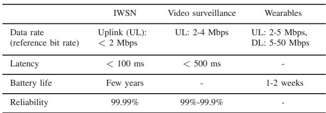

## II. NEW RADIO REDUCED CAPABILITY DEVICES (NR-REDCAP)

NR-RedCap UEs are introduced to address the use cases whose requirements are in between those of the eMBB, URLLC, or mMTC. In Rel-17, 3GPP envisioned three main use cases for RedCap, namely sensors in industrial wireless sensor networks (IWSN), video surveillance cameras, and wearables [5], [6]. The considered requirements for these use cases are summarized in Table I, including the data rate, latency, battery life and reliability.

The complexity reduction features that will be specified for RedCap UEs in Rel-17 are reduced number of UE Rx antenna branches and downlink MIMO layers, UE bandwidth reduction, half-duplex FDD, and relaxed maximum modulation order in downlink for frequency range 1 (FR1). Among these complexity reduction features, reducing the number of Rx branches is one of the key factors with potential impact on the performance and coverage of PDCCH. Therefore, the PDCCH blocking rate can be affected mainly by this complexity reduction feature. It should be noted that for all frequency bands where a legacy UE is required to be equipped with a minimum of either 2 Rx or 4 Rx antenna branches, the minimum number of Rx branches supported by the specification for a RedCap UE is 1 [6].

## III. PDCCH BLOCKING PROBABILITY

## A. Brief overview of NR control channel

PDCCH carries DCI for various purposes, such as uplink and downlink data transmission resource scheduling, uplink power control indication, slot format indication, etc.

The encoded and modulated DCI is mapped to resource elements (REs) in a structured format. A set of time-frequency physical resources that is used to transmit DCI is called a Control Resource Set (CORESET). In the time domain, a CORESET can span over at most three contiguous orthogonal frequency-division multiplexing (OFDM) symbols. In the frequency domain, it spans over several resource blocks (RBs), with each RB comprising of 12 subcarriers. Each PDCCH candidate is transmitted by using a number of—1, 2, 4, 8, or 16—control channel elements (CCEs), where this number is known as the aggregation level (AL). A CCE consists of 6 resource element groups (REGs), and each REG is 12 REs in one OFDM symbol, as illustrated in Fig. 1. Within a CORESET, multiple PDCCH candidates, each with a specific AL, according to a search space are defined for transmitting DCI. For example, within a CORESET of size 8 CCEs (as illustrated in Fig. 2) and a given search space, there can be one PDCCH candidate of AL 8, two candidates of AL 4, four candidates of AL 2, and eight candidates of AL 1. Also, the positions of PDCCH candidates within a CORESET are determined based on a hash function [10]. Specifically, the index of the first CCE for a PDCCH candidate with AL L is given by:

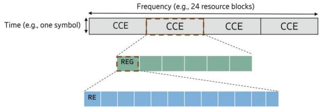

Fig. 1. Illustrative example of a CORESET with 24 RBs and one symbol.  
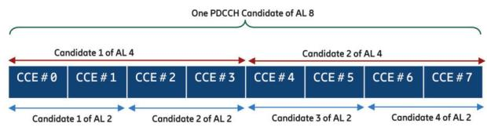  
Fig. 2. Different PDCCH candidates within a CORESET with size of 8 CCEs.

$$
\tag{1}
$$

where k ∈ {0, ..., M − 1} is the index of a PDCCH candidate of AL L with M being the number of PDCCH candidates for AL L. Also, Y is a constant integer value which depends on the search space and UE identification number, and ⌊.⌋ is the floor function and mod represents the modulo operation.

## B. PDCCH blocking probability

PDCCH blocking probability is defined as the probability of all PDCCH candidates scheduled for a UE being blocked (or overlapped) by candidates used by other UEs. That is, blocking probability is the ratio between the number of the blocked UEs over the number of all UEs that need to be simultaneously scheduled.

$$
\tag{2}
$$

where α is the number of blocked users and β is the total number of scheduled users.

Note that PDCCH blocking probability depends on various factors, such as the number of UEs which need to be scheduled (this may depend on the traffic), CORESET size (i.e., number of CCEs), number of PDCCH candidates, PDCCH link performance/coverage (which affects the required AL), as well as the UE capability in terms of supported blind decoding and CCE limits. In addition, the PDCCH blocking probability is affected by the network scheduling flexibility/strategy. In principle, the blocking probability is a function of load, network configuration, UE capability, and deployment scenario. In the following, we describe our simulation setup, assumption, and key steps needed for evaluating the PDCCH blocking rate.

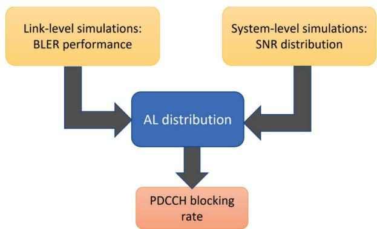  
Fig. 3. Steps toward obtaining the PDCCH blocking rate.

## IV. SIMULATION SETUP

Fig. 3 shows our steps for obtaining the PDCCH blocking probability. We have first performed extensive link-level simulations (LLSs) and system-level simulations (SLSs) to obtain the PDCCH BLER performance and UE received signal-tointerference-and-noise (SINR) distribution, respectively. Then, we have combined our results of the link BLER performance together with those of the SINR distribution to obtain the AL distribution. This distribution is used to investigate the PDCCH blocking rate. In the following subsections, we have summarized our steps for obtaining the PDCCH blocking rate.

As it is expected that the PDCCH blocking rate is different for different frequency bands, we have investigated the blocking rate in both FR1 and frequency range 2 (FR2) bands. Due to the space limitations, for each of the frequency range, we have decided to keep the scope of the paper within carrier frequency choices based on 3GPP agreements [5] i.e., 2.6 GHz for FR1 and 28 GHz for FR2.

## A. Link level simulations

Our assumptions for LLSs of PDCCH are shown in Table II, and the BLER performance results for FR1 and FR2 are shown in Fig. 4 and Fig. 5, respectively. Note that the simulation parameters are selected based on 3GPP agreements for Rel-17 RedCap UEs study [5]. As it can be seen in the figures, for both FR1 and FR2, for a given BLER performance the required SNR increases by reducing the number of Rx branches, as an example, for the FR1 deployment and aggregation level of 16, the performance degradation for PDCCH at 1% BLER caused by reducing the number of Rx branches from to 2 and 1 is approximately 9 dB. However, the performance degradation caused by reducing the number of Rx antenna branches from 2 to 1, can be almost compensated by increasing the AL from i to 2i (i = 1, 2, 4, 8).

## B. SINR distribution

Our assumptions for SLSs are shown in Table III. In our simulations, we have assumed that 25% of UEs in the network are RedCap UEs (with either 1 Rx or 2 Rx antenna branches) and 75% are legacy NR UEs. In FR1, the legacy UEs are assumed to have 4 Rx antenna branches and maximum bandwidth of 100 MHz. Likewise, in FR2, the legacy UEs are assumed to have 2 Rx antenna branches and maximum bandwidth of 200 MHz. The received SINR distribution of DL transmission for both FR1 and FR2 scenario are shown in Fig. 6. As it can be seen in the figure, by reducing the number of Rx antenna branches from 2 to 1, there is an approximately 3 dB shift of the SINR distribution to the left.

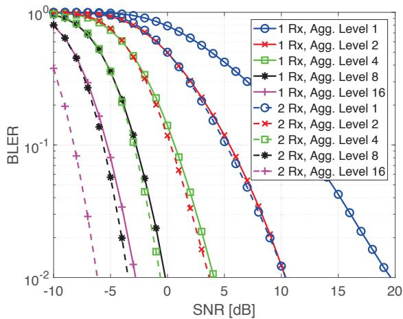  
Fig. 4. BLER Performance of PDCCH Channels, DCI 40 bits, 2.6 GHz.

## C. AL distribution

Considering the BLER performance target of 1% together with the LLS results and SINR distributions, we have obtained a distribution for the needed AL. Fig. 7 and Fig. 8 show the AL distribution for FR1 and FR2 scenarios, respectively. As can be seen from the figures, by reducing the number of Rx antenna branches, while the probability of using AL of 1 decreases, the probability of needing the higher ALs increases. This is expected as the required SNR to reach the same BLER target is higher for the case of smaller number of Rx antenna branches, or in other words, the UE with smaller number of Rx antenna branches requires more PDCCH resources (higher AL) to reach the same BLER target at the same SNR value. This phenomenon, in turn, impacts the PDCCH blocking probability. Therefore, in the next section we quantitatively investigate the impact of reducing the number of Rx branches

TABLE II. LINK-LEVEL SIMULATIONS ASSUMPTIONS.  
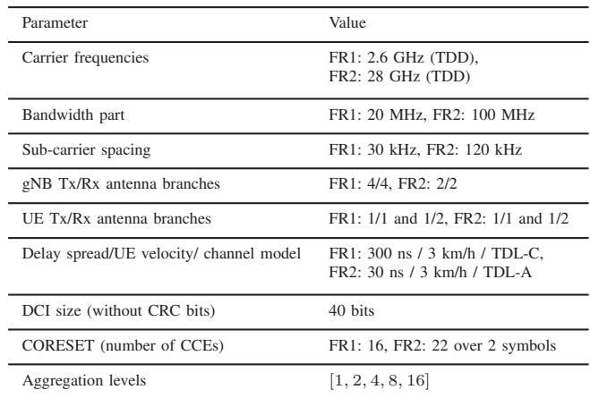

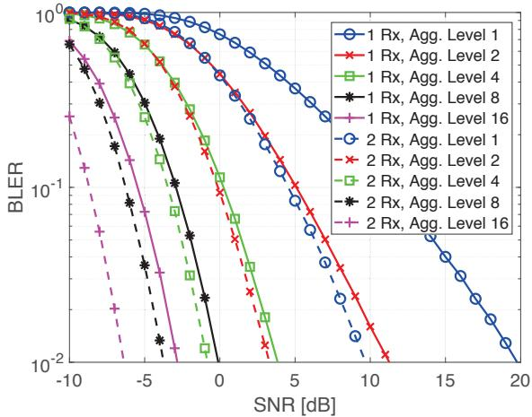  
Fig. 5. BLER Performance of PDCCH Channels, DCI 40 bits, 28 GHz.

TABLE III. SYSTEM-LEVEL SIMULATIONS ASSUMPTIONS.  
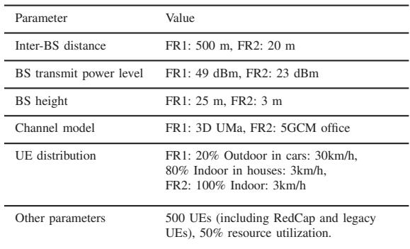

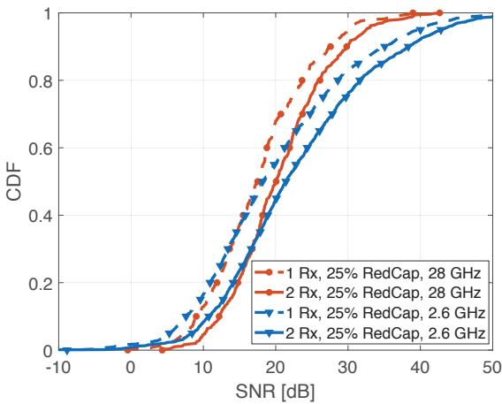  
Fig. 6. SINR distribution, considering 25% RedCap UEs and 75% legacy UEs in the network.

on PDCCH blocking rate.

## V. SIMULATION RESULTS AND ANALYSIS

In this section, we present our simulation results for PDCCH blocking probability and investigate the impact of the different parameters including the number of Rx antenna branches, the number of simultaneously scheduled UEs, DCI size, the number of PDCCH candidates, and CORESET size on PDCCH blocking probability. In all presented results, we have investigated the PDCCH blocking probability in a network in which the 25% of the UEs are RedCap UEs while the other 75% are legacy UEs. The PDCCH blocking probability evaluations were done using a MATLAB-based simulator.

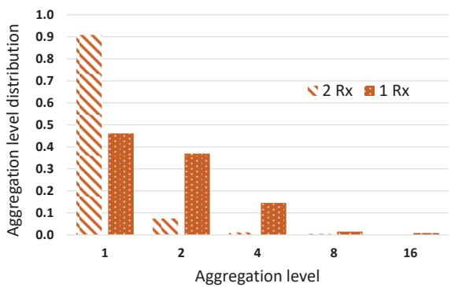  
Fig. 7. SINR distribution, considering 25% RedCap UEs and 75% legacy UEs in the network, FR1.

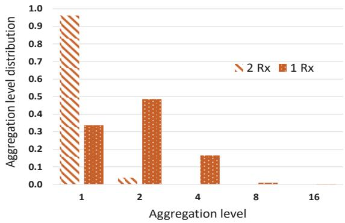  
Fig. 8. SINR distribution, considering 25% RedCap UEs and 75% legacy UEs in the network, FR2.

## A. Impact of number of UEs and the number of Rx branches

Fig. 9 shows the PDCCH blocking probability as a function of the number of scheduled UEs for the two considered FR1 and FR2 scenarios. In this figure, we also compare the blocking probabilities for RedCap UEs with 1 Rx branch and 2 Rx branches, respectively. To obtain these results, we have considered that the number of PDCCH candidates for ALs 1, 2, 4, 8, and 16 are respectively 6, 5, 4, 2, and 1 for FR1 deployment and 4, 3, 1, 1, 1 for FR2 deployment. As can be seen, by scheduling more UEs in a CORESET, the blocking probability increases. For example, for the FR1 deployment and 1 Rx branch, by increasing the number of UEs from 10 to 20, the blocking probability increases from 0.17 to 0.5.

Reducing the number of Rx antenna branches leads to an increase in the blocking probability in both FR1 and FR2 cases. Moreover, by increasing the number of scheduled UEs, the impact of reducing the number of Rx antenna branches on the PDCCH blocking probability gets more considerable.

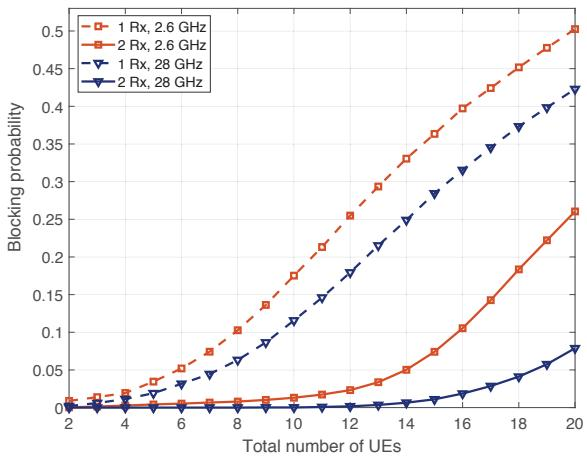  
Fig. 9. PDCCH blocking probability versus number of simultaneously scheduled UEs, DCI size of 40 bits.

However, it is worth mentioning that the number of simultaneously scheduled UEs can be low, e.g., between 1 and 5, in real deployments. As shown in the figures, for the operational region of 1–5 scheduled UEs, the impact from reducing the number of Rx branches on the PDCCH blocking probability is small. As an example, for the case of 5 simultaneously scheduled UEs, the PDCCH blocking probability is still less than 3.5% at 2.6 GHz and less than 2% at 28 GHz even for 1 Rx antenna branch.

## B. DCI size

To decrease the PDCCH blocking probability, one possible optimization is to consider DCI formats with smaller sizes. For a given performance target, by significantly reducing the DCI size, a smaller AL can potentially be used, and consequently, the PDCCH blocking can decrease.

Fig. 10 and Fig. 11 show the comparison between PDCCH blocking probabilities for different DCI sizes at a carrier frequency of 2.6 GHz and 28 GHz, respectively. Reducing the DCI size can improve the PDCCH blocking rate. However, this improvement is not very significant, and it cannot fully compensate for the increase in the blocking rate caused by reduction of the number of Rx antenna branches. For example, for a network operating in FR1 with 1 Rx branch RedCap UEs and 5 simultaneously scheduled UEs, even by reducing the DCI size by half (from 40 bits to 20 bits), the blocking probability only reduces from 3.5% to 2.1%.

## C. Number of PDCCH candidates

Here, we investigate the impact of the number of PDCCH candidates on PDCCH blocking rate. For each of the two FR1 and FR2 deployments, we have considered three different sets for the number of PDCCH candidates including {8, 8, 4, 2, 1}, {4, 4, 2, 1, 1}, and {1, 1, 1, 1, 1} where in each set the i-th element is associated with i-th AL in {1, 2, 4, 8, 16}.

In Fig. 12 and Fig. 13, PDCCH blocking rate is shown respectively for FR1 and FR2 deployments considering the above-mentioned sets for the number of candidates. Based on these results, reducing the number of candidates, especially for small ALs, leads to an increase in the blocking probability. It is worth mentioning that these results can also be seen as the trade-off between scheduling flexibility (blocking performance) on one side and UE complexity and UE power consumption in terms of the number of blind decoding attempts on the other side. As an example, for a given blocking rate, a UE with a reduced number of Rx branches should monitor more PDCCH candidates to achieve the same desired blocking rate. This means that it is possible to compensate for the impact of the reduced number of antenna branches on the blocking rate by increasing the number of PDCCH candidates.

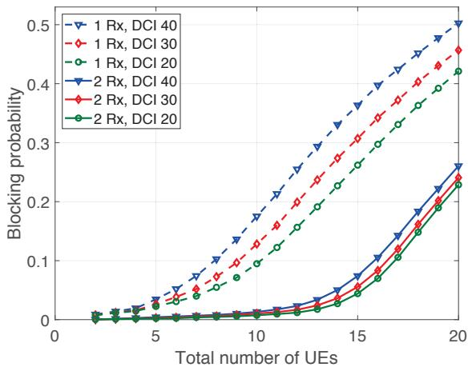

Fig. 10. PDCCH blocking probability for DCI sizes of 20, 30, and 40 bits, FR1.  
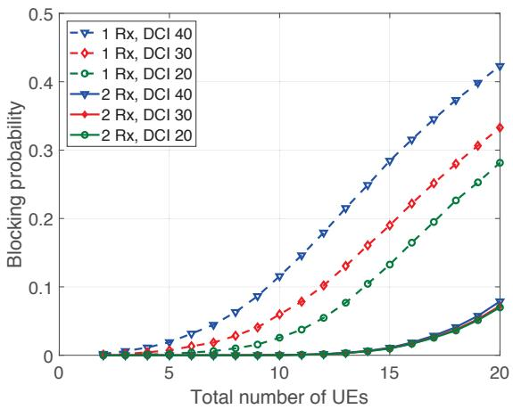  
Fig. 11. PDCCH blocking probability for DCI sizes of 20, 30, and 40 bits, FR2.

## D. CORESET size

To investigate the impact of CORSET size on PDCCH blocking rate, for each of the FR1 and FR2 deployment scenario, we have considered 1 Rx antenna branch, total number of 7 simultaneously scheduled UEs, and set of {8, 8, 4, 2, 1} associated with the number of PDCCH candidates with ALs of 1, 2, 4, 8, 16. Fig. 14 shows the PDCCH blocking rate for different CORESET sizes with the number of 16, 20,

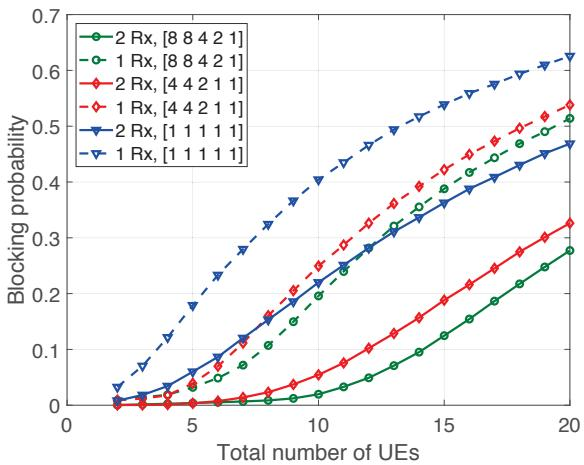  
Fig. 12. PDCCH blocking probability for different numbers of PDCCH candidates, DCI size of 40 bits, FR1.

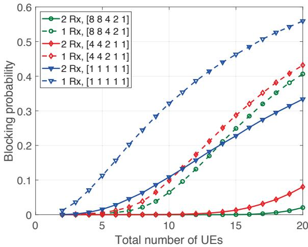  
Fig. 13. PDCCH blocking probability for different numbers of PDCCH candidates, DCI size of 40 bits, FR2.

24 CEEs for the FR1 case and the number of 16, 20, 24, 28, and 32 CCEs for the FR2 case. As shown, PDCCH blocking rate decreases by increasing the CORESET size.

## VI. CONCLUSIONS

In this paper, we have investigated the PDCCH blocking probability for a network in which multiple RedCap and legacy UEs are scheduled. We have performed both LLSs and SLSs and combined the results to obtain the PDCCH blocking probability. We have also investigated the impact of several parameters on the blocking probability including the number of UE Rx branches, the number of simultaneously scheduled UEs, DCI size, different numbers of PDCCH candidates, and CORESET size. Our results demonstrate that by reducing the number of Rx branches for RedCap UEs, the PDCCH blocking probability increases in the network, and although its value may get considerable for a large number of simultaneously scheduled UEs, for the realistic load the impact is insignificant. For example, in all considered scenarios even with 1 Rx branch the PDCCH blocking is limited to less than 3.5% for realistic cases with 5 or fewer simultaneous users. Therefore, for the studied Rel-17 RedCap UEs, PDCCH blocking rate is not a practical issue. However, considering further enhancement of RedCap UEs in the next releases, it is useful to consider potential optimizations and impact of different parameters on reducing PDCCH blocking probability. Our results show that the impact of reducing the DCI size on the PDCCH blocking rate is marginal and by increasing the number of PDCCH candidates, the blocking probability decreases. The latter impact is more noticeable for increasing the number of candidates with small ALs. To reduce the PDCCH blocking probability besides solutions such as increasing CORESET size, increasing the number of PDCCH candidates, and significantly reducing the DCI size, other solutions such as scheduling strategies, and dedicated CORESET for RedCap UEs can be effective.

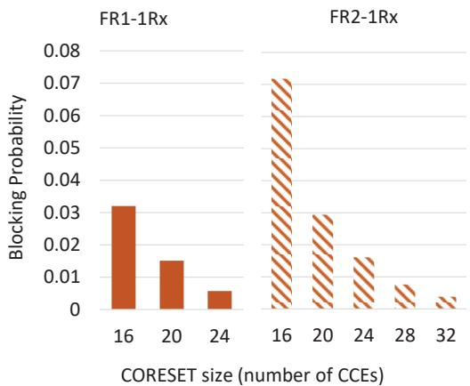  
Fig. 14. PDCCH blocking probability for different CORESET size.

## REFERENCES

[1] E. Dahlman, S. Parkvall, and J. Skold, “5G NR: The next generation wireless access technology,” Academic Press, , 2018.

[2] S. Ahmadi, “5G NR: Architecture, Technology, Implementation, and Operation of 3GPP New Radio Standards,” Academic Press, 2019.

[3] GSMA, “Mobile IoT in the 5G future-NB-IoT and LTE-M in the context of 5G,” White paper, 2018.

[4] O. Liberg, M. Sundberg, E. Wang, J. Bergman, and J. Sachs, “Cellular Internet of Things: Technologies, Standards, and Performance.” Academic Press, 2017.

[5] 3GPP TR 38.875, “Study on support of reduced capability NR devices (Release 17),” Dec. 2020.

[6] 3GPP Tdoc RP-211574, Ericsson, “New WID on support of reduced capability NR devices,” June 2021.

[7] S. Moloudi, M. Mozaffari, S. N. K. Veedu, K. Kittichokechai, Y.-P. Eric Wang, J. Bergman, and A. Hoglund, “Coverage evaluation for 5G ¨ reduced capability new radio (NR-RedCap),” IEEE Access, vol. 9, pp. 45055–45067, 2021.

[8] V. Braun, K. Schober, and E. Tiirola, “5G NR physical downlink control channel: Design, performance and enhancements,” in 2019 IEEE Wireless Communications and Networking Conference (WCNC), 2019, pp. 1–6.

[9] M. Mozaffari, Y.-P. E. Wang, and K. Kittichokechai, “Blocking probability analysis for 5G new radio (NR) physical downlink control channel,” in ICC 2021 - IEEE International Conference on Communications, 2021, pp. 1–6.

[10] 3GPP TS 38.213, “NR; physical layer procedures for control,” V16.6.0, 2021.