Received February 23, 2021, accepted March 3, 2021, date of publication March 15, 2021, date of current version March 26, 2021. Digital Object Identifier 10.1109/ACCESS.2021.3066036

# Coverage Evaluation for 5G Reduced Capability New Radio (NR-RedCap)

SAEEDEH MOLOUDI MOHAMMAD MOZAFFARI2, SANDEEP NARAYANAN KADAN VEEDU3, KITTIPONG KITTICHOKECHAI3, Y.-P. ERIC WANG2, JOHAN BERGMAN4, AND ANDREAS HÖGLUND3

1Ericsson Research, 58 112 Linköping, Sweden

2Ericsson Research, Santa Clara, CA 95054, USA

3Ericsson Research, 164 83 Stockholm, Sweden

4Ericsson Business Unit Networks, 164 80 Stockholm, Sweden

Corresponding author: Saeedeh Moloudi (saeedeh.moloudi@ericsson.com)

ABSTRACT The fifth-generation (5G) wireless technology is primarily designed to address a wide range of use cases categorized into the enhanced mobile broadband (eMBB), ultra-reliable and low latency communication (URLLC), and massive machine-type communication (mMTC). Nevertheless, there are a few other use cases that are in-between these main use cases such as industrial wireless sensor networks, video surveillance, or wearables. In order to efficiently serve such use cases, in Release 17, the 3rd generation partnership project (3GPP) introduced the reduced capability NR devices (NR-RedCap) with lower cost and complexity, smaller form factor, and longer battery life compared to regular NR devices. However, one key potential consequence of device cost and complexity reduction is coverage loss. In this paper, we provide a comprehensive evaluation of NR RedCap coverage for different physical channels and initial access messages to identify the channels/messages that are potentially coverage limiting for RedCap UEs. We perform the coverage evaluations for RedCap UEs operating in three different scenarios, namely Rural, Urban and Indoor with carrier frequencies 0.7 GHz, 2.6 GHz and 28 GHz, respectively. Our results confirm that for all the considered scenarios, the amounts of required coverage recovery for RedCap channels are either less than 1 dB or can be compensated by considering smaller data rate targets for RedCap use cases.

INDEX TERMS 5G, NR, reduced capability devices, RedCap, link budget evaluation, coverage recovery.

## I. INTRODUCTION

The fifth-generation (5G) wireless technology enables a wide range of services with different requirements in terms of data rates, latency, reliability, coverage, energy efficiency, and connection density. Specifically, the 5G new radio (NR) primarily supports enhanced mobile broadband (eMBB) and ultra-reliable and low-latency communication (URLLC) use cases [1], [2]. The 5G NR caters to flexibility, scalability, and efficiency with its unique features and capabilities. It supports a wide frequency range, large bandwidth (BW), flexible numerology, dynamic scheduling, and advanced beamforming features which make it suitable for enabling various use cases with stringent data rate and latency requirements [1]. Meanwhile, massive machine-type communication (mMTC) is supported by the low-power wide-area network (LPWAN)

solutions such as long term evolution for machine-type communications (LTE-M) and narrowband Internet-of-Things (NB-IoT) [3]–[5]. There are still several other use cases whose requirements are higher than LPWAN (i.e., LTE-M/ NB-IoT) but lower than URLLC and eMBB [6]. In order to efficiently support such use cases which are in-between eMBB, URLLC, and mMTC, the 3rd generation partnership project (3GPP) has studied reduced capability NR devices (NR-RedCap), previously known as NR-light and NR-lite, in Release 17 [6]. The RedCap study item has been completed in December 2020 and is continued as a work item [7].

The NR-RedCap user equipment (UE) is designed to have lower cost, lower complexity (e.g., reduced bandwidth and number of antennas), a longer battery life, and enable a smaller form factor than regular NR UEs. These devices support all frequency range 1 (FR1) and frequency range 2 (FR2) bands for both frequency division duplex (FDD) and time division duplex (TDD) operations. One drawback of complexity reduction in terms of device bandwidth reduction or number of Rx/Tx antenna reduction for RedCap UEs is coverage loss which varies for different physical channels. To compensate for the coverage loss, different coverage-recovery solutions can be considered depending on the coverage-limiting channels and the level of the needed coverage recovery.

Our aim in this paper is to investigate the impact of the complexity reduction on the coverage performance of RedCap UEs, identify the corresponding coverage-limiting channels, and evaluate the amount of coverage recovery needed for those channels. For that, we have considered the Rel-15 NR UEs as a reference UE, and compared the coverage performance of RedCap UEs to that of the reference UE for all NR physical channels used for the initial access, random access, as well as control and data channels for downlink (DL) and uplink (UL) transmissions.

To evaluate the coverage performance, we have followed two main steps: 1) performed link-level simulations (LLSs) to obtain the required SINR, considering performance targets such as block error rate (BLER) for the different physical channels; 2) used the LLS results and performed link-budget evaluation for both reference UE and RedCap UE. Finally, considering maximum isotropic loss (MIL) as a coverage-evaluation metric, we have identified the reference UE channel with the lowest MIL as the bottleneck channel, (i.e. the channel that is limiting Rel-15 coverage), and the corresponding MIL as a coverage threshold. Any RedCap channel with MIL smaller than the threshold is considered as a coverage limiting channel and needs coverage recovery. Our results show that for RedCap UEs operating in FR1 bands, PUSCH and Msg3 need approximately 3 dB and 0.8 dB coverage recovery, respectively. In FR2, the impact of complexity reduction is more considerable for DL channels. Based on our results, PDSCH and Msg4 require 3.4 dB and 0.5 dB coverage recovery, respectively. It should be noted that the required coverage recovery for data channels can be compensated by reducing the data rate targets. Our results demonstrate key tradeoffs and guidelines needed for designing the NR-RedCap.

The rest of the paper is organized as follows. First, we provide a list of main abbreviations (see Table 1) used throughout the paper. In Section II, we provide an overview of NR-RedCap UEs and their key features. In Section III, a detailed description and results of LLSs are presented. Subsequently, Section IV covers our link budget evaluations. Finally, the concluding remarks are provided in Section V.

## II. REDUCED CAPABILITY NEW RADIO DEVICES (NR-REDCAP)

The use cases envisioned for RedCap include industrial wireless sensor network (IWSN) [8]–[10], video surveillance cameras [11], and wearables [12] (e.g., smart watches, rings, eHealth-related devices, medical monitoring devices, etc.). The specific requirements of these use cases are summarized in Table 2. As can be seen from Table 2, the requirements on data rate, latency and reliability are diverse for RedCap use cases. Furthermore, these requirements differ significantly from the requirements for LPWAN use cases, currently addressed by LTE-M and NB-IoT. Thus, NR-RedCap is not intended for LPWAN use cases and is mainly intended ‘‘midrange’’ IoT market segment.

TABLE 1. List of abbreviations.  
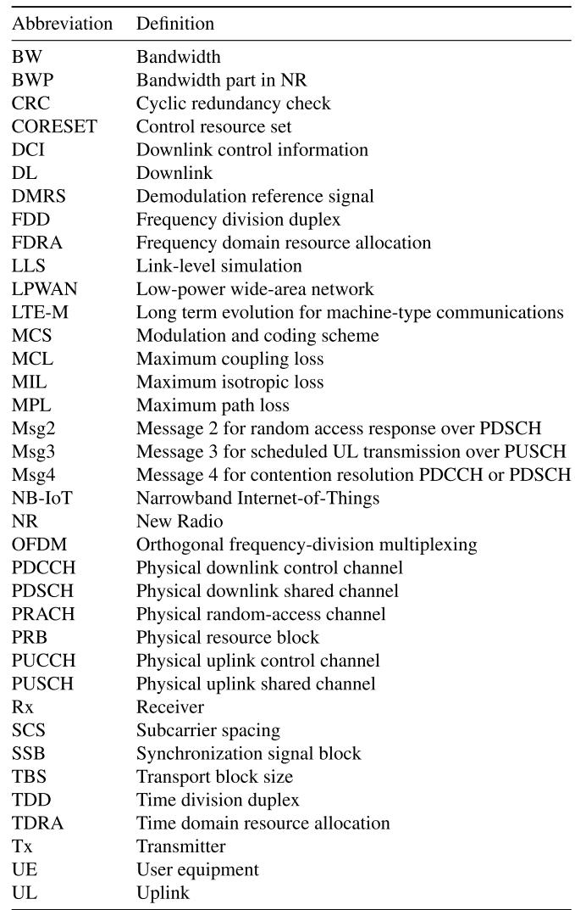

TABLE 2. Use case specific requirements for RedCap [13].  
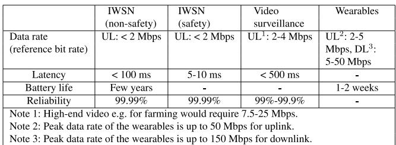

In addition to the use case-specific requirements in Table 2, the following general requirements are common to all Red-Cap use cases [6]:

• Lower device cost and complexity as compared to high-end eMBB and URLLC devices of Release-15/ Release-16.

• Smaller device size or compact form factor, and

• Support deployment in all FR1/FR2 bands for FDD and TDD.

In order to meet the above generic requirements, and more specifically the one on device complexity and device size, the following features have been considered in the RedCap study item [6]:

a) Reduced number of UE receiver (Rx) and/or transmitter (Tx) branches,

b) UE bandwidth reduction,

c) Half-duplex FDD,

d) Relaxed UE processing time,

e) Relaxed UE processing capability.

The complexity reduction features which are expected to have the largest impact on coverage performance are (a) reduced number of UE Rx/Tx branches and (b) UE bandwidth reduction. Therefore, in what follows, we describe these features in more detail. More details on features (c), (d) and (e) are provided in TR 38.875 [13].

The reduction of the minimum number of Rx and/or Tx branches relative to that of a reference Rel-15 NR UE will lower the cost and complexity of the RedCap UEs. The reference NR UE supports 2Rx/1Tx branches in FR1 FDD bands, 4Rx/1Tx branches in FR1 TDD bands, and 2Rx/1Tx branches in FR2 bands [13]. For RedCap UEs, the configuration for Rx and Tx branches that were considered are 1Rx/1Tx and 2Rx/1Tx, in both FR1 and FR2. Furthermore, carrier aggregation is not considered. The cost reduction, relative to that of the reference NR UE and in terms of modem bill of materials, from reducing the minimum number of Rx branches is summarized in Table 3 [13]. In FR1, the reduction of number of Rx branches is also beneficial in terms of reducing the device size. In FR2, however, the reduction of number of Rx branches may not provide much benefit in terms of reducing the device size as the antenna separation is in the order of the wavelength.

TABLE 3. Estimated relative UE cost reduction for reduced number of UE Rx branches [13].  
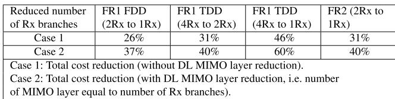

In addition to the reduction in the number of Rx branches, UE bandwidth reduction is another important feature that can considerably bring down the cost and complexity of the RedCap UE. For the estimation of relative cost/complexity saving due to UE bandwidth reduction, a Release 15 NR UE is used as a reference. The maximum bandwidth capability of the reference UE is assumed to be 100 MHz in FR1 and

200 MHz in FR2, for both uplink and downlink. For RedCap UEs, the bandwidth reduction options considered during the study item [6] are 20 MHz in FR1 and 50 or 100 MHz in FR2. The cost reduction, relative to that of the reference NR UE, is summarized in Table 4 [13].

TABLE 4. Estimated relative UE cost reduction for reduced maximum UE bandwidth [13].  
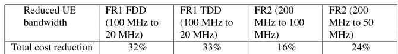

As shown in Table 3 and Table 4, the reduction of the number of Rx branches and UE bandwidth will lead to cost-saving benefits for the RedCap UEs. The drawback, however, is that the performance and consequently the coverage of the UEs can be negatively impacted. In the following sections, we evaluate the coverage impacts that entail from the use of these complexity reduction features. In addition to the complexity reduction features, the coverage analysis in FR1 also takes into consideration reduced antenna efficiency due to size limitations for devices such as wearables. The antenna efficiency loss is limited to 3 dB, and is considered for both uplink and downlink channels in the link budget evaluations.

## III. LINK LEVEL SIMULATIONS

In order to evaluate the impact of the UE complexity reduction on coverage of RedCap physical channels, as the first step, we have performed link-level simulations (LLS) to obtain the required SINR for the physical channels under performance target for both reference UEs and RedCap UEs. Then, the outcomes of the LLSs are used to perform the link budget evaluation to find coverage limiting channels. As it is expected that the coverage of a physical channel is affected by complexity reduction differently in different frequency bands, we have performed the LLSs for three different scenarios:

1) FR1, Rural with the carrier frequency of 0.7 GHz,

2) FR1, Urban with the carrier frequency of 2.6 GHz,

3) FR2, Indoor with the carrier frequency of 28 GHz.

It is also possible to consider multiple carrier frequency choices for each of the above environments, for example both carrier frequencies 2.6 GHz and 28 GHz are suitable for urban deployment. However, due to the space limitations, for each of the deployment environment, we have decided to keep the scope of the paper within the frequency choices based on 3GPP agreements [13]. In the rest of this paper, we refer to these scenarios by either their short names as Rural, Urban, Indoor; or by their designated frequencies as 0.7 GHz, 2.6 GHz and 28 GHz.

Any of the UL and DL initial access messages or physical channels can be potentially coverage limiting for RedCap UEs, therefore, we have considered LLSs for the following messages and channels [1]:

• Synchronized signal block (SSB): including primary SS (PSS), secondary SS (SSS) and physical broadcast channel (PBCH), is periodically transmitted on DL to initial cell search (in this paper mainly consider PBCH), and carries the information that UE needs to connect to the network,

• Physical random-access channel (PRACH): is used by UE for transmission of preamble over UL,

• Message 2 (Msg2) or random-access response: is transmitted on DL for indicating reception of the preamble and sending time alignment information,

• Message 3 (Msg3): is used by UE to transmit information such as a device identity that is needed for the next message over PUSCH,

• Message 4 (Msg4): transfers the UE to the connected state,

• Physical downlink control channel (PDCCH): is mainly used for transmission of control information such as scheduling decisions,

• Physical downlink shared channel (PDSCH): is mainly used as the main transmission of DL unicast data,

• Physical uplink control channel (PUCCH): is used by UE to send information such as acknowledgments and channel-state reports,

• Physical downlink shared channel (PUSCH): is the uplink counterpart of PDSCH.

Our common simulation assumptions for the reference and NR-RedCap UEs are listed in Table 5; while, the parameters which are different for reference and NR-RedCap UEs are shown in Table 6.

TABLE 5. Common LLS assumptions between reference and NR-RedCap UEs.  
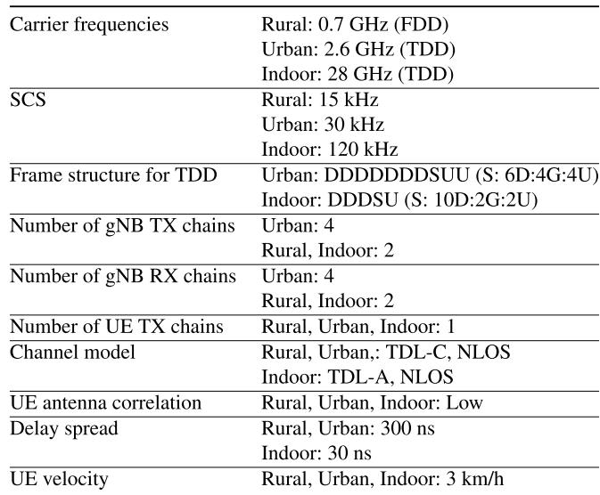

To perform the LLSs for different messages and physical channels, besides the parameters shown in Table 5 and Table 6, we also need to introduce the channel-specific parameters. Our channel-specific assumptions, the required performance targets such as the BLER performance are discussed separately for each channel in the following sections. Moreover, the SINR requirements for meeting BLER targets for different channels and signals in FR1 and FR2 are summarized in Tables 16-18.

TABLE 6. LLS assumptions for reference and NR-RedCap UEs.  
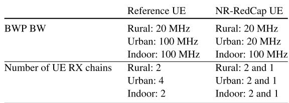

## A. SSB

Based on the assumptions reported in Table 5, 6 and 7, we have performed the LLSs for both reference UE-SSB and RedCap-SSB.

TABLE 7. Channel-specific parameters for SSB.  
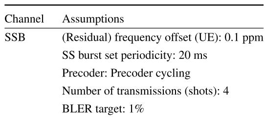

Our simulation results are shown in Figures 1-3 for Rural, Urban, and Indoor scenarios, respectively. For Rural scenario at carrier frequency of 0.7 GHz, the performance (at 1% BLER) degrades by 4.4 dB considering the complexity reductions for RedCap UEs.

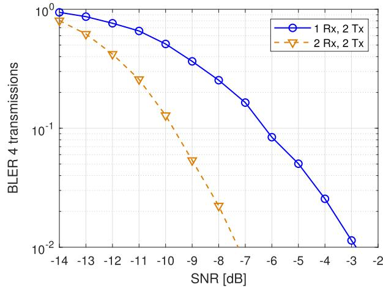  
FIGURE 1. BLER performance of SSB, Rural, 0.7 GHz.

Based on the results shown in Figure 2, the performance losses for PBCH (after 4 transmissions, at 1% BLER)

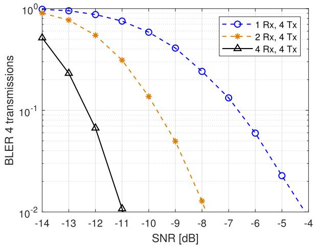  
FIGURE 2. BLER performance of SSB, Urban, 2.6 GHz.

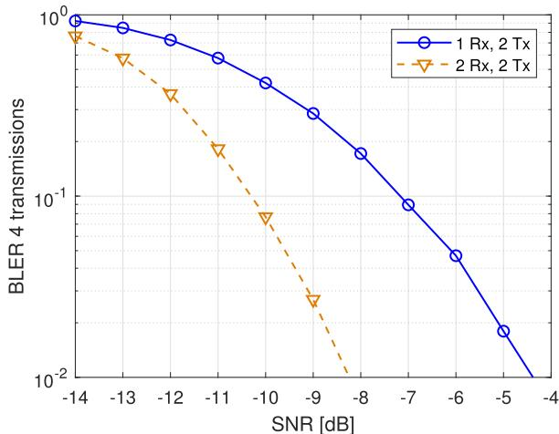  
FIGURE 3. BLER performance of SSB, Indoor, 28 GHz.

incurred from reducing the number of receiver branches for a RedCap UE with respect to the reference NR UE are 3.0 dB and 6.9 dB for a 2 Rx and 1 Rx RedCap UE, respectively, for Urban scenario. For the Indoor scenario in the FR2 band, as it is shown in Figure 3, reducing the Rx branches to 1 the BLER performance degrades by 3.7 dB at 1% BLER.

## B. PRACH

Table 8 represents our assumptions for LLS of PRACH. The miss detection rate for the PRACH of Rural, Urban, and Indoor scenarios are shown in Figure 4. In the uplink, the number of Tx branches is the same at the reference NR UE and the RedCap UE. Furthermore, as shown in Table 8, the PRACH BW for each PRACH occasion in the frequency domain is less than that of the RedCap UE BW in all the considered scenarios. Therefore, the link performance of RedCap-PRACH is identical to that of the reference UE-PRACH.

## C. Msg2

Our simulation assumptions for performing Msg2 LLSs, are shown in Table 9. For Msg2 we have considered the payload size of 9 bytes and MCS index of 0 from Table 5.1.3.1-1 in [14]. We have also considered TBS scaling of 0.25, so that a smaller TBS can be assigned to a given MCS and a given number of PRBs, by considering a TBS scaling factor in computing Ninfo as [14]:

TABLE 8. Channel-specific parameters for PRACH.  
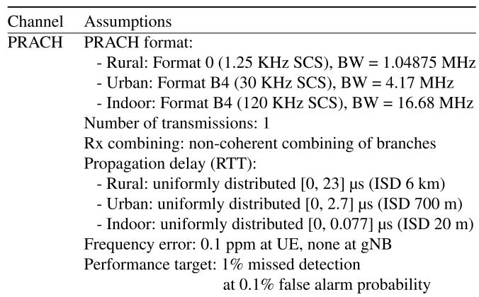

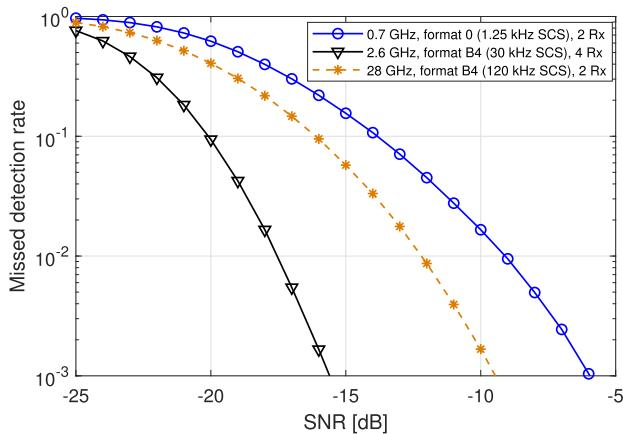  
FIGURE 4. Missed detection rate of PRACH, for Rural (0.7 GHz), Urban (2.6 GHz), and Indoor (28 GHz).

TABLE 9. Channel-specific parameters for Msg2.  
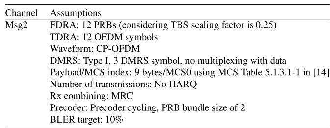

$$
\tag{1}
$$

where S, NRE , R, Qm, and v are the scaling factor, the number of available resource elements, code rate, modulation order, and the number of transmission layers, respectively.

Figures 5-7 show the BLER performance of Msg2 at carrier frequencies of 0.7 GHz, 2.6 GHz and 28 GHz, respectively.

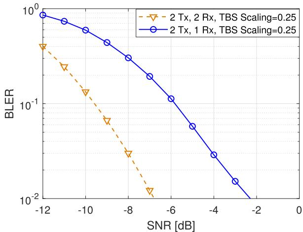  
FIGURE 5. BLER performance of Msg2, Rural, 0.7 GHz.

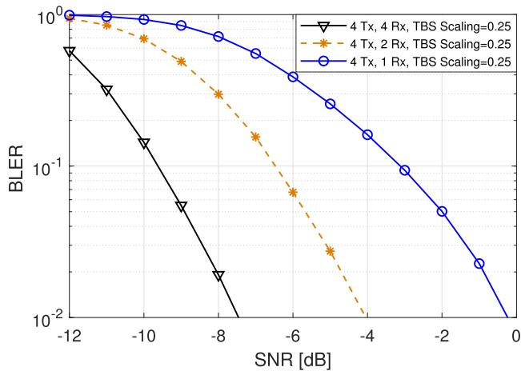  
FIGURE 6. BLER performance of Msg2, Urban, 2.6 GHz.

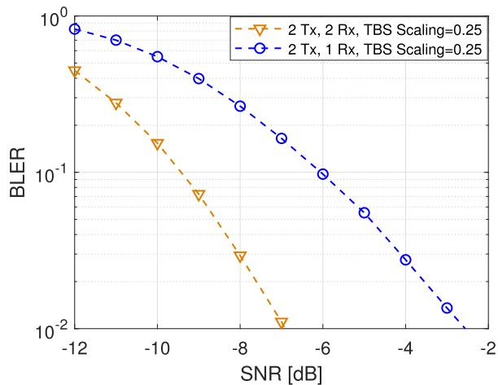  
FIGURE 7. BLER performance of Msg2, Indoor, 28 GHz.

As it is shown in Figure 5, at BLER performance of 10%, by reducing the number of UE Rx branches to 1, Msg2 performance is degraded by 6.5 dB for Rural case.

Based on our results shown in Figure 6, at carrier frequency of 2.6 GHz and BLER performance of 10%, Msg2 performance is respectively degraded by 3.1 dB and 3.4 dB for reducing the number of UE Rx branches from 4 to 2 and from 2 to 1. As it is shown in Figure 7, at carrier frequencies of 28 GHz and BLER performance of 10%, reducing the number of UE Rx branches to 1, Msg2 performance is degraded by 3.8 dB.

## D. Msg3

Table 10 shows the assumptions for LLS of Msg3. The BLER performance of Msg3 is shown in Figure 8. Similar to PRACH, the Msg3 performance of the RedCap UE is the same as that of the reference NR UE. This is because the BW of Msg3 is assumed to be smaller than the RedCap UE BW, and the number of the Tx branches of the RedCap UE is identical to that of the reference UE.

TABLE 10. Channel-specific parameters for Msg3.  
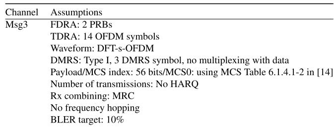

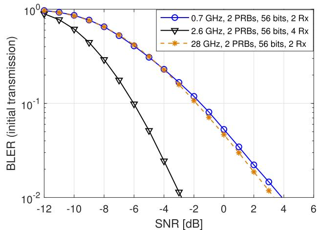  
FIGURE 8. BLER performance of Msg3 for Rural (0.7 GHz), Urban (2.6 GHz), and Indoor (28 GHz).

## E. Msg4

Our simulation assumptions for LLS of Msg4 are shown in Table 11. Figures 9-11 show the BLER performance of Msg4 at carrier frequencies of 0.7 GHz, 2.6 GHz and 28 GHz, respectively. Based on our simulation results in Figure 9, by reducing the BW and the number of UE Rx branches to 1, Msg4 performance is degraded by 4.1 dB at carrier frequencies 0.7 GHz. As it is shown in Figure 10, at carrier frequency of 2.6 GHz and BLER performance of 10%, Msg4 performance is respectively degraded by 3.5 dB and 4 dB for reducing the number of Rx branches from 4 to 2 and from 2 to 1. For Indoor scenario, by reducing the BW and the number of UE Rx branches to 1, at BLER performance of 10%, Msg4 performance is degraded by 4 dB.

TABLE 11. Channel-specific parameters for Msg4.  
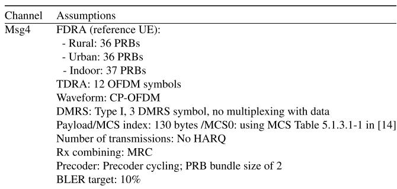

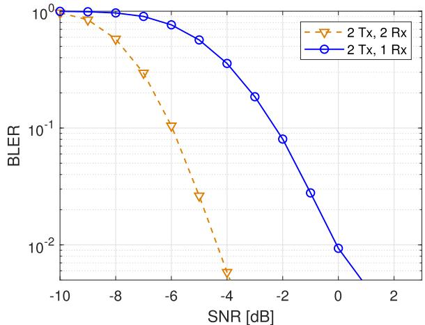  
FIGURE 9. BLER performance of Msg4, Rural, 0.7 GHz.

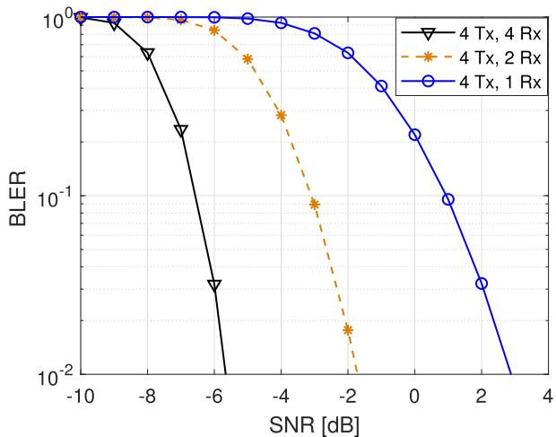  
FIGURE 10. BLER performance of Msg4, Urban, 2.6 GHz.

## F. PDCCH

We have performed the LLS for PDCCH channel based on the assumptions reported in Table 12, and our simulation results are shown in Figures 12-14, respectively for carrier frequencies 0.7 GHz, 2.6 GHz, and 28 GHz.

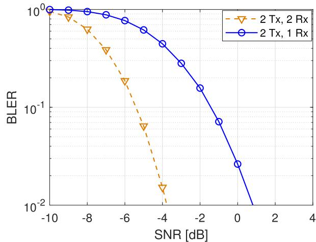  
FIGURE 11. BLER performance of Msg4, Indoor, 28 GHz.

TABLE 12. Channel-specific parameters for PDCCH.  
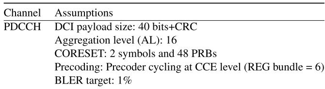

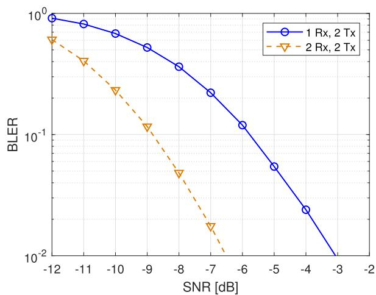  
FIGURE 12. BLER performance of PDCCH, Rural, 700 MHz.

For Rural scenario at carrier frequency of 0.7 GHz, the performance (at %1 BLER) degrades by 3.5 dB considering the complexity reductions for RedCap UEs.

The performance losses for PDCCH (at 1% BLER) incurred from reducing the number of receiver branches for a RedCap UE with respect to the reference NR UE are 3.2 dB and 6.2 dB for a 2 Rx and 1 Rx RedCap UE, respectively at carrier frequency of 2,6 GHz. In FR2 band at carrier frequency of 28 GHz, the performance loss is 3.9 dB by reducing the number of Rx branches to 1 for RedCap UE.

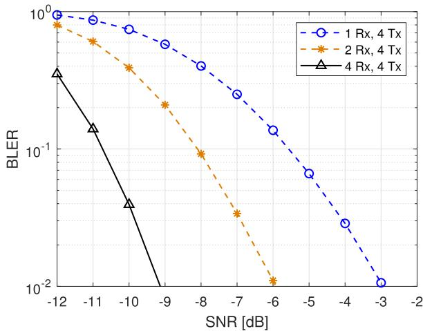  
FIGURE 13. BLER performance of PDCCH, Urban, 2.6 GHz.

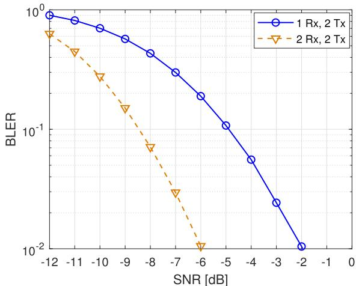  
FIGURE 14. BLER performance of PDCCH, Indoor, 28 GHz.

## G. PDSCH

Table 13 show our assumptions for LLS of PDSCH. It is worth to mention that our assumptions on data rate target is based on agreements from [6] and for the given number of PRBs, we have selected the smallest MCS index, from table 5.1.3.1-1 in [14], that satisfies our data rate constraints.

TABLE 13. Channel-specific parameters for PDSCH.  
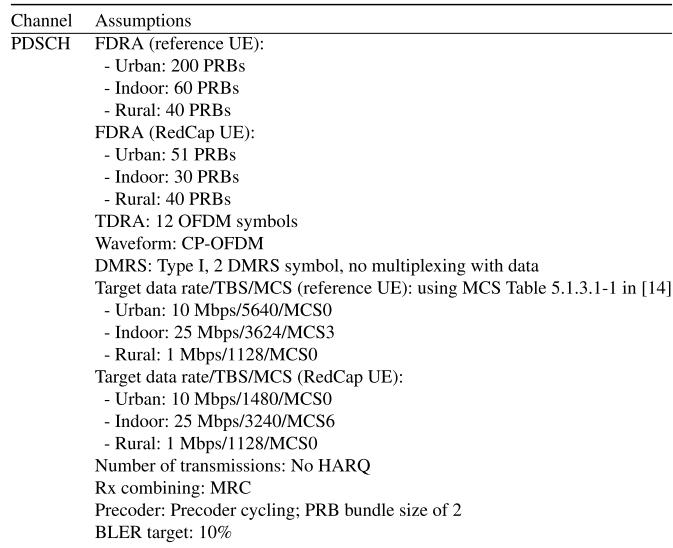

The BLER performances for PDSCH at carrier frequencies of 0.7 GHz, 2.6 GHz and 28 GHz are show in Figures 15-17, respectively. As it is shown in these figures, at the carrier frequency of 0.7 GHz and 10% BLER performance, by reducing the number of UE Rx branches to 1, the performance of PDSCH is degraded by 3.8 dB.

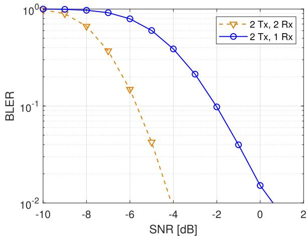  
FIGURE 15. BLER performance of PDSCH, Rural, 700 MHz.

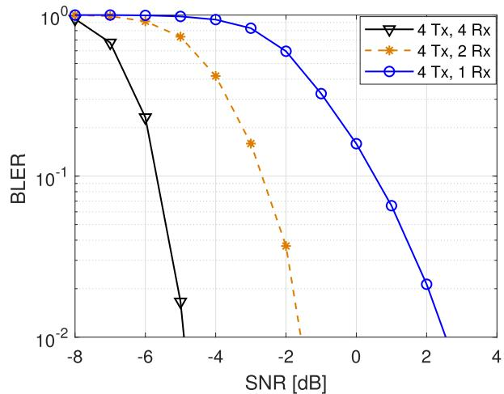  
FIGURE 16. BLER performance of PDSCH, Urban, 2.6 GHz.

As it is shown in Figure 16, at the carrier frequency of 2.6 GHz and BLER performance of 10%, PDSCH performance is respectively degraded by 3 dB and 3.2 dB for reducing the number of Rx branches from 4 to 2 and from 2 to 1. As it is shown in Figure 17, For a RedCap UE with 1 Rx branch and operating at the carrier frequency of 28 GHz the PDSCH performance is 4 dB worse than that of the reference UE at 10% BLER.

## H. PUCCH

Table 14 shows the channel-specific parameters and performance targets for PUCCH. The LLS results for PUCCH at carrier frequencies of 0.7 GHz, 2.6 GHz and 28 GHz are shown in Figures 18-23. The results show that there is no significant performance impact due to complexity reduction in terms of reduced BW as the PUCCH frequency resource spans only 1 PRB. Since a single UE transmit antenna is assumed in the simulation for both RedCap and NR reference UE, there is no performance impact related to the reduction of the number of UE antennas.

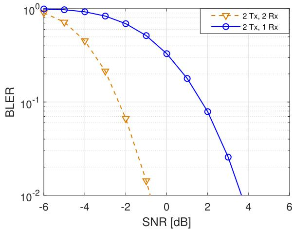  
FIGURE 17. BLER performance of PDSCH, Indoor, 28 GHz.

TABLE 14. Channel-specific parameters for PUCCH.  
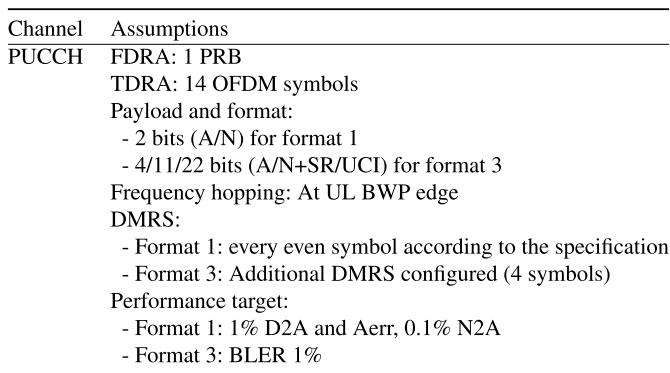

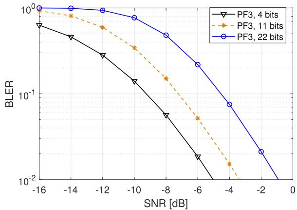  
FIGURE 18. BLER performance of PUCCH format 3, Rural, 0.7 GHz.

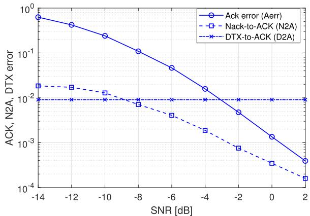  
FIGURE 19. BLER performance of PUCCH format 1, Rural, 0.7 GHz.

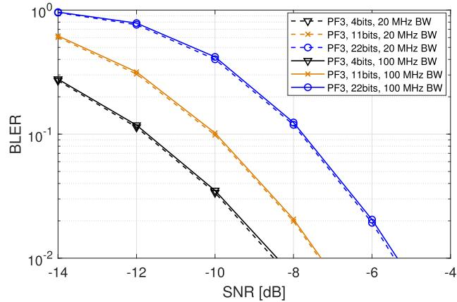  
FIGURE 20. BLER performance of PUCCH format 3, Urban, 2.6 GHz.

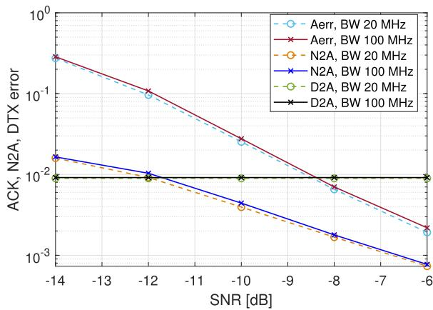  
FIGURE 21. BLER performance of PUCCH format 1, Urban, 2.6 GHz.

## I. PUSCH

Our assumptions for performing PUSCH LLSs are shown in Table 15. For the given number of PRBs, we have selected the smallest MCS index, from table 6.1.4.1-2 in [14], that satisfies our data rate constraints. Figure 24 and Figure 25 show the BLER performance and data rate of the PUSCH for different carrier frequencies. Similar to other uplink physical channels considered in this paper, the number of Tx branches is the same at the reference UE and the RedCap UE. Furthermore, as shown in Table 15, the PUSCH transmission BW is assumed to be less than that of the RedCap UE BW in Urban, Indoor and Rural scenarios. Therefore, the link performance will be identical for the RedCap UE and the reference UE.

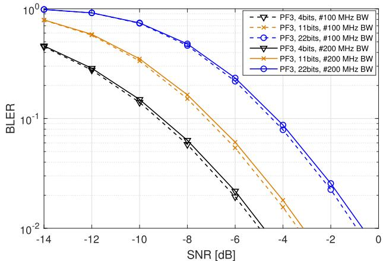  
FIGURE 22. BLER performance of PUCCH format 3, Indoor, 28 GHz.

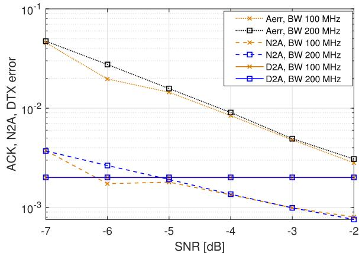  
FIGURE 23. BLER performance of PUCCH format 1, Indoor, 28 GHz.

TABLE 15. Channel-specific parameters for PUSCH.  
Channel Assumptions   
PUSCH FDRA:   
- Urban: 30 PRBs   
- Indoor: 66 PRBs   
- Rural: 4 PRBs   
TDRA: 14 OFDM symbols   
Waveform: DFT-s-OFDM   
DMRS: Type I, 2 DMRS symbol, no multiplexing with data   
Target data rate/TBS/MCS: using MCS Table 6.1.4.1-2 in [14]   
- Urban: 1 Mbps/552/MCS3   
- Indoor: 5 Mbps/736/MCS1   
- Rural: 100 kbps/128/MCS6   
Rx combining: MRC   
No frequency hopping   
BLER target: 10%

## IV. LINK BUDGET EVALUATION

Link budget evaluation is used to investigate coverage by tracking the transmitted power, the gains and the losses along the transmission path and power is sufficient so that the system can operate acceptably. Coverage can be expressed by different metrics such as maximum coupling loss (MCL), maximum path loss (MPL) and maximum isotropic loss (MIL) [15]. Among these metrics, MIL and MPL include the antenna gains. However, compared to MPL, MIL is more straightforward to compute as it does not consider parameters such as shadow fading and penetration margins. Therefore, in this paper, we have used MIL as the key coverage evaluation metric. Considering the simulation results and the corresponding performance targets for the different physical channels, the required SINRs to fulfill these targets are reported in Tables 16-18, respectively, for Rural, Urban, and Indoor scenarios.

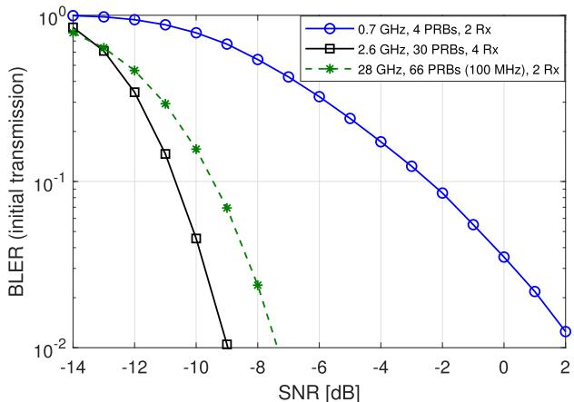  
FIGURE 24. BLER performance of PUSCH for Rural (0.7 GHz), Urban (2.6 GHz), and Indoor (28 GHz).

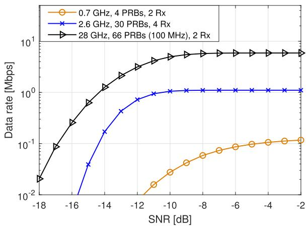  
FIGURE 25. Data rate for PUSCH for Rural (0.7 GHz), Urban (2.6 GHz), and Indoor (28 GHz).

The SINR values shown in these tables are used to perform link budget evaluation based on the template [16]. Table 19 shows the key assumptions that we have considered in our link budget evaluations. It should be noted that for RedCap UEs operating in FR1 band (Rural and Urban), due to device size limitations, we have considered additional 3 dB antenna inefficiency compared to the reference NR UEs.

TABLE 16. Required SINR (dB), 0.7 GHz.  
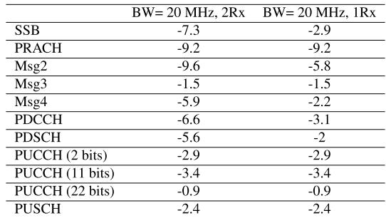

TABLE 17. Required SINR (dB), 2.6 GHz.  
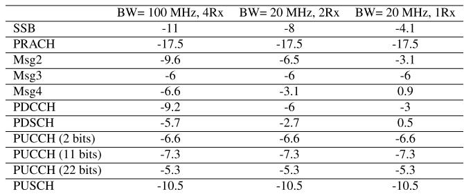

TABLE 18. Required SINR (dB), 28 GHz.  
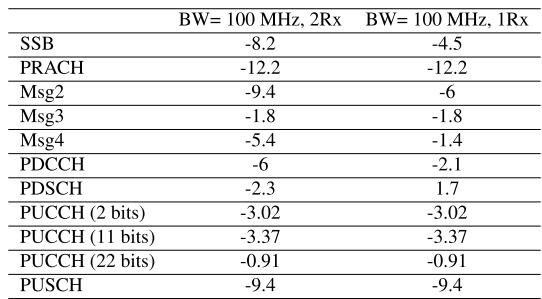

TABLE 19. Link budget assumptions.  
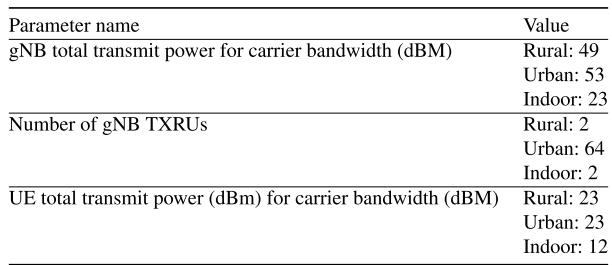

In Figures 26-28 the coverage of different RedCap physical channels in terms of MIL are compared to that of the corresponding NR channels for Rural, Urban and Indoor environment, respectively. At each of the scenarios, the NR physical channel with the lowest MIL is considered as coverage bottleneck channel, i.e. the corresponding value is the minimum acceptable MIL and the Rel-15 NR coverage limit is assumed to be given by this MIL. We have considered this MIL value as the minimum acceptable MIL also for RedCap channels and used it as a threshold to identify the RedCap physical channels that need coverage recovery. Any RedCap channel whose MIL is worse than that of the threshold MIL needs coverage recovery and the amount of required coverage compensation is the difference of the RedCap-channel-MIL and the threshold MIL.

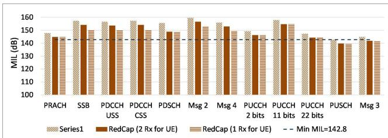  
FIGURE 26. MIL for Rural, 0.7 GHz.

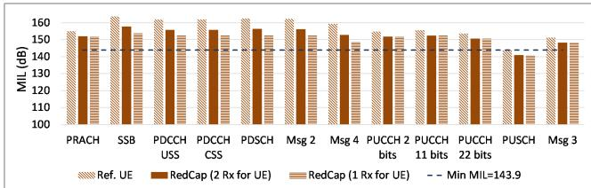  
FIGURE 27. MIL for Urban, 2.6 GHz.

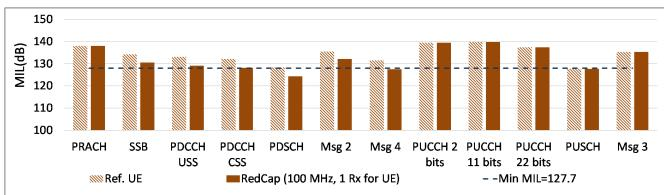  
FIGURE 28. MIL for Indoor, 28 GHz.

As it can be seen in Figure 26 and Figure 27, for the reference UE operating in Rural and Urban scenarios, PUSCH is the bottleneck channel and has the lowest MIL value (MIL = 142.8 dB for Rural and MIL = 143.9 dB for Urban). For RedCap UEs operating in Rural scenario, all the physical channels and initial access messages, except PUSCH and Msg3, have MIL larger than the threshold value. Based on our results for Rural case, PUSCH and Msg3 need 3 dB and 0.8 dB coverage compensation. For RedCap UEs operating in Urban scenarios, only PUSCH needs 3 dB coverage compensation.

For the reference UE in Indoor scenario, as it is shown in Figure 28, PUSCH is the bottleneck channel with MIL = 127.7 dB. For RedCap UE with 1 Rx branch, coverage compensations of approximately 3.4 dB and 0.5 dB are respectively, needed for PDSCH and Msg4.

## V. CONCLUSION

In this paper, we have investigated the coverage performance of the NR-RedCap UEs and identified the physical channels that limit the coverage of these devices. We first have provided an overview of the NR-RedCap and discussed its use cases, requirements, and main features. Then, for different deployment scenarios and carrier frequencies (FR1 and FR2), we have evaluated the link performance of RedCap UEs and performed link-budget evaluations for all physical channels and messages for DL and UL transmissions.

Our results have shown that for RedCap UEs operating in FR1 band, the PUSCH can limit the coverage, and it needs 3 dB coverage recovery. It is worth highlighting two observations; first, the 3 dB coverage loss resulting from the UE antenna efficiency loss due to device size limitations; second, by reducing the data rate target for RedCap UEs in UL, no coverage recovery is needed. For the Rural case, a small amount of coverage compensation (approximately 0.8 dB) is needed for Msg3. For RedCap UEs operating in FR2 band, the impact of complexity reduction is more considerable for DL channels, and PDSCH and Msg4 are the channels that may need coverage recovery. However, the amount of coverage-compensation needed for Msg4 is less than 0.5 dB and by considering smaller data rates no coverage recovery is needed for PDSCH.

## REFERENCES

[1] E. Dahlman, S. Parkvall, and J. Skold, 5G NR: The Next Generation Wireless Access Technology. New York, NY, USA: Academic, 2018.

[2] S. Ahmadi, 5G NR: Architecture, Technology, Implementation, and Operation of 3GPP New Radio Standards. New York, NY, USA: Academic, 2019.

[3] GSMA, ‘‘Mobile IoT in the 5G future-NB-IoT and LTE-M in the context of 5G,’’ GSMA, London, U.K., White Paper, 2018.

[4] O. Liberg, M. Sundberg, E. Wang, J. Bergman, and J. Sachs, Cellular Internet of Things: Technologies, Standards, and Performance. New York, NY, USA: Academic, 2017.

[5] M. Mozaffari, Y.-P.-E. Wang, O. Liberg, and J. Bergman, ‘‘Flexible and efficient deployment of NB-IoT and LTE-MTC in coexistence with 5G new radio,’’ in Proc. IEEE Conf. Comput. Commun. Workshops (INFOCOM WKSHPS), Apr. 2019, pp. 391–396.

[6] Revised SID on Study on Support of Reduced Capability NR Devices, document RP-201677, 3GPP, Ericsson, Jul. 2020.

[7] New WID on Support of Reduced Capability NR Devices, document RP-202933, 3GPP, Ericsson and Nokia, Dec. 2020.

[8] Z. Sheng, C. Mahapatra, C. Zhu, and V. C. M. Leung, ‘‘Recent advances in industrial wireless sensor networks toward efficient management in IoT,’’ IEEE Access, vol. 3, pp. 622–637, 2015.

[9] D. E. Boubiche, A.-S.-K. Pathan, J. Lloret, H. Zhou, S. Hong, S. O. Amin, and M. A. Feki, ‘‘Advanced industrial wireless sensor networks and intelligent IoT,’’ IEEE Commun. Mag., vol. 56, no. 2, pp. 14–15, Feb. 2018.

[10] M. Raza, N. Aslam, H. Le-Minh, S. Hussain, Y. Cao, and N. M. Khan, ‘‘A critical analysis of research potential, challenges, and future directives in industrial wireless sensor networks,’’ IEEE Commun. Surveys Tuts., vol. 20, no. 1, pp. 39–95, 1st Quart., 2018.

[11] Y. Ye, S. Ci, A. K. Katsaggelos, Y. Liu, and Y. Qian, ‘‘Wireless video surveillance: A survey,’’ IEEE Access, vol. 1, pp. 646–660, 2013.

[12] F. J. Dian, R. Vahidnia, and A. Rahmati, ‘‘Wearables and the Internet of Things (IoT), applications, opportunities, and challenges: A survey,’’ IEEE Access, vol. 8, pp. 69200–69211, 2020.

[13] Study on Support of Reduced Capability NR Devices (Release 17), document TR 38.875, 3GPP, Dec. 2020.

[14] NR; Physical Layer Procedures for Data (Release 16), document TS 38.214, 3GPP, 2019.

[15] Study on NR Coverage Enhancements (Release 17), document TR 38.830, 3GPP, Dec. 2020.

[16] Feature Lead (FL) Summary 4 for Redcap Evaluation Templates, RAN1 102-E, document R1-2007481, 3GPP, Moderator (Ericsson, Apple, Qualcomm), Aug. 2020.

SAEEDEH MOLOUDI received the Ph.D. degree in electrical engineering from Lund University, Sweden, in 2018. She is currently an experienced Researcher with Ericsson Research, Linköping, Sweden, where she is involved in research and standardization of 5G and the IoT technologies.

MOHAMMAD MOZAFFARI received the B.Sc. degree in electrical engineering from the Sharif University of Technology, Iran, the M.Sc. degree in geomatics engineering from the University of Calgary, Canada, and the Ph.D. degree in electrical and computer engineering from Virginia Tech. He is currently an experienced Researcher with Ericsson Research, Silicon Valley, USA. His research interests include span diverse areas, such as 5G and 6G wireless networks, UAV/drone com-

munications, the IoT, and machine learning. He received the 2019 Outstanding Ph.D. Dissertation Award in the science, technology, engineering, and mathematics from Virginia Tech. He was a recipient of the 2019 IEEE ComSoc Young Author Best Paper Award, the 2020 IEEE WCNC Best Paper Award, and the Exemplary Reviewer Award for IEEE TRANSACTIONS ON COMMUNICATIONS, in 2020. He has actively served as the Technical Program Committee (TPC) member of a variety of conferences, such as ICC and GLOBECOM. He is currently an Associate Editor of the IEEE Vehicular Technology Magazine.

SANDEEP NARAYANAN KADAN VEEDU received the Ph.D. degree in electrical and information engineering from the University of L’Aquila, Italy. He is currently a Senior Researcher with Ericsson Research, Stockholm, Sweden, where he is involved in the research and standardization of cellular IoT technologies. Prior to joining Ericsson in 2018, he was a Research Associate with King’s College London, U.K. He has also held various research positions with University

College Dublin, Ireland, Northwestern University, USA, and The University of Edinburgh, U.K.

KITTIPONG KITTICHOKECHAI received the Ph.D. degree in electrical engineering from the KTH Royal Institute of Technology, Sweden, in 2014. He was a Visiting Scholar with the Information Systems Laboratory, Stanford University, USA, in 2012. He was a Postdoctoral Researcher with the Technical University of Berlin, Germany, from 2014 to 2016. He is currently a Senior Researcher with Ericsson Research, Stockholm, Sweden, where he is involved in research and stan-

dardization of 5G and the IoT technologies.

son’s Inventors of the Year award, in 2006. He served as an Associate Editor for IEEE TRANSACTIONS ON VEHICULAR TECHNOLOGY, from 2003 to 2007.

Y.-P. ERIC WANG received the Ph.D. degree in electrical engineering from the University of Michigan, Ann Arbor, in 1995. He is currently a Principal Researcher with Ericsson Research, Santa Clara, California. He has been a Technical Coordinator with Ericsson Research for the IoT connectivity related research and standardization. He is a coauthor of the book Cellular Internet of Things: From Massive Deployments to Critical 5G Applications. He was a co-recipient of the Erics-

JOHAN BERGMAN received the master’s degree in engineering physics from the Chalmers University of Technology, Gothenburg, Sweden. In 1997, he joined Ericsson to work with baseband receiver algorithm design. Since 2005, he has been working with 3G/4G/5G physical layer standardization in 3GPP TSG RAN Working Group 1. He is currently a Master Researcher with Ericsson Business Unit Networks, Stockholm, Sweden. He is a coauthor of the book Cellular Internet of Things: From

Massive Deployments to Critical 5G Applications. He was a co-recipient of Ericsson’s Inventor of the Year award for 2017.

ANDREAS HÖGLUND received the Master of Science degree in engineering physics, in 2002 and the Ph.D. degree in condensed matter physics from Uppsala University, in 2007. He is currently a Master Researcher with Ericsson Research, where he has been working on HSPA, LTE, system simulations, 5G research in the METIS project, 3GPP specification of LTE MTC (Cat-M1), and NB-IoT from the start in Release 13 until the enhancements in Rel-16, since 2008. He is also a Team Leader

working with 3GPP Rel-17 RedCap and Rel-17 Small Data Enhancements.