# Enhancing Uplink Performance of NR RedCap in Industrial 5G/B5G Systems

Salwa Saafi1,2,∗, Olga Vikhrova2, Sergey Andreev2, and Jiri Hosek1

1Department of Telecommunications, Brno University of Technology, Brno, Czech Republic

2Unit of Electrical Engineering, Tampere University, Tampere, Finland

∗Email: saafi@vut.cz

Abstract—The evolution of cellular fifth-generation (5G) technologies shapes the future of the manufacturing industry by enabling sector automation and digitalization. Smart factories rely primarily on wireless connectivity provided by new radio (NR) systems to meet the stringent requirements of industrial applications. Among these, several industrial wearable and sensor-based services involve devices with relaxed communication capabilities as compared to Rel-15 NR user equipment. Hence, a new category of reduced-capability (RedCap) devices becomes essential in industrial private networks. As RedCap devices may experience degradation of uplink (UL) performance due to simplifications in radio frequency and baseband capabilities, this paper focuses on enhancing NR RedCap operations with existing 5G solutions for UL improvement, namely, dual connectivity, carrier aggregation, and supplementary UL. Specifically, we discuss these options for RedCap wearable devices and evaluate the performance gains of the selected technology using link-level simulations.

Index Terms—Industrial 5G, NR RedCap, Dual Connectivity, Carrier Aggregation, Supplementary UL

## I. INTRODUCTION

While long-term evolution (LTE) systems have focused predominantly on improving downlink (DL) data rates for the support of broadband applications, cellular fifth-generation (5G) and beyond 5G (B5G) systems pay more attention to the uplink (UL) performance and its enhancement [1]. UL enhancements are particularly important for industrial use cases, where data of various real-time applications need to be transmitted from devices to distributed and centralized cloud servers for analytics and intelligent decision-making [2]. These improvements become even more critical when considering the network deployment choices in industrial environments and their subsequent performance limitations.

The majority of the new 5G spectrum allocations are placed in the mid-bands, including 3300–3800 MHz and 2570–2620 MHz [3]. Although they offer large bandwidths, using these time-division duplexing (TDD) mid-bands leads to UL capacity and coverage issues. In TDD systems, the total bandwidth is divided between UL and DL transmissions with a higher share for the DL than for the UL in general [4]. Therefore, it can be difficult for 5G TDD systems to meet the increasing capacity requirements of UL data-intensive applications [5]. For the UL coverage, the limitation basically comes from the higher path and penetration losses at higher frequencies. Although advanced technologies such as massive multipleinput multiple-output (MIMO) antennas help improve the coverage and the capacity of cellular systems, the coverage in the mid-bands is still weaker than that in the low-bands [5].

To address these limitations, a variety of UL enhancements have been ratified by the 3rd generation partnership project (3GPP) in Rel-15 and Rel-16. The main solutions among these enhancements focus on leveraging the use of multiple frequency bands in UL transmissions, namely, dual connectivity (DC), carrier aggregation (CA), and supplementary UL (SUL). A smart factory with a 5G network deployed in the 3.3–3.8 GHz frequency band is an example of new radio (NR) systems where the aforementioned UL enhancements can alleviate the TDD and mid-band performance issues. Intelligent devices with dissimilar communication capabilities are utilized in this 5G-enabled smart factory, such as sensors, wearables, automated guided vehicles, drones, and mobile robots [6]. This motivates the introduction of novel industrial applications with different UL and DL communication requirements. Proposed in [7], industrial mid-end wearable applications (IM-EWA) have mid-end requirements that fall in-between the three main 5G service classes (i.e., eMBB, URLLC, and mMTC). Essential components of these new services are reduced-capability NR (NR RedCap) wearable devices.

Ratified in 3GPP Rel-17, NR RedCap specifies the device capabilities required to support novel mid-end Internet of Things (IoT) use cases, including industrial sensors, surveillance cameras, and wearables [8]. Due to simplifications in radio frequency and baseband capabilities, NR RedCap devices may experience network performance degradation as compared to Rel-15 NR devices [8], [9]. However, several services among the IM-EWA categories defined in [7] (i.e., process management, work safety, and healthcare monitoring) require real-time UL data transmission. Examples of these services include uploading progress reports as part of the process management and sending vital signs of workers as part of the healthcare monitoring [7]. Hence, meeting the stringent requirements of the above industrial applications prompts RedCap devices to employ solutions for UL performance enhancement.

We, therefore, propose to improve the UL performance of industrial NR RedCap with appropriate 5G solutions. Our contributions are:

• Review of the three main 5G technologies for UL enhancement (DC, CA, and SUL) in Section II.

• Study of the multi-band operation of RedCap devices in Section III and selection of the solutions among DC, CA, and SUL that industrial RedCap wearables can use with respect to the 3GPP recommendations for complexity reduction.

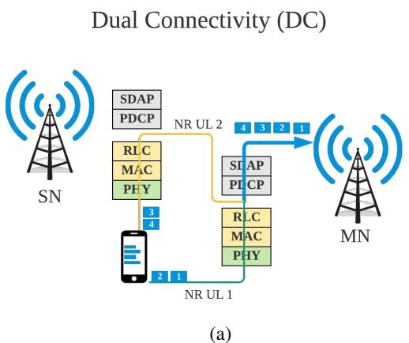

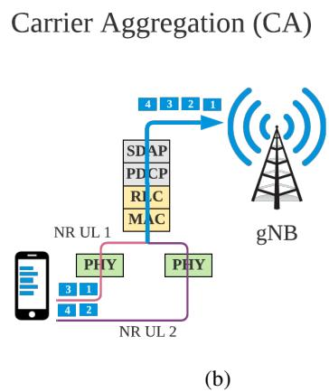

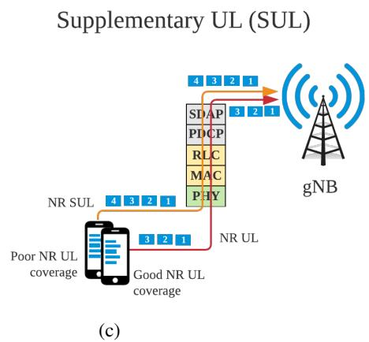  
Fig. 1: Three candidate technologies for UL performance enhancement in 5G: (a) DC, (b) CA, and (c) SUL

• Evaluation of the performance gains of the technologies identified in Section III using link-level simulation (LLS) with different 5G UL channel configurations. The parameters and results of this evaluation are discussed in Subsections IV-A and IV-B, respectively.

• Assessment of the performance degradation that RedCap devices can experience concurrently with the above benefits. First results of this assessment and potential solutions for the efficient use of the selected UL enhancements are provided in Subsection IV-C.

The paper is concluded with future extensions of this work.

## II. UL PERFORMANCE ENHANCEMENTS IN 5G

3GPP standardization efforts to enhance the 5G UL performance started from Rel-15. In this paper, we focus on DC, CA, and SUL as part of the cellular solutions that leverage the use of multiple frequency bands for UL transmissions. Fig. 1 demonstrates the principle of each solution.

## A. Dual Connectivity

A DC-capable user equipment (UE) can utilize resources provided by two different nodes: one offering NR access and the other one enabling either evolved UMTS terrestrial radio access (EUTRA) or NR access. In particular, one node acts as a master node (MN) and the other one serves as a secondary node (SN). Examples of the multi-radio DC (MR-DC) configuration include EUTRA-NR DC (EN-DC) and NR-NR DC (NR-DC) [5].

In EN-DC, the LTE eNB represents the MN, while the NR gNB serves as the SN [10]. This option allows mobile operators to launch 5G networks smoothly and cost effectively by leveraging the existing LTE radio access part and evolved packet core (EPC) in a non-standalone (NSA) architecture. However, 3GPP TR 38.875 recommends the 5G standalone (SA) architecture for the operation of RedCap devices. Therefore, NR-DC is the candidate DC configuration for RedCap devices.

Using NR-DC, the UE can establish dual connections with two gNBs as shown in Fig. 1a (i.e., both MN and SN are gNBs). The capacity and coverage benefits of NR-DC in 5G networks depend on the employed frequency ranges. Having a primary UL in the frequency range 1 (FR1) and a secondary UL in the frequency range 2 (FR2), mobile operators can offer wider coverage and higher throughput than in the single connectivity case [11]. If the aim is only to enhance the UE throughput, then the NR-DC configuration should have both links operating in FR2.

## B. Carrier Aggregation

Initially introduced in 3GPP Rel-10, CA enables simultaneous aggregation of multiple frequency fragments, known as component carriers (CCs). By aggregating these CCs, a wider transmission bandwidth can be formed and higher data rates can therefore be achieved [12]. 3GPP has ratified and subsequently enhanced several CA configurations, namely, interband, intra-band contiguous, and intra-band non-contiguous CA [13]. CCs can reside in different bands (i.e., inter-band), be adjacent in the same frequency band (i.e., intra-band contiguous), or non-adjacent in the same frequency band (i.e., intra-band non-contiguous) [13].

NR CA shown in Fig. 1b has been included in 5G specifications since 3GPP Rel-15, where multiple bands like n77, n78, and n79 in FR1 were used for intra-band CA [14]. Aggregating multiple carriers in the same frequency band can improve the UL data rates [5]. For instance, intra-band CA with two UL frequency carriers of the same bandwidth can double the user UL data rate.

On top of the bands dedicated to intra-band CA, 3GPP Rel-15 defines multiple band combinations for inter-band CA in FR1, such as CA n3-n78 and CA n28-n78 [14]. Using inter-band CA, frequency-division duplexing (FDD) and TDD NR bands can be aggregated to extend the coverage in 5G networks. For example, when the FDD 2.1 GHz and the TDD 3.5 GHz bands are aggregated, the coverage is improved by 17.8% compared to the TDD NR single carrier option [5]. However, the UL data rate in inter-band CA is limited by the number of transmission channels of the UEs.

## C. Supplementary UL

According to 3GPP TS 38.300, a UE can be configured with an additional UL, named SUL, in conjunction with an UL/DL carrier pair (FDD band) or a bidirectional carrier (TDD band) [15]. Unlike the principle of DC and CA, the UE can transmit either on the SUL or on the UL of the carrier being supplemented, but not on both at the same time.

The aim of introducing the SUL technology in 3GPP Rel-15 was to extend the UL coverage in 5G mid-band deployments. As depicted in Fig. 1c, when the coverage of the NR carrier is reliable, the UE deploys this primary carrier for its UL transmissions. In the second case, where the UE moves outside of the NR UL coverage, it uses the SUL carrier to transmit its data [5]. SUL does not impact the UE’s UL peak throughput since only the NR carrier is used for UL transmissions in the TDD coverage area.

The decision to switch from the NR UL to the NR SUL can be made at the device or the network side. The first option implies that the UE selects the SUL carrier if and only if the measured quality of the DL is lower than a threshold broadcasted by the gNB [15]. In the second option, the network explicitly signals which carrier to use (UL or SUL). For instance, the gNB can direct a UE to employ the SUL frequency band when the UL channel quality deteriorates [15].

3GPP dedicates several NR bands for the support of SUL in Rel-15 [16] and Rel-16 [17]. The latter technical reports define possible band combinations for NR UL and SUL in SA and NSA 5G architectures. Tables I and II summarize the SUL bands and band combinations, respectively, in the SA mode.

TABLE I: Rel-15 and Rel-16 SUL bands  
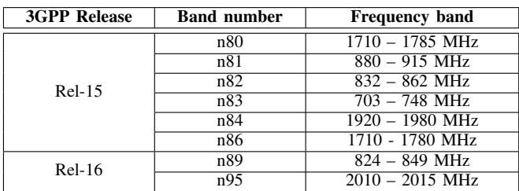

## III. NR REDCAP AND 5G UL ENHANCEMENTS

The technologies discussed in Section II can provide 5G networks with extended UL coverage and improved UL capacity, which can be particularly useful for RedCap UEs due to their reduced capabilities and degraded UL performance. In particular, to reduce the cost and power consumption of RedCap devices compared to existing Rel-15 NR UEs, several device complexity reduction techniques have been proposed in 3GPP TR 38.875, namely, reduced UE bandwidth, limited number of UE Rx branches, half-duplex FDD operation, relaxed processing time, and reduced UE processing capability (in terms of the maximum number of MIMO layers and maximum modulation orders) [8]. Since RedCap devices are becoming an essential part of the smart factory use cases, it is important to open a discussion about complementing NR RedCap with appropriate 5G UL enhancement technologies. This helps improve NR RedCap performance in industrial environments and thus meet the requirements of multiple industrial applications.

Although the multi-band operation of RedCap devices was not widely discussed in related 3GPP Rel-17 study and work items, it is important to note that CA cannot be considered for

TABLE II: Rel-15 and Rel-16 SUL band combinations in the SA architecture  
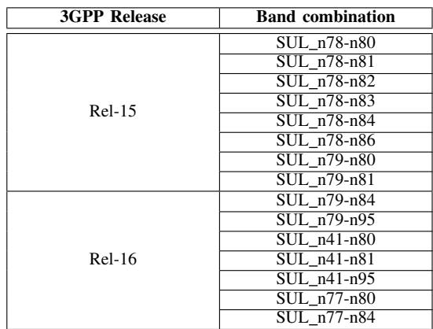

RedCap UEs [9]. UL CA signals use more bandwidth and have higher peak-to-average-power ratio (PAPR) than single carrier signals. Increasing the PAPR values with multiple simultaneous transmissions can reduce the UE transmit power [18], which introduces further limitations to NR RedCap performance.

As mentioned above, reducing the UE bandwidth is recommended to decrease the cost and power consumption of RedCap devices [8]. Taking this recommendation into account, DC and CA are not suitable for RedCap UEs since they increase the maximum bandwidth and require more RF chains at the UE side. In other words, supporting DC and CA can compromise the NR RedCap design target, where a RedCap device is expected to operate over a single band at a time.

While DC and CA imply transmitting and receiving data over multiple carriers simultaneously in both UL and DL directions, SUL refers to having an additional carrier in the UL only to be used as a substitute for the main NR UL. The UE is configured with two carriers in the UL, but it cannot transmit on both frequencies at the same time. Therefore, SUL does not increase the UE cost since it does not require simultaneous UL transmissions.

Based on this discussion, we advocate the use of SUL by Rel-17 RedCap devices to achieve better UL performance. This technology can be beneficial for NR RedCap in mid-band TDD without increasing the device complexity (i.e., device cost). Another motivation is the gap in the UL performance between Rel-15 NR devices and RedCap devices, if the latter do not support the existing features for UL enhancement. To narrow this gap, the network may need to employ advanced and more complicated scheduling mechanisms to separately handle devices with dissimilar capabilities. Hence, using SUL by RedCap devices helps not only improve the UL performance without additional costs but also avoid the need for the above mechanisms.

## IV. LINK-LEVEL SIMULATION RESULTS

In this section, we evaluate NR RedCap performance when using TDD UL and FDD SUL. Numerical results assessing the benefits of SUL have already been provided for Rel-15 NR devices [5]. However, our evaluation aims to confirm these performance gains for RedCap devices using the three

5G UL physical channels; physical uplink shared channel (PUSCH), physical uplink control channel (PUCCH), and physical random access channel (PRACH). We also examine the potential performance losses due to switching from TDD UL to FDD SUL for RedCap UEs.

## A. Evaluation Methodology

We assess the gains of SUL in terms of PUSCH maximum coupling loss (MCL), PUCCH block error rate (BLER), and PRACH detection probability. We use MATLAB 5G toolbox for our LLS-based performance evaluation since it provides standard-compliant functions for the modeling of NR communication systems. The main parameters of our simulations are summarized in Table III.

TABLE III: Evaluation parameters  
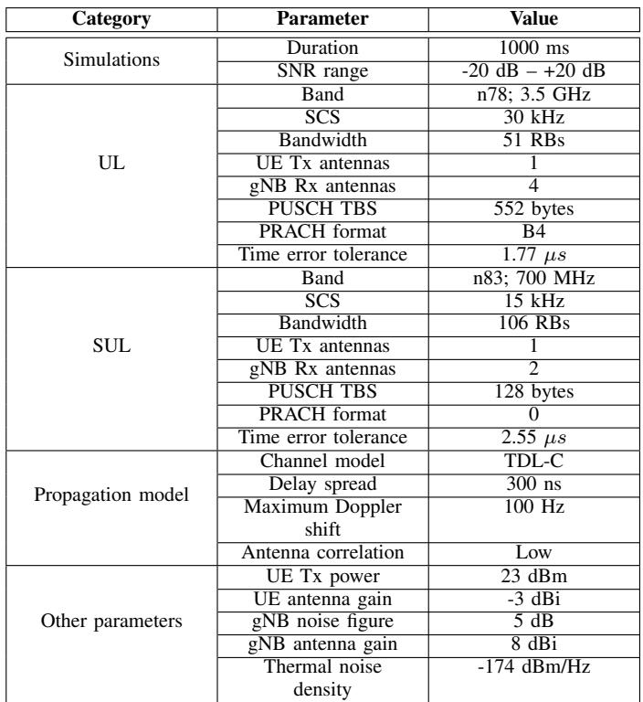

We use the Rel-15 band combination SUL n78-n83 as ratified in [16] and given in Table II for the UL and SUL carrier frequencies. Besides the bands, other parameters that need to be specified for each carrier include the subcarrier spacing (SCS) and channel-specific parameters like PUSCH transport block size (TBS), PRACH format, and time error tolerance [19]. The UE is configured with one Tx antenna following the NR RedCap recommendations [20]. Another important parameter related to NR RedCap assumptions is the UE bandwidth. The bandwidth values shown in Table III represent the maximum number of resource blocks (RBs) for the channel bandwidth of 20 MHz and the SCS used in UL and SUL [14]. The 20 MHz channel bandwidth is the value recommended for RedCap devices in 5G FR1 [8]. Out of the five different tapped delay line (TDL) channel models, we select TDL-C since it is commonly used in 3GPP NR RedCap study items. The delay spread, maximum Doppler shift, and antenna correlation in Table III have the same values as in [20].

## B. Evaluation Results

To evaluate the UL coverage, we consider the PUSCH MCL, which is the largest attenuation of the radio signal between the transmitter and the receiver at which communications can still be successful [21]. The choice of PUSCH is justified by the fact that it is identified as the coverage bottleneck channel (i.e., physical channel with the lowest MCL) at both FR1 and FR2 [20], [22]. The required signal-to-noise ratio (SNR) used in the MCL calculation is taken from 3GPP TS 38.141 [19].

The LLS results for the PUSCH MCL obtained for UL and SUL are provided in Table IV. As it is evident from the obtained results, SUL provides better PUSCH coverage than UL. It can achieve 8.33 dB coverage gain, which confirms the benefits of using SUL by RedCap UEs at low frequencies since the coverage in the low-bands is better than that in the mid-bands [5].

TABLE IV: PUSCH coverage gain of SUL  
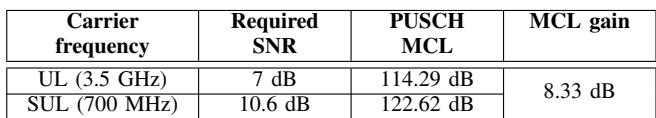

Along with the PUSCH MCL, we evaluate the BLER of uplink control information (UCI) transmitted over PUCCH format 3 for 5G NR UL and SUL. BLER is an important metric for understanding the reliability of PUCCH communications. Fig. 2 reports the results of PUCCH BLER for UL and SUL.

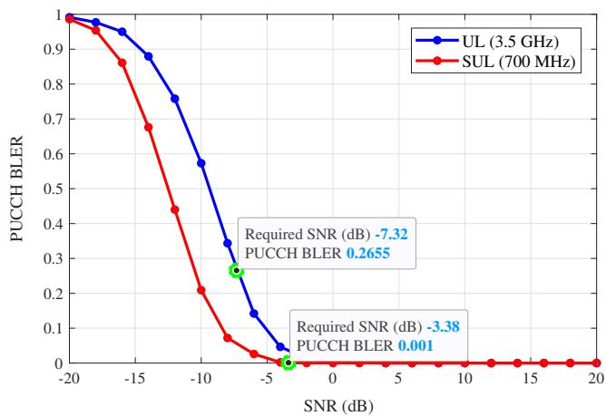  
Fig. 2: UL and SUL PUCCH BLER

For the comparison of the UL PUCCH BLER and the SUL PUCCH BLER, we highlight two points in Fig. 2, which represent the obtained results at the SNR levels required for achieving the target performance of 1% of the PUCCH BLER. Similarly to the PUSCH evaluation, the SNR values marked in Fig. 2 are taken from 3GPP TS 38.141 [19]. The learning from Fig. 2 is that SUL for PUCCH communications helps achieve not only lower BLER than that in the TDD UL but also the target performance of PUCCH BLER as specified by 3GPP.

We further assess another PRACH-related performance gain of SUL, namely, the probability of detection (Pd) of PRACH preambles [19]. The latter is defined as the ratio between the total number of detected preambles with the correct timing estimate and the total number of transmitted preambles within an observation interval. This key performance indicator (KPI) is important because it indicates whether the base station correctly received the preamble and determined the timing estimation, which are the key steps in the random access procedure [23].

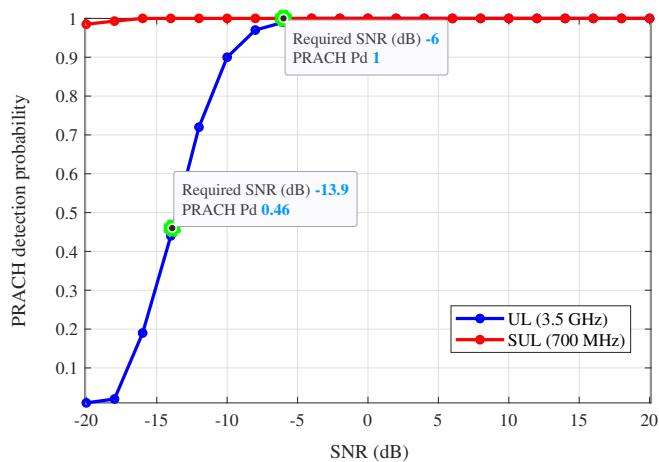  
Fig. 3: Detection probability of PRACH preambles in UL and SUL

The obtained results for PRACH Pd are summarized in Fig. 3, which shows that using the 700 MHz SUL provides better Pd values than for the case of 3.5 GHz UL. The type of the PRACH preambles is what makes a difference between the two alternatives. Long preambles are used in the SUL (PRACH format 0), while short preambles are used in the UL (PRACH format B4), as given in Table III. According to [23], long preambles have extended Zadoff-Chu (ZC) root sequences, which can better capture the timing advance (TA) at the base station side and thus offer an improved PRACH detection. Another important observation in Fig. 3 is related to the 99% target performance of PRACH Pd as specified by 3GPP [19]. It can be observed that the target performance is achieved by the SUL (Pd = 100%), while UL provides a lower value than the target Pd (Pd = 46% < 99%) at the required SNR.

## C. Switching Costs

As discussed in Subsection IV-B, by switching from the 3.5 GHz UL to the 700 MHz SUL, NR RedCap devices improve their UL performance in terms of PUSCH coverage, PUCCH BLER, and detection probability of PRACH preambles. These performance gains are valuable, especially in the cases where the RedCap UE is outside the coverage area of the NR UL. It is also worth mentioning that the demonstrated improvements in the NR UL performance can be achieved without increasing the device complexity as discussed in Section III.

However, it is also important to understand whether preferring SUL over UL incurs any impact on other UL performance metrics. Fig. 4 and 5 illustrate the obtained PUSCH throughput and BLER, respectively. Both plots show the inferior performance of SUL PUSCH mainly due to the use of reduced TBS values in lower frequencies [20]. These preliminary results confirm that switching from the 3.5 GHz UL to the 700 MHz SUL enhances the UL performance of NR RedCap in terms of several metrics but causes the degradation of some other KPIs.

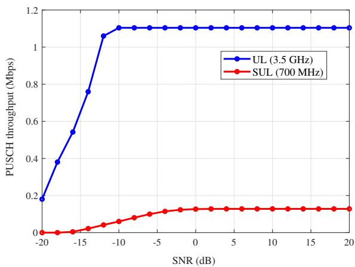  
Fig. 4: PUSCH throughput in UL and SUL

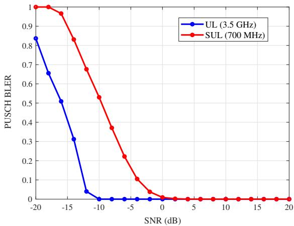  
Fig. 5: UL and SUL PUSCH BLER

Based on this assessment, further research is needed to make use of the performance gains of SUL for NR RedCap without compromising the ability to meet the application requirements. One potential solution is to specify the use cases of SUL by RedCap devices. These use cases need to be defined (i) in terms of the experienced communication KPIs and required application performance, and (ii) in a way ensuring that the end-user experience is not adversely affected by switching from the main NR UL to the NR SUL. For instance, SUL can be employed by RedCap wearable devices with high probability of moving outside the coverage of NR UL (e.g., highly mobile users in the factory) and that generate elastic traffic. The latter is used to support applications that can adapt their requirements to the available resources in the network [24]. Hence, this is an interesting use case of SUL in industrial environments because in such scenarios switching from the main NR UL to the NR SUL allows to enhance the coverage and meet the application requirements.

## V. CONCLUSION

UL enhancement technologies in 5G and beyond networks are essential to meet the requirements of the emerging industrial applications and particularly of the services employing RedCap devices due to their limited capabilities. In this work, we studied the multi-band operation of RedCap devices and considered SUL as the technology that can enhance the NR RedCap UL performance. In addition, we supported this study with our LLS-based assessment of the performance gains and costs of switching from TDD UL to FDD SUL.

This performance evaluation can be further extended to cover other metrics of interest, such as the switching time between NR UL and NR SUL carriers and its impact on the overall UL communication latency. Future directions of this work may also include an extension to system-level simulations and related KPIs.

## ACKNOWLEDGMENTS

The authors gratefully acknowledge funding from the European Union's Horizon 2020 Research under the Marie Sklodowska Curie grant agreement no. 813278 (A-WEAR: A network for dynamic wearable applications with privacy constraints, http://www.a-wear.eu/). This work was also supported by the Academy of Finland (projects Emc2-ML, RADIANT, and IDEA-MILL).

## REFERENCES

[1] T. Nakamura, “5G Evolution and 6G,” in 2020 IEEE Symposium on VLSI Technology. IEEE, 2020, pp. 1–5.

[2] H. Yue et al., “5G Wireless Evolution White Paper: Towards a Sustainable 5G,” White Paper, 2021.

[3] J. Navarro-Ortiz, P. Romero-Diaz, S. Sendra, P. Ameigeiras, J. J. Ramos-Munoz, and J. M. Lopez-Soler, “A survey on 5G usage scenarios and traffic models,” IEEE Communications Surveys & Tutorials, vol. 22, no. 2, pp. 905–929, 2020.

[4] H. Ji, Y. Kim, T. Kim, K. Muhammad, C. Tarver, M. Tonnemacher, J. Oh, B. Yu, and G. Xu, “Enabling Advanced Duplex in 6G,” in 2021 IEEE International Conference on Communications Workshops (ICC Workshops). IEEE, 2021, pp. 1–6.

[5] “5G Uplink Enhancement Technology,” ZTE Corporation, White Paper, 2020.

[6] P. Osterrieder, L. Budde, and T. Friedli, “The smart factory as a key construct of Industry 4.0: A systematic literature review,” International Journal of Production Economics, vol. 221, p. 107476, 2020.

[7] S. Saafi, G. Fodor, J. Hosek, and S. Andreev, “Cellular Connectivity and Wearable Technology Enablers for Industrial Mid-End Applications,” IEEE Communications Magazine, vol. 59, no. 7, pp. 61–67, 2021.

[8] “Study on support of reduced capability NR devices (Release 17),” 3GPP, TR 38.875, December 2020.

[9] S. Moloudi, M. Mozaffari, S. N. K. Veedu, K. Kittichokechai, Y.-P. E. Wang, J. Bergman, and A. Hoglund, “Coverage Evaluation for 5G ¨ Reduced Capability New Radio (NR-RedCap),” IEEE Access, vol. 9, pp. 45 055–45 067, 2021.

[10] M. Agiwal, H. Kwon, S. Park, and H. Jin, “A Survey on 4G-5G Dual Connectivity: Road to 5G Implementation,” IEEE Access, vol. 9, pp. 16 193–16 210, 2021.

[11] “5G Standalone Architecture,” Samsung, Technical White Paper, 2021.

[12] G. Yuan, X. Zhang, W. Wang, and Y. Yang, “Carrier aggregation for LTE-advanced mobile communication systems,” IEEE Communications Magazine, vol. 48, no. 2, pp. 88–93, 2010.

[13] A. Kolackova, S. Saafi, P. Masek, J. Hosek, and J. Jerabek, “Performance Evaluation of Carrier Aggregation in LTE-A Pro Mobile Systems,” in 2020 43rd International Conference on Telecommunications and Signal Processing (TSP). IEEE, 2020, pp. 627–632.

[14] “NR; User Equipment (UE) radio transmission and reception; Part 1: Range 1 Standalone (Release 17),” 3GPP, TS 38.101-1, January 2021.

[15] “NR; NR and NG-RAN Overall Description; Stage 2 (Release 16),” 3GPP, TS 38.300, January 2020.

[16] “Supplementary uplink (SUL) and LTE-NR co-existence (Release 15),” 3GPP, TR 37.872, July 2018.

[17] “NR Supplementary uplink (SUL) (Release 16),” 3GPP, TR 37.716-00- 00, July 2020.

[18] A. Mihovska, R. Prasad et al., “Overview of 5G New Radio and Carrier Aggregation: 5G and Beyond Networks,” in 2020 23rd International Symposium on Wireless Personal Multimedia Communications (WPMC). IEEE, 2020, pp. 1–6.

[19] “NR; Base Station (BS) conformance testing Part 1: Conducted conformance testing (Release 17),” 3GPP, TS 38.141-1, January 2021.

[20] “Coverage recovery and capacity impact for RedCap,” 3GPP, TDoc R1- 2008865, October 2020.

[21] “Massive IoT Coverage in The City,” Ericsson, Mobility Report, 2017.

[22] I. P. Nasarre, T. Levanen, K. Pajukoski, A. Lehti, E. Tiirola, and M. Valkama, “Enhanced Uplink Coverage for 5G NR: Frequency-Domain Spectral Shaping With Spectral Extension,” IEEE Open Journal of the Communications Society, vol. 2, pp. 1188–1204, 2021.

[23] A. Zhong, Z. Li, R. Wang, X. Li, and B. Guo, “Preamble Design and Collision Resolution in a Massive Access IoT System,” Sensors, vol. 21, no. 1, p. 250, 2021.

[24] S. M. Salman, S. Mubeen, F. Markovic, A. V. Papadopoulos, and ´ T. Nolte, “Scheduling Elastic Applications in Compositional Real-Time Systems,” in 2021 26th IEEE International Conference on Emerging Technologies and Factory Automation (ETFA). IEEE, 2021, pp. 1–8.