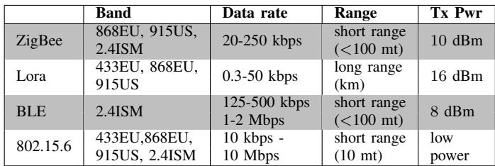
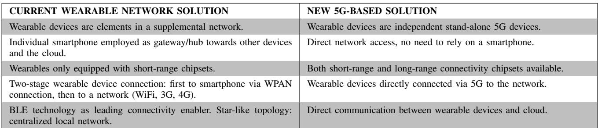
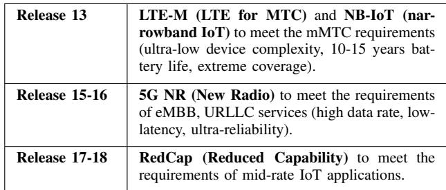
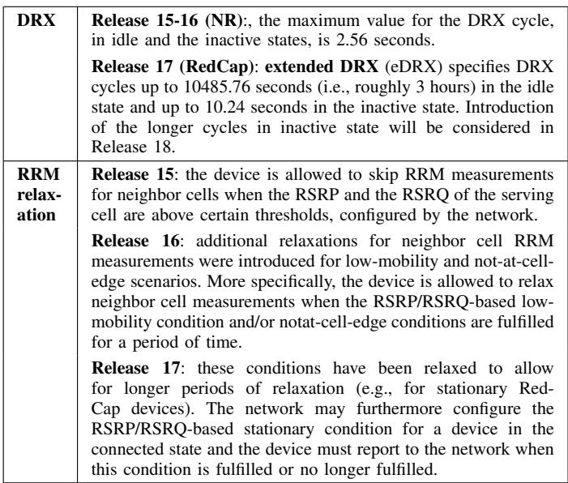

# How 5G can support worker well-being: The RedCap solution

Giada Giorgi, Claudio Narduzzi

Dept. of Information Engineering, University of Padova, Italy, Email: giada@dei.unipd.it

Abstract—A monitoring system may involve the connection of several different IoT (Internet of Things) devices, that continuously generate, process and transmit comparatively limited amounts of data in real-time. In this study we refer to monitoring applications related in general to worker well-being and workplace safety, and evidence network function requirements arising from this kind of applications. We discuss how these might best be tackled in a wearable sensor system based on the 5G architecture, by leveraging the essential features of 5G reduced capability (RedCap) specifications introduced by 5G Release 17.

Index Terms—monitoring, worker health and safety, wearable sensors, 5G network, RedCap

## I. INTRODUCTION

The emergence of 5G systems is rapidly changing the role of communication infrastructures for several kinds of services, ranging from industrial automation to telemedicine and monitoring [1]. 5G networks are characterized by a service-based, software-defined network (SDN) architecture, where system elements are defined as virtualized network functions. This allows to compose modular functions to build and manage what is called a network slice, loosely speaking, a “network within a network” that can be designed to meet the requirements of use cases in a specific application by a suitably tailored service specification [2], [3].

The evolving nature of work has led to new health issues, in particular stress and mental disease. Other reported problems can be attributed to exposure to high noise levels, or to air pollution, asthmagens, carcinogens and hazardous agents, that may cause asthmatic and allergic reactions [4]. In this context, wearable sensing may have a strong impact on occupational health and safety of workers [5], [6].

In this study we refer to health monitoring applications related in general to worker well-being and safety in workplaces. Several examples can be found in the literature, for instance, awkward postures can be detected by motion capture systems [7] or by inertial measurement units (IMUs) embedded in tshirts [8], while physical fatigue can be inferred by considering combinations of IMUs with data acquired from surface electromiography (sEMG) [9] or from lactate sensing [10]. Analyses of heart rate variability (HRV) and respiratory rate (RR) also allow to infer information about health conditions, and were applied for workers in high altitude conditions [11].

Developments made possible by 5G networks are already seeing basic sensing complemented by two-way video, both to relay images and to provide safety-related visor-based guidance. In this field, leading providers and producers of network equipment are proposing several safety applications based on private 5G networks. A scenario involving an emergency system based on 5G and augmented reality wearable devices is described in [20], evidencing the importance of a dedicated low-latency link. The authors demonstrated the possibility of significant improvement in first aid quality thanks to the seamless connectivity provided by the new 5G technology, enabling an expert medical group in the receiving hospital to follow condition changes in real time while a patient was still in an ambulance and, therefore, intervene and guide the treatment in advance.

Another important aspect is the potential for collecting information that can help assess individual worker risk profiles and determine actual exposure to specific risk factors. This opens the possibility of contributing to an important and so far less investigated area in the development of human-digital twins (HDT), and support the human-centric approach to work activities proposed by Industry 5.0 [12].

A dedicated application for worker safety and well-being requires a peculiar combination of data streaming features and low-latency alarm services. This can be optimally supported in the context of 5G, where each network slice may serve a particular service type with agreed upon Service-Level Agreement (SLA). Through software definition and virtualization, the underlying physical network structure is allowed to properly configure network resources enhancing scalability and flexibility, with optimal resource sharing and dedicated resources to correspond to the demands of a specific service (e.g., automotive slice, electric power monitoring slice, healthcare slice, etc). Capitalizing on efficiency improvements and reduced costs, the implementation of a dedicated “safety monitoring” slice may then become a viable proposition.

The purpose of this study is to evidence network function requirements arising from this kind of applications and discuss how these might best be tackled by a wearable sensor system based on the 5G architecture, by leveraging the essential features of 5G reduced capability (RedCap) specifications introduced by 3GPP Release 17.

Two kinds of use cases based on IoT devices are taken as examples in the following, namely, the monitoring of work conditions and hazards in restricted and possibly polluted spaces, and the supervision of conditions for professional drivers and, more generally, drivers of heavy machinery that might be subjected to stress conditions for protracted times. In both cases, low-rate monitoring is combined with local processing and network data transfer when normal work conditions prevail, but at the same time asynchronous, highpriority low-latency alarm messages must be supported to ensure worker safety.

## II. WEARABLE DEVICES AND RISK FACTORS

## A. Requirements

Typical risk factors for workers can be generally divided in two categories, namely, factors associated with the workplace, such as acoustic noise, vibrations, exposure to dangerous substances, and factors that can be directly associated to a worker, including awkward postures, forceful exertions, repetitions, physical fatigue, mental fatigue, falls, etc.. In the former case, sensors don’t strictly need to be worn by a worker, but could be placed near the subject. For the second category wearable sensors are needed, located on the body or embedded in the clothes a worker wears. The choice of sensors is restricted by different subjective factors, such as wearability, comfort, acceptability. In particular, devices shall not interfere with normal work activities and must be safe for the user. Consideration must also be given to social and ethical issues, in particular technologies must be respectful of the autonomy, dignity and privacy of a worker [14]. These factors must be carefully evaluated and represent a significant challenge in the design of a wearable solution. It then becomes important to look for highly miniaturizable solutions, that can be easily integrated in objects of everyday use. Truly wearable devices must be small, which also means chipsets and antennas should have reduced size and complexity. Devices are generally characterized for being low-power, low-size and extremely miniaturized, which allows integration in wristwatches, shoes and insoles, t-shirts, rings, etc., in a very comfortable way.

In typical emergency scenarios that may be associated with workplaces, instantaneous communication between local wearable devices and healthcare providers, or first-aid medical centers, can significantly help local rescuers in treating workers with greater speed and accuracy, thanks to remote connection with medical experts1.

## B. Connectivity: State of the Art

Wearable sensing devices must be enabled to forward data to a centralized data management and emergency unit. Most frequently, they are deployed as part of a personal body area network where an individual smartphone acts as hub or gateway to transmit data to the cloud, either directly, or after pre-processing in some custom application. A wearable device thus directly transfers raw data – without any processing or compression – to a smartphone, that can more easily extract augmented information and even perform some data fusion, before transmission through a broadband mobile network [13].

TABLE I  
MAIN PARAMETERS OF THE CURRENT IOT PROTOCOLS.  

For the purposes of this discussion it suffices to mention the most significant implementation approaches. A widely employed solution is based on Bluetooth Low Energy (BLE) interface and protocols. BLE is a short-range communication protocol for Wireless Personal Area Network (WPAN) that can transmit data on the 2.4 GHz unlicensed Industrial, Scientific, and Medical (ISM) band up to a maximum distance of 100 meters. The most straightforward pattern of a Bluetooth network is a piconet, which is typically composed of a master node (i.e., a gateway node), and a given set of active slave nodes (up to a maximum of 7 nodes).

A biomedical signal monitoring system based on the Zigbee protocol was proposed in [17]. ZigBee is based on the IEEE.802.15.4 standard for low-cost devices requiring low energy consumption and characterized by data rates that cannot exceed 250 kb/s, within a range of about 100 meters in open space. Like BLE-based devices, ZigBee nodes can be locally organized in a WPAN.

Other solutions from the literature include a distributed measurement system based on the IEEE 802.15.6 standard, enabling real-time cardiac activity monitoring in a home scenario at rest [15]. This standard [16] also makes use of the 2.4-GHz ISM band, although other frequency bands are possible. Advantages in its use – such as very low transmission power, to minimize specific absorption rate (SAR) and increase battery duration, and the possibility to manage data with different levels of priority – are offset by the lack of supporting commercial solutions.

Long Range Wide Area Network (LoRaWAN) technology allows long-range connection of remote sensors to a central unit, dispensing with a local gateway. It operates mainly in the EU 863–870 MHz ISM Band, around 868 MHz, which obviously leads to antennas that are difficult to miniaturize for the use with wearable devices. LoRaWAN is typically employed for very low data-rate acquisition, e.g., for environmental parameters and in applications where latency is not critical [18]. It is less well suited for continuous real-time streaming of time-evolving signals, in the kind of wearable monitoring applications mentioned in the Introduction [19].

Main parameters of currently employed IoT protocols are summarized in Table I.

TABLE II  
COMPARISON BETWEEN CURRENT WEARABLE NETWORK SOLUTIONS AND FUTURE NEW 5G-BASED SOLUTIONS.  

## III. 5G-BASED SYSTEMS

## A. Network slicing

A key feature of 5G networks is the adoption of a new core network architecture (Next Generation, NG), that separated traditional core network functions into a more fine-grained structure allowing both greater physical heterogeneity and better service convergence [21]. Modular functions can be composed to build and manage what is called a network slice. Loosely speaking, a network slice can be understood as a “network within a network”, providing suitable end-to-end QoS with optimal resource sharing and dedicated resources to correspond to the demands of a specific service (e.g., automotive slice, electric power monitoring slice, healthcare slice, etc).

A 5G slice is defined by considering different attributes, such as latency, throughput and node mobility, with a control plane service implementation tailored to that slice. For instance, access control and session management are separated in the 5G NG architecture, to better support fixed access and ensure scalability and flexibility. Network slicing can offer a homogeneous connectivity environment from IoT edge devices to cloud servers, enabling to set-up dedicated monitoring services for which physical resource provisioning is effectively managed within the network. One of the main efforts in designing a new service over 5G consists then in clearly defining the required QoS levels for the application, with a focus on specific performance requirements such as latency and throughput.

## B. Pre-defined use cases

Some well-recognized primary use cases are already properly targeted in 5G specifications, the three specific classes being massive machine-type communication (mMTC), enhanced mobile broadband (eMBB) and ultra-reliable, lowlatency communication (URLLC). The network slices that can correspondingly be defined differ significantly in terms of the addressed data rate, latency, connection density, and energy consumption requirements, and are identified by a specific value of the Slice/Service Type (SST) 8-bit field in the 32- bit Single – Network Slice Selection Assistance Information (S-NSSAI) network slice identifier.

Massive machine-type communication (mMTC) or massive IoT (mIoT) was the main focus in 5G Release 13, that introduced two LTE-related radio technologies, LTE for MTC (LTE-M) and Narrowband Internet of Things (NB-IoT). LTE-M and NB-IoT support power-sensitive low data rate IoT applications, characterized by the need to communicate limited amounts of infrequent data. They are well-suited for many IoT applications and guarantee wide area coverage, but may not meet all performance requirements for worker safety and wellbeing.

In 5G Releases 15 and 16 attention was mainly focused on enhanced mobile broadband (eMBB) and ultra-reliable, lowlatency communication (URLLC) services (5G Rel. 15 introduced 5G New Radio (NR), further evolved in Rel. 16). eMBB is the main deployment driver for consumer applications and smartphones, providing the highest data rate and a maximum bandwidth of 100 MHz in the FR1 frequency range and 400 MHz in the FR2 frequency range. Devices are expected to support full-duplex operation with frequency division duplexing (FD-FDD), enabling the simultaneous transmission and reception in the downlink and the uplink frequency bands. This requires multiple duplex filters and at least two, but possibly four receiver antennas. The URLLC use case targets mission critical applications, such as robotics, autonomous vehicles, and industrial automation. Solutions offer the lowest latency and the highest network reliability, addressing very specific IoT applications that require ultra-low latency, but become too complex and costly in other situations. Performance targets for eMBB in particular lead to significantly complex chipset designs, that are broadly over-dimensioned and too costly for the majority of IoT use cases.

## C. RedCap: main features from 5G Release 17

Table II compares current wearable sensing solutions, mainly based on BLE, with corresponding 5G-based solutions. It is straightforward to note that 5G enables seamless integration with smartphones but does not need to rely on them. New 5G-based wearable devices could be equipped both for short-range and long-range solutions. In the second case, a local wearable device can directly access the network and cloud services, both for computation and storage purposes. This means that multiple wearable devices located on, or in proximity of, a given subject may operate independently as stand-alone devices and do not need to be organized in a local network topology, as required by protocols such as BLE, ZigBee or IEEE 802.15.6.

TABLE III COMPARISON OF DIFFERENT 5G RELEASES.  

5G wireless network architectures are developing towards increased support for IoT applications. Release 17 at last developed the essential features to support mid-rate IoT applications, enabling reduced capability (RedCap) new radio (NR) devices. These new devices are characterized by a lower cost/complexity, smaller physical size and longer battery life compared to regular 5G NR devices. Table III summarizes the relevant developments in the latest 3GPP specification Releases.

RedCap devices are characterized by reduced bandwidth and lower complexity when compared to devices designed for eMBB and URLLC: this results in lower cost and smaller size, within acceptable ranges for wearable form factors. Since the main target is complexity reduction – and therefore cost reduction – most devices will likely deploy only in the FR1 frequency range (410 MHz to 7125 MHz), for which 5G Rel. 17 specifies a maximum bandwidth of 20 MHz. Data rate may vary depending on the actual network configuration and the type of duplex operation. RedCap doesn’t require simultaneous transmission on uplink and downlink frequencies, and supports half-duplex frequency division duplexing (HD-FDD), but peak data rate can be higher than LTE-M. Support for further simplified devices is planned for the new 5G Rel. 18 RedCap, where targeted peak data rate is about 10 Mb/s.

A set of power saving techniques, enabling longer battery lifetime, were introduced (or enhanced) for RedCap devices, namely: discontinuous reception mechanism, relaxation of radio resource management measurements and wake-up. They are summarized in Table IV.

Discontinuous Reception (DRX) was introduced for 5G NR in Release 15. It allows a device to enter a sleep mode during periods of inactivity, achieving a power saving state (e.g., by turning off its receiver) that significantly reduces power consumption. DRX thus sets a tradeoff between power consumption and latency during down-link operations and it is particularly useful in the case of intermittent or bursty data traffic.

Another power saving mechanism concerns Radio Resource Management (RRM) measurements during idle and inactive states. These measurements are based on the reference signal received power (RSRP) and reference signal received quality (RSRQ) values obtained from the serving cell of a device as well as from its neighboring cells. Such measurements are extremely useful for achieving the best service quality and are frequently perform, also during idle and inactive states, to ensure that the device is camping on the best available cell. Devices may be allowed to skip RRM measurements once a connection is established, as explained in Tab. IV. In a comparatively static scenario this may provide some advantage, as these measurements will drain the battery even when there is no active data transmission.

TABLE IVCOMPARISON OF POWER SAVING TECHNIQUES.  

Finally, the use of a low-power wake-up receiver (WUR) and wake-up signal (WUS) can be considered as a power saving technique. This feature will be introduced within 5G Release 18 [24] and represents an attractive solution that allows to reduce energy consumption without compromising downlink latency.

The use cases best served by 5G RedCap will be industrial sensors (pressure sensors, motion sensors, accelerometers, actuators), surveillance cameras and wearable devices (smart watches, medical monitoring devices, visors and AR/VR goggles). The specific worker safety and well-being cases addressed in this paper are considered to fall in this category. Although there is no explicit definition of what a “midrange” IoT use case should be, this is generally understood as addressing situations where balanced tradeoffs among latency, throughput, complexity and energy efficiency are needed.

## IV. SAFETY MONITORING IOT 5G APPLICATION

The new 5G scenario will provide greater flexibility in the implementation of distributed monitoring systems. Local devices may collect raw data and simply transmit them directly to some cloud service as independent 5G devices. Required computing power is minimal, whereas sensor driving and data transmission are the main draw on local energy resources.

Alternatively, some light post-processing is carried out on raw data and the local device would only send meaningful data to the cloud. Compatibly with the computing capabilities of local devices, cloud services might then be focused on data analytics, whereas sensing units are also tasked with feature extraction. In some applications, this might be exploited to provide very low-latency early warning for potentially dangerous conditions.

Increasingly flexible support through network slicing is going to add further options. For instance, edge processing may be available to process data from wearable sensors in some 5G network nodes. This allows to access more sophisticated signal processing algorithms, that might be provided by third parties as services. At the same time, requirements for core network resources and response latency would decrease. This can result in enhanced monitoring with lower costs. The design of highly optimized and cost-effective monitoring services thus depends on careful assessment of use cases, with present and anticipated future requirements [22], [23]. Tradeoffs between energy, computing power, communication bandwidth and latency consumption must be carefully analyzed.

The two examples mentioned in the Introduction can now be analyzed to discuss key performance requirements.

## A. Work hazards monitoring in restricted spaces

Safety in restricted spaces subjected to pollution hazards may require some bursts of activity to address critical situations, although data rates may be expected to be routinely low. A similar network operating profile may be assumed for monitoring professional drivers. The most significant difference is in the kind of wearable device that is considered in the two situations, that in turn determines its range of functionalities as 5G user equipment (UE).

In the former case the emphasis is on personal protective equipment, for which a lower degree of miniaturization can be acceptable. Duration of the activity, e.g., inspection of tunnels or maintenance within chemical tanks, can be assumed to be limited, on the other hand electrochemical sensors are most likely needed, consequently energy efficiency requirements have to be relaxed. For this application, baseline safety functionalities can already be implemented in a 4G environment, and the software defined network approach of the NG architecture underlying 5G allows to implement a staged transition, whereby also legacy systems based on LoRaWAN can be managed [27]. With full-featured 4G and 5G RedCap, availability of broader band connectivity enables the implementation of additional functionalities, such as visoror goggle-based interaction to overview inspection and maintenance procedures.

A significant difference from the application discussed next concerns mobility, that may not be required for monitoring in restricted spaces. In this case fixed access can suffice, and may represent a significant difference in the implementation cost of the service. For instance, RRM relaxation (Table IV) can be implemented.

## B. Condition and stress monitoring for professional drivers

Monitoring of professional drivers is going to be a daylong activity, requiring particular attention to wearability and subject comfort, which pushes requirements towards small form factor, may limit the amount of electronics within a sensing unit, and constrain the size and shape of antennas. On the other hand, the requirements of a monitoring application can be supported by the vehicle communication functions, and might be integrated within a 5G network slice dedicated to vehicular wireless networks (V2X). Although sensing based on electrical fields in the body (like ECG and sEMG) may be considered, a more practical and less intrusive approach can be based on photopletismography and pulse oximetry [25], [26], in which case light-emitting diode (LED) drive currents have a significant impact on overall energy efficiency. For this case the issue needs to be given careful consideration, capitalizing on power-saving features specified by the latest 5G Releases.

Attention also needs to be focussed on denoising and artefact removal, since any vehicular work environment can contribute significant levels of disturbance. The problem is usually addressed by introducing auxiliary sensors such as triaxial accelerometers, to provide associated information which, of course, increases the amount of data that need to be processed. Nevertheless, a typical application might involve three PPG channels at different LED wavelengths and three accelerometer channels and, assuming for instance continuous sampling at a frequency of 125 Hz with 16-bit analogue-todigital converters, this yields a total data flow of just 12 kb/s for a sensing unit. This can be easily managed by a low-cost 5G radio interface, whereas a signal processing service using network edge computing can more effectively take care of signal enhancement and feature extraction.

It must be recognized that workers may show some aversion towards this kind of monitoring, since specific information, that may be considered personal and private, would be acquired. This pushes the case for implementation of the service by a private, or non-public network (NPN) in 5G terms. This is one more possibility offered by network slicing, that allows to separate the dedicated worker monitoring network from the general 5G network and manage security independently. On the other hand, acquisition of information about worker hazard and stress levels in an unstructured environment, as found by professional drivers, may provide some critical insight to help plan work schedules and optimize safety.

## V. CONCLUSIONS

The evolution of 5G towards software-defined networking offers a high level of flexibility that enables a rapid deployment of network functions and innovative, dynamic and reconfigurable services at economically sustainable costs. For a comparatively restricted market, like distributed measurement and monitoring, this represents a strongly attractive proposition.

Availability of supporting hardware is still limited, since the first 5G modem supporting the RedCap radio standard, called NR-Light, was presented in 2023 [28]. Nevertheless, the advent of 5G in wearables is going to create a new perspective in the evolution of distributed monitoring systems. Wearable sensing devices can help workers stay safe and healthy in several varied workplaces, and 5G RedCap-based devices can represent a significant leap forward in terms of unobtrusiveness, effectiveness and, hence, worker acceptance.

Continuing development of the 5G Specification suite is progressively extending support to a growing variety of services. A number of features, among which network slicing, open the road to the realization of specifically tailored 5G network services, that can support distributed measurement by a seamless combination of elements, to the point of implementing what might perhaps be called “measurement by network”.

## REFERENCES

[1] L. Chettri and R. Bera, ”A Comprehensive Survey on Internet of Things (IoT) Toward 5G Wireless Systems” IEEE Internet of Things Journal, vol. 7, no. 1, pp. 16–32, January 2020.

[2] H. Babbar, S. Rani, A. A. AlZubi, A. Singh, N. Nasser and A. Ali, ”Role of Network Slicing in Software Defined Networking for 5G: Use Cases and Future Directions,” IEEE Wireless Communications, vol. 29, no. 1, pp. 112–118, February 2022.

[3] I. Afolabi, T. Taleb , K. Samdanis, A. Ksentini, and H. Flinck, ”Network Slicing and Softwarization: A Survey on Principles, Enabling Technologies, and Solutions”, IEEE Communications Surveys and Tutorials, vol. 20, no. 3, pp. 2429–2453, 2018.

[4] International Labour Organization, ”Work-related fatalities reach 2 million annually”, Geneva, 24 May 2022. [last accessed: 03-2024]: https://www.ilo.org/global/about-theilo/newsroom/news/WCMS 007789/lang–en/index.htm

[5] Nnaji, C.; Awolusi, I.; Park, J.; Albert, A. ”Wearable Sensing Devices: Towards the Development of a Personalized System for Construction Safety and Health Risk Mitigation”. Sensors 2021, 21, 682. https://doi.org/10.3390/s21030682.

[6] V. Di Pasquale, V. De Simone, M. Radano, S. Miranda, ”Wearable devices for health and safety in production systems: a literature review”, IFAC-PapersOnLine, Volume 55, Issue 10, 2022, Pages 341-346.

[7] D. Battini, N. Berti, S. Finco, M. Guidolin, M. Reggiani, L. Tagliapietra, “WEM-Platform: A real-time platform for full-body ergonomic assessment and feedback in manufacturing and logistics systems”, Computers & Industrial Engineering, 164 (2022) Article Sequence Number: 107881.

[8] E. Sardini, M. Serpelloni and V. Pasqui, ”Wireless Wearable T-Shirt for Posture Monitoring During Rehabilitation Exercises,” IEEE Transactions on Instrumentation and Measurement, vol. 64, no. 2, pp. 439–448, Feb. 2015.

[9] M.J. Pinto-Bernal, C.A. Cifuentes, O. Perdomo, M. Rincon-Roncancio, M. Munera, ”A Data-Driven Approach to Physical Fatigue Management Using Wearable Sensors to Classify Four Diagnostic Fatigue States” Sensors 21, no. 19, 2021.

[10] S. Tonello, T. Fapanni, S. Bonaldo, G. Giorgi, C. Narduzzi, A. Paccagnella, M. Serpelloni, E. Sardini and S. Carrara, ”Amperometric Measurements by a Novel Aerosol Jet Printed Flexible Sensor for Wearable Applications”, IEEE Transactions on Instrumentation and Measurement, vol. 72, 2023, Article Sequence Number: 7500512, DOI: 10.1109/TIM.2022.3225014.

[11] P. Aqueveque, C. Gutierrez, F. Saavedra, EJ Pino, ”Noninvasive health condition monitoring device for workers at high altitudes conditions”. 38th Annual International Conference of the IEEE Engineering in Medicine and Biology Society (EMBC), pp. 2349–2352, 2016.

[12] M. Breque, L. De Nul, A. Petridis, Industry 5.0: towards a sustainable, human-centric and resilient European industry, Luxembourg, European Commission, Directorate-General for Research and Innovation, 2021.

[13] G. Giorgi, A. Galli and C. Narduzzi, ”Smartphone-based IOT systems for personal health monitoring,” in IEEE Instrumentation & Measurement Magazine, vol. 23, no. 4, pp. 41–47, June 2020.

[14] J. Zibuschka, C. Ruff, A. Horch, H. Roßnagel, “A Human Digital Twin as Building Block of Open Identity Management for the Internet of Things”, in: H. Roßnagel, C. H. Schunck, S. Modersheim, D. H ¨ uhnlein ¨ (eds.), Open Identity Summit 2020, Lecture Notes in Informatics (LNI), Gesellschaft fur Informatik, Bonn 2020, pp. 133–142.¨

[15] A. Galli, G. Giorgi and C. Narduzzi, ”Multi-User ECG Monitoring System based on IEEE Standard 802.15.6,” 2019 IEEE International Symposium on Measurements & Networking (M & N), Catania, Italy, 2019.

[16] ”IEEE Standard for Local and metropolitan area networks”, Part 15.6: Wireless Body Area Networks IEEE Std. 802.15.6-2012, 2012.

[17] J. Alves, A. Catarino, H. Carvalho, J. Monteiro and A. M. Rocha, ”Throughput limits of two 802.15.4 wireless networks applications for signal acquisition,” 2011 IEEE International Symposium on Industrial Electronics, Gdansk, Poland, 2011, pp. 951–956.

[18] A. Fort, E. Landi, Ma. Mugnaini, L. Parri, A. Pozzebon, V, Vignoli, “A LoRaWAN Carbon Monoxide Measurement System with Low-Power Sensor Triggering for the Monitoring of Domestic and Industrial Boilers”, IEEE Transactions on Instrumentation and Measurement, vol. 70, 2021, Article Sequence Number: 5500609, DOI: 10.1109/TIM.2020.3034964

[19] G. Giorgi, A. Pozzebon and C. Narduzzi, ”Waveform monitoring with LoRaWAN: Is it feasible?,” 2022 IEEE International Symposium on Measurements & Networking (M& N), Padua, Italy, 2022

[20] M. Wang, H. Ji, M. Jia, et al. ”Method and application of information sharing throughout the emergency rescue process based on 5G and AR wearable devices”. Sci Rep 13, 6353, 2023.

[21] H.-J. Einsiedler, P. Sellstedt, R. Trivisonno, A. Gavras, R. Aguiar and D. Lavaux, “System Design for 5G Converged Networks”, in: Proc. 2015 European Conference on Networks and Communications (EuCNC), Paris, France, June 2015, pp. 391–396.

[22] H. Sun, Z. Zhang, R. Q. Hu and Y. Qian, ”Wearable Communications in 5G: Challenges and Enabling Technologies,” IEEE Vehicular Technology Magazine, vol. 13, no. 3, pp. 100-109, Sept. 2018

[23] Y. Hao, D. Tian, G. Fortino, J. Zhang, I. Humar, “Network Slicing Technology in a 5G Wearable Network”, IEEE Communications Standards Magazine, March 2018, pp. 66-71.

[24] A. Hoglund, M. Mozaffari, Y. Yang, G. Moschetti, K. Kittichokechai, R. Nory, ”3GPP Release 18 Wake-up Receiver: Feature Overview and Evaluations”, arXiv, 06 Jan. 2024, https://arxiv.org/pdf/2401.03333.pdf.

[25] L. Studer, V. Paglino, P. Gandini, A. Stelitano, U. Triboli, F. Gallo, G. Andreoni, “Analysis of the Relationship between Road Accidents and Psychophysical State of Drivers through Wearable Devices”, Applied Sciences, 2018, 8, 1230, pp. 1-17.

[26] Attaur-Rasool S, Izaz-ur-Rahman, and Wajih-ur-Rehman, “Use of Wearable Technology to Measure Influence of Driving Stress on Heart Rate of Professional Drivers”, Journal of Saidu Medical College, vol. 10, no. 1, pp. 35–38, 2020.

[27] H. Jradi, F. Nouvel, A. Ellatif Samhat, J.-C. Prevotet, and M. Mroue, ´ ”A Seamless Integration Solution for LoRaWAN Into 5G System”, IEEE Internet of Things Journal, vol. 10, no. 18, pp. 16238–16252, 15 Sept. 2023

[28] Snapdragon X35 5G Modem-RF System, https://www.qualcomm.com/products/technology/modems/snapdragonx35-5g-modem-rf-system, accessed: April 24th, 2024