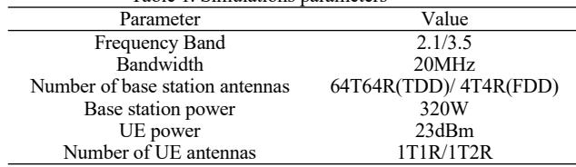
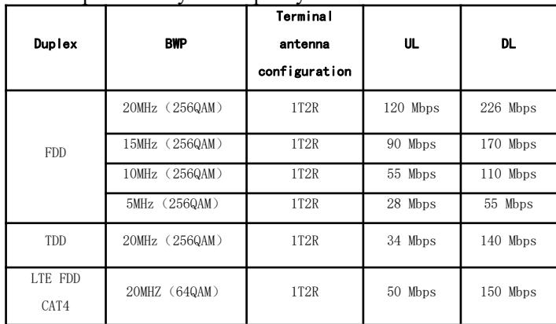
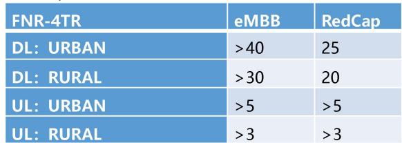
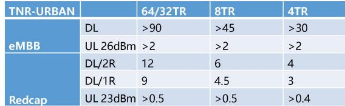
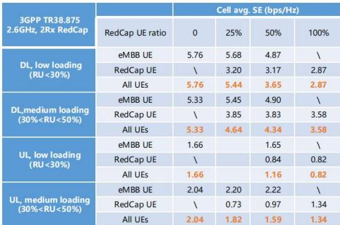

# RedCap Performance Analysis and Deployment Strategy Research

Pu Song1 Shangkun Xiong1 Qiao Wang

1 China Telecom, Beijing 102218, China

2 China Telecom Group, Beijing 100032, China

Abstract—To meet the requirements of IoT applications for lower cost, lower power consumption, and lower complexity of 5G deployment, 3GPP proposes a type of 5G lightweight user terminal (RedCap UE). Firstly, the technical characteristics of RedCap were introduced. Then, an in-depth performance analysis was conducted on RedCap from the aspects of network coverage, RedCap capacity performance, RedCap latency performance, and the coexistence of RedCap and regular NR services. Finally, based on the performance analysis results, RedCap network deployment strategies were proposed, including RedCap network positioning, frequency deployment strategies, and BWP configuration strategies.

Keywords- RedCap; Performance Analysis; Deployment Strategy

## I. INTRODUCTION

In recent years, with the rise of Internet of Things technology, the scale of Internet of Things users has rapidly expanded. As of the end of 2022, three basic telecommunications operators in China have developed 1.845 billion cellular Internet of Things users, with a net increase of 447 million users throughout the year, which is 161 million more than the number of mobile phone users, achieving "Internet of Things Superman" for the first time. Cellular Internet of Things is a way of connecting physical devices (such as sensors) to the Internet, which connects physical devices and mobile phones on the same mobile network. IoT terminals generally have advantages such as simple infrastructure, long standby time, and low deployment costs.

The existing 5G technology provides more possibilities for the development of the Internet of Things, but the high cost of 5G terminal modules has become one of the obstacles to its development. The IoT industry, including intelligent vehicle connectivity, smart wearables, and industrial monitoring, has a coexisting demand for improving technical performance and reducing terminal module costs. As a result, lightweight 5G RedCap has emerged.

5G lightweighting is considered a milestone technology defined in the 3GPP R17 protocol standard, with the goal of achieving cost performance optimization and providing more efficient and flexible solutions for various industry application scenarios. This technology is an important foundation for 5G to achieve the interconnection of people, machines, and things. It will play a positive role in building new infrastructure for the Internet of Things, empowering the transformation and upgrading of traditional industries, and promoting the deep integration of the digital economy and the real economy.

Promoting the evolution of 5G RedCap technology can effectively reduce the cost of 5G applications and innovation, accelerate the replication speed of 5G applications, deepen the integration of 5G and the industry, and play a good role in promoting the large-scale development of 5G applications.

In August 2023, the Ministry of Industry and Information Technology issued the "Notice on Promoting the Evolution and Innovative Development of 5G Lightweight Technology (Draft for Comments)" (hereinafter referred to as the "Draft for Comments"). The draft for soliciting opinions proposes that by 2025, a series of highquality 5G lightweight products will be formed, and the cost of key industrial links such as 5G lightweight chips, modules, and terminals will continue to decrease, with over 100 terminal products. Realize 5G lightweight coverage in cities at or above the county level nationwide, and achieve tens of millions of growth in the number of 5G lightweight connections. The application scenarios of 5G lightweight in industries, energy, logistics, vehicle networking, public safety, smart cities, and other fields are becoming more diverse, and the application scale continues to increase.

With the deep integration of 5G and various applications, in order to deeply empower the digital transformation of various industries, 5G needs more comprehensive and accurate end-to-end full stack solutions, among which the comprehensive perception of low-speed, medium high speed, and ultra high speed IoT coverage is an important foundation. Relying on its ability to tailor and preserve the native features of 5G, RedCap has become an important puzzle for the medium to high speed Internet of Things in the 5G era, forming a comprehensive coverage of 5G lowspeed, medium to high speed, and ultra high speed Internet of Things scenarios, improving the comprehensiveness and accuracy of 5G end-to-end solutions. In the future, with the gradual reduction of RedCap terminal costs, 5G end-to-end solutions will be more widely applied in various aspects of the digital econo promoting "scale replication" of projects and effectively promoting the construction of Digital China. Moreover, with the support of 5G's native features, various innovative technologies and models based on RedCap terminals and solutions will also emerge vigorously, adding vitality to the digital economy. The widespread application of RedCap promotes the rapid maturity of the industrial chain, and the maturity of the industrial chain in turn drives the deepening of RedCap applications. The two drive each other and form a closed loop of integrated development in the industry.

However, the networking performance indicators of 5G RedCap in China are still in the theoretical analysis stage and lack actual measurement data. It is urgent to organize field testing and verification to guide the actual networking construction of RedCap. Therefore, this article first analyzes the technical characteristics of 5GRedCap, studies the technical characteristics that may affect network performance, and then conducts a detailed analysis of RedCap's coverage performance in different frequency bands, RedCap's single user uplink and downlink peak rates, single cell peak rates, RedCap's latency performance, and business compatibility for testing and verification. Finally, based on the results, RedCap deployment strategies are discussed, including RedCap network positioning, RedCap frequency deployment strategies, etc RedCap BWP configuration strategy, etc.

## II. REDCAP TECHNOLOGY FEATURES

RedCap (Reduced Capacity) refers to a reduced capacity 5G terminal, which is a new terminal type defined in the 5G Rel-17 version. On the premise of meeting the requirements of new application scenarios such as the 5G industrial Internet of Things, the RedCap technology solution simplifies terminal design complexity, simplifies 5G system configuration and corresponding business processes, and achieves the goal of reducing the cost of RedCap terminal chips and modules, and reducing terminal power consumption. The 5G commercial network can provide business needs to meet the new application scenarios of the medium and low speed Internet of Things, which helps to expand the 5G ecosystem and make 5G more widely used.

The complexity of terminal design is directly related to cost, and reducing the complexity of RedCap from a technical implementation perspective can directly reduce the cost of terminal devices. 3GPP mainly studies the technology of reducing RedCap terminal complexity from multiple aspects such as bandwidth, number of antennas, duplex scheme, modulation, etc.

## A. Reduction of bandwidth

For the R15/R16 version of 5G terminals, the maximum channel supported by FR1 is 100 MHz, and the maximum channel bandwidth supported by FR2 is 400 MHz. For the Rel-17 RedCap ter the channel bandwidth supported by FR1 frequency band is reduced to 20 MHz, and the maximum channel bandwidth supported by FR2 is reduced to 100 MHz. The estimated cost reduction of the terminal is shown in Table 1.

## B. Reduction of the number of antennas

Terminal RF channels are an important component of terminal costs. Reducing the number of antennas in RedCap terminals can lower the requirements for terminal RF transceivers and baseband processing modules, directly reducing costs. It is worth mentioning that as the number of antennas decreases, the number of MIMO layers that RedCap terminals can support also decreases accordingly. That is, for RedCap terminals with 1Rx receiving antennas, their maximum supported DL MIMO layer is 1. For a RedCap terminal with a receiving antenna count of 2Rx, it supports a maximum of 2 DL MIMO layers.

The minimum number of receiving antennas that the frequency band should support is 2Rx or 1Rx, which has always been a controversial topic. Reducing the number of RF channels can significantly reduce terminal costs, but it will also affect terminal performance and the business experience of RedCap terminals. On the other hand, in terms of terminal structure, wearable devices and other terminals have smaller sizes and usually adopt compact hardware designs. If multiple antennas are placed, it cannot meet the minimum isolation requirements between antennas, which seriously affects performance. In the end, 3GPP Rel-17 passed the scheme that RedCap can support a minimum number of receiving antennas of 1Rx for the FR1 FDD, FR1 TDD, and FR2 frequency bands..

## C. Half-Duplex Mode

The half duplex FDD (HD-FDD) scheme refers to the need for data transmission and reception at different times on different frequencies at the terminal. Compared with full duplex FDD (FD-FDD), half duplex FDD can relax the device requirements within the RF front-end and replace duplexers with lower cost transceiver antenna switches and low-pass filters, thereby reducing complexity/cost. RedCap adopts the A-type HD-FDD mode, which can save about 7% of costs.

The introduction of half duplex FDD poses challenges for base station scheduling. There are multiple scheduling methods for different signals in the NR system, including semi-static scheduling, dynamic scheduling, etc. There may be a need for both downlink reception and uplink transmission on the terminal side, resulting in collision conflicts. 3GPP categorizes potential collision conflicts into 9 types and develops solutions for each type of conflict.

## D. Relaxation of modulation requirements

Reducing the maximum modulation order of the terminal can reduce the RF and baseband processing, thereby reducing the complexity/cost of the terminal. The mandatory scheme for RedCap terminals adopts a modulation order of up to 64QAM for downlink, with 256QAM only available as an option. According to 3GPP evaluation, reducing the modulation order can bring about a 6% reduction in terminal costs.

This article mainly verifies its performance from multiple perspectives, including RedCap coverage performance, RedCap capacity performance, including single user peak rate, single cell peak rate, RedCap latency performance, and network performance changes when coexisting with eMBB users. It evaluates its commercial characteristics in different frequency bands and lays a foundation for commercial use. The RedCap functionality that Rel-17 can support is limited, and further standardization processes are needed to improve the technical solution and achieve more comprehensive 5G IoT technology support capabilities.

## III. REDCAP COVERAGE PERFORMANCE

RedCap terminals can achieve cost and power reduction by simplifying some performance. This will have a certain impact on the data rate, coverage, and transmission delay performance of UE. This article mainly analyzes the network coverage capability of RedCap using the 2.1G and 3.5G frequency bands as examples.

Table 1. Simulations parameters  

## A. RedCap coverage analysis in the 3.5GHz frequency band

Based on meeting the edge rate requirements for deploying 5G services in this frequency band (i.e. downlink edge rate ≥ 100Mbit/s and uplink edge rate ≥ 5Mbit/s), the 3.5GHz base station antenna is selected as 64T64R, with a terminal capacity of 2T4R. With a cell bandwidth of 100MHz as the benchmark, simulation is conducted on the edge rate of ordinary users in the 3.5GHz frequency band. The results show that when the ordinary terminal is at an edge rate of 3.5GHz downlink 100Mbit/s, the station spacing is 580.5 meters. When the uplink speed is greater than 5Mbit/s at the edge, the station spacing is 353m. Due to uplink limitations, the distance between stations to meet the 5G service requirements of ordinary terminals in the 3.5GHz frequency band should be 353m. The specific link budget simulation parameters are shown in Table 1.

Under this site planning, the maximum transmission power of the lightweight 5G technology RedCap terminal is limited to 23dBm. At this time, the maximum edge rates of the RedCap 1T1R terminal for uplink and downlink are 1.6Mbit/s and 43.6Mbit/s, while the maximum edge rates of the 1T2R terminal for uplink and downlink are 1.6Mbit/s and 71.8Mbit/s, which cannot meet the speed requirements of RedCap video monitoring and wearable devices (uplink>2Mbit/s).

## B. RedCap coverage analysis in the 2.1GHz frequency band

The target is an edge rate of ≥ 30Mbit/s and an uplink edge rate of ≥ 3Mbit/s. A 2.1GHz base station antenna with 4T4R, a terminal capacity of 2T4R, and a bandwidth of 40MHz is set to simulate the coverage distance of cells at a frequency of 2.1GHz. Due to limited uplink coverage, the station spacing should be 454.5m when it is greater than 3Mbit/s. The specific link budget simulation parameters are shown in Table 1.

Under this frequency band and site planning, the same edge position can be calculated. The maximum edge rates for the 1T1R terminal under the RedCap terminal are

2Mbit/s and 19Mbit/s, while the maximum edge rates for the 1T2R terminal are 2Mbit/s and 9.8Mbit/s, which can basically meet the three typical business rate requirements of RedCap.

## IV. REDCAP CAPACITY PERFORMANCE

As a lightweight technology for 5G, RedCap can significantly reduce the cost of 5G terminals and inherit the characteristics of 5G. Compared to both 5G NR and 4G, RedCap has certain technological advantages.

In terms of speed, using 256QAM modulation, the RedCap 1T2R terminal can achieve an uplink peak speed of 120Mbps and a downlink peak speed of 226Mbps when deployed in an FDD network with a 20M bandwidth; Deploying a 20M bandwidth in a TDD network (2.5 dual cycle frame structure) can achieve an uplink peak rate of 34Mbps and a downlink peak rate of 140Mbps, both of which can reach a theoretical peak rate of over 90%. The peak rate is basically equivalent to 4GCat 4, with a slight improvement.

## A. Peak datarate for single user

According to the 3GPP protocol, the peak rate of users can be calculated by equation (1):

$$
\tag{}
$$

In the formula:

J - Number of carriers; The number of component carriers aggregated in a frequency band or frequency band combination;

Rmax - Maximum encoding rate, Rmax=948/1 024

V (j) Layers - the maximum number of MIMO layers for the jth carrier;

Q (mj) - Maximum modulation order, usually given by higher-level parameters;

F (j) - The scale factor indicated by the higher management, with values ranging from 1, 0.8, 0.75, and 0.4, which can be set to 1;

μ—— Subcarrier spacing;

T μ S - Duration of OFDM symbols;

NPBRWB (j), μ— The maximum number of RBs that can be supported after determining the bandwidth and subcarrier spacing

OH (j) - The percentage of overhead, with values of 0.14 (frequency range FR1 for DL), 0.18 (frequency range FR2 for DL), 0.08 (frequency range FR1 for UL), and 0.10 (frequency range FR2 for UL)

Therefore, for the FR1 frequency band, the downlink rate calculation is 0.14, and the overhead for the FR1 frequency band uplink rate calculation is 0.08. The parameter configuration for RedCap peak rate evaluation in the 3.5GHz and 2.1GHz frequency bands is shown in the table below.

The simulation results are shown in figure 4, where the abscissa represents different SNR thresholds and the ordinate represents the number of BS antennas. Three different schemes without RIS assistance, RIS indirect assistance and RIS whole process assistance were used for the test. In the case of unknown CSI, it is equivalent to rank miso channels, which indicates that all MIMO channels consider narrowband. RIS can adjust the amplitude and phase of each reflection unit, and then change the wireless communication environment. Therefore, it can be seen from the figure that the performance assisted by RIS is gradually on the rise, while the whole process assisted RIS can still obtain the capacity advantage under the condition of limited cost and power consumption, and can flexibly regulate and control the electromagnetic wave in the wireless environment with very low power consumption and cost, so as to greatly improve the quality of received signals, and then improve the system capacity.

From this, it can be concluded that the peak rates of RedCap UE in the 3.5 GHz and 2.1 GHz frequency bands are shown in the table above. It can be seen that the peak speed of RedCap can meet the speed requirements of industrial sensors and video surveillance. For wearable device scenarios, only the FDD frequency band can meet its peak rate requirements. This is because although RedCap users have a bandwidth of 20 MHz, the uplink and downlink resource allocation of the TDD frame structure limits its peak rate, making the TDD peak rate lower than the FDD frequency band. For downlink transmission, due to different numbers of antennas, the peak rate of 1T2R is twice that of 1T1R.

Overall, the introduction of RedCap in the TDD and FDD frequency bands has their own advantages. The FDD frequency band can achieve higher peak rates, but the bandwidth of the 5GFDD frequency band is narrow, which may lead to an increase in network load as the number of users increases. Although the peak speed of the TDD frequency band is slightly lower, it can basically meet the needs of most scen rios, and the 3.5 GHz TD band has a large bandwidth of 100 MHz, with rich bandwidth resources that can accommodate a large number of RedCap users. In addition, actual commercial use should also consider the commercial deployment and continuous coverage capabilities of various frequency bands in the current network.

## V. REDCAP LATENCY PERFORMANCE

In terms of latency, the average end-to-end latency of RedCap terminals pinging 32 bytes and 1500 bytes in the current network is within 30ms, which meets expectations.

In terms of mobility, RedCap terminals can achieve normal interoperability within 5G systems (including same frequency and cross frequency), as well as interoperability between 5G and 4G systems in the current network connected network environment, with a success rate of 100%;, The switching delay within the 5G system is less than 30ms, the switching delay from 5G to 4G is less than 70ms, and the 4G return 5G redirection delay is less than 1s.

## VI. REDCAP COEXISTS WITH REGULAR NR SERVICES

## A. Analysis of the Impact of Introducing 5G RedCap on Network Coverage

The uplink coverage of FDD RedCap and eMBB is basically equivalent: the capability of RedCap FDD UE (20MHz bandwidth, 2Rx) is similar to that of traditional eMBB UE;

TDD Redcap may experience shrinkage in coverage compared to eMBB: Redcap UE may experience antenna performance loss of approximately 3dB due to cost reduction and miniaturization.  

The FDD frequency band has more advantages in uplink coverage compared to the TDD frequency band: even at the edge of the cell, the FDD frequency band RedCap UE can still basically meet the speed requirements of video surveillance and wearable devices; For areas with weak TDD coverage, coverage enhancement methods can be used to improve coverage, or parameter configurations such as switching and reselecting can be used to enable RedCap terminals to select the FDD or LTE frequency band in advance, or to increase site supplementary coverage;

## B. Analysis of the Impact of Introducing 5G RedCap on Network Capacity

The impact of introducing RedCap into the FDD system on capacity:

The ability of RedCap FDD UE (20MHz bandwidth, 2Rx) is similar to that of traditional eMBB UE. The introduction of RedCap FDD UE has little impact on system capacity and spectral efficiency, that is, under the same total number of users, the proportion of RedCap FDD UE increases, and the spectral efficiency of the system does not decrease.

  
The impact of introducing RedCap into TDD system on capacity:

In the scenario where RedCap terminals and eMBB terminals coexist, when the network load is light, RedCap UE has a relatively small impact on cell capacity; When the network load and the proportion of RedCap UE are high, RedCap2RxUE (DL64QAM) may lead to a maximum 30% decrease in TDD spectrum efficiency; RedCap 1Rx UE (DL64QAM) may result in a maximum 50% reduction in TDD spectral efficiency.

## VII. REDCAP NETWORK POSITIONING

At the network level, although China has built the world's most advanced and largest 5G network, achieving "county to county 5G", the 5G network has not yet undergone RedCap capability upgrades, making it difficult to commercialize 5G RedCap applications; In the next stage, operators need to follow the principle of moderate advancement, gradually and regionally open up 5G RedCap commercial capabilities, promote the continuous coverage of 5G RedCap in major cities, and improve the continuity and reliability of wide area IoT services.

The application scenarios of RedCap technology mainly include video surveillance, industrial sensors, and wearable devices. Facing the 2C field, the personal consumer product market is gradually evolving from 4G to 5G. Wearable devices such as smartwatches and AR/VR have strong requirements for network coverage continuity in the wearable field. It is recommended to upgrade to support RedCap based on the existing 5G eMBB network to meet the wearable business needs.

For the 2B field, video surveillance services have high capacity and concurrency requirements for the network in multi-user concurrent scenarios, and require high system capacity requirements, requiring the large bandwidth and other capabilities of 5G networks to provide guarantees;

Industrial parks have requirements for data not leaving the factory, and industrial scenarios such as electricity require high reliability and low latency in the network. It is recommended that 5G networks can be upgraded with RedCap and 5G related features as needed, or deployed as needed to meet business needs such as large capacity, high reliability, and low latency.

The deployment of RedCap has no impact on the hardware of the core network and base stations. Operators can smoothly support RedCap terminals through software upgrades on the basis of 5G existing networks, thus avoiding high construction and maintenance costs.

We believe that operators should accelerate the upgrade of RedCap capabilities in 5G networks. It is recommended to follow the principle of "moderate advancement" and accelerate the deployment of 5G RedCap commercial networks in stages and regions. Suggest promoting the continuous coverage of 5G RedCap in major cities, enhancing the breadth of coverage for the Internet of Things, and ensuring the continuity and reliability of wide area IoT services. At the same time, 5G RedCap technology needs to be opened on industry specific networks as needed to improve network IoT capabilities, better adapt to industry characteristics, and meet application needs.

## VIII. CONCLUSION

By analyzing the performance of RedCap network, including coverage, capacity, latency, and the coexistence of RedCap and ordinary NR services, it can be concluded that based on the existing 5G network, RedCap can quickly achieve network scale opening without the need for new hardware on the basis of widely deployed 5G base stations. Before and after opening, the existing eMBB users maintain consistency in access/switching, voice retention, data transmission, and other indicators, Simultaneously, continuous coverage ensures the continuity of RedCap's upstream and downstream services and the consistency of user experience. Based on network performance data, provide RedCap network positioning, etc.

## REFERENCES

[1] Li Honghui, Guan Chengzhe NR RedCap Coverage Capability Analysis and Enhancement Technology [J], Communication World, 2022, 23

[2] Wang Lulu, Cao Gen, Han Xiao, Li Fuchang Key Technology Research on 5G RedCap [J], Postal and Telecommunications Design Technology, 2023 (3): 10-14

[3] Chi Gangyi, Zhong Ying, Shi Chunhong Research on RedCap Technology Application and Network Deployment Strategy [J], Telecommunications Engineering Technology and Standardization, 2023 (10): 45-51