# Research on RedCap UE’s performance indicators in real network to support iot applications

Minwei Yang China Telecom Research Institute,Guangzhou,China Guangzhou, China yangminw@chinatelecom.cn

Xiangping Li   
China Telecom Corp Ltd   
Beijing, China   
lixp@chinatelecom.cn

Nuoya Zhang China Telecom Research Institute,Guangzhou,China Guangzhou, China Zhangnuoy@chinatelecom.cn

## Abstract

With the development of the Internet of everything, the latency and reliability requirements of Internet of Things(IoT) applications are further improved, and Reduced Capability(RedCap), which is more suitable for IoT applications, was created. RedCap continues the excellent features of 5G New Radio(NR), such as latency and reliabil ity, while reducing the complexity of the User Equipment(UE) and potentially competing with Long Term Evolution Category4 (LTE Cat4) in terms of cost, providing a wide range of target scenarios for IoT applications. However, there is a lack of comprehensive evalu ation in real-world networks to provide an effective reference for technology selection in IoT applications. To address this issue, this thesis evaluates RedCap, LTE Cat4 and NR from multiple dimen sions such as power consumption, coverage, latency and rate, and tests them in real networks using real commercial UEs to provide a reliable commercial reference for IoT applications.

## CCS Concepts

• Networks → Network performance evaluation; Network performance analysis.

## Keywords

RedCap, IoT, Latency, Performance

## ACM Reference Format:

Minwei Yang, Nuoya Zhang, Xiangping Li, and Pinghui Chen. 2024. Re search on RedCap UE’s performance indicators in real network to support iot applications. In 2024 the 9th International Conference on Cloud Computing and Internet of Things (CCIOT) (CCIOT 2024), November 01–03, 2024, HaNoi, Vietnam. ACM, New York, NY, USA, 10 pages. https://doi.org/10. 1145/3704304.3704305

Pinghui Chen China Telecom Research Institute,Guangzhou,China Guangzhou, China chenpingh@chinatelecom.cn

## 1 Introduction

5G has the three characteristics of large capacity, high rate and low latency, which meet the needs of IoT applications and gradually become the first choice for IoT applications [1] [2]. However, the cost of 5G has been high, so the application of 5G in IoT has not yet met expectations. With the freezing of the 5G R17 standard, RedCap, a new technology standard for IoT connections is ready, and its application areas are very wide, the network, chips, modules, UEs and so on, to accelerate the development of the Internet of everything intelligent world is coming [3–7].

Under the premise of meeting the application needs, it reduces the complexity of UE equipment, reduces the cost of RedCap UE to be comparable to LTE Cat4 UE, and realizes the goal of replacing LTE Cat4 UE [3].

However, the performance analysis of RedCap still remains at the theoretical level. S. Moloudi performs simulation evaluation of RedCap coverage [8], M. Tayyab evaluates RedCap power consumption by simulation [9]. S. Saafi introduced how to improve the uplink performance of RedCap [10]. These theories cannot provide a real reference for the application. To solve this problem, we tested and analysed the power consumption, rate, latency and coverage data of RedCap UE, NR UE and LTE UE in real networks.

The remaining chapters of this thesis are structured as follows: Chapter II is about RedCap key technologies and current work status; Chapter III is about test methods and the real network environment; Chapter IV compares the actual data; finally, Chapter V provides a summary.

## 2 BACKGROUND

3GPP Rel-17 classifies typical application scenarios for RedCap as industrial wireless sensors, video surveillance and wearables. For these three application scenarios, specific performance requirements are listed in 3GPP TR 38.875, as shown in Table 1 [3].

RedCap, as a lightweight 5G technology, not only continues the many benefits of 5G NR, but also reduces the complexity to about 60% of NR UE by reducing the UE bandwidth, reducing the number of transmit and receive antennas, and reducing the modulation order.

Comparing NR UE and LTE Cat4 UE, the RedCap UE with reduced complexity and its advantages in terms of rate, power consumption and latency are theoretically analysed in turn below.

Table 1: RedCap application scenarios
<table><tr><td>Application scenario</td><td>Data rate</td><td>End-to-end latency</td><td>Battery life</td></tr><tr><td>Industrial Wireless Sensors</td><td>&lt;2Mbps</td><td>&lt;100ms</td><td>At least a couple of years</td></tr><tr><td>Video surveillance</td><td>Economy:2-4Mbps High-end:7.5-25Mbps</td><td>&lt;500ms</td><td>/</td></tr><tr><td rowspan="5">Wearable</td><td>reference rate:</td><td>/</td><td>A fewdays or even 1-2weeks</td></tr><tr><td>Downlink:5-50Mbps</td><td></td><td></td></tr><tr><td>Uplink:2-5Mbps</td><td></td><td></td></tr><tr><td>peak rate:</td><td></td><td></td></tr><tr><td>Downlink:150Mbps Uplink:50Mbps</td><td></td><td></td></tr></table>

Table 2: The 3.5G theoretical peak rate
<table><tr><td colspan="2">Technical indicators</td><td>NR</td><td>RedCap CD-SSB</td><td>RedCap NCD-SSB</td></tr><tr><td colspan="2">Bandwidths</td><td>100M</td><td>20M</td><td>20M</td></tr><tr><td colspan="2">Duplex mode</td><td>TDD</td><td>TDD</td><td>TDD</td></tr><tr><td colspan="2">Maximum number of MIMO layers</td><td>2T4R</td><td>1T2R</td><td>1T2R</td></tr><tr><td rowspan="3">Peak rate(Uplink)</td><td>64QAM</td><td>285Mbps</td><td>26Mbps</td><td>26Mbps</td></tr><tr><td>256QAM</td><td>380Mbps</td><td>I</td><td>1</td></tr><tr><td>64QAM 256QAM</td><td>1.125Gbps 1.5Gbps</td><td>105Mbps 140Mbps</td><td>105Mbps 140Mbps</td></tr></table>

## 2.1 Rate

Rate includes peak rate and CQT rate.

As defined by 3GPP, for NR UE and RedCap UE, the peak data rate for a given number of aggregated carriers in a band or band combination is calculated as the following formula [38.306 4.1.2].

datarate(inMbps) = 10−6·

$$
\sum _ { j = 1 } ^ { J } \left( v _ { _ { L a y e r s } } ^ { ( j ) } \cdot Q _ { m } ^ { ( j ) } \cdot f ^ { ( j ) } \cdot R _ { \operatorname* { m a x } } \cdot \frac { N _ { P R B } ^ { B W ( j ) , \mu } \cdot 1 2 } { T _ { s } ^ { \mu } } \cdot \left( 1 - O H ^ { ( j ) } \right) \right)
$$

wherein

J is the number of aggregated component carriers in a band or band combination.Redcap UE does not support CA, so J=1.

Rmax = 948/1024

For the j-th CC,

$v _ { L a y e r s } ^ { ( j ) }$ is the maximum number of supported layers.

$Q _ { m } ^ { ( j ) }$ is the maximum supported modulation order.

$f ^ { ( j ) } \mathrm { i } \mathfrak { s }$ the scaling factor.

𝜇 is the numerology (as defined in TS 38.211 [6])

$T _ { s } ^ { \mu }$ is the average OFDM symbol duration in a subframe for numerology 𝜇. Note that normal cyclic prefix is assumed.

$N _ { P R B } ^ { B W ( j ) , \mu } \mathrm { _ i s }$ the maximum RB allocation in bandwidth $B W ^ { ( j ) }$ with numerology $\mu ,$ as defined in 5.3 TS 38.101-1 [2] and 5.3 TS 38.101-2 [3], where $B W ^ { ( j ) }$ is the UE supported maximum bandwidth in the given band or band combination.

𝑂𝐻 (𝑗 ) is the overhead and takes different values in FR1 and FR2.

The theoretical peak rates of 3.5G and 2.1G calculated using the above formula are shown in Table 2 and Table 3. Considering that various measurements and services in the serving cell are concentrated in the Cell Defining SSB (CD-SSB), with the introduction of RedCap terminal types, in order to avoid resource congestion caused by all terminal types concentrating measurements in the frequency domain resources near CD-SSB, RedCap can support a mechanism for serving cell measurements based on Non Cell Defining SSB (NCD-SSB),

Where SSB stands for Synchronization Signal Block.

Theoretically, NR UE is superior to RedCap UE due to the advantages of bandwidth and transmit/receive antennas. However, when bandwidth, number of transmit/receive antennas and modulation method are consistent, the performance of RedCap UE is comparable to NR UE and stronger than LTE Cat4 UE.

For CQT, we focus on whether the rate in the middle, near, and far points, especially in the far points, can also be consistent with the above inference under the real network with poor signal quality.

## 2.2 Power consumption

The architecture diagram of UE communication devices is shown in Figure 1. According to Figure 1, we can divide the UE power consumption into SoC power consumption, FEM power consumption and PMU power consumption from the communication point of view.

We categorise the states defined by the 3GPP protocol [10] into sleep and data service states, and calculate the sum of the power consumption of these devices in sleep and data service states.Thus, the power consumption of the UE can be expressed by the following formula.

P\_UE=P\_SoC\*t\_SoC+P\_FEM\*t\_FEM+P\_PMU\*t\_PMU+P\_sleep\*t\_sleep

Table 3: The 2.1G theoretical peak rate
<table><tr><td colspan="2">Technical indicators</td><td>2.1G NR</td><td>2.1G RedCap</td><td>1.8G LTE Cat4</td></tr><tr><td colspan="2">Bandwidths</td><td>20M</td><td>20M</td><td>20M</td></tr><tr><td colspan="2">Duplex mode</td><td>FDD</td><td>FDD</td><td>FDD</td></tr><tr><td colspan="2">Maximum number of MIMO layers</td><td>1T4R</td><td>1T2R</td><td>1T2R</td></tr><tr><td colspan="2">Peak rate(Uplink) 64QAM</td><td>90Mbps</td><td>90Mbps</td><td>75Mbps</td></tr><tr><td rowspan="3">Peak rate(Downlink)</td><td>256QAM</td><td>120Mbps</td><td>/</td><td>1</td></tr><tr><td>64QAM</td><td>337.5Mbps</td><td>169.5Mbps</td><td>150Mbps</td></tr><tr><td>256QAM</td><td>450Mbps</td><td>226Mbps</td><td>1</td></tr></table>

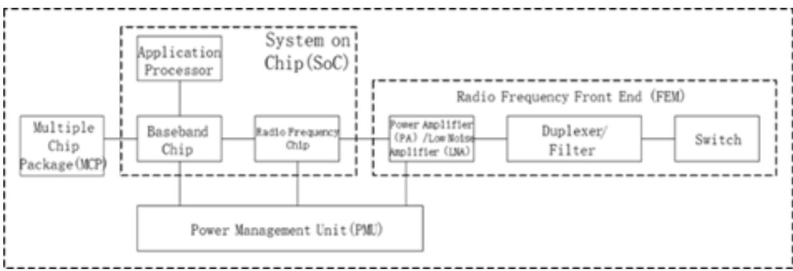  
Figure 1: The architecture diagram of UE communication devices

Where P\_SoC, P\_FEM, P\_PMU are the power consumption of SoC, FEM, PMU in data service state. t \_SoC, t\_FEM, t\_PMU are the duration in data service state of SoC, FEM, PMU. P\_sleep, t\_sleep are the power consumption and the duration respectively in sleep state.

In theory, RedCap UE’s power consumption is optimal, whether it is for sleep or data services.

Compared with RedCap UE and LTE UE, in the case of 1T2R, the FEM design is roughly the same, so the power consumption difference is small when the device working time is the same. How ever, for the SoC part, RedCap UE usually adopts more advanced processes, so the power consumption of SoC RedCap UE is better than LTE UE for the same bandwidth.

Compared to RedCap UE and NR UE, RedCap UE reduces the number of antennas and transmission channels (NR UE uses 100MHz bandwidth and 2T4R for 3.5G, and RedCap UE uses 20MHz bandwidth and 1T2R for 3.5G; NR UE uses 20MHz bandwidth and 1T4R in 2.1G, and RedCap UE uses 20MHz bandwidth and 1T2R in 2.1G). Therefore, the power consumption of RedCap UE in FEM is better than that of NR UE. Meanwhile, although the SoC process of NR UE is better than that of RedCap UE, because RedCap UE only uses 20MHz bandwidth, it also reduces the power consumption of the SoC. Therefore, the power consumption of RedCap UE is still better than that of NR UE in an overall comparison.

In addition, due to the advantages of the 5G protocol, RedCap UE and NR UE can also use RRM measurement relaxation and C DRX/eDRX technologies to reduce power consumption by reducing UE work time. Therefore, with the same hardware, bandwidth and duplex mode, RedCap UE and NR UE can also reduce power consumption by reducing UE work time. RedCap UE has more power benefits than LTE UE.

## 2.3 Latency

The end-to-end latency of the user plane is equal to the air-port latency + transmission latency + core network latency, as shown in Figure 2.

Obviously, the end-to-end user plane latency difference is the air interface latency difference.

2.3.1 FDD air interface latency analysis. When the UE transmits data in the uplink, taking the example of the UE starting to transmit SR in slot n, taking into account the processing latency of the base station, the base station receives SR and transmits PDCCH (downlink control channel) in slot n+x; the UE transmits PUSCH (uplink data channel) in slot n+x+K2. When the base station transmits data in the downlink, taking the example of the base station transmitting data in slot n, the base station first schedules the downlink data channel (PDSCH) via PDCCH in slot n and transmits the PDSCH in slot n+K0. The UE sends an ACK/NACK reply on slot n+K0+K1 as shown in Figure 3 for FDD.

2.3.2 TDD air interface latency analysis. The situation for UE is similar to FDD, but TDD requires additional consideration of the frame structure. Take the 2.5ms dual period frame structure as an example, as shown in Figure 4.

In this frame structure, a situation as shown in Figure 5 may arise for downlink data transmission and the corresponding ACK/NACK feedback. If there is data to send in the downlink slot, it can be sent immediately. If downlink data encounters an uplink slot, it must wait for the next downlink slot before it can be transmitted. Similarly, when UE sends uplink data or feedback ACK, it must wait for an uplink slot before sending. Therefore, the latency must take into account the additional data waiting time caused by the uplink and downlink conversion of the TDD frame structure.

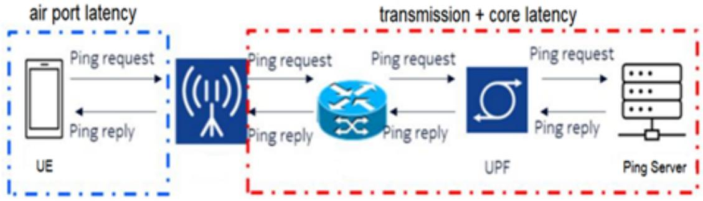  
Figure 2: User-plane end-to-end latency composition

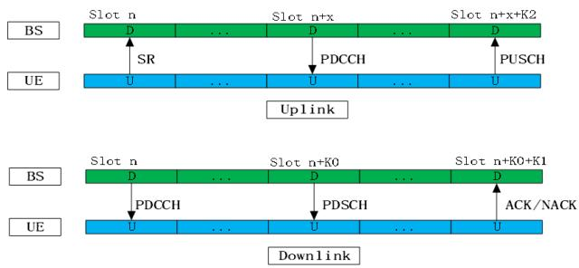

Figure 3: Air interface latency  
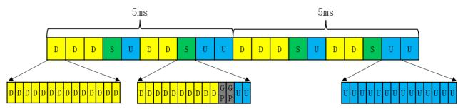  
Figure 4: Frame Structure

Based on the above analysis, latency can be simplified to the following two formulae:

t\_UL=t \_data+t\_trans+t\_process+X\*t\_slot+K2\*t\_slot+t\_TDD

t\_DL=t\_data+t\_trans+t\_process+K0\*t\_slot+K1\*t\_slot+t\_TDD

Of these, t\_UL is the UE’s uplink user plane latency and t\_DL is the UE’s downlink user plane latency.t\_data is the duration of the control information and data occupancy, t\_trans is the air interface transmission latency, including the transmission latency of SR, PDCCH, PDSCH, PUSCH, ACK/NACK, etc.it\_slot is the duration of a single time slot, t\_process is the UE processing latency, t\_TDD is the additional data waiting time caused by the uplink and downlink conversion of the TDD frame structure, and t\_TDD is 0 in the FDD system.

For the uplink:

𝑥 X Number of time slots between the received SR and the transmitted PDCCH

K2 UE Number of slots between the received PDCCH and the transmitted PUSCH

K3 It is not shown in Figure 3 and its position in Figure 3 indicates the number of time slots to the next scheduling after the base station receives the PUSCH.

## For downlink:

K0 is 0,1. 0 indicates that PDSCH does not transmit across time slots and 1 indicates that PDSCH transmits across time slots. In this real network environment only PDSCH cross slot transmission is supported and K0=1.

K1 is the number of slots between the UE receiving the PDSCH and sending the ACK / NACK.

Table 4 shows the values of the coefficients in the formula for NR UE, RedCap UE, and LTE UE, where 𝑥 is the smallest

Table 4 shows the values of the coefficients in the formula for NR UE, RedCap UE, and LTE UE, where X is the smallest

Each coefficient value of NR / RedCap UE is lower than that of LTE Cat4 UE. Therefore, theoretically:

(1) The formula shows that the air interface latency of RedCap UE is lower than that of LTE Cat4 UE, so the end-to-end latency of RedCap UE is correspondingly lower than that of LTE Cat4 UE.

(2) From the formula it can be seen that the air interface latency of RedCap UE is the same as NR UE, but due to the weaker processing capability of the RedCap UE chip compared to NR UE, the air interface latency of RedCap UE is greater than NR UE, and therefore the end-to-end latency of RedCap UE is correspondingly greater than NR UE.

By the way, if RedCap UE and NR UE support minislots, K0=0, so the slot duration becomes the symbol duration and the latency is even lower, but the real network does not support it, so the specific analysis is done.

## 3 Test environment

The real network environment is located in Kaili City, Qiandongnan, Guizhou Province, mainly urban residential areas. Figure 6 shows the 22 3.5G stations with an average station separation of 557m. Figure 7 shows the 21 2.1G stations with an average station separation of 627m.

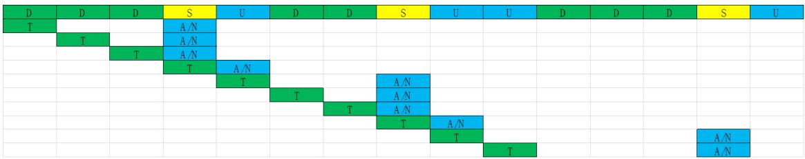  
Figure 5: TDD HARQ

Table 4: The values of the coefficients
<table><tr><td>UE Type</td><td>X</td><td>K0</td><td>K1</td><td>K2</td><td>K3</td></tr><tr><td>NR / RedCap UE</td><td>1</td><td>1</td><td>1</td><td>1</td><td>0</td></tr><tr><td>LTE Cat4 UE</td><td>2</td><td>1</td><td>4</td><td>4</td><td>4</td></tr></table>

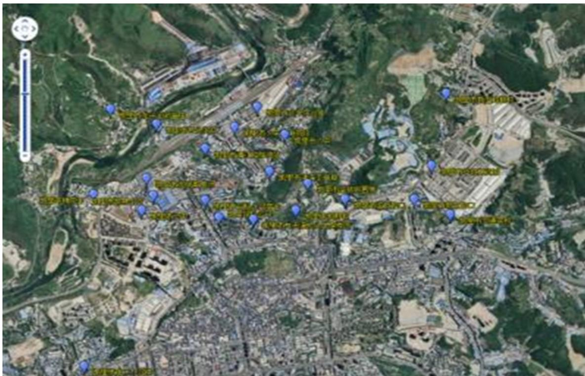  
Figure 6: The situation of 3.5G stations

Table 5: The real network environment configuration
<table><tr><td>Radio band</td><td>Bandwidths</td><td>Subcarrier spacing</td><td>Duplex mode</td></tr><tr><td>2.1G</td><td>20M</td><td>15k</td><td>FDD</td></tr><tr><td>3.5G</td><td>100M</td><td>30k</td><td>TDD</td></tr><tr><td></td><td></td><td></td><td>Frame structure:DDDSUDDSUU</td></tr><tr><td></td><td></td><td></td><td>Special time slot ratio: 10:2:2</td></tr></table>

In this real network environment, the NR UE and RedCap UE were deployed at 2.1G and 3.5G. The real network environment is configured in Table 5 and the UE configuration is shown in Table 6.

The environment includes the Pull-far Test, the Peak Rate Test, the Latency Test and the Power Test in the single station case and the Call Quality Test (CQT) in the network case.

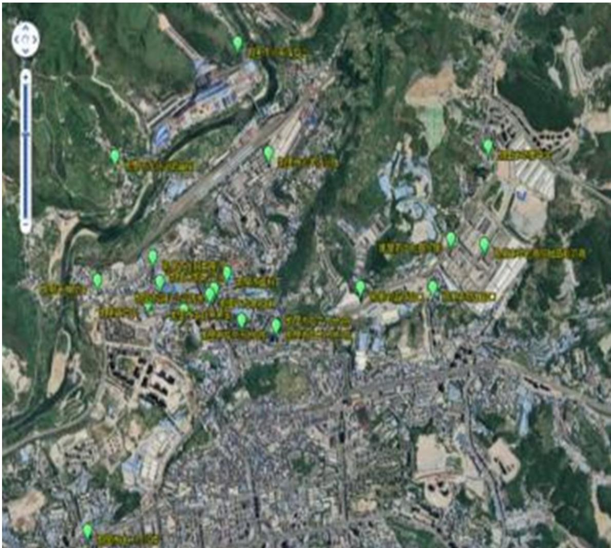  
Figure 7: The situation of 2.1G stations

Table 6: UE configuration
<table><tr><td>UE Type</td><td>Band</td><td>Bandwidths</td><td>Maximum number of MIMO layers</td><td>QAM</td></tr><tr><td rowspan="3">NR UE</td><td rowspan="3">3.5G</td><td rowspan="3">100MHz</td><td>2T4R</td><td>DL: 256QAM</td></tr><tr><td></td><td>UL: 256QAM</td></tr><tr><td rowspan="3">1T4R</td><td>DL: 256QAM</td></tr><tr><td rowspan="2">RedCap UE 3.5G</td><td rowspan="2">20MHz 20MHz</td><td></td><td>UL: 256QAM</td></tr><tr><td></td><td>DL: 256QAM</td></tr><tr><td rowspan="3"></td><td rowspan="3">2.1G</td><td rowspan="3">20MHz</td><td>1T2R</td><td>UL: 64QAM</td></tr><tr><td>1T2R</td><td>DL: 256QAM</td></tr><tr><td></td><td>UL: 64QAM</td></tr></table>

For the Pull-far Test, the test route should be selected as far as possible along the radial antenna of the test cell, from near to far line of sight. The CQT test focuses on testing the performance of UEs at near, middle and far points.

These tests use the full buffer service model, testing the uplink or downlink FTP or UDP service of the UE. The near, medium and far points are defined by the values of SINR and RSRP from good to bad.

Table 7: Actual power consumption
<table><tr><td>UE type</td><td>Frequency band</td><td>Sleep power consumption</td><td>Data services power consumption</td></tr><tr><td>NR UE</td><td>3.5G-100M</td><td>3.7mA</td><td>700mA</td></tr><tr><td rowspan="3">RedCap UE</td><td>2.1G</td><td></td><td>580-670mA</td></tr><tr><td>3.5G</td><td>1.1mA</td><td>250mA</td></tr><tr><td>2.1G</td><td></td><td> $4 7 0 { - } 5 2 0 \mathrm { m A }$ </td></tr><tr><td>LTE Cat4 UE</td><td>1.8G</td><td>1.7mA</td><td> $6 0 0 { \sim } 7 0 0 \mathrm { m A }$ </td></tr></table>

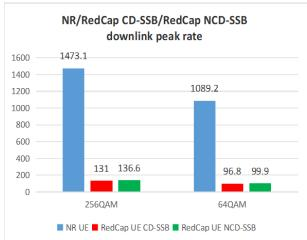

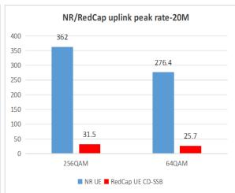  
Figure 8: 3.5G Actual peak rate

## 4 TEST RESULT

This chapter compares and analyses the RedCap UE actual data and NR UE actual data in the real network environment, considering that the frequency interval of 1.8G LTE and 2.1G RedCap is small, the duplex mode is FDD and the bandwidth is 20MHz. Therefore, the real network actual data of the two are also compared.

## 4.1 Power consumption

Table 7 shows the actual data for RedCap UEs with NR UE currents in the real network, all using 3.8V UE voltage. The LTE UE data are values for a similar real network.

The power consumption results show that RedCap UE is the best in both sleep and data service power consumption. Meets theoretical expectations.

## 4.2 Rate

4.2.1 Peak rate. The actual peak rates of 3.5G and 2.1G in the real network are shown in Figure 8 and Figure 9.

In the 3.15G band, the NR UE bandwidth is 100M and the sub carrier interval is 30KHz. The UE bandwidth of RedCap CD-SSB/ NTD-SSB is 20M, and the subcarrier interval is 15KHz. Ignoring the small difference between CD-SSB and NCD-SSB, the NR UE’s formula $O H ^ { ( j ) } , f ^ { ( j ) }$ is equal to RedCap UE’s formula $O H ^ { ( j ) } , f ^ { ( j ) }$ Since the NR UE formula has $\mu = 1$ , and the RedCap UE formula has $\mu = 0 .$ In NR UE formula, $N _ { P R B } ^ { B W ( j ) , \mu }$ ·12/ is 5 times that of RedCap CD-SSB/NCD-SSB UE $N _ { P R B } ^ { B W ( j ) , \mu } \cdot 1 2 / .$ . Then the ratio of $\boldsymbol { v } _ { L a y e r s } ^ { ( j ) } { \cdot } \boldsymbol { Q } _ { m } ^ { ( j ) }$ in the NR UE formula to $\boldsymbol { v } _ { L a y e r s } ^ { ( j ) } { \cdot } \boldsymbol { Q } _ { m } ^ { ( j ) }$ in the RedCap UE formula multiplied by 5 is the ratio of the theoretical peak rate of NR UE and RedCap UE.

• When NR UE and RedCap UE are in uplink, the $Q _ { m } ^ { ( j ) } { = } 6 4 Q \mathrm { A M } .$ , the NR UE $v _ { L a y e r s } ^ { ( j ) } = 2 ,$ ,the RedCap CD-SSB UE $v _ { L a y e r s } ^ { ( j ) } = 1$ ,The ratio $v _ { L a y e r s } ^ { ( j ) } { \cdot } Q _ { m } ^ { ( j ) }$ is equal to 2, multiplied by 5, so the theoretical peak rate of NR UE is 10 times that of RedCap UE. In the same case, the actual peak rate is also 10 times, which is in line with expectations.

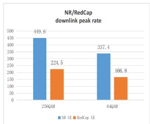

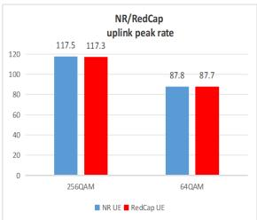  
Figure 9: 2.1G Actual peak rate

• When NR UE and RedCap UE are in downlink, the $Q _ { m } ^ { ( j ) } { = } 6 4 Q \mathrm { A M } ,$ , the NR UE $v _ { L a y e r s } ^ { ( j ) } = 4$ ,the RedCap CD-SSB/ NTD-SSB UE $v _ { L a y e r s } ^ { ( j ) } = 2 ,$ The ratio $\boldsymbol { v } _ { L a y e r s } ^ { ( j ) } { \cdot } \boldsymbol { Q } _ { m } ^ { ( j ) }$ is equal to 2, multiplied by $^ { 5 , }$ so the theoretical peak rate of NR UE is 10 times that of RedCap UE. In the same case, the actual peak rate is also 10 times, which is in line with expectations.

• In addition, according to the formula, the theoretical peak rate of RedCap UE $Q _ { m } ^ { ( j ) } { = } 6 4 Q \mathrm { A M }$ is 75% of the theoretical peak rate of RedCap UE $Q _ { m } ^ { ( j ) } { = } 2 5 6 \mathrm { Q A M }$ , regardless of whether RedCap CD-SSB is in uplink or downlink. In the same case, the measured peak rate is 75%,which is in line with expectations. This is also the case when RedCap NCD-SSB is in the downlink.

• The value of RedCap NCD-SSB $O H ^ { ( j ) }$ is smaller than that of RedCap CD-SSB $O H ^ { ( j ) }$ , and the theoretical peak rate of 3.5G RedCap NCD-SSB calculated by the formula is about 96% of the theoretical peak rate of RedCap NCD-SSB. In the same case, the actual peak rate also accounts for 96%. There is a slight difference.

In the 2.1G band, the bandwidth of NR UE and RedCap UE is 20M, and the subcarrier interval is 15KHz. The NR UE formula is the same as the $\iota , N _ { P R B } ^ { B W ( j ) , \mu } , T _ { s } ^ { \mu } , O H ^ { ( j ) } , f ^ { ( j ) }$ in the RedCap UE formula. The ratio $\mathrm { o f } v _ { L a y e r s } ^ { ( j ) } { \cdot } Q _ { m } ^ { ( j ) }$ in the NR UE formula to $\boldsymbol { v } _ { L a y e r s } ^ { ( j ) } { \cdot } \boldsymbol { Q } _ { m } ^ { ( j ) }$ in the RedCap UE formula is the ratio of the theoretical peak rate of NR UE and RedCap UE.

• NR UE and RedCap UE are in uplink. When the $Q _ { m } ^ { ( j ) } { = } 6 4 Q \mathrm { A M }$ or 256QAM, the NR UE $v _ { L a y e r s } ^ { ( j ) } = 1$ and the RedCap UE $v _ { L a y e r s } ^ { ( j ) } = 1 .$ The $\boldsymbol { v } _ { L a y e r s } ^ { ( j ) } { \cdot } \boldsymbol { Q } _ { m } ^ { ( j ) }$ ratios are equal, so the RedCap UE theoretical peak rate is equal to the NR UE

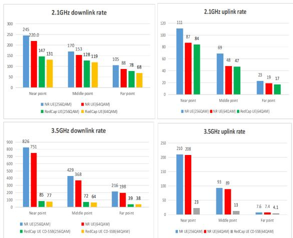

Figure 10: CQT rate

peak rate. In the same case, the actual peak rate is also the same, which accords with the expectation.

• NR UE and RedCap UE are in downlink. When the $Q _ { m } ^ { ( j ) } { = } 6 4 Q \mathrm { A M }$ or 256QAM, the NR UE $v _ { L a y e r s } ^ { ( j ) } { = } 4$ and the RedCap UE $v _ { L a y e r s } ^ { ( j ) } = 2 .$ . The $\boldsymbol { v } _ { L a y e r s } ^ { ( j ) } { \cdot } \boldsymbol { Q } _ { m } ^ { ( j ) }$ ratio is equal to 2. Therefore, the theoretical peak rate of NR UE is twice that of RedCap UE. In the same case, the actual peak rate is also twice, which accords with the expectation.

• In addition, according to the formula, the theoretical peak rate of RedCap UE $Q _ { m } ^ { ( j ) } { = } 6 4 Q \mathrm { A M }$ is 75% of the theoretical peak rate of RedCap UE $Q _ { m } ^ { ( j ) } { = } 2 5 6 \mathrm { Q A M } ,$ , regardless of whether RedCap UE is in uplink or downlink. In the same case, the actual peak rate is 75%, which accords with the expectation.

4.2.2 CQT rate. In the real network environment, the rate of CQT near points needs to reach 70-80% of the peak rate and the signal quality is generally good.However, the rate of CQT near points in the current real network only reaches about 50% of the peak rate. The CQT rate of 3.5G and 2.1G in the real network with poor signal quality are shown in Figure 10.

• When NR UE and RedCap UE are in 2.1G uplink, the $Q _ { m } ^ { ( j ) } { = } 6 4 Q \mathrm { A M }$ , the RedCap UE $v _ { L a y e r s } ^ { ( j ) } = 1 ,$ , the NR UE $v _ { L a y e r s } ^ { ( j ) } = 1$ .The near/middle/far rate of RedCap is about 95% of that of NR UE, and considering that RedCap’s chip pro cessing power is slightly weaker, RedCap’s rate is roughly comparable to NR’s.

• When NR UE and RedCap UE are in 2.4G downlink, $Q _ { m } ^ { ( j ) } { = } 6 4 Q \mathrm { A M }$ or 256QAM, the RedCap UE $v _ { L a y e r s } ^ { ( j ) } = 2$ and the NR UE $v _ { L a y e r s } ^ { ( j ) } = 4 .$ . Due to differences in maximum flow number, receiving sensitivity and demodulation capability under the same channel environment, the near/middle/far rate of RedCap UE is 60%,76%, 77%. of NR UE, respectively.

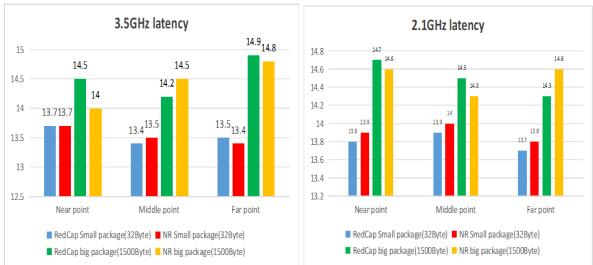  
Figure 11: Actual user-plane end-to-end latency

• When RedCap UE is in 3.5G uplink, $Q _ { m } ^ { ( j ) } { = } 6 4 Q \mathrm { A M } ,$ , the Red-Cap UE $v _ { L a y e r s } ^ { ( j ) } = 1$ and the NR UE $v _ { L a y e r s } ^ { ( j ) } = 2 .$ Due to differences in bandwidth,maximum flow number, receiving sensitivity and demodulation capability under the same channel environment, the near/middle/far rate of RedCap UE is 11%、14%、55% of NR UE, respectively.

• When RedCap UE is in 3.5G downlink, $Q _ { m } ^ { ( j ) } { = } 6 4 Q \mathrm { A M }$ or 256QAM, the RedCap UE $v _ { L a y e r s } ^ { ( j ) } = 2$ and the NR UE $v _ { L a y e r s } ^ { ( j ) } = 4 .$ . Due to differences in bandwidth,maximum flow number, receiving sensitivity and demodulation capability under the same channel environment, the near/middle/far rate of RedCap UE is10%、17%、19%of NR UE, respectively.

For the same bandwidth, modulation mode and number of MIMO layers, the CQT rate of RedCap UE is approximately the same as that of NR UE.

Under the same modulation mode and different MIMO layers, the network rate difference between NR UE and RedCap UE at near points is roughly equal to the peak rate difference between them. At the middle and far points, as the signal gradually degrades, NR UEs are unable to achieve multi-stream, and the network rate gap between NR UEs and RedCap UEs at the middle and far points is significantly reduced.

## 4.3 Latency

As shown in Figure 11, the actual end-to-end latency of the NR UE and RedCap UE user planes is basically equivalent at the near/middle/far points, and RedCap UE is slightly weaker than NR UE, which is in line with the expected theoretical values.

## 4.4 Coverage

Figure 12 and Figure 13 show the actual uplink and downlink coverage data of NR UE and RedCap UE at 3.5G and 2.1G, respectively, obtained from the Pull-far Test.

Whether NR UE/RedCap UE is uplink or downlink, the pull-far distance of 2.1G band is longer than that of 3.5G band. In addition, the NR UE/RedCap UE has similar pull-far distance in 2.1G/3.5G frequency bands. For SS-RSRP at the drop point, the RedCap UE is 2∼3dBm lower than the NR UE. This performance difference is mainly due to the effect of UE size on antenna performance.

The antenna design should be at least a quarter longer than the wavelength, but when the RedCap UE is targeted at wearable and other application scenarios, the size will be smaller than the typical NR UE, resulting in insufficient size reserved for the antenna and lower antenna performance, but this 2∼3dB has little impact on coverage in the current network and mainly affects the performance of the edge performance.

Table 8: RedCap UE adaptions to industrial wireless sensors
<table><tr><td>Items</td><td>Data rate</td><td>End-to-end latency</td><td>Battery life</td></tr><tr><td>Requirments</td><td>&lt;2Mbps</td><td>&lt;100ms</td><td>At least a couple of years.</td></tr><tr><td>RedCap capability</td><td>1T2R FR1 FDD 64QAM</td><td>1T2R FR1 FDD</td><td>Reduce UE complexity</td></tr><tr><td></td><td>far point downlink:68Mbps</td><td>32Byte:13.7ms</td><td>+Power optimization</td></tr><tr><td></td><td>far point uplink:17Mbps</td><td>1500Byte:14.3ms</td><td></td></tr></table>

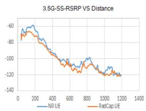

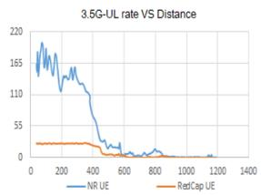

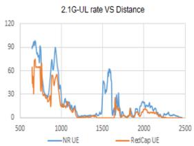

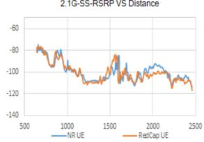  
Figure 12: Uplink actual data

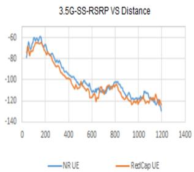

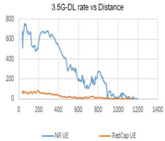

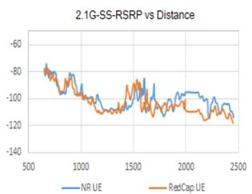

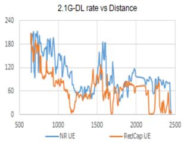  
Figure 13: Downlink actual data

## 5 CONCLUSION

In the case of generally poor signal quality, Table 7, Table 8 and Table 9 show that RedCap UE at the far point in the real network can fully meet the specific performance requirements of three application scenarios listed in 3GPP TR 38.875: industrial wireless sensors, video surveillance and wearable devices, in addition to high-definition video in video surveillance.

Once RedCap UE is commercialised at scale and costs are reduced to compete with LTE Cat4 UE, it will have a broader target scenario for various IoT applications.

## References

[1] ITU M. 2083, IMT vision-framework and overall objectives of the future development of IMT for 2020 and beyond [R], 2015.

[2] N. Varsier, L. -A. Dufrène, M. Dumay, Q. Lampin and J. Schwoerer, ”A 5G New Radio for Balanced and Mixed IoT Use Cases: Challenges and Key Enablers in FR1 Band,” in IEEE Communications Magazine, vol. 59, no. 4, pp. 82-87, April 2021, doi: 10.1109/MCOM.001.2000660.

[3] 3GPP TS 38.875, Study on NR devices supporting reduced capability, V17 (2022.03) [S].

[4] X. Li, X. Xu and C. Hu, ”Research on 5G RedCap Standard and Key Technologies,” 2023 4th Information Communication Technologies Conference (ICTC), Nanjing, China, 2023, pp. 6-9, doi: 10.1109/ICTC57116.2023.10154644.

[5] S. N. K. Veedu et al., ”Toward Smaller and Lower-Cost 5G Devices with Longer Battery Life: An Overview of 3GPP Release 17 RedCap,” in IEEE Communications Standards Magazine, vol. 6, no. 3, pp. 84-90, September 2022, doi: 10.1109/MCOM-STD.0001.2200029.

[6] M. Pagin, T. Zugno, M. Giordani, L. -A. Dufrene, Q. Lampin and M. Zorzi, ”5G NR-Light at Millimeter Waves: Design Guidelines for Mid-Market IoT Use Cases,” 2023 International Conference on Computing, Networking and Communications (ICNC), Honolulu, HI, USA, 2023, pp. 652-658, doi: 10.1109/ICNC57223.2023.10074354.

[7] R. Ratasuk, N. Mangalvedhe, G. Lee and D. Bhatoolaul, ”Reduced Capability Devices for 5G IoT,” 2021 IEEE 32nd Annual International Symposium on Personal, Indoor and Mobile Radio Communications (PIMRC), Helsinki, Finland, 2021, pp. 1339-1344, doi: 10.1109/PIMRC50174.2021.9569595.

[8] S. Moloudi et al., ”Coverage Evaluation for 5G Reduced Capability New Radio (NR-RedCap),” in IEEE Access, vol. 9, pp. 45055-45067, 2021, doi: 10.1109/AC-CESS.2021.3066036.

[9] M. Tayyab, N. Kolehmainen, M. M. Butt, A. Khlass and R. Ratasuk, ”Energy Efficient RRM Relaxation for Reduced Capability UEs in 5G Networks,” GLOBECOM 2022 - 2022 IEEE Global Communications Conference, Rio de Janeiro, Brazil, 2022, pp. 99-104, doi: 10.1109/GLOBECOM48099.2022.10000873.

[10] S. Saafi, O. Vikhrova, S. Andreev and J. Hosek, ”Enhancing Uplink Performance of NR RedCap in Industrial 5G/B5G Systems,” 2022 IEEE International Conference on Communications Workshops (ICC Workshops), Seoul, Korea, Republic of, 2022, pp. 520-525, doi: 10.1109/ICCWorkshops53468.2022.9814497.

Table 9: RedCap UE adaptions to video surveillance
<table><tr><td>Items</td><td>Data rate</td><td>End-to-end latency</td><td>Battery life</td></tr><tr><td>Requirments</td><td>Economy:2-4Mbps</td><td>&lt;500ms</td><td>/</td></tr><tr><td rowspan="3">RedCap capability</td><td>High-end:7.5-25Mbps 1T2R FR1 FDD 64QAM</td><td>1T2R FR1 FDD</td><td>/</td></tr><tr><td>far point downlink:68Mbps</td><td>32Byte:13.7ms</td><td></td></tr><tr><td>far point uplink:17Mbps*</td><td>1500Byte:14.3ms</td><td></td></tr></table>

\* The far point is in a weak coverage area and cannot support HD video.

Table 10: RedCap UE adaptions to wearable devices
<table><tr><td>Items</td><td>Data rate</td><td>End-to-end latency</td><td>Battery life</td></tr><tr><td rowspan="5">Requirments</td><td>reference rate:</td><td>/</td><td>A fewdays or even 1-2weeks</td></tr><tr><td>Downlink:5-50Mbps</td><td></td><td></td></tr><tr><td>Uplink:2-5Mbps</td><td></td><td></td></tr><tr><td>peak rate:</td><td></td><td></td></tr><tr><td>Downlink:150Mbps</td><td></td><td></td></tr><tr><td rowspan="4">RedCap capability</td><td>Uplink:50Mbps</td><td></td><td></td></tr><tr><td>1T2R FR1 FDD 64QAM</td><td></td><td></td></tr><tr><td>far point downlink:68Mbps</td><td></td><td></td></tr><tr><td>far point uplink:17Mbps</td><td></td><td></td></tr></table>