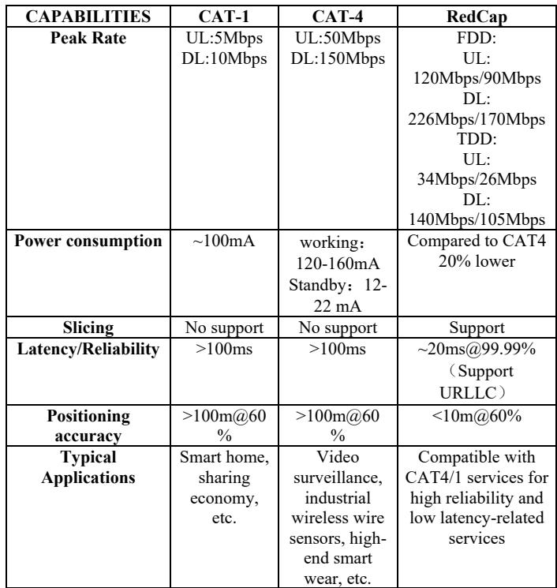
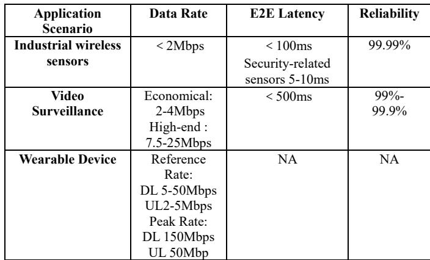
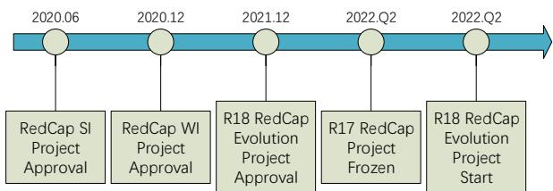
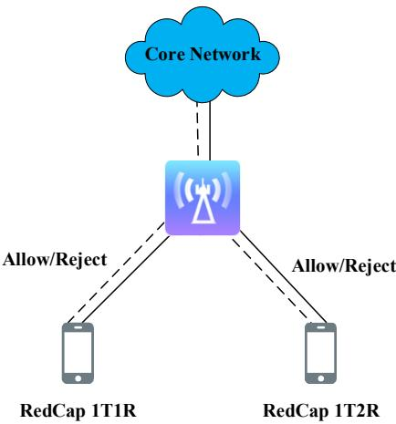
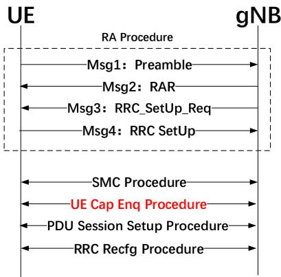
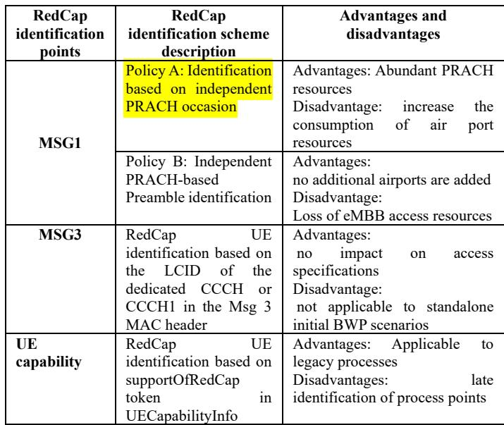
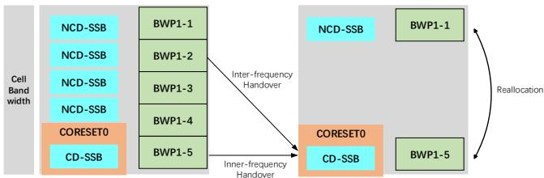
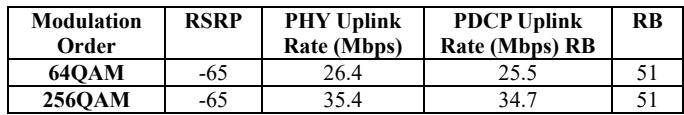
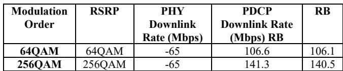

# Research on 5G RedCap Standard and Key Technologies

Xiao Li   
Mobile Communication Research   
Department   
China Telecom Research Institute   
Beijing, China   
lixiao6@chinatelecom.cn   
Xiaohang Xu   
Mobile Communication Research   
Department   
China Telecom Research Institute   
Beijing, China   
xuxiaohang@chinatelecom.cn   
Chunlei Hu   
Mobile Communication Research   
Department   
China Telecom Research Institute   
Beijing, China   
huchl @chinatelecom.cn

Abstract—3rd Generation Partnership Project (3GPP) Release 17 (R17) focuses on low-cost terminals, uplink rates, low-power devices, and low-latency technologies. As the work on R17 comes to the final stage, the reduced-capability (RedCap) technology enters the product development and test verification stage as an effective solution to achieve low cost. The paper first introduces the background and standardization of RedCap, then analyzes the key technologies of RedCap, and finally conducts experimental verification of key performance, which provides a practical and reliable reference for global RedCap promotion and implementation.

Keywords—RedCap, 5G, NR

## I. INTRODUCTION

With the commercialization and development of 5G, the high price of 5G terminals directly affects the implementation of 5G in vertical industries. In actual use, it is found that some scenarios do not require the ultimate performance, i.e., the existing capability of 5G exceeds the actual application requirements. Therefore, 3GPP proposed 5G reduced-capability (RedCap) in R17 to ensure a balance between performance and cost in 5G networks. With the premise of ensuring service requirements and performance, the reduced-capability terminal can achieve lower cost, extreme size, and reduced power consumption, which can help promote 5G scale applications, expand the ecosystem of 5G devices, and expand 5G application scenarios.

The implementation of RedCap technology requires end-toend cooperation, and this paper analyzes key RedCap technologies mainly in the context of RAN.

## II. BACKGROUND

5G RedCap refers to the 5G standard proposed by 3GPP, which has more streamlined features compared to the previously released 5G standard. In terms of the current business scenarios covered by 5G, NR defines three major scenarios: enhanced mobile broadband (eMBB) scenario mainly for large bandwidth applications, ultra-reliable low latency communication (URLLC) scenario mainly for highly reliable ultra-low latency applications, and massive machine type communication (mMTC) mainly for low-rate, large-connectivity IoT applications [1]. The definition of 5G application scenarios seems to be comprehensive, but in fact, some scenarios are still not covered. For example, video surveillance real-time backhaul requires uplink single user 4-8Mbps, no downlink rate requirement, single cell 15-20 concurrent users, and module cost needs to be controlled; industrial wireless sensor network requires 99.99% reliability for communication service, end-toend delay less than 100ms, but not a high requirement for rate; wearable device application requires for rate requirement The downlink is at 150Mbps and the uplink is up to 50Mbps, which is a medium to high rate requirement, but there are high requirements for power consumption, device battery life and size, and the overall solution needs to be streamlined enough [2]. The above use cases have higher communication capability requirements than NB-IoT/Cat-M, but lower than eMBB and URLLC, and the solutions need to be sufficiently simplified. So, for these IoT applications, 3GPP started to define a "streamlined" 5G scenario, i.e., 5G RedCap.

Another factor in the definition of 5G RedCap is cost considerations. 5G IoT needs to bring down the terminal price to be popularized. The current price of 5G modules on the market is in the hundreds or even thousands of dollars, and the price factor has become a resistance to the large-scale deployment of 5G modules. Removing some unnecessary functions can bring down the module price.

In addition, the 3GPP RedCap working project team strives to reuse the current specification development of 5G base station hardware while providing the same coverage for RedCap devices as for 5G NR devices [3]. The goal is to make RedCap devices easy to deploy and capable of providing connectivity to RedCap devices as long as it is based on software upgrades to existing mobile network operator NR networks.

RedCap has advantages over 4G IoT in terms of capacity, service capability, and applications [4]. Compared to 4G broadband technology, RedCap has a substantially higher rate and capacity, as well as support for URLLC scenario deployment, slicing support, and R17 positioning capability. With the reduction of terminal module cost, the terminal service space will be broader compared to service CAT-1 and CAT-4. With the advantages of the higher rate, higher capacity, and wider application, the key performance comparison is shown in Table I.

TABLE I. CAT-1, CAT-4, REDCAP KEY CAPABILITIES COMPARISON  

Compared with ordinary 5G terminals, RedCap has lower complexity, cost and power consumption. RedCap mainly meets the 5G high speed, small bandwidth, low power consumption IoT scenarios, targeting industrial IoT sensors, surveillance cameras, wearable devices, and other applications. For diverse 5G target scenarios, three types of RedCap typical application scenarios are proposed, namely industrial wireless sensors, video surveillance, and wearable devices. Their key indicators are shown in Table II.

TABLE II. 3GPP REDCAP TYPICAL APPLICATION SCENARIOS AND KEY INDICATOR REQUIREMENTS  

Redcap lightweight terminals solve the contradiction between the high cost of 5G chips and modules and 5G vertical industry applications. redCap terminals can reduce the cost of traditional 5G modules by 60%-70% compared to traditional 5G modules, reduce terminal power consumption by 31%-41%, and achieve peak rates of up to 50Mbps uplink and 150Mbps downlink.

The GSMA predicts that 2.5 billion new users will be added to the IoT in 2025, and the low cost of RedCap modules will quickly bring about a 5G IoT growth inflection point. IoT services are gradually showing the trend of low, medium, and high network demand differentiation, with video monitoring as the representative of large rate and high demand services gradually rising, the traditional 2/3/4G IoT is difficult to meet the development needs, needs to build 5G (NB-IoT/RedCap/eMBB) and 4G Cat-1/Cat-4 cooperative threedimensional IoT system, to achieve "Multiple Layered" and "Reuse Economy" network coverage.

## III. STANDARD PROGRESS

5G RedCap was first called "Low Complexity NR Device", and has since been named NR-lite, NR-light or Industrial Wireless Sensor Network (IWSN). The term is now standardized in most 3GPP documents as "5G RedCap NR", also known as 5G Reduced Capability NR. RedCap entered the Study Item (SI) phase in 3GPP R17 and published a study report, 3GPP TR 38.875 [10], covering terminal complexity reduction and cost assessment, impact on coverage, energy consumption analysis, and other recommendations for the subsequent Work Item (WI) phase. RedCap entered the 3GPP R17 WI phase in 2021, covering terminal complexity reduction, residency and access control, mobility, terminal identification, BWP configuration, and power consumption [5-9]. The R17 standard framework has been frozen and the ASN.1 protocol will be frozen in 22 years. The completion of the 3GPP R17 RedCap standard has increased the industry's interest in RedCap. The 3GPP RedCap standardization process is shown in Fig. 1.

  
Fig. 1. 3GPP RedCap standardization process

The RedCap UE capabilities that have been specified include 20MHz@FR1 and 100MHz@FR2 bandwidth, 1 or 2 receive antennas, 1 transmit antenna,64QAM or 256QAM maximum modulation order, etc.

The current RAN side focuses on RedCap configuration, BWP definition and operation; coexistence of legacy broadband UE and RedCap UE in large bandwidth networks; support for SUL, rate guarantee, coverage enhancement; RedCap UE support for low power consumption, low latency, coverage enhancement and other value features, etc.

In summary, RedCap R17 version can carry high-rate IoT services, and effectively reduces terminal complexity (complexity is reduced by about 60% compared to traditional eMBB terminals) by reducing the maximum transmission bandwidth to 20MHz, cutting the number of transceiver antennas, and reducing the maximum upstream and downstream modulation steps (e.g. 64QAM). RedCap R18 will be further expanded to support medium-rate IoT services. This shows that

RedCap technology complements the 5G medium and highspeed large connection capability, enabling 5G to form a complete technology bearing system with low-, medium-, highand ultra-high-graded capabilities for various IoT applications.

## IV. KEY TECHNOLOGIES

RedCap enables device miniaturization, high endurance, and high speed by trimming NR capabilities, introducing halfduplex, and more energy-efficient features. First, as a 5G lightweight terminal, RedCap reduces terminal complexity by approximately 60% compared to traditional 5G terminals. Secondly, RedCap's capabilities ensure a smooth upgrade to 5G based existing networks. Most importantly, RedCap continues the excellent features of 5G NR, such as large bandwidth, low latency, high reliability, service assurance, low power consumption, strong coverage, etc., which can be introduced on demand for different application scenarios to effectively meet service requirements.

## A. RedCap Residency Control

RedCap supports independently set residency capability, and cells can be independently set to support RedCap user residency, as shown in Figure 2. An IFRI (IntraFreqReselectionRedCap: allowed, notAllowed) is sent in SIB1 to indicate whether the RedCap UE cell is allowed to select (reselect) to a co-channel cell. When no IFRI is sent in SIB1, the RedCap UE is considered as not supporting the RedCap UE in that cell, and the cell can be independently set to support 1Rx and 2Rx RedCap user presence: setting CellBarredRedCap1Rx to barred in SIB1 disables 1Rx RedCap terminal presence; setting CellBarredRedCap1Rx to barred in SIB1 disables 1Rx RedCap terminal presence. If you set CellBarredRedCap2Rx to barred in SIB1, the 2Rx RedCap terminals are disabled.

  
Fig. 2. RedCap user access diagram

## B. RedCap Access Recognition

RedCap supports flexible user identification scheme, and users support multiple user identification to match different scenarios, as shown in Figure 3. TDD mode requires configuration of an independent initial BandWidth Part (BWP), and preference is given to RedCap UE identification scheme based on independent PRACH Preamble; FDD mode can share initial BWP with eMBB. The RedCap UE identification scheme based on LCID in MSG3 is preferred.

  
Fig. 3. RedCap User Identification Process

The RedCap identification points and schemes are shown in Table III.

TABLE III. REDCAP IDENTIFICATION SOLUTION  

## C. RedCap BWP Configuration

RedCap supports independent configuration of the initial BWP and flexible configuration of multiple BWPs, and there are two configuration options for RedCap to access the initial BWP. One is to share the initial BWP between RedCap UE and eMBB UE, which has the advantages of no new BWP configuration and short SIB1 messages. It is suitable for small bandwidth network scenarios such as FDD 20MHz/40MHz cells. Option 2 sets up separate downlink and uplink initial BWPs for RedCap UEs. This option has the advantages of not affecting eMBB access specifications and avoiding fragmentation of uplink PUSCH resources, and is suitable for TDD 100MHz large bandwidth network scenarios.

And RedCap multi-BWP needs to rely on NCD-SSB implementation. Where the RedCap BWP containing CD-SSB mobility is basically the same as that of ordinary eMBB users, while the RedCap BWP containing NCD-SSB , the same cell bandwidth, also introduces heterodyne switching, as shown in Figure 4.

  
Fig. 4. Multi-BWP configuration schematic  
V. EXPERIMENTAL VERIFICATION

## A. Test Environment

The RedCap key technology test uses TDD 2.5ms dual cycle frame structure, 3.5GHz band, 100MHz channel bandwidth, 40KHz subcarrier width networking mode, based on single carrier frequency SA networking, the network schematic is shown in Figure 5.

  
Fig. 5. Network scheme diagram

RedCap requires support for 20MHz operating bandwidth, N1, and N78 operating bands, 1T2R, 64QAM or 256QAM upstream and downstream modulation, and Redcap identification and access control.

## B. RedCap Uplink Peak Rate Verification

The gNB and the hardware and software of the terminal work normally, and the NR cell works in the 3.5GHz band. Configure the uplink modulation mode to 64QAM, make the configuration take effect, and start normal operation. RedCap UE accesses in this cell and starts UDP uplink service with full buffer. After the data transmission is stable, the uplink data rate is counted for 1 minute. Then change the uplink configuration modulation mode to 256QAM and repeat the above steps. The test results are shown in Table IV.

TABLE IV. REDCAP UPLINK PEAK RATE TEST RESULTS  

From the test results, it can be seen that the 3.5GHz TDD mode has a lower 64QAM uplink peak rate than 256QAM depending on the modulation order, but the overall actual test results are basically the same as the theoretical values in Table I, as expected.

## C. RedCap Downlink Peak Rate (1T2R) Test

The gNB and the terminal work normally, and the NR cell works in the 3.5GHz band. Configure downlink modulation mode to 64QAM to make the configuration take effect and start normal operation. RedCap 1T2R UE is accessed in this cell and the system configures RedCap UE for downlink dual-stream transmission; starts UDP downlink service and carries out full buffer UDP downlink service. After the data transmission is stable, the downlink data rate is counted for 1 minute, and then the modulation mode of the downlink configuration is changed to 256QAM and the above steps are repeated. The test results are shown in Table V.

TABLE V. REDCAP UPLINK PEAK RATE TEST RESULTS  

From the test results, we can see that the 3.5GHz TDD mode has a lower 64QAM downlink peak rate than 256QAM depending on the modulation order, but the overall actual test results are basically the same as the theoretical values in Table I, as expected.

## VI. CONCLUSION

This paper first introduces the background of RedCap and its progress in the standard, and then describes in detail the key technologies for residency control, access identification, and BWP configuration, respectively. Finally, the peak rate performance, which is the most important concern, is verified and the results meet expectations. RedCap has now gone through two versions, R17 and R18. In R17, RedCap has made a major breakthrough in technology and will penetrate low latency, high reliability verticals in the future. At the same time, a number of issues remain to be further optimized, and will continue to be studied in R18 to continuously improve network performance.

## REFERENCES

[1] Li Honghui,Guan Chengzhe.NR RedCap coverage capability analysis and enhancement techniques[J]. Communication World,2022,(23):43-45.

[2] Li Hanyang,Weng Weiwen,Li Nan,Zhang Long,Cheng Jinxia.5G NR RedCap key technology research[J]. Telecommunications Science,2022,38(03):93-101.

[3] Liu Ya, Weng Weiwen, Lu Songhe, Zhang Long. RedCap is ready to help 5G empower thousands of industries[J]. Communication World,2022,No.909(23):46-47.

[4] Xu Xiayan. NR RedCap UE key technology and standardization progress[J]. Mobile Communication, 2021, 45(03):10-15.

[5] 3GPP TS 38.101, NR; user equipment (UE) radio transmission and reception, V17 (2022.03) [S].

[6] 3GPP TS 38.113, NR; Base station (BS) electromagnetic compatibility (EMC), V17 (2022.03) [S].

[7] 3GPP TS 38.213, NR; Control of physical layer procedures, V17 (2022.03) [S].

[8] 3GPP TS 38.304, NR; User equipment (UE) procedures in idle mode and RRC inactive state, V17 (2022.03) [S].

[9] 3GPP TS 38.331, NR; Radio Resource Control (RRC); Protocol Specification, V17 (2022.03) [S].

[10] 3GPP TS 38.875, Study on NR devices supporting reduced capability, V17 (2022.03) [S].