# Empirical Comparison of Power Consumption and Data Rates for 5G New Radio and RedCap Devices

Pascal Jorke, Hendrik Schippers and Christian Wietfeld ¨

Communication Networks Institute

TU Dortmund University, Germany

Email: {Pascal.Joerke, Hendrik.Schippers, Christian.Wietfeld}@tu-dortmund.de

Abstract—The new 5G category RedCap has been introduced to address small, energy-efficient 5G devices with relaxed requirements on data rates. This work performs an empirical study on the performance and the impact of complexity reduction in 5G RedCap devices on data rates and power consumption. For this purpose, measurements were carried out with first off-theshelf 5G RedCap devices in a hardware-in-the-loop laboratory setup using a channel emulator for realistic signal conditions. The results demonstrate that 5G RedCap devices can provide up to 80 Mbit/s downlink data rates in TDD networks even under multipath and fading conditions. In terms of energy efficiency, the reduced complexity enables up to two times longer battery life compared to 5G NR devices. Considering new power saving techniques, a case study demonstrates that future 5G RedCap devices require even lower power consumption for years of battery life. However, current devices already provide more than two months of battery life under good coverage conditions. Comparing the eDRX power consumption in 5G RedCap devices, we find that the RRC Idle state does not provide significant power saving benefits, and thus using the RRC Inactive state for longer battery life and good network reachability is recommended.

Index Terms—5G, RedCap, empirical, power consumption, data rate, hardware-in-the-loop, channel emulation

## I. INTRODUCTION

N modern mobile radio networks, heterogeneous applica-I tions are considered, ranging from immersive high data rate video transmissions for live streams to infrequent small data transmission of IoT sensors. To address these different network requirements, several 5G solutions were developed, with 5G New Radio (NR) addressing enhanced Mobile Broadband (eMBB) and ultra-Reliable Low Latency Communication (uRLLC), as well as Narrowband Internet of Things (NB-IoT) and enhanced Machine Type Communication (eMTC) for massive Machine Type Communication (mMTC) (ref. Figure 1). With the latter technologies being restricted to small data rates [1], mid-range applications like video surveillance, smart signage, or wearables are currently limited to large and expensive 5G NR modems, significantly exceeding the requirements these use cases define. To fill the gap between 5G NR and NB-IoT/eMTC a new device category has been introduced in 3GPP Release 17, called 5G Reduced Capability (RedCap) [2], which paves the way towards energy efficiency optimizations in 6G networks. It includes complexity reduction for lower cost and a reduced form factor and adopts the extended Discontinuous Reception (eDRX) power saving mechanism, initially introduced with NB-IoT/eMTC [3], which relaxes data reception and thus prepares for lean design concepts in 6G networks [4].

In this work, we perform an empirical performance analysis of this new device category, using off-the-shelf 5G RedCap modems, to identify its potential and limits under real-world conditions and give insights on how 5G RedCap can extend the 5G ecosystem in comparison to 5G NR devices. Therefore, we set up a Hardware-in-the-Loop (HIL) measurement setup for reproducible measurement runs under different conditions. These are generated by a 5G base station emulator to provide full control and adaptability of the 5G network as well as a radio channel emulator for dynamic multipath propagation, doppler influence, and adaptive interference providing realworld conditions. In subsequent measurements, different parameter combinations such as uplink transmit power, Modulation and Coding Scheme (MCS), or Signal to Noise Ratio (SNR) are looped to create a comprehensive solution space. The measured data rate and power consumption in different 5G RedCap and 5G NR states are used in a case study for different 5G applications to derive recommendations for efficient and sustainable 5G applications.

Therefore, this work is organized as follows: Section II briefly outlines previous works on energy-related analyses of 5G networks, while Section III gives a short overview of 5G RedCap basics. Section IV introduces the laboratory measurement setup used in this work. It is followed by the analysis of data rates and power consumption in Section V and finally, the results are concluded in Section VI.

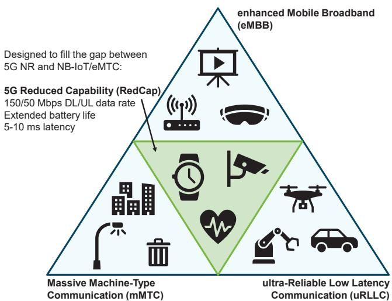  
Fig. 1: 5G RedCap is designed to meet different requirements of mid-range 5G applications, including fair data rates and high energy efficiency.

## II. RELATED WORK

5G RedCap as a new category has been previously discussed in scientific publications. The authors of [5] provide a detailed overview of 5G RedCap requirements, features, and potential performance. For RedCap devices with minimum capabilities (e.g., a single Downlink (DL) Multiple Input Multiple Output (MIMO) layer) [5] states that peak physical data rates in 5G TDD networks can reach 60 Mbit/s. In terms of battery life, the authors calculate that the battery life can be extended by up to 70 times, depending on the eDRX cycle length and Inter Arrival Time (IAT) of the application. However, the authors do not provide information on what actual battery life is achievable rather than relative battery life extension. In [6], the authors present an analytical energy consumption model for 5G RedCap devices. While the model is very detailed and considers different energy states, the lack of underlying 5G RedCap-specific power measurements limits its applicability for real-world devices. The authors of [7] present experimental results for 5G RedCap devices. Data rate measurements demonstrate physical downlink data rates of up to 141 Mbit/s when using two receive branches. Since the authors do not provide detailed information on the measurement setup, the Device Under Test (DUT), or network configuration such as the MCS, the results are not reproducible.

Since 5G networks often operate in mid-band deployments, signal range can be limited. The authors of [8] analyze the impact of supplement Uplink (UL) carriers in lower frequency bands for devices at cell edge for better performance. However, this analysis is limited to Block Error Rate (BLER) and throughput evaluations and does not provide results regarding power consumption. While the results demonstrate that the data rates in supplement UL bands are reduced compared to mid-range frequency bands, the impact of this feature on battery-powered devices would be of high interest. [9] provides an overview of different features of RedCap devices. The authors found that in Frequency Range 1 (FR1) Frequency Division Duplex (FDD) networks 5G RedCap can reach DL peak data rates of up to 85 Mbit/s and including eDRX can improve the battery life by up to four times, which is significantly less than predicted in [5]. Since both publications do not provide sufficient information on the power consumption assumptions for each of the 5G RedCap device states, a comparison of these results cannot be performed. The authors of [10] presented a context-aware power consumption model for Long Term Evolution (LTE) User Equipment (UE). They performed empirical measurements for different uplink transmit power levels and found that the average power consumption results in two curve pieces that can be independently approximated by linear functions. This linear approximation is also used in [11] for modeling the power consumption of different uplink transmit power levels of 5G NR devices.

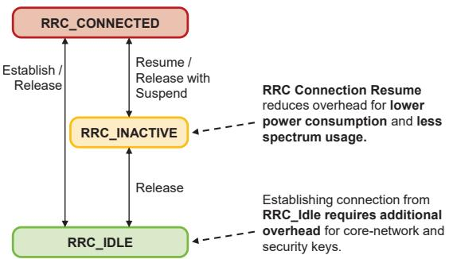  
Fig. 2: 5G RedCap includes a new RRC state for reduced signaling overhead when reconnecting to the network.

Compared to the related work, our work provides a comprehensive empirical study of real-world 5G RedCap devices and thus presents the potential and limits of 5G RedCap compared to 5G NR under real-world conditions.

## III. 5G REDCAP FOR EFFICIENT, LIGHTWEIGHT DEVICES

To address mid-range applications like video surveillance, smart signage, or wearables, 5G RedCap was designed for reduced device complexity and extended energy efficiency.

## A. Limited Data Rates

5G RedCap devices are limited to 20 MHz of bandwidth. To integrate this new device class in existing 5G NR networks and use relaxed frequency filters in UEs, networks with larger bandwidths than 20 MHz use Bandwidth Parts (BWPs) to define partial bandwidths. Since bandwidth parts can overlap [12], 5G NR devices can still use the full bandwidth for maximum throughput despite including BWPs with 20 MHz. For even further complexity reduction 5G RedCap is obligated to implement only one receive branch / MIMO layer as well as only 64QAM modulation with an optional second receive branch / 256QAM modulation, which facilitates smaller and reasonably priced hardware [5].

## B. Enhanced Energy Efficiency

5G RedCap devices are designed for extended battery life compared to 5G NR. When devices have no data to transmit or receive, they release their Radio Resource Control (RRC) connection after a data inactivity timer expired and switch into a power-saving state. Previously LTE and 5G devices were released to the RRC idle state, in which the device is in a sleep state and frequently wakes up to listen to potential paging messages, hence called Discontinuous Reception (DRX). When a device is required to transmit or receive data, it has to perform a full connection setup with the network. 5G RedCap devices can now use an additional RRC state, called RRC Inactive [5] (ref. Figure 2). Devices are also released from the connection, but the network stores all core network and security information of the UE. When the device reconnects to the network, it can resume its previous connection without requiring core network and security handshakes resulting in less signaling overhead and faster response time.

In addition to the new RRC state 5G RedCap devices include a new power saving feature, which was originally introduced by NB-IoT and eMTC devices, called eDRX. With eDRX the cycle length between paging occasions is extended to allow devices to remain in sleep mode longer. While the average power consumption is reduced, the responsiveness of the device decreases, since in sleep mode the lower layer functions are turned off and the device is not reachable for the network. Figure 3 compares the different DRX modes. Devices being in RRC Inactive state are limited to a maximum eDRX cycle of 10.24 seconds, while devices in RRC Idle state can remain in sleep mode for up to 10,485.76 seconds, or approximately three hours between paging occasions. Since paging occasions are brief compared to the time spent in sleep mode, both eDRX modes in RRC Inactive state (cf. Figure 3b) and RRC Idle state (cf. Figure 3c) have nearly identical power consumption in our measurements. Therefore, eDRX in RRC Inactive state provides the best trade-off between low power consumption and reachability by the network. Hence, in the following analysis RRC Inactive state is assumed to be used for power saving.

## IV. SETUP FOR ENERGY AND DATA RATE MEASUREMENTS

A laboratory setup was developed for controlled and reproducible measurements that emulates the behavior of 5G RedCap and 5G NR devices in the real world, shown in Figure 4. The 5G network for this measurement is provided by a 5G radio communication tester, emulating the 5G base station and core network. An overview of the used network parameters can be found in Table I.

The 5G signals are routed into a channel emulator using High Frequency (HF) cables, which is capable of emulating dynamic multipath propagation, range path loss and blocking effects, Doppler from mobility, and synchronous programmable interference for testing wireless devices and radio systems. For our analysis, we used Tapped Delay Line (TDL)-A channel models, which are applicable for users in urban areas with scattering and Non Line-of-Sight (NLOS) conditions. For the programmable interference generator included in the channel emulator, we used a signal and spectrum analyzer to verify the targeted SNR at the UE. Figure 5 illustrates the different stages of interference induced by the channel emulator. In Figure 5a the downlink signal is shown with no Additive White Gaussian Noise (AWGN) or channel model added to the signal. When adding AWGN, the SNR of the signal decreases (Figure 5b). With the TDL-A channel model, the signal experiences additional time and frequency dependent interference, as shown in Figure 5c.

TABLE I: Settings for 5G RedCap and 5G NR Measurements.  
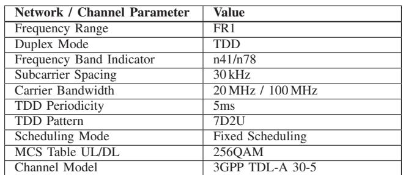

In addition to the 5G radio communication tester and spectrum analyzer, the 5G devices are connected to the channel emulator. The device itself is placed in a Radio Frequency (RF) shielding box to limit external interference. A power supply and meter is used for power consumption measurements of the 5G devices. The Universal Serial Bus (USB) data lines from the 5G devices are connected to a measurement PC, operating as a client, which generates and receives User Datagram Protocol (UDP) data over the 5G RedCap and 5G NR communication link via iperf3.

Finally, an additional control PC, operating as a measurement server, orchestrates the laboratory setup by controlling all measurement units and emulators using the Virtual

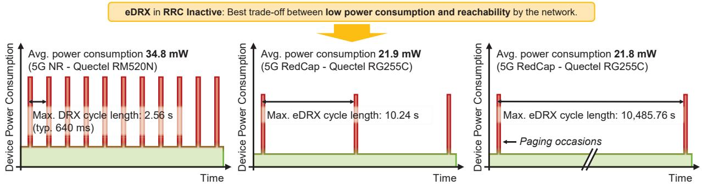  
(a) Discontinuous Reception (DRX)  
(b) Extended DRX (eDRX) (RRC Inactive)  
(c) Extended DRX (eDRX) (RRC Idle)  
Fig. 3: Comparison of different discontinuous reception modes in 5G networks. The power consumption is based on [13] and empirical measurements performed in this paper. Note that the width of the paging occasions is drawn wider than in actual networks for illustration purposes.

Instrument Software Architecture (VISA) protocol and the XLAPI interface from Rohde & Schwarz. Additionally, data transmission and reception are controlled using a Secure Shell (SSH) connection between the control and the client PC.

## V. PERFORMANCE ANALYSIS FOR 5G REDCAP

Using the laboratory setup presented in Section IV, we performed empirical measurements of power consumption and data rates for 5G RedCap and 5G NR devices.

## A. Uplink Power Consumption

Networks can adapt the device uplink transmit power PT x to different channel conditions and MCS requirements to meet a target SNR at the receiver. Yet, an increased uplink transmit power also increases electrical power consumption for the UE. The authors of [11] performed measurements of power consumption over increasing levels of uplink transmit power and found that the characteristic of the power consumption can be approximated by a piece-wise linear function, but is also linear increasing with the utilized network bandwidth. Since 5G RedCap devices are limited to 20 MHz, we can assume the device bandwidth to be fixed to 20 MHz. The device and technology-dependent parameters αn, βn and γn of the n-thpart of N linear power consumption approximation functions can be calculated using Equation 1 [11].

$$
\tag{1}
$$

Figure 6 presents the results for the uplink power measurements. Compared to 5G NR devices, the amplifiers in 5G RedCap devices are more efficient for most parts, since the power consumption is significantly decreased by up to

62 % when comparing identical settings with 5G NR devices. When transmitting with high uplink transmit power in band n78, though, the power consumption significantly increases for 5G RedCap devices. This can be caused by optimizing the amplifiers for lower frequencies. In future devices, these amplifiers could be optimized further for higher frequencies, which are commonly used for private 5G networks.

In addition to the power measurements while transmitting uplink data, the power consumption in subsequent UE states is also measured. After transmitting data, the device remains connected to the network and waits for potential downlink traffic until a data inactivity timer expires. In this state, the 5G RedCap and 5G NR devices consume an average of 252.6 mW resp. 588.2 mW, independent from the used frequency band. When the device transits to the RRC Inactive state, the average power consumption decreases. The values for eDRX are given in Figure 3.

Using the measured power characteristics in the different states, we can calculate the overall average power consumption for uplink-centered applications such as private video surveillance. Assuming a five minute data transmission per hour at maximum available data rate for best video quality, the average power consumption is given in Figure 8a. With the available Photovoltaic (PV) energy averaged over a year for the exemplary location of TU Dortmund University, Germany [15], we calculated the required PV size of solar energy harvesting for continuous operation of 5G devices, resulting in a maximum of 60 cm2 in worst case for 5G RedCap devices. For lower uplink transmit powers, or for fair SNR, 30 cm2 of monocrystalline PV are sufficient for continuous operation.

TABLE II: 5G RedCap parameters for linear power consumption approximation (cf. Equation 1).  
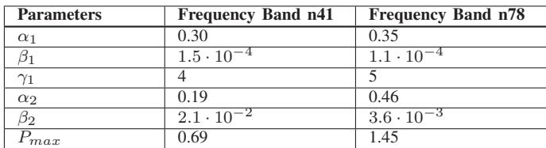

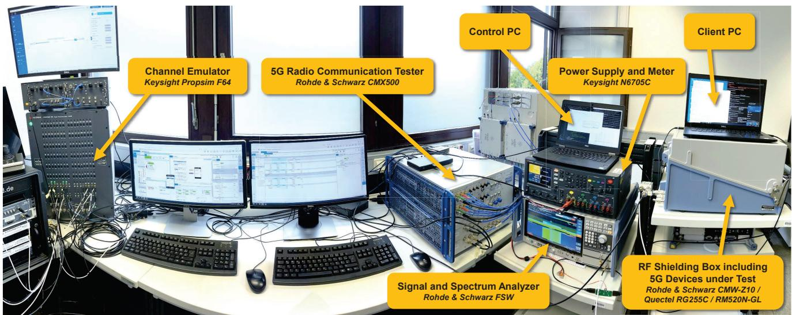  
Fig. 4: Laboratory setup to evaluate 5G RedCap and 5G NR power consumption and data rates.

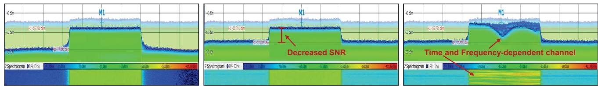  
(a) 5G downlink signal without AWGN or (b) 5G downlink signal with adjustable (c) 5G downlink Signal with AWGN and channel model. AWGN to alter SNR. 3GPP TDL-A fading channel model.  
Fig. 5: Programmable interference and dynamic multipath propagation on the 5G RedCap signals induced by channel emulator provides real-world channel conditions.

When devices require battery-only operation, we assume a battery with 10,000 mAh, or 37 Wh capacity for a battery life case study. Figure 8b presents results of battery life for different uplink transmit powers. For good coverage conditions only requiring low uplink transmit power, more than a month of battery life can be achieved. However, at the cell edge, battery life drops to 10 to 20 days, depending on the used frequency band. The results demonstrate the relevance of efficient amplifiers in modems, since using the n41 frequency band doubles the battery life at the cell edge. In future hardware designs, all frequency bands could be optimized for low power consumption. When comparing the energy results of both 5G categories, we can observe that, especially when using a low uplink transmit power, 5G RedCap can provide up to two times the battery life under similar conditions compared to 5G NR, which is due to the decreased power consumption of 5G RedCap modems in all device states.

Note that for this case study the user device power consumption is presented in the context of different uplink transmit powers. To analyze the relation between the uplink transmit power and a given SNR, we assessed 5G NR measurements, performed in [14] in public 5G networks. The results are presented in Figure 7. To compensate high signal loss at the cell edge, devices are required to use high uplink transmit powers, as seen in the left part of Figure 7. When the signal becomes stronger towards the cell center, the network can decide to reduce the transmit power of UEs for a reduced power consumption. Though, for higher MCS, high transmit power is still required and therefore the samples for uplink transmit power towards high SNR become more scattered. Empirical measurements in [16] have demonstrated that higher data rates in LTE networks using carrier aggregation can actually decrease the overall power consumption through reducing transmit time while simultaneously increasing power consumption. In future work, the optimization potential of balancing higher uplink transmit power and increased data rates can be examined for 5G networks. For this work, in result of Figure 7, no explicit relation between the SNR and uplink transmit power can be derived, but a trend of high uplink transmit power at the cell edge and on average lower uplink transmit power at cell center can be noted.

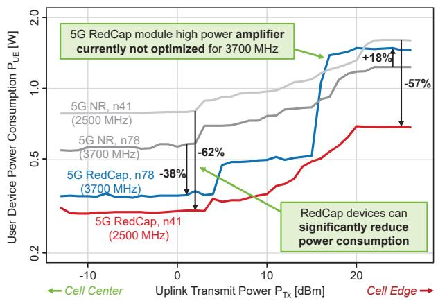  
Fig. 6: Comparison of power consumption between 5G Red-Cap and 5G NR devices as well as different frequency bands.

## B. Downlink Power Consumption

In addition to uplink-related measurements, we also focused on downlink-centered applications. When receiving a specific packet size, e.g., 5 MB, the time in which the 5G device needs to be active depends mainly on the downlink data rate. Due to bandwidth limitations, the maximum data rate of 5G RedCap devices is reduced. Using our laboratory setup, we performed extensive data rate measurements for different SNR values and MCS. We set the MCS to a fixed value in the scheduler of our 5G radio communication tester and received a continuous UDP downlink stream. The received data rates at the device are given in Figure 9. At first, in Figure 9a we only altered the SNR (cf. Figure 5b) for throughput under static channel conditions. Decreasing the SNR leads to an increased BLER, which in turn depends on the current MCS. The individual MCS data rate measurements are combined to an MCS envelope for maximum possible throughput being available with our 5G RedCap devices using one receive branch, or 1 MIMO layer. When using two receive branches, our measurements present that the data rate is increased by an average of 98 % compared to one receive branch, resulting in the upper MCS envelope in Figure 9a.

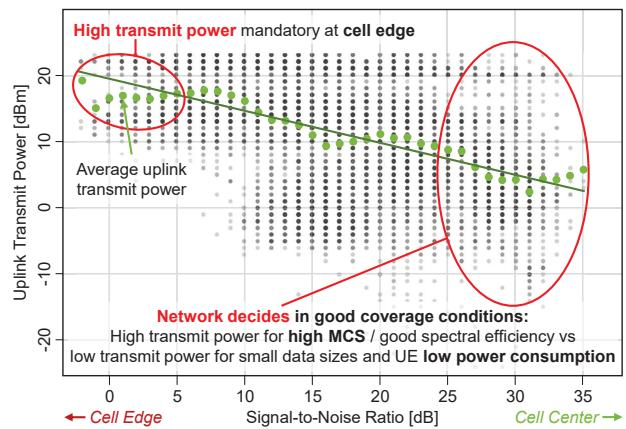  
Fig. 7: Correlation between SNR and uplink transmit power based on measurements in public 5G NR networks from [14].

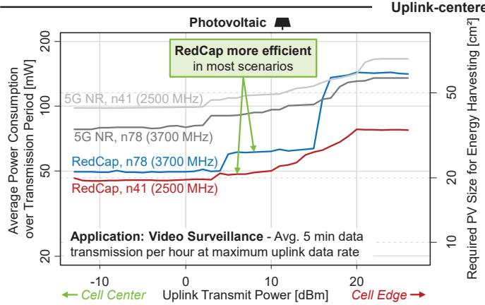  
(a) Energy case study for devices with energy harvesting demonstrates that 5G RedCap reduces required PV cell sizes.

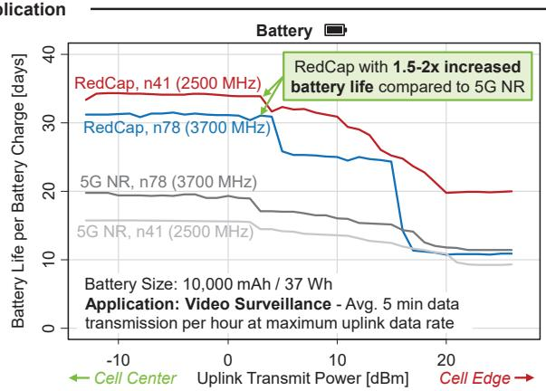  
(b) Energy case study for battery-powered devices demonstrates over one month of battery life with 5G RedCap.  
Fig. 8: Case studies present that 5G RedCap devices consume less power compared to 5G NR devices and, therefore, are a suitable choice for energy efficient 5G applications.

When the 3GPP TDL-A channel model is added to the measurements, additional time and frequency-dependent interference is introduced to the channel (cf. Figure 5c), which significantly decreases the BLER and thus induces retransmission on the air interface. Figure 9b demonstrates the impact of real-world channel conditions on the data rate, which is reduced by 23 % to 67 %.

For comparison with 5G NR, the data rate measurements are additionally performed with 5G NR devices in two configurations: 5G NR network with 20 MHz bandwidth for a direct comparison with 5G RedCap (cf. Figure 9c) and 5G NR network with 100 MHz bandwidth for maximum throughput in FR1. Since the 5G NR device we have used in our measurements supports up to four downlink MIMO layers and thus doubles the number of MIMO layers compared to RedCap, the maximum data rate of 5G NR exceeds RedCap as expected. When using 100 MHz of bandwidth, under good coverage conditions, 5G NR can provide 9 times the data rate compared to RedCap, which ultimately reduces the data transmission times and therefore enables devices to enter the power-saving idle state earlier. Note that the MIMO data rates are based on measurements of a single receive branch and assume that all MIMO links experience similar SNR conditions as for one receive branch.

Using the downlink data rate measurements we performed an energy-related case study for downlink-centered 5G Red-Cap applications. Therefore, we complemented the measurements used in Section V-A with power consumption measurements while receiving data. When receiving data using 5G RedCap or 5G NR, an average power of 366.3 mW resp. 1104.0 mW is measured. Figure 8a presents the results of the average power consumption when 5 MB of application data is transmitted each five minutes, e.g., for smart signage at shopping malls or bus stops. For continuous operation in outdoor scenarios, devices with good channel conditions and therefore high SNR can operate with a single PV cell of less than 10 cm2. When comparing 5G RedCap and 5G NR, devices using RedCap require 37 % less PV cell size.

When applications are solely battery-powered, we can use the measured data rates and power consumption to calculate the battery life. Therefore, we again assume a battery with 10,000 mAh, or 37 Wh capacity. The results in Figure 10b demonstrate that 5G RedCap devices with good channel conditions can experience over two months of battery life. However, devices at the cell edge experience a significant decrease in battery life. Still, compared to 5G NR, the battery life is increased by up to 57 %. This efficiency gain of 5G RedCap significantly falls below expectations of 70-fold battery life from [5] and of 4-fold battery life from [9], but comes close to the advertised 5G RedCap modem energy efficiency gain of 70 % from [17].

The reason for 5G RedCap energy efficiency gains not reaching 10s-fold expectations can be explained as follows:

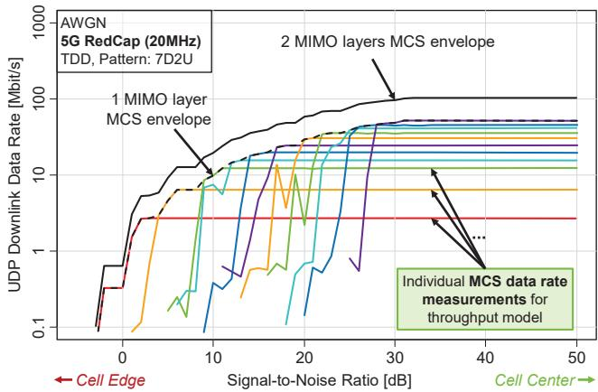  
(a) 5G RedCap data rate under optimal channel conditions.

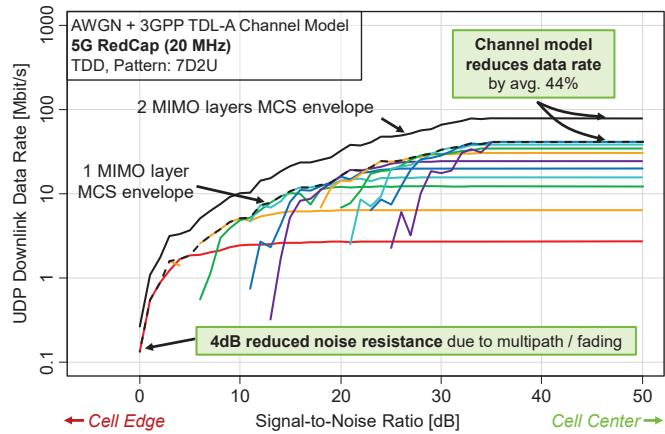  
(b) 5G RedCap data rate with 3GPP TDL-A channel model including multipath and fading effects.

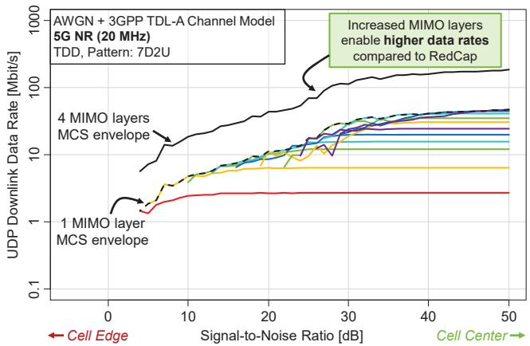

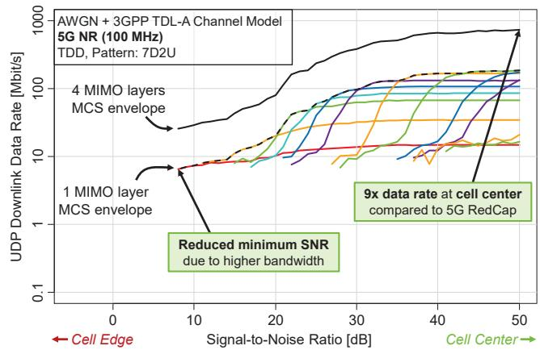  
(c) 5G NR data rate for 20 MHz bandwidth with 3GPP TDL-A (d) 5G NR data rate for 100 MHz bandwidth with 3GPP TDL-A channel model including multipath and fading effects. channel model including multipath and fading effects.  
Fig. 9: 5G RedCap and 5G NR downlink data rates based on empirical measurements for different Modulation and Coding Schemes.

It can be noted in Figure 10 that the battery life and the required PV cell size are roughly constant for high signalto-noise ratios, although experiencing different downlink data rates (cf. Figure 9). Since the data rates are high compared to the received application data and transmission period, the device remains most of its time in eDRX mode. Therefore, the power consumption of eDRX plays a significant role in the overall battery life. Even if the device remains in eDRX constantly without any uplink or downlink transmissions, a 37 Wh battery can only provide battery life for 70 days under ideal conditions, since the power consumption of 21.9 mW in eDRX mode is still too high for longer battery life with reasonable battery sizes. For future 6G networks, devices in the RedCap category should be further optimized for low power consumption in sleep states, as it has been done with NB-IoT devices. Exemplary comparing first NB-IoT/eMTC devices [18] with later NB-IoT/eMTC devices [19], we can find that the power consumption in eDRX was reduced by over 50 % possibly by hardware and software optimizations. With current 5G RedCap devices, our analysis presents an initial introduction of long battery life for mid-rage 5G applications. Still, with potential future optimizations of hardware and software, this battery life might be extended even further.

## VI. CONCLUSION

This work presents comprehensive empirical measurements of the data rate and power consumption of off-the-shelf 5G RedCap and 5G NR devices. The measurements are performed using base station and channel emulators to reproduce realworld conditions. Using a Hardware-in-the-Loop measurement setup, we developed an uplink power consumption model for different uplink transmit powers and frequency bands. This model is used in a case study to identify achievable battery life, or required PV size for continuous operation by taking the power consumption in different device states, including extended Discontinuous Reception, into account. The results demonstrate that the operating frequency band has a significant impact on energy efficiency, especially in uplinkcentered applications and at the cell edge. For downlinkcentered applications, data rate measurements are performed in challenging channel conditions, including multipath and fading effects. The results show that variable channel conditions can decrease the data rate by an average of 44 % due to packet errors and retransmissions. When transferring the measurement results into a case study of uplink and downlink-centered applications, our measurements identify that 5G RedCap can provide up to two times battery life to devices compared to 5G NR. Still, empirical measurements reveal that current 5G RedCap devices cannot reach years of battery life. For enabling longer battery life, the device energy efficiency in future 6G networks, especially in eDRX mode, needs to be optimized for significantly lower power consumption. When more 5G RedCap devices become available, we will extend the power consumption solution space in future work.

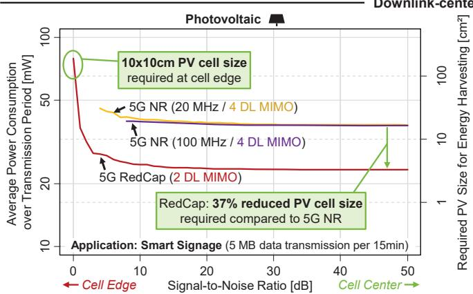  
(a) Comparison of power consumption demonstrates efficiency gain in 5G RedCap devices.

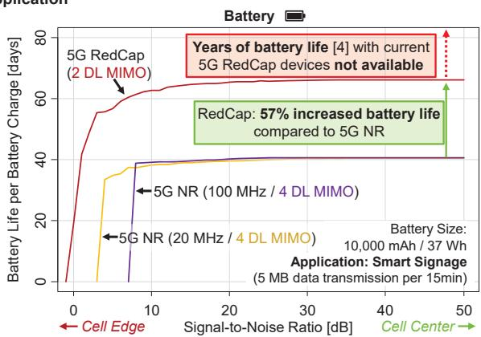  
(b) 5G RedCap can provide months of battery life, but requires further optimization for longer battery life.  
Fig. 10: Downlink measurements demonstrate that 5G RedCap energy efficiency gain comes close to modem manufacturer claims of 70% [17] when compared to 5G NR devices.

## ACKNOWLEDGMENT

This work has been carried out in the course of the Deutsche Forschungsgemeinschaft (DFG, German Research Foundation) under project number 508759126, Competence Center 5G.NRW funded by means of the Federal State NRW by the Ministry for Economic Affairs, Industry, Climate Action and Energy (MWIKE) under the Funding ID 005-01903- 0047 and the 6GEM Research Hub under the grant number 16KISK038 by means of the German Federal Ministry of Education and Research (BMBF).

## REFERENCES

[1] P. Jorke, R. Falkenberg, and C. Wietfeld, “Power Consumption Analysis ¨ of NB-IoT and eMTC in Challenging Smart City Environments,” in IEEE Global Communications Conference Workshops (GLOBECOM Workshops), Workshop on Green and Sustainable 5G Wireless Networks, Abu Dhabi, United Arab Emirates, 2018.

[2] 3GPP Technical Specification Group GERAN, “3GPP TR 21.917 V17.0.1: Summary of Rel-17 Work Items,” 3rd Generation Partnership Project, Tech. Rep., 2023.

[3] , “3GPP TR 45.820 V13.1.0: Cellular system support for ultra-low complexity and low throughput Internet of Things (CIoT) (Release 13),” 3rd Generation Partnership Project, Tech. Rep., 2015.

[4] Ericsson, “Energy Performance of 6G Radio Access Networks: A once in a decade opportunity,” White Paper, 2024.

[5] S. N. K. Veedu, M. Mozaffari, A. Hoglund, E. A. Yavuz, T. Tirronen, ¨ J. Bergman, and Y.-P. E. Wang, “Toward Smaller and Lower-Cost 5G Devices with Longer Battery Life: An Overview of 3GPP Release 17 RedCap,” IEEE Communications Standards Magazine, vol. 6, 2022.

[6] A. Jano, P. A. Garana, F. Mehmeti, C. Mas–Machuca, and W. Kellerer, “Modeling of IoT Devices Energy Consumption in 5G Networks,” in ICC 2023 - IEEE International Conference on Communications, 2023.

[7] X. Li, X. Xu, and C. Hu, “Research on 5G RedCap Standard and Key Technologies,” in 2023 4th Information Communication Technologies Conference (ICTC), 2023, pp. 6–9.

[8] S. Saafi, O. Vikhrova, S. Andreev, and J. Hosek, “Enhancing Uplink Performance of NR RedCap in Industrial 5G/B5G Systems,” in 2022 IEEE International Conference on Communications Workshops (ICC Workshops), 2022, pp. 520–525.

[9] R. Ratasuk, N. Mangalvedhe, G. Lee, and D. Bhatoolaul, “Reduced Capability Devices for 5G IoT,” in 2021 IEEE 32nd Annual International Symposium on Personal, Indoor and Mobile Radio Communications (PIMRC), 2021, pp. 1339–1344.

[10] B. Dusza, C. Ide, L. Cheng, and C. Wietfeld, “CoPoMo: A contextaware power consumption model for LTE user equipment,” Transactions on Emerging Telecommunications Technologies, vol. 24, 2013.

[11] H. Schippers and C. Wietfeld, “Data-Driven Energy Profiling for Resource-Efficient 5G Vertical Services,” in 2024 IEEE 21st Consumer Communications and Networking Conference (CCNC), 2024.

[12] Mediatek, “Bandwidth Part Adaptation - 5G NR User Experience and Power Consumption Enhancements,” White Paper, 2018.

[13] Quectel, “RM520N Hardware Design V1.1,” 2023.

[14] H. Schippers, S. Bocker, and C. Wietfeld, “Data-driven digital mobile ¨ network twin enabling mission-critical vehicular applications,” in 2023 IEEE 97th Vehicular Technology Conference (VTC2023-Spring), 2023.

[15] JRC Photovoltaic Geographical Information System (PVGIS) - European Commission. [Online]. Available: https://re.jrc.ec.europa.eu/ pvg tools/en/

[16] R. Falkenberg, B. Sliwa, and C. Wietfeld, “Rushing full speed with lteadvanced is economical - a power consumption analysis,” in 2017 IEEE 85th Vehicular Technology Conference (VTC Spring), 2017, pp. 1–7.

[17] MediaTek Unveils T300 5G RedCap Platform for IoT and Extremely Low Power Devices. (Accessed: 2024-11-15). [Online]. Available: https://corp.mediatek.com/news-events/press-releases/mediatekunveils-t300-5g-redcap-platform-for-extremely-low-power-devices

[18] Quectel, “BG96 Hardware Design V1.2,” 2017.

[19] ——, “BG95 Hardware Design V1.1,” 2020.