# Filling a Gap? Performance Comparison of RedCap and eRedCap for Mid-Tier Applications

Pascal Jorke, Mike Dabrowski, Dennis Overbeck and Christian Wietfeld ¨

Communication Networks Institute

TU Dortmund University, Germany

Email: {Pascal.Joerke, Mike.Dabrowski, Dennis.Overbeck, Christian.Wietfeld}@tu-dortmund.de

Abstract—With the introduction of Reduced Capability (Red-Cap) and enhanced Reduced Capability (eRedCap) user equipment, 3GPP Release 17 and 18 define new device categories aimed at bridging the gap between traditional 5G New Radio (NR) devices and IoT-oriented solutions such as NB-IoT and eMTC. These categories target mid-tier applications, such as process / asset monitoring and electricity distribution automation, which demand reduced device complexity, high energy efficiency, and moderate data rates. In this paper, we present a comprehensive simulation-based performance analysis of 5G RedCap and eRedCap using an extended ns-3 5G-LENA implementation. Our simulation framework integrates an energy consumption model and Bandwidth Part-aware scheduling, calibrated with empirical energy measurements from commercial RedCap devices, ensuring realistic and reproducible simulation results. While eRedCap shows improved energy efficiency due to its reduced 5 MHz bandwidth, its overall battery lifetime and latency tend to be inferior in practical scenarios. Our analysis proposes optimized eDRX power consumption and Release Assistance Indication (RAI) for (e)RedCap to reflect future energy-saving potential. Our results highlight both the limitations and opportunities of (e)RedCap in expanding the 5G ecosystem towards 6G.

Index Terms—RedCap, eRedCap, simulation, power consumption, data rate, ns-3, 5G LENA

## I. INTRODUCTION

W ITH RedCap, a new device category has been in-troduced in 3GPP Release 17 [1]. It targets mid- troduced in 3GPP Release 17 [1]. It targets midtier applications [2] such as process / asset monitoring [3] and electricity distribution automation [4], which require data rates from several kbit/s to Mbit/s and cannot be sufficiently addressed by existing IoT-specific cellular solutions such as Narrowband Internet of Things (NB-IoT) or enhanced Machine Type Communication (eMTC). While 5G New Radio (NR) provides sufficient performance for mid-tier applications, its costs and form factor are not feasible. Furthermore, RedCap was specifically designed to meet the low-power requirements necessary for extended battery lifetimes. It adopts the extended Discontinuous Reception (eDRX) power saving mechanism, initially introduced with NB-IoT / eMTC [5], which relaxes data reception and thus prepares for lean design concepts in 6G networks [6]. In 3GPP Release 18, an additional category is introduced, called enhanced Reduced Capability (eRedCap), which further reduces the complexity of RedCap devices by limiting the bandwidth for data transmissions to 5 MHz as well as the Uplink (UL)/Downlink (DL) data rate to a maximum of 10 Mbit/s to replace Long Term

Evolution (LTE) Cat 1 devices [7]. Additionally, the eDRX in Radio Resource Control (RRC) Inactive state is enhanced for lower power consumption by allowing the eDRX cycle length to be as long as in RRC Idle State (up to 10485.76 s).

In this paper, we present a simulation-based performance analysis of the RedCap and eRedCap category, to identify its potential and limitations and provide insights on how these categories can extend the 5G ecosystem. Our results will help understanding which applications are supported by RedCap and eRedCap. For this, we have developed an extension to the ns-3 5G-LENA simulation framework to support RedCap and eRedCap, including major changes in the RRC and Medium Access Control (MAC) layer, as well as implementing a new resource manager for Bandwidth Part (BWP) specific scheduling. To compare energy-related performance, we include a new energy state machine in the simulation framework, which uses power consumption measurement results from laboratory measurements in previous work [8] (cf. Figure 1). For easy reading, we use M to mark measurement-related results and S to mark simulation-related results in all figures.

The remainder of this paper is structured as follows: Section II briefly outlines previous works on RedCap, while Section III gives a short overview of RedCap and eRedCap basics. Section IV introduces the simulation model and laboratory measurement setup used in this work. It is followed by the analysis of the latency and power consumption in

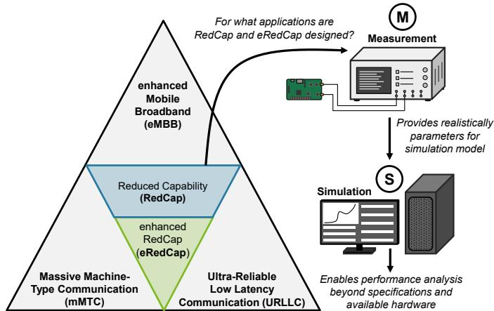  
Fig. 1: Concept of (e)RedCap performance analysis uses measurements and simulations beyond current RedCap devices.

Section V and finally, the results are concluded in Section VI.

## II. RELATED WORK

RedCap as a new category has been previously discussed in scientific publications. The authors of [9] provide a detailed overview of RedCap requirements, features, and potential performance. For RedCap devices with minimum capabilities (e.g., a single DL Multiple Input Multiple Output (MIMO) layer) [9] states that peak physical data rates in 5G TDD networks can reach 60 Mbit/s. The authors calculate that the battery lifetime can be extended by up to 70 times compared to 5G NR, depending on the eDRX cycle length and Inter Arrival Time (IAT) of the application. However, the authors do not provide information on what actual battery lifetime is achievable rather than relative extension.

In [10], the authors present an analytical energy consumption model for RedCap devices. While the model is very detailed and considers different energy states, the lack of underlying RedCap-specific power measurements limits its applicability for real-world devices.

The authors of [11] present experimental results for RedCap devices. Data rate measurements demonstrate physical downlink data rates of up to 141 Mbit/s when using two receive branches. Since the authors do not provide detailed information on the measurement setup, the Device Under Test (DUT), or network configuration such as the Modulation and Coding Scheme (MCS), the results are not reproducible.

In [12] the authors investigate the impact of using RedCap on the performance in a distribution automation system and found that RedCap provides low power consumption compared to legacy User Equipments (UEs). Due to the lack of network parameters, these results are not reproducible and therefore cannot be further used.

Since 5G networks often operate in mid-band deployments, signal range can be limited. The authors of [13] analyze the impact of supplement UL carriers in lower frequency bands for devices at cell edge for better performance. However, this analysis is limited to Block Error Rate (BLER) and throughput evaluations and does not provide results regarding power consumption. While the results demonstrate that the data rates in supplement UL bands are reduced compared to mid-range frequency bands, the impact of this feature on battery-powered devices is not addressed. [14] provides an overview of different features of RedCap devices. The authors found that in Frequency Range 1 (FR1) Frequency Division Duplex (FDD) networks 5G RedCap can reach DL peak data rates of up to 85 Mbit/s and including eDRX can improve the battery life by up to four times, which is significantly less than predicted in [9]. As neither publication provides sufficient information on the power consumption assumptions for each of the 5G RedCap device states, a comparison of these results cannot be performed.

In contrast to related work, our work provides a comprehensive simulation-based analysis of RedCap and eRedCap devices and thus presents the potential and limits of the new categories. To the best of our knowledge, this is the first paper to conduct a scientific performance evaluation of eRedCap.

## III. REDCAP AND EREDCAP TO FILL THE GAP

To address mid-tier applications like process / asset monitoring, electricity distribution automation, health devices, or wearables, RedCap and eRedCap were designed for reduced device complexity and extended energy efficiency.

## A. Bandwidth Limitations

RedCap devices are limited to 20 MHz of bandwidth. To ensure compatibility of this device class in existing 5G NR deployments, networks with larger bandwidths than 20 MHz use BWPs to define partial bandwidths. Since BWPs can overlap [15], 5G NR devices can still use the full bandwidth for maximum throughput despite including BWPs with 20 MHz. For even further complexity reduction RedCap is obligated to implement only one receive branch / MIMO layer and 64QAM modulation (min. config.) with an optional second receive branch / 256QAM modulation (max. config.), which facilitates smaller and reasonably priced hardware [9].

eRedCap further reduces the supported bandwidth to 5 MHz, or more precisely 25 Physical Resource Blocks (PRBs) for 15 kHz Subcarrier Spacing (SCS) and 12 PRBs for 30 kHz SCS, but only for Physical Uplink Shared Channel (PUSCH) and Physical Downlink Shared Channel (PDSCH) [7]. Other signals or channels are unaffected by the restrictions, resulting in unchanged hardware requirements of eRedCap devices to support 20 MHz of physical bandwidth, which may result in similar power consumption in idle/sleep compared to RedCap. In addition to the bandwidth restrictions, the UE peak data rate reduction restricts the data rate in DL and UL to 10 Mbit/s. For data transmission, these limitation will result in longer transmit times, which can cause higher power consumption as demonstrated in [16].

## B. Power Consumption Optimization

In addition to a new RRC Inactive state to reduce signaling overhead while reconnecting to the network [1], RedCap devices include a new power saving feature, which was originally introduced by NB-IoT and eMTC devices, called eDRX. With eDRX the cycle length between paging occasions is extended to allow devices to remain longer in sleep mode. While the average power consumption is reduced, the responsiveness of the device decreases, since in sleep mode the lower layer functions are turned off and the device is not reachable for the network. Devices being in RRC Inactive state have been previously limited to a maximum eDRX cycle of 10.24 seconds, while devices in RRC Idle state can remain in sleep mode for up to 10,485.76 seconds, or approximately three hours between paging occasions. With 3GPP Release 18, both RRC Inactive and RRC Idle states now can use a maximum of 10,485.76 seconds cycle length [7]. Since paging occasions are brief compared to the time spent in sleep mode, both eDRX modes in RRC Inactive state and RRC Idle state have nearly identical power consumption in our measurements despite having different timers [8]. A substantial difference in power consumption between different cycle lengths will require significantly lower power consumption in the sleep modes, which is currently not given.

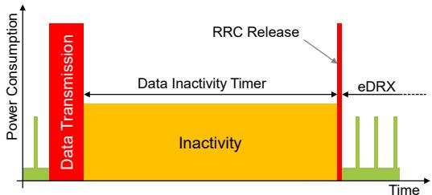  
(a) Long Data Inactivity Timers result in increased average power consumption

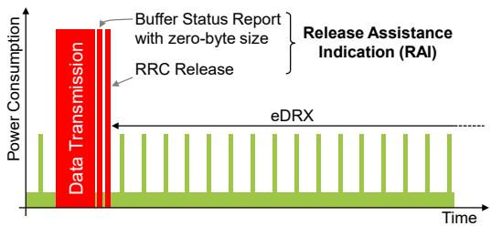  
(b) Release Assistance Indication enables the devices to enter eDRX earlier for decreased average power consumption  
Fig. 2: Comparison of power states with and without Release Assistance Indication

With eDRX, the battery lifetime in RedCap devices will be improved. Still, for RedCap and eRedCap devices running on batteries, an even longer battery lifetime is desirable. As part of NB-IoT, a feature called Release Assistant Indication (RAI) has been introduced, which triggers an immediate RRC Connection release without requiring waiting until the Data Inactivity Timer (DIT) expires [17]. This decreases the power consumption when no more data has to be transmitted (cf. Figure 2). To our knowledge, this feature is currently only supported by NB-IoT and eMTC devices. Therefore, in this work, we propose using RAI for RedCap and eRedCap devices as well. We will evaluate the impact of RAI on the power consumption in Section V.

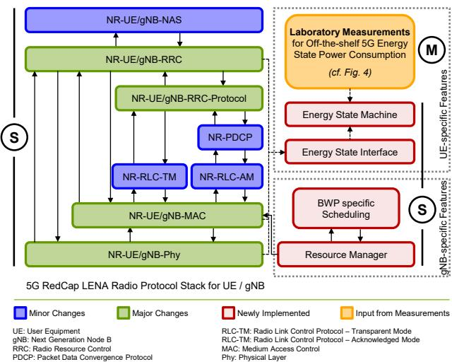  
Fig. 3: Overview of the different modifications made in 5G-LENA to support (e)RedCap devices

## IV. SIMULATION FRAMEWORK FOR 5G (E)REDCAP

For the performance simulations of RedCap and eRedCap we extend the ns-3 5G LENA simulation framework [18] to these new device categories1, as shown in Figure 3. The main changes include the support of the new RRC Inactive state. Based on the reconnection procedure included in LENA-NB [19], 5G-LENA is extended to support RRC Release after inactivity and RRC reconnection via the RRC Resume procedure. To support bandwidth limitations introduced by RedCap and eRedCap, a new resource manager was implemented, which enables BWP-specific scheduling for overlapping BWPs. While the scheduler is using a round robin scheduling approach, smaller BWPs are scheduled first to prevent larger BWP to occupy all available resources, leaving no resources for smaller BWP. In MAC/PHY layer Physical Random Access Channel (PRACH) resources and timings were adapted to support the new categories and ensure compatibility with the resource manager. For battery lifetime evaluation, an energy state machine is included, tracing the UE power consumption over the complete simulation period.

For the power consumption in different UE states, as well as the validation of the impact of a reduced bandwidth on the Signal to Noise Ratio (SNR) / transmit power, a measurement setup was used as shown in Figure 4. It combines a Rohde and Schwarz CMX500 Radio Communication Tester as well as FSW Signal and Spectrum Analyzer, a Keysight N6705C Power Supply and Meter and as a device under test a Quectel RG255C RedCap device. The energy measurement results for the different power states, such as uplink transmission, downlink reception, idle times, and eDRX were used as an input for the energy state machine in the ns-3 module. Note that currently no eRedCap devices are available. Since eRedCap comes with similar hardware requirements as RedCap devices, it is assumed that the power consumption in the different UE states are equal between RedCap and eRedCap. Differences between RedCap and eRedCap — such as bandwidth limitations on shared channels and reduced data rates — are enforced by software rather than hardware.

## A. Impact of Reduced Bandwidth on Power Consumption

The device transmit power is distributed over the scheduled bandwidth, as shown in the left part of Figure 5a for RedCap. Since eRedCap reduces its bandwidth from 20 MHz to 5 MHz, it requires less transmit power for a similar power density, and thus similar SNR (cf. Fig. 5a, right). As expected from a 4-fold bandwidth reduction, the measurement results in the lab confirm that eRedCap requires 6 dB less transmit power for a similar SNR as RedCap. Translated to energy efficiency, eRedCap can reduce its power consumption while transmitting data by up to 66%, as shown in Figure 5b. Instead of lowering the transmit power, it is possible for eRedCap devices to keep its high transmit power for a better SNR and therefore higher MCS. Due to the steep increase of power consumption towards high transmit powers, we recommend using lower transmit powers instead for a more energy efficient operating point of the High Frequency (HF) amplifiers.

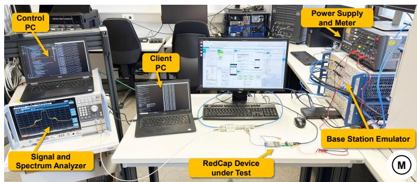  
Fig. 4: Laboratory setup to evaluate RedCap power consumption, transmit power and spectrum usage

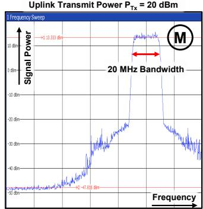

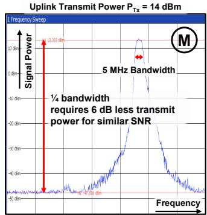

(a) 5G RedCap spectrum with 20 MHz and 5 MHz shared channel bandwidth  
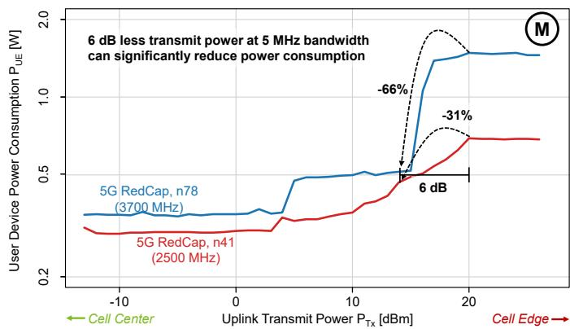  
(b) Reduced instantaneous power consumption due to reduced bandwidth (power consumption measurements from [8])  
Fig. 5: Emulation of reduced bandwidth demonstrates potential eRedCap power consumption reduction

## B. Validation of Simulation Framework

We used results from [8] to validate the implemented (e)RedCap simulation framework. In the laboratory measurements a video surveillance application was assumed that transmits a video stream for 5 minutes at maximum data rate at an interval of one hour. For the battery, a capacity of 10,000 mA, or 37 Wh is assumed. Since both the simulative approach as well as the laboratory measurements in Figure 6 result in a similar battery lifetime, the simulation model is validated and can be used for the following evaluations.

## V. PERFORMANCE EVALUATION OF (E)REDCAP

With the implemented simulation framework for RedCap and eRedCap, a performance comparison is carried out. Therefore, we define the network configuration as shown in Tab. I.

## A. DL-centered Applications

First, we focus on DL-centered applications, which periodically transmit data from the network to the UE. For RedCap devices, two configurations are used. The first configuration (max. config.) uses RedCap devices with optional features, such as a second MIMO layer, and the 256QAM table. Compared to RedCap with minimum configuration (one DL MIMO layer and 64QAM table), it can provide higher data rates, resulting in a decreased delay as shown in Figure 7a. eRedCap, which is limited to a data rate of max. 10 Mbit/s, further increases the latency. Additionally, in Figure 7a the delay significantly increases as the data size approaches 2000 kBytes, indicating channel saturation. This is confirmed when analyzing the spectrum usage. Considering that 20% of the spectrum are used for control signals and broadcasts, Figure 7a demonstrates that in our configuration eRedCap reaches channel saturation at 8 Mbit/s application layer data rate, excluding lower layer overhead.

We also evaluate the power consumption of RedCap and eRedCap devices, which are transferred to a battery life using a single 37 Wh battery. The results demonstrate that for small data rates, RedCap and eRedCap enable similar battery life, since in these cases the battery life is mainly defined by the eDRX and idle power consumption. Assuming that eRedCap devices will be optimized in power consumption in the future, as it was with Quectel BG96 and BG95 devices for NB-IoT, the eDRX power consumption may also be reduced in the future. For our evaluation, we propose that the eDRX power consumption of future eRedCap devices will be optimized to be at least as efficient as the sleep state of an LTE Cat-1 device [20] and consume as low as 8.58 mW during Discontinuous Reception (DRX). The results in Figure 7b demonstrate that an eRedCap device with proposed optimized eDRX will enable 21% more battery life compared to RedCap and eRedCap devices with current hardware. In terms of energy efficiency, the optimized eRedCap will be the best choice for burst transmissions up to 200 kBytes at the given interval.

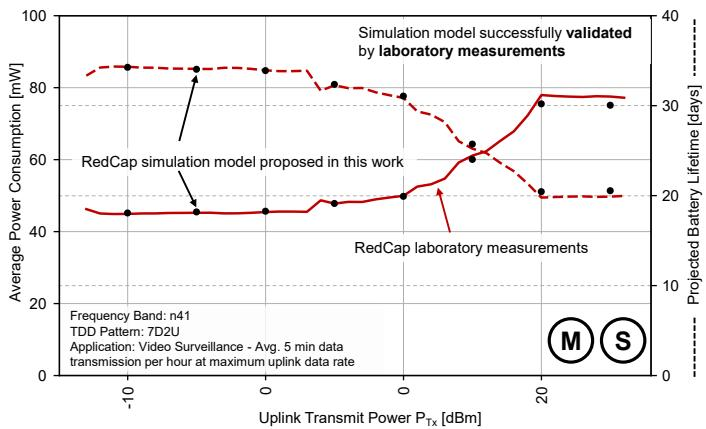  
Fig. 6: Validation of proposed simulation model with laboratory measurements from [8]

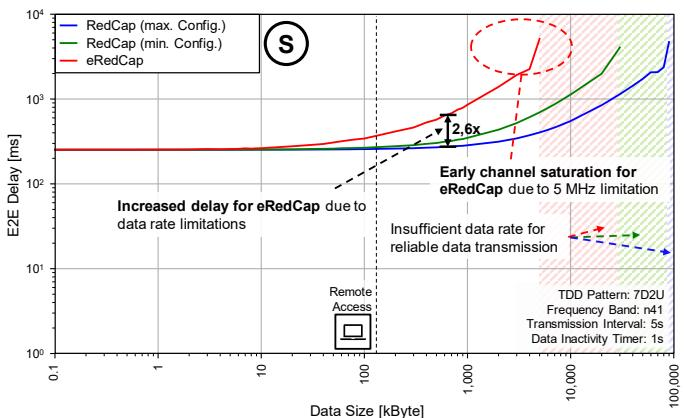  
(a) Downlink delay comparison for different data sizes

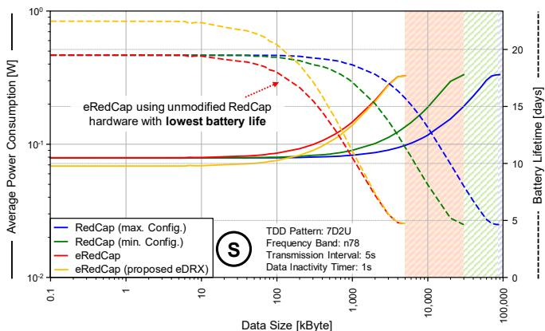  
(b) Downlink energy comparison for different data sizes

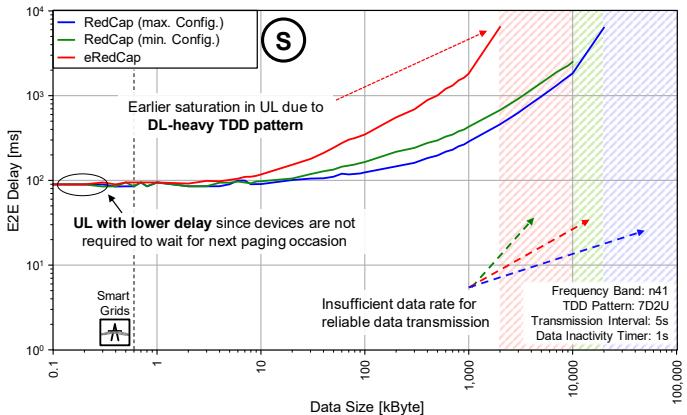  
(c) Uplink delay comparison for different data sizes

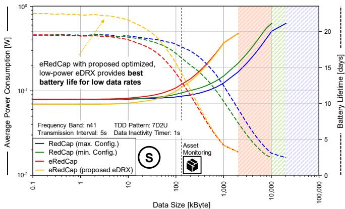  
(d) Uplink energy comparison for different data sizes  
Fig. 7: Performance comparison for downlink- and uplink-centered applications

## B. UL-centered Applications

In addition to downlink-centered applications, we also evaluated uplink-centered applications for latency and energy performance. Compared to downlink-centered transmissions, the uplink is saturated earlier, since the TDD pattern is DL oriented and thus provides less resources to UL transmissions (cf. Fig. 7c). In the case of power consumption, lower UL data rates will result in longer transmission times, which affects the significantly energy consuming uplink power state in such case that the average power consumption is drastically increased (cf. Fig. 7d). Though, as shown in Figure 5 the smaller bandwidth of eRedCap requires lower transmit powers, which ultimately decreases the power consumption while transmitting data. Therefore, the uplink power consumption comes with only a minimum increase compared to downlinkcentered applications. Still, in comparison with RedCap the results demonstrate that eRedCap provides the lowest battery life for most data sizes. eRedCap with an optimized eDRX power consumption on the other hand can again improve the battery life for low data rates, which underlines the demand for hardware optimization for eRedCap devices.

TABLE I: RedCap and eRedCap simulation parameters  
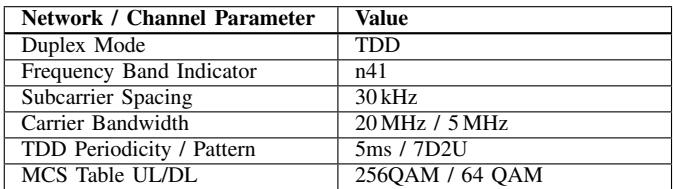

## C. Integration of RAI in eRedCap

Finally, we used our simulation framework to evaluate the impact of RAI as defined in NB-IoT networks being used in eRedCap devices as well. Figure 8 demonstrates that for an uplink application, which transmits 3750 bytes in an interval of 30s, with RAI, the battery life can be significantly improved by up to 88%. Therefore, for future 6G eRedCap devices, we highly recommend integrating RAI to enable significant higher battery life.

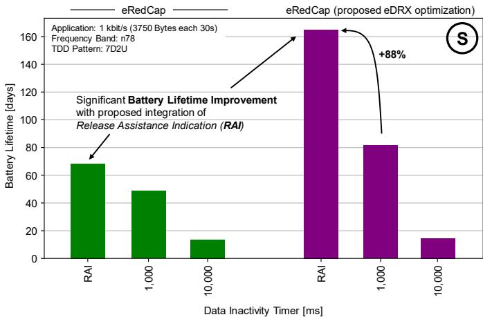  
Fig. 8: NB-IoT Release Assistance Indication as proposed extension for eRedCap can further optimize power consumption

## VI. CONCLUSION

The evolution of cellular networks beyond 5G is increasingly shaped by the growing demand for scalable, energyefficient, and flexible device classes. Reduced Capability (RedCap) and enhanced Reduced Capability (eRedCap) devices are positioned as a bridge between high-performance 5G NR user equipment and low-power wide-area technologies such as NB-IoT. Their design targets moderate data rates, lower hardware complexity, and extended battery lifetimes, aiming to serve emerging applications including industrial monitoring, wearables, and smart infrastructure. This paper presents a detailed performance and energy evaluation of RedCap and eRedCap devices, based on a novel simulation framework extension built on the ns-3 5G-LENA module, that has been published open-source as part of this paper. The framework has been enhanced with a BWP-aware scheduler, RedCap-specific network optimizations and a finegrained power consumption model to reflect the constraints and behaviors of real-world deployments. The results of the performance comparison between RedCap and eRedCap demonstrate that, although eRedCap’s narrower 5 MHz bandwidth promises higher energy efficiency, this benefit is often counterbalanced by limited data rates, resulting in increased latency and lower battery lifetime with typical Internet of Things (IoT) applications. This work also evaluates potential future hardware optimizations, including improved extended Discontinuous Reception (eDRX) power consumption and Release Assistance Indication (RAI), demonstrating their significant impact on future device performance. In light of ongoing discussions around 6G system design, these findings emphasize the importance of energy-optimized device classes that can adapt to highly diverse application profiles. The insights gained not only help optimize current RedCap and eRedCap deployments, but also offer valuable guidance for the development of future energy-aware communication paradigms, which will play a major role in 6G networks.

## ACKNOWLEDGMENT

This work was partially funded by the 6GEM Research Hub under grant number 16KISK038 by the Federal Ministry of Research, Technology and Space as well as the ReCoDE project under grant number 03EI6093B by the Federal Ministry for Economic Affairs and Energy. In addition, this work was partially funded by the Competence Center 5G.NRW under the Funding ID 005-01903-0047 by means of the Federal State NRW by the Ministry for Economic Affairs, Industry, Climate Action and Energy as well as the Deutsche Forschungsgemeinschaft (German Research Foundation) under project number 508759126.

## REFERENCES

[1] 3GPP Technical Specification Group GERAN, “3GPP TR 21.917 V17.0.1: Summary of Rel-17 Work Items,” 3rd Generation Partnership Project, Tech. Rep., 2023.

[2] GSMA, “RedCap/eRedCap for IoT,” 2025.

[3] 3GPP Technical Specification Group GERAN, “3GPP TS 22.104 V17.7.0: Service req. for cyber-physical control applications in vertical domains,” 3rd Generation Partnership Project, Tech. Rep., 2022.

[4] Siemens AG, “LTE 4 Smart Energy; Deliverable D1 Use Cases and Requirements,” Activity 14145, Tech. Rep., 2017.

[5] 3GPP Technical Specification Group GERAN, “3GPP TR 45.820 V13.1.0: Cellular system support for ultra-low complexity and low throughput Internet of Things (CIoT) (Release 13),” 3rd Generation Partnership Project, Tech. Rep., 2015.

[6] Ericsson, “Energy Performance of 6G Radio Access Networks: A once in a decade opportunity,” White Paper, 2024.

[7] 3GPP Technical Specification Group GERAN, “3GPP TR 21.918 V2.0.0: Summary of Rel-18 Work Items,” 3rd Generation Partnership Project, Tech. Rep., 2025.

[8] P. Jorke, H. Schippers, and C. Wietfeld, “Empirical Comparison of ¨ Power Consumption and Data Rates for 5G New Radio and RedCap Devices,” in IEEE Consumer Communications and Networking Conference (CCNC), Las Vegas, USA, 2025.

[9] S. N. K. Veedu, M. Mozaffari, A. Hoglund, E. A. Yavuz, T. Tirronen, ¨ J. Bergman, and Y.-P. E. Wang, “Toward Smaller and Lower-Cost 5G Devices with Longer Battery Life: An Overview of 3GPP Release 17 RedCap,” IEEE Communications Standards Magazine, vol. 6, 2022.

[10] A. Jano, P. A. Garana, F. Mehmeti, C. Mas–Machuca, and W. Kellerer, “Modeling of IoT Devices Energy Consumption in 5G Networks,” in ICC 2023 - IEEE International Conference on Communications, 2023.

[11] X. Li, X. Xu, and C. Hu, “Research on 5G RedCap Standard and Key Technologies,” in 2023 4th Information Communication Technologies Conference (ICTC), 2023, pp. 6–9.

[12] J. Chen, S. Wu, X. Wang, S. Yu, C. Deng, G. Lin, and Z. Li, “Research on Low Power Strategy Optimization and Environmental Adaptability of 5G RedCap Terminal for Electric Power Application,” in 2024 IEEE 5th International Conference on Advanced Electrical and Energy Systems (AEES), 2024, pp. 314–318.

[13] S. Saafi, O. Vikhrova, S. Andreev, and J. Hosek, “Enhancing Uplink Performance of NR RedCap in Industrial 5G/B5G Systems,” in 2022 IEEE International Conference on Communications Workshops, 2022.

[14] R. Ratasuk, N. Mangalvedhe, G. Lee, and D. Bhatoolaul, “Reduced Capability Devices for 5G IoT,” in 2021 IEEE 32nd Annual International Symposium on Personal, Indoor and Mobile Radio Communications (PIMRC), 2021.

[15] Mediatek, “Bandwidth Part Adaptation - 5G NR User Experience and Power Consumption Enhancements,” White Paper, 2018.

[16] R. Falkenberg, B. Sliwa, and C. Wietfeld, “Rushing Full Speed with LTE-Advanced Is Economical - A Power Consumption Analysis,” in 2017 IEEE 85th Vehicular Technology Conference (VTC Spring), 2017. [17] GSMA, “Mobile IoT Deployment Guide,” 2022.

[18] N. Patriciello, S. Lagen, B. Bojovic, and L. Giupponi, “An E2E Simulator for 5G NR Networks,” in Elsevier Simulation Modelling Practice and Theory (SIMPAT), 2019.

[19] P. Jorke, T. Gebauer, and C. Wietfeld, “From LENA to LENA-NB: ¨ Implementation and Performance Evaluation of NB-IoT and Early Data Transmission in ns-3,” in Proceedings of the 2022 Workshop on Ns-3, New York, NY, USA, 2022.

[20] Quectel, “EG21-G Hardware Design V1.3,” 2024.