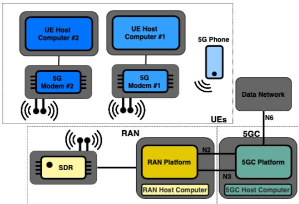
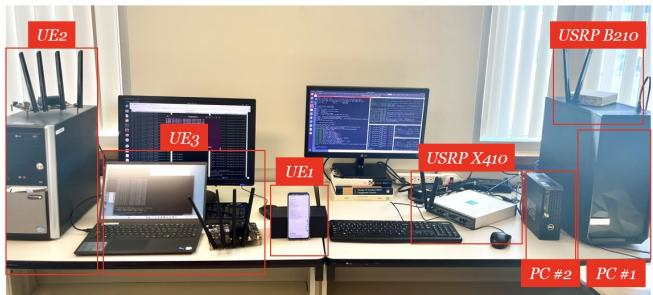
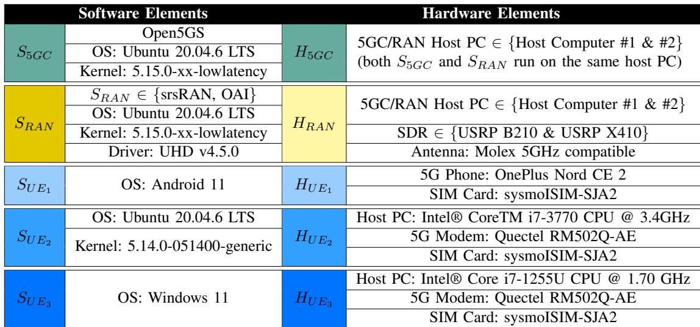
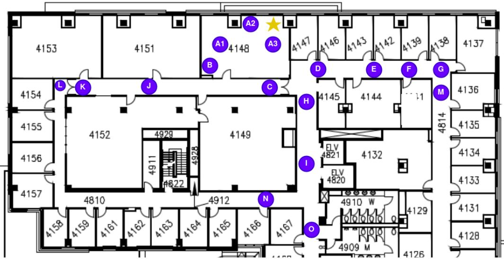
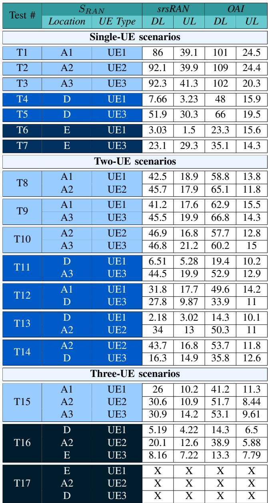
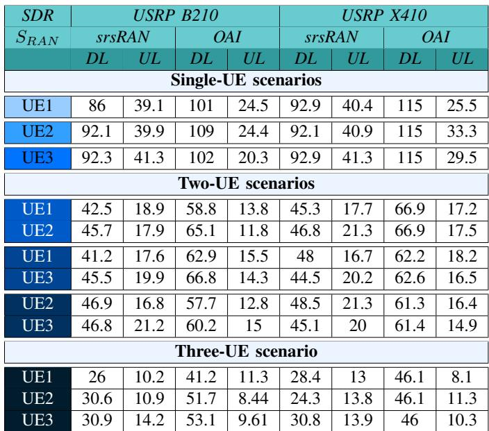
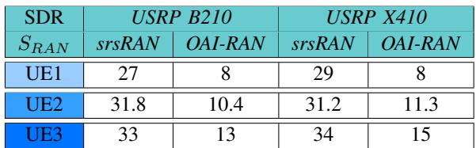
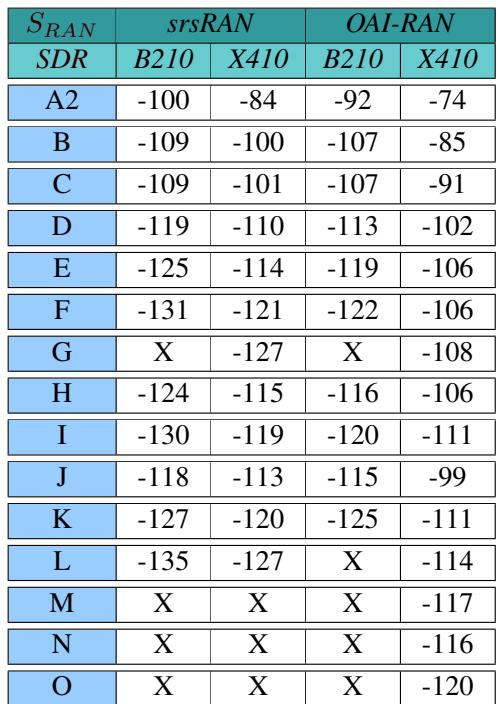
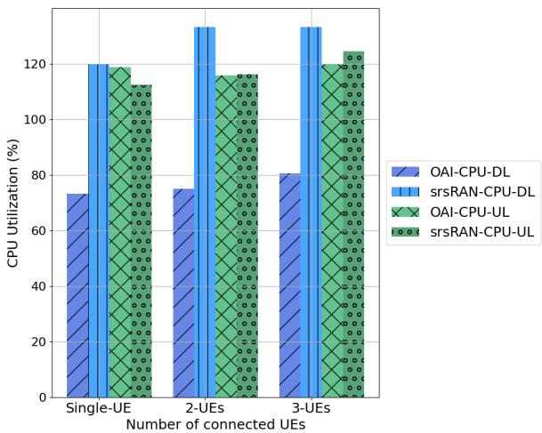
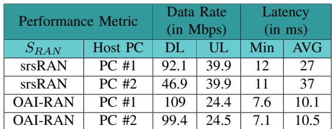

# Performance Analysis and Comparison of Full-Fledged 5G Standalone Experimental TDD Testbeds in Single & Multi-UE Scenarios

Maryam Amini, and Catherine Rosenberg, Fellow, IEEE,

Abstract—Open-source software and Commercial Off-The-Shelf hardware are finally paving their way into the 5G world, resulting in a proliferation of experimental 5G testbeds. Surprisingly, very few studies have been published on the comparative analysis of testbeds with different hardware and software elements.

In this paper, we first introduce a precise nomenclature to characterize a 5G-standalone single-cell testbed based on its constituent elements and main configuration parameters. We then build 30 distinct such testbeds and systematically analyze their performance with an emphasis on element interoperability (by considering different combinations of hardware and software elements from different sources), the number and type of User Equipment (UE) as well as the Radio Access Network hardware and software elements to address the following questions: 1) How is the performance (in terms of bit rate and latency) impacted by different elements? 2) How does the number of UEs affect these results? 3) What is the impact of the user(s)’ location(s) on the performance? 4) What is the impact of the UE type on these results? 5) How far does each testbed provide coverage? 6) And finally, what is the effect of the computing resources available to each open-source software? This study focuses on TDD testbeds.

Index Terms—5G-SA experimental testbed, 5G open-source, 5G COTS, Performance analysis.

## I. INTRODUCTION

A Fundamental shift in the architecture of mobile networkshas happened, spearheaded by the 3rd Generation Part- has happened, spearheaded by the 3rd Generation Partnership Project (3GPP), which has introduced a novel, disaggregated, and open architecture for the fifth-generation (5G) of cellular networks to enable Mobile Network Operators (MNOs) to source solutions tailored to their specific needs from various vendors. The main elements of a 5G system remain the Radio Access Network (RAN), the 5G Core Network (5GC), as well as the User Equipment (UE), but all of them have gone through significant transformations. The advent of the NG-RAN [1], a dis-aggregated architecture composed of several vendor-neutral elements connected by open, standardized interfaces with a major shift towards softwarization, marks a pivotal shift for cellular networks. Concurrently, the core network has adapted to host a multitude of novel Network Functions (NFs) designed to accommodate the diverse services envisioned for 5G. On the UE side, a proliferation of devices with significantly differing features creates new challenges for the network.

In this context, experimental testbeds have become crucial for test and validation and to verify interoperability, and pinpoint any gaps in the design of the different elements of this open, and dis-aggregated architecture. These testbeds benefit from the latest developments of:

• Software-defined radios (SDRs) that are hardware devices that serve as the radio component of 5G testbeds. Without them, over-the-air transmissions would need to be simulated, which would defeat the whole purpose of implementing a fullfledged experimental testbed.

• Several sophisticated software platforms and tools that have emerged both for the 5GC and the NG-RAN. Specifically, open-source frameworks, such as srsRAN [24], which focuses on the RAN, and OpenAirInterface (OAI) [20], which offers both RAN and 5GC components1, have gained significant momentum.

This paper only focuses on 5G stand-alone (5G-SA) single cell testbeds that uses Time-Division Duplexing (TDD). We consider and build 30 such testbeds, varying in the software/hardware element of the RAN as well as the number, and the type of the connected UEs. Note that we have kept the 5GC the same in all those testbeds because we have shown in a previous paper [6] that performance is not really impacted by the core and the different RAN elements do interoperate well with the 5GC that we have tried.

Most of the papers on 5G-SA open testbeds focus on studying the performance of single-UE scenarios in terms of bit rate and latency, with occasional consideration given to coverage. Very few address interoperability and, to the best of our knowledge, no one addresses multi-UE scenarios conducted in multiple locations to examine the impact of location on the performance of different types of UEs. A comprehensive study of multi-UE 5G-SA testbeds is yet to be done to fully unveil the potential of these experimental platforms and the interoperability of the different elements.

This paper aims at shedding light on the impact of each element on the overall performance of a testbed in the context of multi-UE scenarios. It examines how the location and the type of each UE plays a role in performance. It also studies the interoperability of different types of UEs with different hardware and software elements of the RAN. This paper synthesize and extensively expand our preliminary works reported in [4, 5, 6]. Specifically, we have:

• Built and studied 28 single-cell 5G-SA TDD testbeds, each differing by the combination of RAN elements (software and Software-Defined Radio (SDR)) and number and types of UE(s) being used. We evaluated these testbeds from an interoperability perspective as well as from a performance standpoint, using well-defined quantitative and qualitative metrics, including data rate, latency, and coverage.

• Explored the multi-UE case for different locations systematically, starting from good locations (please see Sec. V where we explain what we mean by “good”) and progressively making the locations worse.

• Built two additional testbeds to evaluate the computational resource consumption of each software platform as the number of connected UEs increases, by changing the PC on which the software platforms are hosted, offering a nuanced perspective on their strengths and limitations. This analysis aids researchers and practitioners in making informed decisions when selecting the appropriate software platforms and their host computing nodes, for their specific use cases.

The rest of the paper is structured as follows: In Section II, we give the necessary background and present our nomenclature. Section III provides a comprehensive review of the relevant literature. In Section IV, we introduce the different 5G-SA elements that we will consider. Section V presents the metrics used for our assessments, followed by the description, methodology and results for each test scenario. Section VI concludes the paper. An acronym table is given at the end of the paper.

## II. BACKGROUND AND NOMENCLATURE

In this section, we present the background material as well as the nomenclature used in the paper to fully characterize a single cell 5G-SA testbed. As mentioned earlier, the three primary elements of any cellular network are the core network, the RAN, and the UE. UEs are devices that can be very different in terms of characteristics but they are all equipped with a SIM card and seek connection to the cellular network. The RAN provides access to the wireless medium to facilitate communication between the UEs and the core network. Finally, the core network is where all service and management aspects are handled. It also serves as the hub to connect the UEs to any external data network, including the Internet.

The migration from Long Term Evolution (LTE) to 5G is not straightforward, as both the RAN and core have been significantly changed. Indeed, all LTE base stations and most of the core network should be replaced for a cellular network to be full-fledged 5G. Consequently, MNOs have opted to transition to 5G in two phases, first from LTE to 5G-Non Standalone (5G-NSA) and then from 5G-NSA to 5G-SA. In 5G-NSA, the core and control plane are LTE-based, while the data plane follows 5G standards. This enables MNOs to integrate 5G base stations into their existing LTE network to handle the data plane and gradually transition their networks to a complete 5G-SA setup.

In a 5G-SA system, the RAN, which used to be a monolithic black box in LTE, has now an open architecture with welldefined sub-elements and interfaces. Apart from the Radio Frequency (RF) element which is hardware-based, all other RAN elements are software-based and can be integrated and executed on a Commercial Off-The-Shelf (COST) computer. Similarly, the 5GC is characterized by a set of functionalities that are software based and can be executed in COST computers. Similarly, a UE can be decomposed into a software and a hardware element.

Thus, we can define a single-cell, 5G-SA experimental testbed containing n UEs, operating over-the-air, by the set T of its software and hardware elements (please see (1)) and a set C containing the configuration parameters (please see (2)).

$$
\tag{1}
$$

$$
\tag{2}
$$

S5GC (resp. SRAN and SUEi) is the collection of software sub-elements for 5GC (resp. RAN and the i-th UE), and H5GC (resp. HRAN and HUEi) is the collection of hardware sub-elements for 5GC (resp. RAN and the i-th UE). b is the band central frequency, and B is the bandwidth. Kindly note that, the value of b has a one to one mapping to the duplexing mode, i.e., TDD or Frequency-Division Duplexing (FDD). Fig. 1 shows the different elements of a 5G-SA testbed. Starting with the RAN, we can decompose it into four sub-elements: two hardware ones: i) a SDR equipped with an antenna system responsible for the RF front-end, ii) a computer to host the RAN software platform; and two software sub-elements: iii) a software platform to run the remaining 5G protocol stack, and iv) the Operating system (OS) of the computer. Clearly, a critical part of the RAN is the SDR. In recent years thanks to the increased availability of SDR devices, fast and cheap implementation of experimental 5G testbeds has become possible. Currently, the three major SDR vendors are: Ettus Research [10], Lime Microsystems [16], and Nuand [19]. The two predominant open-source solutions for the SRAN , are from srsRAN [24] and OAI [20]. As illustrated in Fig. 1, the SDR gets connected to the computer hosting SRAN through a wired connection. Then, the SDR will exchange the radio samples with the RAN software platform using a driver installed on the host computer.

In the past couple of years, 5GC solutions developed by OAI [20], Open5GS [21] and free5GC [11], have gained significant popularity among researchers. Each of these solutions supports different sets of 5GC NFs. However, they all contain the essential NFs required to implement an endto-end (E2E) experimental testbed with basic functionality. These necessary NFs are: Access and Mobility Management Function (AMF), Session Management Function (SMF), User Plane Function (UPF), Unified Data Management (UDM), Unified Data Repository (UDR), Authentication Server Function (AUSF), and NF Repository Function (NRF), ensuring UE registration, authentication, Packet Data Unit (PDU) session establishment and management, and Non Access Stratum (NAS) security. Also, much like the SRAN , the S5GC needs a host computer and its OS for execution.

Lastly, on the UE front, there are three possible options. The most obvious one is to use a phone. Unfortunately, often, phones that are 5G-SA compatible cannot associate with experimental testbeds. Some common reasons for such behavior include a discrepancy between the set of 5G-SA bands supported by the phone and the bands supported by the SRAN , and the phone’s failure to detect specific Public Land Mobile Network (PLMN) identifiers. We found a 5G phone that was able to work in 5G-SA mode with all testbeds. Please see later for its description. The other two options use a computer to host some of the UE protocol stack. In the computer-based UE options that we have used, the computer is connected to a 5G modem that acts both as an RF frontend and as a host for the lower layer protocols (up to Layer 3). Another computer-based UE option is to use an SDR as an RF front-end while the computer hosts SUE (both srsRAN and OAI offer UE-based software platforms). As discussed in [6], 5G modems have proven to be more convenient for testing than phones due to their support for multiple 5G-SA bands, their ability to associate with non-public networks, and their ease of configuration. For completeness, we note that another sub-element of the UE is the SIM card. The use of a programmable SIM card enables the modification of authentication information on the UE, based on the testbed’s requirements.

  
Fig. 1: A typical single cell 5G-SA testbed

With respect to the testbed depicted in Fig. 1, please note that, often, the number of computers is reduced by putting multiple software platforms (e.g., SRAN and S5GC ) on the same computer. In this study, we will build, analyze and compare the performance, measured on the UE-side, of different singlecell 5G SA testbeds using TDD, i.e., made of different combinations of elements and sub-elements. The elements/subelements under-study are described in Section IV. We will also show how computational resources will affect the performance of the testbed and how different software platforms utilize those resources. To keep this study tractable (in terms of number of testbeds) and due to page limitation, we have restricted ourselves to TDD-based testbeds. A similar study on FDD testbeds is planned for future.

## III. LITERATURE REVIEW

In this section, we provide a comprehensive overview of the existing literature related to experimental open 5G-SA testbeds. While there are a number of publications on this subject, our study deliberately narrows its focus to papers featuring experimental testbeds equipped with all essential elements for an operational functionality, as opposed to simulating or emulating parts of the testbed.

Next, we first review papers that have focused on a single full-fledged 5G-SA testbed and then those that dealt with comparisons of full-fledged testbeds.

## A. Targeted Studies on the performance of a single testbed

Haakegaard et al. focus on a 5G-SA testbed, operating in TDD mode, employing Open5GS and srsRAN in [13]. This study compares the theoretical and achieved performance of the testbed in terms of UpLink (UL) & DownLink (DL) bit rates, latency, and coverage. Additionally, the authors study the effect of several radio parameters, such as the number of SDR antennas, the bandwidth, and the Time-Division Duplexing (TDD) frame structure, on the performance of the testbed.

In [7], Bozis et al. present their 5G-SA testbed, operating in TDD mode over band n78 which features the 5GC, RAN, and UE solutions from the OAI project. In this testbed, two Universal Software Radio Peripheral (USRP) N310 devices are utilized for the SDR-based UE and the RAN. The RAN and UE are connected through RF cables instead of wirelessly, over-the-air. This study reports the latency and DL/UL throughput of a single-UE for two bandwidth scenarios.

In the evaluation done by Chepkoech et al. [9], the performance of six testbeds operating in LTE, 5G-NSA, and 5G-SA modes are studied with a focus on metrics such as throughput, latency, and signal strength. Notably, the only testbed operating in 5G-SA mode is implemented using srsRAN 4G, and Open5GS, and over band n7, which is an FDD 5G-NR band.

Sahbafard et al. provide a comprehensive assessment of a 5G-SA testbed, operating on TDD mode and utilizing OAI for both the RAN and the 5GC platforms in [22]. This testbed, uses Quectel 5G modems as UEs. The authors compare the modem’s achieved performance while using USRP B210 or N310 as the SDR of choice. They also conduct an analysis of the signal strength, in both single-user and multi-user scenarios, to evaluate the testbed’s coverage.

The authors of [17] provide a tutorial on establishing a sliceaware 5G-SA testbed utilizing srsRAN Project and Open5GS for the RAN and 5GC software platforms. The paper provides insights into the challenges of integration of different elements to the testbed. Furthermore, it offers valuable information on potential issues faced during the implementation phase, along with troubleshooting strategies for these scenarios. Note that, the authors have not mentioned what specific band they are using for their tests. They are using 30 KHz for subcarrier spacing which is mostly used for TDD bands.

## B. Comparative studies on the performance of multiple testbeds

The literature addressing comparative analysis of 5G-SA testbeds with different combinations of elements is quite scarce. While the inherent design of open-source software platforms aims to facilitate interoperability, it is crucial to verify its feasibility, simplicity, and performance. To the best of our knowledge, the only existing studies on this subject are [3, 8, 12, 18] as well as our conference papers [5, 6].

The authors of [3] have provided a comparison between the performance of srsRAN and OAI in three aspects, namely,

UE’s DL bit rate, latency, and a qualitative comparison of the quality of a video call made by the UE. More so, they assessed the interoperability of the employed open-source RAN and 5GC software. The authors have configured all their testbeds to be operating over band n78, in TDD mode. Additionally, the study highlights the differences in performance between SDRbased UEs and COST UEs. This study links the differences between the rates achieved by OAI and those achieved by srsRAN to the differences in their Quadrature Amplitude Modulation (QAM) implementation. Later, in Section V, we will show that another explanation might be linked to the fact that the computational resources available to SRAN have a significant impact on the UE’s achieved rate.

[12] presents a comprehensive assessment of the performance of three 5GC software: Open5GS, Open5GCore, and Amarisoft 5G Core for three types of 5G modems, in terms of both throughput and latency, when the same RAN, Amarisoft 5G RAN is used.

In [18], Mubasier et al. have implemented two distinct testbeds. both operating on band n77, which is a TDD band. The first testbed features OAI 5GC and RAN, along with USRP B210 and a host laptop. The second is a testbed utilizing USRP X300 in conjunction with srsRAN and Open5GS. This study then evaluates network connectivity, the performance of the testbed seen by the UE, and also computing resource utilization of the open-source software.

[8] is another comparative study on the performance of testbeds comprising different elements. In this study OAI, and srsRAN were the focus, and a comparative analysis of their features, as well as quantitative results in terms of throughput, signal strength and latency were discussed for two 5GC software, namely, Open5GS, and Free5GC, in single-UE scenario. All the tests were set to be conducted over band n78.

In our previous study [6], we focused on evaluating the interoperability of 5G open-source software by examining the UE’s achieved performance for various combinations of software platforms in a 5G-SA testbed. Our tests were all done over band n78. We showed that the choice of 5GC does not affect the performance observed by the UE. Earlier in [5], we compared two 5G-SA testbeds that were different only in SRAN for two different SDR devices, namely, USRP B210 & X410. We also studied the effect of the connectivity mode between the SDR and the UE, i.e., wired or wireless. In this study, we selected band n3, an FDD 5G-NR band, for our tests and comparisons.

This paper is a comparative study of several 5G-SA experimental testbeds. We have used Open5GS as the fixed 5GC for all the testbeds. Moreover, we employed the same set of configuration parameters, i.e., the same frequency band and bandwidth, for all the testbeds to ease the comparison of the results. The analysis in this study is conducted from two perspectives:

• The performance achieved by the UEs. This is an extension of what we did in [5, 6]. The extension is on several fronts: we consider coverage as a new metric, different types of UEs, and different locations, as well as multi-UE scenarios.

• The computational resource consumption of the different software elements, and the impact of their host PC on the

performance.

## IV. ELEMENTS & TESTBEDS UNDER-STUDY

In this section, we will provide a detailed description of the various elements and sub-elements that have been utilized for the 5G-SA testbeds of our comparative study. The list of those elements/sub-elements is given in Table I. The hardware elements of our testbeds are shown in Fig. 2. We then introduce the testbeds that we have considered and built for this study. We have considered all possible combinations of 5GC, RAN and UE sub-elements.

  
Fig. 2: Our testbeds elements

## A. The RAN

## 1) RAN Software Platforms:

• Platform #1- srsRAN: It comprises open-source 4G and 5G software radio suites developed by the Software Radio Systems team. The project includes two main repositories, namely, srsRAN 4G and srsRAN Project, both available under the GNU Affero General Public License version 3 (AG-PLv3). While srsRAN 4G provides a prototype for 5G-SA, the supported features are minimal, and there will be no further updates. srsRAN Project though, offers a full 5G-SA solution based on a complete codebase. In this study we have used srsRAN Project, and we will refer to it as srsRAN in the following. It supports all TDD and FDD bands on Frequency Range 1 (FR1). The latest release of the software (srsRAN Project 23.10.1) offers the flexibility to configure over 400 parameters in a user-friendly way, which has made working with srsRAN particularly convenient.

• Platform #2- OAI-RAN: Developed by the Eurecom team, the OAI software platform provides LTE, and 5G solutions for the RAN, and unlike srsRAN, the 5G core. For clarity, we will refer to the RAN solution from OAI, as OAI-RAN, and the 5GC as OAI-5GC. This project is distributed under the OAI 5G Public License. Compared to srsRAN, OAI-RAN provides more features such as more subcarrier spacing options and support for Frequency Range 2 (FR2). However, configuring OAI-RAN is more complex than configuring srsRAN since it requires modifying code blocks in the configuration file. In this regard, we highly recommend reading [23], where the authors have described how to work with the OAI-RAN configuration file. We have used the “2024.w09” version of the develop branch of OAI’s GitLab.

This work has been submitted to the IEEE for possible publication. Copyright may be transferred without notice, after which this version may no longer be accessible.

TABLE I: Our 5G-SA platform elements  
(We use the same color code as in Fig. 1)  

## 2) RAN Hardware Platforms (SDR):

• RAN SDR #1- USRP X410: it is a high-end, all-in-one SDR. It comes with advanced features like four independent Tx and Rx channels, each capable of 400 MHz of bandwidth. The X410 model is equipped with a built-in GPS Disciplined Oscillator (GPSDO) for improved timing synchronization. Additionally, it offers multiple networking interfaces for data and control offloading, such as two Quad Small Form-factor Pluggable 28 (QSFP28) ports supporting data transfer rates of up to 100 Gigabit Ethernet (GbE), along with standard interfaces like Ethernet and USB-C. In our experiments, we utilize one USRP X410 connected to the RAN host computer via two QSFP28-10GB connections and one Ethernet connection to the network.

• RAN SDR #2- USRP B210: This single-board, low-cost USRP is a dual-channel transceiver, providing up to 56 MHz bandwidth. B210 comes with a USB 3.0 connector to enable a connection to the RAN host PC. Since this USRP lacks a built-in GPSDO, maintaining synchronization might become a challenge. We have chosen to use a USRP B210 in our tests, as it is arguably the most popular SDR in the research community as of now. Hence, we can gain a clear understanding of what this USRP model offers compared to the high-end X410.

3) RAN Host Computers: To investigate the influence of computing resources on the testbed’s performance, we utilize the two PCs listed in Table I, featuring different levels of computational power to host the RAN software.

• PC #1: The first host computer utilized in our tests is equipped with an 11th Gen Intel(R) CoreTM i9 − 11900K processor, running at the base frequency of 3.50GHz. This system operates on Ubuntu 20.04.6 LTS, featuring kernel version 5.15.0-60-low-latency.

• PC #2: The second host is a mini PC featuring Intel(R) Core(TM) i7 − 10700 CPU @ 2.90GHz. This PC also runs Ubuntu 20.04.6 LTS, with kernel version 5.15.0-84- low-latency.

Note that the SDR requires a driver installed on the RAN host computer, so that they both can communicate. All USRP products from Ettus use the same hardware driver, called USRP Hardware Driver (UHD). In this study, we have installed UHD 4.5.0.0 on both RAN host computers.

## B. The Core

1) 5GC Software Platforms: As discussed earlier, we are restricting the study to a single 5GC software platform, namely, Open5GS. It is a popular core network solution that not only offers a 5GC but also an Evolved Packet Core (EPC) solution, enabling the implementation of 5G-SA, 5G-NSA, and LTE networks. The 5GC solution is based on 3GPP-Rel.17, and contains the following network functions: NRF, Service Communication Proxy (SCP), Security Edge Protection Proxy (SEPP), AMF, SMF, UPF, AUSF, UDM, UDR, Policy and Charging Function (PCF), Network Slice Selection Function (NSSF), and Binding Support Function (BSF). It is opensource and available under AGPLv3. For our test scenarios, we have used Open5GS v2.7.0.

2) 5GC Hardware Platforms: The core hardware platform is one of the two PCs described above since we execute both S5GC and SRAN on the same host computer.

## C. The UEs

We consider three different UEs.

• UE1: Our first UE is a OnePlus Nord CE 2 5G COST phone, which is 5G-SA compatible. This phone runs Android 11 and supports 11 5G-SA bands. In order to force this phone to operate on 5G-SA mode only, we installed an Android application called 5G Switch - Force 5G Only [2]. This application is free and does not require the phone to be rooted. • UE2: The second UE comprises a Quectel 5G modem, the RM502Q-AE, connected to a host PC. The PC (Intel(R) CoreTM i7 − 3770 CPU @ 3.4GHz) is running Ubuntu 20.04 with kernel version v5.14.0. For further details on the challenges encountered during the setup of this UE, please refer to [4], where we have described the necessary configurations for this type of a UE. Note that this UE is not easily movable.

• UE3: The third UE is composed of another Quectel 5G modem (RM502Q-AE) connected to a Dell laptop equipped with a 12th Generation Intel Core i7-1255U processor running at 1.70 GHz and Windows 11. This choice allows us to investigate potential performance differences between the second and third UEs and determine if these differences can be attributed to their respective host computer operating systems (Ubuntu vs. Windows).

## D. Miscellaneous

Last but not least, we utilized sysmoISIM-SJA2 programmable SIM cards from sysmocom [25] in this study. These SIM cards are 3GPP-Rel.16 compliant and come with the credentials required for modifying them. Additionally, for configuring our testbed’s PLMN, we assigned the Mobile Country Code (MCC), and Mobile Network Code (MNC) values as 001 and 01, respectively.

## E. Testbeds Under-Study

Now that we have introduced all the elements under study, we can present the testbeds that we have built. With respect to the definitions of the sets T and C in (1) and (2) respectively. We have configured all the tests to be done on b = n78, and B = 40 MHz bandwidth, with sub-carrier spacing (SCS) equal to 30 kHz. Please note that, n78 operates in TDD mode. Consequently, it is imperative to carefully configure the same TDD slots and symbols in both SRAN for a meaningful comparison. We set the frame structure to be: “DDDDDDFUUU”, accounting for 6 DL slots, 3 UL slots, and 1 Flexible slot. Additionally, we picked PC #1 as the host computer, running S5GC and SRAN . We have build and analyzed the performance of 28 testbeds that consist of all the possible combinations of the other elements described above with either (any) one, (any) two or the three UEs. Specifically, considering the three UE devices that we have described above, we created seven different UE combinations based on their number and types, i.e., {UE1}, {UE2}, {UE3}, {UE1, UE2}, {UE1, UE3}, {UE2, UE3}, {UE1, UE2, UE3}. Recall that we consider two SDR devices, i.e., {USRP B210, USRP X410} and two SRAN platforms, i.e., {srsRAN, OAI-RAN}. Thus, using all possible combinations of these three groups, (7 × 2 × 2), we built 28 testbeds.

Additionally, to assess the computational resource consumption of the two 5G open-source software, we have built two additional testbeds using a less powerful PC, PC #2, and the two RAN platforms. This setup allows us to evaluate how the performance of each open-source software is impacted by the host PC, and the number of connected UEs. Hence in total, we have build and studied 30 testbeds.

## V. TEST SCENARIOS, METHODOLOGY AND RESULTS

In this section, we first define the metrics we use to assess the performance of the 5G-SA testbeds. We then introduce the test scenarios and the corresponding methodology, followed by a presentation of the results

## A. Performance Metrics

1) Data Rate: We measure the UL and DL average data rate in Mbps, using iperf3 [15]. Each experiment runs for three minutes, and we report the average of the achieved UL and DL data rates. Please note that, to run iperf3 on UE1 the Android phone, we installed he.net - Network Tools [14].

2) Latency: The E2E latency is measured in milli-second (ms), by using the ping command at the UE side. We conducted each test for three minutes and report the average latency between the UE and the 5GC.

3) Coverage: We consider the Reference Signal Received Power (RSRP) in dBm to be the measure of the coverage. The coverage tests were conducted for UE1. We used the Android application 5G Switch - Force 5G Only [2], on UE1, the mobile phone, to report the RSRP.

4) Computational resource consumption: Finally, to monitor how each RAN software platform consumes the computational resources of its host computer, we use the top command. This allows us to observe the running processes, and the overall host computer resource utilization (CPU and memory). We run this command on the host PC that executes both 5GC and RAN, for three minutes and report the maximum percentage of CPU and memory utilization for each software platform.

## B. Methodology & Results for Data Rate Assessment

1) Methodology: For the assessment of the data rate of each UE within each testbed, we had to carefully take the location of each UE into account. The first tests were done when all the UEs of each testbed were located in “good” positions, i.e., at positions where the downlink data rate of a single UE was consistently at its peak (characterized by the highest rate of the existing Modulation and Coding Scheme (MCS)). The comparison of the performance of the different testbeds when all UEs are in those positions, gives us valuable information on how best the testbeds can perform.

Fig. 3 illustrates the map of the fourth floor of the Centre for Environmental and Information Technology building on the main campus of University of Waterloo where we conducted our tests. Our lab is in room 4148, and we have indicated the location of the SDR by a star sign on the map.

We first identified three good positions in our lab, all in the vicinity of the SDR device. We have marked the three selected positions for the UEs in Fig. 3 as A1, A2, A3. UE1 was placed at A1, UE2 at A2, and UE3 at A3. Recall that UE2 is not easily movable and hence was kept at A2 for all tests. Hence, for all other locations, we only checked the rates seen by UE1 and UE3. The results of this initial round of tests where the UEs are in good positions, with either one, two or three UEs are presented in Table II (please refer to tests {T1,T2,T3,T8,T9,T10,T15}).

Next, to study the impact of locations on the data rate observed by the UE(s), we selected two additional positions where the drop in the data rate was significant enough to categorize the positions as “fair”, and “bad”. In this regard, after multiple preliminary tests conducted using UE1, and UE3, position D on the map was selected as the position which would yield a “fair” rate, with MCS values observed between 15 to 17 and position E as the “bad” position, with MCS values observed between 9 to 11. The single and multi-UE results corresponding to these tests are presented in Table II, with test ids {T4,T5,T6,T7,T11,T12,T13,T14,T16,T17}. Note that the other positions in Fig. 3 are used for our coverage study.

  
Fig. 3: Map indicating the positions where tests were conducted

In order to keep the number of tests reasonable and the size of the tables manageable, we only used 14 of the 28 testbeds to study the impact of location on performance, by fixing the SDR to USRP B210 in this first round of tests. A second round of tests to compare the SDR, is described later in the paper.

## 2) Results on tests conducted on “good” locations:

• Impact of the RAN software: Throughout our tests we observed that srsRAN delivers much higher UL rates, while OAI-RAN performs better on the DL, regardless of the type of the SDR and the number or the type of connected UEs.

• Impact of the type of UE: Our tests indicate that for almost all of the single/multi-UE scenarios, irrespective of the RAN software, the two modem-based UEs (UE2, and UE3), outperform the phone in terms of DL rates. Focusing on srsRAN, we observe that in single-UE scenarios (T1 vs. T2 & T3), UE1 is receiving 93% of the DL rate of UE2 and UE3. Similarly, UE1 receives 92% and 90% of the DL rate of UE2 and UE3, when two UEs are connected at the same time, in T8 & T9. When it comes to T15 (corresponding to the three UEs case), UE1 is receiving only 84% of the DL rate achieved by the other two modem-based UEs. This pattern is also evident in the results achieved by OAI-RAN even if in the single-UE scenarios, the difference between the DL rates of UE1 and UE3 is negligible. Indeed, there is an 8% gap between the DL rates of UE1 and UE2. Moving to the multi-UE scenarios with OAI-RAN, we see that the gap between the DL rate of UE1 and the other two modem-based UEs increases. In two-UE scenarios, T8 and T9, UE1 achieved 90% and 94% of the DL rate of UE2 and UE3, respectively. When all UEs are connected in T15, UE1 is only able to receive 79% and 77% of the DL rate achieved by UE2 and UE3, respectively. The results on the UL are difficult to interpret since on single-UE scenarios, UE3 does better than the other UEs for srsRAN and worse for OAI-RAN.

• Cases with multiple UEs: Throughout our multi-UE tests in “good” locations, we observed that both SRAN do seem to share the resources roughly equally among the UEs in both UL, and DL directions. For instance, comparing T3, T8, and T15 in the UL direction, we see that if srsRAN is used, the maximum UL rate achieved in a single-UE scenario is 41.3 Mbps. In the two-UE scenario (T8), UE1 and UE2 receive 45% and 43% of this rate, respectively. Moreover, in T15, when all UEs are connected, UE1, UE2, and UE3, they can send 24%, 26%, and 34% of the maximum achieved UL rate in the single-UE scenario. If OAI-RAN is used, the maximum UL rate achieved in single-UE scenarios is 24.5 Mbps. We see that in T8, UE1 and UE2 each can send 56% and 48% of this maximum rate, respectively. In T15, UE1, UE2, and UE3 each can transmit 46%, 34%, and 39% of the maximum UL rate. While OAI-RAN performs poorly in the UL, it shows better resource sharing capabilities in multi-UE scenarios.

## 3) Observations on tests conducted on “good” locations:

• Impact of the type of UE: Overall, we found it easier to work with modem-based UEs. While srsRAN did not exhibit any apparent differences in the attachment process of the UEs, when working with OAI-RAN, we observed that the phone, UE1, had a harder time attaching to the testbed and maintaining its connection for three minutes during the tests. We did not observe such a behaviour with the two modembased UEs, while connected to OAI-RAN.

• Effect of multiple UEs: Throughout our multi-UE tests in “good” locations, we noticed that OAI-RAN crashed several times, specifically when the tests were done on the UL direction.

4) Results on tests conducted on “fair” and “bad” locations:

• Impact of location: The overall observation is that there is a significant difference between the two RAN software platforms: while OAI-RAN adjusts the power automatically, srsRAN provides a static power setting mechanism, which is through setting the Tx/Rx gain values. This is difficult to adjust in scenarios with multiple UEs. We carefully selected the Tx and Rx gains that resulted in the best achieved rates in “good” positions, and maintained those values for the gNB throughout all our tests for all testbeds, and in that case, srsRAN loses its superior performance, in the presence of multi-UEs, each located on a different type of position. As for OAI-RAN, the automatic power adjustment feature provides some consistency in the results based on the locations of the UEs. We see from T1, T4, and T6 that moving UE1 from A1 to D, and to E causes a 52% and 76% drop in the DL data rate, and 35%, and 36% in the UL rate, respectively. Looking at UE3 (T3, T5, T7), we see that the drop in the DL (UL respectively) rates from point A3 to D is 40% (20% respectively), and from A3 to E is 67% (40% respectively). OAI-RAN’s performance is thus not impacted by the location of the connected UE in the UL direction as much as it is in the DL. The same trend is also seen in the multi-UE scenarios with OAI-RAN.

TABLE II: Downlink and uplink data rate results for different tests corresponding to different locations and SRAN (in Mbps)  

• Impact of the type of UE: The most unexpected observation for us was the fact that srsRAN seems to provide very limited coverage for UE1. Comparing T4 and T5, as well as comparing T6 and T7, you can see that while UE3 is able to achieve 51 and 23 Mbps in DL, the phone is only getting around 7 and 3 Mbps respectively. This trend is also evident in multi-UE scenarios with srsRAN. On the OAI-RAN side, we did observe this trend, but it was much less pronounced. For instance, comparing T4 and T5, we see that the phone is getting 48 Mbps in the DL, while the modem is achieving around 66 Mbps. There is certainly a difference, but it is nowhere near as drastic as the gap observed with srsRAN.

• Effect of multiple UEs: As mentioned in the previous points, since srsRAN does not support automatic power adjustment, the results in “fair” and “bad” locations are very poor. Additionally, the unforeseeable discrepancy between the performance seen by UE1 and UE3 in those locations has made this category of results for srsRAN to be haphazard and inconsistent, not revealing any kind of pattern. However, OAI-RAN was more reliable. OAI-RAN seems to share the Physical Resource Blocks (PRBs) equally among users, and the final rate achieved by the UE is then determined by the MCS value. For instance, taking a look at T3, T4, and T11, we see that in the case of T11, the two-UE scenario, each UE is receiving roughly half of what they used to get at the same location in the single-UE scenario, e.g., UE1 which was receiving about 48 Mbps at D in the single-UE scenario, is now receiving 19.2 Mbps when UE3 is also connected from location A3, and UE3 which was receiving about 102 Mbps at A3 in the sinlge-UE scenario, is now receiving 52.9 Mbps at location D, in the two-UE scenario.

5) Observations on tests conducted on “fair” and “bad” locations:

• Effect of multiple UEs: We have to mention that for both software platforms, we were unable to conduct T17. Despite attempting the test more than seven times, UE1 was unable to maintain its connection for the duration of the test (three minutes) for each data rate test at location E.

6) Second round of tests to compare the SDRs: For the second round of tests, we configured all the tests to be done on “good” locations. The results are presented in Table III. In our tests, we observed that between the two SDRs, USRP X410 yielded better UL rates. Based on the results presented, OAI-RAN shows the largest improvement in UL rates when USRP X410 is utilized (up to 48% improvement). For instance, in a single-UE scenario with UE3, using {USRP B210, OAI-RAN} results in 20.3 Mbps in UL, whereas using {USRP X410, OAI-RAN} results in a 45% improvement, reaching 29.5 Mbps. In the same scenario, if srsRAN is used, changing the SDR from USRP B210 to USRP X410 results in no improvement. Additionally, during single-UE scenarios, we observe the best DL performance with USRP X410. As an example, when UE1

This work has been submitted to the IEEE for possible publication. Copyright may be transferred without notice, after which this version may no longer be accessible.

TABLE III: Data rate results for two SDRs (in Mbps)  

is the only connected UE, the combination of {USRP X410, OAI-RAN} results in 13% improvement in DL rate, compared to {USRP B210, OAI-RAN}. For the same scenario and UE, the combination of {USRP X410, srsRAN} improves the DL rate by 8% compared to {USRP B210, srsRAN}.

## C. Methodology & Results for Latency Assessment

1) Methodology: To analyze the E2E latency, we followed the same methodology as for the data rate assessments, as in we used the same testbeds, elements and configurations described in the data rate assessments. We also used the same single/multi-UE scenarios with different types of locations. The latency tests were done using the ping command. For each assessment, a ping command from the measuring UE to the IP address of the AMF in the core network was conducted. Based on our observations, having multiple connected UEs did not affect the E2E latency experienced by each UE. Furthermore, the positions of the connected UEs also did not appear to influence the final result. Therefore, to simplify comparisons, we only report on the latencies achieved by different types of UEs in single-UE scenarios, where each UE is located in a “good” position. Table IV presents our results.

2) Impact of the RAN software: Similar to the data rate tests, we observe the impact of the choice of SRAN on the E2E latency. Although recent updates for both software platforms have brought the data rates closer together, a significant difference in the latency results persists. OAI-RAN outperforms srsRAN in this regard. Comparing the latency results achieved by UE1, when connected to USRP B210, we find that when we have the shortest E2E latency results for both SRAN , the result achieved by OAI-RAN is 70% shorter than that of srsRAN.

3) Impact of the type of UE: Table IV shows that the type of UE plays some role in the final E2E latency. Notably, UE1 consistently achieved lower latency compared to the modembased UEs. Additionally, within the modem-based UEs, UE2, which is a modem connected to a Linux system shows slightly superior performance compared to UE3, the same modem, connected to a Windows laptop.

TABLE IV: E2E latency between the UE and 5GC (in ms)  

4) Comparison between the SDRs: In our tests, we found that other than for two scenarios, the measured latencies were relatively consistent regardless of the SDR device used. The two exceptions are, the latency result achieved by UE1 with {USRP B210, srsRAN} is 6.9% less than with {USRP X410, srsRAN}, the latency result achieved by UE3 with {USRP B210, OAI-RAN} is 13% less than with {USRP X410, OAI-RAN}.

## D. Methodology & Results for Coverage Assessment

1) Methodology: We assess the coverage of four testbeds using UE1, specifically focusing on the impact of the SDR and SRAN . These included combinations of {srsRAN, OAI-RAN} for the SRAN , alongside {USRP B210, USRP X410}. All the measurement locations are indicated on the map, as shown in Fig. 3, by purple circles. At each location, we utilized the 5G Switch - Force 5G Only application on UE1 and recorded the RSRP values in Table V (Please note that any cell with X as their value in the table, indicate a disconnection).

2) Impact of the software: Due to the automatic power adjustment feature, OAI-RAN outperforms srsRAN in terms if coverage support. A notable observation was that in areas with very poor signal strength, such as points L, G, or M , OAI-RAN exhibited a tendency to crash frequently. In contrast, srsRAN gNB at such points continue to run, but the UE is unable to find any connections.

3) Comparison between the SDRs: Comparing the coverage maps of the two SDR devices, it is evident that USRP X410 exhibits a superior performance. However, the impact of the SRAN is more influential. Specifically, the testbed utilizing {OAI-RAN, USRP B210} exhibits a better efficacy compared to {srsRAN, USRP X410}.

## E. Methodology & Results for Computational Resource Consumption of the Open-source RAN Software

1) Methodology: There are two aspects to the analysis of resource consumption for the open-source software platforms. First, how each RAN software consumes the available computational resources, and second, how the choice of the host PC affects the performance achieved by the UEs. To answer the first question, we set up testbeds using {srsRAN, OAI-RAN} as their SRAN , Open5GS as S5GC, and set the host PC for the software platforms as PC #1. Please note that PC #1 is our more powerful computer with 16 CPU cores, running at the frequency of 3.5 GHz. We are specifically interested in determining the maximum resource consumption

This work has been submitted to the IEEE for possible publication. Copyright may be transferred without notice, after which this version may no longer be accessible.

TABLE V: Signal strength measurements (in dBm)  

by each SRAN in a full buffer scenario in both UL and DL transmissions, for single and multi-UE scenarios. This allows us to gain insight into the worst-case computational consumption scenario for each software platform.

2) Observations on CPU utilization: Please see Fig. 4, that shows the CPU utilization as a function of the number of connected UEs.

• Traffic direction effect, UL vs. DL: At first glance, we observe a trend with OAI-RAN: the DL traffic appears to be less CPU-hungry than the UL. This trend is reversed for srsRAN, i.e., the UL traffic seems to require fewer CPU cores. Another important observation is the significant difference in computational resource consumption between srsRAN and OAI in the DL direction. With a single UE, OAI consumes 73% of one CPU core, whereas srsRAN consumes 1.2 CPU cores, indicating a drastic gap in resource utilization (Please note that none of the SRAN utilized more than 2 cores of PC #1).

• Effect of multiple UEs: There is a gradual increase in the resource consumption for both SRAN as the number of connected UEs increases.

3) Observations on memory utilization: Our results indicate that the CPU is the primary bottleneck resource, while memory usage remains relatively consistent. In all scenarios, OAI-RAN consumed a maximum of 3% of the memory, whereas srsRAN never exceeded 10.2% of the memory.

4) Observations on the effect of the host PC: For this round of tests, utilizing the less powerful PC, PC #2, we established two additional testbeds with the two open-source RAN platforms and UE1. This setup aims to compare the data rate and latency results with those obtained previously using PC #1 as the host PC. Our primary interest lies in observing the performance of each SRAN under varying CPU budgets, as highlighted in the previous section, where it was noted that not all CPU cores were fully utilized by any of the SRAN platforms. Please note that, PC #1 operates at a base frequency of 3.5 GHz, while PC #2 runs at a frequency of 2.9 GHz. The results are presented in Table VI.

  
Fig. 4: CPU utilization as a function of number of UEs for OAI and srsRAN in UL and DL

• Impact of the host PC on srsRAN: There is a significant difference in the achieved performance of srsRAN when changing the host PC. This effect is mainly evident in the DL rate and the E2E latency experienced by the UE. When srsRAN is running on PC #2, the DL rate drops to almost half of what is achievable when running srsRAN on PC #1 (from 92.1 Mbps to 46.9 Mbps). Additionally, the average latency increases by 37%. These results are consistent with the findings reported in [13], where the authors report achieved DL and UL rates of 123 Mbps and 39 Mbps, respectively, using a host PC more powerful than our PC #1.

• Impact of the host PC on OAI-RAN: OAI-RAN appears to be less sensitive to the host PC, as the change in achieved performance when switching the host PC is not as significant as it is with srsRAN. Although there is about a 9% increase in the DL rate, when using the more powerful PC, the UL rate and average latency remain almost the same.

TABLE VI: The effect of host PC computational power  

## VI. CHALLENGES & CONCLUSION

In this paper, we presented one of the most comprehensive studies to date, on the performance achieved by 5G opensource software and COST hardware across 30 single-cell 5G-SA testbeds. We provided a precise nomenclature to characterize a 5G standalone testbed and a comprehensive set of metrics to assess performance. Our discussions into the performance of each testbed in both single and multi-UE scenarios, highlighted how the type and location of each connected UE impact performance. Additionally, we explored the interoperability of different UE types with various hardware and software elements of the RAN. Finally, we evaluated the computational resource consumption of each software platform in both single and multi-UE scenarios.

By defining three groups of locations, “good, fair, bad”, for the connected UEs, we first analyze how each 5G opensource RAN platform performs, given good UE positions. We then scatter the UEs in different locations and observe the performance achieved in adverse conditions. Our findings indicate that if srsRAN is executed on a powerful host PC, its performance can be superior given good UE positions. However, the table turns when UEs from further locations seek connection. In these scenarios, srsRAN not only lacks the automatic power adjustment feature of OAI-RAN, resulting in lower data rates for UEs connected from distant locations, but also exhibits a discrepancy in the achieved performance based on the type of connected UE. In this regard, OAI-RAN being UE-type agnostic and more robust, wins. By analyzing the coverage support of four different testbeds, we revealed that the choice of SRAN is more influential than the choice of the SDR device on coverage. Our results also showed that OAI-RAN outperforms srsRAN, in the E2E latency.

One of the most critical aspects of this paper, as with any experimental study, is the clear definition of the test methodology. This ensures that other researchers can hopefully reproduce our testbeds, and results uisng the elements we have selected and following our steps.

## Upcoming Challenges

O-RAN, an industry-standard alliance and a significant player in the NG-RAN domain, has introduced a RAN architecture that extends the one proposed by 3GPP with additional elements and interfaces. In their proposed architecture, they introduce three elements to split the 5G protocol stack: the Radio Unit (RU), Distributed unit (DU), and the Central Unit (CU), each responsible for running parts of the protocol stack. Currently, there is a growing interest in the research community not only to build 5G-SA experimental testbeds but also to develop testbeds that comply with the O-RAN standard. At the time of this writing, very few O-RAN Radio Unit devices are available (e.g., the FlexFi O-RU from LITE-ON Technology and Foxconn RPQN). The main challenge in deploying an O-RAN compliant 5G-SA testbed is maintaining synchronization between the RU and DU, a process that requires precise timing and extensive communication. These challenges should be thoroughly addressed in future studies on O-RAN compliant, 5G-SA testbeds.

## ACRONYMS

3GPP 3rd Generation Partnership Project.   
5G-NSA 5G-Non Standalone.   
5G-SA 5G stand-alone.   
5GC 5G Core Network.

COST Commercial Off-The-Shelf.   
DL DownLink.   
E2E end-to-end.   
FDD Frequency-Division Duplexing.   
LTE Long Term Evolution.   
MCS Modulation and Coding Scheme.   
MNOs Mobile Network Operators.   
NFs Network Functions.   
OAI OpenAirInterface.   
PLMN Public Land Mobile Network.   
RAN Radio Access Network.   
RF Radio Frequency.   
RSRP Reference Signal Received Power.   
SDR Software-Defined Radio.   
TDD Time-Division Duplexing.   
UE User Equipment.   
UL UpLink.   
USRP Universal Software Radio Peripheral.

## ACKNOWLEDGMENT

The authors would like to thank the kind volunteers who helped us during our measurement campaigns.

## REFERENCES

[1] 3GPP. NG-RAN; Architecture description. Technical Specification (TS) 38.401. Version 18.0.0. 3rd Generation Partnership Project (3GPP), Jan. 2024. URL: https://portal.3gpp.org/desktopmodules/Specifications/ SpecificationDetails.aspx?specificationId=3219.

[2] 5G Switch - Force 5G Only. https://play.google.com/ store/apps/details?id=com.sladjan.sava.petg&hl=en& gl=US. [Online; accessed 14-May-2024].

[3] Ruan P Alves, Joao Guilherme A da S Alves, Mikael R ˜ Camelo, Wilker O de Feitosa, Victor F Monteiro, and Fco Rodrigo P Cavalcanti. Experimental comparison of 5G SDR platforms: srsRAN x OpenAirInterface.

[4] Maryam Amini, Ahmed El-Ashmawy, and Catherine Rosenberg. “Implementing an Open 5G Standalone Testbed: Challenges and Lessons Learnt”. In: IEEE INFOCOM 2023-IEEE Conference on Computer Communications Workshops (INFOCOM WKSHPS). IEEE. 2023.

[5] Maryam Amini, Ahmed El-Ashmawy, Catherine Rosenberg, and Khandani Amir. “5G DIY: Impact of Different Elements on the Performance of an E2E 5G Standalone Testbed”. In: 2023 IEEE Global Communications Conference (GLOBECOM). IEEE. 2023.

[6] Maryam Amini and Catherine Rosenberg. “A Comparative Analysis of Open-source Software in an E2E 5G Standalone Platform”. In: 2024 IEEE Wireless Communications and Networking Conference (WCNC). IEEE. 2024.

[7] Emmanouil-Zafeirios G Bozis, Nikos C Sagias, Michael C Batistatos, Michail-Alexandros Kourtis, George K Xilouris, and Anastasios Kourtis. “A Versatile 5G Standalone Testbed Based On Commodity Hardware”. In: 2024 Panhellenic Conference on Electronics & Telecommunications (PACET). IEEE. 2024.

[8] Maurine Chepkoech, Elena-Ramona Modroiu, Joyce Mwangama, Marius Corici, and Thomas Magedanz. “Evaluation of OSS-Enabled OpenRAN Compliant 5G StandAlone Campus Networks”. In: 2023 International Conference on Electrical, Computer and Energy Technologies (ICECET). IEEE. 2023.

[9] Maurine Chepkoech, Ngonidzashe Mombeshora, Bessie Malila, and Joyce Mwangama. “Evaluation of Open-Source Mobile Network Software Stacks: A Guide to Low-cost Deployment of 5G Testbeds”. In: 2023 18th Wireless On-Demand Network Systems and Services Conference (WONS). IEEE. 2023.

[10] Ettus Research. https : / / www . ettus . com. [Online; accessed 14-May-2024].

[11] free5GC. https://free5gc.org. [Online; accessed 14-May-2024].

[12] Alvaro Gabilondo, Zaloa Fernandez, Angel Mart ´ ´ın, Roberto Viola, Mikel Zorrilla, Pablo Angueira, and Jon Montalban. “5G SA Multi-Vendor Network Inter- ´ operability Assessment”. In: 2021 IEEE International Symposium on Broadband Multimedia Systems and Broadcasting (BMSB). IEEE. 2021.

[13] Jan Erik Hakeg ˚ ard, Henrik Lundkvist, Ashish Rauniyar, ˚ and Peter Morris. “Performance Evaluation of an Open Source Implementation of a 5G Standalone Platform”. In: IEEE Access 12 (2024), pp. 25809–25819.

[14] he.net-Network Tools. https : / / play. google . com / store / apps/details?id=net.he.networktools&hl=en CA&gl= US. [Online; accessed 14-May-2024].

[15] iperf3. https : / / iperf . fr/. [Online; accessed 14-May-2024].

[16] Lime microsystems. https : / / limemicro . com. [Online; accessed 14-May-2024].

[17] Lusani Mamushiane, Albert Lysko, Hlabishi Kobo, and Joyce Mwangama. “Deploying a Stable 5G SA Testbed Using srsRAN and Open5GS: UE Integration and Troubleshooting Towards Network Slicing”. In: 2023 International Conference on Artificial Intelligence, Big Data, Computing and Data Communication Systems (icABCD). IEEE. 2023.

[18] Kamar Mubasier, Frank Y Li, Jon Anders S Øgaard, and Marius-Constantin Vochin. “Campus-Based Full-Scale and Portable Open-Source 5G SA Networks: Prototyping and Experiments”. In: 2023 26th International Symposium on Wireless Personal Multimedia Communications (WPMC). IEEE. 2023.

[19] Nuand. https://www.nuand.com. [Online; accessed 14- May-2024].

[20] OPEN AIR INTERFACE. https://openairinterface.org. [Online; accessed 14-May-2024].

[21] Open5GS. https://open5gs.org. [Online; accessed 14- May-2024].

[22] Arash Sahbafard, Robert Schmidt, Florian Kaltenberger, Andreas Springer, and Hans-Peter Bernhard. “On the Performance of an Indoor Open-Source 5G Standalone Deployment”. In: 2023 IEEE Wireless Communications and Networking Conference (WCNC). IEEE. 2023.

[23] Mauri Seidel, Andreas Ingo Grohmann, Peter Sossalla, Florian Kaltenberger, and Frank HP Fitzek. “How to Get Away with OpenAirInterface: A practical Guide to 5G RAN Configuration”. In: 2023 3rd International Conference on Electrical, Computer, Communications and Mechatronics Engineering (ICECCME). IEEE. 2023.

[24] srsRAN Project. https : / / www . srsran . com. [Online; accessed 14-May-2024].

[25] sysmoISIM-SJA2 programmable SIM/USIM/ISIM cards. https://sysmocom.de/products/sim/sysmousim/index. html. [Online; accessed 14-May-2024].

  
Maryam Amini received her B.Sc., and M.Sc. degree from the Department of Computer Engineering at Iran University of Science and Technology in 2015 and 2017, respectively. Currently, she is pursuing her Ph.D. in the Department of Electrical and Computer Engineering at the University of Waterloo, Canada. Her research interests include Wireless Communications, Open RAN, and Experimental Testbeds.

  
Catherine Rosenberg (Fellow, IEEE) is currently a Professor with the Department of Electrical and Computer Engineering, University of Waterloo, ON, Canada. She is also the Canada Research Chair in the Future Internet and the Cisco Research Chair in 5G Systems. Her research interests include networking and wireless. She is a Fellow of the Canadian Academy of Engineering. More information is available at https://uwaterloo.ca/scholar/cath