# ETSI TS 138 304 V18.1.0 (2024-05)

5G; NR; User Equipment (UE) procedures in Idle mode and in RRC Inactive state (3GPP TS 38.304 version 18.1.0 Release 18)

# Reference RTS/TSGR-0238304vi10

Keywords

5G

ETSI 650 Route des Lucioles F-06921 Sophia Antipolis Cedex - FRANCE

Tel.: +33 4 92 94 42 00 Fax: +33 4 93 65 47 16

Siret N° 348 623 562 00017 - APE 7112B Association à but non lucratif enregistrée à la Sous-Préfecture de Grasse (06) N° w061004871

## Important notice

The present document can be downloaded from: https://www.etsi.org/standards-search

The present document may be made available in electronic versions and/or in print. The content of any electronic and/or print versions of the present document shall not be modified without the prior written authorization of ETSI. In case of any existing or perceived difference in contents between such versions and/or in print, the prevailing version of an ETSI deliverable is the one made publicly available in PDF format at www.etsi.org/deliver.

Users of the present document should be aware that the document may be subject to revision or change of status. Information on the current status of this and other ETSI documents is available at https://portal.etsi.org/TB/ETSIDeliverableStatus.aspx

If you find errors in the present document, please send your comment to one of the following services: https://portal.etsi.org/People/CommiteeSupportStaff.aspx

If you find a security vulnerability in the present document, please report it through our Coordinated Vulnerability Disclosure Program: https://www.etsi.org/standards/coordinated-vulnerability-disclosure

## Notice of disclaimer & limitation of liability

The information provided in the present deliverable is directed solely to professionals who have the appropriate degree of experience to understand and interpret its content in accordance with generally accepted engineering or other professional standard and applicable regulations.

No recommendation as to products and services or vendors is made or should be implied.

No representation or warranty is made that this deliverable is technically accurate or sufficient or conforms to any law and/or governmental rule and/or regulation and further, no representation or warranty is made of merchantability or fitness for any particular purpose or against infringement of intellectual property rights.

In no event shall ETSI be held liable for loss of profits or any other incidental or consequential damages.

Any software contained in this deliverable is provided "AS IS" with no warranties, express or implied, including but not limited to, the warranties of merchantability, fitness for a particular purpose and non-infringement of intellectual property rights and ETSI shall not be held liable in any event for any damages whatsoever (including, without limitation, damages for loss of profits, business interruption, loss of information, or any other pecuniary loss) arising out of or related to the use of or inability to use the software.

## Copyright Notification

No part may be reproduced or utilized in any form or by any means, electronic or mechanical, including photocopying and microfilm except as authorized by written permission of ETSI.

The content of the PDF version shall not be modified without the written authorization of ETSI. The copyright and the foregoing restriction extend to reproduction in all media.

## Intellectual Property Rights

## Essential patents

IPRs essential or potentially essential to normative deliverables may have been declared to ETSI. The declarations pertaining to these essential IPRs, if any, are publicly available for ETSI members and non-members, and can be found in ETSI SR 000 314: "Intellectual Property Rights (IPRs); Essential, or potentially Essential, IPRs notified to ETSI in respect of ETSI standards", which is available from the ETSI Secretariat. Latest updates are available on the ETSI Web server (https://ipr.etsi.org/).

Pursuant to the ETSI Directives including the ETSI IPR Policy, no investigation regarding the essentiality of IPRs, including IPR searches, has been carried out by ETSI. No guarantee can be given as to the existence of other IPRs not referenced in ETSI SR 000 314 (or the updates on the ETSI Web server) which are, or may be, or may become, essential to the present document.

## Trademarks

The present document may include trademarks and/or tradenames which are asserted and/or registered by their owners. ETSI claims no ownership of these except for any which are indicated as being the property of ETSI, and conveys no right to use or reproduce any trademark and/or tradename. Mention of those trademarks in the present document does not constitute an endorsement by ETSI of products, services or organizations associated with those trademarks.

DECT™, PLUGTESTS™, UMTS™ and the ETSI logo are trademarks of ETSI registered for the benefit of its Members. 3GPP™ and LTE™ are trademarks of ETSI registered for the benefit of its Members and of the 3GPP Organizational Partners. oneM2M™ logo is a trademark of ETSI registered for the benefit of its Members and of the oneM2M Partners. GSM® and the GSM logo are trademarks registered and owned by the GSM Association.

## Legal Notice

This Technical Specification (TS) has been produced by ETSI 3rd Generation Partnership Project (3GPP).

The present document may refer to technical specifications or reports using their 3GPP identities. These shall be interpreted as being references to the corresponding ETSI deliverables.

The cross reference between 3GPP and ETSI identities can be found under https://webapp.etsi.org/key/queryform.asp.

## Modal verbs terminology

In the present document "shall", "shall not", "should", "should not", "may", "need not", "will", "will not", "can" and "cannot" are to be interpreted as described in clause 3.2 of the ETSI Drafting Rules (Verbal forms for the expression of provisions).

"must" and "must not" are NOT allowed in ETSI deliverables except when used in direct citation.

## Contents

Legal Notice ................   
Foreword ... ................................................................................................................ .... 5   
1   
2 References ..........   
3 Definitions, symbols and abbreviations .. .................................................................... ..... 7   
3.1 Definitions ......... ................................................ ...... 7   
3.2 Abbreviations ..... ..................................................   
4 General description of RRC\_IDLE state and RRC\_INACTIVE state . .. 10   
4.1 Overview ....... ..... 10   
4.2 Functional division between AS and NAS in RRC\_IDLE state and RRC\_INACTIVE state .. .. 12   
4.3 Service types in RRC\_IDLE state ...... ...... 15   
4.4 Service types in RRC\_INACTIVE state .. .... 15   
4.5 Cell Categories ............... ........................................................................................   
5 Process and procedure descriptions ....... .................................................................................... ...... 16   
5.1 PLMN selection and SNPN selection ....................................................................................................... ....... 16   
5.1.1   
5.1.1.1 General ..... .. 17   
5.1.1.2   
5.1.1.3 E-UTRA case .... .. 17   
5.1.2   
5.1.2.1 General ..... ... 17   
5.1.2.2 NR case .........   
5.2 Cell selection and reselection ..........   
5.2.1   
5.2.2 States and state transitions in RRC\_IDLE state and RRC\_INACTIVE state . ... 19   
5.2.3 Cell Selection process ...... ................................ .... 20   
5.2.3.1 Description ..... ... 20   
5.2.3.2 Cell Selection Criterion ...... ... 21   
5.2.3.3 E-UTRAN case in Cell Selection .... ....... 22   
5.2.4 Cell Reselection evaluation process .....   
5.2.4.1   
5.2.4.2 Measurement rules for cell re-selection ............................................................................................. .. 25   
5.2.4.3 Mobility states of a UE ..   
5.2.4.3.0 Introduction ...... .................................................................................................... ... 26   
5.2.4.3.1 .... 27   
5.2.4.4 Cells with cell reservations, access restrictions or unsuitable for normal camping..........................   
5.2.4.5 NR Inter-frequency and inter-RAT Cell Reselection criteria ....................   
5.2.4.6   
5.2.4.7 Cell reselection parameters in system information broadcasts ....... ... 29   
5.2.4.7.0 General reselection parameters .................. ......................................... .. 29   
5.2.4.7.1 Speed dependent reselection parameters . ................................ .. 32   
5.2.4.7.2 Slice-based cell reselection parameters ...... ................................................ .. 33   
5.2.4.8 Inter-RAT Cell reselection in RRC\_INACTIVE state .. ....................... .. 33   
5.2.4.9 Relaxed measurement .......... ........................................ .. 33   
5.2.4.9.0 Relaxed measurement rules ............. ...........................................   
5.2.4.9.1 Relaxed measurement criterion for UE with low mobility .. ... 35   
5.2.4.9.2 Relaxed measurement criterion for UE not at cell edge ........... .... 35   
5.2.4.9.3 Relaxed measurement criterion for a stationary (e)RedCap UE .. ... 35   
5.2.4.9.4 Relaxed measurement criterion for a stationary (e)RedCap UE not at cell edge ..... ... 35   
5.2.4.10 Cell reselection with CAG cells .... .. 36   
5.2.4.11   
5.2.5 Camped Normally state .... ... 37   
5.2.6 5.2.7 Selection of cell at transition to RRC\_IDLE or RRC\_INACTIVE state ..............................................Any Cell Selection state ........................................................................................................................ ...... 37 ...... 37   
5.2.8 Camped on Any Cell state .......   
5.3 Cell Reservations and Access Restrictions .. ..................................................................................... ... 38   
5.3.0 Introduction... ................................................................................................ .... 38   
5.3.1 Cell status and cell reservations .. .................................................................................................... .... 38   
5.3.2 Unified access control .. ...................................................................................................... ...... 42   
5.4 Tracking Area registration .. .............................................................................................................. ...... 42   
5.5 RAN Area registration ..... ...... 43   
6 Reception of broadcast information . ... 43   
6.1 Reception of system information .. .... 43   
6.2 Reception of MBS .... ...... 43   
7 Paging ..... .... 44   
7.1 Discontinuous Reception for paging . ............................................................................................... .... 44   
7.2 Paging Early Indication ... ............................................................................................. .... 46   
7.2.1 Paging Early Indication reception .. ................................................................................................ ..... 46   
7.3 Subgrouping . ....................................................................................................... ...... 47   
7.3.0 General ... .............................................................................................................. ...... 47   
7.3.1 CN assigned subgrouping .. ......................................................................................................... .... 48   
7.3.2 UE\_ID based subgrouping . ............................................................................................................. ..... 48   
7.4 Paging in extended DRX .........   
8 Sidelink Operation ..... ... 50   
8.1 NR sidelink communication, and V2X sidelink communication, NR sidelink discovery, and ranging/   
sidelink positioning ..... ..... 50   
8.2 Cell selection and reselection for Sidelink .......... ..... 50   
8.2.1 Parameters used for cell selection and reselection triggered for sidelink . .... 51   
9 Tracking Reference Signal .. .. 51   
Annex A (informative): Example of Hashed ID Calculation using 32-bit FCS ................................ 52   
Annex B (informative): Change history ..... .. 53   
History .. .. 57

## Foreword

This Technical Specification has been produced by the 3rd Generation Partnership Project (3GPP).

The contents of the present document are subject to continuing work within the TSG and may change following formal TSG approval. Should the TSG modify the contents of the present document, it will be re-released by the TSG with an identifying change of release date and an increase in version number as follows:

Version x.y.z

where:

x the first digit:

1 presented to TSG for information;

2 presented to TSG for approval;

3 or greater indicates TSG approved document under change control.

y the second digit is incremented for all changes of substance, i.e. technical enhancements, corrections, updates, etc.

z the third digit is incremented when editorial only changes have been incorporated in the document.

## 1 Scope

The present document specifies the Access Stratum (AS) part of the UE procedures in RRC\_IDLE state (also called Idle mode) and RRC\_INACTIVE state. The non-access stratum (NAS) part of Idle mode procedures and processes is specified in TS 23.122 [9].

The present document specifies the model for the functional division between the NAS and AS in a UE.

The present document applies to all UEs that support at least NR Radio Access, including multi-RAT UEs as described in 3GPP specifications, in the following cases:

When the UE is camped on a NR cell;

When the UE is searching for a cell to camp on;

NOTE: When the UE is camped on or searching for a cell to camp on belonging to other RATs, the UE behaviour is described in the specifications of the other RATs.

## 2 References

The following documents contain provisions which, through reference in this text, constitute provisions of the present document.

\- References are either specific (identified by date of publication, edition number, version number, etc.) or non-specific.

\- For a specific reference, subsequent revisions do not apply.

For a non-specific reference, the latest version applies. In the case of a reference to a 3GPP document (including a GSM document), a non-specific reference implicitly refers to the latest version of that document in the same Release as the present document.

[1] 3GPP TR 21.905: "Vocabulary for 3GPP Specifications".

[2] 3GPP TS 38.300: "NR Overall Description; Stage 2".

[3] 3GPP TS 38.331: "NR; Radio Resource Control (RRC) - Protocol Specification".

[4] 3GPP TS 38.213: "NR; Physical layer procedures for control ".

[5] Void

[6] 3GPP TS 36.331: "E-UTRA; Radio Resource Control (RRC) - Protocol Specification".

[7] 3GPP TS 36.304: "E-UTRA; User Equipment (UE) procedures in RRC\_IDLE state ".

[8] 3GPP TS 38.133: "NR; Requirements for Support of Radio Resource Management".

[9] 3GPP TS 23.122: "NAS functions related to Mobile Station (MS) in RRC\_IDLE state".

[10] 3GPP TS 23.501: "System Architecture for the 5G System; Stage 2".

[11] 3GPP TS 38.215: "NR; Physical layer measurements".

[12] 3GPP TS 22.261: "Service requirements for the 5G system".

[13] 3GPP TS 24.890: "5G System – Phase 1; CT WG1 Aspects".

[14] 3GPP TS 24.501: "Non-Access-Stratum (NAS) protocol for 5G System (5GS); Stage 3".

[15] 3GPP TS 38.101-1: "NR; User Equipment (UE) radio transmission and reception; Part 1: Range 1 Standalone".

3GPP TS 23.287: "Architecture enhancements for 5G System (5GS) to support Vehicle-to-Everything (V2X) services".

[17] 3GPP TS 23.285: "Technical Specification Group Services and System Aspects; Architecture enhancements for V2X services".

[18] 3GPP TS 22.011: "Service accessibility".

[19] 3GPP TS 38.321: "NR; Medium Access Control (MAC); Protocol specification".

[20] 3GPP TS 26.346: "Multimedia Broadcast/Multicast Service (MBMS); Protocols and codecs".

[21] 3GPP TS 23.247: "Architectural enhancements for 5G multicast-broadcast services; Stage 2".

[22] 3GPP TS 23.304: "Proximity based Services (ProSe) in 5G Systems (5GS)".

[23] 3GPP TS 23.003: "Numbering, addressing and identification".

[24] 3GPP TS 38.306: "User Equipment (UE) radio access capabilities".

[25] 3GPP TS 23.586: "Technical Specification Group Services and System Aspects; Architectural Enhancements to support Ranging based services and Sidelink Positioning".

## 3 Definitions, symbols and abbreviations

## 3.1 Definitions

For the purposes of the present document, the following terms and definitions apply:

2Rx XR UE: two antenna port XR UE as specified in TS 38.101-1 [15].

Acceptable Cell: A cell that satisfies certain conditions as specified in 4.5.

Allowed CAG list: A per-PLMN list of CAG Identifiers the UE is allowed to access (see TS 23.501 [10]).

Available PLMN(s): One or more PLMN(s) for which the UE has found at least one cell and read its PLMN identity(ies).

Available SNPN(s): One or more SNPN(s) for which the UE has found at least one cell and read its SNPN identity(ies).

Barred Cell: A cell a UE is not allowed to camp on.

CAG cell: A cell broadcasting at least one Closed Access Group Identifier.

Camped on a cell: UE has completed the cell selection/reselection process and has chosen a cell. The UE monitors system information and (in most cases) paging information.

Camped on any cell: UE is in idle mode and has completed the cell selection/reselection process and has chosen a cell irrespective of PLMN identity.

Closed Access Group Identifier: Identifier of a CAG within a PLMN.

Commercial Mobile Alert System: Public Warning System that delivers Warning Notifications provided by Warning Notification Providers to CMAS capable UEs.

Earth-moving cell: An NTN cell moving on the ground. This can be provisioned by beam(s) whose coverage area slides over the Earth surface (e.g., the case of NGSO satellites generating fixed or non-steerable beams).

eCall Only Mode: A UE configuration option that allows the UE to register at 5GC and register in IMS to perform only eCall Over IMS, and a non-emergency IMS call for test and/or terminal reconfiguration services.

EHPLMN: Any of the PLMN entries contained in the Equivalent HPLMN list TS 23.122 [9].

Equivalent PLMN list: List of PLMNs considered as equivalent by the UE for cell selection, cell reselection, and handover according to the information provided by the NAS.

Equivalent SNPN list: List of SNPNs considered as equivalent by the UE for cell selection, cell reselection, and handover according to the information provided by the NAS.

eRedCap UE: A UE with enhanced reduced capabilities as specified in clause 4.2.22 in TS 38.306 [24].

Home PLMN: A PLMN where the Mobile Country Code (MCC) and Mobile Network Code (MNC) of the PLMN identity are the same as the MCC and MNC of the IMSI.

HSDN cell: A cell that has higher priority than other cells for cell reselection for HSDN capable UE in a High-mobility state.

Mobile-IAB cell: As defined in TS 38.300 [2].

Network Identifier: Identifier of an SNPN in combination with a PLMN ID (TS 23.501 [10]).

Non-Public Network: A network deployed for non-public use, as defined in TS 22.261 [12].

Non-terrestrial network: An NG-RAN consisting of gNBs, which provides non-terrestrial NR access to UEs by means of an NTN payload embarked on an airborne or space-borne NTN vehicle and an NTN Gateway.

NR sidelink communication: AS functionality enabling at least V2X Communication as defined in TS 23.287 [16], and ProSe communication (including ProSe non-Relay, UE-to-Network Relay communication and, UE-to-UE Relay communication including UE-to-UE Relay communication with integrated discovery) as defined in TS 23.304 [22], between two or more nearby UEs, using NR technology but not traversing any network node.

NR sidelink discovery: AS functionality enabling ProSe non-Relay Discovery, ProSe UE-to-Network Relay discovery and ProSe UE-to-UE Relay discovery for Proximity based Services as defined in TS 23.304 [22] between two or more nearby UEs, using NR technology but not traversing any network node.

Process: A local action in the UE invoked by an RRC procedure or an RRC\_IDLE or RRC\_INACTIVE state procedure.

Quasi-earth fixed cell: An NTN cell fixed with respect to a certain geographic area on the earth during a certain time duration. This can be provisioned by beam(s) covering one geographic area for a limited period and a different geographic area during another period (e.g., the case of NGSO satellites generating steerable beams).

Radio Access Technology: Type of technology used for radio access, for instance NR or E-UTRA.

Ranging/Sidelink Positioning: AS functionality enabling ranging-based services and sidelink positioning as defined in TS 23.586 [25].

RedCap UE: A UE with reduced capabilities as specified in clause 4.2.21 in TS 38.306 [24].

Registration Area: (NAS) registration area is an area in which the UE may roam without a need to perform location registration, which is a NAS procedure.

Registered PLMN: This is the PLMN on which certain Location Registration outcomes have occurred, as specified in TS 23.122 [9].

Registered SNPN: This is the SNPN on which certain Location Registration outcomes have occurred, as specified in TS 23.122 [9].

Reserved Cell: A cell on which camping is not allowed, except for particular UEs, if so indicated in the system information.

Selected PLMN: This is the PLMN that has been selected by the NAS, either manually or automatically.

Selected SNPN: This is the SNPN that has been selected by the NAS, either manually or automatically.

Serving cell: The cell on which the UE is camped.

Sidelink: UE to UE interface for V2X sidelink communication defined in TS 23.287[16].

SNPN Access Mode: Mode of operation wherein UE only selects SNPNs (as defined in TS 23.501 [10]).

SNPN identity: An identifier of an SNPN comprising of a PLMN ID and an NID combination.

Strongest cell: The cell on a particular frequency that is considered strongest according to the layer 1 cell search procedure (TS 38.213 [4], TS 38.215 [11]).

Suitable Cell: This is a cell on which a UE may camp. For NR cell, the criteria are defined in clause 4.5, for E-UTRA cell in TS 36.304 [7].

U2N Relay UE: a UE that provides functionality to support connectivity to the network for U2N Remote UE(s).

U2N Remote UE: a UE that communicates with the network via a U2N Relay UE.

U2U Relay UE: a UE that provides functionality to support connectivity for U2U Remote UE(s).

U2U Remote UE: a UE that communicates with other UE(s) via a U2U Relay UE.

V2X sidelink communication: AS functionality enabling V2X Communication as defined in TS 23.285 [17], between nearby UEs, using E-UTRA technology but not traversing any network node.

## 3.2 Abbreviations

For the purposes of the present document, the abbreviations given in TR 21.905 [1] and the following apply. An abbreviation defined in the present document takes precedence over the definition of the same abbreviation, if any, in TR 21.905 [1].

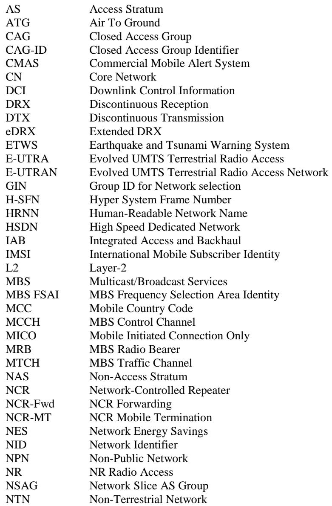

PEI Paging Early Indication   
PEI-O Paging Early Indication-Occasion   
PH Paging Hyperframe   
PLMN Public Land Mobile Network   
PTW Paging Time Window   
RAT Radio Access Technology   
RNA RAN-based Notification Area   
RNAU RAN-based Notification Area Update   
RRC Radio Resource Control   
SDT Small Data Transmission   
SL Sidelink   
SNPN Stand-alone Non-Public Network   
TN Terrestrial Network   
TRS Tracking Reference Signal   
U2N UE-to-Network   
U2U UE-to-UE   
UAC Unified Access Control   
UE User Equipment   
UMTS Universal Mobile Telecommunications System   
VSAT Very Small Aperture Terminal   
V2X Vehicle to Everything

## 4 General description of RRC\_IDLE state and RRC\_INACTIVE state

## 4.1 Overview

The RRC\_IDLE state and RRC\_INACTIVE state tasks can be subdivided into three processes:

\- PLMN selection (for UE not operating in SNPN access mode) or SNPN selection (for UE operating in SNPN access mode);

Cell selection and reselection;

\- Location registration and RNA update.

PLMN selection, SNPN selection, cell reselection procedures, and location registration are common for both RRC\_IDLE state and RRC\_INACTIVE state. RNA update is only applicable for RRC\_INACTIVE state. When UE selects a new PLMN or SNPN, UE transitions from RRC\_INACTIVE to RRC\_IDLE, as specified in TS 24.501 [14].

When a UE is switched on, a public land mobile network (PLMN) or a SNPN is selected by NAS. For the selected PLMN/SNPN, associated RAT(s) may be set, as specified in TS 23.122 [9]. The NAS shall provide a list of equivalent PLMNs or a list of equivalent SNPNs, if available, that the AS shall use for cell selection and cell reselection.

With cell selection, the UE searches for a suitable cell of the selected PLMN or selected SNPN, chooses that cell to provide available services, and monitors its control channel. This procedure is defined as "camping on the cell".

The UE shall, if necessary, then register its presence, by means of a NAS registration procedure, in the tracking area of the chosen cell. As an outcome of a successful Location Registration, the selected PLMN/SNPN then becomes the registered PLMN/SNPN, as specified in TS 23.122 [9].

If the UE finds a more suitable cell, according to the cell reselection criteria, it reselects onto that cell and camps on it. If the new cell does not belong to at least one tracking area to which the UE is registered, location registration is performed. In RRC\_INACTIVE state, if the new cell does not belong to the configured RNA, an RNA update procedure is performed.

If necessary, the UE shall search for higher priority PLMNs at regular time intervals as described in TS 23.122 [9] and search for a suitable cell if another PLMN has been selected by NAS.

For UE not operating in SNPN access mode, search of available CAGs may be triggered by NAS to support manual CAG selection. The AS shall report available CAG-ID(s) together with their HRNN (if broadcast) and PLMN(s) to the NAS.

NAS may also provide the network slice(s) and Network Slice AS Group (NSAG) information, which contains NSAG(s), their applicable TA(s) if present and their priorities, to be considered by the UE during cell reselection (as specified in TS 23.501 [10], TS 24.501 [14]).

If the UE loses coverage of the registered PLMN/SNPN, either a new PLMN/SNPN is selected automatically (automatic mode), or an indication of available PLMNs/SNPNs is given to the user so that a manual selection can be performed (manual mode). As part of manual SNPN selection, the AS shall report available SNPN identifiers together with their HRNN (if broadcast) to the NAS.

Registration is not performed by UEs only capable of services that need no registration.

The UE may perform NR sidelink communication and/or V2X sidelink communication while in-coverage or out-ofcoverage for sidelink, as specified in clause 8.

The U2N Remote UE, the U2N Relay UE, the U2U Remote UE, or the U2U Relay UE may perform sidelink discovery transmissions while in-coverage for the purposes of sidelink relay operations, as specified in clause 8. In addition, the U2N Remote UE, the U2U Remote UE, or the U2U Relay UE can also perform sidelink discovery transmissions while out-of-coverage for the purposes of sidelink relay operations.

An L2 U2N Remote UE in RRC\_IDLE or in RRC\_INACTIVE may perform all the relevant procedures (e.g., acquiring system information and paging message) via the L2 U2N Relay UE. An L2 U2N Remote UE may choose not to perform any procedures related to cell selection and reselection.

The UE may perform NR sidelink discovery transmissions while in-coverage or out-of-coverage for the purpose of sidelink non-relay operations, as specified in clause 8.

The UE may perform ranging/sidelink positioning while in-coverage or out-of-coverage, as specified in clause 8.

The purpose of camping on a cell in RRC\_IDLE state and RRC\_INACTIVE state is as follows:

a) It enables the UE to receive system information from the PLMN or the SNPN.

b) When registered and if the UE wishes to establish an RRC connection or resume a suspended RRC connection, it can do this by initially accessing the network on the control channel of the cell on which it is camped.

c) If the network needs to send a message or deliver data to the registered UE, it knows (in most cases) the set of tracking areas (in RRC\_IDLE state) or RNA (in RRC\_INACTIVE state) in which the UE is camped. It can then send a "paging" message for the UE on the control channels of all the cells in the corresponding set of areas. The UE will then receive the paging message and can respond.

d) It enables the UE to receive ETWS and CMAS notifications.

e) It enables the UE to receive MBS broadcast services.

f) It enables the UE to receive MBS multicast services in RRC\_INACTIVE state.

When the UE is in RRC\_IDLE state, upper layers may deactivate AS layer when MICO mode is activated as specified in TS 24.501 [14]. When MICO mode is activated, the AS configuration (e.g. priorities provided by dedicated signalling) is kept and all running timers continue to run but the UE need not perform any idle mode tasks. If a timer expires while MICO mode is activated it is up to the UE implementation whether it performs the corresponding action immediately or the latest when MICO mode is deactivated. When MICO mode is deactivated, the UE shall perform all idle mode tasks.

## 4.2 Functional division between AS and NAS in RRC\_IDLE state and RRC\_INACTIVE state

Table 4.2-1 presents the functional division between UE non-access stratum (NAS) and UE access stratum (AS) in RRC\_IDLE state and RRC\_INACTIVE states. The NAS part is specified in TS 23.122 [9] and the AS part in the present document.

Table 4.2-1: Functional division between AS and NAS in RRC\_IDLE state and RRC\_INACTIVE state

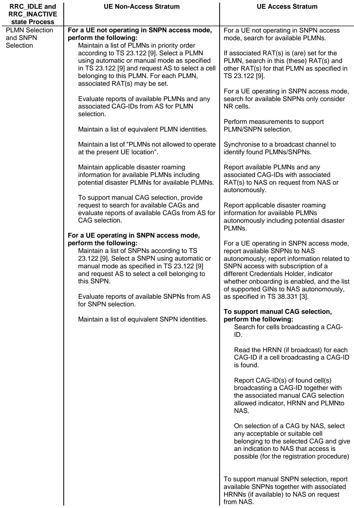

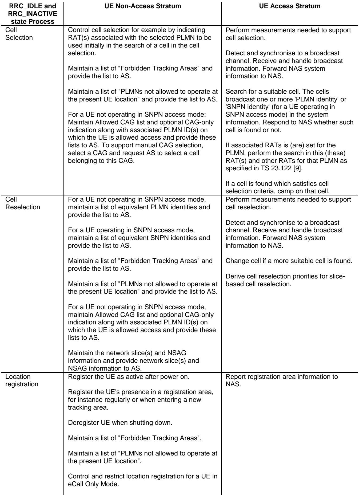

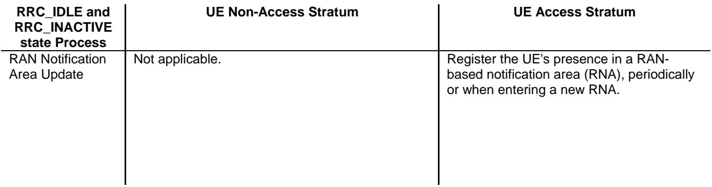

## 4.3 Service types in RRC\_IDLE state

This clause defines the level of service that may be provided by the network to a UE in RRC\_IDLE state. The following three levels of services are provided while a UE is in RRC\_IDLE state:

\- Limited service (emergency calls, ETWS and CMAS on an acceptable cell);

\- Normal service (for public use or non-public use on a suitable cell);

Operator service (for operators only on a reserved cell).

## 4.4 Service types in RRC\_INACTIVE state

This clause defines the level of service that may be provided by the network to a UE in RRC\_INACTIVE state. The following two levels of services are provided while a UE is in RRC\_INACTIVE state:

\- Normal service (for public use or non-public use on a suitable cell);

Operator service (for operators only on a reserved cell).

## 4.5 Cell Categories

The cells are categorised according to which services they offer:

## acceptable cell:

An "acceptable cell" is a cell on which the UE may camp to obtain limited service (originate emergency calls and receive ETWS and CMAS notifications). Such a cell shall fulfil the following requirements, which is the minimum set of requirements to initiate an emergency call and to receive ETWS and CMAS notification in an NR network:

The cell is not barred, see clause 5.3.1;

\- The cell selection criteria are fulfilled, see clause 5.2.3.2.

## suitable cell:

For UE not operating in SNPN Access Mode, a cell is considered as suitable if the following conditions are fulfilled:

The cell is part of either the selected PLMN or the registered PLMN or PLMN of the Equivalent PLMN list, and for that PLMN either:

The PLMN-ID of that PLMN is broadcast by the cell with no associated CAG-IDs and CAG-only indication in the UE for that PLMN (TS 23.501 [10]) is absent or false;

\- Allowed CAG list in the UE for that PLMN (TS 23.501 [10]) includes a CAG-ID broadcast by the cell for that PLMN;

\- The cell selection criteria are fulfilled, see clause 5.2.3.2.

According to the latest information provided by NAS:

The cell is not barred, see clause 5.3.1;

The cell is part of at least one TA that is not part of the list of "Forbidden Tracking Areas for Roaming" (TS 22.011 [18]), which belongs to a PLMN that fulfils the first bullet above.

For UE operating in SNPN Access Mode, a cell is considered as suitable if the following conditions are fulfilled:

\- The cell is part of the selected SNPN or the registered SNPN or SNPN of the Equivalent SNPN list of the UE;

\- The cell selection criteria are fulfilled, see clause 5.2.3.2;

According to the latest information provided by NAS:

The cell is not barred, see clause 5.3.1;

The cell is part of at least one TA that is not part of the list of "Forbidden Tracking Areas for Roaming" which belongs to the selected SNPN or the registered SNPN or SNPN of the Equivalent SNPN list of the UE.

## barred cell:

A cell is barred if it is so indicated in the system information, as specified in TS 38.331 [3].

## reserved cell:

A cell is reserved if it is so indicated in system information, as specified in TS 38.331 [3].

Following exception to these definitions are applicable for UEs:

if a UE has an ongoing emergency call, all acceptable cells of that PLMN/SNPN are treated as suitable for the duration of the emergency call.

camped on a cell that belongs to a tracking area that is forbidden for regional provision of service; a cell that belongs to a tracking area that is forbidden for regional provision service (TS 23.122 [9], TS 24.501 [14]) is suitable but provides only limited service.

if the UE in RRC\_IDLE fulfils the conditions to support NR sidelink communication/discovery or V2X sidelink communication in limited service state as specified in TS23.287 [16] clause 5.7, the UE may perform NR sidelink communication/discovery or V2X sidelink communication.

NOTE: UE is not required to support manual search and selection of PLMN or CAG or SNPN while in RRC CONNECTED state. The UE may use local release of RRC connection to perform manual search if it is not possible to perform the search while RRC connected.

## 5 Process and procedure descriptions

## 5.1 PLMN selection and SNPN selection

In the UE not operating in SNPN access mode, the AS shall report available PLMNs and any associated CAG-IDs to the NAS on request from the NAS or autonomously. In the UE operating in SNPN access mode, the AS shall report available SNPNs to the NAS on request from the NAS or autonomously.

During PLMN selection, based on the list of PLMN identities in priority order, the particular PLMN may be selected either automatically or manually. Each PLMN in the list of PLMN identities is identified by a 'PLMN identity'. In the system information on the broadcast channel, the UE can receive one or multiple 'PLMN identity' in a given cell. The result of the PLMN selection performed by NAS (see TS 23.122 [9]) is an identifier of the selected PLMN.

During SNPN selection, based on the list of SNPN identities, the particular SNPN may be selected either automatically or manually. Each SNPN in the list of SNPN identities is identified by a 'SNPN identity'. In the system information on the broadcast channel, the UE can receive one or multiple 'SNPN identity' in a given cell and optionally may receive associated HRNNs; the UE may also optionally receive indicators for whether an SNPN allows access using credentials from a Credentials Holder, whether an SNPN allows registration attempts from UEs that are not explicitly configured to select this SNPN, and whether an SNPN allows onboarding; the UE may also optionally receive a list of supported

Group IDs for Network selection (see TS 38.331 [3]). The result of the SNPN selection performed by NAS (see TS 23.122 [9]) is an identifier of the selected SNPN.

## 5.1.1 Support for PLMN selection

## 5.1.1.1 General

On request of the NAS, the AS shall perform a search for available PLMNs and report them to NAS.

## 5.1.1.2 NR case

The UE shall scan all RF channels in the NR bands according to its capabilities to find available PLMNs and available CAGs. On each carrier, the UE shall search for the strongest cell and read its system information, in order to find out which PLMN(s) the cell belongs to and any associated CAG(s). For operation with shared spectrum channel access, the UE may also read the system information of multiple strongest cell(s). If the UE can read one or several PLMN identities in the strongest cell or the multiple strongest cell(s) in case of operation with shared spectrum channel access, each found PLMN (see the PLMN reading in TS 38.331 [3]) shall be reported to the NAS as a high quality PLMN (but without the RSRP value) and any associated CAG-ID, provided that the following high-quality criterion is fulfilled:

1. For an NR cell, the measured RSRP value shall be greater than or equal to -110 dBm.

Found PLMNs that do not satisfy the high-quality criterion but for which the UE has been able to read the PLMN identities are reported to the NAS together with their corresponding RSRP values and any associated CAG-ID. The quality measure reported by the UE to NAS shall be the same for each PLMN found in one cell.

The search for PLMNs may be stopped on request from the NAS. The UE may optimise PLMN search by using stored information e.g. frequencies and optionally also information on cell parameters from previously received measurement control information elements.

Once the UE has selected a PLMN, the cell selection procedure shall be performed in order to select a suitable cell of that PLMN to camp on.

To support manual CAG selection, the UE shall upon request by NAS report available CAG-ID(s) together with their manual CAG selection allowed indicator (if broadcast), HRNN (if broadcast) and PLMN(s) to the NAS. If NAS has selected a CAG and provided this selection to AS, the UE shall search for an acceptable or suitable cell belonging to the selected CAG to camp on.

## 5.1.1.3 E-UTRA case

Support for PLMN selection in E-UTRA is described in TS 36.304 [7].

## 5.1.2 Support for SNPN selection

## 5.1.2.1 General

On request of the NAS, the AS shall perform a search for available SNPNs on only NR cells and report them to NAS.

## 5.1.2.2 NR case

The UE shall scan all RF channels in the NR bands according to its capabilities to find available SNPNs. On each carrier, the UE shall search for the strongest cell and read its system information, in order to find out which SNPN(s) the cell belongs to. For operation with shared spectrum channel access, the UE may also read the system information of multiple strongest cell(s). If the UE can read one or several SNPN identities in the strongest cell, each found SNPN (see the SNPN reading in TS 38.331 [3]) shall be reported to the NAS. For manual selection, UE shall upon request by NAS report available SNPN identifiers together with their HRNN (if broadcast) to the NAS and the search for available SNPNs may be stopped on request of the NAS.

The search for SNPNs may be stopped on request from the NAS. The UE may optimise SNPN search by using stored information e.g. frequencies and optionally also information on cell parameters from previously received measurement control information elements.

Once the UE has selected a SNPN, the cell selection procedure shall be performed in order to select a suitable cell of that SNPN to camp on.

## 5.2 Cell selection and reselection

## 5.2.1 Introduction

UE shall perform measurements for cell selection and reselection purposes as specified in TS 38.133 [8].

When evaluating Srxlev and Squal of non-serving cells for reselection evaluation purposes, the UE shall use parameters provided by the serving cell and for the final check on cell selection criterion, the UE shall use parameters provided by the target cell for cell reselection.

The NAS can control the RAT(s) in which the cell selection should be performed, for instance by indicating RAT(s) associated with the selected PLMN, and by maintaining a list of forbidden registration area(s) and a list of equivalent PLMNs. The UE shall select a suitable cell based on RRC\_IDLE or RRC\_INACTIVE state measurements and cell selection criteria.

In order to expedite the cell selection process, stored information for several RATs, if available, may be used by the UE.

When camped on a cell, the UE shall regularly search for a better cell according to the cell reselection criteria. If a better cell is found, that cell is selected. The change of cell may imply a change of RAT. Details on performance requirements for cell reselection can be found in TS 38.133 [8].

For NCRs, if the NCR-MT in RRC\_INACTIVE (re)selects a cell other than the last serving cell on which side control configuration was received, then the NCR-MT shall indicate to NCR-Fwd to cease forwarding. If the NCR-MT in RRC\_INACTIVE detects no suitable cell, then the NCR-MT shall indicate to NCR-Fwd to cease forwarding.

The NAS is informed if the cell selection and reselection result in changes in the received system information relevant for NAS.

For normal service, the UE shall camp on a suitable cell, monitor control channel(s) of that cell so that the UE can:

\- receive system information from the PLMN or SNPN; and

\- receive registration area information from the PLMN or SNPN, e.g., tracking area information; and

receive other AS and NAS Information; and

\- if registered:

\- receive paging and notification messages from the PLMN or SNPN; and

initiate transfer to Connected mode.

For cell selection in multi-beam operations, measurement quantity of a cell is up to UE implementation.

For cell reselection in multi-beam operations, including inter-RAT reselection from E-UTRA to NR, the measurement quantity of this cell is derived amongst the beams corresponding to the same cell based on SS/PBCH block as follows:

\- if nrofSS-BlocksToAverage (maxRS-IndexCellQual in E-UTRA) is not configured in SIB2/SIB4 (SIB24 in E-UTRA); or

\- if absThreshSS-BlocksConsolidation (threshRS-Index in E-UTRA) is not configured in SIB2/SIB4 (SIB24 in E-UTRA); or

\- if the highest beam measurement quantity value is below or equal to absThreshSS-BlocksConsolidation (threshRS-Index in E-UTRA):

derive a cell measurement quantity as the highest beam measurement quantity value, where each beam measurement quantity is described in TS 38.215 [11].

else:

derive a cell measurement quantity as the linear average of the power values of up to nrofSS-BlocksToAverage (maxRS-IndexCellQual in E-UTRA) of highest beam measurement quantity values above absThreshSS-BlocksConsolidation (threshRS-Index in E-UTRA).

NOTE: If both suitable cell(s) and suitable L2 U2N Relay UE(s) (as specified in TS 38.331 [3]) are available, it is up to L2 U2N Remote UE's implementation to select either a suitable cell or a suitable L2 U2N Relay UE.

## 5.2.2 States and state transitions in RRC\_IDLE state and RRC\_INACTIVE state

Figure 5.2.2-1 shows the states and state transitions and procedures in RRC\_IDLE and RRC\_INACTIVE. Whenever a new PLMN selection or new SNPN selection is performed, it causes an exit to number 1.

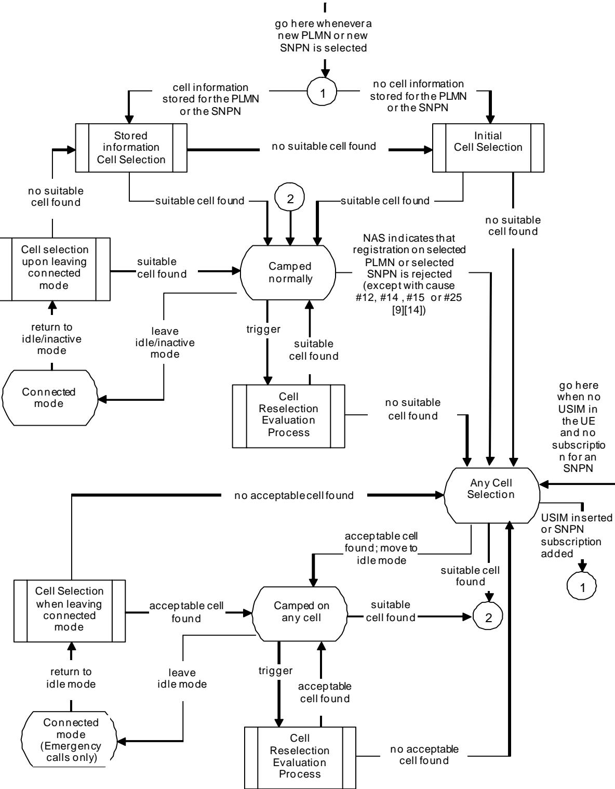  
Figure 5.2.2-1: RRC\_IDLE and RRC\_INACTIVE Cell Selection and Reselection

## 5.2.3 Cell Selection process

## 5.2.3.1 Description

Cell selection is performed by one of the following two procedures:

a) Initial cell selection (no prior knowledge of which RF channels are NR frequencies):

1. The UE shall scan all RF channels in the NR bands according to its capabilities to find a suitable cell.

2. On each frequency, the UE need only search for the strongest cell, except for operation with shared spectrum channel access where the UE may search for the next strongest cell(s).

3. Once a suitable cell is found, this cell shall be selected.

b) Cell selection by leveraging stored information:

1. This procedure requires stored information of frequencies and optionally also information on cell parameters from previously received measurement control information elements or from previously detected cells.

2. Once the UE has found a suitable cell, the UE shall select it.

3. If no suitable cell is found, the initial cell selection procedure in a) shall be started.

NOTE: Priorities between different frequencies or RATs provided to the UE by system information or dedicated signalling are not used in the cell selection process.

## 5.2.3.2 Cell Selection Criterion

The cell selection criterion S is fulfilled when:

Srxlev > 0 AND Squal > 0

where:

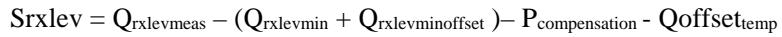

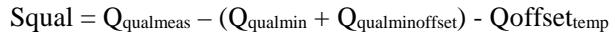

where:

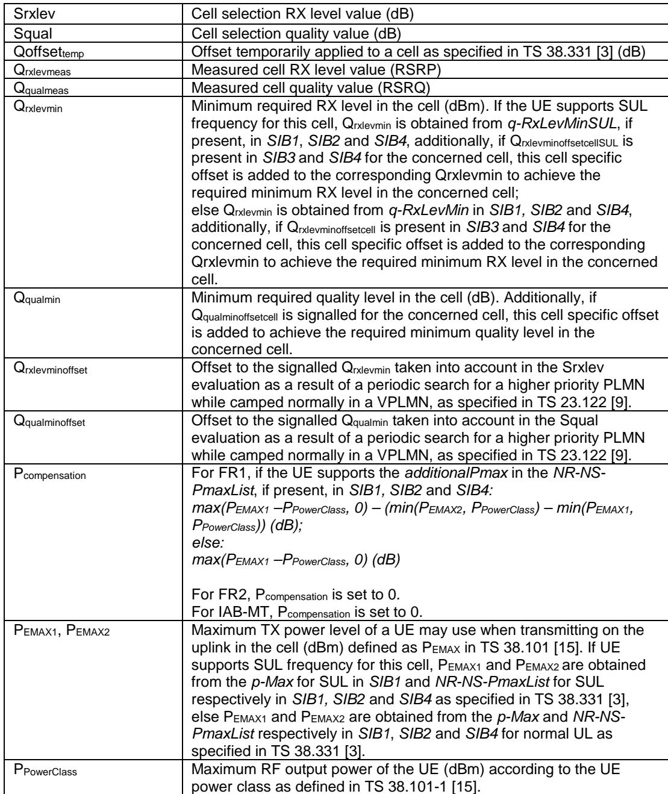

The signalled values Qrxlevminoffset and Qqualminoffset are only applied when a cell is evaluated for cell selection as a result of a periodic search for a higher priority PLMN while camped normally in a VPLMN (TS 23.122 [9]). During this periodic search for higher priority PLMN, the UE may check the S criteria of a cell using parameter values stored from a different cell of this higher priority PLMN.

## 5.2.3.3 E-UTRAN case in Cell Selection

The cell selection criteria and procedures in E-UTRAN are specified in TS 36.304 [7].

## 5.2.4 Cell Reselection evaluation process

## 5.2.4.1 Reselection priorities handling

Absolute priorities of different NR frequencies or inter-RAT frequencies may be provided to the UE in the system information, in the RRCRelease message, or by inheriting from another RAT at inter-RAT cell (re)selection. In the case of system information, an NR frequency or inter-RAT frequency may be listed without providing a priority (i.e. the field cellReselectionPriority is absent for that frequency). If any fields with cellReselectionPriority or nsag-

CellReselectionPriority are provided in dedicated signalling, the UE shall ignore any fields with cellReselectionPriority and nsag-CellReselectionPriority provided in system information.

When UE is in camped normally state, if it supports slice-based cell reselection and has received the network slice(s) and NSAG information from NAS to be used for cell reselection, UE shall derive reselection priorities according to clause 5.2.4.11.

NOTE 00: UE derives reselection priorities according to clause 5.2.4.11 also in case SIB16 (see TS 38.331 [3]) is not broadcast in the camped cell.

If UE is in camped on any cell state, UE shall only apply the priorities provided by system information from current cell, and the UE preserves priorities provided by dedicated signalling and deprioritisationReq received in RRCRelease unless specified otherwise. When the UE in camped normally state, has only dedicated priorities other than for the current frequency, the UE shall consider the current frequency to be the lowest priority frequency (i.e. lower than any of the network configured values). When the HSDN capable UE is in High-mobility state, the UE shall always consider the HSDN cells to be the highest priority (i.e., higher than any other network configured priorities). When the HSDN capable UE is not in High-mobility state, the UE shall always consider HSDN cells to be the lowest priority (i.e., lower than any other network configured priorities). If the UE is configured to perform both NR sidelink communication and V2X sidelink communication, the UE may consider the frequency providing both NR sidelink communication configuration and V2X sidelink communication configuration to be the highest priority. If the UE is configured to perform NR sidelink communication and not perform V2X communication, the UE may consider the frequency providing NR sidelink communication configuration to be the highest priority. If the UE is configured to perform V2X sidelink communication and not perform NR sidelink communication, the UE may consider the frequency providing V2X sidelink communication configuration to be the highest priority. If the UE is configured to perform ranging/sidelink positioning, the UE may consider the frequency providing ranging/sidelink positioning configuration to be the highest priority.

A UE on a vehicle with a mobile-IAB cell may consider the frequency for which a mobile-IAB cell is the best cell to be the highest priority. The UE identifies a mobile-IAB cell by mobileIAB-Cell in SIB1 (see TS 38.331 [3]). The UE may narrow its search scope for mobile-IAB cell(s) by mobileIAB-InfoList-r18 if broadcasted in SIB4 (see TS 38.331 [3]). A non-mobile-IAB cell may be excluded from this mobile IAB frequency prioritization for up to 300 seconds.

NOTE 0a: The frequency only providing the anchor frequency configuration should not be prioritized for V2X service during cell reselection, as specified in TS 38.331[3].

NOTE 0b: When UE is configured to perform NR sidelink communication or V2X sidelink communication performs cell reselection, it may consider the frequencies providing the intra-carrier and inter-carrier configuration have equal priority in cell reselection.

NOTE 0c: The prioritization among the frequencies which UE considers to be the highest priority frequency is left to UE implementation unless otherwise stated.

NOTE 0d: The UE is configured to perform V2X sidelink communication or NR sidelink communication, if it has the capability and is authorized for the corresponding sidelink operation.

NOTE 0e: When UE is configured to perform both NR sidelink communication and V2X sidelink communication, but cannot find a frequency which can provide both NR sidelink communication configuration and V2X sidelink communication configuration, UE may consider the frequency providing either NR sidelink communication configuration or V2X sidelink communication configuration to be the highest priority.

NOTE 0f: Void.

NOTE 0g: How the UE determines itself to be on a vehicle with a mobile-IAB cell is left to the UE's implementation.

The UE shall only perform cell reselection evaluation for NR frequencies and inter-RAT frequencies that are given in system information and for which the UE has a priority provided.

If the MBS broadcast capable UE is receiving or interested to receive an MBS broadcast service(s) and can only receive this MBS broadcast service(s) by camping on a frequency on which it is provided, the UE may consider that frequency to be the highest priority during the MBS broadcast session as specified in TS 38.300 [2] as long as the two following conditions are fulfilled:

1) SIB1 scheduling information of the cell reselected by the UE due to frequency prioritization for MBS contains SIB20;

## 2) Either:

One or more MBS FSAI(s) of that frequency is indicated in SIB21 of the serving cell and the same MBS FSAI(s) is also indicated for this MBS broadcast service in MBS User Service Description (USD) as specified in TS 26.346 [20], or

SIB21 is not provided in the serving cell and that frequency is included in the USD of this service, or

SIB21 is provided in the serving cell but does not provide the frequency mapping for the concerned service, and that frequency is included in the USD of this service.

NOTE 0g: It is up to UE implementation which frequency to select, when the USD provides multiple frequencies for the service the UE is interested in.

If the MBS broadcast capable UE is receiving or interested to receive an MBS broadcast service, the UE may consider cell reselection candidate frequencies at which it cannot receive the MBS broadcast service to be of the lowest priority during the MBS broadcast session as specified in TS 38.300 [2], as long as SIB1 scheduling information of the cell contains SIB20 on the MBS frequency which the UE monitors and as long as the condition 2) above is fulfilled for the serving cell.

NOTE 0h: Example scenarios in which such down-prioritisation may be needed include the cases where camping is not possible for the UE on the MBS broadcast frequency (e.g. the MBS broadcast frequency belongs to a PLMN different from UE's registered PLMN) while the UE can receive the MBS broadcast service when camped on another frequency than the MBS broadcast frequency or current frequency.

## NOTE 0i: The frequency prioritization for MBS broadcast, NR sidelink communication, or V2X sidelink communication may override the re-selection priorities for slice-based cell reselection.

In case UE receives RRCRelease with deprioritisationReq, UE shall consider current frequency and stored frequencies due to the previously received RRCRelease with deprioritisationReq or all the frequencies of NR to be the lowest priority frequency (i.e. lower than any of the network configured values) while T325 is running irrespective of camped RAT. The UE shall delete the stored deprioritisation request(s) when a PLMN selection or SNPN selection is performed on request by NAS (TS 23.122 [9]).

NOTE 1: UE should search for a higher priority layer for cell reselection as soon as possible after the change of priority. The minimum related performance requirements specified in TS 38.133 [8] are still applicable.

NOTE 1a: The UE does not consider MBS broadcast, NR sidelink communication or V2X sidelink communication functionality to replace cell reselection priorities caused by HSDN or deprioritisationReq functionality.

The UE shall delete priorities provided by dedicated signalling when:

\- the UE enters a different RRC state; or

\- the optional validity time of dedicated priorities (T320) expires; or

\- the UE receives an RRCRelease message with the field cellReselectionPriorities absent; or

\- a PLMN selection or SNPN selection is performed on request by NAS (TS 23.122 [9]).

NOTE 2: Equal priorities between RATs are not supported.

The UE shall not consider any exclude-listed cells as candidate for cell reselection.

The UE shall consider only the allow-listed cells, if configured, as candidates for cell reselection.

NCR-MT may be configured with additional allowed cell list and/or forbidden cell list, see TS 38.300 [2]. The NCR-MT shall consider only the allowed cell list, if configured by OAM as candidates for cell reselection (ignore above exclude-listed cells and/or allow-listed cells). The NCR-MT shall not consider the cells for cell reselection in the forbidden cell list, if configured by OAM.

The UE in RRC\_IDLE state shall inherit the priorities provided by dedicated signalling and the remaining validity time (i.e. T320 in NR and E-UTRA), if configured, at inter-RAT cell (re)selection.

NOTE 3: The network may assign dedicated cell reselection priorities for frequencies not configured by system information.

## 5.2.4.2 Measurement rules for cell re-selection

Following rules are used by the UE to limit needed measurements:

\- If the serving cell fulfils Srxlev > SIntraSearchP and Squal > SIntraSearchQ:

If distanceThresh and referenceLocation are broadcasted in SIB19, and if UE supports location-based measurement initiation for NTN quasi-Earth-fixed system and has obtained its location information:

If the distance between UE and the serving cell reference location referenceLocation is shorter than distanceThresh, the UE may not perform intra-frequency measurements;

\- Else, the UE shall perform intra-frequency measurements;

else if distanceThresh and movingReferenceLocation are broadcasted in SIB19, and if UE supports locationbased measurement initiation for NTN Earth-moving system and has obtained its location information:

if the distance between UE's location and the serving cell reference location determined based on movingReferenceLocation is shorter than distanceThresh, the UE may not perform intra-frequency measurements;

\- else, the UE shall perform intra-frequency measurements;

\- Else, the UE may not perform intra-frequency measurements;

\- Else, the UE shall perform intra-frequency measurements.

The UE shall apply the following rules for NR inter-frequencies and inter-RAT frequencies which are indicated in system information and for which the UE has priority provided as defined in 5.2.4.1:

For a NR inter-frequency or inter-RAT frequency with a reselection priority higher than the reselection priority of the current NR frequency, the UE shall perform measurements of higher priority NR interfrequency or inter-RAT frequencies according to TS 38.133 [8].

For a NR inter-frequency with an equal or lower reselection priority than the reselection priority of the current NR frequency and for inter-RAT frequency with lower reselection priority than the reselection priority of the current NR frequency:

\- If the serving cell fulfils Srxlev > SnonIntraSearchP and Squal > SnonIntraSearchQ:

If distanceThresh and referenceLocation are broadcasted in SIB19, and if UE supports location-based measurement initiation for NTN quasi-Earth-fixed system and has obtained its UE location information:

If the distance between UE and the serving cell reference location referenceLocation is shorter than distanceThresh, the UE may choose not to perform measurements of NR inter-frequency cells of equal or lower priority, or inter-RAT frequency cells of lower priority;

Else, the UE shall perform measurements of NR inter-frequency cells of equal or lower priority, or inter-RAT frequency cells of lower priority according to TS 38.133 [8];

else if distanceThresh and movingReferenceLocation are broadcasted in SIB19, and if UE supports location-based measurement initiation for NTN Earth-moving system and has obtained its location information:

if the distance between UE's location and the serving cell reference location determined based on movingReferenceLocation is shorter than distanceThresh, the UE may not perform measurements of NR inter-frequency cells of equal or lower priority, or inter-RAT frequency cells of lower priority;

else, the UE shall perform measurements of NR inter-frequency cells of equal or lower priority, or inter-RAT frequency cells of lower priority according to TS 38.133 [8];

Else, the UE may choose not to perform measurements of NR inter-frequency cells of equal or lower priority, or inter-RAT frequency cells of lower priority;

Else, the UE shall perform measurements of NR inter-frequency cells of equal or lower priority, or inter-RAT frequency cells of lower priority according to TS 38.133 [8].

\- If the UE supports relaxed measurement and relaxedMeasurement is present in SIB2, the UE may further relax the needed measurements, as specified in clause 5.2.4.9.

For UE camping on NTN cell, if the UE supports skipping TN measurement, and the UE has obtained its location information, and if coverageAreaInfoList and tn-AreaIdList are broadcast in system information, the UE may not perform measurements of a TN frequency when UE is not in the coverage of that frequency provided via tn-AreaIdList, regardless of the frequency priority.

If the t-Service of the serving cell is present in SIB19, and if UE supports time-based measurement initiation, the UE shall perform intra-frequency, inter-frequency or inter-RAT measurements before the t-Service, regardless of the distance between UE and the serving cell reference location or whether the serving cell fulfils Srxlev > SIntraSearchP and Squal > SIntraSearchQ, or Srxlev > SnonIntraSearchP and Squal > SnonIntraSearchQ, The exact time to start measurement before t-Service is up to UE implementation. UE shall perform measurements of higher priority NR inter-frequency or inter-RAT frequencies according to TS 38.133 [8] regardless of the remaining service time of the serving cell (i.e. time remaining until t-Service).

NOTE 1: When evaluating the distance between UE and the serving cell reference location, it's up to UE implementation to obtain UE location information.

NOTE 2: In the Earth-moving system, it's up to UE implementation to maintain a valid serving cell reference location, which is derived based on the serving satellite ephemeris, epochTime and movingReferenceLocation.

## 5.2.4.3 Mobility states of a UE

## 5.2.4.3.0 Introduction

The UE mobility state is determined if the parameters (TCRmax, NCR\_H, NCR\_M, TCRmaxHyst and cellEquivalentSize) are broadcasted in system information for the serving cell.

## State detection criteria:

Normal-mobility state criteria:

\- If number of cell reselections during time period TCRmax is less than NCR\_M.

Medium-mobility state criteria:

\- If number of cell reselections during time period TCRmax is greater than or equal to NCR\_M but less than or equal to NCR\_H.

High-mobility state criteria:

\- If number of cell reselections during time period TCRmax is greater than NCR\_H.

The UE shall not consider consecutive reselections where a cell is reselected again right after one reselection for mobility state detection criteria. If the UE is capable of HSDN and the cellEquivalentSize is configured, the UE counts the number of cell reselections for this cell as cellEquivalentSize configured for this cell.

## State transitions:

The UE shall:

\- if the criteria for High-mobility state is detected:

enter High-mobility state.

\- else if the criteria for Medium-mobility state is detected:

enter Medium-mobility state.

\- else if criteria for either Medium- or High-mobility state is not detected during time period TCRmaxHyst:

enter Normal-mobility state.

If the UE is in High- or Medium-mobility state, the UE shall apply the speed dependent scaling rules as defined in clause 5.2.4.3.1.

## 5.2.4.3.1 Scaling rules

UE shall apply the following scaling rules:

\- If neither Medium- nor High-mobility state is detected:

\- no scaling is applied.

\- If High-mobility state is detected:

\- Add the sf-High of "Speed dependent ScalingFactor for Qhyst" to Qhyst if broadcasted in system information;

For NR cells, multiply TreselectionNR by the sf-High of "Speed dependent ScalingFactor for TreselectionNR" if broadcasted in system information;

For EUTRA cells, multiply TreselectionEUTRA by the sf-High of "Speed dependent ScalingFactor for TreselectionEUTRA" if broadcasted in system information.

\- If Medium-mobility state is detected:

Add the sf-Medium of "Speed dependent ScalingFactor for Qhyst" to Qhyst if broadcasted in system information;

For NR cells, multiply TreselectionNR by the sf-Medium of "Speed dependent ScalingFactor for TreselectionNR" if broadcasted in system information;

For EUTRA cells, multiply TreselectionEUTRA by the sf-Medium of "Speed dependent ScalingFactor for TreselectionEUTRA" if broadcasted in system information.

In case scaling is applied to any TreselectionRAT parameter, the UE shall round up the result after all scalings to the nearest second.

## 5.2.4.4 Cells with cell reservations, access restrictions or unsuitable for normal camping

For the highest ranked cell (including serving cell) according to cell reselection criteria specified in clause 5.2.4.6, for the best cell according to absolute priority reselection criteria specified in clause 5.2.4.5, the UE shall check if the access is restricted according to the rules in clause 5.3.1.

If that cell and other cells have to be excluded from the candidate list, as stated in clause 5.3.1, the UE shall not consider these as candidates for cell reselection. This limitation shall be removed when the highest ranked cell changes.

If the highest ranked cell or best cell according to absolute priority reselection rules is an intra-frequency or interfrequency cell which is not suitable due to one or more of the following reasons:

\- this cell belongs to a PLMN which is not indicated as being equivalent to the registered PLMN, or

this cell is a CAG cell that belongs to a PLMN which is equivalent to the registered PLMN but with no CAG-ID that is present in the UE's allowed CAG list being broadcasted, or

\- this cell is not a CAG cell and the CAG-only indication in the UE is set, or

this cell does not belong to a SNPN that is equal to or indicated as being equivalent to the registered or selected SNPN of the UE in SNPN access mode,

the UE shall not consider this cell and, for operation in licensed spectrum, other cells on the same frequency as candidates for reselection for a maximum of 300 seconds.

For operation with shared spectrum channel access, when the highest ranked cell or best cell is not a candidate for reselection per the previous paragraph, the UE should continue to consider other cells on the same frequency for cell reselection, however if the second highest ranked cell on this frequency is also not suitable due to one or more of the above reasons, the UE may consider this frequency to be the lowest priority for a maximum of 300 seconds.

If the highest ranked cell or best cell according to absolute priority reselection rules is an intra-frequency or interfrequency cell which is not suitable due to being part of the "list of 5GS forbidden TAs for roaming", the UE shall not consider this cell and other cells on the same frequency as candidates for reselection for a maximum of 300 seconds.

If the highest ranked cell or best cell according to absolute priority reselection rules is an inter-RAT cell which is not suitable due to being part of the "list of forbidden TAs for roaming" or belonging to a PLMN which is not indicated as being equivalent to the registered PLMN, the UE shall not consider this cell and other cells on the same frequency, as candidates for reselection for a maximum of 300 seconds.

If the UE enters into state any cell selection, any limitation shall be removed. If the UE is redirected under NR control to a frequency for which the timer is running, the limitation(s) on that frequency shall be removed.

## 5.2.4.5 NR Inter-frequency and inter-RAT Cell Reselection criteria

If threshServingLowQ is broadcast in system information and more than 1 second has elapsed since the UE camped on the current serving cell, cell reselection to a cell on a higher priority NR frequency or inter-RAT frequency than the serving frequency shall be performed if:

\- A cell of a higher priority NR or EUTRAN RAT/frequency fulfils Squal > ThreshX, HighQ during a time interval TreselectionRAT

Otherwise, cell reselection to a cell on a higher priority NR frequency or inter-RAT frequency than the serving frequency shall be performed if:

\- A cell of a higher priority RAT/ frequency fulfils Srxlev > ThreshX, HighP during a time interval TreselectionRAT; and

More than 1 second has elapsed since the UE camped on the current serving cell.

Cell reselection to a cell on an equal priority NR frequency shall be based on ranking for intra-frequency cell reselection as defined in clause 5.2.4.6.

If threshServingLowQ is broadcast in system information and more than 1 second has elapsed since the UE camped on the current serving cell, cell reselection to a cell on a lower priority NR frequency or inter-RAT frequency than the serving frequency shall be performed if:

The serving cell fulfils Squal < ThreshServing, LowQ and a cell of a lower priority NR or E-UTRAN RAT/ frequency fulfils Squal > ThreshX, LowQ during a time interval TreselectionRAT.

Otherwise, cell reselection to a cell on a lower priority NR frequency or inter-RAT frequency than the serving frequency shall be performed if:

The serving cell fulfils Srxlev < ThreshServing, LowP and a cell of a lower priority RAT/ frequency fulfils Srxlev > ThreshX, LowP during a time interval TreselectionRAT; and

\- More than 1 second has elapsed since the UE camped on the current serving cell.

Cell reselection to a higher priority RAT/frequency shall take precedence over a lower priority RAT/frequency if multiple cells of different priorities fulfil the cell reselection criteria.

If more than one cell meets the above criteria, the UE shall reselect a cell as follows:

If the highest-priority frequency is an NR frequency, the highest ranked cell among the cells on the highest priority frequency(ies) meeting the criteria according to clause 5.2.4.6;

If the highest-priority frequency is from another RAT, the strongest cell among the cells on the highest priority frequency(ies) meeting the criteria of that RAT.

## 5.2.4.6 Intra-frequency and equal priority inter-frequency Cell Reselection criteria

The cell-ranking criterion Rs for serving cell and Rn for neighbouring cells is defined by:

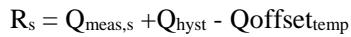

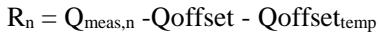

where:

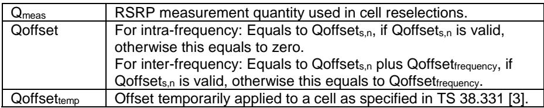

The UE shall perform ranking of all cells that fulfil the cell selection criterion S, which is defined in 5.2.3.2.

The cells shall be ranked according to the R criteria specified above by deriving Qmeas,n and Qmeas,s and calculating the R values using averaged RSRP results.

If rangeToBestCell is not configured, the UE shall perform cell reselection to the highest ranked cell. If this cell is found to be not-suitable, the UE shall behave according to clause 5.2.4.4.

If rangeToBestCell is configured, then the UE shall perform cell reselection to the cell with the highest number of beams above the threshold (i.e. absThreshSS-BlocksConsolidation) among the cells whose R value is within rangeToBestCell of the R value of the highest ranked cell. If there are multiple such cells, the UE shall perform cell reselection to the highest ranked cell among them. If this cell is found to be not-suitable, the UE shall behave according to clause 5.2.4.4.

In all cases, the UE shall reselect the new cell, only if the following conditions are met:

\- the new cell is better than the serving cell according to the cell reselection criteria specified above during a time interval TreselectionRAT;

more than 1 second has elapsed since the UE camped on the current serving cell.

NOTE: If rangeToBestCell is configured but absThreshSS-BlocksConsolidation is not configured on an NR frequency, the UE considers that there is one beam above the threshold for each cell on that frequency.

## 5.2.4.7 Cell reselection parameters in system information broadcasts

## 5.2.4.7.0 General reselection parameters

Cell reselection parameters are broadcast in system information and are read from the serving cell as follows:

## absThreshSS-BlocksConsolidation

This specifies the minimum threshold for beams which can be used for selection of the highest ranked cells, if rangeToBestCell is configured, and for beams used for derivation of cell measurement quantity. The parameter in SIB2 applies to the current serving frequency and the parameter in SIB4 applies to the corresponding inter-frequency.

## cellReselectionPriority

This specifies the absolute priority for NR frequency or E-UTRAN frequency.

## cellReselectionSubPriority

This specifies the fractional priority value added to cellReselectionPriority for NR frequency or E-UTRAN frequency.

## combineRelaxedMeasCondition

This indicates when the UE needs to fulfil both low mobility criterion and not-at-cell-edge criterion to determine whether to relax measurement requirements.

## combineRelaxedMeasCondition2

This indicates when an (e)RedCap UE needs to fulfil both stationary criterion and not-at-cell-edge criterion to determine whether to relax measurement requirements.

## coverageAreaInfoList

This indicates a list of TN coverage areas to assist skipping TN measurements for NTN UEs in RRC\_IDLE and RRC\_INACTIVE states.

## distanceThresh

This indicates the distance threshold from the serving cell reference location to be used in location-based measurement initiation.

## movingReferenceLocation

This indicates the reference location of the serving cell at a time reference, to be used in location-based measurement initiation for NTN Earth-moving system.

## nrofSS-BlocksToAverage

This specifies the number of beams which can be used for selection of the highest ranked cell, if rangeToBestCell is configured, and the number of beams used for derivation of cell measurement quantity. The parameter in SIB2 applies to the current serving frequency and the parameter in SIB4 applies to the corresponding inter-frequency.

## Qoffsets,n

This specifies the offset between the two cells.

## Qoffsetfrequency

Frequency specific offset for equal priority NR frequencies.

## Qhyst

This specifies the hysteresis value for ranking criteria.

## Qoffsettemp

This specifies the additional offset to be used for cell selection and re-selection. It is temporarily used in case the RRC Connection Establishment fails on the cell as specified in TS 38.331 [3].

## Qqualmin

This specifies the minimum required quality level in the cell in dB.

## Qrxlevmin

This specifies the minimum required Rx level in the cell in dBm.

## Qrxlevminoffsetcell

This specifies the cell specific Rx level offset in dB to Qrxlevmin.

## Qqualminoffsetcell

This specifies the cell specific quality level offset in dB to Qqualmin.

## rangeToBestCell

This specifies the R value range which the cells whose R value is within the range can be a candidate for the highest ranked cell. It is configured in SIB2 and used for intra-frequency and equal priority inter-frequency cell reselection and among the cells on the highest priority frequency(ies) for inter-frequency cell reselection within NR.

## referenceLocation

This indicates the reference location of the serving cell to be used in location-based measurement initiation for NTN (quasi-)Earth-fixed system.

## SIntraSearchP

This specifies the Srxlev threshold (in dB) for intra-frequency measurements.

## SIntraSearchQ

This specifies the Squal threshold (in dB) for intra-frequency measurements.

## SnonIntraSearchP

This specifies the Srxlev threshold (in dB) for NR inter-frequency and inter-RAT measurements.

## SnonIntraSearchQ

This specifies the Squal threshold (in dB) for NR inter-frequency and inter-RAT measurements.

## SSearchDeltaP

This specifies the threshold (in dB) on Srxlev variation for relaxed measurement.

## SSearchDeltaP-Stationary

This specifies the threshold (in dB) on Srxlev variation to evaluate stationary criterion for relaxed measurement.

## SSearchThresholdP

This specifies the Srxlev threshold (in dB) for relaxed measurement.

## SSearchThresholdP2

This specifies the Srxlev threshold (in dB) to evaluate not-at-cell-edge-criterion for relaxed measurement.

## SSearchThresholdQ

This specifies the Squal threshold (in dB) for relaxed measurement.

## SSearchThresholdQ2

This specifies the Squal threshold (in dB) to evaluate not-at-cell-edge-criterion for relaxed measurement.

## TreselectionRAT

This specifies the cell reselection timer value. For each target NR frequency and for each RAT other than NR, a specific value for the cell reselection timer is defined, which is applicable when evaluating reselection within NR or towards other RAT (i.e. TreselectionRAT for NR is TreselectionNR, for E-UTRAN TreselectionEUTRA).

NOTE: TreselectionRAT is not broadcast in system information but used in reselection rules by the UE for each RAT.

## TreselectionNR

This specifies the cell reselection timer value TreselectionRAT for NR. The parameter can be set per NR frequency as specified in TS 38.331 [3].

## TreselectionEUTRA

This specifies the cell reselection timer value TreselectionRAT for E-UTRAN.

## ThreshX, HighP

This specifies the Srxlev threshold (in dB) used by the UE when reselecting towards a higher priority RAT/ frequency than the current serving frequency. Each frequency of NR and E-UTRAN might have a specific threshold.

## ThreshX, HighQ

This specifies the Squal threshold (in dB) used by the UE when reselecting towards a higher priority RAT/ frequency than the current serving frequency. Each frequency of NR and E-UTRAN might have a specific threshold.

## ThreshX, LowP

This specifies the Srxlev threshold (in dB) used by the UE when reselecting towards a lower priority RAT/ frequency than the current serving frequency. Each frequency of NR and E-UTRAN might have a specific threshold.

## ThreshX, LowQ

This specifies the Squal threshold (in dB) used by the UE when reselecting towards a lower priority RAT/ frequency than the current serving frequency. Each frequency of NR and E-UTRAN might have a specific threshold.

## ThreshServing, LowP

This specifies the Srxlev threshold (in dB) used by the UE on the serving cell when reselecting towards a lower priority RAT/ frequency.

## ThreshServing, LowQ

This specifies the Squal threshold (in dB) used by the UE on the serving cell when reselecting towards a lower priority RAT/ frequency.

## TSearchDeltaP

This specifies the time period over which the Srxlev variation is evaluated for relaxed measurement.

## TSearchDeltaP-Stationary

This specifies the time period over which the Srxlev variation is evaluated for stationary criterion for relaxed measurement.

## t-Service

This indicates the time when an NTN cell is going to stop serving the area where it is currently covering, to be used in time-based measurement initiation.

## tn-AreaIdList

This indicates a list of TN area identities associated with each frequency to assist skipping TN measurements for NTN UEs in RRC\_IDLE and RRC\_INACTIVE states. Each TN area identity in the list identifies a TN coverage area.

## 5.2.4.7.1 Speed dependent reselection parameters

Speed dependent reselection parameters are broadcast in system information and are read from the serving cell as follows:

## TCRmax

This specifies the duration for evaluating allowed amount of cell reselection(s).

## NCR\_M

This specifies the maximum number of cell reselections to enter Medium-mobility state.

## NCR\_H

This specifies the maximum number of cell reselections to enter High-mobility state.

TCRmaxHyst

This specifies the additional time period before the UE can enter Normal-mobility state.

Speed dependent ScalingFactor for Qhyst

This specifies scaling factor for Qhyst in sf-High for High-mobility state and sf-Medium for Medium-mobility state.

Speed dependent ScalingFactor for TreselectionNR

This specifies scaling factor for TreselectionNR in sf-High for High-mobility state and sf-Medium for Medium-mobility state.

## Speed dependent ScalingFactor for TreselectionEUTRA

This specifies scaling factor for TreselectionEUTRA in sf-High for High-mobility state and sf-Medium for Mediummobility state.

## 5.2.4.7.2 Slice-based cell reselection parameters

Slice-based cell reselection parameters are broadcast in system information and are read from the serving cell as follows:

## nsag-CellReselectionPriority

This specifies the priority for NR frequency when the given NSAG ID is used to set the frequency priority.

## nsag-CellReselectionSubPriority

This specifies the fractional priority value added to nsag-CellReselectionPriority when the given NSAG ID is used to set the frequency priority.

## 5.2.4.8 Inter-RAT Cell reselection in RRC\_INACTIVE state

For UE in the RRC\_INACTIVE state, upon cell reselection to another RAT, UE transitions from RRC\_INACTIVE to RRC\_IDLE and performs actions as specified in TS 38.331 [3].

## 5.2.4.9 Relaxed measurement

## 5.2.4.9.0 Relaxed measurement rules

When the UE is required to perform measurements of intra-frequency cells or NR inter-frequency cells or inter-RAT frequency cells according to the measurement rules in clause 5.2.4.2:

\- if lowMobilityEvaluation is configured and cellEdgeEvaluation is not configured; and

\- if the UE has performed normal intra-frequency, NR inter-frequency, or inter-RAT frequency measurements for at least TSearchDeltaP after (re-)selecting a new cell; and

\- if the relaxed measurement criterion in clause 5.2.4.9.1 is fulfilled for a period of TSearchDeltaP:

the UE may choose to perform relaxed measurements for intra-frequency cells, NR inter-frequency cells or inter-RAT frequency cells according to relaxation methods in clauses 4.2.2.9, 4.2.2.10, 4.2.2.11, 4.2C.2.7 and 4.2C.2.8 in TS 38.133 [8];

\- if cellEdgeEvaluation is configured and lowMobilityEvaluation is not configured; and

\- if the relaxed measurement criterion in clause 5.2.4.9.2 is fulfilled:

\- the UE may choose to perform relaxed measurements for intra-frequency cells according to relaxation methods in clauses 4.2.2.9 and 4.2C.2.7 in TS 38.133 [8];

\- if the serving cell fulfils Srxlev  SnonIntraSearchP or Squal  SnonIntraSearchQ:

the UE may choose to perform relaxed measurements for NR inter-frequency cells or inter-RAT frequency cells according to relaxation methods in clauses 4.2.2.10, 4.2.2.11 and 4.2C.2.8 in TS 38.133 [8];

\- if both lowMobilityEvaluation and cellEdgeEvaluation are configured:

if the UE has performed normal intra-frequency, NR inter-frequency, or inter-RAT frequency measurements for at least TSearchDeltaP after (re-)selecting a new cell; and

\- if the relaxed measurement criterion in clause 5.2.4.9.1 is fulfilled for a period of TSearchDeltaP; and

\- if the relaxed measurement criterion in clause 5.2.4.9.2 is fulfilled:

the UE may choose to perform relaxed measurements for NR intra-frequency cells, inter-frequency cells or inter-RAT frequency cells according to relaxation methods in clauses 4.2.2.9, 4.2.2.10, 4.2.2.11, 4.2C.2.7 and 4.2C.2.8 in TS 38.133 [8];

## else:

if the UE has performed normal intra-frequency, NR inter-frequency, or inter-RAT frequency measurements for at least TSearchDeltaP after (re-)selecting a new cell, and the relaxed measurement criterion in clause 5.2.4.9.1 is fulfilled for a period of TSearchDeltaP; or,

\- if the relaxed measurement criterion in clause 5.2.4.9.2 is fulfilled:

\- if combineRelaxedMeasCondition is not configured:

the UE may choose to perform relaxed measurements for intra-frequency cells, NR inter-frequency cells of equal or lower priority, or inter-RAT frequency cells of lower priority according to relaxation methods in clauses 4.2.2.9, 4.2.2.10, 4.2.2.11, 4.2C.2.7 and 4.2C.2.8 in TS 38.133 [8];

\- if the serving cell fulfils Srxlev  SnonIntraSearchP or Squal  SnonIntraSearchQ:

the UE may choose to perform relaxed measurement for NR inter-frequency cells of higher priority, or inter-RAT frequency cells of higher priority according to relaxation methods in clauses 4.2.2.10, 4.2.2.11 and 4.2C.2.8 in TS 38.133 [8];

\- if the UE is an (e)RedCap UE; and

\- if stationaryMobilityEvaluation is configured and cellEdgeEvaluationWhileStationary is not configured; and

\- if the UE has performed normal intra-frequency, NR inter-frequency, or inter-RAT frequency measurements for at least TSearchDeltaP-Stationary after (re-)selecting a new cell; and

\- if the relaxed measurement criterion in clause 5.2.4.9.3 is fulfilled for a period of TSearchDeltaP-Stationary:

the UE may choose to perform relaxed measurements for intra-frequency cells, NR inter-frequency cells, or inter-RAT frequency cells according to relaxation methods in clauses 4.2B.2.9, 4.2B.2.10, and 4.2B.2.11 in TS 38.133 [8];

\- if the UE is an (e)RedCap UE; and

\- if both stationaryMobilityEvaluation and cellEdgeEvaluationWhileStationary are configured:

if the UE has performed normal intra-frequency, NR inter-frequency, or inter-RAT frequency measurements for at least TSearchDeltaP-Stationary after (re-)selecting a new cell; and

\- if the relaxed measurement criterion in clause 5.2.4.9.4 is fulfilled:

the UE may choose to perform relaxed measurements for intra-frequency cells, NR inter-frequency cells, or inter-RAT frequency cells according to relaxation methods in clauses 4.2B.2.9, 4.2B.2.10, and 4.2B.2.11 in TS 38.133 [8];

else:

\- if combineRelaxedMeasCondition2 is not configured:

if the UE has performed normal intra-frequency, NR inter-frequency, or inter-RAT frequency measurements for at least TSearchDeltaP-Stationary after (re-)selecting a new cell; and

\- if the relaxed measurement criterion in clause 5.2.4.9.3 is fulfilled for a period of TSearchDeltaP-Stationary:

the UE may choose to perform relaxed measurements for intra-frequency cells, NR inter-frequency cells, or inter-RAT frequency cells according to relaxation methods in clauses 4.2B.2.9, 4.2B.2.10, and 4.2B.2.11 in TS 38.133 [8];

NOTE 1: It is up to UE implementation when to start performing relaxed measurements in RRC Idle/Inactive if multiple methods are configured.

NOTE 2: It is up to UE implementation which relaxation method to perform based on the "allowed" cases as specified in TS 38.133 [8] for RRC Idle/Inactive if multiple methods are configured.

The above relaxed measurements and no measurement are not applicable for frequencies that are included in VarMeasIdleConfig, if configured and for which the UE supports dual connectivity or carrier aggregation between those frequencies and the frequency of the current serving cell.

## 5.2.4.9.1 Relaxed measurement criterion for UE with low mobility

The relaxed measurement criterion for UE with low mobility is fulfilled when:

(SrxlevRef – Srxlev) < SSearchDeltaP,

Where:

Srxlev = current Srxlev value of the serving cell (dB).

\- SrxlevRef = reference Srxlev value of the serving cell (dB), set as follows:

\- After selecting or reselecting a new cell, or

\- If (Srxlev - SrxlevRef) > 0, or

\- If the relaxed measurement criterion has not been met for TSearchDeltaP:

\- The UE shall set the value of SrxlevRef to the current Srxlev value of the serving cell.

## 5.2.4.9.2 Relaxed measurement criterion for UE not at cell edge

The relaxed measurement criterion for UE not at cell edge is fulfilled when:

Srxlev > SSearchThresholdP, and,

Squal > SSearchThresholdQ, if SSearchThresholdQ is configured,

Where:

Srxlev = current Srxlev value of the serving cell (dB).

Squal = current Squal value of the serving cell (dB).

## 5.2.4.9.3 Relaxed measurement criterion for a stationary (e)RedCap UE

The relaxed measurement criterion for a stationary (e)RedCap UE is fulfilled when:

\- (SrxlevRefStationary – Srxlev) < SSearchDeltaP-Stationary,

Where:

Srxlev = current Srxlev value of the serving cell (dB).

SrxlevRefStationary = reference Srxlev value of the serving cell (dB), set as follows:

\- After selecting or reselecting a new cell, or

\- If (Srxlev - SrxlevRefStationary) > 0, or

\- If the relaxed measurement criterion has not been met for TSearchDeltaP-Stationary:

\- The UE shall set the value of SrxlevRefStationary to the current Srxlev value of the serving cell.

5.2.4.9.4 Relaxed measurement criterion for a stationary (e)RedCap UE not at cell edge The relaxed measurement criterion for a stationary (e)RedCap UE not at cell edge is fulfilled when:

\- the relaxed measurement criterion in clause 5.2.4.9.3 is fulfilled for a period of TSearchDeltaP-Stationary,

Srxlev > SSearchThresholdP2, and,

Squal > SSearchThresholdQ2, if SSearchThresholdQ2 is configured.

Where:

Srxlev = current Srxlev value of the serving cell (dB).

\- Squal = current Squal value of the serving cell (dB).

## 5.2.4.10 Cell reselection with CAG cells

In addition to normal cell reselection, a UE may optionally use an autonomous search function to detect CAG cells on serving and non-serving frequencies. However UE shall follow the cell reselection criteria based on dedicated frequency priorities and only follow the autonomous cell search result if the result fulfils also the existing cell reselection criteria based on dedicated frequency priorities.

NOTE: Mobile-IAB cell reselection priority handling as specified in clause 5.2.4.1 is applicable for a mobile-IAB cell irrespective of whether this cell is a CAG cell or not.

## 5.2.4.11 Reselection priorities for slice-based cell reselection

The UE derives reselection priorities for slice-based cell reselection by using:

NAS provided NSAG information, only for NSAG(s) associated with the network slice(s) provided by NAS for cell reselection (see TS 23.501 [10], TS 24.501 [14]),

sliceInfoList and/or sliceInfoListDedicated per frequency with nsag-CellReselectionPriority per NSAG, if provided in system information and/or dedicated signalling (see TS 38.331 [3]),

cellReselectionPriority per frequency provided in system information and/or dedicated signalling (see TS 38.331 [3]).

The UE considers an NR frequency to support all slices of an NSAG if

the nsag-ID and TA of the NSAG indicated for the NR frequency (see TS 38.331[3]) are included in the NSAG information provided by NAS. If FreqPriorityListDedicatedSlicing is configured, UE only considers the NSAGfrequency pairs indicated in FreqPriorityListDedicatedSlicing for slice-based cell reselection.

The UE considers a cell on an NR frequency to support all slices of an NSAG if

the nsag-ID and TA of the NSAG indicated for the NR frequency in dedicated signalling but not in SIB16 (see TS 38.331 [3]) are included in the NSAG information provided by NAS; or

the nsag-ID and TA of the NSAG indicated for the NR frequency in SIB16 (see TS 38.331 [3]) are included in the NSAG information provided by NAS; and

the cell is either listed in the sliceAllowedCellListNR (if provided in the sliceInfoList) or the cell is not listed in the sliceExcludedCellListNR (if provided in the sliceInfoList); or

\- Neither sliceAllowedCellListNR nor sliceExcludedCellListNR is configured in the sliceInfoList.

The UE shall derive reselection priorities for slice-based cell reselection according to the following rules:

Frequencies that support at least one prioritized NSAG received from NAS have higher reselection priority than frequencies that support none of the NSAG(s) received from NAS.

Frequencies that support at least one NSAG provided by NAS are prioritised in the order of the NAS-provided priority for the NSAG with highest priority supported on the frequency.

Among the frequencies (one or multiple) that support the highest prioritised NSAG(s) with the same NASprovided priorities, the frequencies are prioritized in the order of their highest nsag-CellReselectionPriority given for these NSAG(s). If no nsag-CellReselectionPriority is given for a NSAG at a frequency, the lowest priority value is used (i.e, lower than any of the network configured values for these frequencies).

Frequencies that support none of the NSAG(s) provided by NAS are prioritized in the order of their cellReselectionPriority.

For a UE performing slice-based cell reselection, if the highest ranked cell or best cell in a frequency fulfils the interfreqeuency cell reselection criteria (see clause 5.2.4.5) based on reselection priority for the frequency and NSAG derived according to this clause or fulfils intra-frequency and equal priority inter-frequency cell reselection criteria (see clause 5.2.4.6), but this cell does not support the NSAG according to this clause:

if this cell supports any other NSAG(s) according to this clause, the UE shall re-derive a reselection priority for the frequency by considering the NSAG(s) supported by this cell (rather than those of the corresponding NR frequency);

Otherwise, the UE shall re-derive a reselection priority for the frequency as if none of the NSAG(s) provided by NAS is supported.

This re-derived reselection priority is used for a maximum of 300 seconds, or until new network slice(s) and/or NSAG information are received from NAS. UE shall ensure the cell reselection criteria above are fulfilled based on the newly derived priorities.

## 5.2.5 Camped Normally state

This state is applicable for RRC\_IDLE and RRC\_INACTIVE state.

When camped normally, the UE shall perform the following tasks:

\- monitor the paging channel of the cell as specified in clause 7 according to information broadcast in SIB1;

\- monitor Short Messages transmitted with P-RNTI over DCI as specified in clause 6.5 in TS 38.331 [3];

monitor relevant System Information as specified in TS 38.331 [3];

perform necessary measurements for the cell reselection evaluation procedure;

execute the cell reselection evaluation process on the following occasions/triggers:

1) UE internal triggers, so as to meet performance as specified in TS 38.133 [8];

2) When information on the BCCH used for the cell reselection evaluation procedure has been modified.

3) When the network slice(s) and/or NSAG information received from NAS changes.

## 5.2.6 Selection of cell at transition to RRC\_IDLE or RRC\_INACTIVE state

At reception of RRCRelease message to transition the UE to RRC\_IDLE or RRC\_INACTIVE, UE shall attempt to camp on a suitable cell according to redirectedCarrierInfo if included in the RRCRelease message. If the UE cannot find a suitable cell, the UE is allowed to camp on any suitable cell of the indicated RAT. If the RRCRelease message does not contain the redirectedCarrierInfo, UE shall attempt to select a suitable cell on an NR carrier. If no suitable cell is found according to the above, the UE shall perform cell selection using stored information in order to find a suitable cell to camp on.

When returning to RRC\_IDLE state after UE moved to RRC\_CONNECTED state from camped on any cell state, UE shall attempt to camp on an acceptable cell according to redirectedCarrierInfo, if included in the RRCRelease message. If the UE cannot find an acceptable cell, the UE is allowed to camp on any acceptable cell of the indicated RAT. If the RRCRelease message does not contain redirectedCarrierInfo UE shall attempt to select an acceptable cell on an NR frequency. If no acceptable cell is found according to the above, the UE not in SNPN Access Mode shall continue to search for an acceptable cell of any PLMN in state any cell selection. If no acceptable cell is found according to the above, the UE in SNPN access mode shall continue to search for an acceptable cell of any SNPN in state any cell selection.

## 5.2.7 Any Cell Selection state

This state is applicable for RRC\_IDLE and RRC\_INACTIVE state. In this state, the UE shall perform cell selection process to find a suitable cell. If the cell selection process fails to find a suitable cell after a complete scan of all RATs and all frequency bands supported by the UE, the UE not in SNPN Access Mode shall attempt to find an acceptable cell of any PLMN to camp on, trying all RATs that are supported by the UE and searching first for a high-quality cell, as defined in clause 5.1.1.2. If the cell selection process fails to find a suitable cell after a complete scan of all frequency bands supported by the UE, the UE in SNPN access mode shall attempt to find an acceptable cell of any SNPN to camp on.

The UE, which is not camped on any cell, shall stay in this state.

## 5.2.8 Camped on Any Cell state

This state is only applicable for RRC\_IDLE state. In this state, the UE shall perform the following tasks:

\- monitor Short Messages transmitted with P-RNTI over DCI as specified in clause 6.5 in TS 38.331 [3];

monitor relevant System Information as specified in TS 38.331 [3];

perform necessary measurements for the cell reselection evaluation procedure;

execute the cell reselection evaluation process on the following occasions/triggers:

1) UE internal triggers, so as to meet performance as specified in TS 38.133 [8];

2) When information on the BCCH used for the cell reselection evaluation procedure has been modified.

regularly attempt to find a suitable cell trying all frequencies of all RATs that are supported by the UE. If a suitable cell is found, UE shall move to camped normally state.

if the UE supports voice services, the UE is not in SNPN access mode, and the current cell does not support IMS emergency calls as indicated by the field ims-EmergencySupport in SIB1 as specified in TS 38.331 [3], the UE shall perform cell selection/reselection to an acceptable cell that supports emergency calls in any supported RAT regardless of priorities provided in system information from current cell, if no suitable cell is found.

if the UE supports voice services, the UE is in SNPN access mode, and the current cell does not support IMS emergency calls for any SNPN(s) as indicated by the field imsEmergencySupportForSNPN in SIB1 as specified in TS 38.331 [3], the UE shall perform cell selection/reselection to an acceptable cell of any available SNPN that supports emergency calls, if no suitable cell is found.

## 5.3 Cell Reservations and Access Restrictions

## 5.3.0 Introduction

There are two mechanisms which allow an operator to impose cell reservations or access restrictions. The first mechanism uses indication of cell status and special reservations for control of cell selection and reselection procedures. The second mechanism, referred to as Unified Access Control as specified in TS 38.331 [3], shall allow preventing selected access categories or access identities from sending initial access messages for load control reasons.

Unified Access Control does not apply to IAB-MTs and NCR-MTs.

## 5.3.1 Cell status and cell reservations

Cell status and cell reservations are indicated in the MIB or SIB1 message as specified in TS 38.331 [3] by means of following fields:

\- cellBarred (IE type: "barred" or "not barred")

Indicated in MIB message. In case of multiple PLMNs or NPNs indicated in SIB1, this field is common for all PLMNs and NPNs. This field is ignored by UEs supporting NTN while cellBarredNTN is included in SIB1.

cellBarredATG (IE type: "barred" or "not barred")

Indicated in SIB1 message. In case of multiple PLMNs or NPNs indicated in SIB1, this field is common for all PLMNs and NPNs. This field is only applicable to ATG UEs.

## cellBarred2RxXR (IE type: "barred")

Indicated in SIB1 message. In case of multiple PLMNs or NPNs indicated in SIB1, this field is common for all PLMNs and NPNs. This field is only applicable to 2Rx XR UEs.

cellBarred-eRedCap1Rx (IE type: "barred" or "not barred")   
Indicated in SIB1 message. In case of multiple PLMNs or NPNs indicated in SIB1, this field is common for all PLMNs and NPNs. This field is only applicable to eRedCap UEs. cellBarred-eRedCap2Rx (IE type: "barred" or "not barred")   
Indicated in SIB1 message. In case of multiple PLMNs or NPNs indicated in SIB1, this field is common for all PLMNs and NPNs. This field is only applicable to eRedCap UEs.

## - cellBarredFixedVSAT (IE type: "barred" or "not barred")

Indicated in SIB1 message. In case of multiple PLMNs indicated in SIB1, this field is common for all PLMNs.   
This field is only applicable to VSAT UEs using NTN access.

## - cellBarredMobileVSAT (IE type: "barred" or "not barred")

Indicated in SIB1 message. In case of multiple PLMNs indicated in SIB1, this field is common for all PLMNs.   
This field is only applicable to VSAT UEs using NTN access.

## - cellBarredNES (IE type: "not barred")

Indicated in SIB1 message. In case of multiple PLMNs or NPNs indicated in SIB1, this field is common for all PLMNs and NPNs. This field is only applicable to UEs indicating any of the values in nes-CellDTX-DRX as specified in TS 38.306 [24].

## - cellBarredNTN (IE type: "barred" or "not barred")

Indicated in SIB1 message. In case of multiple PLMNs indicated in SIB1, this field is common for all PLMNs.   
This field is ignored if the UE does not support NTN access.

## - cellBarredRedCap1Rx (IE type: "barred" or "not barred")

Indicated in SIB1 message. In case of multiple PLMNs or NPNs indicated in SIB1, this field is common for all PLMNs and NPNs. This field is only applicable to RedCap UEs.

cellBarredRedCap2Rx (IE type: "barred" or "not barred")   
Indicated in SIB1 message. In case of multiple PLMNs or NPNs indicated in SIB1, this field is common for all PLMNs and NPNs. This field is only applicable to RedCap UEs. cellReservedForOperatorUse (IE type: "reserved" or "not reserved")   
Indicated in SIB1 message. In case of multiple PLMNs or NPNs indicated in SIB1, this field is specified per PLMN or per SNPN.

cellReservedForOtherUse (IE type: "true") Indicated in SIB1 message. In case of multiple PLMNs indicated in SIB1, this field is common for all PLMNs.

cellReservedForFutureUse (IE type: "true")   
Indicated in SIB1 message. In case of multiple PLMNs or NPNs indicated in SIB1, this field is common for all PLMNs and NPNs.

NOTE 0: IAB-MT ignores the cellBarred, cellReservedForOperatorUse, cellReservedForFutureUse, and intraFreqReselection (i.e. treats intraFreqReselection as if it was set to allowed) as defined in TS 38.331 [3]. IAB-MT also ignores cellReservedForOtherUse for cell barring determination (i.e. NPN capable IAB-MT considers cellReservedForOtherUse for determination of an NPN-only cell) as defined in TS 38.331 [3].

NOTE 0a: NCR-MT ignores the cellBarred, cellReservedForOperatorUse, cellReservedForFutureUse, and intraFreqReselection (i.e. treats intraFreqReselection as if it was set to allowed) as defined in TS 38.331 [3]. NCR-MT also ignores cellReservedForOtherUse for cell barring determination (i.e. NPN capable NCR-MT considers cellReservedForOtherUse for determination of an NPN-only cell) as defined in TS 38.331 [3].

halfDuplexRedCapAllowed (IE type: "true")   
Indicated in SIB1 message. In case of multiple PLMNs or NPNs indicated in SIB1, this field is common for all PLMNs and NPNs. This field is only applicable to (e)RedCap UEs.

\- iab-Support (IE type: "true")

Indicated in SIB1 message. In case of multiple PLMNs or NPNs indicated in SIB1, this field is specified per PLMN or per SNPN.

\- ncr-Support (IE type: "true")

Indicated in SIB1 message. In case of multiple PLMNs or NPNs indicated in SIB1, this field is common for all PLMNs and NPNs.

mobileIAB-Support (IE type: "true")

Indicated in SIB1 message. In case of multiple PLMNs or NPNs indicated in SIB1, this field is specified per PLMN or per SNPN.

When cell status is indicated as "not barred" and "not reserved" for operator use and not "true" for other use and not "true" for future use,

UEs shall treat this cell as candidate during the cell selection and cell reselection procedures.

When cell broadcasts any CAG-IDs or NIDs and the cell status is indicated as "not barred" and "not reserved" for operator use and "true" for other use, and not "true" for future use:

\- All NPN-capable UEs shall treat this cell as candidate during the cell selection and cell reselection procedures, other UEs shall treat this cell as if cell status is "barred".

When cell status is indicated as "true" for other use, and either cell does not broadcast any CAG-IDs or NIDs or does not broadcast any CAG-IDs and the UE is not operating in SNPN Access Mode,

The UE shall treat this cell as if cell status is "barred".

When cell status is indicated as "true" for future use,

The UE shall treat this cell as if cell status is "barred".

When cellBarredNES is absent and cellBarred is set to "barred",

\- The UE indicating any of the values in nes-CellDTX-DRX shall treat this cell as if cell status is "barred".

When cellBarredNTN is not broadcast in this cell,

\- For NTN access, the UE shall treat this cell as if cell status is "barred".

When halfDuplexRedCapAllowed is not broadcast in this cell,

The (e)RedCap UE only capable of operating in half-duplex for FDD shall treat this cell as if cell status is "barred".

When cellBarredATG is not broadcast in this cell,

\- For ATG access, the UE shall treat this cell as if cell status is "barred".

When cellBarredFixedVSAT is not broadcast in this cell,

\- For NTN access, the fixed VSAT UE shall treat this cell as if cell status is "barred".

When cellBarredMobileVSAT is not broadcast in this cell,

\- For NTN access, the mobile VSAT UE shall treat this cell as if cell status is "barred".

When cellBarred2RxXR is broadcast in this cell,

\- The 2Rx XR UE shall treat this cell as if cell status is "barred".

When cell status is indicated as "not barred" and "reserved" for operator use for any PLMN/SNPN and not "true" for other use and not "true" for future use,

UEs assigned to Access Identity 11 or 15 operating in their HPLMN/EHPLMN shall treat this cell as candidate during the cell selection and reselection procedures if the field cellReservedForOperatorUse for that PLMN set to "reserved".

UEs assigned to Access Identity 11 or 15 shall treat this cell as candidate during the cell selection and reselection procedures if the field cellReservedForOperatorUse for selected/registered SNPN is set to "reserved".

UEs assigned to an Access Identity 0, 1, 2 and 12 to 14 shall behave as if the cell status is "barred" in case the cell is "reserved for operator use" for the registered PLMN/SNPN or the selected PLMN/SNPN.

UEs assigned to Access Identity 3 shall behave as if the cell status is "barred" in case the cell is "reserved for operator use" for the registered PLMN or the selected PLMN.

NOTE 1: Access Identities 11, 15 are only valid for use in the HPLMN/ EHPLMN and registered/selected SNPN; Access Identities 12, 13, 14 are only valid for use in the home country and registered/selected SNPN as specified in TS 22.261 [12].

NOTE 1a: Access Identity 3 is only valid for PLMNs that indicate to potential Disaster Inbound Roamers that the UEs can access the PLMN as specified in TS 22.261 [12].

When cell status "barred" is indicated or to be treated as if the cell status is "barred",

\- The UE is not permitted to select/reselect this cell, not even for emergency calls.

\- The UE shall select another cell according to the following rule:

\- If the cell is to be treated as if the cell status is "barred" due to being unable to acquire the MIB:

\- the UE may exclude the barred cell as a candidate for cell selection/reselection for up to 300 seconds.

\- the UE may select another cell on the same frequency if the selection criteria are fulfilled.

else:

If the UE is a RedCap UE, the UE shall acquire SIB1 and, in the remainder of this procedure, consider 'intraFreqReselection in MIB' to be 'intraFreqReselectionRedCap in SIB1', if available;

If the UE is an eRedCap UE, the UE shall acquire SIB1 and, in the remainder of this procedure, consider 'intraFreqReselection in MIB' to be 'intraFreqReselection-eRedCap in SIB1', if available;

If the UE is a 2Rx XR UE, the UE shall acquire SIB1 and, in the remainder of this procedure, consider 'intraFreqReselection in MIB' to be 'intraFreqReselection2RxXR in SIB1', if available:

\- If the cell is to be treated as if the cell status is "barred" due to being unable to acquire the SIB1:

\- the UE may exclude the barred cell as a candidate for cell selection/reselection for up to 300 seconds.

\- the UE may select another cell on the same frequency if the selection criteria are fulfilled.

\- If the cell status "barred" is indicated in MIB but the UE is unable to acquire the SIB1; or

\- If the cell is to be treated as if the cell status is "barred" due to not supporting (e)RedCap UEs; or

\- If the cell is to be treated as if the cell status is "barred" due to not supporting 2Rx XR UEs:

\- the UE shall exclude the barred cell as a candidate for cell selection/reselection for 300 seconds.

\- the UE may select another cell on the same frequency if re-selection criteria are fulfilled.

If the UE is neither a RedCap UE nor an eRedCap UE nor a 2Rx XR UE, or if the UE is a RedCap UE and intraFreqReselectionRedCap in SIB1 is available, or if the UE is an eRedCap UE and intraFreqReselectioneRedCap in SIB1 is available, or if the UE is a 2Rx XR UE and intraFreqReselection2RxXR in SIB1 is available:

\- If the field intraFreqReselection in MIB message is set to "allowed":

\- the UE may select another cell on the same frequency if re-selection criteria are fulfilled;

\- If the cell is to be treated as if the cell status is "barred" due to being unable to acquire the SIB1:

\- the UE may exclude the barred cell as a candidate for cell selection/reselection for up to 300 seconds;

else:

\- the UE shall exclude the barred cell as a candidate for cell selection/reselection for 300 seconds.

\- If the field intraFreqReselection in MIB message is set to "not allowed":

\- If the cell is to be treated as if the cell status is "barred" due to being unable to acquire the SIB1:

\- the UE may exclude the barred cell as a candidate for cell selection/reselection for up to 300 seconds;

\- If the cell operates in licensed spectrum:

\- the UE shall not re-select to another cell on the same frequency as the barred cell and exclude such cell(s) as candidate(s) for cell selection/reselection for 300 seconds;

else:

\- the UE may select to another cell on the same frequency if the reselection criteria are fulfilled.

else:

If the cell operates in licensed spectrum, or if this cell belongs to a PLMN which is indicated as being equivalent to the registered PLMN or the selected PLMN of the UE, or if this cell belongs to an SNPN which is equal to or indicated as being equivalent to the registered SNPN or the selected SNPN of the UE:

the UE shall not re-select to another cell on the same frequency as the barred cell and exclude such cell(s) as candidate(s) for cell selection/reselection for 300 seconds;

else:

\- the UE may select to another cell on the same frequency if the reselection criteria are fulfilled.

\- the UE shall exclude the barred cell as a candidate for cell selection/reselection for 300 seconds.

The cell selection of another cell may also include a change of RAT.

NOTE 2: If barring of a cell is triggered by the condition of trackingAreaCode and trackingAreaList not being provided, as specified in TS 38.331 [3], the barring only applies to this PLMN and the UE can re-evaluate the barring condition again due to selection of another PLMN.

## 5.3.2 Unified access control

The information on cell access restrictions associated with Access Categories and Identities is broadcast in SIB1 as part of Unified Access Control as specified in TS 38.331 [3].

The UE shall ignore Access Category and Identity related cell access restrictions for cell reselection. A change of the indicated access restriction shall not trigger cell reselection by the UE.

The UE shall consider Access Category and Identity related cell access restrictions for NAS initiated access attempts and RNAU as specified in TS 38.331 [3].

A L2 U2N Relay UE does not need to perform the Unified Access Control as specified in TS 38.331 [3], due to the U2N Remote UE access attempt.

## 5.4 Tracking Area registration

In the UE, the AS shall report tracking area information to the NAS.

If the UE reads more than one PLMN identity in the current cell, the UE shall report the found PLMN identities that make the cell suitable in the tracking area information to NAS.

If the UE operating in SNPN access mode reads more than one SNPN identity in the current cell, the UE shall report the found SNPN identities that make the cell suitable in the tracking area information to NAS.

The AS of an L2 U2N Remote UE in RRC\_IDLE or in RRC\_INACTIVE may report the tracking area information to NAS based on the system information received from the connected L2 U2N Relay UE.

The NAS part of the location registration process is specified in TS 23.122 [9].

## 5.5 RAN Area registration

The UE performs a RAN-based notification area update (RNAU) periodically or when the UE selects a cell that does not belong to the configured RNA.

A L2 U2N Remote UE, while in RRC\_INACTIVE performs RNAU periodically or when the serving cell of the L2 U2N Relay UE changes (e.g., due to reconfiguration with sync, when a different L2 U2N Relay UE is reselected, or when the L2 U2N Relay UE reselects a new cell) and this new serving cell does not belong to the configured RNA of L2 U2N Remote UE.

## 6 Reception of broadcast information

## 6.1 Reception of system information

The NAS is informed if the cell selection and reselection results in changes in the received NAS system information.

The UE shall monitor the Paging Occasions (POs) as described in clause 7.1 to receive System Information change notifications in RRC\_IDLE and RRC\_INACTIVE. The changes in the system information are notified by the network using a Short Message as specified in TS 38.331 [3]. When the Short Message notifies system information changes, then the UE shall acquire or re-acquire the concerned system information as specified in TS 38.331 [3].

A L2 U2N Remote UE when in RRC\_IDLE or RRC\_INACTIVE may not monitor POs as described in clause 7.1 to receive Short Message when connected with a U2N Relay UE, as specified in TS 38.331 [3].

A L2 U2N Remote UE in RRC\_IDLE or RRC\_INACTIVE does not receive Short Message from a L2 U2N Relay UE. When receiving a Short Message, the L2 U2N Relay UE may forward to the L2 U2N Remote UE only Public Warning System information (e.g., SIB6, SIB7, and SIB8).

When system information changes, the L2 U2N Remote UE, when in RRC\_IDLE or RRC\_INACTIVE, relies on the U2N L2 Relay UE to acquire or re-acquire the concerned system information and forward them. Further, the L2 U2N Remote UE, when in RRC\_CONNECTED, relies on the network to receive concerned system information that has changed.

## 6.2 Reception of MBS

A UE receiving or interested to receive MBS broadcast services shall apply the MCCH information acquisition procedure as specified in TS 38.331 [3] to receive the MCCH information. A UE interested to receive MBS broadcast services identifies if a service that it is interested to receive is started or ongoing by receiving the MCCH information, and then receives a MTCH(s) configured using the Broadcast MRB establishment procedure as specified in TS 38.331 [3] and using the DL-SCH reception and MBS broadcast DRX procedure as specified in TS 38.321 [19].

A UE which has joined multicast session(s) and configured to receive MBS multicast services in RRC\_INACTIVE state shall apply the multicast MCCH information acquisition procedure as specified in TS 38.331 [3] to receive the multicast MCCH information when UE is in RRC\_INACTIVE state and the multicast MCCH is configured in the cell. The UE identifies whether a session is active or not by receiving the indication in RRCRelease, multicast MCCH information, or group notification in paging message, and receives the multicast MTCH(s) in RRC\_INACTIVE state using the multicast MRB configuration procedure as specified in TS 38.331 [3] and using the DL-SCH reception and MBS multicast DRX procedure as specified in TS 38.321 [19].

UEs which have joined a multicast session(s) and are in RRC\_IDLE/RRC\_INACTIVE state shall apply the reception of the paging message procedure as specified in TS 38.331 [3] when the UE expects MBS group notification as specified in clause 16.10.5.2 in TS 38.300 [2].

## 7 Paging

## 7.1 Discontinuous Reception for paging

The UE may use Discontinuous Reception (DRX) in RRC\_IDLE and RRC\_INACTIVE state in order to reduce power consumption. The UE monitors one paging occasion (PO) per DRX cycle. A PO is a set of PDCCH monitoring occasions and can consist of multiple time slots (e.g. subframe or OFDM symbol) where paging DCI can be sent (TS 38.213 [4]). One Paging Frame (PF) is one Radio Frame and may contain one or multiple PO(s) or starting point of a PO. A L2 U2N Relay UE monitors the paging occasions of its PC5-RRC connected L2 U2N Remote UEs. In this case, the DRX cycle and UE ID mentioned in this clause refer to those of the L2 U2N Remote UE.

In multi-beam operations, the UE assumes that the same paging message and the same Short Message are repeated in all transmitted beams and thus the selection of the beam(s) for the reception of the paging message and Short Message is up to UE implementation. The paging message is same for both RAN initiated paging and CN initiated paging.

The UE initiates RRC Connection Resume procedure upon receiving RAN initiated paging. If the UE receives a CN initiated paging in RRC\_INACTIVE state, the UE moves to RRC\_IDLE and informs NAS. However, if a L2 U2N Relay UE in RRC\_INACTIVE state receives a CN initiated paging for a L2 U2N Remote UE, the L2 U2N Relay UE does not move to RRC\_IDLE state.

NOTE 0a: The L2 U2N Remote UE does not need to monitor the PO in order to receive the paging message.

NOTE 0b: While the SDT procedure is ongoing in RRC\_INACTIVE state, the UE monitors the PO in order to receive only the Short Message as specified in TS 38.331 [3].

The PF and PO for paging are determined by the following formulae:

SFN for the PF is determined by:

(SFN + PF\_offset) mod T = (T div N)\*(UE\_ID mod N)

Index (i\_s), indicating the index of the PO is determined by:

i\_s = floor (UE\_ID/N) mod Ns

The PDCCH monitoring occasions for paging are determined according to pagingSearchSpace as specified in TS 38.213 [4] and firstPDCCH-MonitoringOccasionOfPO and nrofPDCCH-MonitoringOccasionPerSSB-InPO if configured as specified in TS 38.331 [3]. When SearchSpaceId = 0 is configured for pagingSearchSpace, the PDCCH monitoring occasions for paging are same as for RMSI as defined in clause 13 in TS 38.213 [4].

When SearchSpaceId = 0 is configured for pagingSearchSpace, Ns is either 1 or 2. For Ns = 1, there is only one PO which starts from the first PDCCH monitoring occasion for paging in the PF. For Ns = 2, PO is either in the first half frame (i\_s = 0) or the second half frame (i\_s = 1) of the PF.

When SearchSpaceId other than 0 is configured for pagingSearchSpace, the UE monitors the (i\_s + 1)th PO. A PO is a set of 'S\*X ' consecutive PDCCH monitoring occasions where 'S' is the number of actual transmitted SSBs determined according to ssb-PositionsInBurst in SIB1 and X is the nrofPDCCH-MonitoringOccasionPerSSB-InPO if configured or is equal to 1 otherwise. The [x\*S+K]th PDCCH monitoring occasion for paging in the PO corresponds to the Kth transmitted SSB, where x=0,1,…,X-1, K=1,2,…,S. The PDCCH monitoring occasions for paging which do not overlap with UL symbols (determined according to tdd-UL-DL-ConfigurationCommon) are sequentially numbered from zero starting from the first PDCCH monitoring occasion for paging in the PF. When firstPDCCH-MonitoringOccasionOfPO is present, the starting PDCCH monitoring occasion number of (i\_s + 1)th PO is the (i\_s + 1)th value of the firstPDCCH-MonitoringOccasionOfPO parameter; otherwise, it is equal to i\_s \* S\*X. If X > 1, when the UE detects a PDCCH transmission addressed to P-RNTI within its PO, the UE is not required to monitor the subsequent PDCCH monitoring occasions for this PO.

NOTE 1: A PO associated with a PF may start in the PF or after the PF.

NOTE 2: The PDCCH monitoring occasions for a PO can span multiple radio frames. When SearchSpaceId other than 0 is configured for paging-SearchSpace the PDCCH monitoring occasions for a PO can span multiple periods of the paging search space.

The following parameters are used for the calculation of PF and i\_s above:

T: DRX cycle of the UE.

If the UE does not operate in eDRX as defined in clause 7.4:

T is determined by the shortest of the UE specific DRX value configured by RRC (if any), the UE specific DRX value configured by upper layers (if any), and a default DRX value broadcast in system information. For L2 U2N Relay UE, T for a L2 U2N Remote UE is determined by the shortest of the UE specific DRX value provided in PC5-RRC signalling and a default DRX value broadcast in system information.

In RRC\_IDLE state, if the UE operates in eDRX and eDRX is configured by upper layers, i.e., TeDRX, CN, according to clause 7.4:

\- If TeDRX, CN is no longer than 1024 radio frames:

\- T = TeDRX, CN;

else:

During CN configured PTW, T is determined by the shortest of UE specific DRX value, if configured by upper layers, and the default DRX value broadcast in system information.

In RRC\_INACTIVE state, if the UE operates in eDRX and eDRX is configured by RRC, i.e., TeDRX, RAN (if any), and upper layers, i.e., TeDRX, CN, as defined in clause 7.4:

\- If both TeDRX, CN and used TeDRX, RAN are no longer than 1024 radio frames, T = min{TeDRX, RAN, TeDRX, CN}.

If TeDRX, CN is no longer than 1024 radio frames and no TeDRX, RAN is configured or used, T is determined by the shortest of UE specific DRX value configured by RRC and TeDRX, CN.

\- If TeDRX, CN is longer than 1024 radio frames:

\- If TeDRX, RAN is not configured or used:

During CN configured PTW, T is determined by the shortest of the UE specific DRX value configured by RRC, the UE specific DRX value configured by upper layers (if any), and a default DRX value broadcast in system information. Outside the CN configured PTW, T is determined by the UE specific DRX value configured by RRC;

\- else if used TeDRX, RAN is no longer than 1024 radio frames:

During CN configured PTW, T is determined by the shortest of the UE specific DRX value, if configured by upper layers and TeDRX, RAN, and a default DRX value broadcast in system information. Outside the CN configured PTW, T is determined by TeDRX, RAN;

\- else if used TeDRX, RAN is longer than 1024 radio frames:

During the overlapped part of CN configured PTW and RAN configured PTW, T is determined by the shortest of the UE specific DRX value configured by RRC, the UE specific DRX value configured by upper layers (if any), and a default DRX value broadcast in system information;

During CN configured PTW and outside RAN configured PTW, T is determined by the shortest of the UE specific DRX value configured by upper layers (if any), and a default DRX value broadcast in system information;

Outside CN configured PTW and during RAN configured PTW, T is determined by the UE specific DRX value configured by RRC.

N: number of total paging frames in T

Ns: number of paging occasions for a PF

PF\_offset: offset used for PF determination

UE\_ID:

If the UE operates in eDRX as specified in clause 7.4:

\- 5G-S-TMSI mod 4096

else:

\- 5G-S-TMSI mod 1024

Parameters Ns, nAndPagingFrameOffset, nrofPDCCH-MonitoringOccasionPerSSB-InPO, and the length of default DRX Cycle are signaled in SIB1. The values of N and PF\_offset are derived from the parameter nAndPagingFrameOffset as defined in TS 38.331 [3]. The parameter firstPDCCH-MonitoringOccasionOfPO is signalled in SIB1 for paging in the BWP configured by initialDownlinkBWP. For paging in a DL BWP other than the BWP configured by initialDownlinkBWP, the parameter first-PDCCH-MonitoringOccasionOfPO is signaled in the corresponding BWP configuration.

If the UE has no 5G-S-TMSI, for instance when the UE has not yet registered onto the network, the UE shall use as default identity UE\_ID = 0 in the PF and i\_s formulas above.

5G-S-TMSI is a 48 bit long bit string as defined in TS 23.501 [10]. 5G-S-TMSI shall in the formulae above be interpreted as a binary number where the left most bit represents the most significant bit.

In RRC\_INACTIVE state, if the UE supports inactiveStatePO-Determination and the network broadcasts ranPagingInIdlePO with value "true", the UE shall use the same i\_s as for RRC\_IDLE state. Otherwise, the UE determines the i\_s based on the parameters and formula above.

In RRC\_INACTIVE state, if used eDRX value configured by upper layers is no longer than 1024 radio frames, the UE shall use the same i\_s as for RRC\_IDLE state.

In RRC\_INACTIVE state, if used eDRX value configured by upper layers is longer than 1024 radio frames, during CN PTW, the UE shall use the same i\_s as for RRC\_IDLE state. Outside CN PTW, the UE shall use the i\_s for RRC\_INACTIVE state.

## 7.2 Paging Early Indication

## 7.2.1 Paging Early Indication reception

The UE may use Paging Early Indication (PEI) in RRC\_IDLE and RRC\_INACTIVE states in order to reduce power consumption. If PEI configuration is provided in system information, the UE in RRC\_IDLE or RRC\_INACTIVE state supporting PEI (except for the UEs expecting MBS group notification) can monitor PEI using PEI parameters in system information according to the procedure described below.

If lastUsedCellOnly is configured in system information of a cell, the UE monitors PEI in this cell only if the UE most recently received RRCRelease without noLastCellUpdate in this cell. Otherwise (i.e., if lastUsedCellOnly is not configured in system information of a cell), the UE monitors PEI in the camped cell.

The UE monitors one PEI occasion per DRX cycle. A PEI occasion (PEI-O) is a set of PDCCH monitoring occasions (MOs) and can consist of multiple time slots (e.g. subframes or OFDM symbols) where PEI can be sent (TS 38.213 [4]). In multi-beam operations, the UE assumes that the same PEI is repeated in all transmitted beams and thus the selection of the beam(s) for the reception of the PEI is up to UE implementation.

The time location of PEI-O for UE's PO is determined by a reference point and an offset:

The reference point is the start of a reference frame determined by a frame-level offset from the start of the first PF of the PF(s) associated with the PEI-O, provided by pei-FrameOffset in SIB1;

The offset is a symbol-level offset from the reference point to the start of the first PDCCH MO of this PEI-O, provided by firstPDCCH-MonitoringOccasionOfPEI-O in SIB1.

If one PEI-O is associated with POs of two PFs, the two PFs are consecutive PFs calculated by the parameters PF\_offset, T, Ns, and N. The first PF of the PFs associated with the PEI-O is provided by (SFN for PF) - floor (iPO/Ns)\*T/N, where SFN for PF is determined in clause 7.1, iPO is defined in clause 10.4a in TS 38.213[4], T, Ns, and N are determined in clause 7.1.

The PDCCH MOs for PEI are determined as specified in TS 38.213 [4] according to pei-SearchSpace, pei-FrameOffset, firstPDCCH-MonitoringOccasionOfPEI-O and nrofPDCCH-MonitoringOccasionPerSSB-InPO if configured as specified in TS 38.331 [3]. When SearchSpaceId = 0 is configured for pei-SearchSpace, the PDCCH MOs for PEI are same as for RMSI as defined in clause 13 in TS 38.213 [4]. UE determines first PDCCH MO for PEI-O based on pei-FrameOffset and firstPDCCH-MonitoringOccasionOfPEI-O, as for the case with SearchSpaceId > 0 configured.

When SearchSpaceId = 0 is configured for pei-SearchSpace, the UE monitors the PEI-O according to searchSpaceZero. When SearchSpaceId other than 0 is configured for pei-SearchSpace, the UE monitors the PEI-O according to the search space with the configured SearchSpaceId.

A PEI occasion is a set of 'S\*X' consecutive PDCCH MOs, where 'S' is the number of actual transmitted SSBs determined according to ssb-PositionsInBurst in SIB1, and X is the nrofPDCCH-MonitoringOccasionPerSSB-InPO if configured or is equal to 1 otherwise. The [x\*S+K]th PDCCH MO for PEI in the PEI-O corresponds to the Kth transmitted SSB, where x=0,1,…,X-1, K=1,2,…,S. The PDCCH MOs for PEI which do not overlap with UL symbols (determined according to tdd-UL-DL-ConfigurationCommon) are sequentially numbered from zero starting from the first PDCCH MO for PEI in the PEI-O. When the UE detects a PEI within its PEI-O, the UE is not required to monitor the subsequent MO(s) associated with the same PEI-O.

If the UE detects PEI and the PEI indicates the subgroup the UE belongs to monitor its associated PO, as specified in clause 10.4a in TS 38.213 [4], the UE monitors the associated PO as specified in clause 7.1. If the UE does not detect PEI on the monitored PEI occasion or the PEI does not indicate the subgroup the UE belongs to monitor its associated PO, as specified in clause 10.4a in TS 38.213 [4], the UE is not required to monitor the associated PO as specified in clause 7.1.

If the UE is unable to monitor the PEI occasion (i.e. all valid PDCCH MO for PEI) corresponding to its PO, e.g. during cell re-selection, the UE monitors the associated PO according to clause 7.1.

In RRC\_INACTIVE state, when the UE uses the same i\_s as for RRC\_IDLE state as specified in clause 7.1, the UE shall use the same iPO as for RRC\_IDLE state. Otherwise, the UE determines the iPO based on the formula defined in clause 10.4a in TS 38.213 [4].

## 7.3 Subgrouping

## 7.3.0 General

If PEI and subgrouping are configured, UEs monitoring the same PO can be divided into one or more subgroups. With subgrouping, the UE monitors the associated PO if the corresponding bit for subgroup the UE belongs to is indicated as 1 by PEI corresponding to its PO, as specified in clause 10.4a in TS 38.213 [4].

The following parameters are used for the determination of subgroup ID:

subgroupsNumPerPO: total number of subgroups for both CN assigned subgrouping (if any) and UE\_ID based subgrouping (if any) in a PO, which is broadcasted in system information;

\- subgroupsNumForUEID: number of subgroups for UE\_ID based subgrouping in a PO, which is broadcasted in system information.

UE's subgroup can be either assigned by CN as specified in clause 7.3.1 or formed based on UE\_ID as specified in clause 7.3.2:

\- If subgroupsNumForUEID is absent in subgroupConfig, the subgroup ID based on CN assigned subgrouping as specified in clause 7.3.1, if available for the UE, is used in the cell.

If both subgroupsNumPerPO and subgroupsNumForUEID are configured, and subgroupsNumForUEID has the same value as subgroupsNumPerPO, the subgroup ID based on UE\_ID based subgrouping as specified in clause 7.3.2 is used in the cell.

\- If both subgroupsNumPerPO and subgroupsNumForUEID are configured, and subgroupsNumForUEID < subgroupsNumPerPO:

\- The subgroup ID based on CN assigned subgrouping as specified in clause 7.3.1, if available for the UE, is used in the cell;

Otherwise, the subgroup ID based on UE\_ID based subgrouping as specified in clause 7.3.2 is used in the cell.

If a UE has no CN assigned subgroup ID or does not support CN assigned subgrouping, and there is no configuration for subgroupsNumForUEID, the UE monitors the associated PO according to clause 7.1.

## 7.3.1 CN assigned subgrouping

Paging with CN assigned subgrouping is used in the cell which supports CN assigned subgrouping, as described in clause 7.3.0. A UE supporting CN assigned subgrouping in RRC\_IDLE or RRC\_INACTIVE state can be assigned a subgroup ID (between 0 to 7) by AMF through NAS signalling. The UE belonging to the assigned subgroup ID monitors its associated PEI which indicates the paged subgroup(s) as specified in clause 7.2.

## 7.3.2 UE\_ID based subgrouping

Paging with UE\_ID based subgrouping is used in the cell which supports UE\_ID based subgrouping, as described in clause 7.3.0.

If the UE is not configured with a CN assigned subgroup ID, or if the UE configured with a CN assigned subgroup ID is in a cell supporting only UE\_ID based subgrouping, the subgroup ID of the UE is determined by the formula below:

SubgroupID = (floor(UE\_ID/(N\*Ns)) mod subgroupsNumForUEID) + (subgroupsNumPerPO - subgroupsNumForUEID),

where:

N: number of total paging frames in T, which is the DRX cycle of RRC\_IDLE state as specified in clause 7.1

Ns: number of paging occasions for a PF

UE\_ID: 5G-S-TMSI mod X, where X is 32768, if eDRX is applied; otherwise, X is 8192

subgroupsNumForUEID: number of subgroups for UE\_ID based subgrouping in a PO, which is broadcasted in system information

In RRC\_INACTIVE state with CN configured PTW the SubgroupID used outside CN PTW is the same as the SubgroupID used inside CN PTW.

The UE belonging to the SubgroupID monitors its associated PEI which indicates the paged subgroup(s) as specified in clause 7.2.

## 7.4 Paging in extended DRX

The UE may be configured by upper layers and/or RRC with an extended DRX (eDRX) cycle TeDRX, CN and/or TeDRX, RAN.

For CN paging, the UE operates in eDRX in RRC\_IDLE or RRC\_INACTIVE states if the UE is configured for eDRX by upper layers and eDRX-AllowedIdle is signalled in SIB1; otherwise, the UE does not operate in eDRX.

For RAN paging, the UE in RRC\_INACTIVE state:

\- if the UE is configured for eDRX by ran-ExtendedPagingCycle-r18 and eDRX-AllowedInactive-r18 is signalled in SIB1:

operates in eDRX with an eDRX cycle TeDRX, RAN configured by extendedPagingCycle-r18;

\- else if the UE is configured for eDRX by ran-ExtendedPagingCycle-r17 and eDRX-AllowedInactive-r17 is signalled in SIB1:

\- operates in eDRX with an eDRX cycle TeDRX, RAN configured by ran-ExtendedPagingCycle-r17;

else:

\- does not operate in eDRX.

If the UE operates in eDRX with an eDRX cycle no longer than 1024 radio frames, it monitors POs as defined in 7.1 with configured eDRX cycle. Otherwise, a UE operating in eDRX monitors POs as defined in 7.1 during a periodic Paging Time Window (PTW) configured for the UE. The PTW is UE-specific and is determined by a Paging Hyperframe (PH), a starting position within the PH (PTW\_start) and an ending position (PTW\_end). PH, PTW\_start and PTW\_end are given by the following formula:

The PH for CN is the H-SFN satisfying the following equations:

H-SFN mod TeDRX, CN= (UE\_ID\_H mod TeDRX, CN), where

\- TeDRX, CN: UE-specific eDRX cycle in Hyper-frames, (TeDRX, CN = 2, …, 1024 Hyper-frames) configured by upper layers.

The PH for RAN is the H-SFN satisfying the following equations:

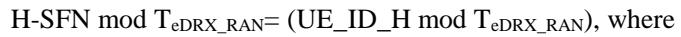

\- TeDRX\_RAN: UE-specific eDRX cycle in Hyper-frames, (TeDRX\_RAN = 2, …, 1024 Hyper-frames) configured by RRC.

For CN configured PTW:

PTW\_start denotes the first radio frame of the PH for CN that is part of the PTW and has SFN satisfying the following equation:

SFN = 128 \* ieDRX, CN, where

\- ieDRX, CN = floor(UE\_ID\_H /TeDRX, CN) mod 8

PTW\_end is the last radio frame of the PTW and has SFN satisfying the following equation:

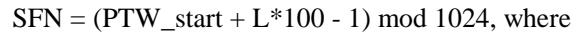

\- L = Paging Time Window (PTW) length (in seconds) configured by upper layers

For RAN configured PTW:

PTW\_start denotes the first radio frame of the PH for RAN that is part of the PTW and has SFN satisfying the following equation:

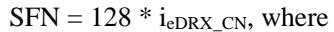

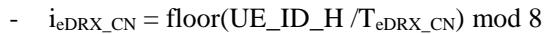

PTW\_end is the last radio frame of the PTW and has SFN satisfying the following equation:

\- L = Paging Time Window (PTW) length (in seconds) configured by RRC

UE\_ID\_H is defined as follows:

UE\_ID\_H: 13 most significant bits of the Hashed ID.

Hashed ID is defined as follows:

Hashed\_ID is Frame Check Sequence (FCS) for the bits b31, b30…, b0 of 5G-S-TMSI.

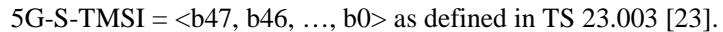

The 32-bit FCS shall be the ones complement of the sum (modulo 2) of Y1 and Y2, where

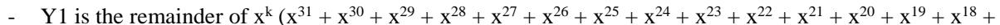

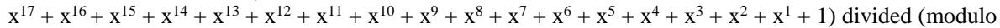

2) by the generator polynomial x32 + x26 + x23 + x22 + x16 + x12 + x11 + x10 + x8 + x7 + x5 + x4 + x2 + x + 1, where k is 32; and

Y2 is the remainder of Y3 divided (modulo 2) by the generator polynomial x32 + x26 + x23 + x22 + x16 + x12 + x11 + x10 + x8 + x7 + x5 + x4 + x2 + x + 1, where Y3 is the product of x32 by "b31, b30…, b0 of S-TMSI or 5G-S-TMSI", i.e., Y3 is the generator polynomial x32 (b31\*x31 + b30\*x30 + … + b0\*1).

NOTE: The Y1 is 0xC704DD7B for any 5G-S-TMSI value. An example of hashed ID calculation is in Annex A.

## 8 Sidelink Operation

## 8.1 NR sidelink communication, and V2X sidelink communication, NR sidelink discovery, and ranging/ sidelink positioning

The UE may transmit or receive NR sidelink communication/discovery if it fulfils the condition(s) defined in TS 38.331 [3], clause 5.8.2. When UE is in-coverage for sidelink operation as defined in clause 8.2, the UE may perform NR sidelink communication/discovery according to SIB12, and when out-of-coverage for sidelink, the UE may perform NR sidelink communication/discovery according to SL-PreconfigurationNR or according to SIB12 of the cell on the frequency which provides inter-carrier NR sidelink configuration, or according to SIB12 received from the connected L2 U2N Relay UE as specified in TS 38.331 [3]. The UE shall not perform NR sidelink communication/discovery according to SL-PreconfigurationNR if the UE detects a cell providing NR sidelink configuration or inter-carrier NR sidelink configuration for the frequency UE is interested to perform NR sidelink communication/discovery on, or if the UE is a L2 U2N Remote UE and has received SIB12 from the connected L2 U2N Relay UE.

The UE may transmit or receive V2X sidelink communication if it fulfills the condition(s) defined in TS 36.331[6], clause 5.10.1d. When UE is in-coverage for sidelink operation as defined in clause 8.2, the UE may perform V2X sidelink communication according to SIB13/ SIB14 of the cell on an NR frequency.

The UE may transmit or receive SL-PRS for ranging/sidelink positioning if it fulfils the conditions defined in TS 38.331 [3].

The U2N Remote UE, the U2N Relay UE, the U2U Remote UE, or the U2U Relay UE may transmit NR sidelink relay discovery (i.e., as specified in TS 23.304 [22]) if it fulfills the condition(s) defined in TS 38.331 [3].

For NR sidelink broadcast and groupcast, the UE may obtain SL DRX configuration from SIB12 (for in-coverage UE, as defined in clause 8.2, in RRC\_IDLE and RRC\_INACTIVE state; or for out-of-coverage UE, as defined in clause 8.2, on the frequency which the UE is configured to perform NR sidelink communication/discovery and which is included in sl-FreqInfoList/sl-FreqInfoListSizeExt in SIB12) or SL-PreconfigurationNR (for out-of-coverage UE, as defined in clause 8.2, on the frequency which the UE is configured to perform NR sidelink communication/discovery and which is not included in sl-FreqInfoList/sl-FreqInfoListSizeExt in SIB12), if SIB12 is available.

For inter-UE coordination (IUC) information configuration, the UE may obtain it from SIB12 (for in-coverage UE, as defined in clause 8.2, in RRC\_IDLE and RRC\_INACTIVE state; or for out-of-coverage UE, as defined in clause 8.2, on the frequency which UE is configured to perform NR sidelink communication and which is included in sl-FreqInfoList/sl-FreqInfoListSizeExt in SIB12) or SL-PreconfigurationNR (for out-of-coverage UE, as defined in clause 8.2, on the frequency which UE is configured to perform NR sidelink communication and which is not included in sl-FreqInfoList/sl-FreqInfoListSizeExt in SIB12).

For ranging/sidelink positioning, the UE may obtain the configuration from SIB23 (for in-coverage UE, as defined in clause 8.2, in RRC\_IDLE and RRC\_INACTIVE state) or SL-PreconfigurationNR (for out-of-coverage UE, as defined in clause 8.2).

## 8.2 Cell selection and reselection for Sidelink

The requirements defined in this clause for sidelink operation (including sidelink relay operations) apply for UEs in RRC\_IDLE, RRC\_INACTIVE and in RRC\_CONNECTED.

When UE is interested to perform NR sidelink communication/discovery and ranging/sidelink positioning on nonserving frequency, it may perform measurements on that frequency or the frequencies which can provide inter carrier NR sidelink configuration for that frequency for cell selection and reselection purpose in accordance with TS 38.133[8]. When UE is interested to perform V2X sidelink communication on non-serving frequency, it may perform measurements on that frequency or the frequencies which can provide inter carrier V2X sidelink configuration for that frequency for cell selection and intra-frequency reselection purpose in accordance with TS 38.133[8].

If the UE detects at least one cell on the frequency which UE is configured to perform NR sidelink communication/discovery and ranging/sidelink positioning on fulfilling the S criterion in accordance with clause 8.2.1, it shall consider itself to be in-coverage for NR sidelink communication/discovery and ranging/sidelink positioning on that frequency. If the UE cannot detect any cell on that frequency meeting the S criterion, it shall consider itself to be out-of-coverage for NR sidelink communication/discovery and ranging/sidelink positioning on that frequency.

If the UE detects at least one cell on the frequency which UE is configured to perform V2X sidelink communication on fulfilling the S criterion in accordance with clause 8.2.1, it shall consider itself to be in-coverage for V2X sidelink communication on that frequency. If the UE cannot detect any cell on that frequency meeting the S criterion, it shall consider itself to be out-of-coverage for V2X sidelink communication on that frequency.

If the UE has selected a cell on a non-serving frequency for V2X sidelink communication, it shall perform additional intra-frequency reselection process to select a better cell for sidelink operation on that frequency in accordance with clause 8.2.1.

If the UE has selected a cell on a non-serving frequency for NR sidelink communication/discovery, it shall perform additional reselection process to select a better cell for sidelink operation in accordance with clause 8.2.1.

If the UE has selected a cell on a non-serving frequency for Ranging/Sidelink Positioning, it shall perform additional reselection process to select a better cell for sidelink operation in accordance with clause 8.2.1.

## 8.2.1 Parameters used for cell selection and reselection triggered for sidelink

When evaluating S criterion, R criterion (ranking) or inter-frequency cell reselection criterion, as defined in clause 5.2.3.2, clause 5.2.4.6 and clause 5.2.4.5 respectively, for cell selection/reselection triggered for NR sidelink communication/discovery or V2X sidelink communication or Ranging/Sidelink positioning on a non-serving frequency, UE shall perform the evaluation as follows:

The UE shall use cell selection/reselection parameters broadcast by the concerned cell (i.e. selected cell for the sidelink operation) for the evaluation.

## Tracking Reference Signal

The UE in RRC\_IDLE and RRC\_INACTIVE states may use Tracking Reference Signal (TRS) whose configurations are provided in system information for its paging reception to save power. In a cell in which TRS are available for the UE in RRC\_IDLE and RRC\_INACTIVE states to use, the availability of the configured TRS is informed to the UEs in RRC\_IDLE and RRC\_INACTIVE states based on explicit L1 based availability indication defined in TS 38.213 [4].

# Annex A (informative): Example of Hashed ID Calculation using 32-bit FCS

## Inputs:

\- Least significant bits of 5G-S-TMSI: 0x12341234

Generator polynomial: 0x104C11DB7 (1 0000 0100 1100 0001 0001 1101 1011 0111)

Procedure to Calculate Hashed ID:

step a)

\- k = 32

numerator: 0xFFFF FFFF 0000 0000

denominator: 0x1 04C1 1DB7

\- remainder Y1 = 0xC704DD7B

step b)

numerator: 0x1234 1234 0000 0000

denominator: 0x1 04C1 1DB7

\- remainder Y2 = 0x1D66F1A6

Hashed\_ID = FCS = ones complement of (remainder Y1 XOR remainder Y2)

= ones complement of (0xC704DD7B XOR 0x1D66F1A6)

= negation of (0xDA622CDD)

= 0x259DD322

Annex B (informative): Change history

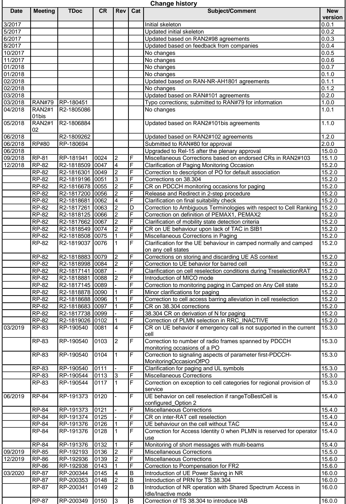

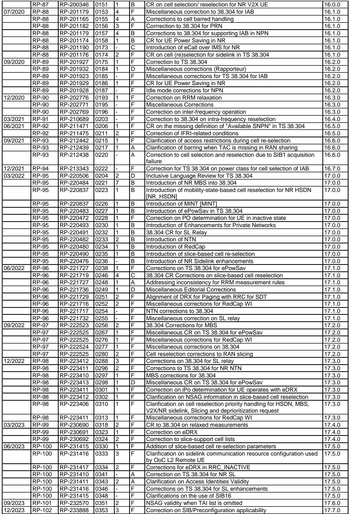

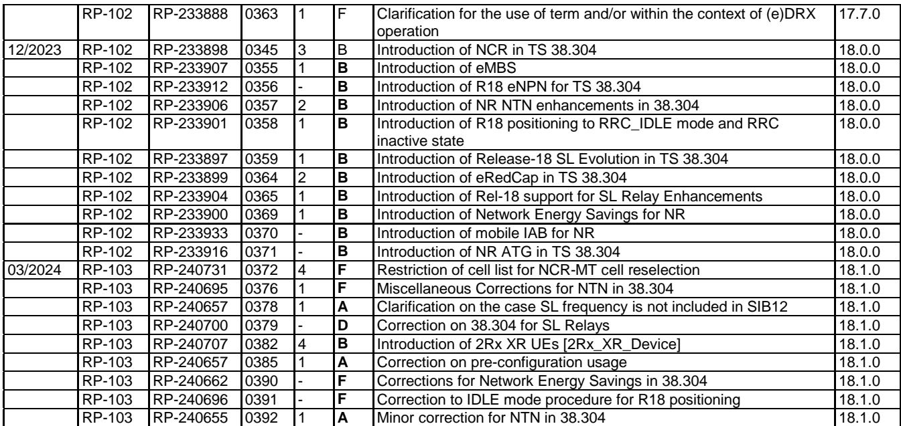

History

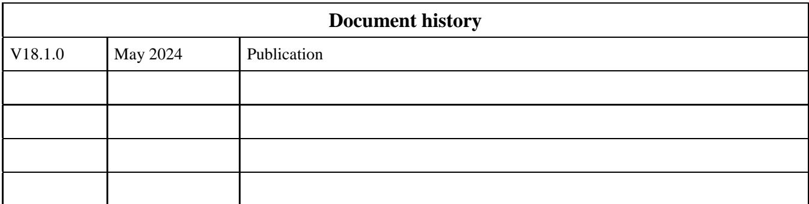