ETSI TS 123 682 V17.3.0 (2022-07)

# Digital cellular telecommunications system (Phase 2+) (GSM); Universal Mobile Telecommunications System (UMTS); LTE; Architecture enhancements to facilitate communications with packet data networks and applications (3GPP TS 23.682 version 17.3.0 Release 17)

Reference RTS/TSGS-0223682vh30

# Keywords GSM,LTE,UMTS

650 Route des Lucioles F-06921 Sophia Antipolis Cedex - FRANCE

Tel.: +33 4 92 94 42 00 Fax: +33 4 93 65 47 16

Siret N° 348 623 562 00017 - APE 7112B Association à but non lucratif enregistrée à la Sous-Préfecture de Grasse (06) N° w061004871

## Important notice

The present document can be downloaded from: http://www.etsi.org/standards-search

The present document may be made available in electronic versions and/or in print. The content of any electronic and/or print versions of the present document shall not be modified without the prior written authorization of ETSI. In case of any existing or perceived difference in contents between such versions and/or in print, the prevailing version of an ETSI deliverable is the one made publicly available in PDF format at www.etsi.org/deliver.

Users of the present document should be aware that the document may be subject to revision or change of status. Information on the current status of this and other ETSI documents is available at https://portal.etsi.org/TB/ETSIDeliverableStatus.aspx

If you find errors in the present document, please send your comment to one of the following services: https://portal.etsi.org/People/CommiteeSupportStaff.aspx

If you find a security vulnerability in the present document, please report it through our Coordinated Vulnerability Disclosure Program: https://www.etsi.org/standards/coordinated-vulnerability-disclosure

Notice of disclaimer & limitation of liability

The information provided in the present deliverable is directed solely to professionals who have the appropriate degree of experience to understand and interpret its content in accordance with generally accepted engineering or other professional standard and applicable regulations.

No recommendation as to products and services or vendors is made or should be implied.

No representation or warranty is made that this deliverable is technically accurate or sufficient or conforms to any law and/or governmental rule and/or regulation and further, no representation or warranty is made of merchantability or fitness for any particular purpose or against infringement of intellectual property rights.

In no event shall ETSI be held liable for loss of profits or any other incidental or consequential damages.

Any software contained in this deliverable is provided "AS IS" with no warranties, express or implied, including but not limited to, the warranties of merchantability, fitness for a particular purpose and non-infringement of intellectual property rights and ETSI shall not be held liable in any event for any damages whatsoever (including, without limitation, damages for loss of profits, business interruption, loss of information, or any other pecuniary loss) arising out of or related to the use of or inability to use the software.

## Copyright Notification

No part may be reproduced or utilized in any form or by any means, electronic or mechanical, including photocopying and microfilm except as authorized by written permission of ETSI.

The content of the PDF version shall not be modified without the written authorization of ETSI. The copyright and the foregoing restriction extend to reproduction in all media.

## Intellectual Property Rights

Essential patents

IPRs essential or potentially essential to normative deliverables may have been declared to ETSI. The declarations pertaining to these essential IPRs, if any, are publicly available for ETSI members and non-members, and can be found in ETSI SR 000 314: "Intellectual Property Rights (IPRs); Essential, or potentially Essential, IPRs notified to ETSI in respect of ETSI standards", which is available from the ETSI Secretariat. Latest updates are available on the ETSI Web server (https://ipr.etsi.org/).

Pursuant to the ETSI Directives including the ETSI IPR Policy, no investigation regarding the essentiality of IPRs, including IPR searches, has been carried out by ETSI. No guarantee can be given as to the existence of other IPRs not referenced in ETSI SR 000 314 (or the updates on the ETSI Web server) which are, or may be, or may become, essential to the present document.

## Trademarks

The present document may include trademarks and/or tradenames which are asserted and/or registered by their owners. ETSI claims no ownership of these except for any which are indicated as being the property of ETSI, and conveys no right to use or reproduce any trademark and/or tradename. Mention of those trademarks in the present document does not constitute an endorsement by ETSI of products, services or organizations associated with those trademarks.

DECT™, PLUGTESTS™, UMTS™ and the ETSI logo are trademarks of ETSI registered for the benefit of its Members. 3GPP™ and LTE™ are trademarks of ETSI registered for the benefit of its Members and of the 3GPP Organizational Partners. oneM2M™ logo is a trademark of ETSI registered for the benefit of its Members and of the oneM2M Partners. GSM® and the GSM logo are trademarks registered and owned by the GSM Association.

## Legal Notice

This Technical Specification (TS) has been produced by ETSI 3rd Generation Partnership Project (3GPP).

The present document may refer to technical specifications or reports using their 3GPP identities. These shall be interpreted as being references to the corresponding ETSI deliverables.

The cross reference between 3GPP and ETSI identities can be found under http://webapp.etsi.org/key/queryform.asp.

## Modal verbs terminology

In the present document "shall", "shall not", "should", "should not", "may", "need not", "will", "will not", "can" and "cannot" are to be interpreted as described in clause 3.2 of the ETSI Drafting Rules (Verbal forms for the expression of provisions).

"must" and "must not" are NOT allowed in ETSI deliverables except when used in direct citation.

## Contents

Intellectual Property Rights .. .. 2   
Legal Notice ........... .........................................................................................................   
Foreword ......   
1 Scope .....   
2 References .......... .................................................................................................. ...... 8   
3 Definitions and abbreviations ............................................................................................................ ..... 10   
3.1 Definitions ...........   
3.2 Abbreviations ... .... 10   
4 Architecture Model and Concepts .. ......................................................................................... .... 11   
4.1 General Concept .... ... 11   
4.2 Architectural Reference Model ...   
4.3 Reference points .... ...... 16   
4.3.1   
4.3.2 List of Reference Points ...... .... 17   
4.3.3   
4.3.3.1 ..... 17   
4.3.3.2   
4.3.3.3 Void.......... .... 18   
4.3.3.4   
4.3.3.5   
4.3.3.6   
4.3.3.7 S6t Reference Point Requirements .............. ....................................................................... .... 19   
4.3.3.8 T6ai/T6bi Reference Point Requirements ....................................................................................... .... 19   
4.3.3.9 T7 Reference Point Requirements ..... .................................................................................... .... 19   
4.3.3.10 Ns Reference Point Requirements ..... .................................................................................... ... 19   
4.3.3.11 4.3.3.12 Nu Reference Point Requirements ....T8 Reference Point Requirements ..... .................................................................................. ..... 19 ..... 20   
4.3.3.13   
4.4   
4.4.1   
4.4.2 MTC-IWF ................................................................................................................................................... 20   
4.4.3 HSS/HLR ..... .............................................................................................................................. ... 21   
4.4.4   
4.4.5 4.4.6 SGSN/MME/MSC ...SMS-SC ................... ............................................................................................................................. 22   
4.4.7 MTC AAA .... ......................................................................... ... 23   
4.4.8 Service Capability Exposure Function .. ......................................................................................... ... 23   
4.4.9 Interworking SCEF ... .. 25   
4.4.10 RAN Congestion Awareness Function .. .................................................................................... .. 25   
4.4.11 Packet Flow Description Function .... .. 25   
4.4.12   
4.5 High Level Function ....... .... 26   
4.5.1   
4.5.2 PS-only Service Provision ....... .. 26   
4.5.3   
4.5.4 UE Power Saving Mode .... ... 26   
4.5.5   
4.5.6   
4.5.6.1 ........................................................................   
4.5.6.2   
4.5.6.3 Monitoring Events via PCRF ... ... 29   
4.5.6.4 ............................................................................ ..... 30   
4.5.7 High latency communication ........ ...................................................................... ... 30   
4.5.8 Support of informing about potential network issues .. .. 31   
4.5.9 Resource management of background data transfer ...............   
4.5.10 E-UTRAN network resource optimizations based on communication patterns provided to the MME ...... 31   
4.5.11 Support of setting up an AS session with required QoS ....................... .... 32   
4.5.12 Change the chargeable party at session set-up or during the session ............................................... .... 32   
4.5.13 Extended idle mode DRX .......... ........................................... .... 32   
4.5.13.1 General .......... ..................................................................... 32   
4.5.13.2 Paging for extended idle mode DRX in UTRAN ... .. 33   
4.5.13.3 Paging for extended idle mode DRX in E-UTRAN ...   
4.5.13.3.0 General ..... .... 34   
4.5.13.3.1 Hyper SFN, Paging Hyperframe and Paging Time Window length ... .... 34   
4.5.13.3.2 Loose Hyper SFN synchronization ............   
4.5.13.3.3 MME paging and paging retransmission strategy ...... ........................................................ .... 35   
4.5.14   
4.5.14.1 ........................................................................ ..... 35   
4.5.14.2 4.5.14.3 Enhancements for reliable delivery of NIDD ... Reliable Data Service ........................... ........................................ .... 36   
4.5.15 Support of PFD management via SCEF . ................................................................... .. 37   
4.5.16 MSISDN-less MO-SMS via T4 ...................................   
4.5.17 Enhanced Coverage Restriction Control via SCEF . .... 37   
4.5.18 MBMS user service for UEs using power saving functions ....................................................................... 37   
4.5.19 Enhancements to Location Services for CIoT ..... ..................................................................... ..... 39   
4.5.20   
4.5.21 4.5.22 Network Parameter Configuration via SCEF .... ............................................................................... ...... 40   
4.5.23 Support of satellite access ..................................................................................................................... ...... 40   
4.6 4.6.1 Identifiers ..... ...................................................................................... ..... 41   
4.6.2 External Identifier ........   
4.6.3 External Group Identifier ..... ........................................................................................................... ...... 41   
4.7 4.8 Addressing ............ Security Aspects ..... ............................................................................................................................ ...... 41 ...... 42   
4.8.1 ..... 42   
4.8.1.0 4.8.1.1 General ............................................................................................................................................Void................................................................................................................................................. .... 42   
4.8.1.2 ..... 42   
4.9 SCEF - SCS/AS API Procedures ................................................................................................................ .... 42   
4.9.1 4.9.2 General ........................Common Parameters ... ............................................................................................................ ..... 42 ..... 42   
4.10 Charging Principles .......   
5   
5.1 Control and user plane ....................   
5.1.1 Control Plane ........... .................................................................................................. .... 43   
5.1.1.1 HSS – MTC-IWF ..... ................................................................................... ..... 43   
5.2 5.2.1 Device triggering procedures .......................Device triggering procedure over Tsp .... ......................................................................................... .... 44   
5.2.2 Trigger Delivery using T4 ..........   
5.2.3 Device triggering recall/replace procedures..... .. 46   
5.2.3.1 Device trigger recall/replace procedure over Tsp . .... 46   
5.2.3.2 Replace procedure for trigger delivery using T4 ..........   
5.2.3.3 Recall procedure for trigger delivery using T4 .... ................................................................ .... 49   
5.3   
5.3.0 5.3.1 General ........................................................................................................................................................ 50 Trigger Information in SMS-SC (Triggering with T4) ............................................................................... 50   
5.3.2 ................................................................. ..... 50   
5.4 Security Procedures ...... .... 51   
5.4.0   
5.4.1 Void ....... ........................................................................ ...... 51   
5.4.2 Void ...... ............................................................................................ ...... 51   
5.5 Group message delivery procedures .... ... 52   
5.5.1 Group message delivery using MBMS ........   
5.5.2   
5.5.3 Group Message Delivery via unicast MT NIDD . .. 56   
5.6 ..........................................................................   
5.6.0 Common Parameters ........ ... 57   
5.6.1 Monitoring Event configuration and deletion via HSS . ........................................................... .. 58   
5.6.1.1 Configuration Procedure ...... ... 58   
5.6.1.2 Void..... .. 62   
5.6.1.3 Specific Parameters for Monitoring Event: Loss of connectivity ....   
5.6.1.4 Specific Parameters for Monitoring Event: UE reachability ........ .. 64   
5.6.1.5 Specific Parameters for Monitoring Event: Location Reporting ................. .... 66   
5.6.1.6 Specific Parameters for Monitoring Event: Change of IMSI-IMEI(SV) Association ............. ...... 67   
5.6.1.7 Specific Parameters for Monitoring Event: Roaming Status .... .. 67   
5.6.1.8 Specific Parameters for Monitoring Event: Communication failure ................................................   
5.6.1.9 Specific Parameters for Monitoring Event: Availability after DDN Failure ..............................   
5.6.1.10 Specific Parameters for Monitoring Event: PDN Connectivity Status ....... .... 68   
5.6.2 Monitoring Events configuration and deletion directly at the MME/SGSN .. .... 69   
5.6.2.1 Configuration Procedure ......... .. 69   
5.6.2.2 Void......... .. 70   
5.6.2.3 Specific Steps for Monitoring Event: Number of UEs present in a geographic area .. .. 70   
5.6.3 Reporting of Monitoring Events from the HSS or the MME/SGSN ................................................ .... 71   
5.6.3.1 Reporting Procedure... .. 71   
5.6.3.2 Reporting Event: Loss of connectivity .... ................................................. ..... 73   
5.6.3.3 Reporting Event: UE reachability . .. 74   
5.6.3.4   
5.6.3.5   
5.6.3.6 Reporting Event: Roaming Status ............. .............................................................   
5.6.3.7 Reporting Event: Communication failure ... .............................................................. .. 75   
5.6.3.8 Reporting Event: Availability after DDN failure ..... ............................................................ .. 75   
5.6.3.9 Reporting Event: PDN Connectivity Status ... .. 75   
5.6.4 Monitoring events configuration and reporting via PCRF ..... ..........................................................   
5.6.4.1 Request of monitoring event reporting ....... .. 75   
5.6.4.1a Request of monitoring event reporting for a group of UEs . .. 76   
5.6.4.2 Common Parameters of the request reporting procedure .......... ....................................... ..... 78   
5.6.4.3 Specific Parameters for Monitoring Event: Location Reporting .................................................... .. 78   
5.6.4.4 Specific Parameters for Monitoring Event: Communication Failure ....................................... .. 79   
5.6.5 Reporting of Monitoring Events from the PCRF ................................................................................... ..... 79   
5.6.6 Monitoring Event configuration and deletion via HSS for roaming scenarios using an IWK-SCEF .   
5.6.6.1 Configuration Procedure ..... .. 80   
5.6.6.2 Void.................. .. 82   
5.6.6.3 Specific Parameters for Monitoring Event: Loss of connectivity . .. 82   
5.6.6.4 Specific Parameters for Monitoring Event: UE reachability .........   
5.6.6.5 Specific Parameters for Monitoring Event: Location Reporting ...... .. 83   
5.6.6.6 Specific Parameters for Monitoring Event: Change of IMSI-IMEI(SV) Association . .. 83   
5.6.6.7 Specific Parameters for Monitoring Event: Roaming Status ....... .. 83   
5.6.6.8 Specific Parameters for Monitoring Event: Communication failure .................................... .. 83   
5.6.6.9 Specific Parameters for Monitoring Event: Availability after DDN Failure ..... .. 84   
5.6.7 Monitoring Events configuration and deletion directly at the MME/SGSN for roaming scenarios ...... .. 84   
5.6.8 Reporting of Monitoring Events from the HSS or the MME/SGSN for roaming scenarios ....... .. 84   
5.6.8.1 Reporting Procedure....... .. 84   
5.6.8.2 Reporting Event: Loss of connectivity .. .. 86   
5.6.8.3 Reporting Event: UE reachability .. 86   
5.6.8.4 Reporting Event: Location Reporting ...... .. 86   
5.6.8.5 Reporting Event: Change of IMSI-IMEI(SV) association . ............................................ .... 86   
5.6.8.6 Reporting Event: Roaming Status .... .. 86   
5.6.8.7 Reporting Event: Communication failure .............. ............................................................   
5.6.8.8 Reporting Event: Availability after DDN failure ... ................................................ .. 87   
5.6.8.9 Reporting Event: PDN Connectivity Status ......... ................................................   
5.6.9 Network-initiated Explicit Monitoring Event Deletion Procedure .................................................... .... 87   
5.7 High latency communications procedures ........ ................................................ .. 88   
5.7.1 Availability Notification after DDN Failure .... ..................................... .... 88   
5.7.1.1 General .. .. 88   
5.7.1.2 Event Configuration .......   
5.7.1.3 Notification ............ ..... 89   
5.7.2 Notification using Monitoring Event "UE Reachability" ...... 91   
5.8 Procedure for Informing about Potential Network Issues . ............................................ .... 91   
5.8.1 General ...... ....................................... ... 91   
5.8.2 Request procedure for one-time or continuous reporting of network status ......................................   
5.8.3 Report procedure for continuous reporting of network status ........ ................................... ..... 93   
5.8.4 Removal procedure for continuous reporting of network status . ....................................... .... 94   
5.9 Procedure for resource management of background data transfer ... ...................................... .. 95   
5.10 Communication Pattern parameters provisioning procedure ...... .... 97   
5.10.1 Communication Pattern parameters ...... ............................................. ..... 97   
5.10.2 Communication Pattern parameters provisioning to the MME . ............................................... ... 98   
5.11 Setting up an AS session with required QoS procedure ........ .............................. ...... 99   
5.12 Change the chargeable party at session set-up or during the session procedure .................................... .... 101   
5.12.1 Set the chargeable party at session set-up ..... ... 101   
5.12.2 Change the chargeable party during the session . ................................... ... 102   
5.13 Non-IP Data Delivery procedures ... .... 103   
5.13.1 T6a/T6b Connection Establishment ..... .................................................................................. 103   
5.13.1.1 5.13.1.2 General ...... ............................................................................... ...... 103 ...... 103   
T6a/T6b Connection Establishment Procedure ............................................................................   
5.13.2 NIDD Configuration ............. ........................................................................... ...... 104   
5.13.3 Mobile Terminated NIDD procedure ........ .................................................................................. ....... 106   
5.13.4 Mobile Originated NIDD procedure .. ............................................................................ ... 109   
5.13.5 T6a/T6b Connection Release ..... .......................................................................... ... 110   
5.13.5.1 General ........ .... 110   
5.13.5.2 MME/SGSN Initiated T6a/T6b Connection Release procedure ................................................ .... 111   
5.13.5.3 SCEF Initiated T6a/T6b Connection Release procedure ............................................................. .. 112   
5.13.6 Serving node relocation procedure over T6a/T6b ...... ....................................................................... .. 112   
5.13.6.1 5.13.6.2 General ................................................................Successful TAU/RAU procedure with T6a/T6b . .............................................................................................................................. ..... 112 ..... 113   
5.13.7 Void ........ ............................................................... ..... 113   
5.13.8 NIDD Authorisation Update .. ....................................................................... ..... 113   
5.14 PFD management via SCEF . .... 114   
5.14.1 Procedure for PFD management via SCEF ..   
5.14.2 PFD definition .........   
5.15 Procedure for MSISDN-less MO-SMS via T4 ..........   
5.16 Procedure for Enhanced Coverage Restriction Control via SCEF ................................................................. 117   
5.17 Procedures for accessing MTC-IWF Functionality via SCEF ................................................................. ...... 118   
5.17.1 Device triggering procedure via T8 .............. .......................................................... ...... 118   
5.17.2 5.17.3 Device triggering recall/replace procedures via T8 ...Procedure for MSISDN-less MO-SMS via T8 .......... ............................................................... ...... 119 ...... 120   
5.18 Procedure for Network Parameter Configuration via SCEF . .................................................................. ...... 121   
5.19 RACS information provisioning procedures .... .............................................................................................. 125   
5.19.1 General ......   
5.19.2 RACS information provisioning procedures via SCEF ............................................................................ 125   
5.19.3   
Annex A (informative):   
Annex B (informative): Void ............   
Annex C (informative):   
C.1 General ..........   
C.2 Triggering flow using Service Loading ....... ..... 130   
Annex D (informative): Device triggering using direct model over user plane .............................. 132   
Annex E (informative): Change history ........................   
History ..............

## Foreword

This Technical Specification has been produced by the 3rd Generation Partnership Project (3GPP).

The contents of the present document are subject to continuing work within the TSG and may change following formal TSG approval. Should the TSG modify the contents of the present document, it will be re-released by the TSG with an identifying change of release date and an increase in version number as follows:

Version x.y.z

where:

x the first digit:

1 presented to TSG for information;

2 presented to TSG for approval;

3 or greater indicates TSG approved document under change control.

y the second digit is incremented for all changes of substance, i.e. technical enhancements, corrections, updates, etc.

z the third digit is incremented when editorial only changes have been incorporated in the document.

## 1 Scope

The present document specifies architecture enhancements to facilitate communications with packet data networks and applications (e.g. Machine Type Communication (MTC) applications on the (external) network/MTC servers) according to the use cases and service requirements defined in TS 22.368 [2], TS 22.101 [3], and related 3GPP requirements specifications. Both roaming and non-roaming scenarios are covered.

The present document also specifies transmission of non-IP data via SCEF for the CIoT EPS Optimization.

The present document also specifies the interface between the SCEF and the SCS/AS.

The present document also specifies provisioning of UCMF with RACS information.

## 2 References

The following documents contain provisions which, through reference in this text, constitute provisions of the present document.

\- References are either specific (identified by date of publication, edition number, version number, etc.) or non-specific.

\- For a specific reference, subsequent revisions do not apply.

For a non-specific reference, the latest version applies. In the case of a reference to a 3GPP document (including a GSM document), a non-specific reference implicitly refers to the latest version of that document in the same Release as the present document.

[1] 3GPP TR 21.905: "Vocabulary for 3GPP Specifications".

[2] 3GPP TS 22.368: "Service Requirements for Machine-Type Communications (MTC)".

[3] 3GPP TS 22.101: "Service Aspects; Service Principles".

[4] 3GPP TS 23.003: "Numbering, addressing and identification".

[5] 3GPP TS 23.002: "Network architecture".

[6] 3GPP TS 23.060: "General Packet Radio Service (GPRS); Service description; Stage 2".

[7] 3GPP TS 23.401: "General Packet Radio Service (GPRS) enhancements for Evolved Universal Terrestrial Radio Access Network (E-UTRAN) access".

[8] 3GPP TS 29.061: "Interworking between the Public Land Mobile Network (PLMN) supporting Packet Based services and Packet Data Networks (PDN)".

[9] 3GPP TS 29.303: "Domain Name System Procedures; Stage 3".

[10] 3GPP TS 23.228: "IP Multimedia Subsystem (IMS); Stage 2".

[11] 3GPP TS 23.272: "Circuit Switched (CS) fallback in Evolved Packet System (EPS); Stage 2".

[12] 3GPP TS 23.040: "Technical realization of the Short Message Service (SMS)".

[13] 3GPP TS 23.204: "Support of Short Message Service (SMS) over generic 3GPP Internet Protocol (IP) access; Stage 2".

[14] 3GPP TR 23.039: "Interface Protocols for the Connection of Short Message Service Centers (SMSCs) to Short Message Entities (SMEs)".

[15] IETF RFC 3588: "Diameter Base Protocol".

[16] IETF RFC 4960: "Stream Control Transmission Protocol".

[17] WAP-168-ServiceLoad-20010731-a: "Service Loading".

OMA-TS-Push\_MO-V1\_0-20110809-A: "OMA Push Management Object".

OMA-TS-Push\_Message-V2\_2-20110809-A: "Push Message".

OMA-AD-Push-V2\_2-20110809-A: "Push Architecture".

3GPP TS 23.221: "Architectural requirements".

Void.

3GPP TS 23.142: "Value-added Services for SMS (VAS4SMS); Interface and signalling flow".

3GPP TS 29.368: "Tsp interface protocol between the MTC Interworking Function (MTC-IWF) and Service Capability Server (SCS)".

3GPP TS 33.187: "Security aspects of Machine-Type and other mobile data applications Communications enhancements".

3GPP TS 23.402: "Architecture enhancements for non-3GPP accesses".

3GPP TS 23.203: "Policy and charging control architecture".

3GPP TS 32.240: "Charging architecture and principles".

3GPP TS 23.246: "Multimedia Broadcast/Multicast Service (MBMS); Architecture and functional description".

3GPP TS 23.468: "Group Communication System Enablers for LTE (GCSE\_LTE); Stage 2".

3GPP TS 29.272: "Mobility Management Entity (MME) and Serving GPRS Support Node (SGSN) related interfaces based on Diameter protocol".

OMA API Inventory: "http://technical.openmobilealliance.org/API/APIsInventory.aspx".

3GPP TS 23.271: "Functional stage 2 description of Location Services (LCS)".

3GPP TS 25.304: "User Equipment (UE) procedures in idle mode and procedures for cell reselection in connected mode".

3GPP TS 36.304: "Evolved Universal Terrestrial Radio Access (E-UTRA); User Equipment (UE) procedures in idle mode".

3GPP TS 23.012: "Location management procedures".

3GPP TS 29.128: "Mobility Management Entity (MME) and Serving GPRS Support Node (SGSN) interfaces for interworking with packet data networks and applications".

3GPP TS 26.346: "MBMS: Protocols and Codecs".

3GPP TS 32.278: "Monitoring event charging".

3GPP TS 32.253: "Control Plane (CP) data transfer domain charging".

3GPP TS 36.306: "Evolved Universal Terrestrial Radio Access (E-UTRA); User Equipment (UE) radio access capabilities".

3GPP TS 26.347: "Multimedia Broadcast/Multicast Service (MBMS); Application Programming Interface and URL".

3GPP TS 23.222: "Functional architecture and information flows to support Common API Framework for 3GPP Northbound APIs".

3GPP TS 29.122: "T8 reference point for northbound Application Programming Interfaces (APIs)".

3GPP TS 29.336: "Home Subscriber Server (HSS) diameter interfaces for interworking with packet data networks and applications".

[46] 3GPP TS 26.348: "Northbound Application Programming Interface (API) for Multimedia Broadcast/Multicast Service (MBMS) at the xMB reference point".

[47] 3GPP TS 24.250: "Protocol for Reliable Data Service; Stage 3".

[48] 3GPP TS 23.502: "Procedures for the 5G System (5GS), Stage 2".

[49] 3GPP TS 29.675: "User Equipment (UE) radio capability provisioning service; Stage 3".

[50] 3GPP TS 36.331: "Evolved Universal Terrestrial Radio Access (E-UTRA); Radio Resource Control (RRC); Protocol specification".

[51] 3GPP TS 38.331: "NR; Radio Resource Control (RRC); Protocol specification".

## 3 Definitions and abbreviations

## 3.1 Definitions

For the purposes of the present document, the terms and definitions given in TR 21.905 [1] apply.

For the purposes of the present document, the following terms and definitions given in TS 23.401 [7] apply:

RACS   
WB-E-UTRAN   
LTE-M

## 3.2 Abbreviations

For the purposes of the present document, the abbreviations given in TR 21.905 [1] and the following apply. An abbreviation defined in the present document takes precedence over the definition of the same abbreviation, if any, in TR 21.905 [1].

AS Application Server

CDR Charging Data Record

CDF Charging Data Function

CGF Charging Gateway Function

CIoT Cellular Internet of Things

CP Communication Pattern

DDN Downlink Data Notification

IWK-SCEF Interworking SCEF

MTC Machine Type Communications

MTC-IWF Machine Type Communications-InterWorking Function

NIDD Non-IP Data Delivery

PCRF Policy and Charging Rules Function

P-GW PDN Gateway

PFDF Packet Flow Description Function

PSM Power Saving Mode

SCEF Service Capability Exposure Function

SCS Services Capability Server

SLF Subscriber Location Function

SME Short Message Entities

SMS-SC Short Message Service-Service Centre

SRI Send Routing Information

UCMF UE radio Capability Management Function

WB-E-UTRAN Wide Band E-UTRAN

## 4 Architecture Model and Concepts

## 4.1 General Concept

The end-to-end communications, between the MTC Application in the UE and the MTC Application in the external network, uses services provided by the 3GPP system, and optionally services provided by a Services Capability Server (SCS).

The MTC Application in the external network is typically hosted by an Application Server (AS) and may make use of an SCS for additional value added services. The 3GPP system provides transport, subscriber management and other communication services including various architectural enhancements motivated by, but not restricted to, MTC (e.g. control plane device triggering).

Different models are foreseen for machine type of traffic in what relates to the communication between the AS and the 3GPP system (refer to Annex A) and based on the provider of the SCS. The different architectural models that are supported by the Architectural Reference Model in clause 4.2 include the following:

Direct Model - The AS connects directly to the operator network in order to perform direct user plane communications with the UE without the use of any external SCS. The Application in the external network may make use of services offered by the 3GPP system;

\- Indirect Model - The AS connects indirectly to the operator network through the services of a SCS in order to utilize additional value added services for MTC (e.g. control plane device triggering). The SCS is either:

MTC Service Provider controlled: The SCS is an entity that may include value added services for MTC, performing user plane and/or control plane communication with the UE. Tsp is regarded as an inter-domain interface for control plane communication; or

3GPP network operator controlled: The SCS is a mobile operator entity that may include value added services for MTC and performs user plane and/or control plane communication with the UE, making Tsp a control plane interface internal to the PLMN;

Hybrid Model: The AS uses the direct model and indirect models simultaneously in order to connect directly to the operator's network to perform direct user plane communications with the UE while also using a SCS. From the 3GPP network perspective, the direct user plane communication from the AS and any value added control plane related communications from the SCS are independent and have no correlation to each other even though they may be servicing the same MTC Application hosted by the AS.

When using the hybrid model, the MTC Service provider controlled SCS, and the 3GPP operator controlled SCS may offer different capabilities to the MTC Applications.

Since the different models are not mutually exclusive, but just complementary, it is possible for a 3GPP operator to combine them for different applications. This may include a combination of both MTC Service Provider and 3GPP network operator controlled SCSs communicating with the same PLMN.

## 4.2 Architectural Reference Model

Figures 4.2-1a and 4.2-1b show the architecture for a UE used for MTC connecting to the 3GPP network (UTRAN, WB-E-UTRAN, NB-IoT, GERAN, etc.) via the Um/Uu/LTE-Uu interfaces or satellite access interface for NB-IoT, WB-E-UTRAN and LTE-M. They also show the 3GPP network service capability exposure to SCS and AS. The architecture covers the various architectural models described in clause 4.1.

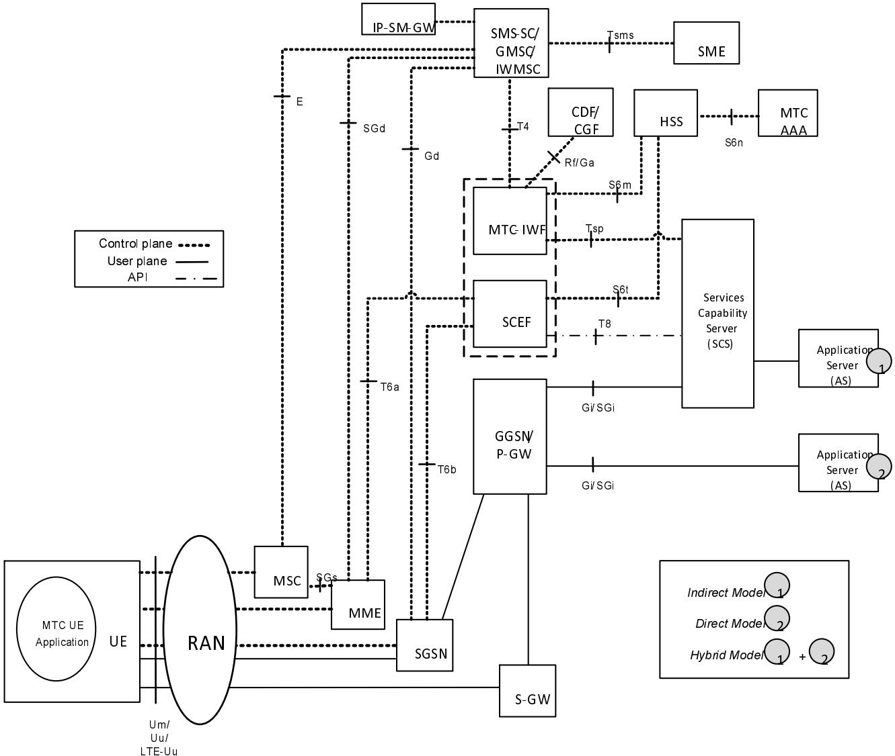  
Figure 4.2-1a: 3GPP Architecture for Machine-Type Communication (non-roaming)

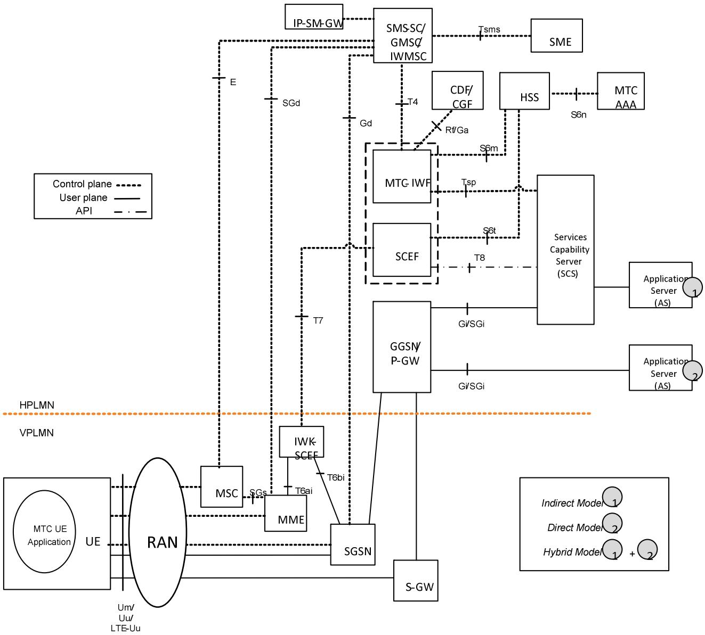  
Figure 4.2-1b: 3GPP Architecture for Machine-Type Communication (Roaming)

Figure 4.2-2 shows the overall architecture for Service Capability Exposure which enables the 3GPP network to securely expose its services and capabilities provided by 3GPP network interfaces to external 3rd party service provider SCS/AS hosting an Application(s).

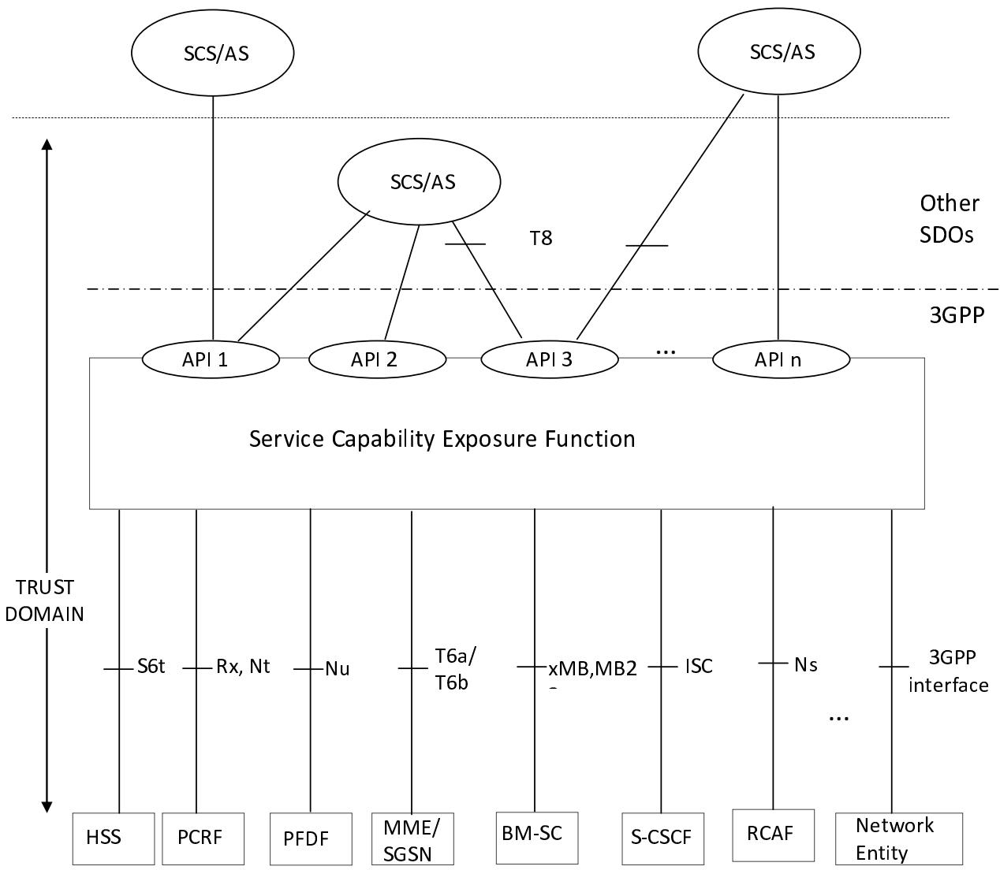  
Figure 4.2-2: 3GPP Architecture for Service Capability Exposure

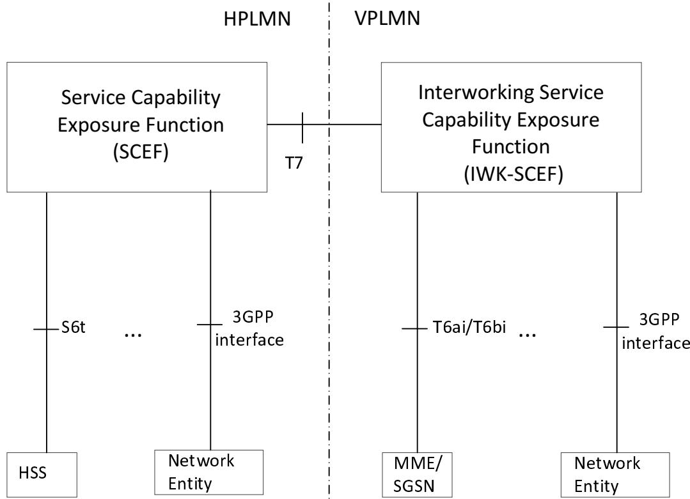  
Figure 4.2-3: 3GPP roaming Architecture for Service Capability Exposure

Figure 4.2-4 shows the overall architecture for RACS which enables provisioning of RACS database information in the 3GPP network.

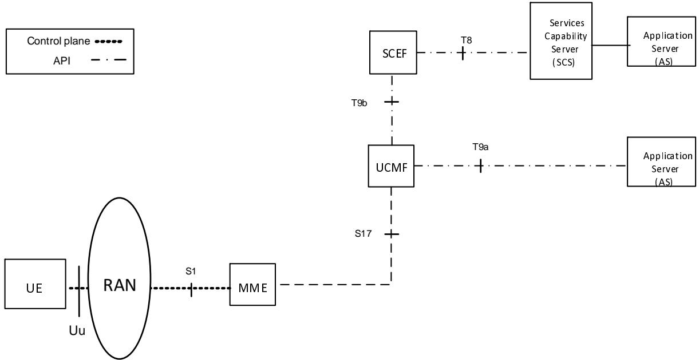  
Figure 4.2-4: 3GPP Architecture for RACS

NOTE 1: Refer to TS 23.002 [5], TS 23.060 [6], TS 23.401 [7], TS 23.272 [11] and TS 23.040 [12] for the details of 3GPP network-internal reference points not specifically shown or labelled in figure 4.2-1a, figure 4.2- 1b, figure 4.2-2, or described in this specification.

NOTE 2: The SCS is controlled by the operator of the HPLMN or by a MTC Service Provider.

NOTE 3: In the non-roaming case, all 3GPP network entities providing functionality for MTC are in the same PLMN. In the roaming case, 3GPP architecture for MTC supports both the home routed (illustrated in Figures 4.2-1a and 4.2-1b) and the local-breakout roaming (not illustrated) scenarios. For the home routed scenario, the MTC Server/Application User Plane communication is routed through the HPLMN. In the local breakout scenario, the User Plane communication is routed directly through the serving PLMN/VPLMN over deployed GGSN/P-GW.

NOTE 4: Figure 4.2-2 does not include all the interfaces and network elements that may be connected to SCEF.

NOTE 5: Figure 4.2-3 does not include all the interfaces and network elements that may be connected to an Interworking SCEF (IWK-SCEF).

The SCS is an entity which connects to the 3GPP network to communicate with UEs used for MTC and the MTC-IWF and/or SCEF in the HPLMN. The SCS offers capabilities for use by one or multiple MTC Applications. A UE can host one or multiple MTC Applications. The corresponding MTC Applications in the external network are hosted on one or multiple ASs.

Tsms is the interface that encompasses all the various proprietary SMS-SC to SME interface standards (see TR 23.039 [14]) and is outside the scope of 3GPP specifications. Tsms can be used to send a trigger to a UE encapsulated in a MT-SMS as an over-the-top application by any network entity (e.g. SCS) acting as a SME. Tsp is a 3GPP standardized interface to facilitate value-added services motivated by MTC (e.g. control plane device triggering) and provided by a SCS.

T8 is the interface between the SCEF and the SCS/AS. SCEF exposed network services can be accessed by SCS/AS through APIs over T8 interface. In the indirect model, the SCS and the Application Server hosting Application(s) can be collocated.

For the roaming scenario, the MTC-IWF shall have the connection with HSS and SMS-SC within the home network only as shown in the figure 4.2-1b.

The Service Capability Exposure Function (SCEF) is the key entity within the 3GPP architecture for service capability exposure that provides a means to securely expose the services and capabilities provided by 3GPP network interfaces. In standalone MTC-IWF deployment, MTC-IWF functionality (e.g. T4 triggering) is made available to the SCS/AS via the Tsp interface. In certain deployments, the MTC-IWF may be co-located with the SCEF in which case MTC-IWF functionality is exposed to the SCS/AS via T8 interface (i.e. API). In deployments where MTC-IWF is not co-located with SCEF, interactions between MTC-IWF and SCEF are left up to the implementation.

The trust domain (see figure 4.2-2) cover entities that are protected by adequate network domain security. The entities and interfaces within the trust domain may all be within one operator's control, or some may be controlled by a trusted business partner which has a trust relationship with the operator e.g. another operator or a 3rd party. The security requirements for the trust domain are out of scope of this specification.

When the SCEF belongs to a trusted business partner of the HPLMN, it is still seen as an HPLMN entity by other HPLMN or VPLMN functional entities invoked by the SCEF (e.g. HSS, MME).

Applications operating in the trust domain may require only a subset of functionalities (e.g. authentication, authorization, etc.) provided by the SCEF. Applications operating in the trust domain can also access network entities (e.g. PCRF), wherever the required 3GPP interface(s) are made available, directly without the need to go through the SCEF.

The Interworking SCEF (IWK-SCEF) is optional. When deployed, the IWK-SCEF is located in the VPLMN as shown in the figure 4.2-1b.

## 4.3 Reference points

## 4.3.1 General

The following 3GPP reference points support the Indirect and Hybrid models of MTC and Service Capability Exposure.

NOTE: As further development of the MTC architecture takes place as well as when additional MTC common functionality and features are addressed, further reference points may be added.

## 4.3.2 List of Reference Points

The description of the MTC and Service Capability Exposure related reference points:

Tsms: Reference point used by an entity outside the 3GPP network to communicate with UEs used for MTC via SMS.

Tsp: Reference point used by a SCS to communicate with the MTC-IWF related control plane signalling.

T4: Reference point used between MTC-IWF and the SMS-SC in the HPLMN.

T6a: Reference point used between SCEF and serving MME.

T6b: Reference point used between SCEF and serving SGSN.

T6ai: Reference point used between IWK-SCEF and serving MME.

T6bi: Reference point used between IWK-SCEF and serving SGSN.

T7: Reference point used between IWK-SCEF and SCEF.

T8: Reference point used between the SCEF and the SCS/AS.

T9a: Reference point used between UCMF and AS.

T9b: Reference point used between UCMF and SCEF.

S6m: Reference point used by MTC-IWF to interrogate HSS/HLR.

S6n: Reference point used by MTC-AAA to interrogate HSS/HLR.

S6t: Reference point used between SCEF and HSS.

Rx: Reference point used by SCEF and PCRF. Functionality for Rx reference point is specified in TS 23.203 [27].

Ns: Reference point used between SCEF and RCAF.

Nt: Reference point used by SCEF and PCRF. Functionality for Nt reference point is specified in TS 23.203 [27].

Nu: Reference point used by SCEF to interact with the PFDF.

NOTE 1: Protocol assumption: User plane communication with SCS, for Indirect model, and AS, for Direct and Hybrid models, is achieved using protocols over Gi and SGi reference points. Control plane protocols over those reference points such as RADIUS/Diameter as specified in TS 29.061 [8] can also be supported towards the SCS.

NOTE 2: It is assumed that interfaces on the T6ai/T6bi/T7 reference points use the same protocol(s) as interfaces on the T6a/T6b reference points.

## 4.3.3 Reference Point Requirements

## 4.3.3.1 Tsp Reference Point Requirements

The Tsp reference point shall fulfil the following requirements:

connects a MTC-IWF to one or more SCSs;

supports the following device trigger functionality:

reception of a device trigger request from SCS that includes an Application Port ID used by the UE to route the trigger internally to the appropriate triggering function;

NOTE 1: The Application Port ID can have different value for different applications.

report to the SCS the acceptance or non-acceptance of the device trigger request;

\- report to the SCS the success or failure of a device trigger delivery; and

\- provides congestion/load control information to SCS as part of the response to device trigger requests.

\- deliver a payload and application port ID received from the MTC-IWF and the external ID of the UE to SCS.

In addition, Domain Name System procedures similar to what is specified in TS 29.303 [9] may be used by the SCS for lookup and selection of which specific MTC-IWF to be used.

NOTE 2: Security requirements can be found in clause 4.8.

## 4.3.3.2 T4 Reference Point Requirements

The T4 reference point shall fulfil the following requirements:

connects the MTC-IWF, taking the role of the SME, to SMS-SC inside HPLMN domain;

supports the following device trigger functionality:

transfer of device trigger, addressed by either an MSISDN or the IMSI, from MTC-IWF to SMS-SC inside HPLMN domain;

transfer to the SMS-SC the serving SGSN/MME/MSC identity(ies) along with device trigger when addressed by IMSI; and

report to MTC-IWF the submission outcome of a device trigger and the success or failure of delivering the device trigger to the UE.

supports the delivering of SMS payload to SCS using Short Message Mobile Originated (MO-SMS) procedure via MTC-IWF.

## 4.3.3.3 Void

## 4.3.3.4 S6m Reference Point Requirements

The S6m reference point shall fulfil the following requirements:

connect the MTC-IWF to HSS/HLR containing subscription and UE related information; and

support interrogation of HSS/HLR to:

\- map E.164 MSISDN or external identifier to IMSI;

map IMSI and Application Port ID to external identifier;

\- retrieve serving node information for the UE (i.e. serving SGSN/MME/MSC/IP-SM-GW identities); and

\- determine if a SCS is allowed to send a device trigger to a particular UE.

NOTE: It is up to stage3 to define interworking between diameter-based s6m and map-based interface to the legacy HLR.

## 4.3.3.5 S6n Reference Point Requirements

The S6n reference point shall fulfil the following requirements:

support communication between MTC-AAA and HSS/HLR containing subscription and UE related information; and

support interrogation of HSS/HLR to:

map between IMSI and External Identifier(s).

## 4.3.3.6 T6a/T6b Reference Point Requirements

The T6a and T6b reference points shall fulfil the following requirements:

\- T6a connects the SCEF to the serving MME;

\- T6b connects the SCEF to the serving SGSN;

supports the following functionality:

monitoring event configuration by the SCEF at the serving MME/SGSN;

monitoring event reporting by the serving MME/SGSN to the SCEF.

\- NIDD to/from the serving MME/SGSN.

## 4.3.3.7 S6t Reference Point Requirements

The S6t reference point shall fulfil the following requirements:

connect the SCEF to HSS containing subscription and UE related information;

monitoring event configuration/deletion by the SCEF at the HSS; and

monitoring event reporting by the HSS to the SCEF.

configuration/deletion of communication pattern parameters by the SCEF to HSS.

## 4.3.3.8 T6ai/T6bi Reference Point Requirements

The T6ai and T6bi reference points shall fulfil the following requirements:

\- T6ai connects the IWK-SCEF to the serving MME;

\- T6bi connects the IWK-SCEF to the serving SGSN;

\- T6ai/T6bi support the following functionality:

\- Monitoring Event reporting by the serving MME/SGSN to the IWK-SCEF;

\- Forwarding of the Monitoring configuration information from the MME/SGSN to the IWK-SCEF.

\- Forwarding of the NIDD configuration information from the MME to the IWK-SCEF;

\- NIDD between the serving MME/SGSN and the IWK-SCEF.

## 4.3.3.9 T7 Reference Point Requirements

The T7 reference point shall fulfil the following requirements:

connect the IWK-SCEF to the SCEF for Monitoring Event reporting.

connect the IWK-SCEF to the SCEF for NIDD service.

## 4.3.3.10 Ns Reference Point Requirements

The Ns reference points shall fulfil the following requirements:

\- Ns connects the SCEF to the RCAF;

\- Ns supports the following functionality:

request for network status by the SCEF;

\- report of network status by the RCAF to the SCEF.

## 4.3.3.11 Nu Reference Point Requirements

The Nu reference point shall fulfil the following requirements:

\- Nu connects the SCEF to the PFDF;

\- Nu supports the following functionality:

Provision, modification and removal of a subset or all of the Packet Flow Descriptions (PFDs) in the PFDF according to the instructions received from the SCS/AS.

## 4.3.3.12 T8 Reference Point Requirements

The T8 reference points shall fulfil the following requirements:

connect one or more SCEF to one or more SCS/AS;

use API-based communication model;

NOTE: The details of API aspects are left to Stage 3.

## 4.3.3.13 T9a/T9b Reference Point Requirements

The T9a and T9b reference points shall fulfil the following requirements:

T9a connects the UCMF to an AS;

T9b connects the UCMF to the SCEF;

supports the following functionality:

\- provisioning of RACS database information to the UCMF.

## 4.4 Network Elements

## 4.4.1 General

The following 3GPP network elements provide functionality to support the Indirect and Hybrid models of MTC.

NOTE: As further development of the MTC architecture takes place as well as when additional MTC common functionality and features are addressed, further network elements may be defined.

## 4.4.2 MTC-IWF

To support the Indirect and Hybrid models of MTC, one or more instances of an MTC InterWorking Function (MTC-IWF) reside in the HPLMN. A MTC-IWF may be a standalone entity or a functional entity of another network element. The MTC-IWF hides the internal PLMN topology and relays or translates signalling protocols used over Tsp to invoke specific functionality in the PLMN.

The functionality of the MTC-IWF includes the following:

termination of the Tsp, T4 and S6m and Rf/Ga reference points;

\- ability to authorize the SCS before communication establishment with the 3GPP network;

ability to authorize control plane requests from an SCS;

\- the following device trigger functionalities:

reception of a device trigger request from SCS that includes an Application Port ID used by the UE to route the trigger internally to the appropriate triggering function;

report to the SCS the acceptance or non-acceptance of the device trigger request;

\- report to the SCS the success or failure of a device trigger delivery;

\- may apply MTC-IWF and/or SGSN/MME induced congestion/load control as part of the response to trigger requests; and

uses a standardised identifier to allow the UE and the network to distinguish an MT message carrying device triggering information from any other type of messages.

an HSS resolution mechanism for use when multiple and separately addressable HSSs have been deployed by the network operator (see e.g. the SLF / Diameter Proxy agent specified in clause 5.8 TS 23.228 [10]);

\- interrogation of the appropriate HSS, when needed for device triggering, to:

map E.164 MSISDN or External Identifier to IMSI;

\- retrieve serving node information for the UE (e.g. serving SGSN/MME/MSC/IP-SM-GW identifier); and

\- determine if a SCS is allowed to send a device trigger to a particular UE.

\- reception of a MO data and device identities (i.e, IMSI and Application Port ID) from SMS-SC;

\- deliver the MO data, External ID, and application port ID associated with the UE to the SCS;

\- report to the SMS-SC the success or failure of a MO data delivery;

interrogation of the appropriate HSS, when needed for MO delivery, to map IMSI and Application Port ID to External Identifier;

selection of the most efficient and effective device trigger delivery mechanism and shielding of this detail from SCS based on;

\- current UE serving node information from HSS/HLR (e.g. serving MME/SGSN/MSC/IP-SM-GW identifier);

\- the device trigger delivery mechanisms supported by the UE;

\- the possible device trigger delivery services supported by the HPLMN and, when roaming, VPLMN;

operator defined device trigger delivery policies, if any; and/or

\- optionally, any information received from the SCS.

protocol translation, if necessary, and forwarding towards the relevant network entity (i.e. serving SGSN/MME/MSC or SMS-SC inside HPLMN domain) of a device trigger request to match the selected trigger delivery mechanism;

generation of device trigger CDRs with External Identifier and SCS Identifier and forwarding to CDF/CGF over instance of Rf/Ga; and

NOTE 1: CDR generation with or without a device trigger indication by other network entities is not precluded by CDR generation by the MTC-IWF.

\- ability for secure communications between the 3GPP network and the SCS.

The architecture shall allow the use of multiple MTC-IWFs within a HPLMN

NOTE 2: This is useful in particular to maintain service upon single MTC-IWF failure.

## 4.4.3 HSS/HLR

An HSS/HLR supporting device triggering shall support the following functionalities:

termination of the S6m reference point where MTC-IWFs connect to the HLR/HSS;

stores and provides to MTC-IWF (and optionally to MTC AAA) the mapping/lookup of E.164 MSISDN or external identifier(s) to IMSI and subscription information used by MTC-IWF for device triggering;

mapping of IMSI and Application Port ID to external identifier;

\- mapping of E.164 MSISDN or external identifiers to IMSI;

optionally, mapping from External Identifiers to MSISDN is also provided for legacy SMS infrastructure not supporting MSISDN-less SMS;

HSS stored "Routing information" including serving node information if available for the UE (e.g. serving SGSN/MME/MSC identifier and registered IP-SM-GW identifier); and

\- determine if a SCS is allowed to send a device trigger to a particular UE;

\- termination of the S6n reference point;

\- provides to MTC-AAA the mapping between IMSI and External Identifier(s).

An HSS supporting monitoring events feature shall support the following functionalities:

\- termination of the S6t reference point where SCEF connect to the HSS;

mapping of E.164 MSISDN or external identifiers to IMSI for request received over S6t;

monitoring event configuration by the SCEF; and

monitoring event reporting to the SCEF.

An HSS supporting the feature of handling of CP parameters from SCEF to MME shall support the following functionalities:

\- termination of the S6t reference point where SCEF connect to the HSS; and

receiving CP parameters with an External ID; and

storing the received CP parameters with the corresponding subscriber data; and

forwarding the received CP parameters with the subscriber data to the corresponding MME.

An HSS supporting non-IP data delivery via SCEF feature shall support the following functionalities:

\- termination of the S6t reference point where SCEF connect to the HSS; and

\- mapping of E.164 MSISDN or external identifier to IMSI.

## 4.4.4 GGSN/P-GW

A GGSN or P-GW supporting the Indirect or Hybrid model of MTC may support the following functionality

Based on APN configuration and unavailability of MSISDN and External Identifiers(s) in the GGSN/PGW, the GGSN/PGW either queries a MTC AAA server for retrieval of External Identifier(s) based on IMSI or routes RADIUS/Diameter requests for AAA servers in external PDNs (as specified in TS 29.061 [8]) via a MTC AAA proxy.

## 4.4.5 SGSN/MME/MSC

SGSN and MME specific functionality to support the Indirect and Hybrid models of MTC includes the following:

MME terminates the T6a reference point;

SGSN terminates the T6b reference point;

\- may provide SGSN/MME congestion/load information to the MTC-IWF;

monitoring event configuration by the SCEF; and

monitoring event reporting to the SCEF.

The MME and SGSN transfers non-IP data to the UE using a PDN connection to the SCEF as defined in TS 23.401 [7] and TS 23.060 [6] respectively.

\- The MME/SGSN transfers non-IP data to the (IWK-)SCEF.

MME may use the CP parameters for deriving the CN assisted eNodeB parameters. The CP parameters received from the HSS are used by the MME as input to derive the CN assisted eNodeB parameter values.

## 4.4.6 SMS-SC

SMS-SC specific functionality to support the Indirect and Hybrid models of MTC includes the following:

terminates the T4 reference point where MTC-IWFs connect to the SMS-SC; and

supports PS-only MT-SMS that can be delivered with IMSI in lieu of E.164 MSISDN;

\- provides the routing information it received from MTC-IWF to SMS-GMSC if needed;

\- deliver the SMS payload, Application Port ID, IMSI of the UE to MTC-IWF via T4; and

send SMS delivery report to UE.

## 4.4.7 MTC AAA

To support translation of the IMSI to External Identifier(s) at the network egress, an AAA function (MTC AAA) is used in the HPLMN. The MTC AAA may be deployed to return the External Identifier(s) based on IMSI. Alternatively the MTC AAA may be deployed as a RADIUS/Diameter proxy between the GGSN/PGW and the AAA server in the external PDN.

When deployed as an AAA Server, the MTC AAA shall support the following functionalities:

termination of the S6n reference point where the MTC-AAA communicates with the HLR/HSS;

\- return the external identifier(s) corresponding to an IMSI; and

may query the HSS with IMSI to retrieve the External Identifier(s) and may cache IMSI/External Identifier mapping to avoid multiple HSS queries.

When deployed as an AAA Proxy, the MTC AAA shall support the following functionalities:

\- termination of the S6n reference point where the MTC-AAA communicates with the HLR/HSS;

replace IMSI with an External Identifier for messages to an external AAA server;

replace External Identifier with IMSI for messages from an external AAA server;

\- identifying the destination external AAA server using standard RADIUS/Diameter procedures; and

optionally, query the HSS with IMSI to retrieve the external identifier(s) and cache IMSI/External Identifier mapping to avoid multiple HSS queries.

## 4.4.8 Service Capability Exposure Function

The Service Capability Exposure Function (SCEF) provides a means to securely expose the services and capabilities provided by 3GPP network interfaces. The SCEF provides a means for the discovery of the exposed services and capabilities. The SCEF provides access to network capabilities through homogenous network application programming interfaces (e.g. Network APIs) defined over T8 interface. The SCEF abstracts the services from the underlying 3GPP network interfaces and protocols.

Individual instances of SCEF may vary depending on what service capabilities are exposed and what API features are supported.

The SCEF is always within the trust domain. An application can belong to the trust domain or may lie outside the trust domain.

The SCEF may support CAPIF. When CAPIF is supported, the SCEF supports the CAPIF API provider domain functions. The CAPIF and associated API provider domain functions are specified in TS 23.222 [43].

The functionality of the SCEF may include the following:

\- Authentication and Authorization:

Identification of the API consumer,

Profile management,

\- ACL (access control list) management.

NOTE 1: The details of security aspects of T8 interface are outside the scope of this specification.

\- Ability for the external entities to discover the exposed service capabilities

\- Policy enforcement:

Infrastructural Policy: policies to protect platforms and network. An example of which maybe ensuring that a service node such as SMS-SC is not overloaded.

Business Policy: policies related to the specific functionalities exposed. An example may be number portability, service routing, subscriber consent etc.

\- Application Layer Policy: policies that are primarily focused on message payload or throughput provided by an application. An example may be throttling.

## Assurance:

\- Integration with O&M systems,

\- Assurance process related to usage of APIs.

\- Accounting for inter operator settlements.

NOTE 2: The details of accounting aspects of T8 interface are outside the scope of this specification.

\- Access: issues related to external interconnection and point of contact

Abstraction: hides the underlying 3GPP network interfaces and protocols to allow full network integration. The following functions are among those that may be supported:

\- Underlying protocol connectivity, routing and traffic control,

\- Mapping specific APIs onto appropriate network interfaces,

Protocol translation.

NOTE 3: Abstraction is applied only in cases where required functionality is not natively provided by 3GPP network

The services and capabilities offered by SCEF to SCS/AS include:

Group Message Delivery (see clause 4.5.5),

Monitoring events (see clause 4.5.6),

High latency communication (see clause 4.5.7),

\- Informing about potential network issues (see clause 4.5.8),

Resource management of background data transfer (see clause 4.5.9),

\- E-UTRAN network resource optimizations based on communication patterns provided to the MME (see clause 4.5.10),

\- Support of setting up an AS session with required QoS (see clause 4.5.11),

Change the chargeable party at session set-up or during the session (see clause 4.5.12),

\- Non-IP Data Delivery (see clause 4.5.14),

\- Packet Flow Description management (see clause 4.5.15),

Enhanced Coverage restriction control (see clause 4.5.17),

Network Parameter Configuration (see clause 4.5.20),

\- Accessing MTC-IWF Functionality via T8 (see clause 5.17),

The SCEF shall protect the other PLMN entities (e.g. HSS, MME) from requests exceeding the permission arranged in the SLA with the third-party service provider.

When needed, the SCEF supports mapping between information exchanged with SCS/AS (e.g. geographical identifiers) and information exchanged with internal PLMN functions (e.g. cell-Id / ENB-Id / TAI / MBMS SAI, etc.). This mapping is assumed to be provided by the SCEF based on local configuration data.

## 4.4.9 Interworking SCEF

The Interworking SCEF (IWK-SCEF) is optional. When deployed, the IWK-SCEF is located in the VPLMN for interconnection with the SCEF of the HPLMN. The Interworking SCEF receives the Monitoring Event Reports from the underlying entities and sends them to the SCEF. The IWK-SCEF relays the non-IP data between the MME/SGSN and the SCEF.

NOTE: In this release the only VPLMN network entities connected towards the IWK-SCEF are the MMEs and SGSNs.

The functionality of the Interworking SCEF includes the following:

\- Storing of state information to identify e.g. the connection to SCEF (see clause 5.6.0); and

\- Forwarding messages between the serving PLMN and HPLMN SCEF (see clause 5.13); and

\- Authorisation of monitoring request (see clause 5.6.6.1); and

\- Storing of monitoring request during its life time (see clause 5.6.6.1); and

Normalization of reports according to roaming agreement between VPLMN and HPLMN, e.g. change the location granularity (from cell level to a level appropriate for the HPLMN) of Monitoring Event Reports received from the underlying entities; and

Optionally, generate charging/accounting information:

For generation of charging/accounting information, the IWK-SCEF receives the Monitoring configuration information as well as the Monitoring Event Report from the underlying nodes;

For generation of charging/accounting information, the IWK-SCEF receives the NIDD charging ID from the SCEF during the T6a/T6b Connection Establishment Procedure (see clause 5.13.1.2).

## 4.4.10 RAN Congestion Awareness Function

A RCAF supporting network status reporting shall support the following functionalities:

\- termination of the Ns reference point where SCEF connects to the RCAF;

request for one-time or continuous reporting of network status changes by the SCEF; and

report of one-time or continuous network status changes to the SCEF.

## 4.4.11 Packet Flow Description Function

A Packet Flow Description Function (PFDF) shall support the following functionalities:

\- Termination of the Nu reference point where SCEF connects to the PFDF;

Management of Packet Flow Descriptions (PFDs) (i.e. provision, modification and removal) according to the instructions received from the SCS/AS via the SCEF;

\- Provision of Packet Flow Description (PFDs) to the PCEF/TDF as specified in TS 23.203 [27].

## 4.4.12 UE radio Capabilities Management Function

UCMF specific functionality to support provisioning of RACS information includes the following:

\- UCMF terminates the T9a reference point;

\- UCMF terminates the T9b reference point.

The services and capabilities offered by UCMF to SCEF and SCS/AS include:

RACS information provisioning.

## 4.5 High Level Function

## 4.5.1 Device Triggering Function

Device Triggering is the means by which a SCS sends information to the UE via the 3GPP network to trigger the UE to perform application specific actions that include initiating communication with the SCS for the indirect model or an AS in the network for the hybrid model. Device Triggering is required when an IP address for the UE is not available or reachable by the SCS/AS.

Device trigger message contains information that allows the network to route the message to the appropriate UE and the UE to route the message to the appropriate application. The information destined to the application, along with the information to route it, is referred to as the Trigger payload. The UE needs to be able to distinguish an MT message carrying device triggering information from any other type of messages.

NOTE: The Trigger payload, for example, upon the reception by the UE possibly provides information to the application that may trigger application related actions. The application in the UE may perform indicated actions, such as for example to initiate immediate or later communication to the SCS/AS, based on the information contained in the Trigger payload.

Device Triggering is subscription based. The subscription provides the information whether a UE is allowed to be triggered by a specific SCS. When device triggers are delivered via MT-SMS the serving nodes MME, SGSN and MSC provide the service towards a specific UE based on the UE's subscription for MT-SMS and other subscription parameters affecting MT-SMS service provision.

Device triggering recall/replace functionality allows a SCS to recall or replace previously submitted trigger messages which are not yet delivered to the UE.

Charging data are collected for the device triggering. The MTC-IWF generates CDRs for the service requester. When device triggers are delivered via MT-SMS then network entities, like MME, SGSN, MSC or SMS-SC generate CDRs for SMS services provided for the mobile subscriber.

## 4.5.2 PS-only Service Provision

PS-only service provision is providing a UE with all subscribed services via PS domain. PS-only service provision implies a subscription that allows only for services exclusively provided by the PS domain, i.e. packet bearer services and SMS services. The support of SMS services via PS domain NAS is a network deployment option and may depend also on roaming agreements. Therefore, a subscription intended for PS-only service provision may allow also for SMS services via CS domain to provide a UE with SMS services in situations when serving node or network don't support SMS via PS domain NAS. The functionality that enables PS-only service provision is described in TS 23.060 [6] and TS 23.272 [11].

The functionality that enables PS-only service provision for SMS delivery in IMS is described in TS 23.204 [13].

## 4.5.3 Core Network assisted RAN parameters tuning

Core Network assisted RAN parameters tuning aids the RAN in optimizing the setting of RAN parameters. See TS 23.401 [7] for details.

## 4.5.4 UE Power Saving Mode

A UE may adopt the PSM for reducing its power consumption. That mode is similar to power-off, but the UE remains registered with the network and there is no need to re-attach or re-establish PDN connections. A UE in PSM is not

immediately reachable for mobile terminating services. A UE using PSM is available for mobile terminating services during the time it is in connected mode and for the period of an Active Time that is after the connected mode. The connected mode is caused by a mobile originated event like data transfer or signalling, e.g. after a periodic TAU/RAU procedure. PSM is therefore intended for UEs that are expecting only infrequent mobile originating and terminating services and that can accept a corresponding latency in the mobile terminating communication.

For mobile terminated data while a UE is in PSM, the functions for High latency communication may be used as described in clause 4.5.7.

PSM has no support in the CS domain on the network side. PSM should only be used by UEs using the PS domain, SMS and mobile originated IMS or CS services. A UE that uses mobile terminated CS services other than SMS should not use PSM as the CS domain does not provide support for mobile terminated CS voice services to UEs that are in PSM. A UE that uses delay tolerant mobile terminated IMS services other than SMS should not request for PSM unless IMS uses the functions for High latency communication as described in clause 4.5.7.

## NOTE 1: The frequency of keep-alive messages on Gm impacts the possibility to use IMS services for UEs applying PSM.

Applications that want to use the PSM need to consider specific handling of mobile terminating services or data transfers. A network side application may send an SMS or a device trigger to trigger an application on UE to initiate communication with the SCS/AS, which is delivered when the UE becomes reachable. Alternatively a network side application may request monitoring of reachability for data to receive a notification when it is possible to send downlink data immediately to the UE, which is when the UE becomes reachable for downlink data transfer. Alternatively, if an SCS/AS has periodic downlink data, it is more efficient when the UE initiates communication with the SCS/AS to poll for downlink data with that period. For either of the options to work, the UE should request an Active Time that is together with the time being in connected mode long enough to allow for potential mobile terminated service or data delivery, e.g. to deliver an SMS.

When the UE wants to use the PSM it shall request an Active Time value during every Attach and TAU/RAU procedures. If the network supports PSM and accepts that the UE uses PSM, the network confirms usage of PSM by allocating an Active Time value to the UE. The network takes the UE requested value, the Maximum Response Time (defined in clause 5.6.1.4), if provided with the Insert Subscriber Data or Update Location Ack message from HSS, and any local MME/SGSN configuration into account for determining the Active Time value that is allocated to the UE. If the UE wants to change the Active Time value, e.g. when the conditions are changed in the UE, the UE consequently requests the value it wants in the TAU/RAU procedure.

NOTE 2: The minimum recommended length for the Active Time is the time allowing for the 'msg waiting flag' in the MME/SGSN to trigger the SMSC via the HSS to deliver an SMS to the MME/SGSN, e.g. 2 DRX cycles plus 10 seconds.

NOTE 3: The Maximum Response Time value can be configured as desired Active Time value in the HSS via O&M.

An Active Time may be shorter than the time estimated for delivering a waiting SMS to the UE in NOTE 2 above, e.g. 0 seconds. If the MME/SGSN allocates such a shorter Active Time to the UE, the MME/SGSN (for signalling only connections and if the 'msg waiting flag' is set) and the RAN (for connections with RAB(s) set up) should be configured to keep the connection with the UE sufficiently long such that a waiting SMS can be delivered.

NOTE 4: The RAN configuration of RAB connection times need not differentiate between UEs.

If the MME/SGSN is requested to monitor for Reachability for Data, the MME/SGSN (for signalling only connections) and the RAN (for connections with RAB(s) set up) should keep the connection for the Maximum Response Time less the Active Time, if Maximum Response Time is provided with the Insert Subscriber Data message from HSS. Otherwise a configured default Maximum Response Time is assumed by the MME/SGSN.

The UE is in PSM until a mobile originated event (e.g. periodic RAU/TAU, mobile originated data or detach) requires the UE to initiate any procedure towards the network. In Attach and RAU/TAU procedures a PSM capable UE may request a periodic TAU/RAU Timer value suitable for the latency/responsiveness of the mobile terminated services. If the UE wants to change the periodic TAU/RAU Timer value, e.g. when the conditions are changed in the UE, the UE consequently requests the value it wants in the TAU/RAU procedure.

NOTE 5: If the UE or application performs any periodic uplink data transfer with a periodicity similar to the Periodic TAU/RAU Timer value, it preferably requests a Periodic TAU/RAU Timer value that is at least slightly larger than the data transfer period to avoid periodic TAU/RAU procedures that would increase power consumption.

Any timers and conditions that remain valid during power-off, e.g. NAS-level back-off timers, apply in the same way during PSM. The UE may leave the PSM any time, e.g. for mobile originated communications.

If the network confirms the usage of PSM to a UE, the network shall not activate the ISR for such UE.

The specific procedure handling is described in TS 23.060 [6] and TS 23.401 [7].

## 4.5.5 Group Message Delivery

The Group Message Delivery feature allows an SCS/AS to deliver a payload to a group of UEs. Two methods of Group Message Delivery are specified:

Group Message Delivery via MBMS which is intended to efficiently distribute the same content to the members of a group that are located in a particular geographical area when MBMS is used;

\- Group Message Delivery via unicast MT NIDD for UEs which are part of the same External Group Identifier.

The specific procedure handling for group message delivery using MBMS is described in clause 5.5.1. The group message delivery using MBMS has limited applicability and does not support all the scenarios, e.g. UEs not supporting MBMS, UEs located in areas where MBMS is not deployed. The SCS/AS may recall or replace a previously submitted MBMS message; this is described in clause 5.5.2.

The Group MT NIDD procedure for delivering non-IP data to a group via unicast MT NIDD is described in clause 5.5.3. The SCEF uses the SCS/AS Identifier and the External Group Identifier to determine the APN that will be used to send the non-IP data to the group member UEs. This determination is based on local policies. When the SCEF receives a Group MT NIDD request from the SCS/AS, the SCEF queries the HSS to resolve the group members and forks the message by sending it in a unicast manner to all of the individual UEs that are associated with the External Group Identifier.

NOTE: In order for the non-IP data to reach each group member UE, each group member UE must have a PDN connection established to the APN and the SCS/AS must have performed an NIDD Configuration Procedure for the External Group Identifier.

## 4.5.6 Monitoring Events

## 4.5.6.1 General

The Monitoring Events feature is intended for monitoring of specific events in 3GPP system and making such monitoring events information available via the SCEF. It is comprised of means that allow the identification of the 3GPP network element suitable for configuring the specific events, the event detection, and the event reporting to the authorised users, e.g. for use by applications or logging, etc. If such an event is detected, the network might be configured to perform special actions, e.g. limit the UE access. Configuration and reporting of the following monitoring events may be supported:

Monitoring the association of the UE and UICC and/or new IMSI-IMEI-SV association;

UE reachability;

\- Location of the UE, and change in location of the UE;

NOTE 1: Location granularity for event request, or event report, or both could be at cell level (CGI/ECGI), TA/RA level or other formats e.g. shapes (e.g. polygons, circles, etc.) or civic addresses (e.g. streets, districts, etc.).

\- Loss of connectivity;

Communication failure;

\- Roaming status (i.e. Roaming or No Roaming) of the UE, and change in roaming status of the UE; and

NOTE 2: Roaming status means whether the UE is in HPLMN or VPLMN based on the most recently received registration state in the HSS.

\- Number of UEs present in a geographical area;

\- Availability after DDN failure; and

PDN Connectivity Status.

To support monitoring features in roaming scenarios, a roaming agreement needs to be made between the HPLMN and the VPLMN. The set of capabilities required for monitoring may be accessible via different 3GPP interfaces/nodes. Selection of 3GPP interface(s) to configure/report the event is dependent on the type of the event, operator configuration, required frequency of event reporting, application provided parameters in monitoring event request, etc.

Support for Monitoring Events can be offered either via HSS, MME/SGSN (as described in clause 4.5.6.2) or via PCRF (as described in clause 4.5.6.3). Based on operator policies, it shall be possible to configure Monitoring Events such that some Monitoring Event follows procedures in clause 4.5.6.2 while another Monitoring Event follows procedures in clause 4.5.6.3. SCEF shall not enable a given Monitoring Event for the same UE via both HSS/MME/SGSN, and PCRF. For the case of group based Monitoring Events, the SCS/AS (either the same SCS/AS or different SCSs/ASs) may configure a Monitor Event with different External Group Identifiers. If, in such a case, more than one External Group Identifier point to the same UE and no Group Reporting Guard Time was provided with any of the monitoring event configurations, the MME, HSS, and SCEF should not send duplicate reports of the same event for the same UE to the same destination.

NOTE 3: If the configuration of Monitoring Events uses signalling which was specified as part of another feature than the Monitoring feature, then the requirements on the HSS, MME/SGSN and PCRF as specified by that feature apply e.g. not to generate accounting information, not to verify SLA etc.

## 4.5.6.2 Monitoring Events via HSS and MME/SGSN

Monitoring Events via the HSS and the MME/SGSN enables SCEF to configure a given Monitor Event at HSS or MME/SGSN, and reporting of the event via HSS and/or MME/SGSN. Depending on the specific monitoring event or information, it is either the MME/SGSN or the HSS that is aware of the monitoring event or information and makes it available via the SCEF.

The procedures for requesting specific monitoring information or event reports as well as the report procedures are described in clause 5.6.

Some subscription data in HSS for a UE may affect the event monitoring, and such subscription data is set taking the input from the specific parameter(s) of monitoring event(s) as specified in clause 5.6 or from the network parameter configuration(s) as specified in clause 5.18, or from both of them.

If the Enhanced Multiple Event Monitoring feature is supported, the HSS stores the specific parameters per SCEF Reference ID for the same or different event types from multiple SCS/ASs or the specific parameters for the network parameter configurations from multiple SCS/ASs, or from both of them.

## 4.5.6.3 Monitoring Events via PCRF

Monitoring Events via the PCRF enables the SCEF to retrieve the location information and to report communication failure of a UE. When not performing group monitoring, the SCEF acting as AF shall have an active Rx session to enable the PCRF to report these events. The procedure is defined in clause 6.2.3 of TS 23.203 [27]. The procedure for requesting location information, when not performing group monitoring, is described in clause 5.6.4.1.

The UE location information, provided over Rx, may include a time stamp to indicate when the UE was last-known to be in that location, i.e. if the current location or the last-known location is provided. The UE location information is reported at the time the Rx session is established, modified or terminated. The subscription to UE location information is not persistent across Rx sessions. The UE location information is provided for 3GPP IP-CAN type, for Trusted WLAN access (S2a) or untrusted WLAN (S2b) as defined in clause 6.2.3 of TS 23.203 [27].

The reporting of communication failure refers to the reporting of RAN/NAS release cause codes according to TS 23.401 [7], TS 23.060 [6], and TWAN/UWAN release causes according to TS 23.402 [26]. Once the RAN/NAS or

TWAN/UWAN release cause codes are reported to the PCRF, the PCRF reports it to the SCEF according to TS 23.203 [27] for applicable IP-CAN types and RAT types listed in TS 23.203 [27].

Monitoring Events via the PCRF also enable the SCEF to request the location information of a group of UEs via Nt interface.

The procedure for requesting monitoring of a group of UEs via the PCRF is described in clause 5.6.4.1a. Group monitoring requests are sent by the SCEF to each PCRF in the operator´s network.

NOTE: The existing PCRF addressing mechanism defined in TS 23.203 [27] does not apply for requesting reporting events for a group of UEs.

The procedure for reporting the location information for a group of UEs is performed for each UE that has an IP-CAN session established at the time the SCEF requests the UE location for a group of UEs as described in clause 5.6.4.2.

The UE location information, provided over Nt, may include a time stamp to indicate when the UE was last-known to be in that location, i.e. if the current location or the last-known location is provided. The UE location information is provided for 3GPP IP-CAN type, for Trusted WLAN access (S2a) or untrusted WLAN (S2b).

4.5.6.4 Void

## 4.5.7 High latency communication

Functions for High latency communication may be used to handle mobile terminated (MT) communication with UEs being unreachable while using power saving functions e.g. UE Power Saving Mode (see clause 4.5.4) or extended idle mode DRX (see clause 4.5.13) depending on operator configuration. "High latency" refers to the initial response time before normal exchange of packets is established. That is, the time it takes before a UE has woken up from its power saving state and responded to the initial downlink packet(s).

High latency communication is handled by an extended buffering of downlink data in the Serving GW controlled by the MME/S4-SGSN or in the Gn/Gp-SGSN. The MME/S4-SGSN asks the Serving GW to buffer downlink data until the UE is expected to wake up from its power saving state. The Gn/Gp-SGSN similarly buffers downlink data until the UE is expected to wake up from its power saving state. If a Serving GW change or a Gn/Gp-SGSN change is invoked, the buffered packets are forwarded and will not be lost. The number of packets to buffer is decided by the Serving GW or Gn/Gp-SGSN, but the MME/S4-SGSN may optionally provide a suggestion for the number of downlink packets to be buffered based on the information received from the HSS. The information received from the HSS may be subscription based or may be based on information provided by the SCS/AS during the configuration of the event, see clause 5.6.1.4.

For Control Plane CIoT EPS optimisation, High latency communication is handled by the buffering of downlink data in the Serving GW or the MME as described in TS 23.401 [7].

High latency communication may also be handled by notification procedures (see clause 5.7), when an MME/S4-SGSN is used (i.e. this procedure does not apply to a Gn/Gp-SGSN). The SCS/AS requests notification when a UE wakes up from its power saving state and sends downlink data to the UE when the UE is reachable. Especially for infrequent mobile terminated communication this may be suitable. This notification procedure is available based on two different monitoring events:

Monitoring event: UE Reachability; or

Monitoring event: Availability after DDN failure.

An SCS/AS may request a one-time "UE Reachability" notification when it wants to send data to the UE. Alternatively the SCS/AS may request repeated "Availability after DDN failure" notifications where each notification is triggered by a DDN failure i.e. the SCS/AS sends a downlink packet which is discarded by Serving GW but which triggers the MME/SGSN to send an event notification to the SCS/AS next time the UE wakes up.

When requesting to be informed of either "UE Reachability" or "Availability after DDN failure" notification, the SCS/AS may also request Idle Status Indication. If the HSS and the MME/SGSN support Idle Status Indication, then when the UE for which PSM or extended idle mode DRX is enabled transitions into idle mode, the MME/SGSN includes the time at which the UE transitioned into idle mode, the active time and the periodic TAU/RAU time granted to the UE by the MME/SGSN in the notification towards the SCEF, the eDRX cycle length and the Suggested number of downlink packets if a value was provided to the S-GW.

The length of the power saving intervals used by the network decides the maximum latency for a UE. An SCS/AS, which has a specific requirement on the maximum latency for UEs it communicates with, may provide its maximum latency requirement to the network. This is done either by interaction with the application in the UE and setting of appropriate time values in the UE (e.g. periodic RAU/TAU timer) for the Power Saving Mode, or by providing the maximum latency at the configuration of the "UE reachability" monitoring event (if used) (see clause 5.7).

The tools for High latency communication make the behaviour of the 3GPP network predictable when sending mobile terminated data to UEs applying power saving functions. The network will deliver downlink packets with high reliability for both stationary and mobile UEs when the UE wakes up from its power saving state. Therefore SCS/AS can adapt its retransmissions to reduce the load on both the SCS/AS itself and the network.

## 4.5.8 Support of informing about potential network issues

The SCS/AS may request the SCEF for being notified about the network status in a geographical area. The SCS/AS can request for a one-time reporting of network status or a continuous reporting of network status changes.

## 4.5.9 Resource management of background data transfer

The 3rd party SCS/AS requests a time window and related conditions from the SCEF for background data transfer to a set of UEs via the Nt interface. The SCS/AS request shall contain the SCS/AS identifier, SCS/AS Reference ID, the volume of data expected to be transferred per UE, the expected amount of UEs, the desired time window and optionally, network area information. The SCEF passes this information to a selected PCRF. The PCRF shall determine one or more transfer policies each including a recommended time window for the data transfer together with a maximum aggregated bitrate for the expected volume of data and a reference to the applicable charging rate during the time window and provide them to the SCEF together with a Reference ID. The SCEF shall forward the Reference ID and the transfer policies to the 3rd party SCS/AS. If more than one transfer policy was received, the 3rd party SCS/AS needs to select one of them and inform the SCEF about the selected transfer policy (which forwards it to the PCRF). If this is not done, none of the transfer policies provided by the operator will be valid.

NOTE 1: The maximum aggregated bitrate (optionally provided in a transfer policy) is not enforced in the network. The operator may apply offline CDRs processing (e.g. combining the accounted volume of the involved UEs for the time window) to determine whether the maximum aggregated bitrate for the set of UEs was exceeded by the ASP and charge the excess traffic differently.

NOTE 2: It is assumed that the 3rd party SCS/AS is configured to understand the reference to a charging rate based on the agreement with the operator.

After having negotiated the time window, the SCS/AS (acting as an AF), shall provide the Reference ID to the PCRF for each UE individually together with the SCS/AS session information via the Rx interface. Alternatively, the SCS/AS activates the selected transfer policy via the SCEF, for each UE in the group, by using the "Set the chargeable party at session set-up" or "Change the chargeable party during the session" procedure from clauses 5.12.1 and 5.12.2 to provide the Reference ID to the same or different PCRF. The PCRF retrieves the corresponding transfer policy from the SPR. The PCRF derives the PCC rules for the background data transfer according to this transfer policy and triggers PCC procedures according to TS 23.203 [27] to provide the respective policing and charging information to the PCEF.

NOTE 3: The SCS/AS will typically request sponsored connectivity for the background data transfer to individual UEs.

NOTE 4: A transfer policy is only valid until the end of its time window. The removal of outdated transfer policies from the SPR is up to implementation.

NOTE 5: The SCS/AS can contact the PCRF directly or interact with the PCRF via the SCEF.

## 4.5.10 E-UTRAN network resource optimizations based on communication patterns provided to the MME

Predictable communication patterns (CP) of a UE may be provided by the Application Server to the SCEF in order to enable network resource optimizations for such UE(s). The SCEF filters the CP parameters and forwards them to the

HSS, which provides them to the MME. The MME may use the CP parameters as input to derive the CN assisted eNodeB parameters as described in TS 23.401 [7]. This feature is applicable to UEs served over the E-UTRAN access.

## 4.5.11 Support of setting up an AS session with required QoS

The 3rd party SCS/AS may request that a data session to a UE that is served by the 3rd party service provider (AS session) is set up with a specific QoS (e.g. low latency or jitter) and priority handling. This functionality is exposed via the SCEF towards the SCS/AS.

The SCS/AS can request the network to provide QoS for the AS session based on the application and service requirements with the help of a QoS reference parameter which refers to pre-defined QoS information.

NOTE 1: The pre-defined QoS information is part of the SLA between the operator and the 3rd party SCS/AS.

When the SCEF receives the request from the SCS/AS to provide QoS for an AS session, the SCEF acts as an AF per TS 23.203 [27] specifications and transfers the request to provide QoS for an AS session to the PCRF via the Rx interface.

NOTE 2: An SLA has to be in place defining the possible QoS levels and their charging rates. For each of the possible pre-defined QoS information sets, the PCRF needs to be configured with the corresponding QoS parameters and their values as well as the appropriate Rating-Group (or receive this information from the SPR).

NOTE 3: The QoS reference parameter is transferred by existing Rx parameters. Before the QoS reference parameter is forwarded, the SCEF can perform a mapping from the name space of the 3rd party AS to the name space of the operator.

If the SCEF gets informed about bearer level events for the Rx session (e.g. transmission resources are released/lost) the SCEF shall inform the SCS/AS about it.

## 4.5.12 Change the chargeable party at session set-up or during the session

The SCS/AS may request the SCEF to start or stop sponsoring a data session for a UE that is served by the 3rd party service provider (AS session), i.e. to realize that either the 3rd party service provider is charged for the traffic (start) or not (stop). The SCS/AS may request to be set as the chargeable party, i.e. sponsoring the traffic, either at AS session set-up or to change it during an ongoing AS session. The SCEF acts as an AF and existing functionality defined in TS 23.203 [27] for sponsored data connectivity is used to support this functionality. If the SCEF gets informed that the Rx session terminates (e.g. due to a release of PDN connection) the SCEF shall inform the SCS/AS about it and shall forward any accumulated usage report received from the PCRF.

## 4.5.13 Extended idle mode DRX

## 4.5.13.1 General

The UE and the network may negotiate over non-access stratum signalling the use of extended idle mode DRX for reducing its power consumption, while being available for mobile terminating data and/or network originated procedures within a certain delay dependent on the DRX cycle value.

Applications that want to use extended idle mode DRX need to consider specific handling of mobile terminating services or data transfers, and in particular they need to consider the delay tolerance of mobile terminated data. A network side application may send mobile terminated data, an SMS, or a device trigger, and needs to be aware that extended idle mode DRX may be in place. A UE should request for extended idle mode DRX only when all expected mobile terminating communication is tolerant to delay.

A UE that uses mobile terminated CS services other than SMS should not request for extended idle mode DRX as the CS domain does not provide support for mobile terminated CS voice services to UEs that are in extended idle mode DRX. A UE that uses delay tolerant mobile terminated IMS services other than SMS should not request for extended idle mode DRX unless IMS uses the functions for High latency communication as described in clause 4.5.7.

NOTE 1: The frequency of keep-alive messages on Gm impacts the possibility to use IMS services for UEs applying extended idle mode DRX.

In order to negotiate the use of extended idle mode DRX, the UE requests extended idle mode DRX parameters during attach procedure and RAU/TAU procedure. The SGSN/MME may reject or accept the UE request for enabling extended idle mode DRX. If the SGSN/MME accepts the extended idle mode DRX, the SGSN/MME based on operator policies and, if available, the extended idle mode DRX cycle length value in the subscription data from the HSS, may also provide different values of the extended idle mode DRX parameters than what was requested by the UE. If the SGSN/MME accepts the use of extended idle mode DRX, the UE applies extended idle mode DRX based on the received extended idle mode DRX parameters. If the UE does not receive extended idle mode DRX parameters in the relevant accept message because the SGSN/MME rejected its request or because the request was received by SGSN/MME not supporting extended idle mode DRX, the UE shall apply its regular discontinuous reception as defined in clause 5.13 of TS 23.401 [7].

NOTE 2: The extended idle mode DRX cycle length requested by UE takes into account requirements of applications running on the UE. Subscription based determination of eDRX cycle length can be used in those rare scenarios when applications on UE cannot be modified to request appropriate extended idle mode DRX cycle length. The network accepting extended DRX while providing an extended idle mode DRX cycle length value longer than the one requested by the UE, can adversely impact reachability requirements of applications running on the UE.

The specific negotiation procedure handling is described in TS 23.060 [6] and TS 23.401 [7].

If a UE requests via NAS both to enable PSM (requesting an active time and possibly a periodic TAU timer) and extended idle mode DRX (with a specific extended idle mode DRX cycle value), it is up to the SGSN/MME to decide whether to:

1. Enable only PSM, i.e. not accept the request for extended idle mode DRX.

2. Enable only extended idle mode DRX, i.e. not accept the request for an active time.

3. Enable both PSM (i.e. provide an active time) and extended idle mode DRX (i.e. provide an extended idle mode DRX parameters).

The decision between the three above, and which active time, periodic TAU timer and/or extended idle mode DRX cycle value to provide to the UE, are implementation dependent, based on local configuration, and possibly other information available in the SGSN/MME. The method selected is then used until the next Attach or RAU/TAU procedure is initiated, when a new decision may be made. If both extended idle mode DRX and PSM are enabled, the extended idle mode DRX cycle should be set in order to have multiple paging occasions while the active timer is running.

NOTE 3: To maximize the power saving while in the extended idle mode DRX cycle, the Periodic TAU timer needs to be longer than the extended idle mode DRX cycle.

In the specific case when the PSM active time provided by the UE is greater than the extended idle mode DRX cycle value provided by the UE, the SGSN/MME may enable both PSM and extended idle mode DRX. This allows a UE to minimize power consumption during the active time e.g. when the active time is slightly longer than typical active time values for example in the order of several minutes.

If extended idle mode DRX is enabled, the network handles mobile terminated data using high latency communication feature, according to clause 4.5.7, GTP-C retransmissions as described in TS 23.060 [6] and TS 23.401 [7], and applies techniques to handle mobile terminated SMS according to TS 23.272 [11] and location services according to TS 23.271 [33].

## 4.5.13.2 Paging for extended idle mode DRX in UTRAN

The procedure makes use of the regular DRX cycle mechanism for determination of Paging Occasions (POs) (see TS 25.304 [34]) in conjunction with a new TeDRX timer and a means to synchronize the start of the TeDRX timer with a time reference referred to here as Tref. The TeDRX timer is set to the extended Idle mode DRX cycle value negotiated earlier on NAS level. At TeDRX expiry i.e. when the extended Idle mode DRX cycle elapses the UE monitors the network for paging using regular DRX parameters.

CN and UE start the extended TeDRX timer at transmission and reception, respectively, of the Attach Accept or RAU Accept message where the relevant extended Idle mode DRX parameters are provided. In other words, Tref corresponds in the CN to the instant when RAU Accept message is sent and in the UE to the instant when the respective Accept message is received.

The TeDRX timer is maintained and used only when the Attach/RAU procedure was successfully executed and independent of UE's PMM state, i.e. transitions between Idle and Connected mode do not affect the TeDRX timer.

In order to improve paging reliability e.g. to avoid paging misses due to cell reselection or due to imperfect synchronization of the Tref parameter in the UE and the SGSN, a Paging Transmission Window Time (PTW) described by its duration TPTW is introduced. During PTW the UE monitors the network for paging when the extended Idle mode DRX cycle based on the extended Idle mode DRX value expires. During the PTW there may be multiple opportunities to page the UE which monitors the network for paging using regular DRX parameters.

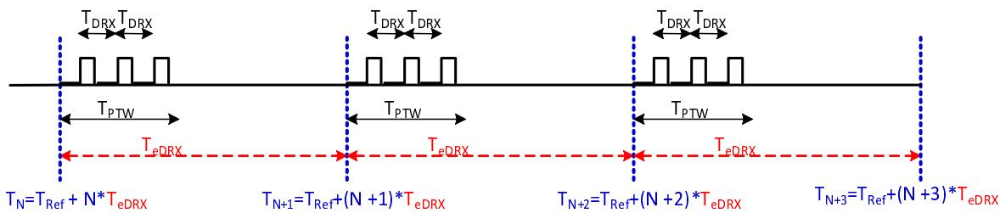  
Figure 4.5.13.2-1 The usage of PTW and independence of the extended Idle mode DRX cycle from UE state

In reference to Figure 4.5.13.2-1, upon expiry of the TeDRX timer in the UE, the UE monitors the network for paging for TPTW seconds. TDRX is the duration of the regular DRX cycle.

The necessary information for applying the PTW is provided to the UE over NAS when extended Idle mode DRX is negotiated.

In the case of a paging trigger received in the CN for a UE in PMM Idle state, the CN forwards the paging message towards relevant RAN node(s) immediately if the paging trigger was received within the PTW. Otherwise the CN forwards the paging message shortly ahead of the beginning of the next PTW taking possible imperfections in the synchronization between the CN and the UE into account.

## 4.5.13.3 Paging for extended idle mode DRX in E-UTRAN

## 4.5.13.3.0 General

For WB-E-UTRAN, the extended idle mode DRX value range will consist of values starting from 5.12s (i.e. 5.12s, 10.24s, 20.48s, etc.) up to a maximum of 2621.44s (almost 44 min). For NB-IoT, the extended idle mode DRX value range will start from 20.48s (i.e. 20.48s, 40.96s, 81.92, etc.) up to a maximum of 10485.76s (almost 3 hours) (see TS 36.304 [35]). The extended idle mode DRX cycle length is negotiated via NAS signalling according to clause 4.5.13.1. The MME includes the extended idle mode DRX cycle length for WB-E-UTRAN or NB-IoT in paging message to assist the eNodeB in paging the UE.

NOTE: Heterogeneous support of extended idle mode DRX in tracking areas assigned by MME in a TAI list can result in significant battery life reduction in the UE as compared to homogeneous support by eNodeBs of extended idle mode DRX.

For extended idle mode DRX cycle length of 5.12s, regular paging strategy as defined in TS 23.401 [7] is used.

For extended idle mode DRX cycle length of 10.24s or longer, clauses 4.5.13.3.1, 4.5.13.3.2 and 4.5.13.3.3 apply.

## 4.5.13.3.1 Hyper SFN, Paging Hyperframe and Paging Time Window length

A Hyper-SFN (H-SFN) frame structure is defined on top of the SFN used for regular idle mode DRX. Each H-SFN value corresponds to a cycle of the legacy SFN of 1024 radio frames, i.e. 10.24s. When extended idle mode DRX is enabled for a UE, the UE is reachable for paging in specific Paging Hyperframes (PH), which is a specific set of H-SFN values. The PH computation is a formula that is function of the extended idle mode DRX cycle, and a UE specific identifier, as described in TS 36.304 [35]. This value can be computed at all UEs and MMEs without need for signalling. The MME includes the extended idle mode DRX cycle length and the PTW length in paging message to assist the eNodeB in paging the UE.

The MME also assigns a Paging Time Window length, and provides this value to the UE during attach/TAU procedures together with the extended idle mode DRX cycle length. The UE first paging occasion is within the Paging Hyperframe as described in TS 36.304 [35]. The UE is assumed reachable for paging within the Paging Time Window. The start and end of the Paging Time Window is described in TS 36.304 [35]. After the Paging Time Window length, the MME considers the UE unreachable for paging until the next Paging Hyperfame.

## 4.5.13.3.2 Loose Hyper SFN synchronization

NOTE: This clause applies for extended DRX cycle lengths of 10.24s or longer.

In order for the UE to be paged at roughly similar time, the H-SFN of all eNodeBs and MMEs should be loosely synchronized.

Each eNodeB and MME synchronizes internally the H-SFN counter so that the start of H-SFN=0 coincides with the same a preconfigured time epoch. If eNodeBs and MMEs use different epochs, e.g. due to the use of different time references, the GPS time should be set as the baseline, and the eNodeBs and MMEs synchronize the H-SFN counter based on the GPS epoch considering the time offset between GPS epoch and other time-reference epoch a preconfigured time. It is assumed that eNodeBs and MMEs are able to use the same H-SFN value with accuracy in the order of legacy DRX cycle lengths, e.g. 1 to 2 seconds. There is no need for synchronization at SFN level.

There is no signalling between network nodes required to achieve this level of loose H-SFN synchronization.

## 4.5.13.3.3 MME paging and paging retransmission strategy

NOTE: This clause applies for extended DRX cycle lengths of 10.24s or longer.

When the MME receives trigger for paging and the UE is reachable for paging, the MME sends the paging request. If the UE is not reachable for paging, then the MME pages the UE just before the next paging occasion.

The MME determines the Paging Time Window length based on paging retransmission strategy, and uses it to execute the retransmission scheme.

If the UE is unreachable for paging, then MME may follow clause 4.5.7 "High latency communication" for functionality related to Mobile Terminated communication with high latency.

## 4.5.14 Non-IP Data Delivery (NIDD)

## 4.5.14.1 General

Functions for NIDD may be used to handle mobile originated (MO) and mobile terminated (MT) communication with UEs, where the data used for the communication is considered unstructured from the EPS standpoint (which we refer to also as Non-IP). The support of Non-IP data is part of the CIoT EPS optimizations. The Non-IP data delivery to SCS/AS is accomplished by one of two mechanisms:

Delivery using SCEF;

\- Delivery using a Point-to-Point (PtP) SGi tunnel.

The delivery using a Point-to-Point (PtP) SGi tunnel is further described in TS 23.401 [7].

NIDD via the SCEF is handled using a PDN connection to the SCEF. The UE may obtain a Non-IP PDN connection to the SCEF either during the Attach procedure (see clause 5.3.2.1 of TS 23.401 [7]) or via UE requested PDN connectivity (see clause 5.10.2 of TS 23.401 [7]) or via PDP Context Activation Procedure (see clause 9.2.2.1 of TS 23.060 [6]).

NOTE 1: The UE is not made aware that a particular Non-IP PDN connection is provided via SCEF or via PGW. However, the network informs the UE whether a particular Non-IP PDN connection uses Control plane CIoT Optimization (see TS 23.401 [7]).

An association between the SCS/AS and a PDN Connection to the SCEF needs to be established to enable transfer of non-IP data between the UE and the SCS/AS. When the Reliable Data Service is not enabled, the SCEF determines the association based on provisioned policies that may be used to map an SCS/AS identity and User identity to an APN.

When the Reliable Data Service is enabled, the SCEF determines the association based on port numbers and provisioned policies that may be used to map SCS/AS identities and User identity to an APN (see clause 4.5.14.3).

NOTE 2: When more than one SCS/AS is associated with the same PDN Connection, it is permissible for packets to or from one port number to be associated with more than one SCS/AS. Also, any polices that are applied to the PDN Connection (e.g. APN Rate Control), apply to traffic from all of the SCS/AS's that are associated with the PDN Connection.

NIDD via SCEF uses the User Identity, APN, and the SCS/AS identity to identify which UE a particular T6a/T6b connection belongs to. The User Identity is the user's IMSI. The user's IMSI shall not be used on the interface between SCEF and SCS/AS. In order to perform NIDD configuration or to send or receive NIDD data, the SCS/AS shall use MSISDN or External Identifier to identify the user. In order to facilitate correlation of SCS/AS requests to T6a/T6b connection for a given UE, the HSS provides to the SCEF (see NIDD Configuration procedure in clause 5.13.2) the user's IMSI, and if available, the MSISDN (when NIDD Configuration Request contains an External Identifier) or if available, External Identifier (when NIDD Configuration Request contains an MSISDN).

Depending on operator configuration, the SCEF may perform buffering of MO and/or MT Non-IP data. In this release of specification, neither the MME/SGSN nor the IWK-SCEF are expecting to buffer data pertinent to PDN connection to the SCEF.

The Protocol Configuration Options (PCO) may be used to transfer parameters between the UE and SCEF (e.g. maximum packet size). The PCO's information shall be passed transparently through the MME/SGSN. As specified in TS 23.401 [7] and TS 23.060 [6], the PCO is sent in the EPS Session Management signalling between UE and MME and in GPRS Session Management signalling between UE and SGSN.

The SCEF applies rate control as described in clause 4.7.7 of TS 23.401 [7].

## 4.5.14.2 Enhancements for reliable delivery of NIDD

To ensure reliable delivery of Non-IP data (NIDD) between UE and SCEF using the Control Plane CIoT EPS Optimization, the following functions may be supported by the 3GPP system:

Reliable delivery by acknowledgements on a hop-by-hop basis, i.e. the link layer protocol on each interface used for NIDD uses acknowledgments and nodes apply retransmissions if needed to ensure reliable delivery.

\- The UE may retransmit UL data that was not acknowledged by the RLC on the AS layer in the UE;

The MME may retransmit DL data for which it got a non-delivery indication from the eNodeB (see e.g.   
clause 5.3.4B.3, step 15 of TS 23.401 [7]);

\- The MME indicates to the SCEF the status of the DL data delivery. The SCEF may forward this status to the AS;

Disabling/enabling of MME retransmission is handled by a subscription parameter 'Acknowledgements of downlink NAS data PDUs'.

## 4.5.14.3 Reliable Data Service

The Reliable Data Service may be used by the UE and SCEF or P-GW when using PDN Connection of PDN Type 'Non-IP'. The service provides a mechanism for the SCEF or P-GW to determine if the data was successfully delivered to the UE and for UE to determine if the data was successfully delivered to the SCEF. When a requested acknowledgement is not received, the Reliable Data Service retransmits the packet. The service is enabled or disabled based on APN Configuration per SLA.

When the service is enabled, a protocol is used between the end-points of the Non-IP PDN Connection. The protocol uses a packet header to identify if the packet requires no acknowledgement, requires an acknowledgement, or is an acknowledgment and to allow detection and elimination of duplicate PDUs at the receiving endpoint. Reliable Data Service supports both single and multiple applications within the UE. Port Numbers in the header are used to identify the application on the originator and to identify the application on the receiver. The UE, the SCEF and the P-GW may support reservation of the source and the destination port numbers for their use and subsequent release of the reserved port numbers. Reliable Data Service protocol (as defined in TS 24.250 [47]) also enables applications to query their peer entities to determine which port numbers are reserved and which are available for use at any given time.

During NIDD Configuration, the SCS/AS may indicate which serialization formats it supports for mobile originated and mobile terminated traffic in the Reliable Data Server Configuration. When port numbers are reserved by the UE, the

serialization format that will be used by the application may be indicated to the SCEF. When port numbers are reserved by the SCEF, the serialization format that will be used by the application may be indicated to the UE. If the receiver does not support the indicated serialization format, it rejects the port number reservation request and the sender may reattempt to reserve the port number with a different serialization format. If, during NIDD Configuration, the SCS/AS indicated that it supports multiple serialization formats, the SCEF determines the serialization format that it will indicate to the UE based on local policies and previous negotiations with the UE (e.g. the SCEF may indicate the same serialization format that was indicated by the UE or avoid indicating a serialization format that was previously rejected by the UE). When serialization formats are configured for reserved port numbers, the SCEF stores the serialization formats as part of the Reliable Data Service Configuration and provides the updated Reliable Data Service Configuration to the SCS/AS.

NOTE: Whether the UE Application or SCS/AS supports a given serialization format is outside the scope of 3GPP specifications.

The UE indicates its capability of supporting Reliable Data Service in the Protocol Configuration Options (PCO) to the SCEF or P-GW. If SCEF or P-GW supports and accepts Reliable Data Service then it indicates to the UE, in the PCO, that the Reliable Data Service shall be used if enabled in the APN configuration.

In order to prevent situations where a Reliable Data Service instance needs to interface to both the user and control plane, the Reliable Data Service may only be used with PDN connections for which the "Control Plane Only" indicator is set or with PDN connections using the Control Plane EPS CIoT Optimization when the MME does not move PDN connections to the user plane. The Control Plane CIoT EPS Optimization is defined in TS 23.401 [7].

## 4.5.15 Support of PFD management via SCEF

The PFDs may be managed by the 3rd party SCS/AS via the SCEF, which ensures the secure access to the operator's network even from the 3rd party SCS/AS in untrusted domain. The 3rd party SCS/AS may request to create, update or remove PFDs in the PFDF via the SCEF.

The specific procedure for PFD management via SCEF is described in clause 5.14.1.

## 4.5.16 MSISDN-less MO-SMS via T4

MSISDN-less MO-SMS via T4 is subscription based. The subscription provides the information whether a UE is allowed to originate MSISDN-less MO-SMS. Support for subscription without MSISDN is defined in TS 23.012 [36].

The UE is pre-configured with the Service Centre address that points to SMS-SC that performs this MO-SMS delivery via MTC-IWF delivery procedure. The recipient of this short message is set to the pre-configured address of the SCS/AS (i.e. Address of the destination SME). If UE has multiple external IDs associated to the same IMSI, the external ID that is associated with an SMS may be determined from the UE's IMSI and the Application Port ID value in the TP-User-Data field (see TS 23.040 [12]). The MTC-IWF may obtain the external-ID by querying the HSS with the IMSI and application port ID via S6m.

UE is aware whether the MO-SMS delivery status (success or fail) based on the SMS delivery report from SMS-SC.   
The network does not perform any storing and forwarding functionality for MO-SMS.

NOTE: This way of communicating small data is considered an intermediate method that will eventually be replaced by Non-IP Data Delivery (NIDD) procedures.

## 4.5.17 Enhanced Coverage Restriction Control via SCEF

Restriction of use of the Enhanced Coverage is specified in TS 23.060 [6] and TS 23.401 [7]

The support for Enhanced Coverage Restriction Control via SCEF enables 3rd party service providers to query status of, enhanced coverage restriction or enable/disable enhanced coverage restriction per individual UEs. The specific procedure for Enhanced Coverage Restriction Control via SCEF is described in clause 5.16.

## 4.5.18 MBMS user service for UEs using power saving functions

MBMS Bearer Services as defined in TS 23.246 [29] together with MBMS User Services defined in TS 26.346 [38], or MBMS Bearer Services accessed via the MB2 interface defined in TS 23.468 [30], provide means to deliver data or

triggering payload over broadcast to multiple UEs at the same time. However, for devices using power saving functions, e.g. Power Saving Mode (defined in clause 4.5.4) or extended idle mode DRX (defined in clause 4.5.13), the UEs are usually unreachable for long periods of time. Moreover, different UEs are likely to be reachable at different times. Therefore, it is important that the time intervals the UE stays awake to receive MBMS user service or to discover if there is any MBMS user service scheduled for delivery, should not necessarily be the same as the reachable intervals negotiated for extended idle mode DRX or PSM.

If a UE becomes unreachable for unicast service due to either PSM or extended idle mode DRX, the UE may still perform MBMS specific procedures, e.g. activation/deactivation of the MBMS bearer service, MBMS data transfer reception, reception of service announcement (if needed), as defined in TS 23.246 [29] and TS 26.346 [38].

For those intervals the UE needs to be awake for MBMS bearer service, the following cases can be identified:

1. When the UE's need to be awake due to MBMS coincides with the UE already being in connected mode due to other reasons, the UE follows normal connected mode procedures.

2. When the UE's need to be awake due to MBMS coincides with the UE already being in idle mode and reachable (e.g. in active time for PSM or PTW for eDRX) the UE follows normal idle mode procedure.

3. When the UE's need to be awake due to MBMS coincides with the UE being in idle mode and in deep sleep, i.e. unreachable for paging to the network, the UE leaves the deep sleep state only to perform procedures related to MBMS service.

If the MBMS user service does not require the UE to transition to connected mode, i.e. the UE receives MBMS user service in idle mode, then the UE does not update the MME to become reachable for paging. The UE would therefore still be considered unreachable for paging in the MME. This minimizes the signalling between the UE and the network.

If the MBMS user service requires the UE to transition to connected mode (e.g. for HTTP reception reporting, file repair, etc.) then the UE performs regular procedures for ECM connected mode. This would therefore make the UE become reachable in the network for other unicast services.

4. When the UE is in the middle of an MBMS data transfer, and the UE is scheduled to move to deep sleep due to power saving, e.g. end of PTW for extended idle mode DRX or expiration of active time for PSM, then the UE does not go to deep sleep during the remainder of the current MBMS data transfer.

NOTE 1: If at the end of the current MBMS data transfer, the UE knows there is another MBMS data transfer scheduled soon, in that case depending of the time between MBMS data transfers, the UE can decide to go to sleep between MBMS data transfers.

There are two possible ways the UE can be notified of an upcoming MBMS broadcast session start:

1. If MBMS User Services defined in TS 26.346 [38] is used, the UE needs to receive MBMS service announcement while awake (i.e. while in connected mode, or while idle mode during PTW for extended idle mode DRX, or active time for PSM). The UE wakes up if not already awake for MBMS service reception based on the schedule received in the service announcement. For this option, the MBMS service announcement may be provided via MBMS broadcast service announcement or via any of the possible unicast service announcement delivery mechanisms defined in TS 23.246 [29]. If MBMS access via the MB2 interface as defined in TS 23.468 [30] is used, similar mechanisms need to be provided by the application layer using unicast mechanisms.

NOTE 2: In order to allow all UEs using power saving function to receive the service announcement in time to be able to receive the MBMS broadcast data delivery, the application server needs to be aware of the maximum unreachable period of the UEs.

2. The UE may be configured by the application server with specific times to perform MBMS procedures, and wakes up from deep-sleep if needed at those times. The UE may also receive MBMS service announcements and/or MBMS broadcast delivery at those times (if needed).

NOTE 3: The configuration (e.g. TMGI, start time) is out of scope of 3GPP and assumed to be performed between application server and UE at application layer. The application server needs to initiate MBMS bearer service procedures during those time intervals.

## 4.5.19 Enhancements to Location Services for CIoT

Location Services (LCS) are defined in TS 23.271 [33]. In order to support Location Services for CIoT UEs, following enhancements to Location Services are defined (refer to TS 23.271 [33] for detailed procedures):

Deferred location for the UE availability event:

When extended idle mode DRX or PSM is used, a deferred location request for UE available event allows an LCS Client to obtain the UE location as soon as the UE becomes available.

NOTE: Without deferred location for UE available event, an LCS Client can configure a Monitoring Event for UE Reachability and issue a Mobile Terminated Location Request (MT-LR) when the UE reachability is reported, but this will fail if the UE becomes unreachable again before the MT-LR is performed.

The procedures for deferred location from V-GMLC to the external client and the EPC Mobile Terminating Location Request (EPC-MT-LR) procedure are combined properly in the V-GMLC as specified TS 23.271 [33].

\- Indication of UE RAT type and/or coverage level to Evolved Serving Mobile Location Centre (E-SMLC):

Providing an E-SMLC with an indication of the RAT type and/or the coverage level may enable the E-SMLC to appropriately determine a maximum size, maximum frequency and maximum transfer delay for positioning messages sent to and from the UE.

\- RAT type and coverage level indications from the MME to the E-SMLC are introduced in TS 23.271 [33].

\- For the case of coverage level, and indication of coverage level from eNB to MME is introduced.

Support of UE positioning measurements in idle mode:

NB-IoT UEs or Cat-M1 UEs may perform measurements for some positioning methods only when in ECM-IDLE state due to minimal resources.

An E-SMLC that is aware of this (e.g. from an indication sent by the UE) may allow additional response time to the UE (e.g. in the QoS) to obtain the measurements. An MME that is aware of this (e.g. from the UE access type) may also allow additional time for a location session to complete.

\- Addition of Periodic and Triggered Location for EPC:

A flexible periodic and/or triggered Mobile Terminated Location Request (MT-LR) capability is useful to enable UE location at times other than when a UE normally becomes available and/or with better granularity than a cell ID.

New procedures are introduced in TS 23.271 [33] to initiate and maintain deferred periodic and triggered event reporting and to cancel reporting by an LCS client, UE or network entity. The area event, periodic event and motion event are clarified in the context of EPC access. Impacts to LCS messages between an LCS Client and GMLC, between GMLCs and between an H-GMLC and PPR are included.

Support of Last Known Location for a UE that are unreachable for long periods of times:

For UEs that are unreachable for long periods of time, e.g. using extended idle mode DRX or PSM, last known location support enables an external LCS client to receive some information on UE location without waiting (e.g. a few hours) for the UE to become reachable.

The EPC-MT-LR procedure defined in TS 23.271 [33] is enhanced to support last known location based on a last known serving cell.

## 4.5.20 MBMS user service for NB or M UE categories

TS 36.306 [41] defines UE categories M1, M2 for WB-E-UTRAN and NB1, NB2 for NB-IoT that can only support limited bandwidth and transport block size. In order for UEs of these categories to be able to receive MBMS service, E-UTRAN needs to be able to determine the UE category that applies to the specific service indicated by the TMGI.

In order for E-UTRAN to know the UE categories for MBMS bearer service, the UE Capability for MBMS (which includes UE Category for MBMS and optionally associated coverage level for MBMS) is provided by SCS/AS to the

BMSC via the SCEF. Using PLMN specific QCI information, the characteristics are signalled by the BM-SC to E-UTRAN following the procedures described in clause 5.5.1 of the present specification and TS 23.246 [29]. This includes:

QCI(s) that are determined taking into account the UE Category for MBMS that indicates the "M" or "NB" category (M1, M2, NB1, NB2) as defined in TS 36.306 [41] that can receive the service indicated by the TMGI. E-UTRAN uses the QCI to determine the radio parameters that would determine the categories of UEs that are required to receive the service. EUTRAN is configured with the QCI to UE Category for MBMS mapping.

NOTE 1: The way UE Category for MBMS needs to be interpreted is to allow PLMN specific QCI to be derived by the BMSC that would allow the MBMS service to be received by each UE type. For example, for UE Category for MBMS "M1 and M2", a QCI will be derived that will map to radio configuration that would allow M1 and M2 UEs to receive the service over the radio interface. For UE Category Info "NB2", a QCI will be derived that will map to radio configuration that would allow only NB2 UEs to receive the service over the radio interface.

Optionally, the SCS/AS may provide additional information regarding the coverage level for the related MBMS service. The coverage level indicates if the MBMS service is intended to be received by UEs located in extended coverage and is used by E-UTRAN to determine the radio configuration required, e.g. determine the number of repetitions, to reach the UEs that receive the MBMS service. Three levels of Coverage Level for MBMS are defined as "normal", "medium" and "high". The coverage level information, when provided, shall be reflected via the QCI.

NOTE 2: It is up to E-UTRAN implementation how the coverage level information can be used.

NOTE 3: A single QCI does not allow for both NB and M category UEs to receive the same service indicated by one TMGI.

## 4.5.21 Network Parameter Configuration via SCEF

The SCS/AS may issue network parameter configuration requests to the network, via the SCEF, to suggest parameter values that may be used for Maximum Latency, Maximum Response Time and Suggested Number of Downlink Packets. By suggesting values for these parameters, the SCS/AS may influence certain aspects of UE/network behaviour such as the UE's PSM, extended idle mode DRX, and extended buffering configurations. Based on operator's configuration, the SCEF and HSS may choose to accept, reject or modify the suggested configuration parameter value. The SCEF indicates accepted/modified values to the SCS/AS. This feature can also be used to suggest parameter values for a group of UEs.

NOTE: The SCS/AS can observe how the MME ultimately configures the UE for PSM and extended idle mode DRX by configuring "UE Reachability" or "Availability after DDN failure" notifications with the Idle Status Indication option (see clause 4.5.7).

The specific procedure for Network Parameter Configuration via SCEF is described in clause 5.18.

## 4.5.22 RACS information provisioning

The UCMF (UE radio Capability Management Function) stores all UE Radio Capability ID mappings in a PLMN and is responsible for assigning every PLMN-assigned UE Radio Capability ID in this PLMN, see TS 23.401 [7]. Provisioning of Manufacturer-assigned UE Radio Capability ID entries in the UCMF is performed from an AS that interacts with the UCMF either directly (according to TS 23.502 [48] and TS 29.675 [49]) or via the SCEF (according to TS 29.122 [44] or via Network Management).

## 4.5.23 Support of satellite access

Support of satellite access for NB-IoT, WB-E-UTRAN and LTE-M is specified in TS 23.401 [7]. Unless otherwise stated in this specification, MTC functionality applies to NB-IoT, WB-E-UTRAN and LTE-M over satellite access. To support satellite access for NB-IoT, WB-E-UTRAN and LTE-M, the system enhancements including satellite RAT type, network/access selection, verification of UE location and Tracking Area Update, etc., are defined in TS 23.401 [7].

## 4.6 Identifiers

## 4.6.1 General

Identifiers relevant for the 3GPP network are specified in TS 23.003 [4].

## 4.6.2 External Identifier

A subscription used for MTC has one IMSI and may have one or several External Identifier(s) that are stored in the HSS. If there are several External Identifiers, the HSS shall store one default External Identifier and one or more additional External Identifiers.

NOTE 1: If several External Identifiers are mapped to one IMSI, some functions might not work in this release of the specification.

External Identifier shall be globally unique. It shall have the following components:

a. Domain Identifier: identifies a domain that is under the control of a Mobile Network Operator (MNO). The Domain Identifier is used to identify where services provided by the operator network can be accessed (e.g. MTC-IWF or SCEF provided services). An operator may use different domain identifiers to provide access to different services and/or MTC Service Providers.

b. Local Identifier: Identifier used to derive or obtain the IMSI. The Local Identifier shall be unique within the applicable domain. It is managed by the Mobile Network Operator.

NOTE 1: Use of External Identifiers is not restricted to MTC only.

NOTE 2: Use of IMSI outside the 3GPP operator domain is dependent on the operator policy.

## 4.6.3 External Group Identifier

A subscription used for MTC may be associated to one or several IMSI-Group Identifier(s) (see TS 23.003 [4]) that are stored in the HSS.

A subscription may be associated to one or several External Group Identifier(s) that are stored in the HSS. The External Group Identifier shall be formatted the same as the External Identifier that is described in clause 4.6.2. The Local Identifier is used to derive or obtain an IMSI-Group Identifier. An External Group Identifier maps to an IMSI-Group Identifier. An IMSI-Group Identifier maps to zero, one or several External Group Identifiers.

The External Group Identifier is used on the interface between the SCS/AS and the SCEF and on the interface between the SCEF and the HSS. This identifier is used in procedures such as group message delivery, communication pattern provisioning, and monitoring event configuration and deletion. When the External Group Identifier is used in the communication pattern provisioning or monitoring event configuration and deletion procedures, the HSS shall be able to resolve the External Group Identifier to an IMSI-Group Identifier and the associated External Identifier or MSISDN for each of the IMSIs in the IMSI-Group. The purpose of this association is to enable the SCEF to determine what UE Identifier to use (MSISDN or External Identifier) and derive APN from SCS/AS Identifier and the MSISDN or External Identifier to route non-IP data to the UE when non-IP data is sent to an External Group Identifier.

NOTE: Additional information can assist HSS to resolve the IMSI-Group Identifier to MSISDN or External Identifier for each of the IMSIs in the IMSI-Group, e.g. Provider Information, Service information (e.g. NIDD, MONTE). How the HSS resolves to one of the UE Identifier(s) (MSISDN or External Identifier) in a UE's subscription is implementation specific.

## 4.7 Addressing

For UEs used for Machine-Type Communications (MTC) IP Addressing principles and solutions for different scenarios are described in clause 5 of TS 23.221 [21].

## 4.8 Security Aspects

## 4.8.1 Security Requirements

## 4.8.1.0 General

Security requirements are described in TS 33.187 [25].

4.8.1.1 Void

## 4.8.1.2 Void

## 4.9 SCEF - SCS/AS API Procedures

## 4.9.1 General

This clause identifies commonalities (for both parameters and procedures) found on T8 interface.

## 4.9.2 Common Parameters

This clause defines parameters which are required on T8 interface:

T8 Long Term Transaction Reference ID (TLTRI) is a parameter which refers to long term transaction (e.g. NIDD Configuration, Group Message Request, Monitoring Event configuration) between the SCEF and the SCS/AS when using T8 interface. Long term transactions consist of one or more request messages which may have one or more response messages. TLTRI is assigned by the SCEF and is unique through the duration of the transaction. It is stored on both the SCEF and the SCS/AS for the duration of the transaction.

NOTE 1: Short term transaction identifiers for the T8 interface are not described in this specification as stage 3 mechanisms (defined in TS 29.122 [44]) ensure the correlation between request and response message.

T8 Destination Address is a parameter that is included by the SCS/AS in T8 messages where the SCS/AS can request response to a specific address.

Accuracy is an optional parameter which indicates the desired level of accuracy of the requested location information. It may be at cell level (CGI/ECGI) for GPRS/UTRAN/E-UTRAN, or (eNodeB-ID) eNodeB level, or (TAI/RAI) TA/RA level, or (PLMN-ID) PLMN-level, or TWAN identifier in TWAN access, or other formats, e.g. shapes (e.g. polygons, circles, etc.) or civic addresses (e.g. streets, districts etc.) or geographic co-ordinate (latitude, longitude), etc.

NOTE 2: The exact definition of other formats such as shapes or civic addresses or geographic coordinate is left up to Stage 3.

Idle Status Indication is an optional parameter that allows the SCS/AS to retrieve extra information, e.g. as specified in step 5 of clause 5.6.3.3, when a UE, for which PSM or extended idle mode DRX is enabled, transitions into idle mode.

TLTRI for Deletion identifies the TLTRI of the long-term transaction being requested for deletion.

## 4.10 Charging Principles

Depending on operator configuration, accounting functionality for transactions over T8 may be supported by the SCEF.

NOTE: The details of the required accounting information are outside the scope of the present document.

Depending on operator configuration the MME, SGSN, SCEF and IWK-SCEF support accounting functionality for Monitoring Events, and NIDD via SCEF feature.

Accounting and charging information support for Monitoring Events is specified in TS 32.240 [28] and TS 32.278 [39].

Accounting and charging information support for NIDD via SCEF feature is specified in TS 32.240 [28] and TS 32.253 [40].

## 5 Functional Description and Information Flow

## 5.1 Control and user plane

## 5.1.1 Control Plane

## 5.1.1.1 HSS – MTC-IWF

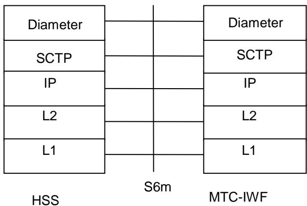

## Legend:

Diameter: This protocol supports transferring of subscription and UE related information for identifier mapping and serving node information retrieval between MTC-IWF and HSS (S6m). Diameter is defined in RFC 3588 [15].

Stream Control Transmission Protocol (SCTP): This protocol transfers signalling messages. SCTP is defined in RFC 4960 [16].

## Figure 5.1.1.1-1: Control Plane for S6m interface

NOTE: It is up to stage3 to define interworking between diameter-based s6m and map-based interface to the legacy HLR.

## 5.2 Device triggering procedures

5.2.1 Device triggering procedure over Tsp  
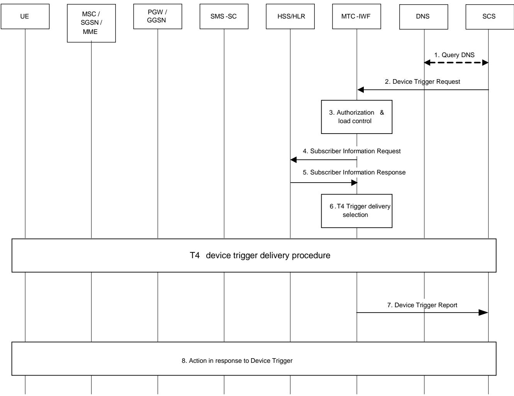  
Figure 5.2.1-1: Device triggering procedure over Tsp

1. The SCS determines the need to trigger the device. If the SCS has no contact details for an MTC-IWF, it may determine the IP address(es)/port(s) of the MTC-IWF by performing a DNS query using the External Identifier or using a locally configured MTC-IWF identifier.

2. The SCS sends the Device Trigger Request (External Identifier or MSISDN, SCS Identifier, trigger reference number, validity period, priority, Application Port ID and trigger payload) message to the MTC-IWF. The SCS includes a trigger payload that contains the information destined for the MTC application, along with the information to route it to the MTC application. The Application Port ID is set to address a triggering function within the UE.

NOTE 1: The assignment of SCS identifier is out of scope of 3GPP. The SCS identifier should meet the 3GPP / operator requirement. As an example it may be possible to use MSISDN as SCS identifier.

3. The MTC-IWF checks that the SCS is authorised to send trigger requests and that the SCS has not exceeded its quota or rate of trigger submission over Tsp. If this check fails the MTC-IWF sends a Device Trigger Confirm message with a cause value indicating the reason for the failure condition and the flow stops at this step. Otherwise, the flow continues with step 4.

4. The MTC-IWF sends a Subscriber Information Request (External Identifier or MSISDN and SCS Identifier) message to the HSS/HLR to determine if SCS is authorized to trigger the UE, to resolve the External Identifier or MSISDN to IMSI and retrieve the related HSS stored "Routing information" including the identities of the UE's serving CN node(s).

NOTE 2: The MTC-IWF may cache authorization and routing information for the UE. However, this may increase the probability of trigger delivery attempt failures when the cached serving node information is stale.

NOTE 3: Optionally, mapping from External Identifiers to MSISDN is also provided for legacy SMS infrastructure not supporting MSISDN-less SMS.

5. The HSS/HLR sends the Subscriber Information Response (IMSI and/or MSISDN and related "Routing information" including the serving node(s) identities, cause) message. HSS/HLR policy (possibly dependent on the VPLMN ID) may influence which serving node identities are returned. If the cause value indicates the SCS is not allowed to send a trigger message to this UE, or there is no valid subscription information, or "Absent subscriber" is received from HSS and the validity period of this trigger message is set to zero, the MTC-IWF sends a Device Trigger Confirm message with a cause value indicating the reason for the failure condition and the flow stops at this step. Otherwise this flow continues with step 6a.

6. The MTC-IWF attempts T4 trigger delivery procedure according to clause 5.2.2. MTC-IWF may deliver device trigger as DL user data to the UE via SCEF using mobile terminated NIDD procedure as defined in clause 5.13.3. Otherwise, this flow continues with step 7.

7. The MTC-IWF sends the Device Trigger Report (External Identifier or MSISDN and trigger reference number) message to the SCS with a cause value indicating the trigger delivery outcome (e.g. succeeded, unknown or failed and the reason for the failure). The MTC-IWF generates the necessary CDR information including the External Identifier or MSISDN and SCS Identifier.

8. In response to the received device trigger, the UE takes specific actions that take into consideration the content of the trigger payload. This response typically involves initiation of immediate or later communication with the SCS or an AS.

5.2.2 Trigger Delivery using T4  
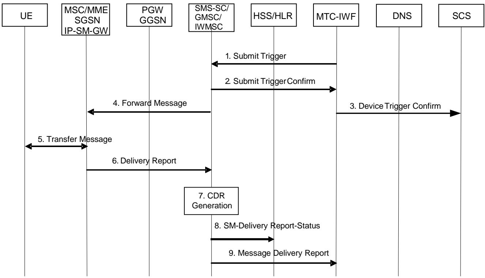  
Figure 5.2.2-1: T4 Trigger Delivery Flow

1. The MTC-IWF selects a suitable SMS-SC based on configured information. The MTC-IWF sends a Submit Trigger (External Identifier or MSISDN, IMSI, SCS Identifier, trigger reference number, validity period, priority, serving node ID(s) if available from HSS, SMS Application port ID, trigger payload, Trigger Indication) message to the SMS-SC. The SMS-SC should avoid an initial HSS/HLR interrogation (SRI for SM) when it has already received necessary parameters in the Submit Trigger message from the MTC-IWF. The MTC-IWF forwards the Application Port ID received from SCS as the SMS Application port ID which is used to address the triggering function within the UE. The Trigger Indication is a standardised identifier to allow the UE and the

network to distinguish an MT message carrying device triggering information from any other type of messages.   
The SMS-SC does any necessary segmentation for larger messages.

If the MTC-IWF indicates that "Absent subscriber" was received from HSS, the SMS-SC should not submit the message, but store it directly and send Routing Information for SM to request the HSS to add the SMS-SC address to the Message Waiting List.

2. The SMS-SC sends a Submit Trigger Confirm message to the MTC-IWF to confirm that the submission of the SMS has been accepted by the SMS-SC.

3. The MTC-IWF sends a Device Trigger Confirm message to the SCS to confirm that the Device Trigger Request has been accepted for delivery to the UE.

4, 5, 6. The short message is delivered to the UE (see MT-SMS procedures specified in TS 23.040 [12]). This may involve delivery attempts in MSC or MME, SGSN or over IMS via IP-SM-GW (see MT-SMS without MSISDN procedures specified in TS 23.204 [13]).

The SMS-delivered trigger payload is processed and handled by the triggering function in the UE. Any information contained within the trigger payload is forwarded to the related or addressed UE-application.

7. The SMS-SC generates the necessary CDR information and includes the SCS Identifier. The SMS Application port ID which is included in the SM User Data Header and the Trigger Indication are included in the CDRs in order to enable differentiated charging. The SMS-SC stores the trigger payload, without routing information. If the message delivery fails and is attempted to be delivered again, HSS interrogation will be performed.

8. If the message delivery fails and the validity period of this trigger message is not set to zero, the SMS-SC shall send a SM Message Delivery Status Report to request the HSS to add the SMS-SC address to the Message Waiting list. When the message delivery is later re-attempted, a new HSS interrogation will be performed by the SMS-GMSC using IMSI or MSISDN. HSS interrogations using IMSI shall not be forwarded or relayed to SMS-Router or IP-SM-GWs. HSS may include up to three serving node identities (MSC or MME, SGSN, IP-SM-GW) in the response to SMS-GMSC.

9. If the message delivery fails and depending on the failure cause either directly or when validity period of the trigger message expires, or when the message delivery succeeds, the SMS-SC shall send a Message Delivery Report (cause code, trigger reference number, SCS Identifier) to the MTC-IWF.

## 5.2.3 Device triggering recall/replace procedures

5.2.3.1 Device trigger recall/replace procedure over Tsp  
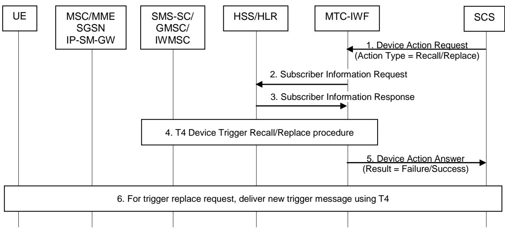  
Figure 5.2.3.1-1: Device trigger recall/replace procedure over Tsp

1. The SCS determines it needs to recall/replace a trigger message that it has previously submitted. The SCS sends Device Action Request (External Identifier or MSISDN, SCS Identifier, old trigger reference number, new trigger reference number, validity period, priority, Application Port ID and trigger payload) message with action type set to "Trigger Recall Request" or "Trigger Replace Request". The SCS needs to include new trigger reference number, validity period, priority, Application Port ID and trigger payload for trigger replace request only. The old trigger reference number indicates the trigger reference number which was assigned to the previously submitted trigger message that the SCS wants to cancel. The new trigger reference number is assigned by the SCS to the newly submitted trigger message.

If the SCS is not authorized to perform device triggering or the SCS has exceeded its quota or rate of trigger submission over Tsp, the MTC-IWF rejects the Device Action Request message with action type set to "Trigger Recall Request" or "Trigger Replace Request" by sending a Device Action Answer message with a cause value indicating the reason for the failure condition, and the flow stops at this step.

NOTE 1: The validity period in a trigger replace request needs to be greater than zero for the MTC-IWF to attempt its delivery.

2. The MTC-IWF sends a Subscriber Information Request (External Identifier or MSISDN and SCS Identifier) message to the HSS/HLR to determine if SCS is authorized to perform device triggering to the UE. This message is also to resolve the External Identifier or MSISDN to IMSI and retrieve the related HSS stored "Routing information" including the identities of the UE's serving CN node(s) which are needed for trigger replace request only.

NOTE 2: Optionally, mapping from External Identifiers to MSISDN is also provided for legacy SMS infrastructure not supporting MSISDN-less SMS.

3. The HSS/HLR sends the Subscriber Information Response (IMSI and/or MSISDN and related "Routing information" including the serving node(s) identities, cause) message. The IMSI and/or MSISDN and related "Routing information" including the serving node(s) identities in the Subscriber Information Response message is only needed for trigger replace request and not used by MTC-IWF for trigger recall request. HSS/HLR policy (possibly dependent on the VPLMN ID) may influence which serving node identities are returned. If the cause value indicates the SCS is not allowed to perform device triggering to this UE, or there is no valid subscription information, the MTC-IWF sends a Device Action Answer message with a cause value indicating the reason for the failure condition and the flow stops at this step. Otherwise this flow continues with step 4.

4. If trigger message which should be recalled or replaced was submitted to a SMS-SC as defined in clause 5.2.2, T4 device trigger replace procedure according to clause 5.2.3.2 or T4 device trigger recall procedure according to clause 5.2.3.3 is performed.

5. The MTC-IWF indicates trigger recall/replace success or failure in Device Action Answer message to the SCS. The MTC-IWF generates the necessary CDR information including the External Identifier or MSISDN and SCS Identifier.

If recall/replace of a trigger is successful, this is reflected in the "Device Trigger Report" of the original trigger message (per step 7 in clause 5.2.1) with delivery outcome "Recalled"/"Replaced".

NOTE 3: If recall/replace of a trigger failed because the trigger was already delivered or has expired, a "Device Trigger Report" of the original trigger will already have been created with the appropriate delivery outcome.

6. For trigger replace request, the new trigger message will be delivered to the UE immediately or when the UE is available following steps 4 - 9 as defined in clause 5.2.2.

5.2.3.2 Replace procedure for trigger delivery using T4  
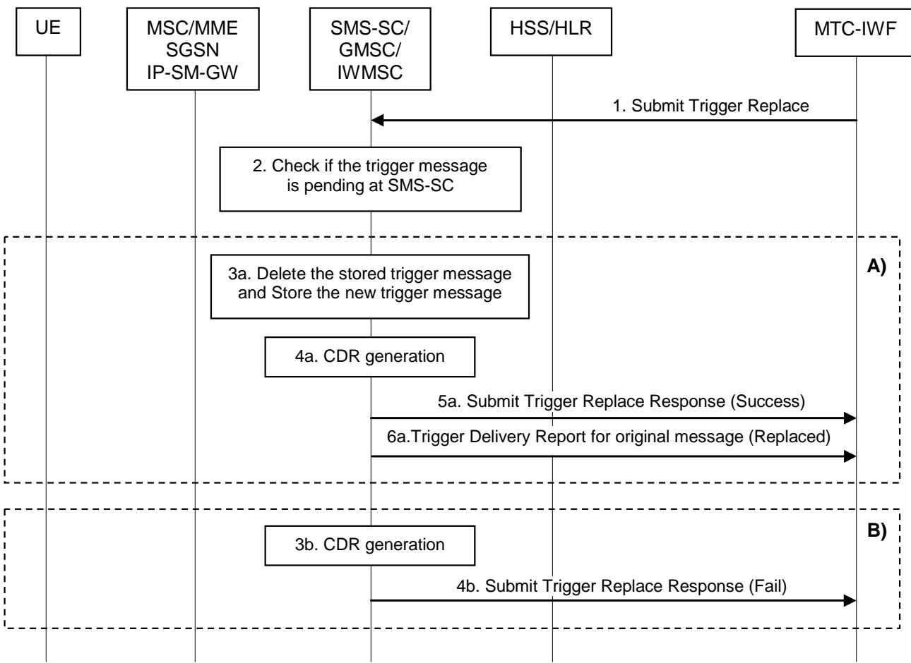  
Figure 5.2.3.2-1: Replace procedure for trigger delivery using T4

1. Based on the Action type in Device Action Request message, the MTC-IWF sends a Submit Trigger Replace (External Identifier or MSISDN, IMSI, SCS Identifier, old trigger reference number, new trigger reference number, validity period, priority, serving node ID(s) if available from HSS, SMS Application port ID, trigger payload, Trigger Indication) message to the SMS-SC. The MTC-IWF selects the SMS-SC to which the old trigger message was submitted, e.g. based on configured information.

2. The SMS-SC determines whether the trigger message identified by the External Identifier or MSISDN, SCS Identifier, and old trigger reference number in the received Submit Trigger Replace message, is pending at SMS-SC.

A) If the trigger message is pending at SMS-SC, steps 3a - 6a are performed.

3a. The SMS-SC deletes the stored trigger message and stores the new trigger message to deliver it when the UE is available.

4a. The SMS-SC generates the necessary CDR information and includes the SCS Identifier. The SMS Application port ID which is included in the SM User Data Header and the Trigger Indication are included in the CDRs in order to enable differentiated charging.

5a. The SMS-SC sends a Submit Trigger Replace Response message to the MTC-IWF to inform that the previously submitted trigger message has been successfully replaced by the new one in the SMS-SC.

6a. The SMS-SC sends a Trigger Delivery Report for the original trigger message indicating that this message has been replaced.

NOTE: Step 5a and step 6a are combined in single message in Stage 3.

B) If the trigger message is not pending at SMS-SC, steps 3b - 4b are performed. In this case, the SMS-SC treats the new trigger message as a trigger message that it has to deliver to the UE.

3b. The SMS-SC generates the necessary CDR information and includes the SCS Identifier. The SMS Application port ID which is included in the SM User Data Header and the Trigger Indication are included in the CDRs in order to enable differentiated charging.

4b. The SMS-SC sends a Submit Trigger Replace Response message to the MTC-IWF to inform that the replace request failed and the SMS-SC shall deliver the new trigger message.

## 5.2.3.3 Recall procedure for trigger delivery using T4

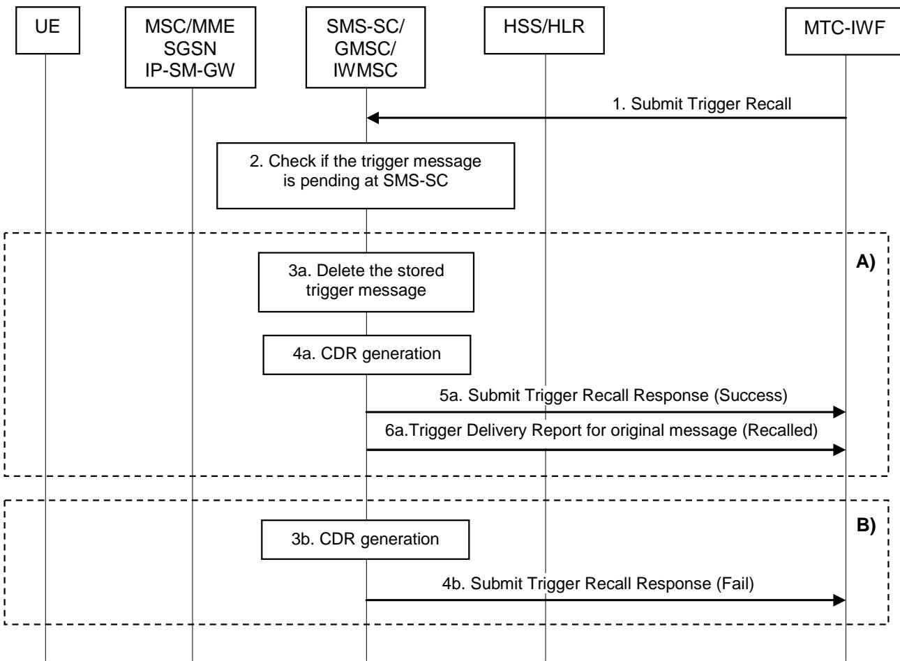  
Figure 5.2.3.3-1: Recall procedure for trigger delivery using T4

1. Based on the Action type in Device Action Request message, the MTC-IWF sends a Submit Trigger Recall (External Identifier or MSISDN, SCS Identifier, old trigger reference number) message to the SMS-SC. The MTC-IWF selects the SMS-SC to which the old trigger message was submitted, e.g. based on configured information.

2. The SMS-SC determines whether the trigger message identified by External Identifier or MSISDN, SCS Identifier, and old trigger reference number in the received Submit Trigger Recall message, is pending at SMS-SC.

A) If the trigger message is pending at SMS-SC, steps 3a - 6a are performed.

3a. The SMS-SC deletes the stored trigger message.

4a. The SMS-SC generates the necessary CDR information and includes the SCS Identifier. The SMS Application port ID which is included in the SM User Data Header and the Trigger Indication are included in the CDRs in order to enable differentiated charging.

5a. The SMS-SC sends a Submit Trigger Recall Response message to the MTC-IWF to inform that the previously submitted trigger message has been successfully deleted in the SMS-SC.

6a. The SMS-SC sends a Trigger Delivery Report for the original trigger message indicating that this message has been recalled.

NOTE: Whether step 5a and step 6a are combined in single message in Stage 3.

B) If the trigger message is not pending at SMS-SC, steps 3b - 4b are performed.

3b. The SMS-SC generates the necessary CDR information and includes the SCS Identifier. The SMS Application port ID which is included in the SM User Data Header and the Trigger Indication are included in the CDRs in order to enable differentiated charging.

4b. The SMS-SC sends a Submit Trigger Recall Response message to the MTC-IWF with a cause value indicating that the recall request failed.

## 5.3 Information Storage

## 5.3.0 General

This clause describes the context information that is stored in the different nodes for MTC device trigger procedure and NIDD procedures.

## 5.3.1 Trigger Information in SMS-SC (Triggering with T4)

This table includes information that needs to be stored in SMS-SC for triggering with T4.

Table 5.3.1-1: SMS-SC trigger information  
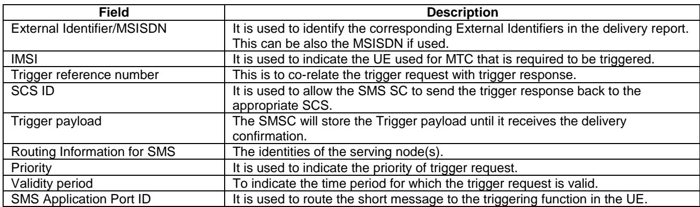  
NOTE 1: The Trigger Payload is stored as user data in SMS-SC.

NOTE 2: Priority, Validity period and SMS Application Port ID are included in the Trigger payload.

## 5.3.2 SCEF

The SCEF maintains the following EPS bearer context information for UEs. Table 5.3.2-1 shows the context fields for one UE.

Table 5.3.2-1: SCEF EPS bearer context  
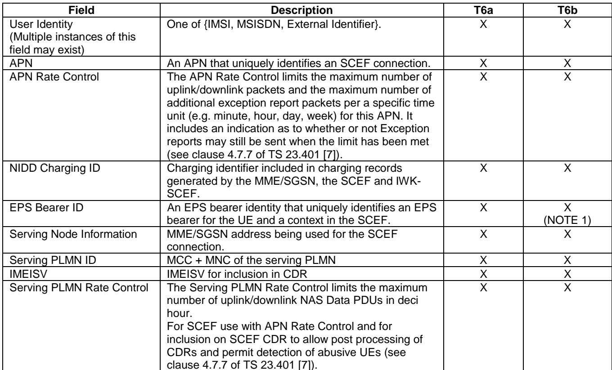

NOTE 1: The SGSN uses the NSAPI of the PDP Context used for SCEF communication as an EPS Bearer ID when T6b is used.

## 5.4 Security Procedures

5.4.0 General

The security procedures are specified in TS 33.187 [25].

5.4.1 Void

5.4.2 Void

## 5.5 Group message delivery procedures

## 5.5.1 Group message delivery using MBMS

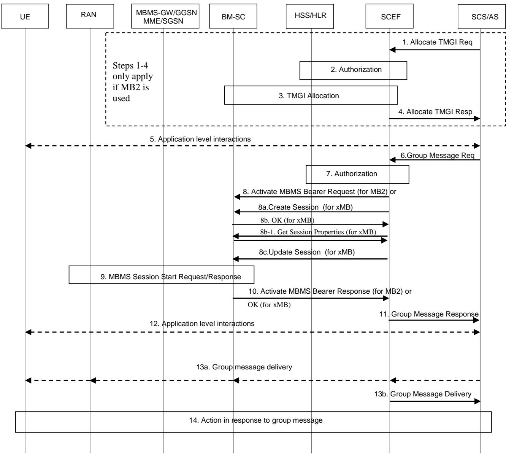  
Figure 5.5.1-1: Group message delivery using MBMS

NOTE 1: Unless the SCS/AS wants to extend the expiration time for an allocated TMGI, steps 1-5 can be skipped if a valid TMGI allocation already exists or if the MBMS bearer activation is performed without TMGI preallocation.

## If MB2 is used:

1. If there is no assigned TMGI for an External Group Id, the SCS/AS sends the Allocate TMGI Request (External Group ID, SCS Identifier, (optional) location information, Accuracy) message to the SCEF. The SCS/AS may determine the IP address(es)/port(s) of the SCEF by performing a DNS query using the External Group Identifier or using a locally configured SCEF identifier/address. The location information restricts the distribution of the group message. It takes the format indicated in Accuracy parameter which can be either a list of cell IDs, or a list of MBMS Service Areas, or civic addresses, or a geographic area, or a combination of any of the above. Using the location information, the SCEF checks whether the SCS/AS is authorized to request TMGI allocation.

If the expiration time for a previously allocated TMGI is to be extended, in addition to External Group ID, SCS Identifier and location/area information, the previously allocated TMGI is included in the Allocate TMGI Request message.

NOTE 2: A single SCEF can be connected to multiple BM-SCs in a given PLMN. The location information is used to identify BM-SC(s) to which MB2-C/U messages are to be sent to.

2. The SCEF determines whether the SCS/AS is authorized to request TMGI allocation.

3. The SCEF initiates TMGI allocation by the BM-SC (see TMGI Allocation Procedure specified in TS 23.468 [30]). In this procedure, if the TMGI is not included in step 1, the SCEF requests allocation of only one TMGI. If a TMGI is included in step 1, the SCEF requests to extend the TMGI expiration time for that TMGI. The SCEF stores TMGI and TMGI expiration received in this step.

4. The SCEF sends Allocate TMGI Response (Cause, TMGI, TMGI expiration) message to the SCS/AS. Cause value indicates success or failure of the requested procedure. In the case of failure, the reason for the failure condition is also included. The TMGI allocated by the BM-SC to which the SCS/AS is expected to send the group message, and TMGI expiration indicating the expiration time for the TMGI are also included.

NOTE 3: The SCEF may cache the serving BM-SC Identity information and mapping between External Group ID and TMGI.

Steps 5 to 14 are skipped if the SCS/AS only wants to extend the expiration time of the TMGI (MB2 only).

5. Application level interactions may be applied for the devices of specific group to retrieve the related MBMS service information, e.g. TMGI, start time, etc. in the case of MB2. Application level interactions between the UE and the SCS/AS are out of scope of this specification.

## If xMB is used, steps 1 to 5 are skipped.

6. The SCS/AS sends the Group Message Request (External Group Identifier, SCS Identifier, TMGI (MB2 only), Message Delivery Stop Time (xMB only), optional (Group Message Payload, location information, Accuracy, Message Delivery Start Time) message to the SCEF.

In the case of xMB, the SCEF creates a service using xMB for the group message and associates the external Group Identifier with the HTTP REST resource identifier of the service provided by the BM-SC upon service creation. The then SCEF forwards either only the ServiceID (see Table 5.4-1 in TS 26.348 [46]) to the SCS/AS or all service announcement. After the service is created, the SCS/AS triggers session creation towards the SCEF.

The SCEF assigns a TLTRI that identifies this group message delivery request. The location information is included to identify the location over which group message is to be sent. It takes the format indicated in Accuracy parameter which can be either a list of cell IDs, or a list of MBMS Service Areas, or civic addresses, or a geographic area, or a combination of any of the above.

The Message Delivery Start Time indicates the time at which the group message is to be sent by the network on the MBMS bearer(s). If not included, the group message is expected to be sent immediately. The Message Delivery Stop Time indicates the time at which the group message delivery is expected to be completed. When included, Group Message Payload indicates the payload the SCS/AS intends to deliver to UEs. Absence of Group Message Payload is indicative of the SCS/AS using delivery of group message in step 13a.

NOTE 4: A single Group Message Payload can be sent to all included TMGIs (MB2 only).

NOTE 5: Whether actual payload or a reference to the payload (e.g. URI) is sent in this step is left to Stage 3. In the case of the latter, the SCEF downloads the payload prior to step 13.

In the case of xMB, if the application in the UE receives a ServiceId through application level interaction, the application can activate reception using MBMS device APIs (see TS 26.347 [42]).

7. The SCEF checks that the SCS/AS is authorised to send a group message request. It also checks to see if Message Delivery Start Time doesn't start after the TMGI expiration (MB2 only). In the case of xMB, the SCEF ensures that the xMB session stop time is not before the Message Delivery Start Time. If either of the checks fail, then the SCEF executes step 11 with a cause value indicating the reason for the failure condition and the flow stops at this step. In this case, the SCS/AS may subsequently release the TMGI allocated at step 3 by requesting an explicit de-allocation, or may rely on the expiration timer.

8. If MB2 is used, the Activate MBMS Bearer Procedure (see clause 5.1.2.3.2 of TS 23.468 [30]) is executed with the following changes:

In step 1 of this procedure, the SCEF, acting as GCS AS, may include location information from step 6. If no location information is provided in step 6 of this procedure, then the SCEF, based on local configuration, uses either a list of MBMS Service Area Identities, or a list of cell IDs, or both as the MBMS broadcast area.

In step 2 of this procedure, the BM-SC may map the civic address(es) (if provided) and/or geographic area(s) (if provided) of location information into MBMS Service Area Identities subject to operator policies.

8a-8c. If xMB is used, the Create Session procedure (see clause 5.4.2 of TS 26.348 [46]), Get Session Properties (see clause 5.4.3 of TS 26.348 [46]) and the Update Session Procedure (see clause 5.4.4 of TS 26.348 [46]) is executed with the following changes and clarification:

SCEF acts as a Content Provider.

After completion of the Get Session Properties procedure, the Session Type value is set to "Files" by the SCEF irrespective of the received value for this parameter.

In step 1 of Update Session procedure, the SCEF may include location information from step 6, session start and session stop. If no location information is provided in step 6 of this procedure, then the SCEF, based on local configuration, uses either a list of MBMS Service Area Identities, or a list of cell IDs, or both as the MBMS broadcast area. The SCEF shall derive the session start based on the Message Delivery Start Time if provided in step 6 and the session stop based on the Message Delivery Stop Time if provided in step 6. Session Resource ID as defined in TS 26.348 [46] Create Session response sent by the BM-SC to SCEF uniquely identifies an MBMS session during which MBMS service data is sent. Given that an MBMS session can target a certain MBMS Service Area via a TMGI and an MBMS Service Area description, it can be mapped to a specific group (i.e., MBMS UEs belonging to that group and which have received MBMS service announcement information containing the TMGI of the MBMS bearer service associated with this MBMS session can activate reception for that session).

In step 2 of Update Session procedure, the BM-SC may map the civic address(es) (if provided) and/or geographic area(s) (if provided) of location information into MBMS Service Area Identities subject to operator policies.

In the case of xMB, depending on the service created, the BM-SC may send the service announcement information to the UE as specified in TS 26.348 [46]. The service announcement information is referenced by the ServiceId which was provided by the BM-SC to the SCEF and then forwarded to the SCS/AS for service identification.

## 9. Void.

## 10. Void.

11. The SCEF sends a Group Message Response (TLTRI, TMGI (MB2 only), Acceptance Status, (optional) SCEF Message Delivery IP address/port) message to the SCS/AS to indicate whether the Request has been accepted for delivery to the group. The SCEF sends Acceptance Status of TMGI to indicate whether activation of MBMS bearer corresponding to the TMGI was accepted or rejected. If Group Message Payload was not included in step 6, then the SCEF also sends SCEF Message Delivery IP address and port number to the SCS/AS.

NOTE 6: The SCEF can map BM-SC address and port number (received in step 8 for MB2 or xMB delivery) to a different IP address and port number to be used between the SCEF and the SCS/AS for delivery of group message payload.

12. Application level interactions may be applied for the devices of specific group to retrieve the related MBMS service information, e.g. TMGI, start time. Application level interactions between the UE and the SCS/AS are out of scope of this specification. When using xMB, the application may receive the appropriate information through MBMS device APIs from the MBMS Client (see TS 26.347 [42]).

13a. If Group Message Payload was included in step 6, then at Message Delivery Start Time, the SCEF delivers to BM-SC the Group Message Payload(s) to corresponding to the MB2-U or the xMB-U IP address and port number associated with respective TMGI. If Group Message Payload was not included in step 6, then at or after the requested Group Message Start Time, but before the TMGI Expiration time (if MB2 is used) or Message Delivery Stop Time (if xMB is used), the SCS/AS transfers the content to be delivered to the group to the SCEF using the SCEF Message Delivery IP address and port number received at step 11, and then the SCEF delivers the content to the BM-SC. The BM-SC transfers the corresponding content to UEs. The SCS/AS may repeat Step 13a unless the Message Delivery Stop Time is reached. To avoid that potential responses to the broadcast

message by high numbers of devices are sent at almost the same time, it is recommended that the SCS/AS provide the UEs with a response time window if it expects the UEs to respond to the delivered content.

NOTE 7: Subsequent to this step, it is up to the SCS/AS if the MBMS bearers will be kept active and allocated and for how long. The mechanisms defined in TS 23.468 [30] or TS 26.348 [46] can be used by the SCEF to release the MBMS resources.

13b. Upon execution of 13a, the SCEF sends a Group Message Delivery (TLTRI, TMGI, Delivery Trigger Status) message to the SCS/AS to indicate whether group message delivery was triggered successful. TLTRI refers to the transaction identified by TLTRI in step 6. For the TMGI, the SCEF sends Delivery Trigger Status to indicate whether delivery of Group Message Payload corresponding to the TMGI was successful or not.

14. When a UE receives the Group Message Payload it may initiate immediate or later communication with the SCS/AS.

NOTE 8: It is recommended that the UE application ensures distribution of any responses within the response time window.

5.5.2 Modification of previously submitted Group message  
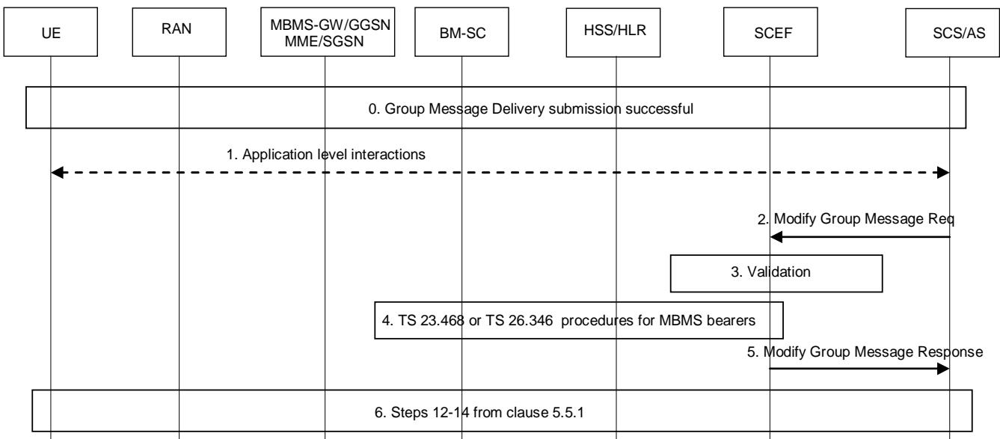  
Figure 5.5.2-1: Modification of previously submitted Group Message

0. The pre-condition for this flow is the successful completion of step 11 from clause 5.5.1.

1. Application level interactions may be applied for the devices of specific group to retrieve the related MBMS service information, e.g. TMGI, start time, etc. in the case of MB2 or ServiceId in the case of xMB. When the application receives a ServiceId through application level interaction, the application can activate reception using MBMS device APIs (see TS 26.347 [42]). Application level interactions between the UE and the SCS/AS are out of scope of this specification.

2. The SCS/AS determines that modification of previously accepted Group Message Delivery Request is required. The SCS/AS sends the Modify Group Message Request (TLTRI, Requested Action, Message Delivery Start Time, Message Delivery Stop Time (xMB only), optional (External Group Identifier, SCS Identifier, TMGI (MB2 only), Group Message Payload, location information, Accuracy) message to the SCEF. In the case of xMB, the SCEF identifies the associated MBMS Service using the external Group Identifier. Requested Action is either set to "Modify", or "Cancel". "Modify" indicates the request is to modify the transaction identified by TLTRI. "Cancel" indicates the request is to cancel the transaction identified by TLTRI. When set to "Modify", then the remainder parameters, except Message Delivery Start Time, are optional, and included only if different to that of step 6 from clause 5.5.1. When set to "Cancel", no other parameters are included.

3. The SCEF uses TLTRI to locate the context of previously accepted Group Message Delivery Request executed in clause 5.5.1. If no associated transaction is found, or if a transaction if found but step 13a from clause 5.5.1 was completed, then step 4 is executed with appropriate Cause value, and the flow stops at this step. Otherwise, the flow proceeds.

4. If Requested Action was set to "Cancel", then if MB2 is used the mechanisms defined in clause 5.1.2.3.3 of TS 23.468 [30] and if xMB is used the mechanisms defined in clause 5.4.5 of TS 26.348 [46] are executed by the SCEF to release the associated MBMS resources. If Requested Action was set to "Modify", then if MB2 is used the mechanisms defined in clause 5.1.2.4 of TS 23.468 [30] are used by the SCEF to modify the associated MBMS resources, whereas if xMB is used the mechanisms defined in clause 5.4.4 of TS 26.348 [46] with the following changes:

In step 1 of this procedure, the SCEF, acting as GCS AS (if MB2 is used) or Content provider (if xMB is used), may include location information from step 2. If no location information is provided in step 2 of this procedure, then the SCEF, based on local configuration, uses either a list of MBMS Service Area Identities, or a list of cell IDs, or both as the MBMS broadcast area.

In step 2 of this procedure, the BM-SC may map the civic address(es) (if provided) and/or geographic area(s) (if provided) of location information into MBMS Service Area Identities subject to operator policies.

5. If Requested Action was set to "Cancel", then the SCEF sends a Modify Group Message Response (Cause) message to the SCS/AS with appropriate Cause value depending on whether the cancellation was accepted, and the flow stops at this step. If Requested Action was set to "Modify", then the SCEF sends a Modify Group Message Response (Cause, TMGI, Acceptance Status) message to the SCS/AS to indicate whether the requested modifications were accepted. The usage of parameters is similar to step 11 of clause 5.5.1.

6. Steps 12-14 of clause 5.5.1 are executed.

## 5.5.3 Group Message Delivery via unicast MT NIDD

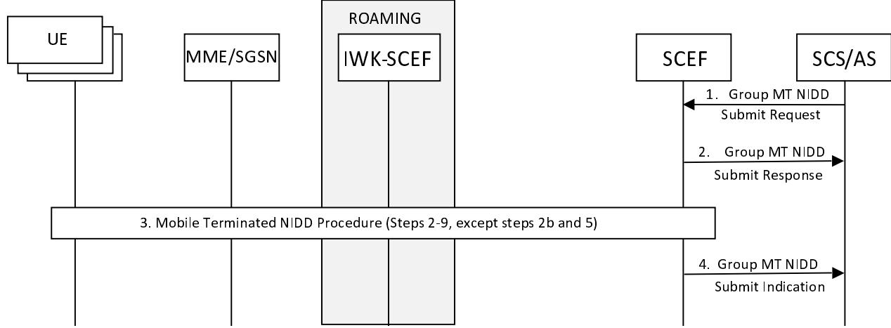  
Figure 5.5.3-1: Group Message Delivery via unicast MT NIDD

1. If SCS/AS has downlink non-IP data to send to a group of UEs, the SCS/AS sends a Group MT NIDD Submit Request (SCS/AS Identifier, External Group Identifier, TLTRI, non-IP data, Reliable Data Service Configuration, Maximum Latency, PDN Connection Establishment Option) message to the SCEF. The SCS/AS may determine the IP address(es)/port(s) of the SCEF by performing a DNS query using the External Group Identifier or using a locally configured SCEF identifier/address. When non-IP data is sent to an External Group Identifier, the Reliable Data Service Configuration shall indicate that no reliable data service acknowledgment is requested.

The Maximum Latency Parameter provided by the SCS/AS in this procedure is only used by the SCEF to determine the maximum acceptable delay for associated non-IP data and is not propagated further by the SCEF.

2. Based on the preceding NIDD Configuration of the UE Group (see clause 5.13.2) and the SCEF stored list of authorized External Identifiers associated to the External Group Identifier, the SCEF sends a single Group MT NIDD Submit Response (Cause) message to the SCS/AS to acknowledge acceptance of the Group MT NIDD Submit Request. The Cause may indicate that the non-IP packet size is larger than the Maximum Packet Size determined in the preceding NIDD configuration of the UE Group.

3. The SCEF performs this step for each External Identifier that belongs to the External Group Identifier. The SCEF stored the list of authorized External Identifiers associated to the External Group Identifier during the preceding NIDD Configuration of the UE Group (see clause 5.13.2). The SCEF determines the EPS Bearer Context based on the NIDD Configuration TLTRI that is associated with the SCS/AS Identifier and the External Identifier. If an SCEF EPS bearer context corresponding to the External Identifier and SCS/AS Identifier is found, then the SCEF checks whether the SCS/AS is authorised to send NIDD requests and that the SCS/AS has not exceeded its rate control quota or rate of data submission to the SCEF EPS bearer. If this check fails, the SCEF does nothing in this step for this UE and the Cause value that is associated with this UE and provided to the SCS/AS in step 4 will indicate the reason for the failure condition for each failed UE. For each UE that passes these checks, the SCEF continues with the flow by executing steps 2-9 (except steps 2b and 5) of the Mobile Terminated NIDD Procedure of clause 5.13.3.

4. After executing step 3 for all UEs, the SCEF sends an aggregated response message Group MT NIDD Submit Indication (TLTRI associated with the Request of step 1, Hop-by-Hop Acknowledgment Indication(s), Re-Transmission time(s), Trigger Indication(s), Cause(s)). The Re-Transmission time(s) report, for UEs that have power saving function and did not receive the MT NIDD message, how long time it will take before they are reachable. Re-Transmission time(s) are not sent for UEs where transmission was successful. The SCEF does not buffer the non-IP data further (if applicable) and provides a Hop-by-Hop Acknowledgment Indication, and a Cause value for each UE in the response to the SCS/AS. See clause 5.13.3 for a description of the Hop-by-Hop Acknowledgment Indication and when it is included. The Trigger Indication(s) is used to indicate UE(s) for which a trigger was sent in order to establish a PDN connection.

NOTE: The Re-Transmission time is used to inform the SCS/AS when the UE is expected to become reachable again, it is the expected wake up time that MME provided to SCEF when delivery failed for UEs with long sleep time.

## 5.6 Monitoring Procedures

## 5.6.0 Common Parameters

This clause describes the common parameters required for Monitoring Event procedures.

SCEF Reference ID is a parameter created by the SCEF to associate a Monitoring Event report or a deletion of a Monitoring Event to a specific Monitoring Request and the associated context information within the SCEF. SCEF Reference ID is stored by HSS, MME, SGSN, and IWK-SCEF.

NOTE 1: For the case of an individual UE, an SCEF may aggregate Monitoring Event configuration requests for the same External identifier/MSISDN from different SCS/AS instances.

NOTE 2: For the case of groups, an SCEF may aggregate Monitoring Event configuration requests for the same External Group Identifier from different SCS/AS instances.

SCEF ID indicates the SCEF to which the Monitoring Indication message has to be sent to by the HSS, MME, SGSN, or IWK-SCEF. SCEF ID is stored by the HSS, MME, SGSN, and IWK-SCEF.

SCEF Reference ID for Deletion identifies the monitoring event configuration that shall be deleted before applying the requested monitoring event configuration.

Monitoring Type identifies the specific Monitoring Event being requested.

If the Monitoring Event Configuration requested from the SCEF is for a group of UEs, the HSS includes User Identity in the monitoring event configuration.

Maximum Number of Reports is an optional parameter that indicates the maximum number of event reports to be generated by the HSS, MME, or SGSN until the associated monitoring event is considered to expire. This parameter can be used when configuring a monitoring event for an individual UE or a group. When the parameter is configured for a group, the configured value is applied to each individual UE's monitoring event configuration. A value of one implies a single event report is to be generated which makes it equivalent to a One-time Monitoring Request.

Monitoring Duration is an optional parameter that indicates the absolute time at which the related monitoring event request is considered to expire. For Monitoring Requests for a group, this parameter applies to every group member UE.

Inclusion of either Maximum Number of Reports (with a value higher than one) or Monitoring Duration makes the Monitoring Request a Continuous Monitoring Request. For a Continuous Monitoring Request, a single Monitoring Request may generate more than one Monitoring Indication message. Support of continuous monitoring is optional.

Absence of both Maximum Number of Reports and Monitoring Duration makes the Monitoring Request a One-time Monitoring Request. For One-time Monitoring Requests, a single Monitoring Request generates only one Monitoring Report for an individual UE and for an individual group member UE.

If for a given Monitoring Event both Maximum Number of Reports and Monitoring Duration are included then the monitoring request is considered to expire as soon as one of the conditions is met.

Chargeable Party Identifier is an optional parameter included by the SCEF. It identifies the entity towards which accounting/charging functionality is performed by the involved 3GPP network elements.

MTC Provider Information is an optional parameter included by the SCEF. It identifies the MTC Service Provider and/or MTC Application. Optionally the MTC Provider Information may also be provided by the SCS/AS.

Group Reporting Guard Time is an optional parameter for group-based monitoring configuration to indicate the time for which the Monitoring Event Reporting(s) detected by the UEs in a group can be aggregated before sending them to the SCEF/SCS/AS. The value of the Group Reporting Guard time should be set less than the Monitoring Duration. For the continuous monitoring reporting, unless the Monitoring Duration has been reached, the Group Reporting Guard timer is restarted when it expires. If the time left until Monitoring Duration is less than the Group Reporting Guard Time, then the Group Reporting Guard timer shall be set to expire when the Monitoring Duration expires. If the Monitoring Duration is expired, the Group Reporting Guard Time, if running, shall be considered to expire and aggregated Monitoring Event Reporting(s) is sent to destination immediately.

Number of UEs is a parameter that is provided to the SCEF during group-based monitoring configuration to indicate the number of UEs within the group identified by the External Group Identifier. The SCEF uses this value to determine whether the monitoring event has been reported for all group member UEs.

## 5.6.1 Monitoring Event configuration and deletion via HSS

## 5.6.1.1 Configuration Procedure

Figure 5.6.1.1-1 illustrates the procedure of configuring monitoring at the HSS or the MME/SGSN. The procedure is common for various Monitoring Event types. Common parameters for this procedure are detailed in clause 5.6.0. The steps and parameters specific to different Monitoring Event types are detailed in clauses 5.6.1.3 to 5.6.1.9.

The procedure is also used for deleting a previously configured Monitoring Event either as a standalone procedure or together with configuring a new Monitoring Event between the same SCEF and the same SCS/AS, or replacing a previously configured Monitoring Event with a new Monitoring Event of the same type between the same SCEF and the same SCS/AS, or for one-time reporting if the Configured Monitoring Event is available at the configured node or cancelling the event monitoring for certain UEs (i.e. one individual UE or a sub-set of UEs) in a group of UEs for which there is a configured Monitoring Event or adding the event monitoring for certain new UEs (i.e. one individual UE or a sub-set of UEs) in a group of UEs for which there is a configured Monitoring Event.

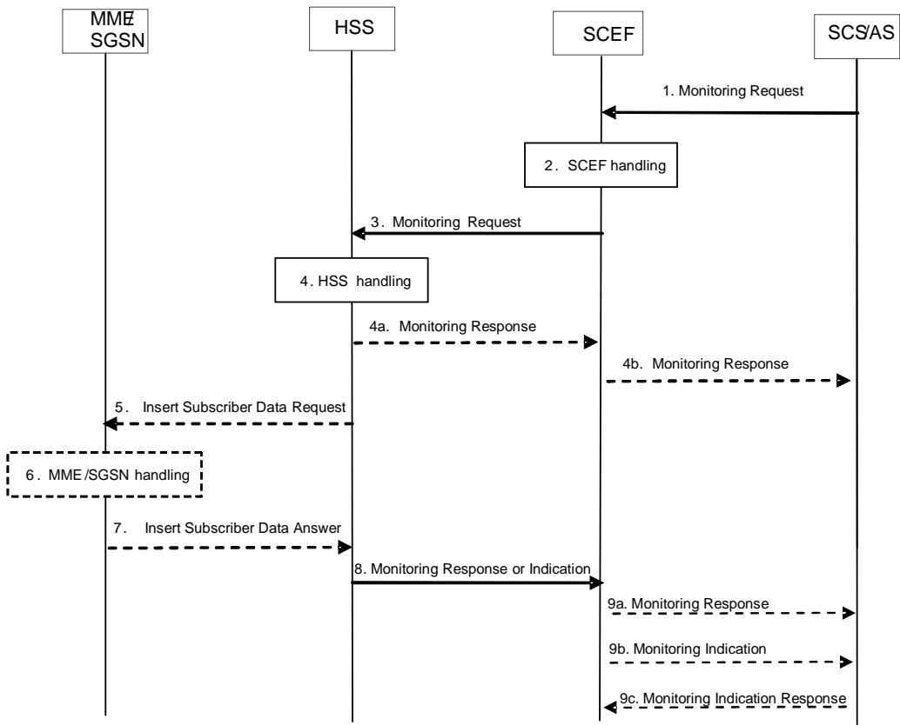  
Figure 5.6.1.1-1: Monitoring event configuration and deletion via HSS procedure

1. The SCS/AS sends a Monitoring Request (External Identifier or MSISDN or External Group ID, SCS/AS Identifier, Monitoring Type, Maximum Number of Reports, Monitoring Duration, T8 Destination Address, TLTRI for Deletion, TLTRI for Update, the External Identifier(s) or MSISDN(s) of the individual member UE(s) to be cancelled or added for an existing group event, operation indication (cancellation or addition), Group Reporting Guard Time, MTC Provider Information) message to the SCEF. The SCEF assigns a TLTRI that identifies the Monitoring Request, if a new monitoring event is being configured. The SCS/AS may perform deletion of a previously configured Monitoring Event together with configuring a new Monitoring Event. If the SCS/AS wants to perform deletion of a previously configured Monitoring Event, then it shall include TLTRI for Deletion.

If the SCS/AS wants to configure Monitoring Event for the group of UEs, the SCS/AS can send Monitoring Request message including External Group Identifier and Group Reporting Guard Time. If the SCS/AS includes External Group Identifier in the Monitoring Request message, External Identifier or MSISDN shall be ignored. A Group Reporting Guard Time is an optional parameter to indicate that aggregated Monitoring Event Reporting(s) which have been detected for the UEs in a group needs to be sent to the SCS/AS once the Group Reporting Guard Time is expired.

If the SCS/AS decides to cancel or add the monitoring event for certain UEs (i.e. one individual UE or a sub-set of UEs) in a group of UEs for which there is a configured Monitoring Event, the SCS/AS can send Monitoring Request message including the TLTRI for Update corresponding to the existing monitoring event configuration and the External Identifier(s) or MSISDN(s) of the individual member UE(s) to be cancelled or added with the operation indication which is either cancellation or addition.

NOTE 1: A relative priority scheme for the treatment of multiple SCS/AS Monitoring Requests, e.g. for deciding which requests to serve under overload condition, can be applied. This priority scheme is used locally by the SCEF, i.e. it is not used nor translated in procedures towards other functions.

2. The SCEF stores SCS/AS Identifier, T8 Destination Address, Monitoring Duration, Maximum Number of Reports and Group Reporting Guard Time, if provided. If the SCEF assigned a TLTRI, the SCEF stores the TLTRI, and also assigns it to an SCEF Reference ID. Based on operator policies, if either the SCS/AS is not authorized to perform this request (e.g. if the SLA does not allow for it) or the Monitoring Request is malformed or the SCS/AS has exceeded its quota or rate of submitting monitoring requests, the SCEF performs step 9 and provides a Cause value appropriately indicating the error. If the SCEF received a TLTRI for Update, the SCEF looks up the SCEF context pointed to by the TLTRI for Update to derive the related SCEF Reference ID. If the

SCEF received a TLTRI for Deletion, the SCEF looks up the SCEF context pointed to by the TLTRI for Deletion to derive the related SCEF Reference ID for Deletion.

If the SCEF received a request to cancel the monitoring event for indicated UEs (i.e. one individual UE or a subset of UEs) in a group of UEs for which there is a configured Monitoring Event and if the Maximum Number of Reports applies to the monitoring event configuration, the SCEF sets the stored number of reports of the indicated UE(s) to Maximum Number of Reports.

The SCEF uses the Group Reporting Guard Time for a Monitoring Event Reporting for the group of UEs when the Monitoring Indication message is sent from the MME/SGSN to the SCEF. The SCEF sets the Group Reporting Guard Time for HSS less than the value for the SCEF received from SCS/AS in order to ensure to receive accumulated Monitoring Indication from HSS before the Group Reporting Guard Timer for SCEF is expired.

3. The SCEF sends a Monitoring Request (External Identifier or MSISDN or External Group Identifier, SCEF ID, SCEF Reference ID, Monitoring Type, Maximum Number of Reports, Monitoring Duration, SCEF Reference ID for Deletion, the External Identifier(s) or MSISDN(s) of the individual member UE(s) to be cancelled or added, operation indication (cancellation or addition), Chargeable Party Identifier, Group Reporting Guard Time, MTC Provider Information) message to the HSS to configure the given Monitoring Event on the HSS and on the MME/SGSN, if required. If the External Group Identifier is included, External Identifier or MSISDN shall be ignored. For one-time Monitoring Request of Roaming Status, the SCEF does not indicate the Group Reporting Guard Time.

NOTE 2: The MTC Provider Information in step 1 is an optional parameter. The SCEF should validate the provided MTC Provider Information and may override it to an SCEF selected MTC Provider Information based on configuration. How the SCEF determines the MTC Provider Information if not present in step 1 is left to implementation (e.g. based on the requesting SCS/AS).

4. The HSS examines the Monitoring Request message, e.g. with regard to the existence of External Identifier or MSISDN or External Group Identifier, whether any included parameters are in the range acceptable for the operator, whether the monitoring event(s) is supported by the serving MME/SGSN, whether the group-basis monitoring event feature is supported by the serving MME/SGSN, or whether the monitoring event that shall be deleted or updated is valid. The HSS optionally authorizes the chargeable party identified by Chargeable Party Identifier. If this check fails the HSS follows step 8 and provides a Cause value indicating the reason for the failure condition to the SCEF.

NOTE 3: The details of the chargeable party authorization are outside the scope of this specification.

The HSS stores the SCEF Reference ID, the SCEF ID, Maximum Number of Reports, Monitoring Duration and the SCEF Reference ID for Deletion as provided by the SCEF. For a Monitoring Request for a group, such parameters are stored for every group member UE. For a Monitoring Request with the External Identifier(s) or MSISDN(s) of the individual member UE(s) to be cancelled or added as in step 3, such parameters together with the operation indication as provided by the SCEF are stored for every indicated UE.

The HSS uses the Group Reporting Guard Time for a Monitoring Event Reporting for the group of UEs when the Monitoring Indication message is sent from the HSS to the SCEF.

4a. For group based processing, if the HSS receives the Monitoring Request with an External Group Identifier, the HSS sends a Monitoring Response (SCEF Reference ID, Number of UEs, Cause) message to the SCEF to acknowledge acceptance of the Monitoring Request immediately before beginning the processing of individual UEs indicating that Group processing is in progress. The HSS deletes the monitoring event configuration identified by the SCEF Reference ID, if it was requested.

If the HSS receives the Monitoring Request with the External Identifier(s) or MSISDN(s) of the individual member UE(s) to be cancelled or added as in step 3 and the event was monitored by the HSS, the HSS cancels or adds the event monitoring for the indicated UE(s).

4b. The SCEF sends a Monitoring Response (TLTRI, Cause) message to the SCS/AS. The Cause value indicates progress of Group processing request.

5. If required by the specific Monitoring Type and when Monitoring Event(s) is supported by the serving MME/SGSN, the HSS sends an Insert Subscriber Data Request (Monitoring Type, SCEF ID, SCEF Reference ID, Maximum Number of Reports, Monitoring Duration, SCEF Reference ID for Deletion, Chargeable Party Identifier) message to the MME/SGSN for each individual UE and for each individual group member UE. If the

Monitoring Request message is for a group of UEs, for each UE group member, the HSS includes the selected External ID or the MSISDN in the monitoring event configuration and sends an Insert Subscriber Data Request message per UE to all the MME/SGSN(s) serving the members of the group. If the HSS has received in step 3 Monitoring Request with the External Identifier(s) or MSISDN(s) of the individual member UE(s) to be added, for each indicated UE group member, the HSS includes the corresponding External ID or the MSISDN in the monitoring event configuration and sends an Insert Subscriber Data Request message to the MME/SGSN(s) serving such indicated UE group member. If the HSS has received in step 3 Monitoring Request with the External Identifier(s) or MSISDN(s) of the individual member UE(s) to be cancelled and the event is monitored by MME/SGSN, the HSS includes the received value of the SCEF Reference ID within the SCEF Reference ID for Deletion towards to the MME/SGSN. Optionally, the HSS allocates a Provider-Group-ID based on the MTC Provider Information (different from the IMSI-Group-Id) and sends it to the MME/SGSN to assist the serving node(s) when selecting and differentiating configurations for a given MTC Service Provider (e.g. to delete the configurations for a specific MTC Service Provider at the MME/SGSN).

NOTE 4: How the HSS selects an External ID when multiple External IDs are associated with the same IMSI is left to implementation, e.g. based on the MTC Provider Information (if received) or the default External ID (if not received)

NOTE 5: The Provider-Group-ID is used for group operations e.g. as specified in clause 4.3.7.4.2 of TS 23.401 [7] NAS level congestion control.

6. If the MME/SGSN is configured to use an IWK-SCEF for the PLMN of the SCEF then clause 5.6.6 applies. Otherwise, the MME/SGSN verifies the request, e.g. if the Monitoring Type is covered by a roaming agreement when the request is from another PLMN or whether it serves the SCEF Reference ID for Deletion and can delete it. If this check fails, the MME/SGSN follows step 7 and provides a Cause value indicating the reason for the failure condition to the HSS. Based on operator policies, the MME/SGSN may also reject the request due to other reasons (e.g. overload or HSS has exceeded its quota or rate of submitting monitoring requests defined by an SLA).

The MME/SGSN stores the received parameters and starts to watch for the indicated Monitoring Event unless it is a One-time request and the Monitoring Event is available to the MME/SGSN at the time of sending Insert Subscriber Data Answer. The MME/SGSN deletes the monitoring configuration identified by the SCEF Reference ID for Deletion, if provided.

NOTE 6: The MME/SGSN will transfer the parameters stored for every monitoring task as part of its context information during an MME/SGSN change.

7. If the monitoring configuration is successful, the MME/SGSN sends an Insert Subscriber Data Answer (Cause) message to the HSS. If the requested Monitoring Event is available to the MME/SGSN at the time of sending Insert Subscriber Data Answer, then the MME/SGSN includes the Monitoring Event Report in the Insert Subscriber Data Answer message.

8. For single UE processing, the HSS sends a Monitoring Response (SCEF Reference ID, Cause, Monitoring Event Report) message to the SCEF to acknowledge acceptance of the Monitoring Request and the deletion of the identified monitoring event configuration, if it was requested. The HSS deletes the monitoring event configuration identified by the SCEF Reference ID, if it was requested. If the requested Monitoring Event is available to the HSS at the time of sending Monitoring Response message or was received from the MME/SGSN in step 7, then the HSS includes a Monitoring Event Report in the Monitoring Response message.

If it is a One-time request and the Insert Subscriber Data Answer includes a Monitoring Event Report, the HSS deletes the associated Monitoring Event configuration for the individual UE or for the individual group member UE.

For group-based processing, if the HSS sent the Monitoring Response in step 4a, i.e. due to having received a Monitoring Request with an External Group Identifier and if the Group Reporting Guard Time was provided in the Monitoring Request, the HSS accumulates multiple responses for the UEs of the group within the Group Reporting Guard Time. After the Group Reporting Guard Time expiration, the HSS sends a Monitoring Indication with the accumulated responses. The HSS includes UE identity(ies) and a Cause value indicating the reason for the failure in the message if the monitoring configuration of the group member failed.

NOTE 7: For the group-basis Monitoring Event configuration, the HSS may divide the accumulated Monitoring Indications into multiple messages due to e.g. limitation of the message size.

In the case of UE mobility, the HSS determines whether the new MME/SGSN supports requested Monitoring Event(s).

9a. For single UE processing, the SCEF sends a Monitoring Response (Cause, Monitoring Event Report) message to the SCS/AS to acknowledge acceptance of the Monitoring Request and the deletion of the identified monitoring event configuration, if it was requested. If the SCEF received a Monitoring Event Report then it includes the Monitoring Event Report in the Monitoring Response message. If it is a One-time request for an individual UE and the Monitoring Response includes a Monitoring Event Report for the UE, the SCEF deletes the associated Monitoring Event configuration.

9b. For group-based processing, if no Group Reporting Guard Time was set, then the SCEF sends the Monitor Indication (TLTRI, Cause, Monitoring Event Report) message to the SCS/AS as it receives them from the HSS. Otherwise, it accumulates Monitoring Event for the UEs of the group until the expiration of Group Reporting Guard Time. Upon expiration, the SCEF sends a Monitoring Indication (TLTRI, Cause, list of (External Identifier or MSISDN, Monitoring Event Report)) message to the SCS/AS. A list of accumulated Monitoring Event Report for each UE identified by either External Identifier or MSISDN is also included.

If the Monitoring Request is a one-time request for a group of UEs or if Maximum Number of Reports is included for continuous monitoring of group of UEs, the SCEF uses the list of UE Identities that were received in step 8 and the Number of UEs parameter that was received in step 4a to check if the reports for all the individual group member UEs have been received. If the SCEF determines that all reports for all individual group member UEs have been received, the SCEF sends a request to the HSS to delete the associated Monitoring Event configuration for the group.

9c. For each Monitoring Indication message received in step 9b, the SCS/AS sends a Monitoring Indication Response (Cause) message to the SCEF. Cause value reflects successful or unsuccessful acknowledgement of Monitoring Indication message.

If the HSS detects that the current serving MME/SGSN cannot support a requested Monitoring Event or the group-basis monitoring event feature (e.g. after a UE mobility event), the HSS performs the procedures given below.

Notify the SCEF that the configured Monitoring Event for the UE is considered to be suspended. The SCEF interprets this to mean that the network will temporarily be unable to serve the configured Monitoring Event. In this case:

When the MME/SGSN for the UE changes (e.g. due to UE mobility), and the new MME/SGSN supports the suspended Monitoring Event, the HSS shall configure the new MME/SGSN with the Monitoring Event and notify the SCEF of resumption of the suspended Monitoring Event;

If the criteria for Continuous Reporting expire while the Monitoring Event is suspended, the HSS and the SCEF shall independently delete the Monitoring Event.

## 5.6.1.2 Void

## 5.6.1.3 Specific Parameters for Monitoring Event: Loss of connectivity

Loss of connectivity indicates when the 3GPP network detects that the UE is no longer reachable for either signalling or user plane communication. Such condition is identified when the mobile reachability timer expires in the MME or SGSN (see TS 23.401 [7], TS 23.060 [6], when the UE detaches and when an active UE is purged (see TS 29.272 [31])). The SCS/AS may provide a Maximum Detection Time, which indicates the maximum period of time without any communication with the UE after which the SCS/AS is to be informed that the UE is considered to be unreachable.

NOTE 1: As the Maximum Detection Time of loss of connectivity determines the order of magnitude of the Periodic Update timer, the network should ensure that this Maximum Detection Time and thereby the periodic TAU/RAU timers for the UE remain above lower bound values both for preserving the battery of the UE and for managing the signalling load of the network. So for UEs with battery constraints, it should not be a small time (e.g. on the order of only a few minutes). Even for UEs without battery constraints, trying to fulfil a Maximum Detection Time of loss of connectivity on the order of a few minutes can only apply to a limited number of UEs due to the cost of signalling induced by this feature.

NOTE 2: The Maximum Detection Time of loss of connectivity is on the order of 1 minute to multiple hours.

1. The SCS/AS sets Monitoring Type to "Loss of Connectivity", and optionally adds Maximum Detection Time prior to sending Monitoring Request to the SCEF as in step 1 of clause 5.6.1.1.

2. The SCEF executes step 2 of clause 5.6.1.1.

3. The SCEF executes step 3 of clause 5.6.1.1.

4. The HSS executes step 4 of clause 5.6.1.1. In addition, it checks whether the Maximum Detection Time is within the range defined by operator policies, and, if acceptable then the HSS sets the subscribed periodic RAU/TAU timer using the value of Maximum Detection Time, if it is provided. If the Maximum Detection Time is not acceptable, the HSS rejects the request by executing step 8, and provides a Cause value indicating the reason for the failure condition to the SCEF.

If the Enhanced Multiple Event Monitoring feature is not supported and if the subscribed periodic RAU/TAU Timer was previously set by a different Monitoring Request identified by a different SCEF Reference ID for the same UE then, depending on operator configuration, the HSS either performs step 8 to reject the Monitoring Request with an appropriate Cause or accepts the request. If the HSS accepts this request, then it cancels the previously accepted Monitoring Request by including the SCEF Reference ID of that Monitoring Request in step 8.

For group based processing, if the previously accepted Monitoring Request is associated with a group of UEs and the HSS is not cancelling the previously accepted Monitoring Request for all UEs in the group, then the HSS provides the list of affected UEs (identified by External Identifier or MSISDN) as well as operation indication (cancellation or addition) to the SCEF in step 8.

If the Enhanced Multiple Event Monitoring feature is supported, and if the subscribed periodic RAU/TAU Timer was previously set by a different Monitoring Request or Network Parameter Configuration identified by a different SCEF Reference ID for the same UE, as long as the Maximum Detection Time is within the range defined by operator policies, the HSS shall accept the request. If the newly received Maximum Detection Time is lower than the provided subscribed periodic RAU/TAU timer, the HSS shall set the subscribed periodic RAU/TAU timer using the newly received Maximum Detection Time as described in clause 4.5.6.2. The HSS may notify the SCEF (which then notifies the SCS/AS) of the actual value that is being applied in the 3GPP network.

NOTE 3: Since the value of the mobile reachable timer is larger than the value of the periodic RAU/TAU timer (by four minutes as a default), the HSS may set the subscribed periodic RAU/TAU timer to a smaller value than the value of Maximum Detection Time.

5. The HSS executes step 5 of clause 5.6.1.1. In addition:

if the Enhanced Multiple Event Monitoring feature is not supported and the HSS accepts new monitoring event configuration and cancel the existing monitoring event configuration, the HSS includes the new monitoring event configuration information, the SCEF Reference ID for Deletion of the cancelled monitoring event configuration with an appropriate Cause, and the subscribed periodic RAU/TAU Timer (if modified).

When HSS accepts new configured Monitoring Event for UEs in step 4 above, the HSS includes the new monitoring event configuration information and the subscribed periodic RAU/TAU Timer (if modified).

When HSS removes a previously configured Monitoring Event for UEs in step 4 above, the HSS also deletes the previously configured Monitoring Event in the MME/SGSN, if applicable.

If the Enhanced Multiple Event Monitoring feature is supported, the HSS includes the new monitoring event configuration information and the subscribed periodic RAU/TAU Timer (if modified).

When HSS modifies a previously configured Monitoring Event for UE(s) in step 4 above, the HSS also updates the previously configured Monitoring Event in the MME/SGSN, if applicable.

6. The MME/SGSN executes step 6 of clause 5.6.1.1. If the MME/SGSN receives a subscribed periodic RAU/TAU timer value from the HSS, it allocates the subscribed value to the UE as the periodic TAU/RAU timer. The MME/SGSN starts watching for the expiration of the mobile reachable timer.

7. Step 7 of clause 5.6.1.1 is executed.

8. Step 8 of clause 5.6.1.1 is executed. The HSS may include the SCEF Reference ID of previously accepted Monitoring Request which needs to be cancelled and the cancellation cause. If the HSS, in step 4 above, decides to cancel Monitoring Event for indicated UEs (i.e. one individual UE or a sub-set of UEs) in the group of UEs for which there was a previously configured Monitoring Event, the HSS also includes the External Identifier or MSISDN of these indicated UEs towards the SCEF.

If the HSS, in step 4 above, decides to add Monitoring Event for indicated UEs (i.e. one individual UE or a subset of UEs) in the group of UEs for which there was a previously configured Monitoring Event, the HSS includes the External Identifier or MSISDN of these indicated UEs towards the SCEF.

9. Step 9 of clause 5.6.1.1 is executed. If SCEF Reference ID of previously configured Monitoring Event for cancellation is included in step 8, then the SCEF executes steps 2-5 of clause 5.6.9 using the associated TLTRI towards the associated SCS/AS.

## 5.6.1.4 Specific Parameters for Monitoring Event: UE reachability

For UE that is not reachable at the time of monitoring event configuration, UE reachability indicates when the UE becomes reachable for sending either SMS or downlink data to the UE, which is detected when the UE transitions to ECM-CONNECTED mode (for a UE using Power Saving Mode or extended idle mode DRX) or when the UE will become reachable for paging (for a UE using extended idle mode DRX). If the UE is reachable at monitoring event configuration, the MME shall immediately send UE reachability event report. This monitoring event supports Reachabilty for SMS and Reachability for Data. Only a One-time Monitoring Request for Reachability for SMS is supported. The SCS/AS may include the following parameters in the Monitoring Event configuration request to the SCEF:

Reachability Type indicating whether the request is for "Reachability for SMS", or "Reachability for Data", or both.

Optionally, Maximum Latency indicating maximum delay acceptable for downlink data transfers. Maximum Latency is used for setting the periodic TAU/RAU timer for the UE as it sets the maximum period after which a UE has to connect to the network again and thereby becomes reachable. Determined by the operator, low values for Maximum Latency may deactivate PSM.

Optionally, Maximum Response Time indicating the time for which the UE stays reachable to allow the SCS/AS to reliably deliver the required downlink data. Maximum Response Time is used for setting the Active Time for the UE. When the UE uses extended idle mode DRX, the Maximum Response Time is used to determine how early this monitoring event should be reported to the SCS/AS before the next Paging Occasion occurs.

Optionally, Suggested number of downlink packets indicating the number of packets that the Serving Gateway shall buffer if the UE is not reachable.

NOTE 1: As the Maximum Latency determines the order of magnitude of the Periodic Update timer, the network should ensure that this Maximum Latency and thereby the periodic TAU/RAU timers for the UE remain above lower bound values both for preserving the battery of the UE and for managing the signalling load of the network. So for UEs with battery constraints, it should not be a small time (e.g. on the order of only a few minutes). Even for UEs without battery constraints, trying to fulfil a Maximum Latency on the order of a few minutes can only apply to a limited number of UEs due to the cost of signalling induced by this feature.

NOTE 2: The Maximum Latency is on the order of 1 minute to multiple hours.

NOTE 3: The Network Parameter Configuration via SCEF feature (see clause 4.5.21) feature supersedes the option of setting Reachability Type to "configuration" during configuration of the UE Reachability Monitoring Event which is no longer recommended.

1. The SCS/AS sets Monitoring Type to "UE Reachability", and includes Reachability Type, and any combination of the following optional parameters: Maximum Latency, Maximum Response Time, Suggested number of downlink packets, and Idle Status Indication prior to sending the Monitoring Request to the SCEF as in step 1 of clause 5.6.1.1.

2. The SCEF executes step 2 of clause 5.6.1.1. In addition, it checks whether the Maximum Latency (if included), the Maximum Response Time (if included), and the Suggested number of downlink packets (if included) are within the range defined by operator policies. If not, or if the network does not support Idle Status Indication, then depending on operator policies, the SCEF rejects the request by performing step 9 of 5.6.1.1 with an appropriate cause value.

3. When "Reachability for SMS" is requested, the SCEF subscribes with the HSS by executing step 3 of 5.6.1.1 to get notified when the HSS is notified that the UE is reachable. The HSS performs the UE Reachability Notification Request procedure for getting a UE Activity Notification as described in TS 23.401 [7] and/or uses the UE Reachability function as described in TS 23.060 [6]. The Mobile-Station-Not-Reachable-Flag (MNRF) handling is described in TS 23.040 [12].

When "Reachability for Data" is requested, the SCEF executes step 3 of 5.6.1.1. In addition, if provided, it includes Maximum Latency, Maximum Response Time, and Idle Status Indication.

4. The HSS executes step 4 of clause 5.6.1.1. In addition, it checks whether the Maximum Latency, if provided, is within the range defined by operator policies, and if acceptable, the HSS sets the subscribed periodic RAU/TAU timer using the value of Maximum Latency, if it is provided. If the requested timer value is not acceptable, the HSS rejects the request by executing step 8, and provides a Cause value indicating the reason for the failure condition to the SCEF. In addition, the HSS checks whether the Suggested number of downlink packets is within the range defined by operator policies. If it is not, then the HSS rejects the request by executing step 8, and provides a Cause value indicating the reason for failure condition to the SCEF.

If the Enhanced Multiple Event Monitoring feature is not supported and if the subscribed periodic RAU/TAU timer was previously set by a different Monitoring Request identified by a different SCEF Reference ID for the same UE then, depending on operator configuration, the HSS either performs step 8 to reject the Monitoring Request with an appropriate Cause or accepts the request. In the case that the HSS accepts this request, then it cancels the previously accepted Monitoring Request by including the SCEF Reference ID of that Monitoring Request in step 8. If the HSS supports Idle Status Indication, then it includes it in step 5.

For group based processing, if the previously accepted Monitoring Request is associated with a group of UEs and the HSS is not cancelling the previously accepted Monitoring Request for all UEs in the group, then the HSS provides the indicated UEs (External Identifier or MSISDN) as well as operation indication (cancellation or addition) to the SCEF in step 8.

If the Enhanced Multiple Event Monitoring feature is supported, and if the subscribed periodic RAU/TAU Timer, or Active Time, or Suggested number of downlink packets, or any combination were previously set by a different Monitoring Request or Network Parameter Configuration identified by a different SCEF Reference ID for the same UE, as long as the Maximum Latency (if received), and Maximum Response Time (if received) and Suggested number of downlink packets (if received) are within the range defined by operator policies, the HSS shall accept the request as follows:

If the newly received Maximum Latency is lower than the provided subscribed periodic RAU/TAU timer, the HSS shall set the subscribed periodic RAU/TAU timer using the newly received Maximum Latency.

If the newly received Maximum Response Time is higher than the provided subscribed Active Time (i.e. previously provided Maximum Response Time), the HSS shall set the subscribed Active Time using the newly received Maximum Response Time.

If Suggested number of downlink packets is newly received, the HSS shall add the newly received value to the currently used value of Suggested number of downlink packets if the aggregated value is within the operator defined range. If the aggregated value is not within the operator defined range, the HSS shall set the subscribed Suggested number of downlink packets according to operator defined range.

The HSS may notify the SCEF (which then notifies the SCS/AS) of the actual value of Maximum Latency and Maximum Response Time that are being applied in the 3GPP network.

## 5. The HSS executes step 5 of clause 5.6.1.1. In addition:

if the Enhanced Multiple Event Monitoring feature is not supported and the HSS accepts new monitoring event configuration and cancel the existing monitoring event configuration, the HSS includes the subscribed periodic RAU/TAU timer (if modified), new received Maximum Response Time (if provided), new received Suggested number of downlink packets (if configured or provided), Idle Status Indication (if provided) and the SCEF Reference ID for Deletion of the cancelled monitoring event configuration and appropriate Cause.

When HSS accepts new configured Monitoring Event for UEs in step 4 above, the HSS includes the subscribed periodic RAU/TAU timer (if modified), Maximum Response Time (if provided), Suggested number of downlink packets (if configured or provided) and Idle Status Indication (if provided).

When HSS removes a previously configured Monitoring Event for UEs in step 4 above, the HSS also deletes the previously configured Monitoring Event in the MME/SGSN, if applicable.

If the Enhanced Multiple Event Monitoring feature is supported, the HSS includes the subscribed periodic RAU/TAU timer (if modified), Maximum Response Time (if modified), Suggested number of downlink packets (if modified) and Idle Status Indication.

When HSS modify a previously configured Monitoring Event for UEs in step 4 above, the HSS also updates the previously configured Monitoring Event in the MME/SGSN, if applicable.

6. The MME/SGSN executes step 6 of clause 5.6.1.1 and starts watching for the UE entering connected mode. At every subsequent TAU/RAU procedure, the MME/SGSN applies the subscribed periodic RAU/TAU timer.

7. Step 7 of clause 5.6.1.1 is executed.

8. Step 8 of clause 5.6.1.1 is executed. The HSS may include the SCEF Reference ID of previously accepted Monitoring Request which needs to be cancelled and the cancellation cause. If the HSS, in step 4 above, decides to cancel Monitoring Event for indicated UEs (i.e. one individual UE or a sub-set of UEs) in the group of UEs for which there was a previously configured Monitoring Event, the HSS also includes the External Identifier or MSISDN of these indicated UEs towards the SCEF.

If the HSS, in step 4 above, decides to add Monitoring Event for indicated UEs (i.e. one individual UE or a subset of UEs) in the group of UEs for which there was a previously configured Monitoring Event, the HSS includes the External Identifier or MSISDN of these indicated UEs towards the SCEF.

9. Step 9 of clause 5.6.1.1 is executed. If SCEF Reference ID of previously configured Monitoring Event for cancellation is included in step 8, then the SCEF executes steps 2-5 of clause 5.6.9 using the associated TLTRI towards the associated SCS/AS.

## 5.6.1.5 Specific Parameters for Monitoring Event: Location Reporting

This monitoring event allows the SCS/AS to request either the Current Location or the Last Known Location of a UE. The supported Accuracy in the network may be at different levels, which are described in clause 4.9.2. Only One-time Reporting is supported for the Last Known Location. One-time and Continuous Location Reporting are supported for the Current Location. For Continuous Location Reporting, unless a Minimum Reporting Interval was provided, the serving node(s) sends a notification every time it becomes aware of a location change. The granularity depends on the accepted Accuracy.

Minimum Reporting Interval is an optional parameter that indicates a minimum time interval between Location Reporting notifications. If this parameter was provided to the MME/SGSN, when sending each Location Reporting notification, the MME/SGSN starts a timer which runs for the duration of Minimum Reporting Interval. While the timer is running the MME/SGSN suppresses sending Location Reporting notification(s). If at least one Location Reporting notification was suppressed while the timer was running, on expiry of the timer the MME/SGSN sends location information that was contained in the latest suppressed Location Reporting notification and restarts the timer. If the MME/SGSN is relocated, the source MME/SGSN shall transfer the current value of the timer to the target MME/SGSN. The target MME/SGSN shall start the timer with the transferred value, i.e. with the time remaining from the Minimum Reporting Interval.

NOTE 1: Due to the potential increase in signalling load, it is recommended that a continuous monitoring of current location on cell level is only applied for a limited number of subscribers and/or that the Minimum Reporting Interval option is used.

1. The SCS/AS sets Monitoring Type to "Location Reporting", and adds Location Type, optionally Accuracy and optionally Minimum Reporting Interval prior to sending Monitoring Request to the SCEF as in step 1 of clause 5.6.1.1.

Location Type indicates whether the request is for Current Location or Last Known Location.

2. The SCEF executes step 2 of clause 5.6.1.1.

3. If Accuracy is included in step 1 then based on operator configuration the SCEF maps it to permissible granularity. If Accuracy is not included in step 1, the SCEF sets the granularity based on operator configuration. The SCEF adds Location Type, Accuracy and Minimum Reporting Interval (if included in step 1) prior to sending the Monitoring Request to the HSS as in step 3 of clause 5.6.1.1.

4. The HSS executes step 4 of clause 5.6.1.1.

5. Depending on the Location Type the HSS sets the "Current Location Request" (see TS 29.272 [31]), adds Accuracy and Minimum Reporting Interval (if included in step 3) prior to sending the Insert Subscriber Data Request to the MME/SGSN as in step 5 of clause 5.6.1.1.

6. The MME/SGSN executes step 6 of clause 5.6.1.1 and depending on the requested Accuracy invokes the appropriate procedures as defined in TS 23.401 [7] or TS 23.060 [6] for determining the location as requested. Unless it is a One-time request, the MME/SGSN starts watching for cell/RA/TA/eNodeB changes, depending on requested Accuracy.

If Minimum Reporting Interval is included in step 5, the MME/SGSN sends Location Reporting notifications with Minimum Reporting Interval option.

7-9. Steps 7-9 of clause 5.6.1.1 are executed and include the report of the current or last known location, depending on what was requested. Depending on operator configuration, the SCEF either maps the reported 3GPP system specific location information to the accepted Accuracy format or sends it as-is to the SCS/AS.

## 5.6.1.6 Specific Parameters for Monitoring Event: Change of IMSI-IMEI(SV) Association

Change of IMSI-IMEI(SV) indicates a change of the ME (IMEI(SV)) that uses a specific subscription (IMSI). It is based on the HSS being informed by the MME about the UE's IMEI(SV) according to the procedures defined in TS 23.401 [7]. The support of this Monitoring Event by the SGSN requires the support of the Automatic Device Detection (ADD) function/feature defined in TS 23.060 [6].

1. The SCS/AS sets Monitoring Type to "Change of IMSI-IMEI(SV) Association", and adds Association Type prior to sending Monitoring Request to the SCEF as in step 1 of clause 5.6.1.1.

Association Type indicates whether change of IMEI or IMEISV to IMSI association shall be detected.

2. The SCEF executes step 2 of clause 5.6.1.1.

3. The SCEF adds Association Type prior to sending the Monitoring Request to the HSS as in step 3 of clause 5.6.1.1.

4. The HSS executes step 4 of clause 5.6.1.1.

5-7. Steps 5-7 of clause 5.6.1.1 shall not be executed for this Monitoring Event.

8-9. Steps 8-9 of clause 5.6.1.1 are executed.

## 5.6.1.7 Specific Parameters for Monitoring Event: Roaming Status

This monitoring event allows the SCS/AS to query the UE's current roaming status (the serving PLMN and/or whether the UE is in its HPLMN) and to get notified when that status changes. It is based on the HSS being informed of the UE's serving PLMN by the MME according to TS 23.401 [7] and by the SGSN according to TS 23.060 [6].

1. The SCS/AS sets Monitoring Type to "Roaming Status" prior to sending the Monitoring Request to the SCEF as in step 1 of clause 5.6.1.1. Optionally, it includes the "PLMN Information" parameter to request inclusion of the UE's Serving PLMN ID in the Monitoring Event Report.

2. The SCEF executes step 2 of clause 5.6.1.1.

3. The SCEF includes "PLMN Information", if sent in step 1, prior to sending Monitoring Request to the HSS as in step 3 of clause 5.6.1.1.

4. The HSS executes step 4 of clause 5.6.1.1.

5-7. Steps 5-7 of clause 5.6.1.1 shall not be executed for this Monitoring Event.

8-9. Steps 8-9 of clause 5.6.1.1 are executed. The Monitoring Event Report for this event is sent in the Monitoring Response message. The Monitoring Event Report indicates whether the UE is presently roaming or not as specified in clause 5.6.3.6. If PLMN Information was requested in step 1, and the operator policies allow, then the HSS includes for each Roaming Status in the Monitoring Event Report:

\- the HPLMN PLMN-Id if the UE is in the HPLMN; or

\- the Visited PLMN-Id (see TS 29.272 [31]) if the UE is in the VPLMN.

## 5.6.1.8 Specific Parameters for Monitoring Event: Communication failure

This monitoring event allows the SCS/AS to be notified of communication failure events, identified by RAN/NAS Release Cause codes per TS 23.401 [7].

1. The SCS/AS sets Monitoring Type to "Communication Failure" prior to sending Monitoring Request to the SCEF as in step 1 of clause 5.6.1.1.

2. The SCEF executes step 2 of clause 5.6.1.1.

3. The SCEF executes step 3 of clause 5.6.1.1.

4. The HSS executes step 4 of clause 5.6.1.1.

5. The HSS executes step 5 of clause 5.6.1.1.

6. The MME/SGSN executes step 6 of clause 5.6.1.1 and starts watching for communication failure events.

7-9. Steps 7-9 of clause 5.6.1.1 are executed.

## 5.6.1.9 Specific Parameters for Monitoring Event: Availability after DDN Failure

This monitoring event allows the SCS/AS to be notified of availability of the UE after a DDN failure has occurred (see clause 5.7.1 Availability Notification after DDN Failure).

1. The SCS/AS sets Monitoring Type to "Availability after DDN Failure", and optionally Idle Status Indication prior to sending the Monitoring Request to the SCEF as in step 1 of clause 5.6.1.1.

2. The SCEF executes step 2 of clause 5.6.1.1.

3. The SCEF executes step 3 of clause 5.6.1.1 without adding Max Number of Reports, since the "Availability after DDN Failure" is an ongoing event that needs explicit deletion (see clause 5.6.1 for a description of Monitoring Event Deletion procedures) to cancel further reports.

4-5. Steps 4-5 of clause 5.6.1.1 are executed.

6. The MME/SGSN executes step 6 of clause 5.6.1.1 and starts watching for UE availability after DDN failure events.

7-9. Steps 7-9 of clause 5.6.1.1 are executed.

## 5.6.1.10 Specific Parameters for Monitoring Event: PDN Connectivity Status

This monitoring event allows the SCS/AS to be notified of the PDN Connectivity status when PDN Connections are created or deleted for the UE, and the existing PDN Connectivity status at the monitoring event configuration. The PDN Connectivity Status monitoring events report includes for each PDN Connection (that matches the requested APN if an APN has been specified) the IP address(es) allocated for the UE PDN connection(s), the PDN Types and optionally the APNs. This may be used by the SCS/AS to initiate communication with the UE, or to know when communication is no longer possible. Reporting is also done for PDN Connections using T6a/T6b connection towards the SCEF.

NOTE 1: For UE using a power saving method (e.g. eDRX or PSM), the SCS/AS can also invoke the UE Reachability monitoring event when the SCS/AS has DL data to send.

1. The SCS/AS sets Monitoring Type to "PDN Connectivity Status" and sends the Monitoring Request to the SCEF as in step 1 of clause 5.6.1.1.

2. The SCEF executes step 2 of clause 5.6.1.1.

3. The SCEF executes step 3 of clause 5.6.1.1. SCEF includes the APN for which the PDN Connectivity Status is to be monitored in the Monitoring Request to HSS. SCEF may also request PDN Connectivity Status for all PDN Connections regardless of APN (e.g. if APN is unknown in SCEF).

NOTE 2: The SCEF uses the SCS/AS Identifier and External Group Identifier, External Identifier or MSISDN that was obtained in step 1 to determine what APN will be used to enable PDN Connectivity between the UE and the SCS/AS. This determination is based on local policies.

4-5. Steps 4-5 of clause 5.6.1.1 are executed. The HSS shall check if the SCS/AS is authorized to use the PDN Connectivity Status Monitoring Event and/or if operator policies allow the PDN Connectivity Status Monitoring Event usage for this subscriber (e.g. the subscription/UE is for CIoT). If an External Identifier was included in the authorization request, the HSS maps the external identifier to IMSI and/or MSISDN and updates the SCEF ID field of the PDN subscription context for the provided APN with the requesting SCEF's ID. Otherwise, if an External Group Identifier was included in the authorization request, the HSS authorizes the monitoring event configuration request for the received External Group Identifier, maps the External Group Identifier to a list of External Identifiers and maps the external identifiers to IMSIs and/or MSISDNs and updates the SCEF ID fields of the PDN subscription contexts for the provided APN with the requesting SCEF's ID. If the authorization check fails, then the HSS rejects the request by executing step 8, and provides a Cause value indicating the reason for failure condition to the SCEF.

6. The MME/SGSN executes step 6 of clause 5.6.1.1 and if PDN Connection(s) already exists (that matches the requested APN if an APN has been specified), the MME shall immediately send a PDN Connectivity Status event report for the existing PDN Connections. The MME/SGSN then starts watching for any further PDN Connectivity Status events.

7-9. Steps 7-9 of clause 5.6.1.1 are executed.

## 5.6.2 Monitoring Events configuration and deletion directly at the MME/SGSN

## 5.6.2.1 Configuration Procedure

Figure 5.6.2.1-1 illustrates the procedure of configuring monitoring at the MME/SGSN. The procedure is common for various monitoring event types. Common parameters for this procedure are detailed in clause 5.6.2.2. The steps specific to different Monitoring Event types are detailed in clause 5.6.2.3. This procedure is not applicable for group configuration.

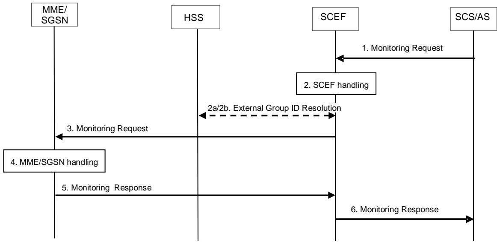  
Figure 5.6.2.1-1: Monitoring event configuration and deletion directly at MME/SGSN procedure

1. The SCS/AS sends a Monitoring Request (SCS/AS Identifier, Monitoring Type, Monitoring Duration, Maximum Number of Reports, T8 Destination Address, TLTRI for Deletion) message to the SCEF. The SCEF assigns a TLTRI that identifies the Monitoring Request.

NOTE: A relative priority scheme for the treatment of multiple SCS/AS Monitoring Requests, e.g. for deciding which requests to serve under overload condition, can be applied. This priority scheme is used locally by the SCEF, i.e. it is not used nor translated in procedures towards other functions.

2. The SCEF stores the TLTRI, and also assigns it to an SCEF Reference ID. Based on operator policies, if either the SCS/AS is not authorized to perform this request (e.g. if the SLA does not allow for it) or the Monitoring Request is malformed or the SCS/AS has exceeded its quota or rate of submitting monitoring requests, the SCEF performs step 6 and provides a Cause value appropriately indicating the error. The SCEF stores the Monitoring Duration, the Maximum Number of Reports, the T8 Destination Address, the SCS/AS Identifier. If the SCEF received a TLTRI for Deletion, the SCEF looks up the SCEF context pointed to by the TLTRI to derive the related SCEF Reference ID for Deletion. If an External Group Identifier(s) was included in the request of step 1, then then flow proceeds to step 2a, otherwise steps 2a and 2b are skipped.

2a. When the SCS/AS includes External Group Identifier(s) in the monitoring request, the SCEF sends an External Group ID Resolution Request (External Group Identifier(s)) message to the HSS.

2b. The HSS resolves the External Group Identifier(s) to IMSI-Group Identifier(s) and sends an External Group ID Resolution Response (IMSI-Group Identifier(s)) message to the SCEF.

3. The SCEF sends a Monitoring Request (SCEF ID, SCEF Reference ID, Monitoring Type, Monitoring Duration, Maximum Number of Reports, SCEF Reference ID for Deletion) message to the MME(s)/SGSN(s).

4. The MME/SGSN examines whether it can accept the request from that SCEF based on operator configuration or whether it serves the SCEF Reference ID for Deletion and can delete it. If acceptable, the MME/SGSN stores SCEF ID, SCEF Reference ID, Monitoring Duration, Maximum Number of Reports and other relevant parameters unless it is a One-time request and the Monitoring Event is available to the MME/SGSN at this time. The MME/SGSN deletes the monitoring configuration identified by the SCEF Reference ID for Deletion, if provided.

5. The MME/SGSN sends a Monitoring Response (SCEF Reference ID, Cause, Monitoring Event Report) message to the SCEF to acknowledge acceptance of the Monitoring Request and to provide the requested monitoring information or to acknowledge the deletion of the identified monitoring event configuration, if it was requested.

6. The SCEF sends a Monitoring Response (TLTRI, Cause, Monitoring Event Report) message to the SCS/AS to acknowledge acceptance of the Monitoring Request and to provide the requested monitoring information in Monitoring Event Report parameter or to acknowledge the deletion of the identified monitoring event configuration, if it was requested.

## 5.6.2.2 Void

## 5.6.2.3 Specific Steps for Monitoring Event: Number of UEs present in a geographic area

This monitoring event allows the SCS/AS to ask for the number of UEs that are in the geographic area described by the SCS/AS. The SCS/AS may ask for the UEs that the system knows by its normal operation to be within the area (Last Known Location) or the SCS/AS may request the system to also actively look for the UEs within the area (Current Location). Whether the request is for Current Location or Last Known Location is indicated by the parameter Location Type. For this monitoring event only One-time reporting is supported and the Monitoring Duration as well as the Maximum Number of Reports parameters shall be ignored by the SCEF if present in the request.

In this release only Last Known Location is supported for this monitoring event.

When the SCS/AS includes External Group Identifier(s) in the monitoring request, the MME/SGSN counts the number of UEs at the requested location that have each IMSI Group Identifier(s) in its subscription information corresponding to the External Group Identifier(s) received from SCS/AS. The report that is provided by the network to the SCS/AS shall include the number of UEs in the geographic area per External Group Identifier.

NOTE 1: The system load resulting from this request may be highly dependent on Location Type.

1. The SCS/AS sets Monitoring Type to "Number of UEs present in a geographic area" and adds Location Type and Geographic Area before sending Monitoring Request to the SCEF as in step 1 of clause 5.6.2.1. The request may optionally include External Group Identifier(s).

2. The SCEF executes step 2 of clause 5.6.2.1. In addition, the SCEF maps the Geographic Area to a list of cells, eNodeBs and/or RAI(s)/TAI(s) and identifies the MMEs/SGSNs serving them by resolving the RA(s)/TA(s) to node addresses.

NOTE 2: The mapping of Geographic Areas to serving operator (MNO) network list of cells, eNodeBs and/or RAs/TAs, and the identity of the associated serving nodes (e.g. MMEs/SGSNs) is configured at the SCEF.

3. The SCEF adds Monitoring Type, Location Type, list of cells, eNodeBs and/or RAI(s)/TAI(s) before sending the Monitoring Request to those MMEs/SGSNs identified in step 3 of clause 5.6.2.1. If External Group Identifier(s) were included in step 1, then the IMSI-Group Identifier(s) that were obtained in step 2 are included in the request to the MME/SGSN.

4. The MME/SGSN executes step 4 of clause 5.6.2.1. In addition, if the request is for Last Known Location with cell or eNodeB granularity or for a location with RA/TA granularity, the MMEs/SGSNs collect all UEs for which the MME/SGSN stores a last known cell, eNodeB or RA/TA registration information that corresponds to the requested location.

NOTE 3: For Location Type Last Known Location, how the MME/SGSN determines the candidate set of UEs to be included is left to implementation.

5. The MME/SGSN executes step 5 of clause 5.6.2.1. The response from the MME/SGSN includes the count of the number of UEs at the requested location. If the request of step 3 included an IMSI-Group Identifier(s), the report from the MME/SGSN shall include the number of UEs in the geographic area per IMSI-Group Identifier(s). When IMSI-Group Identifier(s) were included in the request of step 3, the MME/SGSN may optionally, depending on operator configuration, include either the External Identifiers or the MSISDNs of the UEs that are associated with each IMSI-Group Identifier(s).

6. The SCEF combines the results from all involved MMEs/SGSNs to the total sum, i.e. the Number of UEs, and executes step 6 of clause 5.6.2.1. When External Identifiers or MSISDNs were included in the results that were received from the MME(s)/SGSN(s) in step 5, they are included in the response to the SCS/AS.

## 5.6.3 Reporting of Monitoring Events from the HSS or the MME/SGSN

## 5.6.3.1 Reporting Procedure

The following figure illustrates the common procedure flow of reporting Monitoring Events that are detected by the MME/SGSN or HSS. The steps specific to different Monitoring Event types are detailed in clauses 5.6.3.2 to 5.6.3.8.

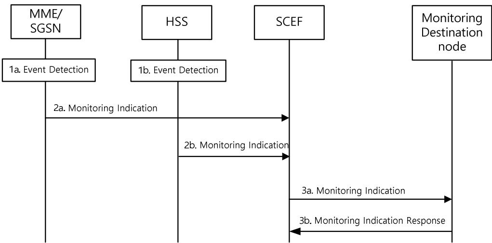  
Figure 5.6.3.1-1: Monitoring event reporting procedure

1a. A Monitoring Event is detected by the MME/SGSN at which the Monitoring Event is configured.

1b. Either a Monitoring Event is detected by the HSS, or the HSS needs to inform the SCEF about the change of status (suspend/resume/cancel) of an ongoing monitoring if an event related with the change of monitoring support at the serving node, (e.g. lack of monitoring support in MME/SGSN or revocation of monitoring authorization) is detected in the HSS. The HSS also stores the time when the Event is detected or the status is changed.

2a. The MME/SGSN sends a Monitoring Indication (SCEF Reference ID(s), Monitoring Event Report, User Identity) message to the SCEF. The SCEF store the time when it receives the Monitoring Indication.

If the Monitoring Event configuration was triggered by a One-time Monitoring Request, then the Monitoring Event configuration is deleted by the MME/SGSN upon completion of this step. If the MME/SGSN has a Maximum Number of Reports stored for this monitoring task, the MME/SGSN shall decrease its value by one. If the value of remaining number of reports is zero, the MME/SGSN shall locally remove the Monitoring Event Configuration. If the Monitoring Event configuration includes User Identity, the MME/SGSN sends the Monitoring Indication message including the User Identity. So that the SCEF can determine what groups the report pertains to, multiple SCEF Reference IDs can be included if the UE is part of multiple groups that require the same monitoring indication.

2b. When reporting for an individual UE or individual Group Member UE, the HSS sends a Monitoring Indication (SCEF Reference ID(s), External ID or MSISDN, Monitoring Event Report) message to the SCEF. External ID or MSISDN are only included if the indication is associated with an individual Group Member UE. If the Monitoring Event configuration was triggered by a One-time Monitoring Request, then the Monitoring Event configuration for the individual UE and for the individual group member UE is deleted by the HSS upon completion of this step. If the HSS has a Maximum Number of Reports stored for this monitoring task, the HSS shall decrease its value by one. Based on SCEF Reference ID, the SCEF can determine what groups the report pertains to. Multiple SCEF Reference IDs can be included if the UE is part of multiple groups that require the same monitoring indication.

If Group Reporting Guard Time was provided during the Monitoring Event configuration procedure, the HSS accumulates a Monitoring Event for the UEs of the group within the Group Reporting Guard Time. After the Group Reporting Guard Time expiration, the HSS send a Monitoring Indication (SCEF Reference ID, (Monitoring Event Report(s), External ID or MSISDN) Set, External Group ID) message to the SCEF. For each group member UE all the Monitoring Event Report and the corresponding stored time(s) are sent to the SCEF.

The External Group ID may be included in the message to indicate that the event has been detected for all group members. When the External Group ID is included in the indication, External ID(s) and MSISDN(s) are optional.

NOTE: For the group-basis Monitoring Event configuration, the HSS may divide the accumulated Monitoring Event Reports into multiple Monitoring indication messages due to the limitation of the message size.

3a. Using the SCEF Reference ID, the SCEF retrieves the associated TLTRI along with the T8 Destination Address.

If the TLTRI refers to a Monitoring Event Configuration for a single UE, the SCEF sends a Monitoring Indication (TLTRI, Cause, Monitoring Event Report) message to the identified destination. If the TLTRI refers to a group-based Monitoring Event configuration, and if no Group Reporting Guard Time was set, then the SCEF sends a Monitoring Indication (TLTRI(s), Cause, Monitoring Event Report) message to the identified destination. So that the SCEF can determine what groups the report pertains to, multiple TLTRIs can be included if the UE is part of multiple groups that require the same monitoring indication.

If the TLTRI refers to a group-based Monitoring Event Configuration, and if Group Reporting Guard Time was provided during the Monitoring Event configuration procedure, then the SCEF accumulates Monitoring Event for the UEs of the group until the Group Reporting Guard Time expiry. Upon expiration of which, the SCEF sends a Monitoring Indication (TLTRI, Cause, list of (External Identifier or MSISDN, Monitoring Event Report(s))) message to the identified destination. A list of accumulated Monitoring Event Report for each group member UE identified by either External Identifier or MSISDN is also included. For each group member UE all the received Monitoring Event Report, and the corresponding time received at SCEF or the time value sent by HSS, are sent to the SCS/AS.

For individual UE, if a report is received (step 2a or step 2b) for One-time Monitoring Request or the maximum number of reports is reached for a Continuous Monitoring Request, the SCEF requests the HSS (for monitoring events configured via HSS) to delete the related monitoring event configuration for the individual UE and deletes also its associated Monitoring Event configuration according to the procedure of clause 5.6.1.1 step 3-8.

For an individual group member UE, if a report is received (step 2a or step 2b) for One-time Monitoring Request or the maximum number of reports is reached for a Continuous Monitoring Request, based on the Number of UEs received in step 4a in clause 5.6.1.1 and local policy, the SCEF shall either:

request the HSS (for monitoring events configured via HSS) to delete the related monitoring event configuration for the individual group member UE; or

wait until reports for all group member UEs are complete and then request the HSS (for monitoring events configured via HSS) to delete the related monitoring event configuration.

The SCEF uses the identity of individual group member UE(s) (i.e. External Identifier or MSISDN) received in the step 2a or step 2b and the Number of UEs received in step 4a in clause 5.6.1.1 to determine if reporting for the group is complete. If it is complete, the SCEF deletes the associated Monitoring Event configuration for the group.

3b. For each Monitoring Indication message received in step 3a, the SCS/AS sends a Monitoring Indication Response (Cause) message to the SCEF. Cause value reflects successful or unsuccessful acknowledgement of Monitoring Indication message.

When the Monitoring Duration expires for a continuous Monitoring Request in the HSS, the MME/SGSN or the SCEF, then each of these nodes shall locally delete the related Monitoring Event configuration associated with the individual UE or group member UE.

## 5.6.3.2 Reporting Event: Loss of connectivity

1a. This monitoring event is detected as of step 1a of clause 5.6.3.1, which is when the mobile reachability timer expires, when an active UE is purged (see TS 29.272 [31]), when ISR is disabled and a UE, MME, SGSN, or HSS initiated detach occurs (see TS 23.401 [7], TS 23.060 [6]), or when ISR is enabled and a UE, MME, SGSN, or HSS initiated detach occurs and the MME or SGSN sends a Detach Notification message to the SGSN or MME with a Cause value that indicates complete, see (TS 23.401 [7]).

2a. Step 2a of clause 5.6.3.1 is executed.

3. Step 3 of clause 5.6.3.1 is executed.

## 5.6.3.3 Reporting Event: UE reachability

1a. This monitoring event is detected as of step 1a of clause 5.6.3.1, which is when the UE changes to connected mode or when the UE will become reachable for paging (for a UE using extended idle mode DRX).

If Maximum Response Time was included in step 5 of clause 5.6.1.4, then the MME/SGSN keeps the corresponding S1-U/Iu-PS connections of the UE for a duration of at least the Maximum Response Time less the UE's PSM Active Timer value. If the UE uses extended idle mode DRX, the MME/SGSN takes the Maximum Response Time into account to determine when to report this monitoring event before the next Paging Occasion occurs.

1b. This monitoring event is detected as of step 1b of clause 5.6.3.1, which is when the HSS detects that the UE is reachable for SMS.

2a. Step 2a of clause 5.6.3.1 is executed. The Monitoring Event Report indicates if the event was caused by the UE changing to connected mode or by the UE becoming reachable for paging.

2b. Step 2b of clause 5.6.3.1 is executed.

3. Steps 3a-3b of clause 5.6.3.1 are executed. The Monitoring Event Report indicates if the event was caused by the UE changing to connected mode or by the UE becoming reachable for paging. If Idle Status Indication was not requested during Monitoring Event configuration, then the flow stops here.

4. UE transitions to idle mode as specified in TS 23.401 [7].

5. If Idle Status Indication was requested during Monitoring Event configuration, and the MME/SGSN supports Idle Status Indication, then MME executes step 1a, and includes the time at which the UE transitioned into idle mode, its granted active time (if PSM is enabled), the eDRX cycle length (if extended idle mode DRX is enabled), the periodic TAU/RAU timer granted to the UE by the MME and the Suggested number of downlink packets if a value was provided to the S-GW in the message.

6. The SCEF executes steps 3a-3b of clause 5.6.3.1, and includes additional parameters specified in step 5 above.

## 5.6.3.4 Reporting Event: Location Reporting

1a. This monitoring event is detected as of step 1a of clause 5.6.3.1, which is when the MME/SGSN detects that the UE changes location with the granularity as requested by the monitoring event configuration.

2a. Step 2a of clause 5.6.3.1 is executed.

3. Step 3 of clause 5.6.3.1 is executed. Depending on operator configuration, the SCEF either maps the reported 3GPP system specific location information to the accepted Accuracy format, sent in step 9 of clause 5.6.1.5, or sends it as-is to the SCS/AS.

## 5.6.3.5 Reporting Event: Change of IMSI-IMEISV association

1b. This monitoring event is detected as of step 1b of clause 5.6.3.1, which is when the HSS receives from a serving node an IMEISV that is different from the IMEISV stored by the HSS for the IMSI.

2b. Step 2b of clause 5.6.3.1 is executed.

3. Step 3 of clause 5.6.3.1 is executed. The Monitoring Indication message includes the new IMEISV.

## 5.6.3.6 Reporting Event: Roaming Status

1b. This monitoring event is detected as of step 1b of clause 5.6.3.1, which is when the HSS receives from a serving node a serving PLMN ID that is different from the one stored by the HSS.

2b. Step 2b of clause 5.6.3.1 is executed. If the UE is registered to different PLMNs via 3GPP and N3GPP Access Type, then the HSS includes two instances of Roaming Status in the Monitoring Indication message.

3. Step 3 of clause 5.6.3.1 is executed. The monitoring information indicates the ID of the serving PLMN and whether it is the home or a roaming PLMN. Operator policies in the SCEF may restrict the report, e.g. to indicate

only whether the UE is in the home or in a roaming PLMN. The SCEF includes all Roaming Status instances that it received from the HSS.

## 5.6.3.7 Reporting Event: Communication failure

1a. This monitoring event is detected as of step 1a of clause 5.6.3.1, which is when the MME/SGSN becomes aware of a RAN or NAS failure event.

2a. Step 2a of clause 5.6.3.1 is executed.

3. Step 3 of clause 5.6.3.1 is executed. Based on operator configuration, the SCEF reports either the received failure cause code(s) as-is or an abstracted value.

## 5.6.3.8 Reporting Event: Availability after DDN failure

1a. This monitoring event is detected as of step 1a of clause 5.6.3.1, which is when the MME/SGSN becomes aware of UE availability after DDN failure.

2a. Step 2a of clause 5.6.3.1 is executed.

3. Step 3 of clause 5.6.3.1 is executed.

## 5.6.3.9 Reporting Event: PDN Connectivity Status

1a. This monitoring event is detected as of step 1a of clause 5.6.3.1, which is when a new PDN connection is created for the UE, or when a PDN connection is deleted for the UE, or for PDN connections that exist when the PDN Connectivity Status monitoring event is configured in the MME/SGSN. Reporting is also done for PDN Connections using T6a/T6b connection towards the SCEF.

2a. Step 2a of clause 5.6.3.1 is executed. The Monitoring Event Report indicates if the event was caused by a creation or deletion of a PDN Connection. The Monitoring Event Report indicates IP address, PDN Type, APN, 3GPP Interface Indication, and the new PDN Connectivity Status i.e. "created" or "deleted". For PDN Type Non-IP, the reported IP address may be the address allocated for SGi PtP tunnelling based on UDP/IP (see clause 4.3.17.8.3.3.2 of TS 23.401 [7]). MME leaves the IP address field empty in the Monitoring Event Report if it is not available. When reporting IPv6 address, the MME reports the IPv6 prefix when the full IPv6 address is not available. The 3GPP Interface Indication is set to "API-connectivity" for PDN Connections using T6a/T6b connection towards the SCEF, or set to "IP-connectivity" for SGi connectivity using IP based PDN Types, or set to "Other" for SGi connectivity using PDN Type Non-IP.

NOTE: If NAT is used, the reported IP Address is the UE's private IP Address which is then different than the UE's public IP Address. If no IP Address is assigned to the UE during PDN connection establishment (e.g. when DHCP is used after PDN connection establishment) no IP Address is included in the report.

3. Steps 3a-3b of clause 5.6.3.1 are executed. The SCEF sends the Monitoring Event Report to SCS/AS based on APN determined at Monitoring Event configuration (see clause 5.6.1.10).

## 5.6.4 Monitoring events configuration and reporting via PCRF

## 5.6.4.1 Request of monitoring event reporting

Figure 5.6.4-1 illustrates the procedure to request monitoring events reporting via PCRF with a reference to TS 23.203 [27]. The procedure is common for any monitoring event defined in clause 4.5.6.3 "Monitoring Events via PCRF".

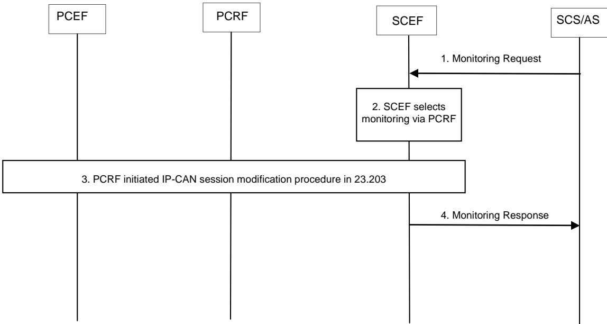  
Figure 5.6.4-1: Requesting monitoring via PCRF

1. The SCS/AS sends a Monitoring Request to the SCEF, including the information listed in step 1 of clause 5.6.1.1.

2. The SCEF checks that the SCS/AS is authorised to send monitoring request as defined in step 2 of clause 5.6.1.1. If an error is detected, then the message of step 4 is sent to SCS/AS with Cause value appropriately indicating the error and the flow stops at this step.

3. If operator policies indicate that monitoring is performed via PCRF, for the events listed in clause 4.5.6, the SCEF, acting as an Application Function, triggers the PCRF initiated-IP-CAN session modification procedure defined in TS 23.203 [27].

4. The SCEF sends a Monitoring Response (Cause, Monitoring Event Report) message to the SCS/AS. If the SCEF received a Monitoring Event Report then it includes it in the Monitoring Response message.

## 5.6.4.1a Request of monitoring event reporting for a group of UEs

Figure 5.6.4.1a-1 illustrates the procedure to request monitoring events reporting via PCRF for a group of UEs with a reference to TS 23.203 [27].

For monitoring for a group of UEs, the SPR is configured with the External Group Identifier the UE belongs to.

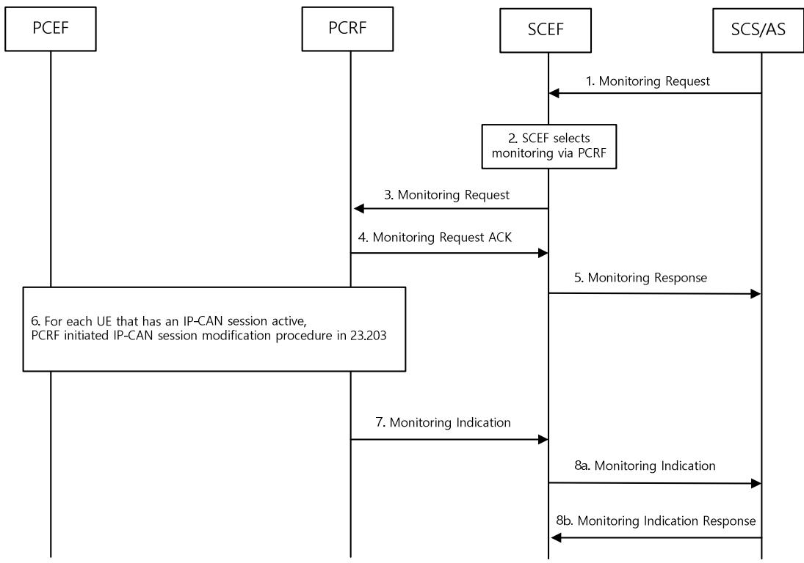

## Figure 5.6.4.1a-1: Requesting monitoring via PCRF for a group of UEs

1. The SCS/AS sends a Monitoring Request to the SCEF, including the information listed in step 1 of clause 5.6.1.1 in figure 5.6.1.1-1. Maximum Number of Reports and Monitoring Duration shall not be included in the request.

2. The SCEF checks that the SCS/AS is authorised to send monitoring request as defined in step 2 of clause 5.6.1.1 in figure 5.6.1.1-1. If an error is detected, steps 3-4 are skipped, the message of step 5 is sent to SCS/AS with Cause value appropriately indicating the error, and the flow stops.

3. If operator policies indicate that monitoring is performed via PCRF, for the events listed in clause 4.5.6 applicable for a group of UEs, the SCEF triggers a Monitoring Request (SCEF Reference ID, External Group Identifier, event to monitor) over Nt interface to each PCRF in the operator´s network.

4. Each PCRF that serves a UE that is associated with the External Group Identifier stores the External Group Identifier, the event to monitor, the SCEF Reference ID, and the SCEF that sent the request and then sends a Monitoring Response message to the SCEF. If a PCRF serves no UEs that are associated with the External Group Identifier, the Monitoring Response Indicates that the PCRF is not currently serving any of the group members, and steps 6 and 7 are skipped for that PCRF.

5. The SCEF stores an indication that monitoring has been requested for the group of UEs for each PCRF that did not respond in step 4 with an indication that it is serving no group members. and then Once all PCRFs have responded in step 4, the SCEF and then sends a Monitoring Response (Cause) message to the SCS/AS.

6. Each PCRF that found a UE that has the External Group Identifier associated with it performs the following steps:

For each UE that has an IP-CAN session established, the PCRF initiated-IP-CAN session modification procedure is triggered as defined in TS 23.203 [27]. Note that if the UE has multiple IP-CAN session established, only one PCRF initiated IP-CAN session modification is needed. The PCRF stored the SCEF address to report monitoring events for this group.

7. The PCRF sends a Monitoring Indication ((MSISDN or External ID, SCEF Reference ID, Cause) message to the SCEF. The Monitoring Indication may include reports for multiple UEs. If the Monitoring Indication does not include information for all UEs in the group, then the PCRF may send multiple Monitoring Indications to the SCEF. The PCRF indicates to the SCEF when the result for the last UE in the group is sent. The same PCRF will not send duplicate reports for the same UE to the SCEF.

NOTE: A UE may have established multiple IP-CAN sessions, each IP-CAN session under control of a different PCRFs.

8a. The SCEF sends a Monitoring Indication (TLTRI, MSISDN or External ID, Cause) message to the SCS/AS. The Monitoring Indication may include reports for multiple UEs. If the Monitoring Indication does not include information for all UEs in the group, then the SCEF may send multiple Monitoring Indications to the SCS/AS. The SCEF indicates to the SCS/AS when the result for the last UE is sent. The SCEF may wait for Monitoring Indication messages from multiple PCRFs so that it can send an aggregated response to the SCS/AS.

8b. For each Monitoring Indication message received in step 8a, the SCS/AS sends a Monitoring Indication Response (Cause) message to the SCEF. Cause value reflects successful or unsuccessful acknowledgement of Monitoring Indication message.

## 5.6.4.2 Common Parameters of the request reporting procedure

The following parameters are applicable when the procedure for monitoring via PCRF is used: TLTRI, Monitoring Type, Priority and T8 Destination Address.

The Monitoring types are defined in clause 4.5.6. The Priority is relevant to the SCEF, not transferred over Rx or Nt.

For single UE monitoring, the following parameters are not applicable when the procedure for monitoring via PCRF is used: SCEF Address, SCEF Reference ID, and Maximum Number of Reports. The SCEF address is not needed as Rx procedures do not require the AF address to be sent. The Maximum Number of Reports is not needed as only one time report is supported.

The following parameters are needed for the procedure for monitoring via PCRF for a request for an individual UE: UE IP address and service information (e.g. application identifier or media description or both).

The following parameters are needed for the procedure for monitoring via PCRF for a request for group of UEs: External Group identifier.

NOTE: The UE IP address provided by the SCS/AS is assumed to not be NAT'ed from the PDN-GW or GGSN to the SCS/AS at user plane. The UE IP address does not overlap with other UE IP addresses within the operator domain.

For monitoring for a group of UEs, the SPR is configured with the External Group Identifier the UE belongs to and External Identifier and the SCEF is configured with the list of PCRFs in the operator´s domain. The formats of the External Group Identifier and External Identifier are defined in clause 4.6.

## 5.6.4.3 Specific Parameters for Monitoring Event: Location Reporting

This monitoring event allows the SCS/AS to request the Current Location. The supported Accuracy may be at different levels which are described in clause 4.9.2. The Monitoring Event Report delivers the subscriber location and may include a time stamp to indicate when the UE was last-known to be in that location, i.e. if the current location or lastknow location is provided.

NOTE: SCEF can map IP-CAN provided location to the location granularity required by SCS/AS only if it is configured to do so.

The description below is applicable if SCS/AS request Monitoring Type to "Location Reporting" for a single UE and Location Type is either "current location" or "last known location".

1. The SCS/AS sets Monitoring Type to "Location Reporting", and adds Location Type in a Monitoring Request to the SCEF as in step 1 of 5.6.4.1.

2. The SCEF executes step 2 of 5.6.4.1.

3. The SCEF triggers PCRF initiated IP-CAN session modification procedure, including the UE IP address and the Access Network information report request. The PCRF provides the Access Network Information report to the SCEF.

4. Based on operator policies, the SCEF either maps the location information to a geo-location or sends the location information to the SCS/AS. If the time stamp is included indicating that this is the last known location the SCEF indicates in the location type that this is last known location.

The description below is applicable if SCS/AS request Monitoring Type to "Location Reporting" for a group of UEs and Location Type is either "current location" or "last known location".

1. The SCS/AS sets Monitoring Type to "Location Reporting", and adds Location Type in a Monitoring Request to the SCEF as in step 1 of 5.6.4.1a.

2. The SCEF executes step 2 of 5.6.4.1a.

3. The SCEF triggers a Monitoring Request (External Group Identifier, Access Network information report request) to the PCRF over Nt interface to each PCRF in the operator´s network.

4. Each PCRF executes step 4 of 5.6.4.1a. If a PCRF serves no UEs that are associated with the External Group Identifier, steps 6 and 7 are skipped for that PCRF.

5. The SCEF executes step 5 of 5.6.4.1a.

6. The PCRF executes step 6 of 5.6.4.1a. For those UEs that have an IP-CAN session established, the PCRF initiated IP-CAN session modification procedure, including the Access Network information report request is performed. The PCRF stores the received Access Network Information for each IP-CAN session

7. The PCRF executes step 7 of 5.6.4.1a. The Monitoring Indication includes Access Network Information for each UE.

8a. The SCEF executes step 8a of 5.6.4.1a. The response includes location information for each group member UE. Based on operator policies, the SCEF either maps the Access Network Information to a geo-location or sends the Access Network Information to the SCS/AS. If the time stamp is included indicating that this is the last known location the SCEF indicates in the location type that this is last known location.

8b. The SCS/AS executes step 8b of 5.6.4.1a.

## 5.6.4.4 Specific Parameters for Monitoring Event: Communication Failure

This monitoring event allows the SCS/AS to be notified of communication failure events, identified by RAN/NAS or TWAN/UWAN Release Cause codes, per TS 23.203 [27].

1. The SCS/AS sets Monitoring Type to "Communication Failure" in the Monitoring Request to the SCEF sent as in step 1 of 5.6.4.1.

2. The SCEF executes step 2 of 5.6.4.1.

3. The SCEF triggers PCRF initiated IP-CAN session modification procedure, including the UE IP address and the dynamic session information. The PCRF provisions PCC Rules according to the provided session information. If the PCEF provides either RAN/NAS release code in GPRS/UTRAN/E-UTRAN, TWAN release code in TWAN or Untrusted WLAN release code the PCRF sends it to the SCEF.

4. Based on operation policies the SCEF may normalize the Release code to acceptable values per SLA that the SCS/AS accepts.

## 5.6.5 Reporting of Monitoring Events from the PCRF

The following figure illustrates the procedure to report Monitoring Events via PCRF. This procedure is applicable for reporting both user location information and communication failure for a single UE. This procedure does not apply to group monitoring. It is assumes that PCRF subscribes to Access Network Information report.

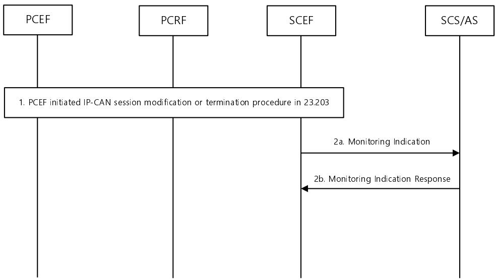  
Figure 5.6.5-1: Reporting event procedure

1. The PCEF reports a monitoring event, either the location reporting stored in MME at Detach or dedicated bearer deactivation or a communication failure at dedicated bearer deactivation to the PCRF using PCEF initiated IP-CAN session modification or termination procedure defined in TS 23.203 [27], then the PCRF to the SCEF over Rx if the event was requested over Rx. Both events terminate the AF session to the SCEF.

2a. The SCEF retrieves the TLTRI along with the address of SCS/AS intended for Monitoring Indication message for the associated Rx session. The SCEF sends a Monitoring Indication (TLTRI, UE IP Address, Monitoring Event Report) message to the SCS/AS identified by T8 Destination Address stored in the SCEF.

2b. The SCS/AS sends a Monitoring Indication Response (Cause) message to the SCEF. Cause value reflects successful or unsuccessful acknowledgement of Monitoring Indication message.

## 5.6.6 Monitoring Event configuration and deletion via HSS for roaming scenarios using an IWK-SCEF

## 5.6.6.1 Configuration Procedure

Figure 5.6.6.1-1 illustrates the procedure of configuring monitoring events at the HSS or the MME/SGSN. The procedure is common for various Monitoring Event types. The steps and parameters specific to different Monitoring Event types are detailed in clauses 5.6.6.3 to 5.6.6.9.

The procedure is also used for deleting a previously configured Monitoring Event while configuring a new Monitoring Event between the same SCEF and the same SCS/AS.

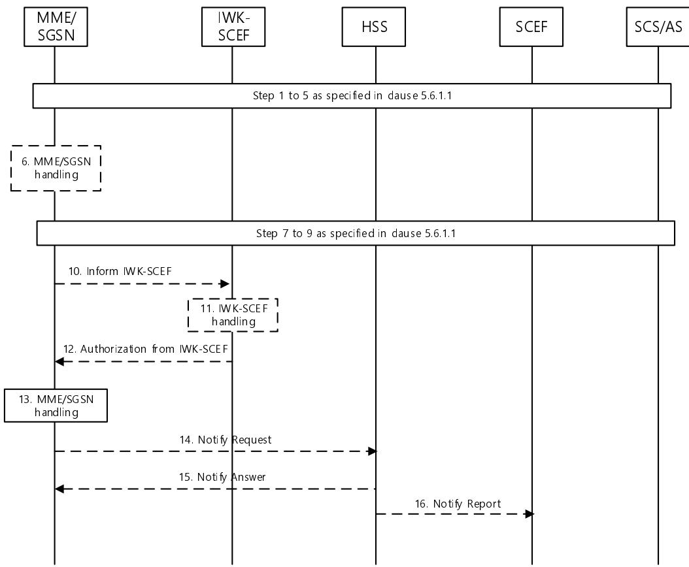  
Figure 5.6.6.1-1: Monitoring event configuration and deletion via HSS procedure

## 1-5. Steps of clause 5.6.1.1 are executed.

6. If the MME/SGSN is configured to use an IWK-SCEF for the PLMN of the SCEF and it is a One-time request and the Monitoring Event is available to the MME/SGSN, then the MME/SGSN collects the Monitoring Event data and includes it as Monitoring Event Report in step 10 so that the IWK-SCEF may perform normalization of Monitoring Event Report(s) according to operator policies, if required.

7-9. Steps 7-9 of clause 5.6.1.1.are executed.

10. MME/SGSN may send an Inform IWK-SCEF (Monitoring Type, SCEF ID, SCEF Reference ID, Maximum Number of Reports, Monitoring Duration, SCEF Reference ID for Deletion, Chargeable Party Identifier, Monitoring Event Report) message to the IWK-SCEF.

11. The IWK-SCEF may authorize the request, e.g. if the Monitoring Type is covered by a roaming agreement and notes the SCEF Reference ID for Deletion if available. If this authorization fails the IWK-SCEF follows step 12 and provides a Cause value indicating the reason for the failure condition to the MME/SGSN. Based on operator policies, the IWK-SCEF may also reject the request due to other reasons (e.g. overload or MME/SGSN has exceeded its quota or rate of submitting monitoring requests defined by an SLA).

If the request indicates deletion of a Monitoring Event Request, the IWK-SCEF shall perform any final operations necessary, e.g. generation of final charging information, delete any stored parameters, and send an acknowledgement to the MME/SGSN in step 12.

If the request indicates continuous reporting (new or a modification), the IWK-SCEF may authorize the request and, if authorization is successful, stores the received parameters, sends an acknowledgement to the MME/SGSN in step 12, and starts to watch for the indicated Monitoring Event(s).

If the request indicates One-time reporting, then the IWK-SCEF may authorize the request and, if authorization is successful, may perform normalization of the data according to operator policies, and sends an acknowledgement to the MME/SGSN in step 12 that contains any such normalized data.

If the request included Monitoring Event Data then the IWK-SCEF may perform normalization of the data according to operator policies.

12. If the authorization is successful, the IWK-SCEF sends an Authorization from IWK-SCEF (Cause, Monitoring Event Report) message to MME/SGSN.

The Monitoring Event Report is included if it was a One-time request, the MME/SGSN provided the Monitoring Event Report in the Inform IWK-SCEF message and the IWK-SCEF is not reporting directly to the SCEF as described clause 5.6.8.1 step 2c.

13. The MME/SGSN may verify the request, e.g. if the Monitoring Type is covered by a roaming agreement when the request is from another PLMN or whether it serves the SCEF Reference ID for Deletion and can delete it. If this check fails the MME/SGSN follows step 14 and provides a Cause value indicating the reason for the failure condition to the SCEF. Based on operator policies, the MME/SGSN may also reject the request due to other reasons (e.g. overload or HSS has exceeded its quota or rate of submitting monitoring requests defined by an SLA).

The MME/SGSN starts to watch for the indicated Monitoring Event unless it is a One-time request and the Monitoring Event is available to the MME/SGSN at the time of sending Insert Subscriber Data Answer. The MME/SGSN deletes the monitoring configuration identified by the SCEF Reference ID for Deletion, if provided.

NOTE 2: The MME/SGSN will transfer the parameters stored for every monitoring task as part of its context information during an MME/SGSN change.

14. If the monitoring event configuration status received from IWK-SCEF is different than the result reported to the HSS in Step 7, the MME/SGSN shall send the Notify Request to the HSS to inform the monitoring event configuration status received from IWK-SCEF.

15. The HSS send the Notify Answer to the MME/SGSN.

16. If the HSS receives in step 14 the monitoring event configuration status from the MME/SGSN, the HSS shall notify the SCEF that the configured Monitoring Event is cancelled for the individual UE for those monitoring event configurations for which the status received from the MME/SGSN is marked as not accepted. The HSS shall subsequently locally delete the Monitoring Event for the individual UE and for the individual group member UE if the Monitoring Event is configured in the HSS, and steps 1-5 of clause 5.6.9 are executed.

5.6.6.2 Void

## 5.6.6.3 Specific Parameters for Monitoring Event: Loss of connectivity

The description in clause 5.6.1.3 applies with the following clarifications.

1-5. Steps 1-5 of clause 5.6.1.3 are executed.

6. The MME/SGSN executes step 6 of clause 5.6.1.3, but if the values proposed by HSS is not acceptable to the MME/SGSN the MME/SGSN rejects the request and includes acceptable values in the reject message.

7-9. Steps 7-9 of clause 5.6.1.3 are executed.

## 5.6.6.4 Specific Parameters for Monitoring Event: UE reachability

The description in clause 5.6.1.4 applies with the following clarifications.

1-5. Steps 1-5 of clause 5.6.1.4 are executed.

6. The MME/SGSN executes step 6 of clause 5.6.1.4, but if the values proposed by HSS is not acceptable to the MME/SGSN the MME/SGSN rejects the request and includes acceptable values in the reject message.

7-9. Steps 7-9 of clause 5.6.1.4 are executed.

## 5.6.6.5 Specific Parameters for Monitoring Event: Location Reporting

The description in clause 5.6.1.5 applies with the following clarifications.

1-2. Steps 1-2 of clause 5.6.1.5 are executed.

3. If Accuracy is included in step 1 then based on operator configuration the SCEF may map it to permissible granularity at different levels, which are described in clause 4.9.2. If Accuracy is not included in step 1, the SCEF sets the granularity based on operator configuration. The SCEF adds Location Type and Accuracy prior to sending the Monitoring Request to the HSS as in step 3 of clause 5.6.1.5.

4-5. Steps 4-5 clause 5.6.1.5 are executed.

6. If the MME/SGSN is configured to use an IWK-SCEF for the PLMN of the SCEF and it is a One-time request, the MME/SGSN starts watching for cell/RA/TA/eNodeB changes, depending on requested Accuracy, and includes the location information as part of the Monitoring Event Data to the IWK-SCEF in step 7.

7. If the MME/SGSN is configured to use an IWK-SCEF for the PLMN of the SCEF, then the MME/SGSN shall execute the step 7 in clause 5.6.6.1.

8. The IWK-SCEF executes step 8 in clause 5.6.6.1, and if the request included Monitoring Event Data then the IWK-SCEF may perform normalization of the data according to operator policies.

9. The IWK-SCEF executes step 9 in clause 5.6.6.1.

10. If the MME/SGSN is configured to use an IWK-SCEF for the PLMN of the SCEF, then the MME/SGSN either starts to watch for the indicated Monitoring Event, or if the IWK-SCEF rejected the request the MME/SGSN rejects the request with the cause provided by the IWK-SCEF.

If the MME/SGSN is not configured to use an IWK-SCEF for the PLMN of the SCEF, then the MME/SGSN executes step 6 of clause 5.6.1.1 and in addition perform any actions required e.g. generating charging/accounting information.

11-13. Steps 7-9 of clause 5.6.1.1 are executed and include the report of the current or last known location, depending on what was requested. The SCEF, if not already done by the IWK-SCEF, maps eNodeB-ID/cell-ID/RAI/TAI to geo-location before reporting to the SCS/AS.

## 5.6.6.6 Specific Parameters for Monitoring Event: Change of IMSI-IMEI(SV) Association

The description in clause 5.6.1.6 applies as there are no VPLMN changes.

## 5.6.6.7 Specific Parameters for Monitoring Event: Roaming Status

The description in clause 5.6.1.6 applies as there are no VPLMN changes.

## 5.6.6.8 Specific Parameters for Monitoring Event: Communication failure

The description in clause 5.6.1.8 applies with the following clarifications.

1. The SCS/AS sets Monitoring Type to "Communication Failure" prior to sending Monitoring Request to the SCEF as in step 1 of clause 5.6.1.8.

2. The SCEF executes step 2 of clause 5.6.1.8.

3. The SCEF executes step 3 of clause 5.6.1.8.

4. The HSS executes step 4 of clause 5.6.1.8.

5. The HSS executes step 5 of clause 5.6.1.8.

6. Not applicable.

7. If the MME/SGSN is configured to use an IWK-SCEF for the PLMN of the SCEF, the MME/SGSN executes step 7 of 5.6.6.1.

8. The IWK-SCEF executes step 8 of clause 5.6.6.1.

9. The IWK-SCEF executes step 9 of clause 5.6.6.1.

10. The MME/SGSN executes step 6 of clause 5.6.1.8 and starts watching for communication failure events.

11-13. Steps 7-9 of clause 5.6.1.8 are executed.

## 5.6.6.9 Specific Parameters for Monitoring Event: Availability after DDN Failure The description in clause 5.6.1.5 applies with the following clarifications.

1-5. Steps 1-5 are executed according to clause 5.6.6.9.

6. Not applicable.

7. If the MME/SGSN is configured to use an IWK-SCEF for the PLMN of the SCEF, the MME/SGSN executes step 7 of 5.6.6.1.

8. The IWK-SCEF executes step 8 of clause 5.6.6.1.

9. The IWK-SCEF executes step 9 of clause 5.6.6.1.

10. The MME/SGSN executes step 6 of clause 5.6.1.9.

11-13. Steps 7-9 of clause 5.6.1.9 are executed.

## 5.6.7 Monitoring Events configuration and deletion directly at the MME/SGSN for roaming scenarios

In this Release there is no support for Monitoring Events configuration and deletion directly at the MME/SGSN for roaming scenarios.

## 5.6.8 Reporting of Monitoring Events from the HSS or the MME/SGSN for roaming scenarios

## 5.6.8.1 Reporting Procedure

The following figure illustrates the common procedure flow of reporting Monitoring Events that are detected by the MME/SGSN or HSS for roaming scenarios. The steps specific to different Monitoring Event types are detailed in clauses 5.6.8.2 to 5.6.8.8.

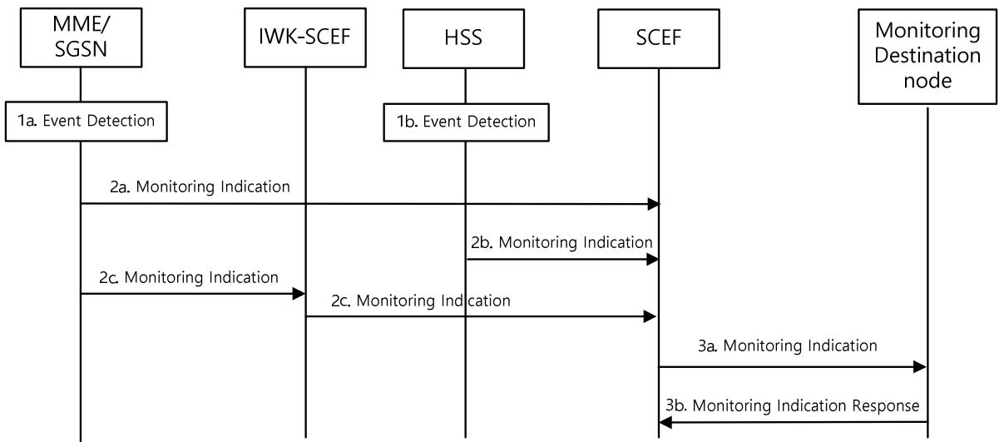  
Figure 5.6.8.1-1: Monitoring event reporting procedure for roaming scenarios

1a. A Monitoring Event is detected by the MME/SGSN at which the Monitoring Event is configured.

1b. Either a Monitoring Event is detected by the HSS, or the HSS needs to inform the SCEF about the change of status (suspend/resume/cancel) of an ongoing monitoring if an event related with the change of monitoring support at the serving node, (e.g. lack of monitoring support in MME/SGSN or revocation of monitoring authorization) is detected in the HSS.

2a. If the MME/SGSN is not configured to use an IWK-SCEF for the PLMN of the SCEF then the MME/SGSN executes step 2a in clause 5.6.3.1. The MME/SGSN in addition generates any required charging/accounting information.

2b. The HSS executes step 2b in clause 5.6.3.1.

2c. If the MME/SGSN is configured to use an IWK-SCEF for the PLMN of the SCEF, then the MME/SGSN sends a Monitoring Indication (SCEF Reference ID(s), Monitoring Event Report, User Identity) message to the IWK-SCEF. If the Monitoring Event configuration was triggered by a One-time Monitoring Request, then the Monitoring Event configuration is deleted by the MME/SGSN upon completion of this step. If the MME/SGSN has a Maximum Number of Reports stored for this monitoring task, the MME/SGSN shall decrease its value by one. When the Monitoring Duration expires for a continuous Monitoring Request in the HSS, the MME/SGSN or the SCEF, then each of these nodes shall locally delete the related Monitoring Event configuration associated with the individual UE or group member UE. So that the SCEF can determine what groups the report pertains to, multiple SCEF Reference IDs can be included if the UE is part of multiple groups that require the same monitoring indication.

The IWK-SCEF sends a Monitoring Indication (SCEF Reference ID(s), Monitoring Event Report, User Identity) message to the SCEF. If the IWK-SCEF has a Maximum Number of Reports stored for this monitoring task, the IWK-SCEF shall decrease its value by one. When the maximum number of reports is reached for a Continuous Monitoring Request or in the case of a One-time Monitoring Request, the IWK-SCEF ends the reporting on the SCEF Reference ID. So that the SCEF can determine what groups the report pertains to, multiple SCEF Reference IDs can be included if the UE is part of multiple groups that require the same monitoring indication.

## 3. The SCEF executes step 3 in clause 5.6.3.1.

When the Monitoring Duration expires for a continuous Monitoring Request in the HSS, the MME/SGSN, the IWK-SCEF (if it is used in the visited PLMN) or the SCEF, then each of these nodes shall locally delete the related Monitoring Event configuration associated with the individual UE or group member UE.

## 5.6.8.2 Reporting Event: Loss of connectivity

1a. This monitoring event is detected as of step 1a of clause 5.6.8.1, which is when the mobile reachability timer expires, when an active UE is purged (see TS 29.272 [31]), when ISR is disabled and a UE, MME, SGSN, or HSS initiated detach occurs (see TS 23.401 [7], TS 23.060 [6]), or when ISR is enabled and a UE, MME, SGSN, or HSS initiated detach occurs and the MME or SGSN sends a Detach Notification message to the SGSN or MME with a Cause value that indicates complete, see (TS 23.401 [7]).

2. Dependent on MME/SGSN configuration step 2a or 2c of clause 5.6.8.1 is executed.

3. Step 3 of clause 5.6.8.1 is executed.

## 5.6.8.3 Reporting Event: UE reachability

1a. This monitoring event is detected as of step 1a of clause 5.6.8.1, which is when the UE changes to connected mode or when the UE will become reachable for paging (for a UE using extended idle mode DRX).

If Maximum Response Time was included in step 5 of clause 5.6.6.4, then the MME/SGSN keeps the corresponding S1-U/Iu-PS connections of the UE for a duration of at least the Maximum Response Time less the UE's PSM Active Timer value. If the UE uses extended idle mode DRX, the MME/SGSN takes the Maximum Response Time into account to determine when to report this monitoring event before the next Paging Occasion occurs.

2. Dependent on MME/SGSN configuration step 2a or 2c of clause 5.6.8.1 is executed. The Monitoring Event Report indicates if the event was caused by the UE changing to connected mode or by the UE becoming reachable for paging.

3. Step 3 of clause 5.6.8.1 is executed.

## 5.6.8.4 Reporting Event: Location Reporting

1a. This monitoring event is detected as of step 1a of clause 5.6.8.1, which is when the MME/SGSN detects that the UE changes location with the granularity as requested by the monitoring event configuration.

2. Dependent on MME/SGSN configuration step 2a or 2c of clause 5.6.8.1 is executed. If step 2c is executed, then the IWK-SCEF maps the reported 3GPP system specific location information to a geo-location and forwards it to the SCEF.

3. Step 3 of clause 5.6.8.1 is executed. The SCEF may map the reported 3GPP system specific location information to a geo-location and reports it.

## 5.6.8.5 Reporting Event: Change of IMSI-IMEI(SV) association

This monitoring event is executes as in clause 5.6.3.5.

## 5.6.8.6 Reporting Event: Roaming Status

This monitoring event is executes as in clause 5.6.3.6.

## 5.6.8.7 Reporting Event: Communication failure

1a. This monitoring event is detected as of step 1a of clause 5.6.8.1, which is when the MME/SGSN becomes aware of a RAN or NAS failure event.

2. Dependent on MME/SGSN configuration step 2a or 2c of clause 5.6.8.1 is executed. If step 2c is executed, then the IWK-SCEF either forwards the received failure cause code(s) as-is or an abstracted value to the SCEF.

3. Step 3 of clause 5.6.8.1 is executed. Based on operator configuration, the SCEF reports either the received failure cause code(s) as-is or an abstracted value.

## 5.6.8.8 Reporting Event: Availability after DDN failure

1a. This monitoring event is detected as of step 1a of clause 5.6.8.1, which is when the MME/SGSN becomes aware of UE availability after DDN failure.

2. Dependent on MME/SGSN configuration step 2a or 2c of clause 5.6.8.1 is executed.

3. Step 3 of clause 5.6.8.1 is executed.

## 5.6.8.9 Reporting Event: PDN Connectivity Status

This monitoring event executes as in clause 5.6.3.9.

## 5.6.9 Network-initiated Explicit Monitoring Event Deletion Procedure

The procedure is used by the SCEF towards the SCS/AS to delete a previously configured Monitoring Event.

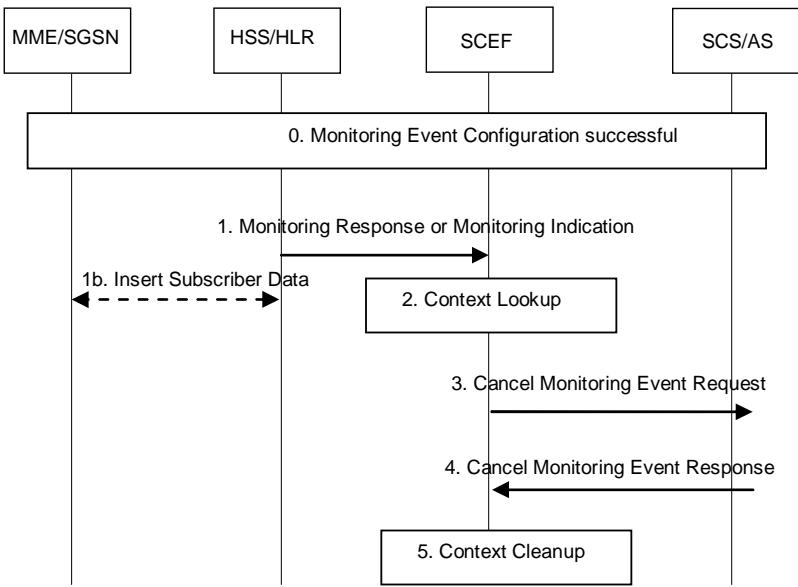  
Figure 6.5.9-1: Network-initiated Explicit Monitoring Event Deletion Procedure

0. A Monitoring Event configuration procedure according to clause 5.6.1 or clause 5.6.6 has already executed successfully.

1. The HSS returns a Monitoring Response message or triggers a Monitoring Indication message towards the SCEF and includes SCEF Reference ID of a previously accepted Monitoring Event which needs cancellation due to certain conditions such as:

For a single UE or a sub-set of UEs in a group for which there is an active monitoring event configuration, the monitoring event configuration is no longer valid (e.g. the previously subscribed periodic RAU/TAU Timer from one SCS/AS is being overwritten by another SCS/AS and the Enhanced Multiple Event Monitoring is not supported); or

For group based processing, if a given External Group ID for which a previous group request was accepted is now no longer valid; or

For group based processing, for UEs belonging to a group for which there is an active group based event configuration, the UE's subscription is deleted from the HSS or the UE's event monitoring is cancelled.

1b. The HSS also deletes the previously configured Monitoring Event in the MME/SGSN, if applicable, e.g. at deletion of an External Group ID in the HSS.

2. Based on the SCEF Reference ID for cancellation included in step 1a or local context lookup in step 1b, the SCEF determines TLTRI of the configured Monitoring Event which needs cancellation.

3. The SCEF sends a Cancel Monitoring Event Request (TLTRI, Cause) message to the T8 Destination Address. Cause value indicates the reason for cancellation of the previously configured Monitoring Event. If SCEF receives MSISDN(s) or External Identifier(s) in step 1 for group based processing and the Maximum Number of Reports applies to the monitoring event configuration, the SCEF sets the stored number of reports of the indicated UE(s) to Maximum Number of Reports and includes such UE identifier(s) in the Cancel Monitoring Event Request to the SCS/AS. If SCEF determines that the reporting for the group is complete based on the update above, the SCEF deletes the associated Monitoring Event configuration and request the HSS to delete the related monitoring event configuration for the group.

4. The SCS/AS sends a Cancel Monitoring Event Response (Cause) message to the SCEF. Cause indicates the result of the procedure. For single UE configuration, the SCS/AS deletes T8 context associated with the TLTRI received in step 3; for group based configuration, the SCS/AS deletes T8 context associated with the TLTRI received in step 3 when the event monitoring of the last UE in the group is cancelled.

5. The SCEF deletes T8 context and the SCEF EPS Bearer context associated with the TLTRI sent in step 3.

## 5.7 High latency communications procedures

## 5.7.1 Availability Notification after DDN Failure

## 5.7.1.1 General

In this feature, the AS subscribes once and then gets notification only when there has been some data delivery failure followed by the UE becoming reachable.

This feature involves an entry in the subscription for a UE for "network application triggering when the UE is available after a DDN failure". This is a different monitoring event from the "UE is reachable" monitoring event. This information is provided to the serving node (MME/SGSN) at registration. The serving node notes this and sets a Notifyon-available-after-DDN-failure flag after a DDN failure. If the flag is set when the UE next contacts the network, the serving node notifies the SCEF that the UE is reachable, and will clear the flag.

An important use case for this feature is the application that wants to communicate with a UE that sleeps for a long time. If downlink packets from the application are not delivered, the application recognizes that the UE is not available by lack of response within a reasonable time from the UE, and then await notification from the network (i.e. from the MME/S4-SGSN via the SCEF) of UE reachability. This procedure does not apply to a Gn/Gp-SGSN.

NOTE: The solution is particularly suitable when there is just one SCS/AS.

## 5.7.1.2 Event Configuration

The figure 5.7.1.2-1 below provides the Event configuration procedure.

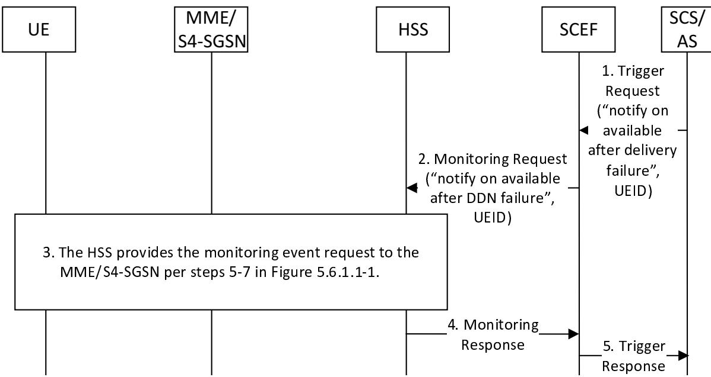  
Figure 5.7.1.2-1: Event Configuration - Availability Notification after DDN Failure

1. The SCS/AS executes step 1 of clause 5.6.1.9.

2. The SCEF sends a Monitoring Request message to the HSS to request notification when the UE becomes available after a DDN failure.

NOTE: The Monitoring Request message includes the parameters specified in clause 5.6.1.2.

3. The HSS provides the monitoring event request to the MME/SGSN according to steps 5-7 in Figure 5.6.1.1-1.

4. The HSS internally notes the request, and sends Monitoring Response message to the SCEF.

5. The SCEF executes step 9 of clause 5.6.1.9.

## 5.7.1.3 Notification

The figure 5.7.1.3-1 below provides the notification procedure. This figure is relative to EUTRAN, but the equivalent figure for UTRAN can be directly derived from this.

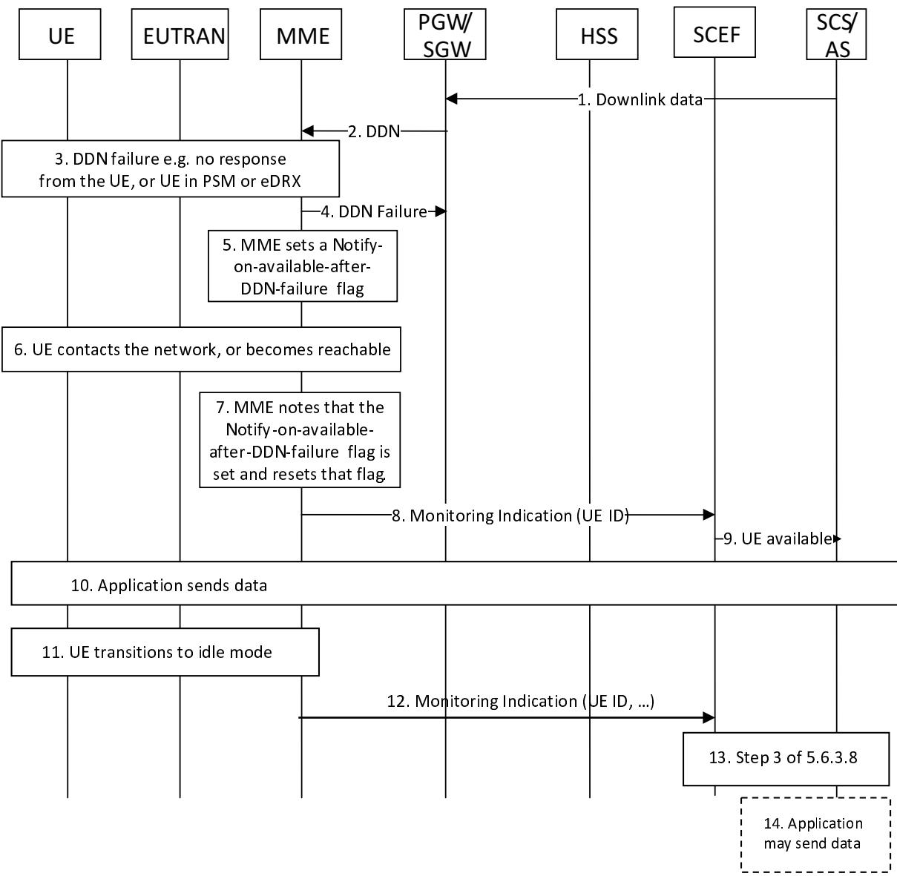  
Figure 5.7.1.3-1: Notification - Availability Notification after DDN Failure

1. The application sends downlink data.

2. The PGW forwards the data to the SGW. The SGW sends a Downlink Data Notification (DDN) message to the MME requesting that UE be paged.

3. The UE is in Power Saving Mode or Extended idle mode DRX, or the MME initiates paging for the UE but receives no response.

4. The MME sends a DDN failure indication to the SGW.

5. The MME notes the subscription option for notification of availability after DDN failure for the UE, and sets a Notify-on-available-after-DDN-failure flag. Not every DDN failure triggers this event. This event may be triggered only when the UE is in PSM or Extended idle mode DRX.

6. At some later time, the UE contacts the network (e.g. to perform a TAU, or a service request), or the UE becomes or is about to become reachable for paging (e.g. an eDRX Paging Transmission Window is reached).

7. The MME notes that UE is available and that the Notify-on-available-after-DDN-failure flag for the UE is set.

8. The MME sends a Monitoring Indication to the SCEF that the UE is available, according to clause 5.6.3.1. The MME also resets the Notify-on-available-after-DDN-failure flag for the UE.

9. The SCEF notifies the application that the UE is available.

10. The application may decide to resend data it has for the UE.

11. UE transitions to idle mode according to TS 23.401 [7], e.g. CM-IDLE with PSM or eDRX.

12. If Idle Status Indication was requested during Monitoring Event configuration, and the MME/SGSN supports Idle Status Indication, then MME executes step 2a of clause 5.6.3.8, and includes the time at which the UE transitioned into idle mode, its granted active time (if PSM is enabled), the periodic TAU/RAU timer granted to the UE by the MME, the eDRX cycle length (if extended idle mode DRX is enabled), and the Suggested number of downlink packets if a value was provided to the S-GW in the message.

13. The SCEF executes step 3 of clause 5.6.3.8, and includes additional parameters specified in step 12 above.

14. The application may send queued data toward the UE.

## 5.7.2 Notification using Monitoring Event "UE Reachability"

If an SCS/AS wants to send downlink packet(s), the SCS/AS can request a One-time "UE Reachability" monitoring event by sending Monitoring Request message indicating Reachability Type as "Reachability for Data". The SCS/AS may send the packet data when it receives a notification that the UE has changed to connected mode or the SCS/AS may send a device trigger when it receives a notification that the UE will become reachable for paging. If the SCS/AS optionally wants to fine-tune the delivery of the downlink data within the time-window when the UE is reachable, the SCS/AS can configure optional parameter 'Maximum Response Time' with proper value, and/or request Idle Status Indication (as detailed in clause 5.6.1.4).

## 5.8 Procedure for Informing about Potential Network Issues

## 5.8.1 General

This clause contains the detailed description and the procedures for the service capability exposure feature Informing about Potential Network Issues.

An SCS/AS may request for being notified about the network status. The following methods are supported:

\- The SCS/AS requests to be informed, one-time, about the network status by providing a geographical area. This procedure is referred to as one-time network status request;

The SCS/AS requests to be informed, continuously, about the network status by providing a geographical area.   
This procedure is referred to as continuous network status request.

The procedures described in this clause use the RAN Congestion Awareness Function (RCAF) and corresponding features as defined in TS 23.401 [7] and TS 23.060 [6]. The SCEF communicates with the RCAF via the Ns reference point.

After receiving the request for network status notification from the SCS/AS, the SCEF derives the RCAF(s) responsible for the indicated geographical area, and requests congestion reporting from these RCAF(s).

NOTE 1: The SCEF needs to know the RCAF(s) available in the operator network or the network of the RAN operator in the case of RAN sharing. For every RCAF, the SCEF needs to be configured with the RCAF address and the geographical area the RCAF is responsible for. The Ns reference point does not support roaming.

The RCAF reports to the SCEF the following information from the RUCI (see TS 23.203 [27]) for every cell or eNodeB belonging to the indicated geographical area:

Congestion level or an indication of the "no congestion" state;

ECGI, or eNodeB-ID, or SAI for which the congestion level is being provided.

Based on the congestion information the SCEF receives from the identified RCAF(s), the SCEF derives and reports the network status for the geographical area as Network Status Indication (NSI) to the SCS/AS. When reporting to the SCS/AS, the NSI shall not include any 3GPP location information.

NOTE 2: Either exact values for congestion status, as reported by RCAF(s) to SCEF or abstracted values e.g. (High, Medium, Low) can be reported by the SCEF to the SCS/AS. The calculation and the reporting of the NSI to the SCS/AS depends on operator configuration (SLAs, network topology, usage etc.).

When an SCS/AS requests One-time Network Status from the SCEF, the SCEF can optionally provide a time interval at which the SCS/AS is allowed to re-issue the same request for network status.

NOTE 4: The time interval provided by SCEF can be ignored by the SCS/AS if the subsequent request on network status is considerably different wrt. the geographical area.

The request procedure for one-time or continuous reporting of network status is described in clause 5.8.2 and the report procedure for continuous reporting of network status in clause 5.8.3. Clause 5.8.4 contains the removal procedure for the continuous reporting of network status.

## 5.8.2 Request procedure for one-time or continuous reporting of network status

This procedure is used by an SCS/AS to retrieve Network Status Information (NSI) from the network. This procedure can be used to request a one-time or continuous reporting of network status. Figure 5.8.2-1 illustrates the procedure.

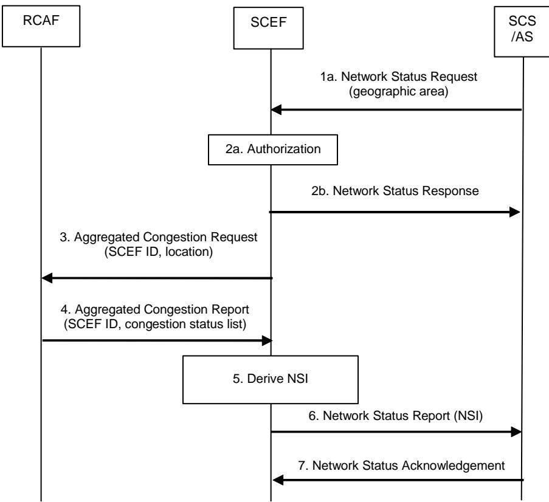  
Figure 5.8.2-1: Request procedure for one-time or continuous reporting of network status

1. When the SCS/AS needs to retrieve NSI, the SCS/AS sends a Network Status Request (Geographical area, SCS/AS Identifier, Duration, Threshold) message to the SCEF. Duration indicates the time for which a continuous reporting is requested. The absence of Duration indicates a one-time reporting. Threshold indicates a range at which the SCS/AS wishes to be informed of the network status. Multiple Threshold values may be included. The SCEF assigns a TLTRI that identifies the Network Status Request.

NOTE 1: Geographical area specified by SCS/AS could be at cell level (CGI/ECGI), TA/RA level or other formats e.g. shapes (e.g. polygons, circles etc.) or civic addresses (e.g. streets, districts etc.) as referenced by OMA Presence API [32].

2a. The SCEF authorizes the SCS/AS request for notifications about potential network issues. The SCEF stores SCS/AS Address, TLTRI, Duration, if present, and Threshold, if present. The SCEF assigns an SCEF Reference ID.

2b. The SCEF sends a Network Status Response (TLTRI, cause). The cause value indicates that the network has accepted the request in step 1. Based on operator policies, if either the SCS/AS is not authorized to perform this request (e.g. if the SLA does not allow for it) or the SCS/AS has exceeded its quota or rate of submitting requests, the cause value indicates the error and the flow stops at this step.

3. The SCEF assigns an SCEF Reference ID and identifies, based on local configuration (as described in clause 5.8.1), the RCAF(s) responsible for the provided Geographical Area. For every identified RCAF, the SCEF derives a Location Area from the Geographical Area provided by the SCS/AS. The Location Area is according to operator configuration either a 3GPP location area (e.g. list of TA/RAs, list of cell(s), list of eNodeBs, etc.) or a sub-area of the Geographical Area provided by the SCS/AS. The SCEF sends an Aggregated Congestion Request (SCEF Reference ID, Location Area, Duration, Threshold) message to the identified RCAF(s). Duration indicates the time for which a continuous reporting is requested. The absence of Duration indicates a one-time reporting. The SCEF, based on operator policies, may chose a different Threshold value than the one indicated by the SCS/AS in step 1.

4. The RCAF examines the Aggregated Congestion Request message. If the SCEF provided a Duration, the RCAF stores the SCEF instructions and starts to monitor the set of cells or eNodeBs belonging to the Location Area for a change in the congestion status that is crossing a Threshold (if provided by the SCEF). The RCAF sends an Aggregated Congestion Report to the SCEF including the SCEF Reference ID and, depending on the operator configuration and current RCAF knowledge, the congestion status for every cell or eNodeB belonging to the Location Area requested by the SCEF.

5. The SCEF verifies whether the Network Status Request identified via the SCEF Reference ID is valid and active and stores the report. After receiving reports from all the involved RCAF(s) to which step 3 was executed, the SCEF derives the NSI for the requested Geographical Area by combining all reports with the same SCEF Reference ID in an operator configurable way (governed by SLAs, network topology, usage, etc.).

NOTE 2: Either exact values for congestion status, as reported by RCAF(s) to SCEF or abstracted values e.g. (High, Medium, Low) can be reported by the SCEF to the SCS/AS. The calculation and the reporting of the NSI to the SCS/AS depends on operator configuration (SLAs, network topology, usage, etc.).

6. The SCEF sends a Network Status Report (TLTRI, NSI) message to the SCS/AS.

7. The SCS/AS sends a Network Status Acknowledgement to the SCEF.

## 5.8.3 Report procedure for continuous reporting of network status

This procedure is used by the SCEF to report a change of Network Status Information (NSI) to the SCS/AS which requested a continuous reporting of network status. Figure 5.8.3-1 illustrates the procedure.

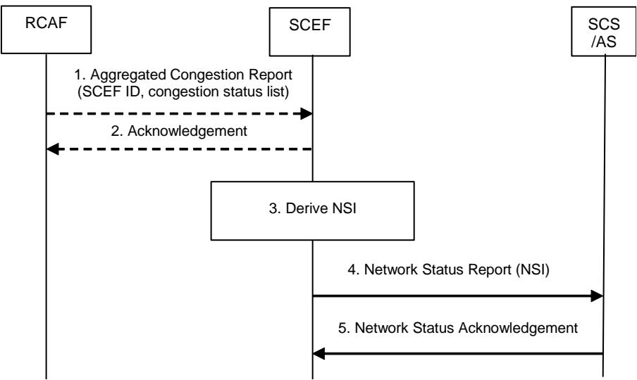  
Figure 5.8.3-1: Report procedure for continuous reporting of network status

1. The RCAF detects a change in the congestion status that is crossing a Threshold (if provided by the SCEF) for the set of cells or eNodeBs belonging to the Location Area requested by the SCEF. An Aggregated Congestion Report message is sent to this SCEF including the SCEF Reference ID and, depending on the operator

configuration, the congestion status for every cell or eNodeB belonging to the Location Area requested by the SCEF.

2. The SCEF acknowledges the report to the RCAF.

NOTE 1: Step 1 and 2 can happen multiple times and the Aggregated Congestion Report message can be sent by any of the involved RCAFs.

3. Whenever a new Aggregated Congestion Report message arrives, the SCEF stores the report and derives a new NSI for the requested geographical area by combining this report with all other reports having the same SCEF Reference ID in an operator configurable way (governed by SLAs, network topology, usage etc.).

NOTE 2: Either exact values for congestion status, as reported by RCAF(s) to SCEF or abstracted values e.g. (High, Medium, Low) can be reported by the SCEF to the SCS/AS. The calculation and the reporting of the NSI to the SCS/AS depends on operator configuration (SLAs, network topology, usage etc.).

4. Triggered by a NSI change (derived in step 3) that is crossing a Threshold (if provided by the SCS/AS), the SCEF sends a Network Status Report (TLTRI, NSI) message to the SCS/AS.

5. The SCS/AS sends a Network Status Acknowledgement to the SCEF.

## 5.8.4 Removal procedure for continuous reporting of network status

This procedure is used for termination of the continuous reporting of network status. It can be triggered by the SCS/AS at any time before the Duration is over or if no Duration was provided. The SCEF will trigger this procedure when the Duration is over. Figure 5.8.4-1 illustrates the procedure.

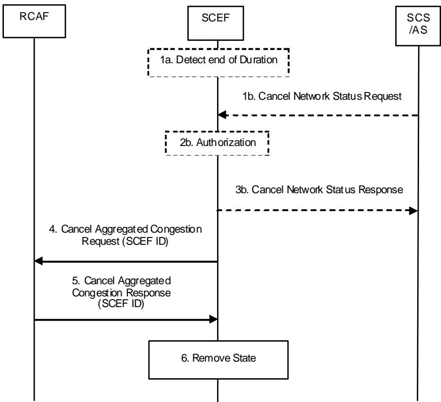  
Figure 5.8.4-1: Removal procedure for continuous reporting of network status

1a. The SCEF detects that the requested Duration for an ongoing continuous reporting of network status to an SCS/AS is over and identifies the corresponding SCEF Reference ID.

1b. When the SCS/AS needs to terminate an ongoing continuous reporting of network status, the SCS/AS sends a Cancel Network Status Request (SCS/AS Identifier, TLTRI) message to the SCEF.

2b. If the SCS/AS requested to terminate an ongoing continuous reporting of network status in step 1b, the SCEF authorizes the SCS/AS request and identifies the corresponding SCEF Reference ID.

3b. If the SCS/AS requested to terminate an ongoing continuous reporting of network status in step 1b, the SCEF sends a Cancel Network Status Response (Cause) message to the SCS/AS.

4. The SCEF identifies the RCAF(s) involved in the continuous reporting represented by the SCEF Reference ID. The SCEF sends a Cancel Aggregated Congestion Request (SCEF Reference ID) message to the identified RCAF(s).

5. The RCAF removes the related SCEF instructions and stops monitoring the set of cells or eNodeBs belonging to the Location Area for a change in the congestion status. Afterwards, a Cancel Aggregated Congestion Response is sent to the SCEF including the SCEF Reference ID.

6. The SCEF removes all state information related to this continuous reporting represented by the SCEF Reference ID.

## 5.9 Procedure for resource management of background data transfer

This clause describes the procedure for resource management of background data transfer to a set of UEs, i.e. an SCS/AS requesting a time window and related conditions from the SCEF via the Nt interface.

The UEs targeted for background data transfer may be served by a single PCRF or may be spread across multiple PCRFs serving the same or different geographic areas. The operator shall ensure that any of the PCRFs in the network is able to make the decision about transfer policy for background data transfer for non-roaming UEs.

The transfer policy will be stored in the SPR together with a Reference ID. This ensures that the transfer policy is available to every PCRF responsible for a UE which is subject to this background data transfer in the future. In addition, other (or the same) PCRF can take this transfer policy into account during subsequent decisions about transfer policies for background data related to other SCS/AS.

At a later point in time, when the SCS/AS (acting as an AF), contacts the PCRF for individual UEs, e.g. to request sponsored connectivity for background data transfer, the SCS/AS needs to also provide the Reference ID together with the SCS/AS session information via the Rx interface. Alternatively, the SCS/AS activates the selected transfer policy via the SCEF, for each UE in the group, by using the "Set the chargeable party at session set-up" or "Change the chargeable party during the session" procedure from clauses 5.12.1 and 5.12.2 to provide the Reference ID to the same or different PCRF. The Reference ID enables the PCRF to correlate the SCS/AS request (that is related to the UE) with the transfer policy retrieved from the SPR (that is related to the SCS/AS). The PCRF finally triggers PCC procedures according to TS 23.203 [27] to provide the respective policing and charging information to the PCEF.

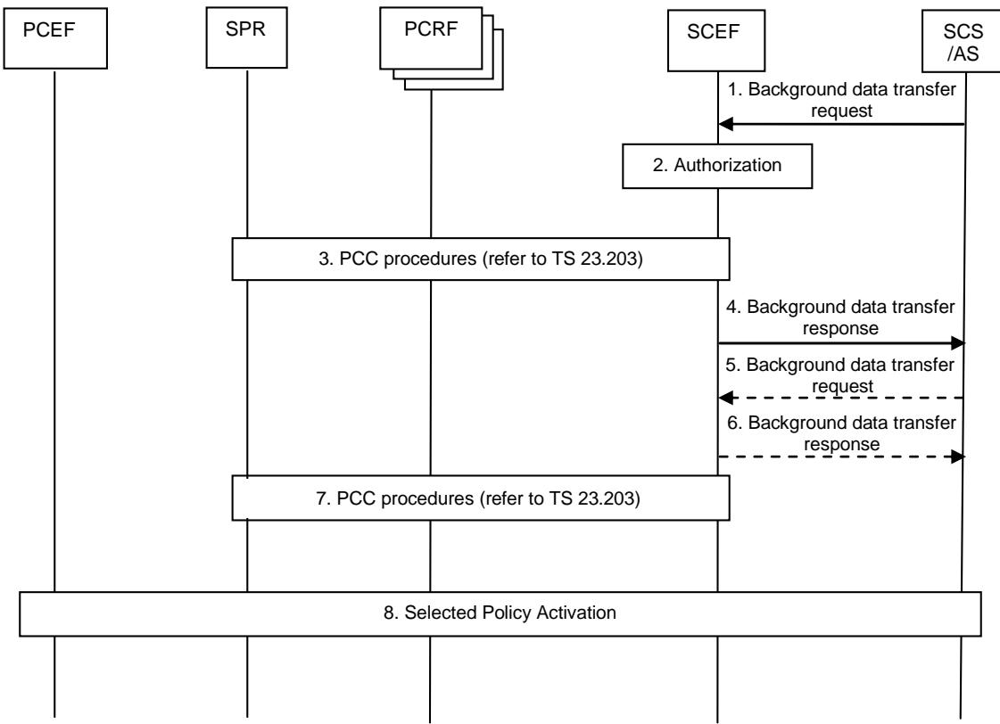  
Figure 5.9-1: Resource management for background data transfer

1. A 3rd party SCS/AS sends a Background data transfer request (SCS/AS Identifier, Volume per UE, Number of UEs, Desired time window) message to the SCEF. The Volume per UE describes the volume of data the SCS/AS expects to be transferred per UE. Number of UEs describes the expected amount of UEs participating in the data transfer. Desired time window describes the time interval during which the SCS/AS wants to realize the data transfer. Optionally, the SCS/AS can provide a geographic area information.

NOTE 1: The SCS/AS does not provide any information about the identity of the UEs in this request.

2. The SCEF authorizes the SCS/AS request.

NOTE 2: The SCEF notifies the SCS/AS at this point if the authorization fails.

3. The SCEF selects any of the available PCRFs and triggers the Negotiation for future background data transfer procedure with the PCRF. The SCEF forwards the parameters provided by the SCS/AS. The PCRF responds to the SCEF with the possible transfer policies and a Reference ID. Refer to clause 7.11.1 of TS 23.203 [27].

4. The SCEF forwards the Reference ID and the transfer policies to the 3rd party SCS/AS by sending a Background data transfer response (Reference ID, Possible transfer policies) message. The SCS/AS stores the Reference ID for the future interaction with the PCRF.

5. If more than one transfer policy was received, the 3rd party SCS/AS shall select one of them and send another Background data transfer request (SCS/AS Identifier, Selected transfer policy) message to inform the SCEF and PCRF about the selected transfer policy.

NOTE 3: If there is only one transfer policy offered, the SCS/AS is not required to confirm.

6. The SCEF confirms the transfer policy selection to the 3rd party SCS/AS by sending a Background data transfer response (Cause) message.

7. The SCEF continues the Negotiation for future background data transfer procedure with the PCRF. The PCRF stores the Reference ID and the new transfer policy in the SPR. Refer to clause 7.11.1 of TS 23.203 [27].

8. The SCS/AS (acting as an AF) contacts the same or a different PCRF for each individual UE (via the Rx interface), the SCS/AS shall provide the Reference ID. Alternatively, the SCS/AS activates the selected transfer policy via the SCEF, for each UE in the group, by using the "Set the chargeable party at session set-up" or "Change the chargeable party during the session" procedure from clauses 5.12.1 and 5.12.2 to provide the

Reference ID to the same or different PCRF. The PCRF correlates the SCS/AS or SCEF request with the transfer policy retrieved from the SPR via the Reference ID. The PCRF finally triggers PCC procedures according to TS 23.203 [27] to provide the respective policing and charging information to the PCEF for the background data transfer of this UE.

NOTE 4: The SCS/AS will typically request sponsored connectivity for the background data transfer to individual UEs.

NOTE 5: The SCS/AS can contact the PCRF directly or interact with the PCRF via the SCEF.

## 5.10 Communication Pattern parameters provisioning procedure

## 5.10.1 Communication Pattern parameters

A set of Communication Pattern (CP) parameters is defined in the table below. All CP parameters are optional.

These CP parameters are specific for a UE or a group of UEs. Sets of these CP parameters are provided by the SCEF to the HSS which distributes them to the corresponding MME with relevant subscriber data. These CP parameter sets may be related to both PDN connection(s) and SMS transmission. The MME considers the sets of CP parameters (e.g. by merging per CP parameter if multiple sets are present), before using the parameters. Each CP parameter set shall have an associated validity time. The validity time indicates when the CP parameter set expires and shall be deleted by the HSS/MME. The validity time may be set to a value indicating that the particular CP parameter set has no expiration time. When the validity time expires, the involved nodes (SCEF, HSS, and MME) autonomously delete the associated CP parameter set with no additional signalling between the involved nodes.

NOTE 1: It is expected that the format of validity time, to be defined by Stage 3, is defined in a manner which allows SCEF, HSS and MME/SGSN to consistently and uniformly interpret the expiration of the associated CP parameters set.

Table 5.10.1-1: CP parameters  
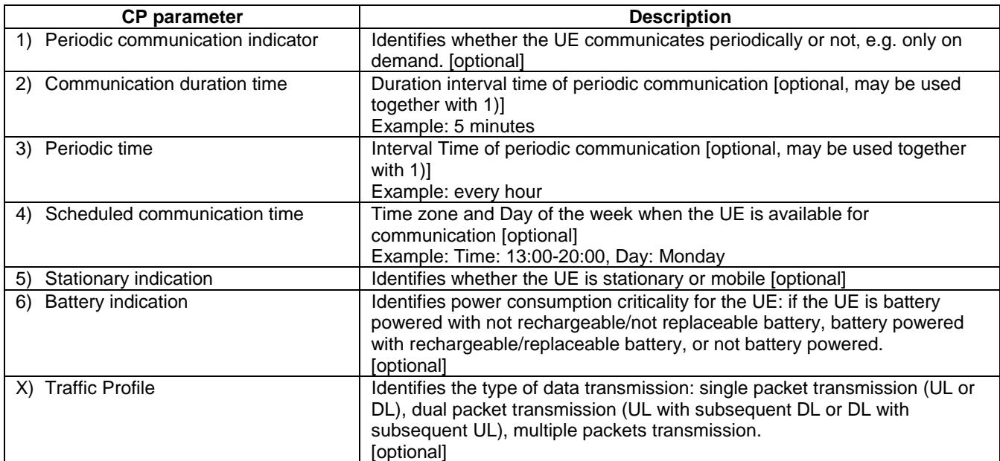  
NOTE 2: The Traffic Profile is provided to the eNB for optimisation of RAN resources and how it is used is specified in TS 23.401 [7].

## 5.10.2 Communication Pattern parameters provisioning to the MME

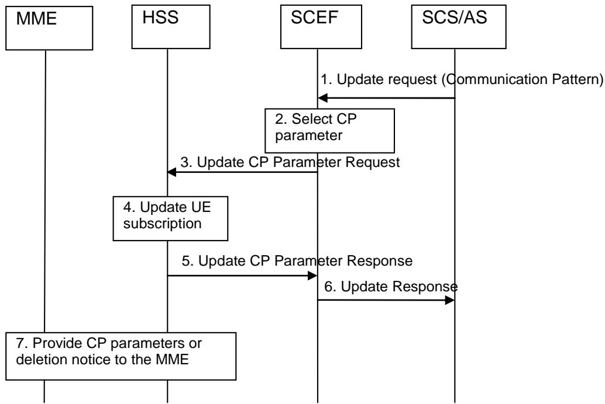  
Figure 5.10.2-1: Signalling sequence for provisioning of CP Parameters

1. The SCS/AS sends an Update Request (External Identifier or MSISDN or External Group Identifier, SCS/AS Identifier, CP parameter Set Id(s), CP parameter set(s), validity time(s), CP parameter Set Id(s) for Deletion, MTC Provider Information) message to the SCEF. The CP parameter set(s) include the parameters defined in Table 5.10.1-1. A CP parameter Set Id is assigned to each CP parameter set by the SCS/AS.

NOTE 1: The SCS/AS uses this procedure to add, change or delete some or all of the CP parameter sets of the UE, e.g. if the AS is aware that the UE has started or stopped moving for a significant time period, especially if the AS is instructing the UE to do so, then the SCS/AS provides the corresponding CP parameter set(s) and its validity time(s) as well their CP parameter Set Id(s) to the SCEF. If the SCS/AS wants to perform deletion of a previously configured CP parameter set(s) together with configuring a new CP parameter set(s), then it shall include both the new CP parameter set(s), and CP parameter Set Id(s) for Deletion representing the CP parameter set(s) which requires cancellation. If the SCS/AS wants to only perform deletion of a previously configured CP parameter set(s), then it shall include CP parameter Set Id(s) for Deletion.

2. The SCEF checks if the SCS/AS is authorised to send CP requests to the UE or to each UE in the identified group. The SCEF filters and the selects the CP parameter set(s) for add/modify/delete based on operator policy or configuration. The SCEF does not check for potential overlapping of CP parameters if there are multiple CP parameter set(s) for the UE, but this is handled in the MME.

In this release, to avoid receiving CP parameter sets from multiple SCEFs that might be overlapping, the HSS shall accept CP parameter sets from only a single SCEF for a given UE.

3. The SCEF sends Update CP Parameter Request (External Identifier or MSISDN or External Group Identifier, SCEF Reference ID(s), SCEF Address, CP parameter set(s), validity time(s), SCEF Reference ID(s) for Deletion, MTC Provider Information) message to the HSS for delivering the selected CP parameter set(s) per UE. There may be multiple CP parameter sets included in this message where each CP parameter set for addition or modification has been determined to be non-overlapping with other CP parameter sets either included in the message or already provisioned for a given UE. The SCEF derives the SCEF Reference ID(s) for CP parameter sets to be sent to the HSS based on the CP parameter Set Id(s) from the SCS/AS.

NOTE 2: A request for deletion of a CP parameter set from the SCS/AS may result in a request for modification of the non-overlapping CP parameter set by the SCEF.

NOTE 3: The MTC Provider Information in step 1 is an optional parameter. The SCEF should validate the provided MTC Provider Information and may override it to an SCEF selected MTC Provider Information based on configuration. How the SCEF determines the MTC Provider Information, if not present in step 1, is left to implementation (e.g. based on the requesting SCS/AS)

4. The HSS examines the Update CP Parameter Request message, e.g. with regard to the existence of External Identifier or MSISSN or External Group Identifier. If the check fails, the HSS immediately sends a response message back to the SCEF following step 5. The HSS resolves the External Identifier or MSISDN to an IMSI or resolves the External Group Identifier to an IMSI-Group Identifier and stores the CP parameter set(s) and their validity time(s) as part of UE subscription data identified by the IMSI or IMSI-Group Identifier, so that the CP parameter set(s) can be forwarded to the serving MME(s) when the serving MME(s) are changed due to the mobility of the UE.

The HSS determines that a stored CP parameters set is to be modified by the fact that the SCEF Reference ID associated with the CP parameters set matches an SCEF Reference ID for a CP parameters set already stored for a given UE. If the HSS determines that an existing CP parameter set is to be modified, the HSS discards the already stored CP parameter set and stores the new CP parameter set and validity time under the same SCEF Reference ID.

The HSS stores a new CP parameter set along with the associated SCEF Reference ID and validity time.

If CP parameters sets are to be deleted, the HSS removes the CP parameters sets from the subscription.

If the validity time for a CP parameter set stored in the HSS expires, the HSS autonomously deletes the associated CP parameter set with no additional signalling.

NOTE 3: The CP parameter set(s) are not provided to the SGSN.

NOTE 4: The HSS does not need to validate the content of the stored CP parameters set(s).

5. The HSS sends Update CP Parameter Response (SCEF Reference ID, Cause) message to the SCEF. The cause value indicates successful subscription update or the reason of failed subscription update.

6. The SCEF sends the Update Response (CP parameter Set Id(s), Cause(s)) message to inform the SCS/AS whether the provision of the CP parameter set(s) was successful.

7. The HSS initiates an Insert Subscription Data procedure for each UE to send the CP parameter set(s) with the corresponding validity time(s), SCEF Reference ID(s), and SCEF Reference ID(s) for Deletion to the MME. Optionally, the HSS allocates a Provider-Group-ID (different from the IMSI-Group-Id) based on the MTC Provider Information and sends it to the MME to assist the serving node(s) when selecting and differentiating configurations for a given MTC Service Provider (e.g. to delete the CP Set Id(s) for a specific MTC Service Provider at the MME).

The MME determines that a stored CP parameters set is to be modified by the fact that the SCEF Reference ID associated with the CP parameters set matches an SCEF Reference ID for a CP parameters set already stored for the UE. If the MME determines that an existing CP parameter set is to be modified, the MME discards the already stored CP parameter set and stores the received CP parameter set with the associated validity time in the UE's (E)MM context under the same SCEF Reference ID.

The MME stores a new CP parameter set along with the associated SCEF Reference ID and validity time. The MME may use the CP parameter set(s) as described in TS 23.401 [7].

If CP parameter sets are to be deleted, the MME removes the CP parameter sets from the subscription.

If the validity time for a CP parameter set stored in the MME expires, the MME autonomously deletes the associated CP parameter set with no additional signalling.

## 5.11 Setting up an AS session with required QoS procedure

This clause describes the signalling flow for setting up a 3rd party AS session with a specific QoS.

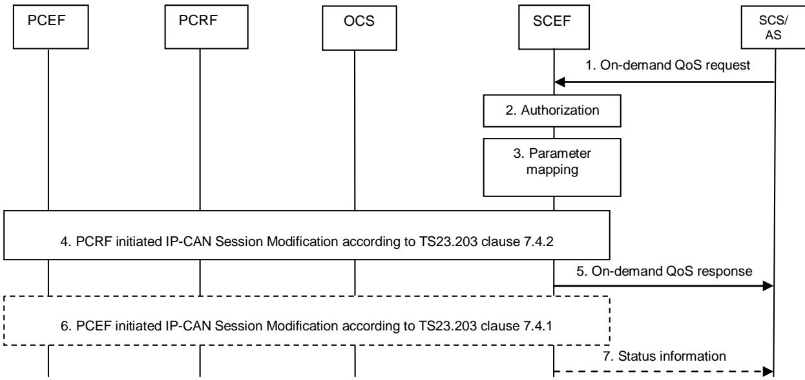  
Figure 5.11-1: Setting up an AS session with required QoS

1. When setting up the connection between SCS/AS and the UE with required QoS for the service, the SCS/AS sends an On-demand QoS request message (UE IP address, SCS/AS Identifier, Description of the application flows or External Application Identifier, QoS reference) to the SCEF. Optionally, a period of time or a traffic volume for the requested QoS can be included in the SCS/AS request. The SCEF assigns a TLTRI to the Ondemand QoS request.

2. The SCEF authorizes the SCS/AS request and may apply policies to control the overall amount of pre-defined QoS authorized for the SCS/AS. If the authorisation is not granted, steps 3 and 4 are skipped and the SCEF replies to the SCS/AS with a Result value indicating that the authorisation failed.

3. The SCEF maps the UE IP address, the SCS/AS Identifier, the Description of the application flows and the QoS reference to existing Rx parameters (including the optionally received period of time or traffic volume which is mapped to sponsored data connectivity information). The SCEF acts as an AF defined in TS 23.203 [27].

NOTE: Before the QoS reference is mapped to Rx parameters, the SCEF can perform a mapping from the name space of the 3rd party SCS/AS to the name space of the operator.

4. The SCEF interacts with the PCRF via the Rx interface and triggers a PCRF initiated IP-CAN Session Modification as described in clause 7.4.2 of TS 23.203 [27]. The SCEF shall request to be notified about the transmission resource status.

The PCRF derives the required QoS based on the information provided by the SCEF and determines whether this QoS is allowed (according to the PCRF configuration for this 3rd party SCS/AS), and notifies the result to the SCEF.

The PCRF notifies the SCEF whether the transmission resources corresponding to the QoS request are established or not.

5. The SCEF sends an On-demand QoS response message (TLTRI, Result) to the SCS/AS. Result indicates whether the QoS request is granted or not.

6. The PCRF may notify the SCEF about bearer level events for the Rx session (e.g. transmission resources are released/lost) with a PCEF initiated IP-CAN Session Modification as described in clause 7.4.1 of TS 23.203 [27].

7. If the SCEF gets informed by the PCRF about bearer level events for the Rx session (e.g. transmission resources are released/lost) the SCEF sends a Status information message (SCS/AS Identifier, TLTRI, Status) to the SCS/AS. The status indicates the bearer level event received from the PCRF.

## 5.12 Change the chargeable party at session set-up or during the session procedure

## 5.12.1 Set the chargeable party at session set-up

This clause describes the signalling flow for setting the chargeable party at AS session set-up. The SCS/AS may either request to sponsor the traffic from the beginning or may request to become the chargeable party at a later point in time.

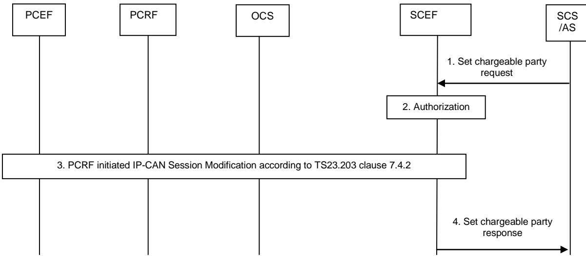  
Figure 5.12.1-1: Set the chargeable party at AS session set-up

1. When setting up the connection between the AS and UE, the SCS/AS may request to become the chargeable party for the session to be set up by sending a Set chargeable party request message (SCS/AS Identifier, Description of the application flows or External Application Identifier, sponsor information, Sponsoring Status, Reference ID) to the SCEF, including optionally a usage threshold. The Sponsoring Status indicates whether sponsoring is started or stopped, i.e. whether the 3rd party service provider is the chargeable party or not. The Reference ID parameter identifies a previously negotiated transfer policy for background data transfer as defined in clause 4.5.9. The SCEF assigns a TLTRI to the Set chargeable party request.

2. The SCEF authorizes the SCS/AS request to sponsor the application traffic and stores the sponsor information together with the SCS/AS Identifier and the TLTRI. If the authorisation is not granted, step 3 is skipped and the SCEF replies to the SCS/AS with a Result value indicating that the authorisation failed.

NOTE 1: Based on operator configuration, the SCEF may skip this step. In this case the authorization is performed by the PCRF in step 3.

3. The SCEF interacts with the PCRF by triggering a PCRF initiated IP-CAN Session Modification as described in clause 7.4.2 of TS 23.203 [27] and provides IP filter information, sponsored data connectivity information (as defined in TS 23.203 [27]), Reference ID (if received from the SCS/AS) and Sponsoring Status (if received from the SCS/AS) to the PCRF.

## NOTE 2: The SCEF maps the Sponsoring Status to existing Rx parameters.

The PCRF determines whether the request is allowed and notifies the SCEF if the request is not authorized. If the request is not authorized, SCEF responds to the SCS/AS in step 4 with a Result value indicating that the authorization failed.

As specified in TS 23.203 [27], the PCRF determines the PCC rule(s) for the specified session including charging control information. Charging control information shall be set according to the Sponsoring Status (if received over Rx), i.e. either indicating that the 3rd party service provider is the chargeable party or not. The PCC rule(s) for the specified session shall then be provided to the PCEF. In the case of online charging and depending on operator configuration, the PCEF may request credit when the first packet corresponding to the service is detected or at the time the PCC Rule was activated.

The PCRF notifies the SCEF that the request is accepted.

4. The SCEF sends a Set chargeable party response message (TLTRI, Result) to the SCS/AS. Result indicates whether the request is granted or not.

## 5.12.2 Change the chargeable party during the session

This clause describes the signalling flow for changing the chargeable party during an ongoing AS session, i.e. the SCS/AS starting or stopping to sponsor the application traffic.

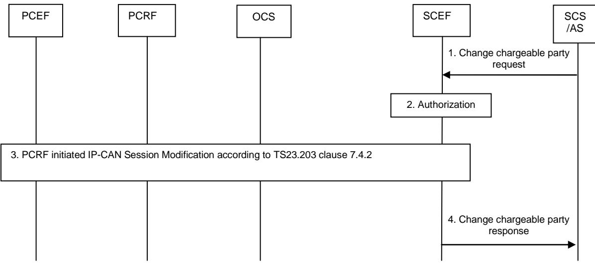  
Figure 5.12.2-1: Change chargeable party during an AS session

1. For the ongoing AS session, the SCS/AS may send a Change chargeable party request message (SCS/AS Identifier, TLTRI, Sponsoring Status, Reference ID) to the SCEF, including optionally a usage threshold. The Sponsoring Status indicates whether sponsoring is enabled or disabled, i.e. whether the 3rd party service provider is the chargeable party or not. The Reference ID parameter identifies a previously negotiated transfer policy for background data transfer as defined in clause 4.5.9. The TLTRI provided in the Change chargeable party request message is set to the TLTRI that was assigned, by the SCEF, to the Set chargeable party request.

2. The SCEF authorizes the SCS/AS request of changing the chargeable party. If the authorisation is not granted, step 3 is skipped and the SCEF replies to the SCS/AS with a Result value indicating that the authorisation failed.

NOTE 1: Based on operator configuration, the SCEF may skip this step. In this case the authorization is performed by the PCRF in step 3.

3. Based on the SCS/AS Identifier and the TLTRI the SCEF determines the relevant Rx session and interact with the PCRF by triggering a PCRF initiated IP-CAN Session Modification as described in clause 7.4.2 of TS 23.203 [27]. The SCEF provides sponsored data connectivity information (as defined in TS 23.203 [27]), Reference ID (if received from the SCS/AS), and the Sponsoring Status to the PCRF.

NOTE 2: The SCEF maps the Sponsoring Status to existing Rx parameters.

The PCRF determines whether the request is allowed and notifies the SCEF if the request is not authorized. If the request is not authorized, SCEF responds to the SCS/AS in step 4 with a Result value indicating that the authorization failed.

The PCRF identifies the affected PCC rule(s) and reacts based on their current status. If the traffic is subject to subscriber charging in the PCEF and the PCRF receives a Sponsoring Status indicating that sponsoring is started, the PCC rule(s) for the specified session shall be modified so that the charging control information indicates that the 3rd party service provider is charged for the traffic. If the traffic is subject to 3rd party charging in the PCEF and the PCRF receives a Sponsoring Status indicating that sponsoring is stopped, the PCC rule(s) for the specified session shall be modified so that the charging control information indicates that the 3rd party service provider is no longer charged for the traffic. As specified in TS 23.203 [27], PCRF modifies the PCC rule(s) of the service data flow accordingly and provides them to the PCEF. In the case of online charging and depending on operator configuration, the PCEF may request credit when the first packet corresponding to the service is detected or at the time the PCC Rule was activated.

The PCRF notifies the SCEF that the request is accepted.

4. The SCEF sends a Change chargeable party response message (Result) to the SCS/AS. Result indicates whether the request is granted or not.

## 5.13 Non-IP Data Delivery procedures

## 5.13.1 T6a/T6b Connection Establishment

## 5.13.1.1 General

When the UE performs the EPS attach procedure (see TS 23.401 [7]) with PDN type of "Non-IP", and the subscription information corresponding to either the default APN for PDN type of "Non-IP" or the UE requested APN includes the "Invoke SCEF Selection" indicator, then the MME initiates a T6a/T6b connection towards the SCEF corresponding to the "SCEF ID" indicator for that APN.

## 5.13.1.2 T6a/T6b Connection Establishment Procedure

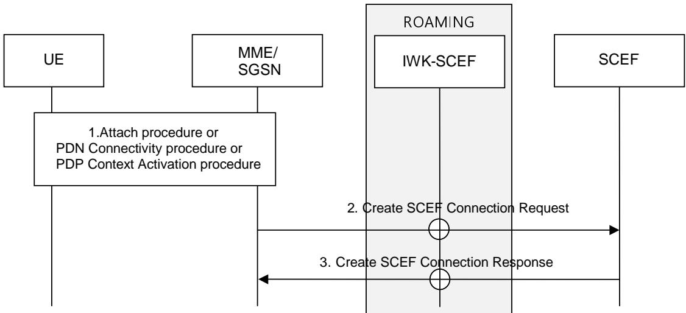  
Figure 5.13.1.2-1: T6a/T6b Connection Establishment Procedure

1. UE performs steps 1-11 of the E-UTRAN Initial Attach procedure or step 1 of the UE requested PDN Connectivity procedure (see TS 23.401 [7]) or PDP Context Activation Procedure (see TS 23.060 [6]). The MME/SGSN receives subscription information for a non-IP PDN connection to an APN that is associated with an "Invoke SCEF Selection" indicator, and SCEF ID. If the MSISDN is also associated with the user's subscription, then it is made available as User Identity to the MME/SGSN by the HSS.

2. If the subscription information corresponding to either the default APN for PDN type of "Non-IP" or the UE requested APN includes "Invoke SCEF Selection" indicator, then instead of step 12-16 of the E-UTRAN Initial Attach procedure (see clause 5.3.2.1 of TS 23.401 [7])) or instead of step 2-6 of the UE requested PDN connectivity procedure (see clause 5.10.2 of TS 23.401 [7]) or instead of step 4-8 of the PDP Context Activation procedure (see clause 9.2.2.1 of TS 23.060 [6]), the MME/SGSN shall create a PDN connection towards the SCEF and allocate an EPS Bearer Identity (EBI) (see TS 23.401 [7]) to that PDN connection. The MME/SGSN does so by sending a Create SCEF Connection Request (User Identity, EPS Bearer Identity, SCEF ID, APN, Serving PLMN Rate Control, PCO, Serving PLMN ID, IMEISV) message towards the SCEF (see clause 4.7.7 of TS 23.401 [7]). If the IWK-SCEF receives the Create SCEF Connection Request message from the MME/SGSN, it shall forward it toward the SCEF.

NOTE 1: The combination of EPS Bearer Identity, APN, and User Identity allows the SCEF to uniquely identify the PDN connection to the SCEF for a given UE.

NOTE 2: For further details of T6a/T6b interactions please refer to Stage 3 specifications.

NOTE 3: The details of how the MME/SGSN and SCEF encode the PCO's information on T6a/T6b are left to stage 3.

If an SCS/AS has performed the NIDD Configuration procedure (see clause 5.13.2) with the SCEF for User Identity received in step 2, then step 3 is executed. If no SCS/AS has performed the NIDD Configuration procedure (see clause 5.13.2) with the SCEF for the User Identity, then the SCEF may:

reject the T6a/T6b connection setup, or

initiate a NIDD Configuration procedure with SCS/AS configured in the SCEF using implementation specific procedures.

For E-UTRAN, if provided by the MME, the SCEF may take the APN Rate Control Status into account when encoding the APN Rate Control parameters in Protocol Configuration Options and when enforcing the APN Rate Control as described in clause 4.7.7.3 of TS 23.401 [7].

3. The SCEF creates an SCEF EPS Bearer Context (see clause 5.3.2) for the user identified via User Identity and EBI. The SCEF sends a Create SCEF Connection Response (User Identity, EPS Bearer Identity, SCEF ID, APN, PCO, NIDD Charging ID) message towards the MME/SGSN confirming establishment of the PDN connection to the SCEF for the UE. If the IWK-SCEF receives the Create SCEF Connection Response message from the SCEF, it shall forward it toward the MME/SGSN.

NOTE 4: For further details of T6a/T6b interactions please refer to Stage 3 specifications.

## 5.13.2 NIDD Configuration

Figure 5.13.2-1 illustrates the procedure of configuring necessary information at the SCEF and HSS. A NIDD Configuration is associated with a single UE or a group of UEs. The procedure can also be used for replacing and deleting configuration information.

NOTE 1: In order to avoid MO NIDD failure, the NIDD configuration procedure should be performed by the SCS/AS prior to the UE establishing a PDN Connection that is served by the SCEF. MT non-IP data from the SCS/AS can be contained in the NIDD Configuration Request message.

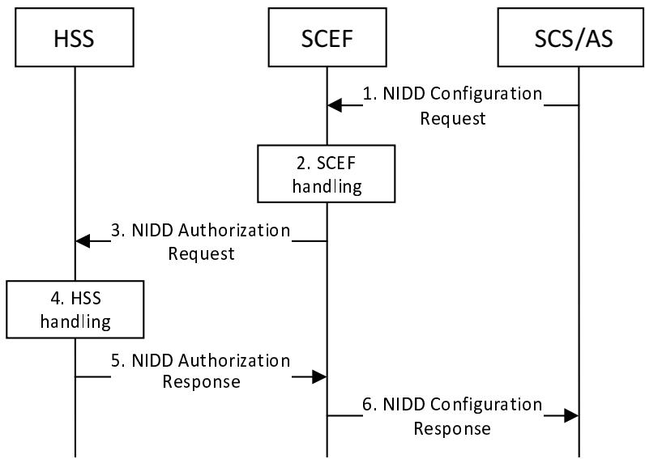  
Figure 5.13.2-1: Configuration for NIDD procedure

1. The SCS/AS sends an NIDD Configuration Request (External Group Identifier or External Identifier or MSISDN, SCS/AS Identifier, NIDD Duration, T8 Destination Address, TLTRI, Requested Action, PDN Connection Establishment Option, Reliable Data Service Configuration, MTC Provider Information) message to the SCEF. PDN Connection Establishment Option an optional field that is used to indicate what the SCEF should do if the UE, or group member UEs, has not established the PDN connection and MT non-IP data needs to be sent (wait for the UE to establish the PDN connection, respond with an error cause, or send a device trigger; see step 2 of the MT NIDD Procedure in clause 5.13.3). When PDN Connection Establishment Option is included in the Configuration of NIDD procedure, the SCEF will use the value as the default preference from the

SCS/AS when handling all MT non-IP packets associated with the NIDD connection. Reliable Data Service Configuration is an optional parameter that is used to configure the Reliable Data Service (as defined in clause 4.5.14.3) including port numbers for originator application(s) and receiver application(s) and the mobile terminated and mobile originated serialization format(s) that are supported by the SCS/AS for each port number. TLTRI is included in the request if the Requested Action is set to "Update" or "Cancel", otherwise TLTRI is not included in the request and the SCEF assigns a TLTRI to the NIDD Configuration.

NOTE 2: If the SCS/AS does not indicate serialization formats, it is assumed that the UE application is provisioned to know what serialization format will be used for MT traffic or that the SCS/AS will use the same format that is used by the associated MO traffic.

When MT non-IP data is included in the NIDD Configuration request message, the SCEF can send the MT non-IP data to the UE only after a PDN connection to the SCEF is established as defined in clause 5.13.1.2. In such cases, upon successful completion of step 6 of the NIDD Configuration procedure, steps 2-9 from clause 5.13.3 are executed. When MT non-IP data is included in the request, the SCS/AS should also provide the parameters in step 1 of clause 5.13.3 so that the SCEF can properly execute steps 2-9 from clause 5.13.3. MT non-IP data shall not be included in the NIDD Configuration Request when the procedure is performed on an External Group Identifier.

NOTE 3: It is up to the SCS/AS to determine whether and if NIDD Duration can be set to never expire.

NOTE 4: The SCS/AS is expected to be configured to use the same SCEF as the one selected by the MME/SGSN during the UE's attachment to the network.

NOTE 5: A relative priority scheme for the treatment of multiple SCS/AS NIDD Configuration Requests, e.g. for deciding which requests to serve under overload condition, can be applied. This priority scheme is an implementation option that is used locally by the SCEF, i.e. it is neither used nor translated in procedures towards other functions.

NOTE 6: When more than one SCS/AS is associated with a PDN connection, the parameters that are provided in step 1 can be provisioned in the SCEF based on operator policy or configuration. In which case, any parameters that are provided in step 1 that conflict with the provisioned values are ignored.

2. If the Requested Action is set to "Cancel" it indicates the purpose of the request is to cancel the transaction identified by TLTRI and the flow proceeds to step 6. If the Requested Action is set to "Update", the purpose of the transaction is to update the parameters associated with the configuration (i.e. Reliable Data Service, PDN Connection Establishment Option). Otherwise, the request is for a new NIDD configuration and the SCEF stores the External Group Identifier, External Identifier or MSISDN, TLTRI, SCS/AS Identifier, T8 Destination Address, PDN Connection Establishment Option, and NIDD Duration. If either the SCS/AS is not authorized to perform this request (e.g. based on policies, if the SLA does not allow for it) or the NIDD Configuration Request is malformed, the SCEF performs step 6 and provides a Cause value appropriately indicating the error. Depending on the configuration, the SCEF may change the NIDD Duration.

3. The SCEF sends an NIDD Authorization Request (External Group Identifier or External Identifier or MSISDN, APN, MTC Provider Information) message to the HSS to authorize the NIDD configuration request for the UEs that belongs to the External Group Identifier, received External Identifier or MSISDN, and to receive necessary information for NIDD, if required.

NOTE 7: The SCEF uses the SCS/AS Identifier and External Group Identifier, External Identifier or MSISDN that was obtained in step 1 to determine what APN will be used to enable transfer of non-IP data between the UE and the SCS/AS. This determination is based on local policies.

NOTE 8: The MTC Provider Information in step 1 is an optional parameter. The SCEF should validate the provided MTC Provider Information and may override it to an SCEF selected MTC Provider Information based on configuration. How the SCEF determines the MTC Provider Information, if not present in step 1, is left to implementation (e.g. based on the requesting SCS/AS).

4. The HSS examines the NIDD Authorization Request message, e.g. with regards to the existence of External Group Identifier, External Identifier or MSISDN. If an External Identifier was included in the NIDD Authorization Request, the HSS maps the external identifier to IMSI and/or MSISDN and updates the SCEF ID field of the PDN subscription context for the provided APN with the requesting SCEF's ID. Otherwise, if an External Group Identifier was included in the NIDD Authorization Request, the HSS authorizes the NIDD configuration request for the received External Group Identifier, resolves the External Group Identifier to an IMSI-Group Identifier and an External Identifier and/or MSISDN for each of the IMSIs in the IMSI-Group. If this check fails, the HSS follows step 5 and provides a result indicating the reason for the failure condition to the SCEF. If the SCEF ID is different from the one in the PDN subscription contexts for the provided APN, the HSS updates the SCEF ID at the MME/SGSN for the provided APN. If this update fails, the HSS follows step 5 and provides a result indicating the reason for the failure condition to the SCEF.

NOTE 9: How the HSS selects an External ID when multiple External IDs are associated with the same IMSI is left to implementation, e.g. based on the MTC Provider Information (if received) or the default External ID (if not received).

5. The HSS sends an NIDD Authorization Response (with single value or list of (IMSI and MSISDN or External Identifier), Result) message to the SCEF to acknowledge acceptance of the NIDD Authorization Request. If the HSS determines that the list size exceeds the message capacity, the HSS shall segment the list and send it in multiple messages (for details on segmentation, see TS 29.336 [45]). The IMSI(s) and, if available, the MSISDN(s) (when NIDD Configuration Request contains an External Identifier) or if available, External Identifier(s) (when NIDD Configuration Request contains an MSISDN) are returned by the HSS in this message. This allows the SCEF to correlate the SCS/AS request received in step 1 of this procedure to the T6a/T6b Connection established (see clause 5.13.1.2) for each UE or each group member UE.

6. The SCEF sends an NIDD Configuration Response (TLTRI, Maximum Packet Size, Reliable Data Service Indication, and Cause) message to the SCS/AS to acknowledge acceptance of the NIDD Configuration Request and the deletion of the identified NIDD configuration, if it was requested. If the NIDD Configuration was accepted, the SCEF will create an association between the TLTRI, External Group Identifier or External Identifier or MSISDN, IMSI, and EBI of the non-IP PDN Connection. In the MT NIDD procedure, the SCEF will use TLTRI and External Group Identifier or External Identifier or MSISDN to determine the IMSI(s) and EBI(s) of the non-IP PDN Connection(s). In the MO NIDD procedure, the SCEF will use the IMSI(s) and EBI(s) to obtain the TLTRI, External Identifier or MSISDN. The Reliable Data Service Indication indicates if the Reliable Data Service is enabled in the APN configuration. The Maximum Packet Size is the maximum NIDD packet size that was transferred to the UE by the SCEF in the PCO, see clause 4.5.14.1. If no maximum packet size was provided to the UE by the SCEF, the SCEF sends a default configured max packet size to SCS/AS.

## 5.13.3 Mobile Terminated NIDD procedure

Figure 5.13.3-1 illustrates the procedure using which the SCS/AS sends non-IP data to a given user as identified via External Identifier or MSISDN. This procedure assumes that procedures in clause 5.13.1 is completed.

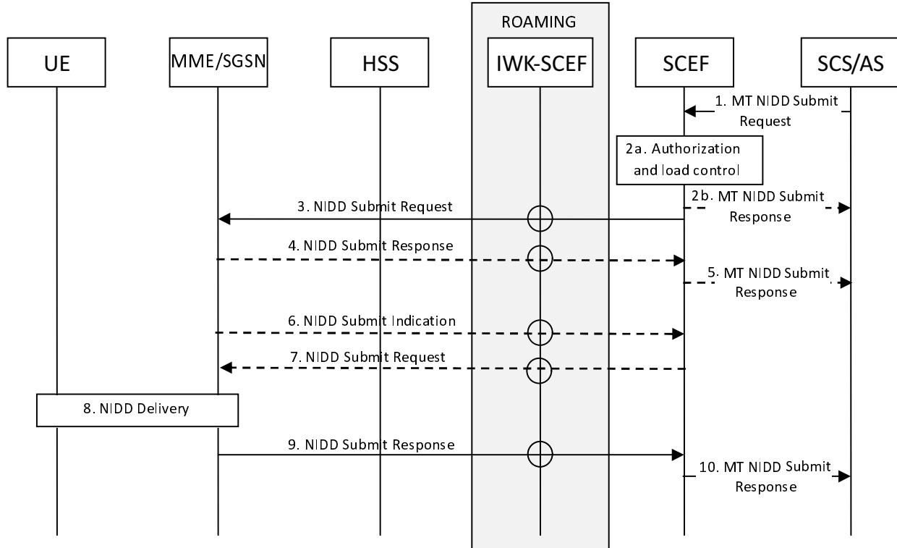  
Figure 5.13.3-1: Mobile Terminated NIDD procedure

1. If SCS/AS has already activated the NIDD service for a given UE, and has downlink non-IP data to send to the UE, the SCS/AS sends a MT NIDD Submit Request (External Identifier or MSISDN, TLTRI, non-IP data, non-IP data sequence number, Reliable Data Service Configuration, Maximum Latency, Priority, PDN Connection Establishment Option) message to the SCEF. The Maximum Latency is an optional field that is used to indicate maximum delay acceptable for downlink data and may be used to configure the buffer duration; a Maximum Latency of 0 indicates that buffering is not allowed. If Maximum Latency is not provided, the SCEF determines the acceptable delay based on local polices. Priority is an optional field that is used to indicate the priority of the non-IP data packet relative to other non-IP data packets. If Priority is not provided, the SCEF determines the acceptable delay based on local polices. Reliable Data Service Configuration is an optional parameter that is used to configure the Reliable Data Service (as defined in clause 4.5.14.3); it may be used to indicate if a Reliable Data Service acknowledgment is requested and port numbers for originator application and receiver application. PDN Connection Establishment Option an optional field that is used to indicate what the SCEF should do if the UE has not established the PDN connection (wait for the UE to establish the PDN connection, respond with an error cause, or send a device trigger; see step 2). If PDN Connection Establishment Option is not provided with the non-IP packet, the SCEF uses the PDN Connection Establishment Option that was provided during NIDD Configuration to decide how to handle the absence of a PDN connection. Non-IP data sequence number is an optional field that refers to earlier MT NIDD requests, it is only included if the purpose of the MT NIDD Submit Request is to replace or purge data that is buffered in the SCEF. If an MT NIDD Submit Request is received with non-IP data and a non-IP data sequence that is equal to a request that is already buffered, then the buffered data is replaced. If an MT NIDD Submit Request is received with no non-IP data and a non-IP data sequence that is equal to a request that is already buffered, then the buffered data is purged.

The Maximum Latency Parameter provided by the SCS/AS in this procedure is only used by the SCEF to determine the maximum acceptable delay for associated non-IP data and is not propagated further by the SCEF.

2. The SCEF determines the EPS Bearer Context based on the APN associated with the NIDD configuration and the User Identity. If an SCEF EPS bearer context corresponding to the External Identifier or MSISDN included in step 1 is found, then the SCEF checks whether the SCS/AS is authorised to send NIDD requests and that the SCS/AS has not exceeded the quota (e.g. 200 bytes in 24hrs) or rate (e.g. 10 bytes / hour) of data submission to the SCEF EPS bearer. When determining the quota and the rate of data submissions, the SCEF considers the APN Rate Control pre-configured in the SCEF and the Serving PLMN Rate Control parameter that was received from MME during the T6a/b connection establishment. The SCEF considers already buffered data during the check of whether the quota or the rate was exceeded. If the SCEF receives additional NIDD request(s) while already buffering data, the SCEF considers the non-IP data priority when checking the quota and the rate and deciding whether to buffer the additional non-IP data. If this check is successful and SCEF buffers the additional non-IP data, the SCEF continues with step 5. If this check fails or if the non-IP packet size is larger than then the Maximum Packet Size that was provided to the SCS/AS during NIDD Configuration, the SCEF sends a MT NIDD Submit Response (Cause) with a cause value indicating the reason for the failure condition and the flow stops at this step. Otherwise, the flow continues with step 3.

If no SCEF EPS bearer context is found, then the SCEF, depending on PDN Connection Establishment Option, may either:

\- send a MT NIDD Submit Response (Cause) with appropriate error cause value. The flow stops at this step; or

perform device triggering towards the UE to establish a PDN Connection of type Non-IP to the default APN by using T4 SMS device triggering to a pre-defined SMS Application Port ID (refer to clause 5.2.2). In this case, the SCEF sends a MT NIDD Submit Response (non-IP data sequence, Buffered Indication, Trigger Indication, cause) with an appropriate cause value. The Buffered Indication indicates if the SCEF buffered the non-IP data. The non-IP data sequence number is assigned by the SCEF and may be used by the SCS/AS to overwrite or purge the buffered data at a later time. The Trigger Indication is used to indicate that a trigger was sent in order to establish the PDN connection. If data is not buffered, the flow stops at this step, otherwise, it proceeds to step 6. The SCEF may use Priority to configure the priority of the device trigger and may use Maximum Latency to configure the validity period of the device trigger; or

NOTE 1: It is left to stage 3 to reserve the SMS Application Port ID number that will be used to carry the trigger to the UE to indicate that the UE should establish a PDN Connection of type Non-IP to the default APN.

accept the MT NIDD Submit Request, and execute step 5 with an appropriate cause value, and wait for the UE to perform a procedure (see TS 23.401 [7]) causing the establishment of a PDN connection to the SCEF (see clause 5.13.1.2). If data is not buffered, the flow stops at step 5.

NOTE 2: The duration for which the SCEF may wait for establishment of a PDN connection to the SCEF for the given UE is implementation dependent.

3. If an SCEF EPS bearer context corresponding to the External Identifier or MSISDN included in step 1 is found, then the SCEF sends a NIDD Submit Request (User Identity, EPS Bearer ID, SCEF ID, non-IP data, SCEF Wait Time, Maximum Re-transmission time) message toward the MME/SGSN. SCEF Wait Time indicates how long the SCEF is prepared to wait for MME/SGSN response. Maximum Re-transmission indicates how long the SCEF is prepared to re-transmit the message.

If the IWK-SCEF receives a NIDD Submit Request message from the SCEF, it relays the message to the MME/SGSN.

4. If the MME/SGSN can immediately deliver the non-IP data to the UE e.g. when UE is already in ECM\_CONNECTED mode, or UE is in ECM\_IDLE and MME/SGSN is able to initiate paging procedure (see TS 23.401 [7]), the procedure proceeds at step 8.

If the MME/SGSN is aware of the UE being temporarily unreachable, or if the MME/SGSN knows that the UE is not scheduled to be reachable within the SCEF Wait Time, while using power saving functions e.g. UE Power Saving Mode (see clause 4.5.4) or extended idle mode DRX (see clause 4.5.13), then the MME/SGSN may send a NIDD Submit Response (Cause, Requested Re-Transmission Time) message towards the SCEF. The Cause parameter indicates that Non-IP data was not delivered to the UE, as the UE is temporarily not reachable due to power saving but the MME/SGSN will notify the SCEF when the MME/SGSN determines the UE is reachable. The MME/SGSN sets the Not Reachable for NIDD flag in the EMM context for this UE and stores the corresponding SCEF address. If the Maximum Re-transmission Time was included in the Request, the MME may indicate in Requested Re-Transmission time IE the time when the SCEF is expected to re-transmit the DL data to the currently unreachable UE.

5. The SCEF may send a MT NIDD Submit Response (Requested Re-Transmission time, non-IP data sequence number, Buffered Indication, Cause) to the SCS/AS informing of the received results from the MME/SGSN. If the SCEF receives from the MME/SGSN a Cause value indicating that UE is temporarily not reachable due to power saving, the SCEF can buffer the non-IP data requested at step 3 based on the configuration and proceed to step 6. The Buffered Indication indicates if the SCEF buffered the non-IP data. The non-IP data sequence number is assigned by the SCEF and may be used by the SCS/AS to overwrite or purge the buffered data at a later time. If, in step 2, the SCEF buffered the non-IP data and is waiting for the UE to establish a PDN connection, then the SCEF proceeds to step 7 after T6a Connection Establishment. The Requested Re-Transmission tells the SCS/AS when the SCEF is expected to re-transmit the DL data to the currently unreachable UE.

6. When the MME/SGSN detects that the UE is reachable (e.g. when coming out of PSM mode by performing TAU/RAU, when initiating MO communication etc.), or when the UE is about to become reachable (e.g. extended idle mode DRX cycle expiring, MME/SGSN anticipating MO communication pattern for the UE etc.), and the MME/SGSN has the Not Reachable for NIDD flag set, then the MME/SGSN sends a NIDD Submit Indication (User Identity) message towards the SCEF. The MME/SGSN clears the Not Reachable for NIDD flag from its EMM context.

If the MME included the Requested Re-transmission-Time in the NIDD Submit Response, the MME sends a NIDD Submit Indication (User Identity) message towards the SCEF only if the UE becomes reachable before the Requested Re-transmission Time. The MME shall clear the Not Reachable for NIDD flag when the Requested Re-transmission Time expires and the UE has not become reachable yet.

If the MME/SGSN sends the NIDD Submit Request message towards the SCEF as described in clause 5.13.4 or an Update Serving Node Information Request message towards the SCEF as described in clause 5.13.6, then the MME/SGSN clears the Not Reachable for NIDD flag from its EMM context, but it need not send the NIDD Submit Indication message. If the SCEF receives the NIDD Submit Request message or an Update Serving Node Information Request from the MME/SGSN for this UE, the SCEF may consider it an implicit NIDD Submit Indication, and proceed with step 7.

7. If the data has not been purged, the SCEF sends a NIDD Submit Request (User Identity, EPS Bearer ID, SCEF ID, non-IP data, SCEF Wait Time, Maximum Re-transmission time) message toward the MME/SGSN.

8. If required, the MME/SGSN pages the UE and delivers the non-IP data to the UE using data transfer via the MME procedure as described in clause 5.3.4B.3 of TS 23.401 [7] or the SGSN procedure as described in clauses 9.3 and 9.6 of TS 23.060 [6]. Depending on operator configuration, the MME/SGSN may generate the necessary accounting information required for charging.

9. If the MME/SGSN was able to initiate step 8, then the MME/SGSN sends a NIDD Submit Response (cause) message towards the SCEF acknowledging the NIDD Submit Request from SCEF received in step 3 or step 7. If the eNodeB supports acknowledgements of downlink NIDD delivery and if acknowledgements of downlink NAS data PDUs are enabled in the subscription information for the UE and the eNodeB has acknowledged successful delivery to the MME/SGSN (see clause 5.3.4B.3 of TS 23.401 [7]), the cause is set to 'Success Acknowledged Delivery' otherwise 'Success Unacknowledged Delivery'. If the delivery failed, the cause is 'Unsuccessful delivery'.

If Reliable Data Service header indicates that acknowledgement is requested, then the UE shall respond with an acknowledgement to the DL data that was received in step 8 following the Mobile Originated NIDD Procedure in clause 5.13.4, steps 1 - 2 and 5.

NOTE 3: The 'Success Acknowledged Delivery' implies reliable delivery to the UE using RLC acknowledged mode. The 'Success Unacknowledged Delivery' result does not imply the data is successfully received at the UE, but just the MME/SGSN has sent the non-IP data in NAS signalling to the UE. If the UE sends UL data in response to the received DL data in step 8, then it follows the Mobile Originated NIDD Procedure in clause 5.13.4.

10. The SCEF sends an MT NIDD Submit Response (Reliable Data Service Acknowledgement Indication, Hop-by-Hop Acknowledgment Indication, non-IP data sequence number, Cause). The Reliable Data Service Acknowledgement Indication is used to indicate if an acknowledgement was received from the UE for the MT NIDD. If the Reliable Data Service was requested in step 1, then the MT NIDD Submit Response is sent to the SCS/AS after the acknowledgement is received from the UE or, if no acknowledgment is received, then the MT NIDD Submit Response is sent to the SCS/AS with a cause value indicating that no acknowledgement was received. When the Reliable Data Service was not requested in step 1, the Hop-by-Hop Acknowledgment Indication may be sent to the SCS/AS indicating the result of the Hop-by-Hop acknowledgment with a value of 'Success Acknowledged Delivery', 'Success Unacknowledged Delivery' or 'Unsuccessful delivery'.

## 5.13.4 Mobile Originated NIDD procedure

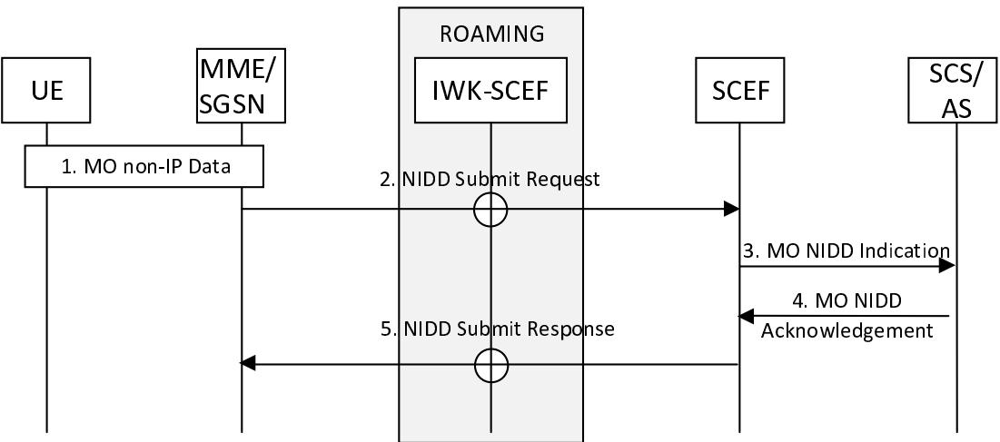  
Figure 5.13.4-1: Mobile Originated NIDD procedure

1. The UE sends a NAS message with EPS bearer ID and non-IP data, the Reliable Data Service header is included if the Reliable data service is enabled, to the MME as per the procedure described in clause 5.3.4B.2 of TS 23.401 [7] (steps 0 - 2) or the UE sends data to the SGSN (see clause 9.3 and 9.6 of TS 23.060 [6]) on a PDP Context of PDN type Non-IP associated with a T6b interface.

2. The MME/SGSN sends NIDD Submit Request (User Identity, EBI, SCEF ID, non-IP data, MO Exception data counter) message to the SCEF. In the roaming case, the MME/SGSN sends the message to the IWK-SCEF which forwards the message to the SCEF over T7. The MME only includes the MO Exception data counter if the RRC establishment cause is set to "MO exception data" and the UE is accessing via the NB-IoT RAT. The MME maintains the MO Exception Data Counter and sends it to the SCEF as described in TS 29.128 [37].

3. When the SCEF receives the non-IP data on the T6a/T6b (or T7) interface, and finds an SCEF EPS bearer context and the related T8 Destination Address, then it sends the non-IP data to the SCS/AS that is identified by the T8 Destination address in a MO NIDD Indication (External Identifier or MSISDN, non-IP data, TLTRI,

Reliable Data Service Configuration). The Reliable Data Service Configuration is used to provide the SCS/AS with additional information when the Reliable Data Service (as defined in clause 4.5.14.3) is enabled (e.g. indicate if an acknowledgement was requested and port numbers for originator application and receiver application). If no T8 Destination address is associated with the UE's PDN connection, the data is discarded, MO NIDD Indication is not sent, and the flow continues at step 5.

NOTE 1: It is left to stage 3 whether or not the SCEF aggregates MO NIDD Indication messages to the SCS/AS.

4. The SCS/AS responds to the SCEF with a MO NIDD Acknowledgement (Cause).

5. The SCEF sends NIDD Submit Response to MME/SGSN. In the roaming case, the SCEF sends the message to the IWK-SCEF over T7 and the IWK-SCEF forwards the message to the MME/SGSN over T6a/T6b. If the SCEF cannot deliver the data, e.g. due to missing SCS/AS configuration, the SCEF sends an appropriate error code to the MME/SGSN. If the Reliable Data Service is enabled in the APN configuration and the non-IP packet indicates that an acknowledgment is requested, then the SCEF follows the Mobile Terminated NIDD Procedure in clause 5.13.3, steps 3-9.

NOTE 2: If the SCS/AS has Downlink data to send (e.g. an application level acknowledgement for the NIDD delivery), it follows the Mobile Terminated NIDD Procedure in clause 5.13.3.

## 5.13.5 T6a/T6b Connection Release

## 5.13.5.1 General

The MME releases the T6a connection(s) towards the SCEF(s) corresponding to the "SCEF ID" indicator for that APN in the following cases:

UE-initiated Detach procedure for E-UTRAN, or

MME-initiated Detach procedure, or

\- the HSS-initiated Detach procedure, or

\- UE or MME requested PDN disconnection procedure.

The SGSN releases the T6b connection(s) towards the SCEF(s) corresponding to the "SCEF ID" indicator for that APN in the following cases:

Detach Procedures (see clause 6.6 of TS 23.060 [6]), or

\- MS and network initiated PDP Deactivation Procedures (see clause 9.2.4 of TS 23.060 [6]).

The SCEF releases the T6a/b connection(s) towards the MME/SGSN corresponding to PDN connections in the following cases:

\- when an NIDD Authorization Update Request from the HSS indicates that the User is no longer authorized for NIDD, or

\- failure of SCEF or failure of SCS/AS connection, or

based on a request from the SCS/AS, or

based on removal of the APN associated with the T6a/b connection from the SCEF.

## 5.13.5.2 MME/SGSN Initiated T6a/T6b Connection Release procedure

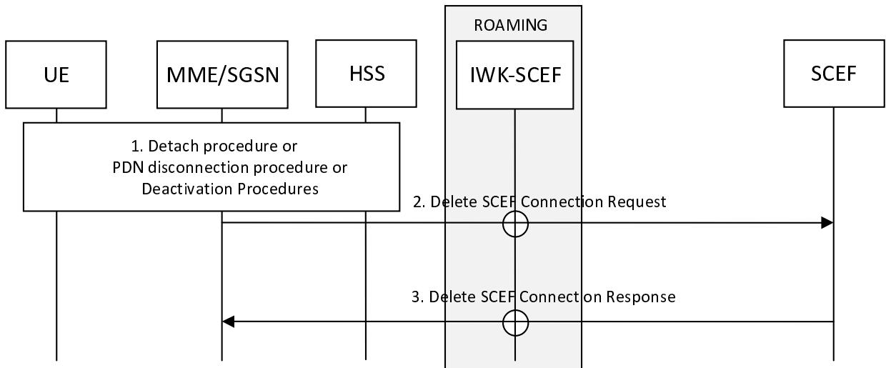  
Figure 5.13.5.2-1: MME/SGSN Initiated T6a/T6b Connection Release procedure

1. The UE performs step 1 of the UE-initiated Detach procedure for E-UTRAN (see clause 5.3.8.2.1 TS 23.401 [7]), or the MME performs the MME-initiated Detach procedure (see clause 5.3.8.3 of TS 23.401 [7]), or the HSS performs step 1a of the HSS-initiated Detach procedure (see clause 5.3.8.4 of TS 23.401 [7]), or the UE/MME performs steps 1a-1b of the UE or MME requested PDN disconnection procedure (see clause 5.10.3 of TS 23.401 [7]), or a Detach Procedure specified in clause 6.6 of TS 23.060 [6] is performed, or an MS or network initiated Deactivation Procedure specified in clause 9.2.4 of TS 23.060 [6] is performed, for which the PDN/PDP connection to an SCEF exists.

2. If the MME/SGSN has an active EPS bearer context(s) or PDP Context(s) corresponding to the PDN/PDP connection to the SCEF(s), then for each active EPS bearer context/PDP Context, the MME/SGSN sends a Delete SCEF Connection Request (User Identity, EPS Bearer Identity, SCEF ID, APN) message towards the SCEF. The MME/SGSN deletes the EPS bearer context/PDP Context corresponding to the PDN connection.

NOTE 1: For further details of T6a/T6b/T7 interactions please refer to Stage 3 specifications.

NOTE 2: The SGSN uses the NSAPI of the PDP Context used for SCEF communication as an EPS Bearer ID when T6b is used.

3. The SCEF sends a Delete SCEF Connection Response (User Identity, EPS Bearer Identity, SCEF ID, APN, PCO) message towards the MME/SGSN indicating acceptance of the removal of SCEF Connection information for the UE. The SCEF deletes the SCEF EPS bearer context corresponding to the PDN connection.

NOTE 3: For further details of T6a/T6b/T7 interactions please refer to Stage 3 specifications.

If the last PDN Connection of a given APN is being released, the SCEF may send to the MME the current APN Rate Control Status (see clause 4.7.7.3 of TS 23.401 [7]). The MME stores it in the MM context.

## 5.13.5.3 SCEF Initiated T6a/T6b Connection Release procedure

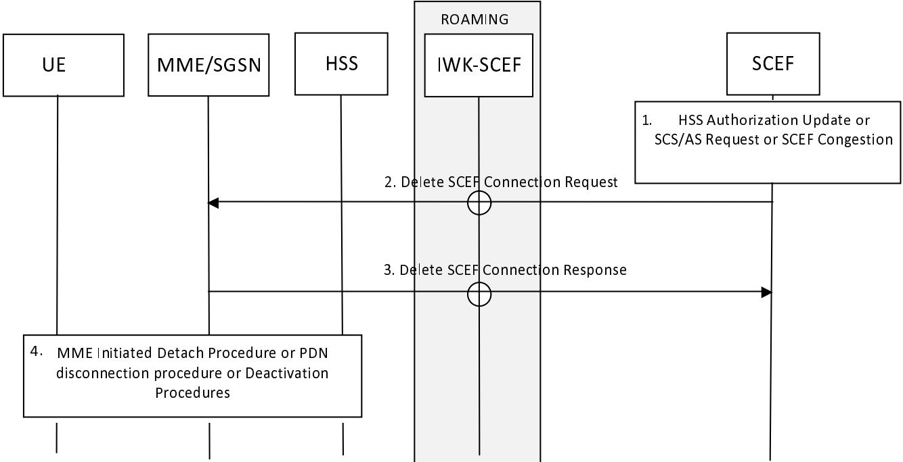  
Figure 5.13.5.3-1: SCEF Initiated T6a/T6b Connection Release procedure

1. An NIDD Authorization Update request from the HSS indicates that the User is no longer authorized for NIDD, the SCS/AS indicates that the User's NIDD PDN connection is no longer needed, or the SCEF determines that it is needs to release a T6a/b connection.

2. The SCEF sends a Delete SCEF Connection Request (User Identity, EPS Bearer Identity, SCEF ID) message towards the MME/SGSN. The SCEF deletes the SCEF EPS bearer context corresponding to the PDN connection.

NOTE 1: For further details of T6a/T6b/T7 interactions please refer to Stage 3 specifications.

If the last PDN Connection of a given APN is being released, the SCEF may send to the MME the APN Rate Control Status (see clause 4.7.7.3 of TS 23.401 [7]). The MME stores it in the MM context.

3. The MME/SGSN sends a Delete SCEF Connection Response (User Identity, EPS Bearer Identity, SCEF ID, APN) message towards the SCEF acknowledging the removal of SCEF Connection information for the UE. The MME/SGSN deletes the EPS bearer context/PDP Context corresponding to the PDN connection.

NOTE 2: For further details of T6a/T6b/T7 interactions please refer to Stage 3 specifications.

NOTE 3: The SGSN uses the NSAPI of the PDP Context used for SCEF communication as an EPS Bearer ID when T6b is used.

4. The MME may perform the MME-initiated Detach procedure (see clause 5.3.8.3 of TS 23.401 [7]), or step 1b of the UE or MME requested PDN disconnection procedure (see clause 5.10.3 of TS 23.401 [7]). An SGSN may perform SGSN-Initiated Detach Procedure specified in clause 6.6.2.1 of TS 23.060 [6], or a network initiated Deactivation Procedure specified in clause 9.2.4 of TS 23.060 [6], for which the PDN/PDP connection to an SCEF exists.

## 5.13.6 Serving node relocation procedure over T6a/T6b

## 5.13.6.1 General

Mobility may happen with respect to a non-IP PDN connection via the SCEF as a result of a TAU/RAU procedure. The following procedures apply:

Successful TAU/RAU on a new MME/SGSN,

Failed TAU/RAU.

## 5.13.6.2 Successful TAU/RAU procedure with T6a/T6b

The procedure in Figure 5.13.6.2-1 applies when a T6a/T6b PDN/PDP connection exists for a UE that executes a successful TAU procedure to a new MME or a successful RAU procedure to a new SGSN.

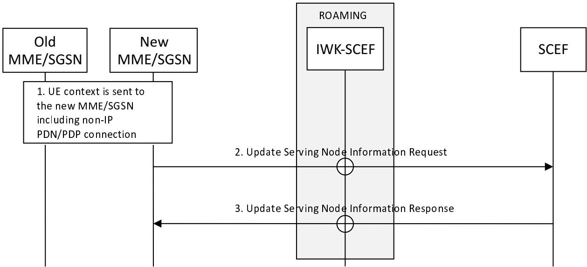  
Figure 5.13.6.2-1: T6a/T6b and successful TAU/RAU procedure

1. UE performs a successful TAU/RAU procedure (see TS 23.401 [7] and TS 23.060 [6]) and the new MME/SGSN receives subscription information for a non-IP PDN/PDP connection to an APN that is associated with an "Invoke SCEF Selection" indicator and an associated SCEF ID.

2. If the subscription information corresponding to either the default APN for PDN type of "Non-IP" or the UE requested APN includes "Invoke SCEF Selection" indicator, then the new MME/SGSN shall create a PDN/PDP connection to the SCEF or to the IWK-SCEF, using the already allocated EBI. As for the "T6a/T6b Connection Establishment Procedure", clause 5.13.1.2, the new MME/SGSN does so by sending an Update Serving Node Information Request (User Identity, EPS Bearer Identity, SCEF ID, APN, Serving PLMN ID, IMEISV) message towards the SCEF. If the SCEF received the Reachable for NIDD flag for the UE from old MME/SGSN but has yet to receive the NIDD Submit Indication message from the old MME/SGSN, and the SCEF has buffered the Non-IP data, then the SCEF may execute the procedure in clause 5.13.3 starting at step 7.

NOTE 1: For further details of T6a/T6b interactions please refer to Stage 3 specifications.

If the IWK-SCEF receives the Update Serving Node Information Request message from the MME/SGSN, it shall forward it to the SCEF.

3. The SCEF creates an SCEF EPS Bearer Context (see clause 5.3.2) for the user identified via User Identity. The SCEF sends Update Serving Node Information Response (User Identity, EPS Bearer Identity, SCEF ID, Cause, NIDD Charging ID) message toward the MME/SGSN confirming establishment of the PDN connection to the SCEF for the UE. If the IWK-SCEF receives the Update Serving Node Information Response message from the SCEF, it shall forward it to the MME/SGSN.

NOTE 2: For further details of T6a/T6b interactions please refer to Stage 3 specifications.

## 5.13.7 Void

## 5.13.8 NIDD Authorisation Update

Figure 5.13.8-1 illustrates the procedure of updating or revoking an existing NIDD Authorisation. The HSS may initiate the NIDD Authorisation Update procedure with the SCEF to send updated Authorisation information to the SCEF.

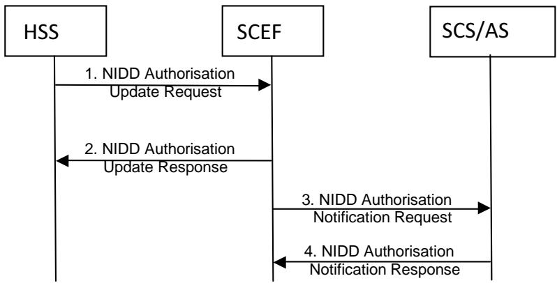  
Figure 5.13.8-1: NIDD Authorisation Update procedure

1. The HSS may send an NIDD Authorisation Update Request (IMSI and MSISDN or External Identifier, APN, Result) message to the SCEF to update a user's NIDD authorisation. The HSS shall include in the NIDD Authorisation Update Request the IMSI and either MSISDN or External Identifier or both. The SCEF initiates the SCEF Initiated T6a/T6b Connection Release Procedure.

2. The SCEF sends an NIDD Authorisation Update Response (cause) message to the HSS to acknowledge the authorisation update. If the authorisation is removed, the SCEF should release T6a/T6b connection as specified in clause 5.13.5.3.

3. The SCEF informs the SCS/AS that the User's authorisation status has changed by sending an NIDD Authorisation Notification Request (External Identifier or MSISDN, TLTRI, Result) message to the SCS/AS.

4. The SCS/AS responds to the SCEF with an NIDD Authorisation Notification Response.

## 5.14 PFD management via SCEF

## 5.14.1 Procedure for PFD management via SCEF

This procedure is used by the 3rd Party SCS/AS to manage PFDs into the operator network via SCEF. Figure 5.14.1-1 illustrates the procedure.

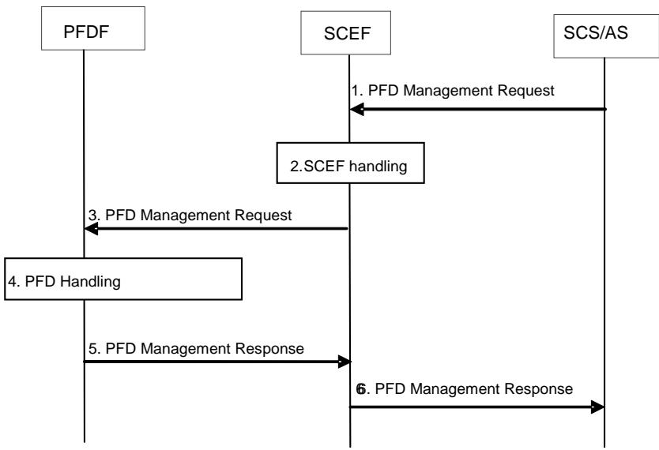  
Figure 5.14.1-1: procedure for PFD management via SCEF

1. The 3rd party SCS/AS sends a PFD Management Request (SCS/AS Identifier, external Application Identifier(s) and one or more sets of PFDs and PFD operation for each Application Identifier, Allowed Delay) message to the SCEF. The external Application Identifier(s) should be provided by an 3rd party SCS/AS that is known at the

SCEF, so that the 3rd party SCS/AS and the MNO has an SLA in place. PFD operation indicates that the PFD is to be created, updated or removed in the operator's network. The Allowed Delay is an optional parameter. If the Allowed Delay is included, it indicates that the list of PFDs in this request should be provisioned to all the PCEF/TDFs known in the PFDF within the time interval indicated by the Allowed Delay.

2. Based on operator policies, if the 3rd party SCS/AS is not authorized to perform this request (e.g. if the SLA does not allow it due to the Allowed Delay is too short or other reasons), the SCEF performs step 6 and provides a Cause value appropriately indicating the error. Otherwise, the SCEF translates each external Application Identifier to the corresponding Application Identifier known at the PFDF.

3. The SCEF sends a PFD Management Request message (Application Identifier(s), one or more sets of PFDs and PFD operation for each Application Identifier, Allowed Delay) to the PFDF.

4. The PFDF creates, updates or deletes the list of PFDs for each Application Identifier into the PFDF as requested by the respective PFD operation.

5. The PFDF sends a PFD Management Response (Application Identifier(s), Cause) message to the SCEF to provide the feedback of the handling result for the PFD Management Request.

6. The SCEF sends a PFD Management Response (Cause) message to the 3rd party SCS/AS to provide the feedback of the handling result for the PFD Management Request.

## 5.14.2 PFD definition

PFD (Packet Flow Description) is a set of information enabling the detection of application traffic including:

PFD id; and

one or more of the following:

\- 3-tuple(s) including protocol, server side IP address and port number;

the significant parts of the URL to be matched, e.g. host name;

a Domain name matching criteria and information about applicable protocol(s).

NOTE 1: Based on the agreement between SCS/AS and mobile operator, the PFD can be designed to convey proprietary extension for proprietary application traffic detection mechanisms.

NOTE 2: How the PFD(s) are used in service data flow detection is specified in TS 23.203 [27].

## 5.15 Procedure for MSISDN-less MO-SMS via T4

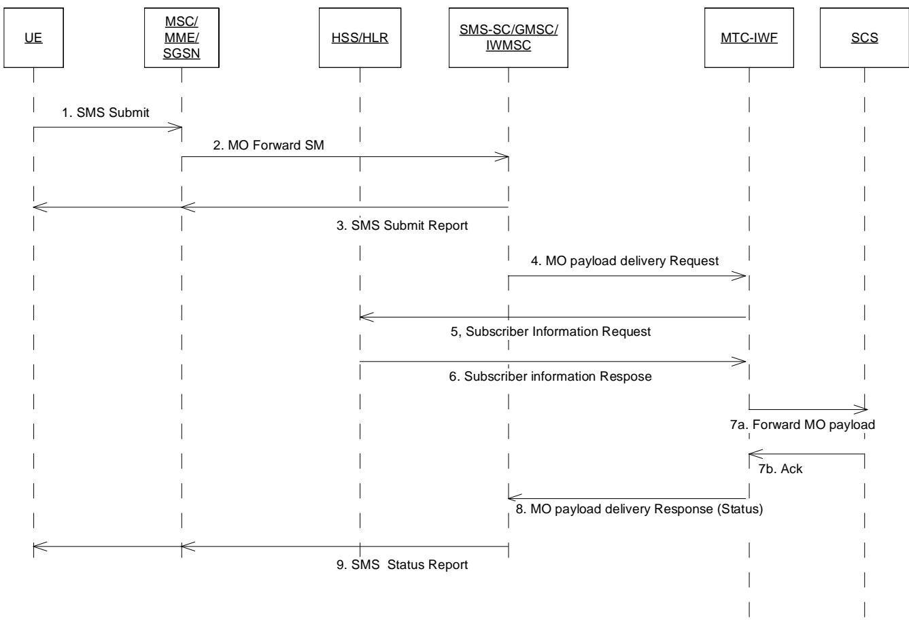  
Figure 5.15-1: MSISDN-less MO-SMS via T4

1. UE uses Short Message Mobile Originated procedure as specified in TS 23.040 [12] to delivery small data to SCS/AS. The service centre address points to the SMS-SC which contain the function described in this procedure, the destination SME address is set to short/long code of the SCS/AS, and Application Port ID element of the TP-User-Data field is set to an the appropriate value.

2. For MSISDN-less subscription, the MSC/VLR/MME/SGSN/IP-SM-GW uses the dummy MSISDN. This MSISDN and the IMSI of the UE are sent using existing SMS delivery procedure (e.g. MAP MO forward SM operation) to SMS-SC.

3. SMS-SC indicates to UE that it has successfully received the SMS message using existing SMS Submit Report defined in TS 23.040 [12].

4. SMS-SC uses the destination SME address (long/short code of the SCS/AS) to identify the corresponding MTC-IWF based on a pre-configured mapping table. SMS-SC extracts the SMS payload, Application port ID, and IMSI of the UE and deliver them to MTC-IWF via T4 along with the destination SME address (long/short code of the SCS/AS).

5-6. Over S6m, MTC-IWF uses the IMSI of the UE and application port ID to query the HSS/HLR for external ID.

7. Over Tsp, a MTC-IWF forwards the SMS payload, external ID, and Application Port ID to the SCS/AS. The SCS/AS is identified with the destination SME address (long/short code of the SCS/AS) received from step 3. The payload is delivered directly to the SCS/AS, not processed by MTC-IWF.

8. Via T4, MTC-IWF returns a success or failure delivery indication to SMS-SC.

9. SMS-SC indicates success/failure of the delivery of the SMS to the target back to UE using existing SMS Status Report defined in TS 23.040 [12].

## 5.16 Procedure for Enhanced Coverage Restriction Control via SCEF

Figure 5.16-1 shows the procedures for Enhanced Coverage Restriction Control via SCEF.  
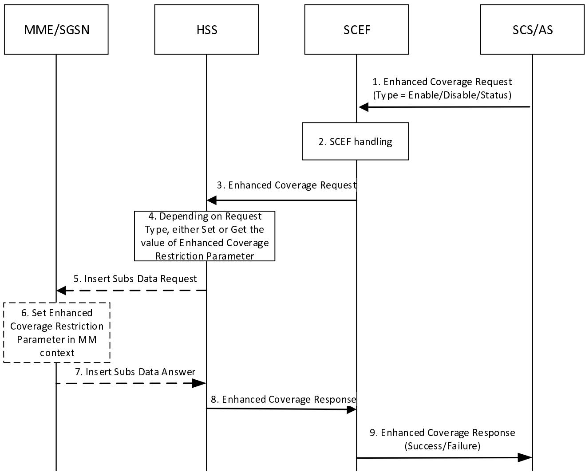  
Figure 5.16-1: Procedure for Enhanced Coverage Restriction Control via SCEF

1. The SCS/AS sends an Enhanced Coverage Request (External Identifier or MSISDN, SCS/AS Identifier, Request Type, Enhanced Coverage Restriction Data, MTC Provider Information) message to the SCEF. Request Type indicates if the request is to query the status of, or to enable, or to disable the enhanced coverage restriction. Enhanced Coverage Restriction Data provides data related to the Enhanced Coverage Restriction. Enhanced Coverage Restriction Data is only present if Request Type is to either enable or disable the enhanced coverage restriction.

2. The SCEF stores the SCS/AS Identifier. The SCEF assigns an SCEF Reference ID. Based on operator policies, if either the SCS/AS is not authorized to perform this request (e.g. if the SLA does not allow for it) or the Enhanced Coverage Request is malformed or the SCS/AS has exceeded its quota or rate of submitting Enhanced Coverage requests, the SCEF performs step 9 and provides a Cause value appropriately indicating the failure result.

3. The SCEF sends an Enhanced Coverage Request (External Identifier or MSISDN, SCEF ID, SCEF Reference ID, Type, MTC Provider Information) message to the HSS.

NOTE 1: The MTC Provider Information in step 1 is an optional parameter. The SCEF can validate the provided MTC Provider Information and override it to an SCEF selected MTC Provider Information based on configuration. How the SCEF determines the MTC Provider Information, if not present in step 1, is left to implementation (e.g. based on the requesting SCS/AS).

4. The HSS examines the Enhanced Coverage Request message, e.g. with regard to the existence of External Identifier or MSISDN, whether any included parameters are in the range acceptable for the operator, whether the Enhanced Coverage restriction is supported by the serving MME/SGSN. If this check fails the HSS follows step 8 and provides a Cause value indicating the reason for the failure condition to the SCEF.

If the Request Type is to get the current status of enhanced coverage HSS retrieves the value and procedure follows at Step 8. Else If the Type is to enable or to disable the enhanced coverage, HSS sets Enhanced Coverage Restricted parameter to the appropriate value and the procedure continues at step 5.

5. If required by the specific Enhanced Coverage Request Type and when Enhanced Coverage is supported by the serving MME/SGSN, the HSS sends an Insert Subscriber Data Request (Type, SCEF ID, SCEF Reference ID) message to the MME/SGSN.

6. Based on operator policies, the MME/SGSN may reject the request (e.g. overload or HSS has exceeded its quota or rate of submitting enhanced coverage requests defined by an SLA).

The MME/SGSN updates Enhanced Coverage Restricted parameters in the MME/SGSN context.

The MME/SGSN will transfer the Enhanced Coverage Restricted parameters stored as part of its context information during MME/SGSN change.

NOTE 2: UE is informed of the updated Enhanced Coverage Restricted parameters value at next TAU/RAU, or based on the local policy, network can detach the UE indicating re-attach is required.

7. If the Enhanced Coverage restriction is updated successful, the MME/SGSN sends an Insert Subscriber Data Answer (Cause) message to the HSS. MME/SGSN may include the Enhanced Coverage Restricted parameter in the Insert Subscriber Data Answer message.

8. The HSS sends an Enhanced Coverage Response (SCEF Reference ID, Cause) message to the SCEF. HSS includes result = success/failure and in the case of success may include Enhanced Coverage Restriction Data.

In the case of UE mobility, the HSS determines whether the new MME/SGSN supports Enhanced Coverage restriction.

9. The SCEF sends an Enhanced Coverage Response (Cause, Enhanced Coverage Restriction Data) message to the SCS/AS. Cause indicates success or failure. If in step 1 the Enhanced Coverage Request message is sent to query the status of Enhanced Coverage Restricted, then Enhanced Coverage Restriction Data is included (in the case of success) in the Enhanced Coverage Response message.

## 5.17 Procedures for accessing MTC-IWF Functionality via SCEF

## 5.17.1 Device triggering procedure via T8

Figure 5.17.1-1 shows the procedure for Triggering via T8.

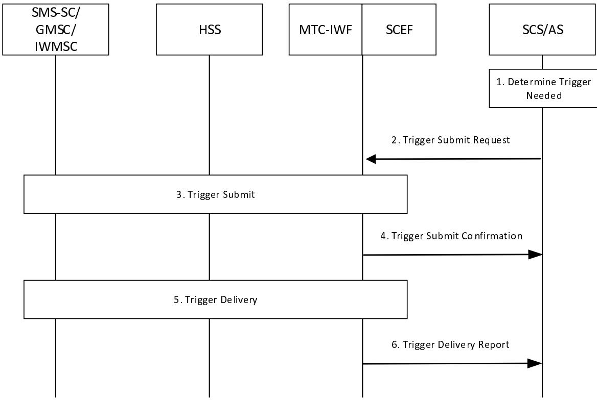  
Figure 5.17.1-1: Device triggering procedure via T8

1. The SCS/AS determines the need to trigger the device. If the SCS/AS has no contact details for the SCEF, it may determine the IP address(es)/port(s) of the SCEF by performing a DNS query using the External Identifier or using a locally configured SCEF identifier.

2. The SCS/AS sends the Trigger Submit Request (External Identifier or MSISDN, SCS Identifier, trigger reference number, validity period, priority, Application Port ID and trigger payload) message to the SCEF. The SCEF assigns a TLTRI to the Trigger Submit Request.

3. The SCEF/MTC-IWF executes steps 3-6 of the Device triggering over Tsp procedure of clause 5.2.1, followed by steps 1-2 of the Trigger Delivery using T4 procedure of clause 5.2.2.

4. The SCEF sends a Trigger Submit Confirmation (TLTRI, Cause) to the SCS/AS to confirm that the Device Trigger Request has been accepted for delivery to the UE.

5. Steps 4-9 of the Trigger Delivery using T4 procedure of clause 5.2.2 are executed. In step 9 of the Trigger Delivery using T4 procedure, the SCEF/MTC-IWF receives the Message Delivery Report from the SMS/SC.

6. The SCEF sends the Trigger Delivery Report (TLTRI, cause) message to the SCS/AS with a cause value indicating the trigger delivery outcome (e.g. succeeded, unknown or failed and the reason for the failure).

## 5.17.2 Device triggering recall/replace procedures via T8

Figure 5.17.2-1 shows the procedures for recalling and replacing triggers over T8.

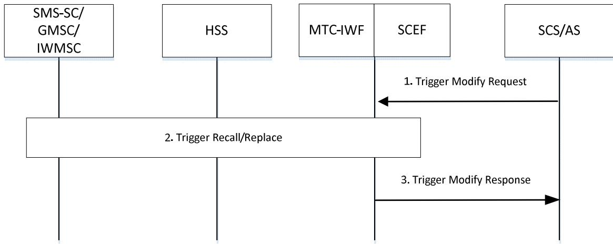  
Figure 5.17.2-1: Procedure for triggering recall/replace via T8

1. The SCS/AS determines that it needs to recall/replace a trigger message that it has previously submitted. The SCS/AS sends Trigger Modify Request (SCS Identifier, TLTRI, action type, new trigger reference number, new validity period, new priority, new Application Port ID, and new trigger payload) message with action type set to "Trigger Recall Request" or "Trigger Replace Request". The SCS needs to include a new trigger reference number, new validity period, new priority, new Application Port ID and new trigger payload for trigger replace request only. The SCEF uses the TLTRI to determine the trigger reference number which was assigned to the previously submitted trigger message that the SCS/AS wants to cancel.

2. The SCEF/MTC-IWF executes steps 2-4 of the Device trigger recall/replace procedure over Tsp of clause 5.2.3.1.

3. The SCEF indicates trigger recall/replace success or failure in the Trigger Modify Response (result) message to the SCS/AS.

## 5.17.3 Procedure for MSISDN-less MO-SMS via T8

Figure 5.17.3-1 shows the procedures for MSISDN-less MO-SMS via T8.

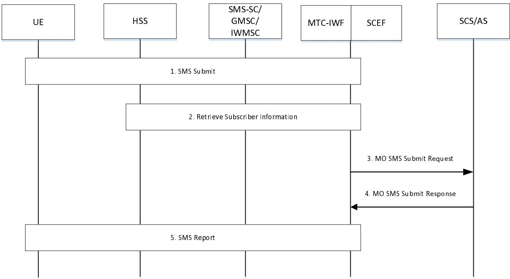  
Figure 5.17.3-1: Procedure for MSISDN-less MO-SMS via T8

1. The UE sends an SMS to the SCS/AS. The UE, MSC/MME/SGSN, and SMS-SC execute steps 1 and 2 of the MSISDN-less MO-SMS via T4 procedure of clause 5.15. SMS-SC uses the destination SME address (long/short code of the SCS/AS) to identify the corresponding SCEF based on a pre-configured mapping table. SMS-SC extracts the SMS payload, Application port ID, and IMSI of the UE and deliver them to SCEF via T4 along with the destination SME address (long/short code of the SCS/AS).

2. The SCEF/MTC-IWF executes steps 4-5 of the MSISDN-less MO-SMS via T4 procedure of clause 5.15.

3. The SCEF sends a MO SMS Submit Request (SMS payload, external ID, and Application Port ID) to the SCS/AS. The SCS/AS is identified with the destination SME address (long/short code of the SCS/AS) received from step 1. The payload is delivered directly to the SCS/AS, it is not processed by SCEF.

4. The SCS/AS sends a MO SMS Submit Response to the SCEF.

5. The SCEF/MTC-IWF executes steps 7 of the MSISDN-less MO-SMS via T4 procedure of clause 5.15. The SMS Delivery or failure report is delivered to the UE as shown in step 8 of the MSISDN-less MO-SMS via T4 procedure of clause 5.15.

## 5.18 Procedure for Network Parameter Configuration via SCEF

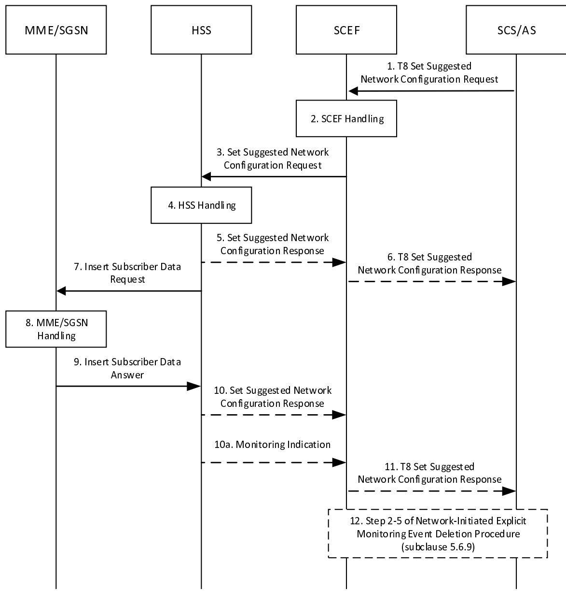  
Figure 5.18-1: Procedure for Network Parameter Configuration via SCEF

1. The SCS/AS sends a T8 Set Suggested Network Configuration Request (External Identifier or MSISDN or External Group Identifier, SCS/AS Identifier, Maximum Latency, Maximum Response Time and Suggested Number of Downlink Packets, Group Reporting Guard Time, TLTRI for Deletion, TLTRI for Update, the External Identifier(s) or MSISDN(s) of the individual member UE(s) to be cancelled or added for an existing group event, operation indication (cancellation or addition), MTC Provider Information) message to the SCEF to request that the network consider setting Maximum Latency, Maximum Response Time and Suggested Number of Downlink Packets to the requested value(s); they are all optional fields. If a new monitoring event is being configured, the SCEF assigns a TLTRI to the T8 Set Suggested Network Configuration Request. If the SCS/AS wants to perform deletion of a previously configured network parameter(s), then it shall include TLTRI for Deletion.

If the SCE/AS decides to cancel or add the monitoring event for certain UEs (i.e. one individual UE or a sub-set of UEs) in a group of UEs for which there is a configured Monitoring Event, the SCS/AS can send Monitoring Request message including the TLTRI for Update corresponding to the existing monitoring event configuration and the External Identifier(s) or MSISDN(s) of the individual member UE(s) to be cancelled or added with the operation indication which is either cancellation or addition.

2. The SCEF stores the TLTRI and assigns it to an SCEF Reference ID. Based on operator policies, if either the SCS/AS is not authorized to perform this request (e.g. if the SLA does not allow for it) or the Set Suggested Network Configuration Request is malformed, the SCEF skips steps 3-10 and provides a Cause value appropriately indicating the error. The SCEF checks whether the parameters are within the range defined by operator policies. If one or more of the parameters are not within range, then, based on operator policies, the SCEF may either reject the request by skipping steps 3-10 and providing a cause value that indicates which parameters are out of range, discard the value(s) that are out of range and proceed with the flow, or select different value(s) that are in range and proceed with flow. If the SCEF decides on using values, for the parameters provided in step 1, different to the ones provided by the SCS/AS, then the SCS/AS is informed of it in step 11. If the SCEF received a TLTRI for Update, the SCEF looks up the SCEF context pointed to by the TLTRI for Update to derive the related SCEF Reference ID. If the SCEF received a TLTRI for Deletion, the SCEF looks up the SCEF context pointed to by the TLTRI for Deletion to derive the related SCEF Reference ID for Deletion.

3. The SCEF sends a Set Suggested Network Configuration Request (External Identifier or MSISDN or External Group Identifier, SCEF ID, SCEF Reference ID, Maximum Latency (if provided), Maximum Response Time (if provided), Suggested Number of Downlink Packets (if provided), Group Reporting Guard Time, SCEF Reference ID for Deletion, the External Identifier(s) or MSISDN(s) of the individual member UE(s) to be cancelled or added, operation indication (cancellation or addition), MTC Provider Information) message to the HSS to configure the parameters on the HSS and on the MME/SGSN. If the External Group Identifier is included, External Identifier or MSISDN shall be ignored.

NOTE 1: The MTC Provider Information in step 1 is an optional parameter. The SCEF should validate the provided MTC Provider Information and may override it to an SCEF selected MTC Provider Information based on configuration. How the SCEF determines the MTC Provider Information, if not present in step 1, is left to implementation (e.g. based on the requesting SCS/AS).

4. The HSS examines the Set Suggested Network Configuration Request message, e.g. with regard to the existence of External Identifier or MSISDN or External Group Identifier or whether the included parameters are in the range acceptable for the operator, if this check fails the HSS either skips steps 5-9 and provides a Cause value indicating the reason for the failure condition to the SCEF or selects different value(s) that are in range and proceeds with flow. If the HSS decides on using values, for the parameters provided in step 3, different to the ones provided by the SCEF, then the SCEF is informed of it in step 10. In addition, the HSS sets the subscribed periodic RAU/TAU timer using the value of Maximum Latency, if it is provided.

If the Enhanced Multiple Event Monitoring feature is not supported and if the subscribed periodic RAU/TAU timer was previously set by a Monitoring Request then, depending on operator configuration, the flow skips steps 5-9 and the HSS rejects the Network Configuration Request with an appropriate Cause indicating the failure condition or accepts the request. In the case that the HSS accepts this request, the HSS cancels the previously accepted Monitoring Request. If SCEF Reference ID for Deletion was provided, the HSS deletes the network parameter configuration identified by the SCEF Reference ID for Deletion. If the previously accepted Monitoring Request is associated with a group of UEs and the HSS is not cancelling the previously accepted Monitoring Request for all UEs in the group, then the HSS provides the indicated UEs (External Identifier or MSISDN) to the SCEF in step 10.

If the Enhanced Multiple Event Monitoring feature is supported, and if the subscribed periodic RAU/TAU Timer, or Active Time, or Suggested number of downlink packets, or any combination were previously set by a different Monitoring Request or Network Parameter Configuration for the same UE, as long as the Maximum Latency (if received), Maximum Response Time (if received) and Suggested number of downlink packets (if received) are within the range defined by operator policies, the HSS shall accept the request as follows:

If the newly received Maximum Latency is lower than the provided subscribed periodic RAU/TAU timer, the HSS shall set the subscribed periodic RAU/TAU timer using the newly received Maximum Latency.

If the newly received Maximum Response Time is higher than the provided subscribed Active Time (i.e. previously provided Maximum Response Time), the HSS shall set the subscribed Active Time using the newly received Maximum Response Time.

If Suggested number of downlink packets is newly received, the HSS shall add the newly received value to the currently used value of Suggested number of downlink packets if the aggregated value is within the operator defined range. If the aggregated value is not within the operator defined range, the HSS shall set the subscribed Suggested number of downlink packets according to operator defined range.

The HSS may notify the SCEF (which then notifies the SCS/AS) of the actual value of Maximum Latency and Maximum Response Time that are being applied in the 3GPP network.

5. For group based processing (if the HSS received the Set Suggested Network Configuration Response with an External Group Identifier), the HSS sends a Set Suggested Network Configuration Response (SCEF Reference ID, SCEF Reference ID for Deletion, Cause) message to the SCEF to acknowledge acceptance of the Set Suggested Network Configuration Request before beginning the processing of individual UEs indicating that Group processing is in progress.

6. For group based processing (if the SCEF received the T8 Set Suggested Network Configuration Response with an External Group Identifier), the SCEF sends a T8 Set Suggested Network Configuration Response (TLTRI, Cause) message to the SCS/AS. The Cause value indicates progress of Group processing request.

7. If the Enhanced Multiple Event Monitoring feature is not supported and the HSS accepts new monitoring event configuration and cancels the existing monitoring event configuration, the HSS sends an Insert Subscriber Data Request (newly received Maximum Response Time (if provided), subscribed periodic RAU/TAU timer (if modified), newly received Suggested Number of Downlink Packets (if provided)) message to the MME/SGSN for the individual UE or for each individual group member UE. When HSS accepts new monitoring event configuration for the indicated UEs in step 4 above, for each indicated UE, the HSS sends such Insert Subscriber Data Request message to the MME/SGSN. When HSS removes a previously configured Monitoring Event for the indicated UEs in step 4 above, the HSS also deletes the previously configured Monitoring Event in the MME/SGSN, if applicable.

If the Enhanced Multiple Event Monitoring feature is supported, the HSS sends an Insert Subscriber Data Request (Maximum Response Time (if modified), subscribed periodic RAU/TAU timer (if modified), newly received Suggested Number of Downlink Packets (if the newly received Suggested number of downlink packets is higher than the provided Suggested number of downlink packets) message to the MME/SGSN for the individual UE or for each individual group member UE.

If the Set Suggested Network Configuration Request message is for a group of UEs, the HSS sends an Insert Subscriber Data Request message per UE to all the MME/SGSN(s) serving the members of the group. If the HSS received a SCEF Reference ID for Deletion in step 3, the HSS shall stop using the provisioned values and determine the parameters that it notifies to the MME/SGSN as in the case when no externally provisioned parameters apply.

8. The MME/SGSN verifies the request, e.g. if the parameters are covered by a roaming agreement when the request is from another PLMN. If this check fails, the MME/SGSN follows step 9 and provides a Cause value indicating the reason for the failure condition to the HSS. Based on operator policies, the MME/SGSN may also reject the request due to other reasons (e.g. overload or HSS has exceeded its quota or rate of submitting requests defined by an SLA).

If the subscribed periodic RAU/TAU timer was modified, at every subsequent TAU/RAU procedure, the MME/SGSN applies the subscribed periodic RAU/TAU timer.

NOTE 2: The MME/SGSN will transfer the parameters stored as part of its context information during an MME/SGSN change.

9. The MME/SGSN sends an Insert Subscriber Data Answer (Cause) message to the HSS.

10. For single UE processing (if the HSS received the Set Suggested Network Configuration Response without an External Group Identifier), the HSS sends Set Suggested Network Configuration Response (SCEF Reference ID, SCEF Reference ID for Deletion, Maximum Response Time (if modified), Maximum Latency (if modified), Suggested Number of Downlink Packets (if modified), Cancelled SCEF Reference ID, Cause) message to the SCEF to acknowledge acceptance or indicate the rejection of the Set Suggested Network Configuration Request. If the HSS modified any of the parameters that were provided in step 3, the modified values are provided to the SCEF.

For group based processing, if the Group Reporting Guard Time was provided in the Request, the HSS accumulates multiple responses for the UEs of the group within the Group Reporting Guard Time. After the Group Reporting Guard Time expiration, the HSS sends a Set Suggested Network Configuration Response (SCEF Reference ID, SCEF Reference ID for Deletion, Cause, list of (External Identifier or MSISDN, Cancelled SCEF Reference ID, Cause)) with the accumulated responses. The HSS includes UE identity(ies) and a Cause value indicating the reason for the failure in the message if the monitoring configuration of the group member failed.

If the HSS cancelled Monitoring Event(s) for UE(s) in step 4 and the cancelled Monitoring Event(s) is subscribed by the SCEF which is the same as the one sending the Set Suggested Network Configuration Request at step 1, the HSS includes the SCEF Reference ID of the cancelled Monitoring Event(s) and reason for cancellation event(s) in the Set Suggested Network Configuration response message, or Monitoring Indication message if step 5 is executed already. If the HSS, in step 4 above, decides to cancel Monitoring Event for indicated UEs (i.e. one individual UE or a sub-set of UEs) in the group of UEs for which there was a previously configured Monitoring Event, the HSS also includes the External Identifier or MSISDN of these indicated UEs towards the SCEF.

If the HSS, in step 4 above, decides to add Monitoring Event for indicated UEs (i.e. one individual UE or a subset of UEs) in the group of UEs for which there was a previously configured Monitoring Event, the HSS includes the External Identifier or MSISDN of these indicated UEs towards the SCEF.

10a. If the HSS cancelled a Monitoring Event(s) for UE in step 4 and the cancelled Monitoring Event(s) is subscribed by the SCEF which is different from the SCEF sending the Set Suggested Network Configuration Request at step 1, the HSS sends the Monitoring Indication message towards the SCEF which subscribed the cancelled Monitoring Event(s) and includes SCEF Reference ID of a cancelled Monitoring Event(s) and reason of cancellation. If the HSS, in step 4 above, decides to cancel Monitoring Event for indicated UEs (i.e. one individual UE or a sub-set of UEs) in the group of UEs for which there was a previously configured Monitoring Event, the HSS also includes the External Identifier or MSISDN of these indicated UEs towards the SCEF.

If the HSS, in step 4 above, decides to add Monitoring Event for indicated UEs (i.e. one individual UE or a subset of UEs) in the group of UEs for which there was a previously configured Monitoring Event, the HSS includes the External Identifier or MSISDN of these indicated UEs towards the SCEF.

11. For single UE processing (if the SCEF received the T8 Set Suggested Network Configuration Response without an External Group Identifier), the SCEF sends a T8 Set Suggested Network Configuration Response (TLTRI, Maximum Response Time (if modified), Maximum Latency (if modified), Suggested Number of Downlink Packets (if modified), Cause) message to the SCS/AS. If the SCEF or HSS modified any of the parameters that were provided in step 1, the modified values are provided to the SCS/AS. If the SCEF discarded any of the parameters that were provided in step 1, the cause value indicates which values were discarded.

For group based processing, SCEF sends a T8 Set Suggested Network Configuration Response (TLTRI Maximum Response Time (if modified), Maximum Latency (if modified), Suggested Number of Downlink Packets (if modified), Cause, list of (External Identifier or MSISDN, Cause)) with the accumulated responses received from the HSS in step 10. If the SCEF or HSS modified any of the parameters that were provided in step 1, the modified values are provided to the SCS/AS. If the SCEF discarded any of the parameters that were provided in step 1, the cause value indicates which values were discarded.

12. If the SCEF received Cancelled SCEF Reference ID in step 10 or 10a, the steps 2-5 of Network-initiated Explicit Monitoring Event Deletion procedure defined in clause 5.6.9 are performed with the TLTRI corresponding to the Cancelled SCEF Reference ID.

## 5.19 RACS information provisioning procedures

## 5.19.1 General

This clause specifies procedures for provisioning of UCMF with RACS related information from SCS/AS, either via SCEF or directly. Specification of these procedures does not preclude other methods of UCMF provisioning being used, e.g. O&M.

## 5.19.2 RACS information provisioning procedures via SCEF

This procedure is used by SCS/AS to add, update or delete UE radio access capability entries in the UCMF using the protocol specified in TS 29.122 [44] for the SCEF northbound API and the protocol defined in TS 29.675 [49] for the UCMF northbound API. Figure 5.19.2-1 illustrates the procedure.

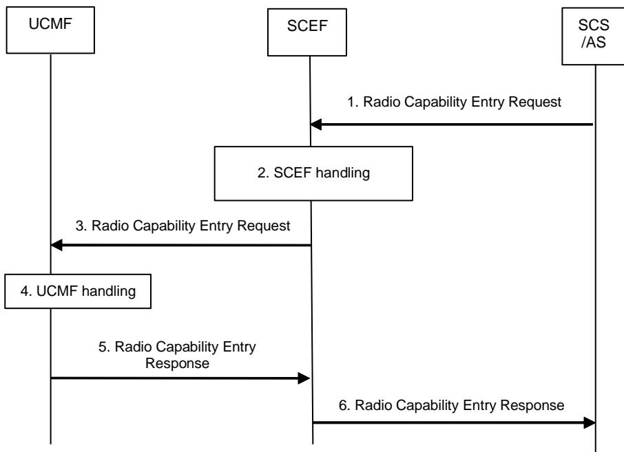  
Figure 5.19.2-1: RACS information provisioning procedure via SCEF

1. The SCS/AS sends a Radio Capability Entry Request ((list of) UE Radio Capability ID(s), UE radio access capability(s) set with its coding format(s) for each UE radio Capability ID, one (list of) IMEI/TAC values(s) for each UE Radio Capability ID, action) message to the SCEF. The action indicates add/modify/delete operation for the UE Radio Capability ID and UE radio access capability.

NOTE: The UE radio access capability for each UE radio Capability ID can be in one coding format or both the coding formats as defined in TS 36.331 [50] or TS 38.331 [51].

2. The SCEF may check whether the UE Radio Capability ID is within the allowed list of manufacturers according to local policy. If the checking fails, step 6 is executed with error response.

3. The SCEF sends a Radio Capability Entry Request ((list of) UE Radio Capability ID(s), UE radio access capability(s) set with its coding format(s) for each UE radio Capability ID, one (list of) IMEI/TAC values(s) for each UE Radio Capability ID, action) message to the UCMF.

4. The UCMF creates, updates or deletes the UE radio access capability entry (or entries) for the indicated UE Radio Capability ID(s). The UCMF shall ensure that for the same UE Radio Capability ID, only one UE radio access capability entry in one or both the coding formats exists.

5. The UCMF sends a Radio Capability Entry Response (Cause) message to the SCEF.

6. The SCEF sends a Radio Capability Entry Response (Cause) message to the SCS/AS.

## 5.19.3 RACS information provisioning procedures via T9a

This procedure is used by SCS/AS to add, update or delete UE radio access capability entries in the UCMF using the protocol defined in TS 29.675 [49]. Figure 5.19.3-1 illustrates the procedure.

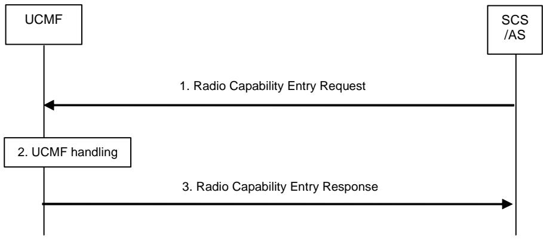  
Figure 5.19.3-1: RACS information provisioning procedure via T9a

1. The SCS/AS sends a Radio Capability Entry Request ((list of) UE Radio Capability ID(s), UE radio access capability(s) set with its coding format(s) for each UE radio Capability ID, one (list of) IMEI/TAC values(s) for each UE Radio Capability ID, action) message to the UCMF. The action indicates add/modify/delete operation for the UE Radio Capability ID and UE radio access capability.

NOTE: The UE radio access capability for each UE radio Capability ID can be in one coding format or both the coding formats as defined in TS 36.331 [50] or TS 38.331 [51].

2. The UCMF creates, updates or deletes the UE radio access capability entry (or entries) for the indicated UE Radio Capability ID(s). The UCMF shall ensure that for the same UE Radio Capability ID, only one UE radio access capability entry in one or both the coding formats exists.

3. The UCMF sends a Radio Capability Entry Response (Cause) message to the SCS/AS.

## Annex A (informative): MTC Deployment Scenarios

In the indirect and hybrid models, the deployment of a SCS may be inside or outside the operator domain as illustrated in figures A-1 and A-2. When the SCS is part of the operator domain (figure A-1 C and figure A-2), the SCS is considered a mobile operator internal network function, is operator controlled, and may provide operator value-added services. In this case, security and privacy protection for communication between the MTC-IWF and SCS is optional. When the SCS is deployed outside the operator domain (figure A-1 B and A-2), the SCS is MTC Service Provider controlled. In this case, security and privacy protection for communication between the MTC-IWF and SCS is needed. In the direct model (figure A-1 A), there may not be an external or internal SCS in the communication path.

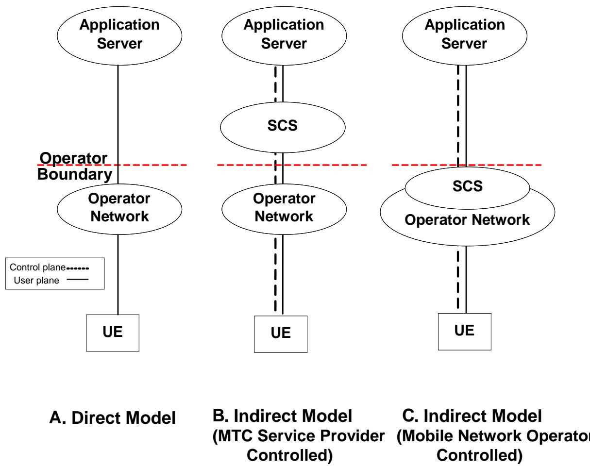  
Figure A-1: Deployment scenarios for direct and indirect model

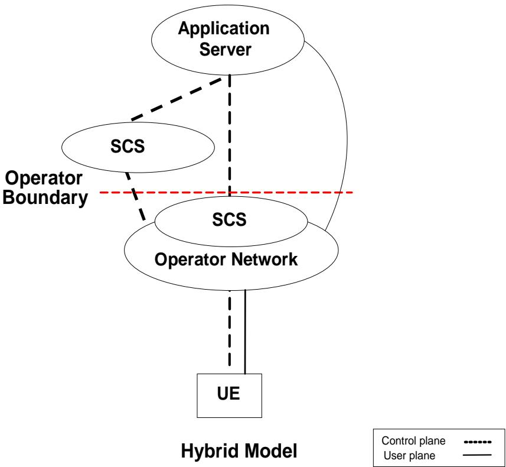  
Figure A-2: Deployment scenarios for hybrid model

An operator may deploy the hybrid model with a combination of no internal and external SCS (as in the Direct Model) and internal and/or external SCS (as in the Indirect Model). As shown in Figure A-2, a UE may be in communications with multiple SCSs in an HPLMN which can be made up of a combination of operator controlled and MTC service provider controlled SCSs. In that scenario, the MTC Service provider controlled SCS, and the 3GPP operator controlled SCS may offer different capabilities to the MTC Applications.

Though not illustrated, it is also possible that the deployment of an AS may be inside the operator domain and under operator control.

Annex B (informative): Void

# Annex C (informative): Triggering with OMA Push

## C.1 General

The 3GPP Device Trigger function enables a transport of application defined triggers to be delivered from a Service Capability Server (SCS) towards the UE. One defined application trigger framework is OMA Push Architecture [20]. OMA Push defined messages can be carried as payload in the Device Trigger message.

C.2 Triggering flow using Service Loading  
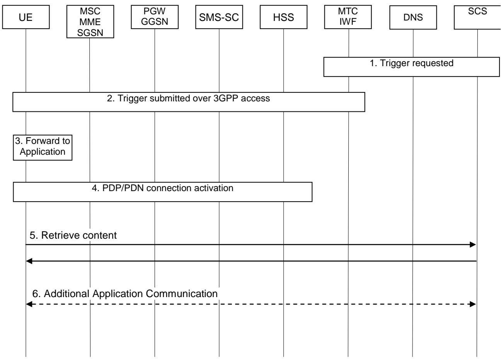  
Figure C.2-1: Triggering flow using OMA Push

1. The SCS generates content (e.g. an MTC application specific command) and a URI towards the content (or receives a URI towards content from another source) and then the SCS (performing OMA Push Proxy Gateway functionality) generates a Push Message [19] with the PDU set according to Service Loading [17], and sends a trigger request over Tsp according to clause 5.2.1.

2. The MTC-IWF receives the trigger request and sends it according to clause 5.2.1.

3. The UE SMS dispatcher receives the SMS and routes it to the OMA Push Client which has registered for the triggering routing identifier (e.g. SMS Application port). The OMA Push Client, optionally validates the source (using whitelist defined in OMA Push Management Object [18]) and then forwards the trigger using the Application-Id (e.g. to the M2M Service Capability Layer).

4. The UE activates a PDP/PDN connection.

5. The content described as part of the URI is retrieved (retrieval of content is mandatory for content type Service Loading [17]).

6. Based on the content retrieved the addressed Application may perform additional actions (e.g. the M2M Service Capability Layer may convey the information to an M2M Application addressed as part of the "command" retrieved, within the same or in a different physical device), but this is outside scope of 3GPP standardisation.

## Annex D (informative): Device triggering using direct model over user plane

The following flow shows an example of device triggering using direct model over user plane. In this example, an application in the UE explicitly registers with a DT-AS/SCS (Device Trigger Application Server) in the home operator's network using an existing PDN connection (e.g. default PDN connection). The DT-AS uses the information from the application registration (such as IP address, port, protocol, etc.) to deliver the incoming device triggers, forwarded by another AS (e.g. third party AS) or itself, to the UE through the user plane. Once the UE receives the trigger, the UE either uses the existing PDN connection or the UE sets up a new PDN connection to the appropriate APN to contact the third-party Application Server.

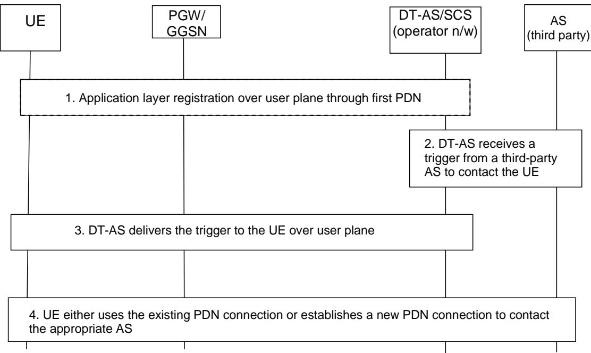  
Figure D-1: Triggering flow using direct model over user plane

1. The UE/MTC application registers with the DT-AS in an operator's network using an existing PDN connection (for e.g. default PDN). The registration information, for example, could include the IPv4/IPv6 address and the port number where the application is reachable.

2. The DT-AS receives a trigger from a third-party AS to reach the UE.

3. The DT-AS delivers the trigger to the UE over the user plane.

4. The UE either uses the existing PDN connection or sets up a new PDN connection using the appropriate APN to contact the third-party AS.

Annex E (informative): Change history

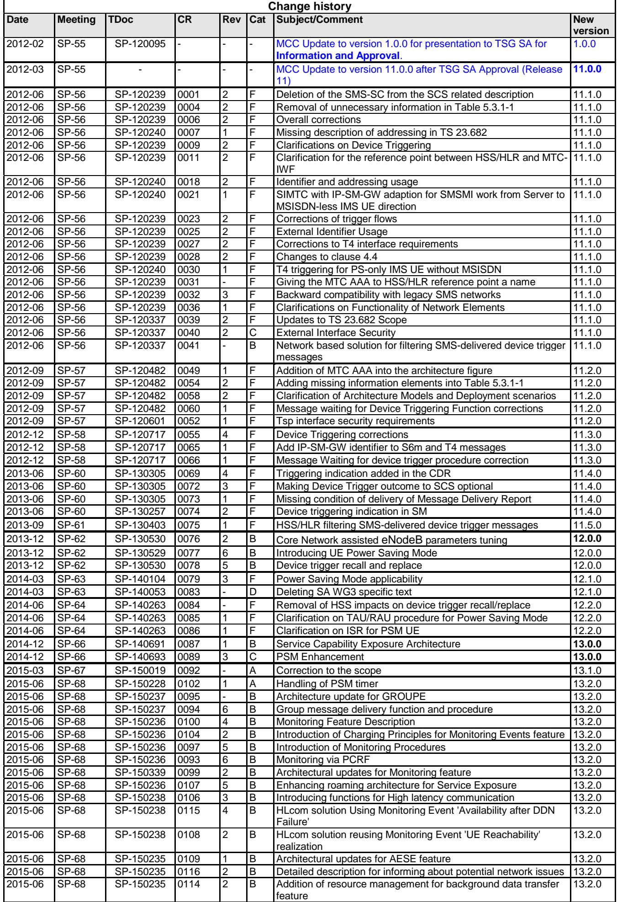

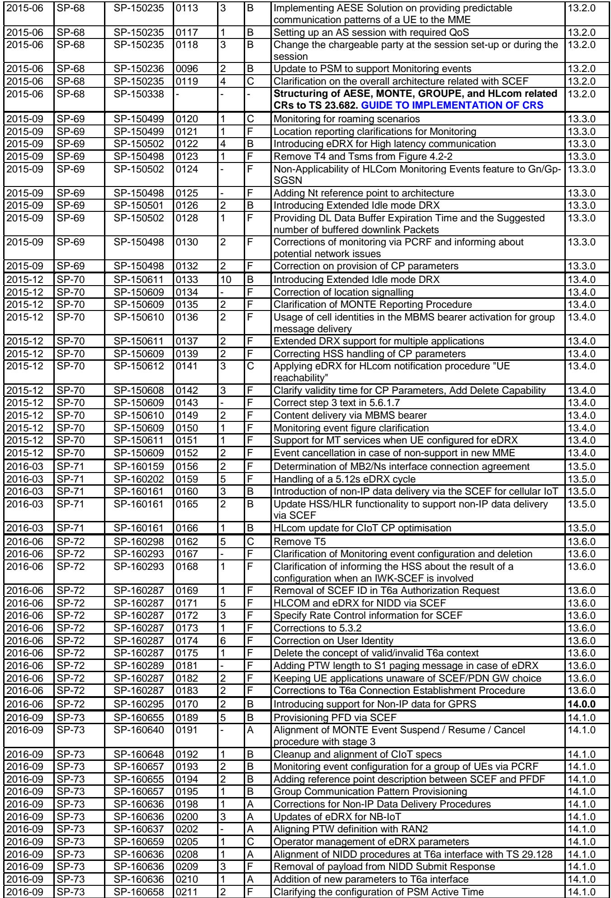

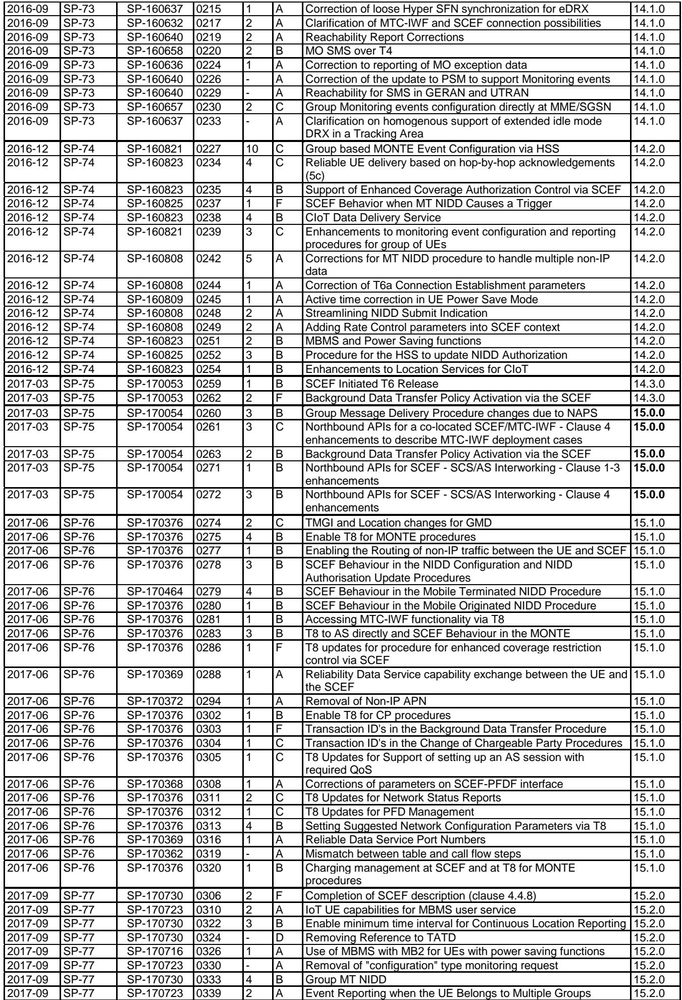

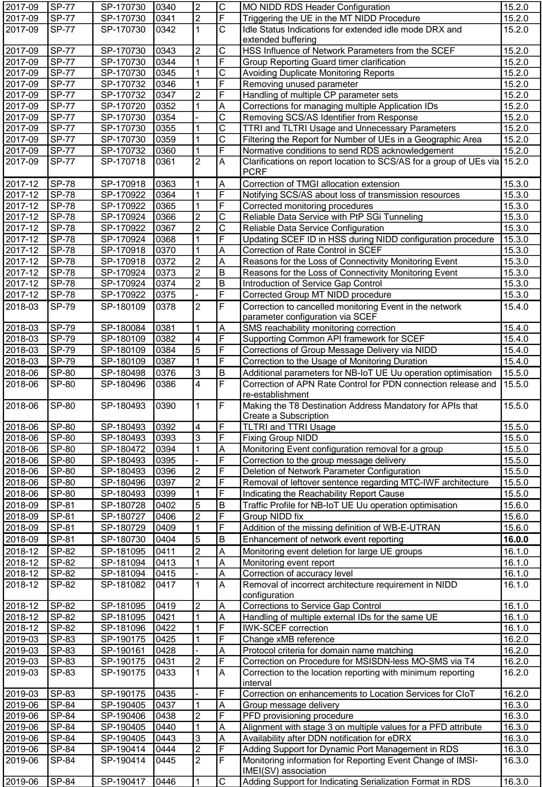

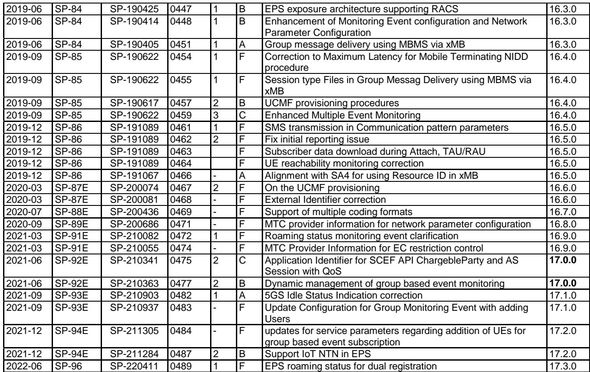

History

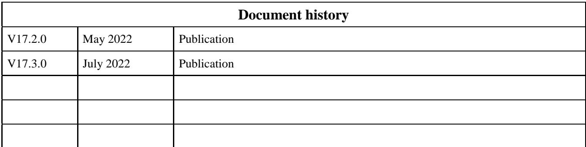