# ETSI TS 136 304 V18.1.0 (2024-05)

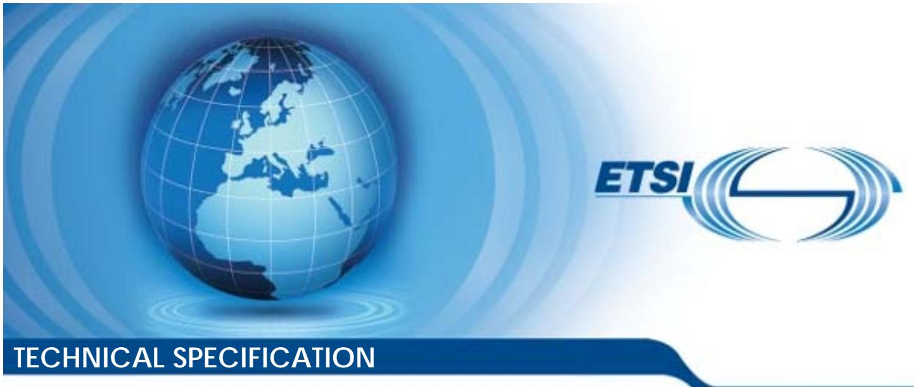

LTE; Evolved Universal Terrestrial Radio Access (E-UTRA); User Equipment (UE) procedures in idle mode (3GPP TS 36.304 version 18.1.0 Release 18)

# Reference RTS/TSGR-0236304vi10

Keywords

LTE

650 Route des Lucioles F-06921 Sophia Antipolis Cedex - FRANCE

Tel.: +33 4 92 94 42 00 Fax: +33 4 93 65 47 16

Siret N° 348 623 562 00017 - APE 7112B Association à but non lucratif enregistrée à la Sous-Préfecture de Grasse (06) N° w061004871

## Important notice

The present document can be downloaded from: https://www.etsi.org/standards-search

The present document may be made available in electronic versions and/or in print. The content of any electronic and/or print versions of the present document shall not be modified without the prior written authorization of ETSI. In case of any existing or perceived difference in contents between such versions and/or in print, the prevailing version of an ETSI deliverable is the one made publicly available in PDF format at www.etsi.org/deliver.

Users of the present document should be aware that the document may be subject to revision or change of status. Information on the current status of this and other ETSI documents is available at https://portal.etsi.org/TB/ETSIDeliverableStatus.aspx

If you find errors in the present document, please send your comment to one of the following services: https://portal.etsi.org/People/CommiteeSupportStaff.aspx

If you find a security vulnerability in the present document, please report it through our Coordinated Vulnerability Disclosure Program: https://www.etsi.org/standards/coordinated-vulnerability-disclosure

Notice of disclaimer & limitation of liability

The information provided in the present deliverable is directed solely to professionals who have the appropriate degree of experience to understand and interpret its content in accordance with generally accepted engineering or other professional standard and applicable regulations.

No recommendation as to products and services or vendors is made or should be implied.

No representation or warranty is made that this deliverable is technically accurate or sufficient or conforms to any law and/or governmental rule and/or regulation and further, no representation or warranty is made of merchantability or fitness for any particular purpose or against infringement of intellectual property rights.

In no event shall ETSI be held liable for loss of profits or any other incidental or consequential damages.

Any software contained in this deliverable is provided "AS IS" with no warranties, express or implied, including but not limited to, the warranties of merchantability, fitness for a particular purpose and non-infringement of intellectual property rights and ETSI shall not be held liable in any event for any damages whatsoever (including, without limitation, damages for loss of profits, business interruption, loss of information, or any other pecuniary loss) arising out of or related to the use of or inability to use the software.

## Copyright Notification

No part may be reproduced or utilized in any form or by any means, electronic or mechanical, including photocopying and microfilm except as authorized by written permission of ETSI.

The content of the PDF version shall not be modified without the written authorization of ETSI. The copyright and the foregoing restriction extend to reproduction in all media.

## Intellectual Property Rights

## Essential patents

IPRs essential or potentially essential to normative deliverables may have been declared to ETSI. The declarations pertaining to these essential IPRs, if any, are publicly available for ETSI members and non-members, and can be found in ETSI SR 000 314: "Intellectual Property Rights (IPRs); Essential, or potentially Essential, IPRs notified to ETSI in respect of ETSI standards", which is available from the ETSI Secretariat. Latest updates are available on the ETSI Web server (https://ipr.etsi.org/).

Pursuant to the ETSI Directives including the ETSI IPR Policy, no investigation regarding the essentiality of IPRs, including IPR searches, has been carried out by ETSI. No guarantee can be given as to the existence of other IPRs not referenced in ETSI SR 000 314 (or the updates on the ETSI Web server) which are, or may be, or may become, essential to the present document.

## Trademarks

The present document may include trademarks and/or tradenames which are asserted and/or registered by their owners. ETSI claims no ownership of these except for any which are indicated as being the property of ETSI, and conveys no right to use or reproduce any trademark and/or tradename. Mention of those trademarks in the present document does not constitute an endorsement by ETSI of products, services or organizations associated with those trademarks.

DECT™, PLUGTESTS™, UMTS™ and the ETSI logo are trademarks of ETSI registered for the benefit of its Members. 3GPP™ and LTE™ are trademarks of ETSI registered for the benefit of its Members and of the 3GPP Organizational Partners. oneM2M™ logo is a trademark of ETSI registered for the benefit of its Members and of the oneM2M Partners. GSM® and the GSM logo are trademarks registered and owned by the GSM Association.

## Legal Notice

This Technical Specification (TS) has been produced by ETSI 3rd Generation Partnership Project (3GPP).

The present document may refer to technical specifications or reports using their 3GPP identities. These shall be interpreted as being references to the corresponding ETSI deliverables.

The cross reference between 3GPP and ETSI identities can be found under https://webapp.etsi.org/key/queryform.asp.

## Modal verbs terminology

In the present document "shall", "shall not", "should", "should not", "may", "need not", "will", "will not", "can" and "cannot" are to be interpreted as described in clause 3.2 of the ETSI Drafting Rules (Verbal forms for the expression of provisions).

"must" and "must not" are NOT allowed in ETSI deliverables except when used in direct citation.

## Contents

Legal Notice ................   
Foreword ... ................................................................................................................... .... 6   
1   
2 References ..........   
3 Definitions and abbreviations ............................................................................................................ ..... 9   
3.1 3.2 Definitions .........Symbols ............. ........................................................................................................................... ..... 11   
3.3 Abbreviations .... .. 11   
4 General description of Idle mode ... ............................................................ .... 12   
4.1 Overview .... .. 12   
4.2 Functional division between AS and NAS in Idle mode .... ................................................................ ...... 14   
4.3 Service types in Idle Mode ............ .... 16   
4.4 NB-IoT functionality in Idle Mode .......   
5 Process and procedure descriptions ...... ......................................................................................... ...... 19   
5.1 PLMN selection .......... .................................................................................................. ....... 19   
5.1.1   
5.1.2 Support for PLMN selection .... ..................................................................................................... .... 19   
5.1.2.1   
5.1.2.2 ..... 19   
5.1.2.3   
5.1.2.4 GSM case ...... ............................................................................. ... 20   
5.1.2.5   
5.1.2.6 NR case ........   
5.2   
5.2.1 Introduction... ... 20   
5.2.2 States and state transitions in Idle Mode .. ...................................................................................... .... 21   
5.2.3 Cell Selection process ... ............................................................................ .. 22   
5.2.3.1 Description ...... .. 22   
5.2.3.2 Cell Selection Criterion ..................   
5.2.3.2a Cell Selection Criterion for NB-IoT .............   
5.2.3.3   
5.2.3.4 GSM case in Cell Selection ....... ......................................................................................... .. 25   
5.2.3.5   
5.2.3.6 NR case in Cell Selection ................................................................................................................. .... 26   
5.2.4 Cell Reselection evaluation process ........................................................................................................ .... 26   
5.2.4.1   
5.2.4.2 Measurement rules for cell re-selection ........................   
5.2.4.2a   
5.2.4.3 Mobility states of a UE .......... ..... 31   
5.2.4.3.1 Scaling rules ................... .... 32   
5.2.4.4 Cells with cell reservations, access restrictions or unsuitable for normal camping.... ... 33   
5.2.4.5 E-UTRAN Inter-frequency and inter-RAT Cell Reselection criteria ...... ... 33   
5.2.4.6 Intra-frequency and equal priority inter-frequency Cell Reselection criteria .. .. 35   
5.2.4.6a Reselection for enhanced coverage ........... ... 36   
5.2.4.7   
5.2.4.7.1 Speed dependant reselection parameters ......... ..... 39   
5.2.4.8 Cell reselection with CSG cells .....................   
5.2.4.8.1 Cell reselection from a non-CSG cell to a CSG cell .. .... 40   
5.2.4.8.2   
5.2.4.9 Cell reselection with Hybrid cells ... ... 40   
5.2.4.10 E-UTRAN Inter-frequency Redistribution procedure ........................................................................... 40   
5.2.4.10.1 Redistribution target selection .... .... 41   
5.2.4.11 Cell reselection or CN type change when storing UE AS context ...................................................   
5.2.4.12 Relaxed monitoring ................ ...........................................   
5.2.4.12.0 Relaxed monitoring measurement rules ...... ............................................ .... 42   
5.2.4.12.1 5.2.4.13 Relaxed monitoring criterion ....................................................................................................Cell reselection or CN type change in RRC\_INACTIVE state ...................................................... ..... 42 ..... 42   
5.2.5 Void .......... ..... 42   
5.2.6 Camped Normally state .... .... 42   
5.2.7 Cell Selection at transition to RRC\_IDLE or RRC\_INACTIVE state ...................................................   
5.2.7a Cell Selection at transition to RRC\_IDLE state for NB-IoT ................................ ... 43   
5.2.8 Any Cell Selection state .......   
5.2.8a Any Cell Selection state for NB-IoT .....   
5.2.9 Camped on Any Cell state ....... .................................................................................... ..... 43   
5.3   
5.3.1 Cell status and cell reservations ............................................................................................................ ..... 44   
5.3.2 Access control ..... .... 46   
5.3.3 Emergency call ....... ..........................................................................................................   
5.4 Tracking Area registration ... ................................................................................................. .... 47   
5.5 Support for manual CSG selection .......   
5.5.1 E-UTRA case .. .. 47   
5.5.2 5.6 UTRA case............................................................RAN-assisted WLAN interworking ........................... ............................................................................. ...... 47 ...... 47   
5.6.1 RAN assistance parameter handling in RRC\_IDLE ..   
5.6.2 Access network selection and traffic steering rules .... ...................................................................... ...... 47   
5.6.3   
6 Reception of broadcast information .. ... 49   
6.1 6.2 Reception of system information ...Reception of MBMS ..................... .............................................................................................. ....... 49 ....... 50   
7 Paging ...... ...................................................................................... ..... 50   
7.1 Discontinuous Reception for paging ................................................................................................................ 50   
7.2 Subframe Patterns...........   
7.3 Paging in extended DRX ..... ................................................................................................... ...... 53   
7.4 Paging with Wake Up Signal ............................................................................................. .... 54   
7.5 Paging with Group Wake Up Signal .. ................................................................................................ ...... 55   
7.5.1 General ... .... 55   
7.5.2   
7.5.3 WUS group selection .............   
7.5.4 ...... 57   
7.5.5 WUS Resource Location for BL UEs and UEs in Enhanced coverage . .. 58   
7.6 NRS presence on non-anchor paging carrier in NB-IoT . ............................................ ...... 59   
7.7 Coverage based paging ........................   
8   
9 Accessibility measurements .... ...... 61   
10 Mobility History Information .......   
11 Sidelink operation ..... .... 61   
11.1 Sidelink communication and V2X sidelink communication and NR sidelink communication . .. 61   
11.2 Sidelink discovery ..... .... 62   
11.3 Sidelink synchronisation .......   
11.4 Cell selection and reselection for sidelink ..   
11.4.1 Parameters used for cell selection and reselection triggered for sidelink ..... .... 62   
12. General description of UE camping on E-UTRA connected to 5GC ....   
Annex A (informative): Void ......... ........... 64   
Annex B (informative): Example of Hashed ID Calculation using 32-bit FCS ................................ 65   
Annex C (informative):   
History ...... .. 71

## Foreword

This Technical Specification has been produced by the 3rd Generation Partnership Project (3GPP).

The contents of the present document are subject to continuing work within the TSG and may change following formal TSG approval. Should the TSG modify the contents of the present document, it will be re-released by the TSG with an identifying change of release date and an increase in version number as follows:

Version x.y.z

where:

x the first digit:

1 presented to TSG for information;

2 presented to TSG for approval;

3 or greater indicates TSG approved document under change control.

y the second digit is incremented for all changes of substance, i.e. technical enhancements, corrections, updates, etc.

z the third digit is incremented when editorial only changes have been incorporated in the document.

## 1 Scope

The present document specifies the Access Stratum (AS) part of the Idle Mode procedures applicable to a UE. The nonaccess stratum (NAS) part of Idle mode procedures and processes is specified in TS 23.122 [5].

The present document specifies the model for the functional division between the NAS and AS in a UE.

The present document applies to all UEs that support at least E-UTRA, including multi-RAT UEs as described in 3GPP specifications, in the following cases:

When the UE is camped on an E-UTRA cell;

When the UE is searching for a cell to camp on;

NOTE: When the UE is camped on or searching for a cell to camp on belonging to other RATs, the UE behaviour is described in the specifications of the other RAT.

The Idle Mode procedures defined in this specification are also applicable for a UE in RRC\_INACTIVE state unless specified otherwise.

## 2 References

The following documents contain provisions which, through reference in this text, constitute provisions of the present document.

\- References are either specific (identified by date of publication, edition number, version number, etc.) or nonspecific.

\- For a specific reference, subsequent revisions do not apply.

For a non-specific reference, the latest version applies. In the case of a reference to a 3GPP document (including a GSM document), a non-specific reference implicitly refers to the latest version of that document in the same Release as the present document.

[1] 3GPP TR 25.990: "Vocabulary for UTRAN".

[2] 3GPP TS 36.300: "E-UTRA and E-UTRAN Overall Description; Stage 2".

[3] 3GPP TS 36.331: "E-UTRA; Radio Resource Control (RRC) - Protocol Specification".

[4] 3GPP TS 22.011: "Service accessibility".

[5] 3GPP TS 23.122: "NAS functions related to Mobile Station (MS) in idle mode".

[6] 3GPP TS 36.213: "E-UTRA; Physical layer procedures".

[7] 3GPP TS 36.214: "E-UTRA; Physical layer; Measurements".

[8] 3GPP TS 25.304: "User Equipment (UE) procedures in idle mode and procedures for cell reselection in connected mode"

[9] 3GPP TS 43.022: "Functions related to Mobile Station in idle mode and group receive mode".

[10] 3GPP TS 36.133: "Requirements for Support of Radio Resource Management".

[11] void

[12] void

[13] void

[14] void

[15] void

3GPP TS 24.301: "Non-Access-Stratum (NAS) protocol for Evolved Packet System (EPS); Stage 3"

3GPP2 C.S0024-C v2.0: "cdma2000 High Rate Packet Data Air Interface Specification".

3GPP2 C.S0005-F v1.0: "Upper Layer (Layer 3) Signalling Standard for cdma2000 Spread Spectrum Systems".

3GPP TS 25.304: "User Equipment (UE) procedures in idle mode and procedures for cell reselection in connected mode".

3GPP TS 24.008: "Mobile Radio Interface Layer 3 specification; Core Network Protocols; Stage 3"

3GPP TS 37.320: "Universal Terrestrial Radio Access (UTRA) and Evolved Universal Terrestrial Radio Access (E-UTRA); Radio measurement collection for Minimization of Drive Tests (MDT); Overall description; Stage 2".

3GPP TS 26.346: "Multimedia Broadcast/Multicast Service (MBMS); Protocols and codecs".

3GPP TS 23.401: "Evolved Universal Terrestrial Radio Access Network (E-UTRAN) access".

3GPP TS 23.682: "Architecture enhancements to facilitate communications with packet data networks and applications".

3GPP TS 23.402: "Architecture enhancements for non-3GPP accesses".

IEEE 802.11, Part 11: "Wireless LAN Medium Access Control (MAC) and Physical Layer (PHY) specifications, IEEE Std.".

Wi-Fi Alliance Technical Committee, Hotspot 2.0 Technical Task Group: "Hotspot 2.0 (Release 2) Technical Specification".

3GPP TS 24.302: "Access to the 3GPP Evolved Packet Core (EPC) via non-3GPP access networks".

3GPP TS 23.303: "Proximity-based services (ProSe); Stage 2".

3GPP TS 36.321: "E-UTRA; Medium Access Control (MAC) protocol specification".

3GPP TS 24.105: "Application specific Congestion control for Data Communication (ACDC) Management Object (MO)".

3GPP TS 31.102: "Characteristics of the Universal Subscriber Identity Module (USIM) application".

3GPP TS 36.101: "Evolved Universal Terrestrial Radio Access (E-UTRA); User Equipment (UE) radio transmission and reception".

Void

3GPP TS 23.003: "Numbering, addressing and identification".

3GPP TS 23.285: "Technical Specification Group Services and System Aspects; Architecture enhancements for V2X services".

3GPP TS 38.331: "NR; Radio Resource Control (RRC); Protocol specification".

3GPP TS 38.304: "New Generation Radio Access Network; User Equipment (UE) procedures in Idle mode and RRC Inactive state".

3GPP TS 23.501: "System Architecture for the 5G System; Stage 2".

3GPP TS 23.287: "Architecture enhancements for 5G System (5GS) to support Vehicle-to-Everything (V2X) services".

3GPP TS 22.261: "Service requirements for the 5G system".

## 3 Definitions and abbreviations

## 3.1 Definitions

For the purposes of the present document, the following terms and definitions apply:

Acceptable Cell: A cell that satisfies certain conditions as specified in 4.3. A UE can always attempt emergency calls on an acceptable cell, but restriction as in 5.3.3 apply.

Accepted IMSI Offset value: An offset value allocated by core network used for calculating the Alternative IMSI value as specified in TS 23.401 [23].

Alternative cell reselection priority: Cell reselection priority broadcast in the system information via altCellReselectionPriority and altCellReselectionSubPriority.

Alternative IMSI value: A temporary substitute IMSI value used for deriving the paging occasion for Multi-USIM UE to avoid paging occasion collision as specified in TS 23.401 [23].

Available PLMN(s): One or more PLMN(s) for which the UE has found at least one cell and read its PLMN identity(ies).

Barred Cell: A cell a UE is not allowed to camp on.

Camped on a cell: UE has completed the cell selection/reselection process and has chosen a cell. The UE monitors system information and (in most cases) paging information.

Camped on any cell: UE is in idle mode and has completed the cell selection/reselection process and has chosen a cell irrespective of PLMN identity.

Closed Subscriber Group (CSG): A Closed Subscriber Group identifies subscribers of an operator who are permitted to access one or more cells of the PLMN but which have restricted access (CSG cells).

CN type: The type of core network connectivity supported by an E-UTRA cell, either EPC or 5GC.

Commercial Mobile Alert System: Public Warning System that delivers Warning Notifications provided by Warning Notification Providers to CMAS capable UEs.

CSG cell: A cell broadcasting a CSG indication that is set to TRUE and a specific CSG identity.

CSG identity: An identifier broadcast by a CSG or hybrid cell/cells and used by the UE to facilitate access for authorised members of the associated Closed Subscriber Group.

CSG member cell: a cell broadcasting the identity of the selected PLMN, registered PLMN or equivalent PLMN and for which the Permitted CSG list of the UE includes an entry comprising cell's CSG ID and the respective PLMN identity.

DRX cycle: Individual time interval between monitoring Paging Occasion for a specific UE.

eDRX cycle: Time interval between the first Paging Occasions occurring after successive extended DRX periods.

eCall Only Mode: A UE configuration option that allows the UE to attach at EPS and register in IMS to perform only eCall Over IMS, and a non-emergency IMS call for test and/or terminal reconfiguration services.

EHPLMN: Any of the PLMN entries contained in the Equivalent HPLMN list TS 23.122 [5].

Equivalent PLMN list: List of PLMNs considered as equivalent by the UE for cell selection, cell reselection, and handover according to the information provided by the NAS.

EU-Alert: Public Warning System that delivers Warning Notifications provided by Warning Notification Providers using the same AS mechanisms as defined for CMAS.

Home PLMN: A PLMN where the Mobile Country Code (MCC) and Mobile Network Code (MNC) of the PLMN identity are the same as the MCC and MNC of the IMSI.

HNB Name: The Home eNodeB Name is a broadcast string in free text format that provides a human readable name for the Home eNodeB CSG identity and any broadcasted PLMN identity.

HSDN cell: A cell that has higher priority than other cells for cell reselection for HSDN capable UE in a High-mobility state.

Hybrid cell: A cell broadcasting a CSG Indicator that is set to FALSE and a specific CSG identity.

Hyper SFN: Index broadcast in System Information that increments at every SFN wrap around (i.e every 10.24s).

Korean Public Alert System (KPAS): Public Warning System that delivers Warning Notifications provided by Warning Notification Providers using the same AS mechanisms as defined for CMAS.

Location Registration (LR): UE registers its presence in a registration area, for instance regularly or when entering a new tracking area.

MBMS-dedicated cell: cell dedicated to MBMS transmission.

MBMS/Unicast-mixed cell: cell supporting both unicast and MBMS transmissions.

FeMBMS/Unicast-mixed cell: cell supporting MBMS transmission and unicast transmission as SCell.

NB-IoT: NB-IoT allows access to network services via E-UTRA with a channel bandwidth limited to 200 kHz.

Non-Terrestrial Network: An E-UTRAN consisting of eNBs, which provide non-terrestrial LTE access to UEs by means of an NTN payload embarked on a space-borne NTN vehicle and an NTN Gateway.

NR sidelink communication: AS functionality enabling at least V2X Communication as defined in TS 23.287 [40], between two or more nearby UEs, using NR technology but not traversing any network node.

NR mobile-IAB cell: An NR cell as defined in TS 38.300 [42].

Paging Time Window: The period configured for a UE in extended DRX, during which the UE monitors Paging Occasions following DRX cycle.

Permitted CSG list: A list provided by NAS containing all the CSG identities and their associated PLMN IDs of the CSGs to which the subscriber belongs.

NOTE: This list is known as Allowed CSG List in Rel-8 Access Stratum specifications.

Power saving mode: Mode allowing the UE to reduce its power consumption, as defined in TS 24.301 [16], TS 23.401 [23], TS 23.682 [24].

Process: A local action in the UE invoked by a RRC procedure or an Idle Mode or RRC\_INACTIVE state procedure.

Radio Access Technology: Type of technology used for radio access, for instance E-UTRA, UTRA, GSM, CDMA2000 1xEV-DO (HRPD) or CDMA2000 1x (1xRTT).

Registered PLMN: This is the PLMN on which certain Location Registration outcomes have occurred TS 23.122 [5].

Registration Area: (NAS) registration area is an area in which the UE may roam without a need to perform location registration, which is a NAS procedure.

Reserved Cell: A cell on which camping is not allowed, except for particular UEs, if so indicated in the system information.

Restricted Cell: A cell on which camping is allowed, but access attempts are disallowed for UEs whose access classes are indicated as barred.

Selected PLMN: This is the PLMN that has been selected by the NAS, either manually or automatically.

Serving cell: The cell on which the UE is camped.

Sidelink: UE to UE interface for sidelink communication, V2X sidelink communication and sidelink discovery. The Sidelink corresponds to the PC5 interface as defined in TS 23.303 [29].

Sidelink communication: AS functionality enabling ProSe Direct Communication as defined in TS 23.303 [29], between two or more nearby UEs, using E-UTRA technology but not traversing any network node. The terminology "sidelink communication" without "V2X" prefix only concerns PS unless specifically stated otherwise.

Sidelink discovery: AS functionality enabling ProSe Direct Discovery as defined in TS 23.303 [29], using E-UTRA technology but not traversing any network node.

Strongest cell: The cell on a particular carrier that is considered strongest according to the layer 1 cell search procedure TS 36.213 [6], TS 36.214 [7].

Suitable Cell: This is a cell on which an UE may camp. For a E-UTRA cell, the criteria are defined in clause 4.3, for a UTRA cell in TS 25.304 [8], for a GSM cell in TS 43.022 [9], and for a NR cell in TS 38.304 [38].

V2X sidelink communication: AS functionality enabling V2X Communication as defined in TS 23.285 [36], between nearby UEs, using E-UTRA technology but not traversing any network node.

## 3.2 Symbols

For the purposes of the present document, the following symbols apply:

<symbol> <Explanation>

## 3.3 Abbreviations

For the purposes of the present document, the following abbreviations apply:

1xRTT CDMA2000 1x Radio Transmission Technology   
AS Access Stratum   
AC Access Class (of the USIM)   
ACDC Application specific Congestion control for Data Communication   
BCCH Broadcast Control Channel   
BL Bandwidth reduced Low complexity   
BR-BCCH Bandwidth Reduced Broadcast Control Channel   
BSS Basic Service Set   
CMAS Commercial Mobile Altert System   
CSG Closed Subscriber Group   
DRX Discontinuous Reception   
DL-SCH Downlink Shared Channel   
EHPLMN Equivalent Home PLMN   
EPC Evolved Packet Core   
EPS Evolved Packet System   
ETWS Earthquake and Tsunami Warning System   
E-UTRA Evolved UMTS Terrestrial Radio Access   
E-UTRAN Evolved UMTS Terrestrial Radio Access Network   
FDD Frequency Division Duplex   
GERAN GSM/EDGE Radio Access Network   
GWUS Group Wake Up Signal   
HPLMN Home PLMN   
HSDN High Speed Dedicated Network   
H-SFN Hyper System Frame Number   
HRPD High Rate Packet Data   
IAB Integrated Access and Backhaul   
IMSI International Mobile Subscriber Identity   
MBMS Multimedia Broadcast-Multicast Service   
MBSFN Multimedia Broadcast multicast service Single Frequency Network   
MCC Mobile Country Code   
MCCH Multicast Control Channel   
MDT Minimization of Drive Tests   
MM Mobility Management   
MNC Mobile Network Code   
MPDCCH MTC Physical Downlink Control Channel   
MTCH Multicast Traffic Channel   
NAS Non-Access Stratum   
NB-IoT NarrowBand Internet of Things   
NR NR Radio Access   
NRS Narrowband Reference Signal   
NTN Non-Terrestrial Network   
PLMN Public Land Mobile Network   
ProSe Proximity-based Services   
PSM Power Saving Mode   
PTW Paging Time Window   
PWS Public Warning System   
RAT Radio Access Technology   
RNA RAN-based Notification Area   
RNAU RAN-based Notification Area Update   
RRC Radio Resource Control   
SAP Service Access Point   
SIBX SystemInformationBlockTypeX   
TDD Time Division Duplex   
UAC Unified Access Control   
UE User Equipment   
UMTS Universal Mobile Telecommunications System   
USIM Universal Subscriber Identity Module   
UTRA UMTS Terrestrial Radio Access   
UTRAN UMTS Terrestrial Radio Access Network   
V2X Vehicle-to-Everything   
WUS Wake Up Signal

## 4 General description of Idle mode

## 4.1 Overview

The idle mode tasks can be subdivided into four processes:

PLMN selection;

Cell selection and reselection;

\- Location registration;

\- Support for manual CSG selection.

The relationship between these processes is illustrated in Figure 4.1-1.

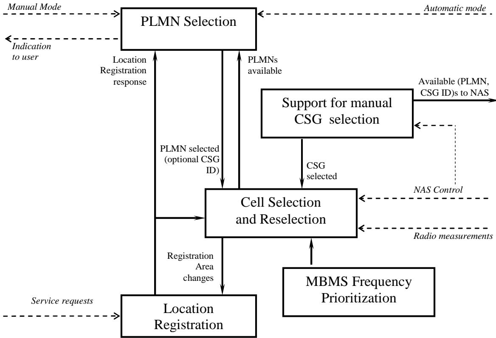  
Figure 4.1-1: Overall Idle Mode process

When a UE is switched on, a public land mobile network (PLMN) is selected by NAS. For the selected PLMN, associated RAT(s) may be set TS 23.122 [5]. The NAS shall provide a list of equivalent PLMNs, if available, that the AS shall use for cell selection and cell reselection.

With the cell selection, the UE searches for a suitable cell of the selected PLMN and chooses that cell to provide available services, further the UE shall tune to its control channel. This choosing is known as "camping on the cell".

For E-UTRA a cell may be associated with more than one CN type (EPC and/or 5GC) and hence the selected cell can be suitable for more than one CN type. The CN type(s) for which the selected cell is suitable are reported to NAS which selects a CN type to be used for camping and for the NAS registration procedure (see below). Note that CN type selection is only applicabe for UE supporting E-UTRA connected to 5GC.

For E-UTRA a cell may be associated with more than one tracking area. The UE reports all the broadcasted tracking area codes in the selected cell to NAS for registration procedure.

The UE shall, if necessary, then register its presence, by means of a NAS registration procedure, in the tracking area of the chosen cell and as outcome of a successful Location Registration the selected PLMN becomes the registered PLMN TS 23.122 [5].

If the UE finds a more suitable cell, according to the cell reselection criteria, it reselects onto that cell and camps on it. Similar to cell selection procedure, if the reselected cell is an E-UTRA cell and the UE supports E-UTRA connected to 5GC, the CN type(s) for which the cell is suitable are reported to NAS which selects one of them. If the new cell does not belong to at least one tracking area to which the UE is registered, location registration is performed. In RRC\_INACTIVE state, if the new cell does not belong to the configured RNA, a RNA update procedure is performed.

If necessary, the UE shall search for higher priority PLMNs at regular time intervals as described in TS 22.011 [4] and search for a suitable cell if another PLMN has been selected by NAS.

Search of available CSGs may be triggered by NAS to support manual CSG selection.

If the UE loses coverage of the registered PLMN, either a new PLMN is selected automatically (automatic mode), or an indication of which PLMNs are available is given to the user, so that a manual selection can be made (manual mode).

Registration is not performed by UEs only capable of services that need no registration.

The UE may perform sidelink communication or V2X sidelink communication or sidelink discovery or NR sidelink communication while in-coverage or out-of-coverage for sidelink, as specified in clause 11.

The purpose of camping on a cell in idle mode is fivefold:

a) It enables the UE to receive system information from the PLMN.

b) When registered and if the UE wishes to establish an RRC connection, it can do this by initially accessing the network on the control channel of the cell on which it is camped.

c) If the PLMN receives a call for the registered UE, it knows (in most cases) the set of tracking areas (in RRC\_IDLE state) or RNAs (in RRC\_INACTIVE state) in which the UE is camped. It can then send a "paging" message for the UE on the control channels of all the cells in this set of tracking areas. The UE will then receive the paging message because it is tuned to the control channel of a cell in one of the registered tracking areas and the UE can respond on that control channel.

d) It enables the UE to receive ETWS and CMAS notifications.

e) It enables the UE to receive MBMS services.

If the UE is unable to find a suitable cell to camp on or if the location registration failed (except for LR rejected with cause #12, cause #14, cause #15 or cause #25, see TS 23.122 [5] and TS 24.301 [16]), it attempts to camp on a cell irrespective of the PLMN identity, and enters a "limited service" state.

When NAS indicates that PSM starts, the AS configuration (e.g. priorities provided by dedicated signalling and logged measurements) is kept, all running timers continue to run but the UE need not perform any idle mode tasks. If a timer expires while the UE is in PSM it is up to UE implementation whether it performs the corresponding action immediately or the latest when PSM ends. When NAS indicates that PSM ends, the UE shall perform all idle mode tasks.

If SystemInformationBlockType32 has been received and if the UE has determined that it is out of coverage using available satellite assistance information (e.g. ephemeris parameters and coverage parameters in current or previously received SystemInformationBlockType32, SystemInformationBlockType31, t-Service in SystemInformationBlockType3 or other parameters), the AS configuration (e.g. priorities provided by dedicated signalling and logged measurements) is kept, but the UE need not perform any idle mode tasks related to NTN. It is up to UE implementation to handle running timers. The detection of out of coverage using satellite assistance information is up to UE implementation and once in NTN coverage the UE shall perform all idle mode tasks related to NTN. If SystemInformationBlockType32 includes carrierFreqList the UE may store and use this information for the cell selection process when UE resumes the idle mode tasks related to NTN once in NTN coverage.

## 4.2 Functional division between AS and NAS in Idle mode

Table 1 presents the functional division between UE non-access stratum (NAS) and UE access stratum (AS) in idle mode. The NAS part is specified in TS 23.122 [5] and the AS part in the present document.

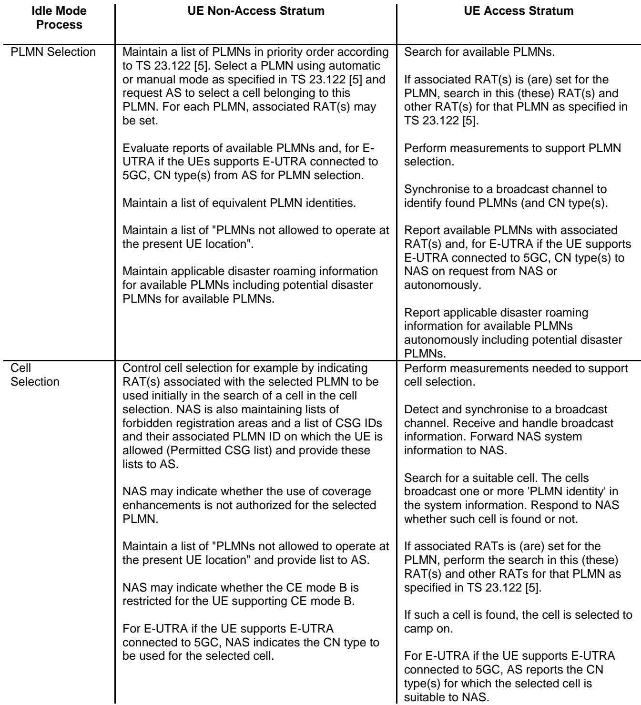

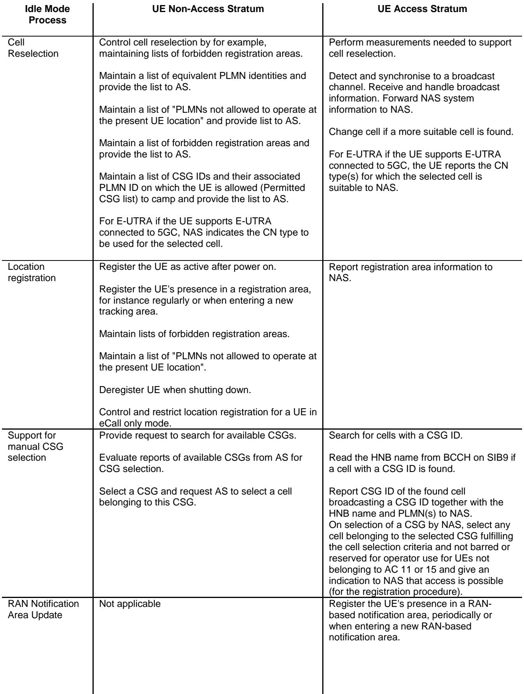  
Table 4.2-1: Functional division between AS and NAS in idle mode

## 4.3 Service types in Idle Mode

This clause defines the level of service that may be provided by the network to a UE in Idle mode.

The action of camping on a cell is necessary to get access to some services. Three levels of services are defined for UE:

Limited service (emergency calls, ETWS and CMAS on an acceptable cell). It is not applicable to RRC\_INACTIVE state.

\- Normal service (for public use on a suitable cell)

Operator service (for operators only on a reserved cell)

Furthermore, the cells are categorised according to which services they offer:

## acceptable cell:

An "acceptable cell" is a cell on which the UE may camp to obtain limited service (originate emergency calls and receive ETWS and CMAS notifications), and it is not applicable to RRC\_INACTIVE state. Such a cell shall fulfil the following requirements, which is the minimum set of requirements to initiate an emergency call and to receive ETWS and CMAS notification in a E-UTRAN network:

The cell is not barred, see clause 5.3.1;

The cell selection criteria are fulfilled, see clause 5.2.3.2;

## suitable cell:

A "suitable cell" is a cell on which the UE may camp on to obtain normal service. The UE shall have a valid USIM and such a cell shall fulfil all the following requirements.

The cell is part of either:

\- the selected PLMN, or:

\- the registered PLMN, or:

\- a PLMN of the Equivalent PLMN list

\- For a CSG cell, the cell is a CSG member cell for the UE;

According to the latest information provided by NAS:

The cell is not barred, see clause 5.3.1;

The cell is part of at least one TA that is not part of the list of "forbidden tracking areas for roaming" TS 22.011 [4], which belongs to a PLMN that fulfils the first bullet above;

\- The cell selection criteria are fulfilled, see clause 5.2.3.2;

Except for NB-IoT, if the UE supports authorization of coverage enhancements and upper layers indicated that use of coverage enhancements is not authorized for the selected PLMN:

\- the cell selection criterion S in normal coverage shall be fulfilled;

\- If the UE supports CE mode B and upper layers indicated that CE mode B is restricted:

the cell selection criterion S in normal coverage based on values Qrxlevmin and Qqualmin or in enhanced coverage based on values Qrxlevmin\_CE and Qqualmin\_CE shall be fulfilled.

If more than one PLMN identity is broadcast in the cell, the cell is considered to be part of all TAs with TAIs constructed from the PLMN identities and the TAC broadcast in the cell.

## barred cell:

A cell is barred if it is so indicated in the system information TS 36.331 [3].

## reserved cell:

A cell is reserved if it is so indicated in system information TS 36.331 [3].

Following exceptions to these definitions are applicable for UEs:

camped on a cell that belongs to a tracking area that is forbidden for regional provision of service; a cell that belongs to a tracking area that is forbidden for regional provision service (TS 23.122 [5], TS 24.301 [16]) is suitable but provides only limited service.

as an outcome of the manual CSG selection procedure the UE is allowed to access an acceptable cell which fulfils the cell selection criteria and is not barred or reserved for operator use for UEs not belonging to AC 11 or 15 and inform NAS that access is possible (for location registration procedure).

NOTE: UE is not required to support manual search and selection of PLMN or CSGs while in RRC CONNECTED state. The UE may use local release of RRC connection to perform manual search if it is not possible to perform the search while RRC connected.

if a UE has an ongoing emergency call, all acceptable cells of that PLMN are treated as suitable for the duration of the emergency call.

if the UE in RRC\_IDLE fulfils the conditions to support sidelink communication or PS related sidelink discovery in limited service state as specified in TS 23.303 [29], clause 4.5.6, the UE may perform sidelink communication or PS-related sidelink discovery.

if the UE in RRC\_IDLE fulfils the conditions to support V2X sidelink communication or NR sidelink communication in limited service state as specified in TS23.285 [36], clause 4.4.8 and TS 23.287 [40], clause, 5.7, the UE may perform V2X sidelink communication or NR sidelink communication.

For E-UTRA the cell categorization defined above is per CN type. In this specification, when the term suitable/acceptable cell is used without specifying the CN type, it means the cell is suitable/acceptable for any of the CN type(s) supported by the UE.

NOTE: The selected CN Type is not considered during cell selection and reselection procedure.

## 4.4 NB-IoT functionality in Idle Mode

This specification is applicable to NB-IoT, except for the following functionality which is not applicable to NB-IoT:

\- Acceptable cell

\- Accessibility measurements

\- Access Control based on ACDC categories

\- Camped on Any cell state

CSG, including support for manual CSG selection and CSG or Hybrid cell related functionality in PLMN selection, or HNB name (SIB9), Cell selection and Cell reselection.

\- Emergency call

\- E-UTRAN Inter-frequency Redistribution procedure

Inter-RAT Cell Selection and Reselection including measurements in other RATs

Logged measurements

\- Mobility History Information

Mobility states of a UE

Priority based reselection

\- Public warning system including CMAS, ETWS, PWS.

\- RAN-assisted WLAN interworking

RRC\_INACTIVE state

Sidelink operation

## 5 Process and procedure descriptions

## 5.1 PLMN selection

In the UE, the AS shall report available PLMNs to the NAS on request from the NAS or autonomously. For E-UTRA, if UE supports E-UTRA connected to 5GC, the AS shall also report CN type associated with the PLMN to NAS.

During PLMN selection, based on the list of PLMN identities in priority order, the particular PLMN may be selected either automatically or manually. Each PLMN in the list of PLMN identities is identified by a 'PLMN identity'. In the system information on the broadcast channel, the UE can receive one or multiple 'PLMN identity' (and, for E-UTRA, the CN type associated with the PLMN) in a given cell. The result of the PLMN selection performed by NAS (see TS 23.122 [5]) is an identifier of the selected PLMN.

## 5.1.1 Void

## 5.1.2 Support for PLMN selection

5.1.2.1 General

On request of the NAS the AS shall perform a search for available PLMNs and report them to NAS.

5.1.2.2 E-UTRA and NB-IoT case

The UE shall scan all RF channels in the E-UTRA bands according to its capabilities to find available PLMNs. On each carrier, the UE shall search for the strongest cell and read its system information, in order to find out which PLMN(s) the cell belongs to. If the UE can read one or several PLMN identities in the strongest cell, each found PLMN (see the PLMN reading in TS 36.331 [3]) shall be reported to the NAS as a high quality PLMN (but without the RSRP value), provided that the following high quality criterion is fulfilled:

1. For an E-UTRAN and NB-IoT cell, the measured RSRP value shall be greater than or equal to -110 dBm.

Found PLMNs that do not satisfy the high quality criterion, but for which the UE has been able to read the PLMN identities are reported to the NAS together with the RSRP value. The quality measure reported by the UE to NAS shall be the same for each PLMN found in one cell.

For each found PLMN, if the UE supports E-UTRA connected to 5GC, the associated CN type(s) shall also be reported to the NAS.

If the cell is barred for connectivity to EPC (as indicated by the cellBarred/cellBarred-CRS flag being set to the value barred, see clause 5.3.1) a UE supporting E-UTRA connected to 5GC shall only report the available 5GC PLMNs to NAS.

The search for PLMNs may be stopped on request of the NAS. The UE may optimise PLMN search by using stored information e.g. carrier frequencies and optionally also information on cell parameters from previously received measurement control information elements.

Once the UE has selected a PLMN, the cell selection procedure shall be performed in order to select a suitable cell of that PLMN to camp on.

If a CSG ID is provided by NAS as part of PLMN selection, the UE shall search for an acceptable or suitable cell belonging to the provided CSG ID to camp on. When the UE is no longer camped on a cell with the provided CSG ID, AS shall inform NAS.

## 5.1.2.3 UTRA case

Support for PLMN selection in UTRA is described in TS 25.304 [8].

## 5.1.2.4 GSM case

Support for PLMN selection in GERAN is described in TS 43.022 [9].

## 5.1.2.5 CDMA2000 case

For CDMA2000 the network determination for HRPD and 1xRTT is described in [17] and [18] respectively.

## 5.1.2.6 NR case

Support for PLMN selection in NR is described in TS 38.304 [38].

## 5.2 Cell selection and reselection

## 5.2.1 Introduction

UE shall perform measurements for cell selection and reselection purposes as specified in TS 36.133 [10].

The NAS can control the RAT(s) in which the cell selection should be performed, for instance by indicating RAT(s) associated with the selected PLMN, and by maintaining a list of forbidden registration area(s) and a list of equivalent PLMNs. The UE shall select a suitable cell based on idle mode measurements and cell selection criteria.

In order to speed up the cell selection process, stored information for several RATs may be available in the UE.

When camped on a cell, the UE shall regularly search for a better cell according to the cell reselection criteria. If a better cell is found, that cell is selected. The change of cell may imply a change of RAT, or if the current and selected cell are both E-UTRA cells, a change of the CN type. Details on performance requirements for cell reselection can be found in TS 36.133 [10].

The NAS is informed if the cell selection and reselection results in changes in the received system information relevant for NAS.

For normal service, the UE shall camp on a suitable cell, tune to that cell's control channel(s) so that the UE can:

Receive system information from the PLMN; and

receive registration area information from the PLMN, e.g., tracking area information; and

receive other AS and NAS Information; and

\- if registered:

\- receive paging and notification messages from the PLMN; and

initiate transfer to connected mode.

## 5.2.2 States and state transitions in Idle Mode

Except for NB-IoT, figure 5.2.2-1 shows the states and state transitions and procedures in RRC\_IDLE. Whenever a new PLMN selection is performed, it causes an exit to number 1.

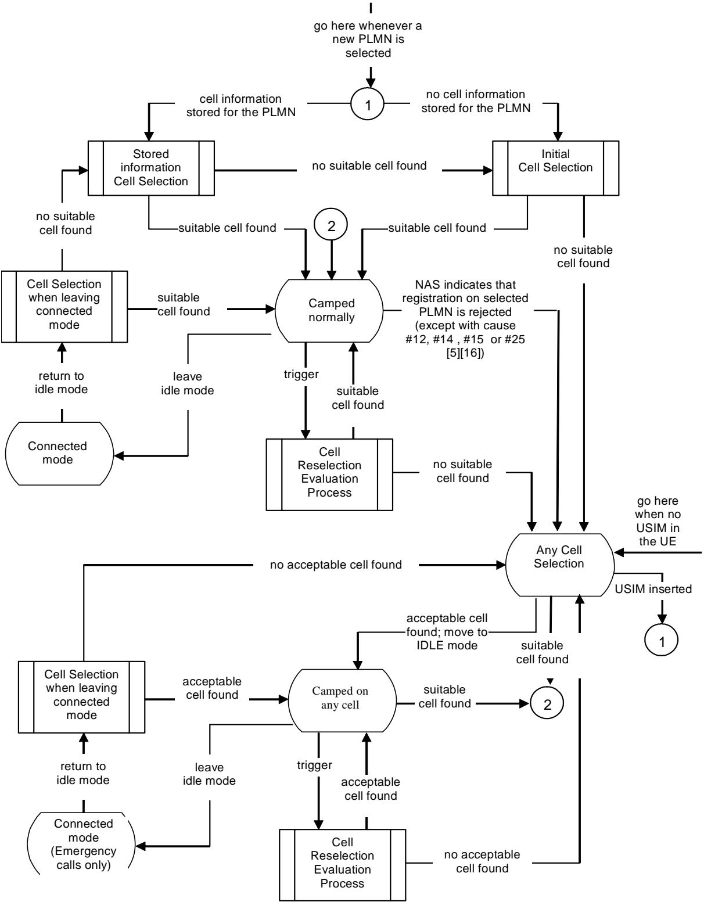  
Figure 5.2.2-1: RRC\_IDLE Cell Selection and Reselection

For NB-IoT, figure 5.2.2-2 shows the states and state transitions and procedures in RRC\_IDLE. Whenever a new PLMN selection is performed, it causes an exit to number 1.

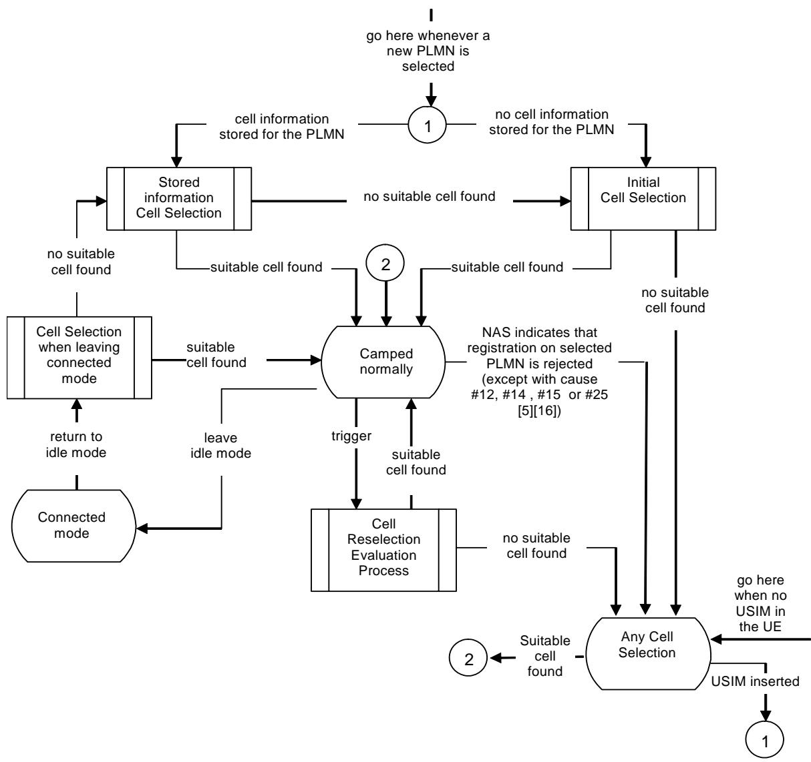  
Figure 5.2.2-2: RRC\_IDLE Cell Selection and Reselection for NB-IoT

## 5.2.3 Cell Selection process

## 5.2.3.1 Description

The UE shall use one of the following two cell selection procedures:

## a) Initial Cell Selection

This procedure requires no prior knowledge of which RF channels are E-UTRA or NB-IoT carriers. The UE shall scan all RF channels in the E-UTRA bands according to its capabilities to find a suitable cell. On each carrier frequency, the UE need only search for the strongest cell. Once a suitable cell is found this cell shall be selected.

## b) Stored Information Cell Selection

This procedure requires stored information of carrier frequencies and optionally also information on cell parameters, from previously received measurement control information elements or from previously detected

cells. Once the UE has found a suitable cell the UE shall select it. If no suitable cell is found the Initial Cell Selection procedure shall be started.

NOTE 1: Priorities between different frequencies or RATs provided to the UE by system information or dedicated signalling are not used in the cell selection process.

NOTE 2: If BL UE, UE in enhanced coverage or NB-IoT UE has been provisioned with EARFCN, the UE may use this information during Initial Cell Selection and Stored Information Cell Selection to find a suitable cell.

## 5.2.3.2 Cell Selection Criterion

For NB-IoT the cell selection criterion is defined in clause 5.2.3.2a.

If the measurements are performed using RSS as specified in [10], the cell selection criterion S in normal coverage is fulfilled when:

Srxlev > 0

Else, the cell selection criterion S in normal coverage is fulfilled when:

Srxlev > 0 AND Squal > 0

where:

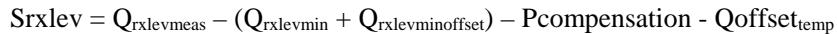

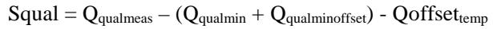

where:

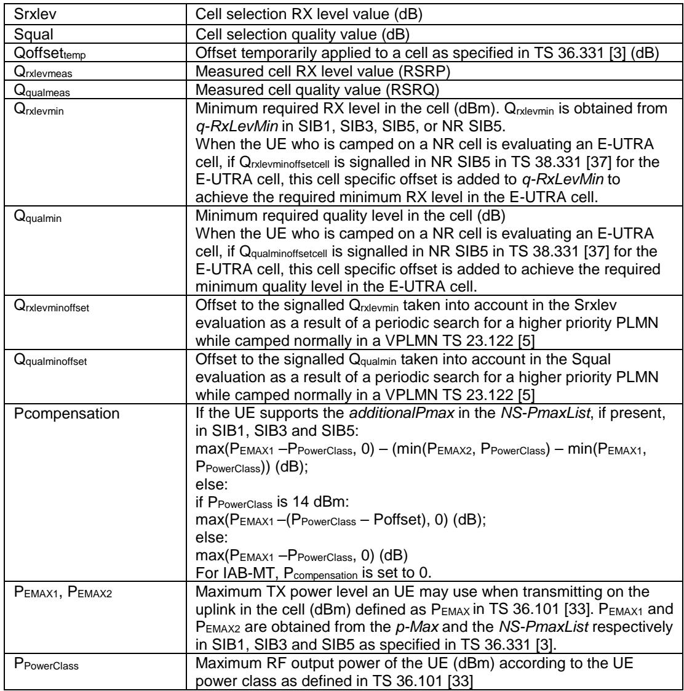

The signalled values Qrxlevminoffset and Qqualminoffset are only applied when a cell is evaluated for cell selection as a result of a periodic search for a higher priority PLMN while camped normally in a VPLMN TS 23.122 [5]. During this periodic search for higher priority PLMN the UE may check the S criteria of a cell using parameter values stored from a different cell of this higher priority PLMN.

If cell selection criterion S in normal coverage is not fulfilled for a cell, UE shall consider itself to be in enhanced coverage if the cell selection criterion S for enhanced coverage is fulfilled, where:

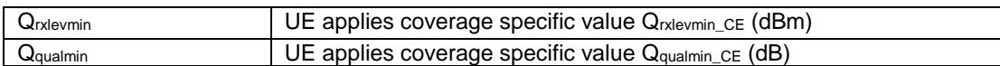

If cell selection criteria S in normal coverage is fulfilled for a cell, UE may consider itself to be in enhanced coverage if SystemInformationBlockType1 cannot be acquired but UE is able to acquire MasterInformationBlock, SystemInformationBlockType1-BR and SystemInformationBlockType2.

If cell selection criterion S in normal coverage is not fulfilled for a cell and UE does not consider itself in enhanced coverage based on coverage specific values Qrxlevmin\_CE and, if the measurements are not performed using RSS as specified in [10], Qqualmin\_CE, UE shall consider itself to be in enhanced coverage if UE supports CE Mode B and CE mode B is not restricted by upper layers and the cell selection criterion S for enhanced coverage is fulfilled, where:

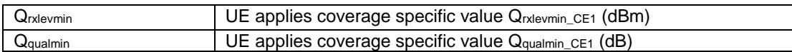

For the UE in enhanced coverage, coverage specific values Qrxlevmin\_CE and Qqualmin\_CE (or Qrxlevmin\_CE1 and Qqualmin\_CE1) are only applied for the suitability check in enhanced coverage (i.e. not used for measurement and reselection thresholds).

## 5.2.3.2a Cell Selection Criterion for NB-IoT

If the measurements are performed on the non-anchor carrier and UE meets the requirements specified in TS 36.133 [10] the cell selection criterion S is fulfilled when:

Srxlev > 0

Else, the cell selection criterion S is fulfilled when:

Srxlev > 0 AND Squal > 0

where:

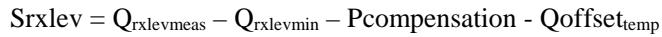

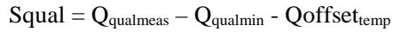

where:

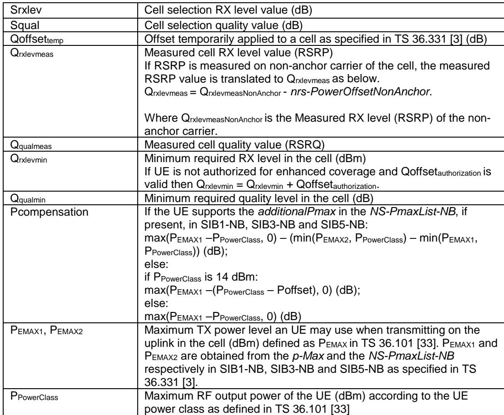

## 5.2.3.3 CSG cells and Hybrid cells in Cell Selection

In addition to normal cell selection rules a manual selection of CSGs shall be supported by the UE upon request from higher layers as defined in clause 5.5.

## 5.2.3.4 GSM case in Cell Selection

The cell selection criteria and procedures in GSM are specified in TS 43.022 [9].

## 5.2.3.5 UTRAN case in Cell Selection

The cell selection criteria and procedures in UTRAN are specified in TS 25.304 [8].

## 5.2.3.6 NR case in Cell Selection

The cell selection criteria and procedures in NR are specified in TS 38.304 [38].

## 5.2.4 Cell Reselection evaluation process

## 5.2.4.1 Reselection priorities handling

Absolute priorities of different E-UTRAN frequencies or inter-RAT frequencies may be provided to the UE in the system information, in the RRCConnectionRelease or RRCEarlyDataComplete message, or by inheriting from another RAT at inter-RAT cell (re)selection. In the case of system information, an E-UTRAN frequency or inter-RAT frequency may be listed without providing a priority (i.e. the field cellReselectionPriority is absent for that frequency). If priorities are provided in dedicated signalling, the UE shall ignore all the priorities provided in system information. If UE is in camped on any cell state, UE shall only apply the priorities (i.e. cellReselectionPriority and/or cellReselectionSubPriority) provided by system information from current cell, and the UE preserves priorities provided by dedicated signalling, deprioritisationReq received in RRCConnectionReject and altFreqPriorities provided by dedicated signalling unless specified otherwise. When the UE in camped normally state, has only dedicated priorities other than for the current frequency, the UE shall consider the current frequency to be the lowest priority frequency (i.e. lower than any of the network configured values). While the UE is camped on a suitable CSG cell in normal coverage, the UE shall always consider the current frequency to be the highest priority frequency (i.e. higher than any of the network configured values), irrespective of any other priority value allocated to this frequency. When the HSDN capable UE is in High-mobility state, the UE shall always consider the HSDN cells to be the highest priority (i.e. higher than any other network configured priorities). When the HSDN capable UE is not in High-mobility state, the UE shall always consider HSDN cells to be the lowest priority (i.e. lower than network configured priorities). If the UE capable of sidelink communication is configured to perform sidelink communication and can only perform the sidelink communication while camping on a frequency, the UE may consider that frequency to be the highest priority. If the UE capable of V2X sidelink communication is configured to perform V2X sidelink communication and can only perform the V2X sidelink communication while camping on a frequency, the UE may consider that frequency to be the highest priority. If the UE capable of V2X sidelink communication is configured to perform V2X sidelink communication and can only use pre-configuration while not camping on a frequency, the UE may consider the frequency providing intercarrier V2X sidelink configuration to be the highest priority. If the UE is configured to perform both V2X sidelink communication and NR sidelink communication, the UE may consider the frequency providing both V2X sidelink communication and NR sidelink communication configuration to be the highest priority.If the UE is configured to perform V2X sidelink communication and not perform NR sidelink communication, the UE may consider the frequency providing V2X sidelink communication configuration to be the highest priority. If the UE is configured to perform NR sidelink communication and not perform V2X sidelink communication, the UE may consider the frequency providing NR sidelink communication configuration to be the highest priority. If the UE capable of sidelink discovery is configured to perform Public Safety related sidelink discovery and can only perform the Public Safety related sidelink discovery while camping on a frequency, the UE may consider that frequency to be the highest priority. A UE on a vehicle with an NR mobile-IAB cell detected may consider the inter-RAT frequency for which an NR mobile-IAB cell is the best cell to be the highest priority. The UE identifies an NR mobile-IAB cell by mobileIAB-Cell in SIB1 (see TS 38.331 [37]). The UE may narrow its search scope for NR mobile-IAB cell(s) by mobileIAB-CellList if broadcasted in SystemInformationBlockType24 (see TS 36.331 [3]). A non-mobile-IAB cell may be excluded from this mobile IAB frequency prioritization for up to 300 seconds.

NOTE 1: The prioritization among the frequencies which UE considers to be the highest priority frequency is left to UE implementation.

NOTE 1a: The frequency only providing the anchor frequency configuration should not be prioritized for V2X service during cell reselection as specified in TS 36.331[3].

NOTE 1b: When UE is configured to perform NR sidelink communication or V2X sidelink communication performs cell reselection, it may consider the frequencies providing the intra-carrier and inter-carrier configuration have equal priority in cell reselection.

NOTE 1c: The UE is configured to perform V2X sidelink communication or NR sidelink communication, if it has the capability and is authorized for the corresponding sidelink operation.

NOTE 1d: When UE is configured to perform both NR sidelink communication and V2X sidelink communication, but cannot find a frequency which can provide both NR sidelink communication configuration and V2X sidelink communication configuration, UE may consider the frequency providing either NR sidelink communication configuration or V2X sidelink communication configuration to be the highest priority.

NOTE 1e: How the UE determines itself to be on a vehicle with an NR mobile-IAB cell is left to UE implementation.

If the UE is capable either of MBMS Service Continuity or of SC-PTM reception and is receiving or interested to receive an MBMS service and can only receive this MBMS service while camping on a frequency on which it is provided, the UE may consider that frequency to be the highest priority during the MBMS session TS 36.300 [2] as long as the two following conditions are fulfilled:

1) Either:

\- the UE is capable of MBMS service continuity and the reselected cell is broadcasting SIB13; or

\- the UE is capable of SC-PTM reception and the reselected cell is broadcasting SIB20;

2) Either:

SIB15 of the serving cell indicates for that frequency one or more MBMS SAIs included and associated with that frequency in the MBMS User Service Description (USD) TS 26.346 [22] of this service; or

\- SIB15 is not broadcast in the serving cell and that frequency is included in the USD of this service.

If the UE is capable either of MBMS Service Continuity or of SC-PTM reception and is receiving or interested to receive an MBMS service provided on a downlink only MBMS frequency, on a frequency used by dedicated MBMS cells, on a frequency used by FeMBMS/Unicast-mixed cells as defined in TS 36.300 [2], or on a frequency belonging to PLMN different from its registered PLMN, the UE may consider cell reselection candidate frequencies at which it can not receive the MBMS service to be of the lowest priority during the MBMS session TS 36.300 [2], as long as the above mentioned condition 1) is fulfilled for the cell on the MBMS frequency which the UE monitors or this cell broadcasts SIB1-MBMS and as long as the above mentioned condition 2) is fulfilled for the serving cell.

NOTE 2: Example scenarios in which the previous down-prioritisation may be needed concerns the cases where camping is not possible, while the UE can only receive this MBMS frequency when camping on a subset of cell reselection candidate frequencies, e.g. the MBMS frequency is a downlink only carrier, the MBMS frequency is used by dedicated MBMS cells, the MBMS frequency is used by FeMBMS/Unicast-mixed cells TS 36.300 [2], or the MBMS frequency belongs to a PLMN different from UE's registered PLMN.

If the UE is not capable of MBMS Service Continuity but has knowledge on which frequency an MBMS service of interest is provided, it may consider that frequency to be the highest priority during the MBMS session TS 36.300 [2] as long as the reselected cell is broadcasting SIB13.

If the UE is not capable of MBMS Service Continuity but has knowledge on which downlink only frequency, on which frequency used by dedicated MBMS cells, on which frequency used by FeMBMS/Unicast-mixed cells as defined in TS 36.300 [2] or on which frequency belonging to PLMN different from its registered PLMN an MBMS service of interest is provided, it may consider cell reselection candidate frequencies at which it can not receive the MBMS service to be of the lowest priority during the MBMS session TS 36.300 [2] as long as the cell on the MBMS frequency which the UE monitors is broadcasting SIB13 or SIB1-MBMS.

NOTE 3: The UE considers that the MBMS session is ongoing using the session start and end times as provided by upper layers in the USD i.e. the UE does not verify if the session is indicated on MCCH.

In case UE receives RRCConnectionReject with deprioritisationReq, UE shall consider current carrier frequency and stored frequencies due to the previously received RRCConnectionReject with deprioritisationReq or all the frequencies of EUTRA to be the lowest priority frequency (i.e. lower than any of the network configured values) while T325 is running irrespective of camped RAT. The UE shall delete the stored deprioritisation request(s) when a PLMN selection is performed on request by NAS TS 23.122 [5].

NOTE 4: Connecting to CDMA2000 does not imply PLMN selection.

NOTE 5: UE should search for a higher priority layer for cell reselection as soon as possible after the change of priority. The minimum related performance requirements specified in TS 36.133 [10] are still applicable.

The UE shall delete priorities or altFreqPriorities provided by dedicated signalling when:

the UE enters a different RRC state; or

\- the optional validity time of dedicated priorities (T320) expires; or

\- the optional validity time of altFreqPriorities (T323) expires; or

\- a PLMN selection is performed on request by NAS TS 23.122 [5].

NOTE 6: Equal priorities between RATs are not supported.

The UE shall only perform cell reselection evaluation for E-UTRAN frequencies and inter-RAT frequencies that are given in system information and for which the UE has a priority provided.

In case the UE received RRCConnectionRelease with altFreqPriorities, for E-UTRAN frequencies, the UE shall apply the alternative cell reselection priorities broadcast via altCellReselectionPriority and altCellReselectionSubPriority in the system information instead of priorities broadcast via cellReselectionPriority and cellReselectionSubPriority. If the UE received RRCConnectionRelease with altFreqPriorities and the alternative cell reselection priorities are not broadcast via altCellReselectionPriority and altCellReselectionSubPriority in the system information, for E-UTRAN frequencies, the UE shall apply the cell reselection priority information broadcast in the system information via cellReselectionPriority and cellReselectionSubPriority. When altFreqPriorities is discarded or deleted, the UE shall apply the cell reselection priority information broadcast in the system information via cellReselectionPriority and cellReselectionSubPriority.

The UE shall not consider any exclude-listed cells as candidate for cell reselection.

For cell reselection to NR operating with shared spectrum channel access, the UE shall consider only the allow-listed cells, if configured in SIB24, as candidates for cell reselection.

The UE shall inherit the priorities provided by dedicated signalling and the remaining validity time (i.e., T320 in E-UTRA and NR, T322 in UTRA and T3230 in GERAN), if configured, at inter-RAT cell (re)selection. The UE shall delete altFreqPriorities provided by dedicated signalling, if configured, at inter-RAT cell (re)selection.

NOTE 7: The network may assign dedicated cell reselection priorities for frequencies not configured by system information.

While T360 is running, redistribution target is considered to be the highest priority (i.e. higher than any of the network configured values). UE shall continue to consider the serving frequency as the highest priority until completion of E-UTRAN Inter-frequency Redistribution procedure specified in 5.2.4.10 if triggered on T360 expiry/ stop.

## 5.2.4.2 Measurement rules for cell re-selection

For NB-IoT measurement rules for cell re-selection is defined in clause 5.2.4.2.a.

When evaluating Srxlev and Squal of non-serving cells for reselection purposes, the UE shall use parameters provided by the serving cell.

Following rules are used by the UE to limit needed measurements:

\- If the measurements are performed using RSS as specified in [10] and the serving cell fulfils Srxlev > SIntraSearchP:

If distanceThresh and referenceLocation are broadcast in SystemInformationBlockType31, and if the UE has obtained its location information:

If referenceLocation is set to fixedReferenceLocation and if the UE supports location-based measurement initiation for fixed cell, referenceLocation is used as serving cell reference location. If the distance between the UE and the serving cell reference location is shorter than distanceThresh, the UE may choose not to perform intra-frequency measurements. Else, the UE shall perform intra-frequency measurements.

If referenceLocation is set to movingReferenceLocation and if the UE supports location-based measurement initiation for moving cell, the UE derives the serving cell reference location based on ephemeris, epochTime and referenceLocation. If the distance between the UE and the serving cell reference location is shorter than distanceThresh, the UE may choose not to perform intra-frequency measurements. Else, the UE shall perform intra-frequency measurements.

\- Else, the UE may choose not to perform intra-frequency measurements.

\- Else, the UE may choose not to perform intra-frequency measurements.

\- Else if the serving cell fulfils Srxlev > SIntraSearchP and Squal > SIntraSearchQ:

\- If distanceThresh and referenceLocation are broadcast in SystemInformationBlockType31, and if the UE has obtained its location information:

If referenceLocation is set to fixedReferenceLocation and if the UE supports location-based measurement initiation for fixed cell, the referenceLocation is used as serving cell reference location. If the distance between the UE and the serving cell reference location, the UE may choose not to perform intrafrequency measurements. Else, the UE shall perform intra-frequency measurements.

If referenceLocation is set to movingReferenceLocation and if the UE supports location-based measurement initiation for moving cell, the UE derives the serving cell reference location based on ephemeris, epochTime and referenceLocation. If the distance between the UE and the serving cell reference location is shorter than distanceThresh, the UE may choose not to perform intra-frequency measurements. Else, the UE shall perform intra-frequency measurements.

\- Else, the UE may choose not to perform intra-frequency measurements.

\- Else, the UE may choose not to perform intra-frequency measurements.

Otherwise, the UE shall perform intra-frequency measurements.

The UE shall apply the following rules for E-UTRAN inter-frequencies and inter-RAT frequencies which are indicated in system information and for which the UE has priority provided as defined in 5.2.4.1:

For an E-UTRAN inter-frequency or inter-RAT frequency with a reselection priority higher than the reselection priority of the current E-UTRA frequency the UE shall perform measurements of higher priority E-UTRAN inter-frequency or inter-RAT frequencies according to TS 36.133 [10].

For an E-UTRAN inter-frequency with an equal or lower reselection priority than the reselection priority of the current E-UTRA frequency and for inter-RAT frequency with lower reselection priority than the reselection priority of the current E-UTRAN frequency:

\- If the measurements are performed using RSS as specified in [10] and the serving cell fulfils Srxlev > SnonIntraSearchP:

If distanceThresh and referenceLocation are broadcast in SystemInformationBlockType31, and if the UE has obtained its location:

If referenceLocation is set to fixedReferenceLocation and if the UE supports location-based measurement initiation for fixed cell, the referenceLocation is used as serving cell reference location. The referenceLocation is used as serving cell reference location. If the distance between the UE and serving cell reference location is shorter than distanceThresh the UE may choose not to perform measurements of E-UTRAN inter-frequencies or inter-RAT frequency cells of equal or lower priority unless the UE is triggered to measure an E-UTRAN inter-frequency which is configured with redistributionInterFreqInfo. Else, the UE shall perform measurements of E-UTRAN inter-frequencies or inter-RAT frequency cells of equal or lower priority according to TS 36.133 [10].

If referenceLocation is set to movingReferenceLocation and if the UE supports location-based measurement initiation for moving cell, the UE derives the serving cell reference location based on ephemeris, epochTime and referenceLocation. If the distance between the UE and serving cell reference location is shorter than distanceThresh the UE may choose not to perform measurements of E-UTRAN inter-frequencies or inter-RAT frequency cells of equal or lower priority unless the UE is triggered to measure an E-UTRAN inter-frequency which is configured with redistributionInterFreqInfo. Else, the UE shall perform measurements of E-UTRAN interfrequencies or inter-RAT frequency cells of equal or lower priority according to TS 36.133 [10].

Else, the UE may choose not to perform measurements of E-UTRAN inter-frequencies or inter-RAT frequency cells of equal or lower priority unless the UE is triggered to measure an E-UTRAN inter-frequency which is configured with redistributionInterFreqInfo.

Else, the UE may choose not to perform measurements of E-UTRAN inter-frequencies or inter-RAT frequency cells of equal or lower priority unless the UE is triggered to measure an E-UTRAN interfrequency which is configured with redistributionInterFreqInfo.

\- Else if the serving cell fulfils Srxlev > SnonIntraSearchP and Squal > SnonIntraSearchQ:

If distanceThresh and referenceLocation are broadcast in SystemInformationBlockType31, and if the UE supports location-based measurement initiation and has obtained its location:

If referenceLocation is set to fixedReferenceLocation and UE supports location-based measurement initiation for fixed cell, the referenceLocation is used as serving cell reference location. If the distance between the UE and serving cell reference location is shorter than distanceThresh, the UE may choose not to perform measurements of E-UTRAN inter-frequencies or inter-RAT frequency cells of equal or lower priority unless the UE is triggered to measure an E-UTRAN inter-frequency which is configured with redistributionInterFreqInfo. Else, the UE shall perform measurements of E-UTRAN inter-frequencies or inter-RAT frequency cells of equal or lower priority according to TS 36.133 [10].

If referenceLocation is set to movingReferenceLocation and UE supports location-based measurement initiation for moving cell, the UE derives the serving cell reference location based on ephemeris, epochTime and referenceLocation. If the distance between the UE and serving cell reference location is shorter than distanceThresh, the UE may choose not to perform measurements of E-UTRAN inter-frequencies or inter-RAT frequency cells of equal or lower priority unless the UE is triggered to measure an E-UTRAN inter-frequency which is configured with redistributionInterFreqInfo. Else, the UE shall perform measurements of E-UTRAN interfrequencies or inter-RAT frequency cells of equal or lower priority according to TS 36.133 [10].

Else, the UE may choose not to perform measurements of E-UTRAN inter-frequencies or inter-RAT frequency cells of equal or lower priority unless the UE is triggered to measure an E-UTRAN inter-frequency which is configured with redistributionInterFreqInfo.

Else, the UE may choose not to perform measurements of E-UTRAN inter-frequencies or inter-RAT frequency cells of equal or lower priority unless the UE is triggered to measure an E-UTRAN interfrequency which is configured with redistributionInterFreqInfo.

Otherwise, the UE shall perform measurements of E-UTRAN inter-frequencies or inter-RAT frequency cells of equal or lower priority according to TS 36.133 [10].

\- If the UE supports relaxed monitoring and s-SearchDeltaP is present in SystemInformationBlockType3, the UE may further limit the needed measurements, as specified in clause 5.2.4.12.

If t-Service is present in SystemInformationBlockType3 of the serving cell, UE shall perform intra-frequency, interfrequency or inter-RAT measurements, before the time t-Service regardless whether the serving cell fulfils Srxlev > SIntraSearchP and Squal > SIntraSearchQ, or Srxlev > SnonIntraSearchP and Squal > SnonIntraSearchQ. The exact time to start measurements before t-Service is up to UE implementation and t-ServiceStartNeigh if present in

## 5.2.4.2a Measurement rules for cell re-selection for NB-IoT

When evaluating Srxlev and Squal of non-serving cells for reselection purposes, the UE shall use parameters provided by the serving cell.

Following rules are used by the UE to limit needed measurements:

\- If the serving cell fulfils Srxlev > SIntraSearchP:

\- If distanceThresh and referenceLocation are broadcast in SystemInformationBlock31-NB, and if the UE has obtained its location:

If referenceLocation is set to fixedReferenceLocation and the UE supports location-based measurement initiation for fixed cell, the referenceLocation is used as serving cell reference location. If the distance between UE and serving cell reference location is shorter than distanceThresh, the UE may choose not to perform intra-frequency measurements. Else, the UE shall perform intra-frequency measurements.

If referenceLocation is set to movingReferenceLocation and the UE supports location-based measurement initiation for moving cell the UE derives the serving cell reference location based on ephemeris, epochTime and referenceLocation. If the distance between UE and serving cell reference location is shorter than distanceThresh, the UE may choose not to perform intra-frequency measurements. Else, the UE shall perform intra-frequency measurements.- Else, the UE may choose not to perform intrafrequency measurements.

\- Else, the UE may choose not to perform intra-frequency measurements.

Otherwise, the UE shall perform intra-frequency measurements.

\- The UE shall apply the following rules for NB-IoT inter-frequencies which are indicated in system information:

\- If the serving cell fulfils Srxlev > SnonIntraSearchP:

If distanceThresh and referenceLocation are broadcast in SystemInformationBlock31-NB, and if the UE supports location-based measurement initiation and has obtained its location:

If referenceLocation is set to fixedReferenceLocation and the UE supports location-based measurement initiation for fixed cell, the referenceLocation is used as serving cell reference location. If the distance between UE and serving cell location is shorter than distanceThresh, the UE may choose not to perform inter-frequency measurements. Else, the UE shall perform inter-frequency measurements.

If referenceLocation is set to movingReferenceLocation and the UE supports location-based measurement initiation for moving cell the UE derives the serving cell reference location based on ephemeris, epochTime and referenceLocation. If the distance between the UE and serving cell reference location is shorter than distanceThresh, the UE may choose not to perform inter-frequency measurements. Else, the UE shall perform inter-frequency measurements.

\- Else, the UE may choose not to perform intra-frequency measurements.

\- Else, the UE may choose not to perform inter-frequency measurements.

Otherwise, the UE shall perform inter-frequency measurements.

If the UE supports relaxed monitoring and s-SearchDeltaP is present in SystemInformationBlockType3-NB, the UE may further limit the needed measurements, as specified in clause 5.2.4.12.

If t-Service is present in SystemInformationBlockType3-NB of the serving cell, UE shall perform intra-frequency or inter-frequency measurements before the time t-Service regardless whether the serving cell fulfils Srxlev > SIntraSearchP or Srxlev > SnonIntraSearchP. The exact time to start measurements before t-Service is up to UE implementation and t-ServiceStartNeigh if present in SystemInformationBlockType33-NB may be used to decide on when to start measurements.

## 5.2.4.3 Mobility states of a UE

Besides Normal-mobility state a High-mobility and a Medium-mobility state are applicable if the parameters (TCRmax, NCR\_H, NCR\_M, TCRmaxHyst and cellEquivalentSize) are sent in the system information broadcast of the serving cell.

## State detection criteria:

Medium-mobility state criteria:

\- If number of cell reselections during time period TCRmax exceeds NCR\_M and not exceeds NCR\_H High-mobility state criteria:

\- If number of cell reselections during time period TCRmax exceeds NCR\_H

The UE shall not count consecutive reselections between same two cells into mobility state detection criteria if same cell is reselected just after one other reselection. If the UE is capable of HSDN and the cellEquivalentSize is configured, the UE counts the number of cell reselections for this cell as cellEquivalentSize configured for this cell.

## State transitions:

The UE shall:

\- if the criteria for High-mobility state is detected:

enter High-mobility state.

\- else if the criteria for Medium-mobility state is detected:

enter Medium-mobility state.

\- else if criteria for either Medium- or High-mobility state is not detected during time period TCRmaxHyst:

enter Normal-mobility state.

If the UE is in High- or Medium-mobility state, the UE shall apply the speed dependent scaling rules as defined in clause 5.2.4.3.1.

## 5.2.4.3.1 Scaling rules

UE shall apply the following scaling rules:

\- If neither Medium- nor Highmobility state is detected:

\- no scaling is applied.

\- If High-mobility state is detected:

\- Add the sf-High of "Speed dependent ScalingFactor for Qhyst" to Qhyst if sent on system information

For E-UTRAN cells multiply TreselectionEUTRA by the sf-High of "Speed dependent ScalingFactor for TreselectionEUTRA" if sent on system information

For UTRAN cells multiply TreselectionUTRA by the sf-High of "Speed dependent ScalingFactor for TreselectionUTRA" if sent on system information

For GERAN cells multiply TreselectionGERA by the sf-High of "Speed dependent ScalingFactor for TreselectionGERA state" if sent on system information

For CDMA2000 HRPD cells Multiply TreselectionCDMA\_HRPD by the sf-High of "Speed dependent ScalingFactor for TreselectionCDMA\_HRPD" if sent on system information

For CDMA2000 1xRTT cells Multiply TreselectionCDMA\_1xRTT by the sf-High of "Speed dependent ScalingFactor for TreselectionCDMA\_1xRTT" if sent on system information

For NR cells multiply TreselectionNR by the sf-High of "Speed dependent ScalingFactor for TreselectionNR" if sent on system information

## - If Medium-mobility state is detected:

\- Add the sf-Medium of "Speed dependent ScalingFactor for Qhyst" to Qhyst if sent on system information

For E-UTRAN cells multiply TreselectionEUTRA by the sf-Medium of "Speed dependent ScalingFactor for TreselectionEUTRA" if sent on system information

For UTRAN cells multiply TreselectionUTRA by the sf-Medium of "Speed dependent ScalingFactor for TreselectionUTRA" if sent on system information

For GERAN cells multiply TreselectionGERA by the sf-Medium of "Speed dependent ScalingFactor for TreselectionGERA" if sent on system information

For CDMA2000 HRPD cells Multiply TreselectionCDMA\_HRPD by the sf-Medium of "Speed dependent ScalingFactor for TreselectionCDMA\_HRPD" if sent on system information

For CDMA2000 1xRTT cells Multiply TreselectionCDMA\_1xRTT by the sf-Medium of "Speed dependent ScalingFactor for TreselectionCDMA\_1xRTT" if sent on system information

For NR cells multiply TreselectionNR by the sf-Medium of "Speed dependent ScalingFactor for TreselectionNR" if sent on system information

In case scaling is applied to any TreselectionRAT parameter the UE shall round up the result after all scalings to the nearest second.

## 5.2.4.4 Cells with cell reservations, access restrictions or unsuitable for normal camping

For the highest ranked cell (including serving cell) according to cell reselection criteria specified in clause 5.2.4.6, for the best cell according to absolute priority reselection criteria specified in clause 5.2.4.5, the UE shall check if the access is restricted according to the rules in clause 5.3.1.

If that cell and other cells have to be excluded from the candidate list, as stated in clause 5.3.1, the UE shall not consider these as candidates for cell reselection. This limitation shall be removed when the highest ranked cell changes.

If the highest ranked cell or best cell according to absolute priority reselection rules is an intra-frequency or interfrequency cell which is not suitable for a CN type due to being part of the "list of forbidden TAs for roaming" or belonging to a PLMN which is not indicated as being equivalent to the registered PLMN, the UE shall not consider this cell and other cells on the same frequency, as candidates for reselection for the CN type for a maximum of 300s. If the UE enters into state any cell selection, any limitation shall be removed. If the UE is redirected under E-UTRAN control to a frequency for which the timer is running, any limitation on that frequency shall be removed.

If the highest ranked cell or best cell according to absolute priority reselection rules is an inter-RAT cell which is not suitable due to being part of the "list of forbidden TAs for roaming" or belonging to a PLMN which is not indicated as being equivalent to the registered PLMN, the UE shall not consider this cell and other cells on the same frequency as candidates for reselection for a maximum of 300s. In case of UTRA further requirements are defined in the TS 25.304 [8]. In case of NR further requirements are defined in the TS 38.304 [38]. If the UE enters into state any cell selection, any limitation shall be removed. If the UE is redirected under E-UTRAN control to a frequency for which the timer is running, any limitation on that frequency shall be removed.

If the highest ranked cell or best cell according to absolute priority reselection rules is a CSG cell which is not suitable due to not being a CSG member cell, the UE shall not consider this cell as candidate for cell reselection but shall continue considering other cells on the same frequency for cell reselection.

## 5.2.4.5 E-UTRAN Inter-frequency and inter-RAT Cell Reselection criteria

For NB-IoT inter-frequency cell reselection shall be based on ranking as defined in clause 5.2.4.6.

If threshServingLowQ is provided in SystemInformationBlockType3 and more than 1 second has elapsed since the UE camped on the current serving cell and if the measurements are not performed using RSS as specified in [10], cell reselection to a cell on a higher priority E-UTRAN frequency or inter-RAT frequency than the serving frequency shall be performed if:

\- A cell of a higher priority EUTRAN, NR or UTRAN FDD RAT/ frequency fulfils Squal > ThreshX, HighQ during a time interval TreselectionRAT; or

A cell of a higher priority UTRAN TDD, GERAN or CDMA2000 RAT/ frequency fulfils Srxlev > ThreshX, HighP during a time interval TreselectionRAT.

Otherwise, cell reselection to a cell on a higher priority E-UTRAN frequency or inter-RAT frequency than the serving frequency shall be performed if:

\- A cell of a higher priority RAT/ frequency fulfils Srxlev > ThreshX, HighP during a time interval TreselectionRAT; and

More than 1 second has elapsed since the UE camped on the current serving cell.

Cell reselection to a cell on an equal priority E-UTRAN frequency shall be based on ranking for Intra-frequency cell reselection as defined in clause 5.2.4.6.

If threshServingLowQ is provided in SystemInformationBlockType3 and more than 1 second has elapsed since the UE camped on the current serving cell and if the measurements are not performed using RSS as specified in [10], cell reselection to a cell on a lower priority E-UTRAN frequency or inter-RAT frequency than the serving frequency shall be performed if:

The serving cell fulfils Squal < ThreshServing, LowQ and a cell of a lower priority EUTRAN, NR or UTRAN FDD RAT/ frequency fulfils Squal > ThreshX, LowQ during a time interval TreselectionRAT; or

The serving cell fulfils Squal < ThreshServing, LowQ and a cell of a lower priority UTRAN TDD, GERAN or CDMA2000 RAT/ frequency fulfils Srxlev > ThreshX, LowP during a time interval TreselectionRAT.

Otherwise, cell reselection to a cell on a lower priority E-UTRAN frequency or inter-RAT frequency than the serving frequency shall be performed if:

The serving cell fulfils Srxlev < ThreshServing, LowP and a cell of a lower priority RAT/ frequency fulfils Srxlev > ThreshX, LowP during a time interval TreselectionRAT; and

More than 1 second has elapsed since the UE camped on the current serving cell.

Cell reselection to a higher priority RAT/ frequency shall take precedence over a lower priority RAT/ frequency, if multiple cells of different priorities fulfil the cell reselection criteria.

If the UE supports the protection against improper reselection to GERAN/UTRAN then:

When the UE evaluates serving cell conditions for the purpose of cell reselection to GERAN/UTRAN FDD/TDD by applying the reselection priorities provided in AS security protected dedicated signalling with a GERAN/UTRAN FDD/TDD frequency as lower priority compared to the current E-UTRAN frequency, or when the UE applies GERAN/UTRAN FDD/TDD priorities provided in system information, the UE shall:

treat GERAN and/or UTRAN FDD and/or UTRAN TDD frequencies as the lower priority compared to E-UTRAN;

\- set the value of ThreshServing, LowP to 6 dB if the value received in the system information is higher than 6 dB;

\- set the value of Q-RxLevMin to -116 dBm if the value received in SIB1 is higher than -116 dBm;

set the values of Pcompensation and Qoffsettemp to 0.

The UE shall not perform cell reselection to NR or UTRAN FDD cells for which the cell selection criterion S is not fulfilled.

For cdma2000 RATs, Srxlev is equal to -FLOOR(-2 x 10 x log10 Ec/Io) in units of 0.5 dB, as defined in [18], with Ec/Io referring to the value measured from the evaluated cell.

For cdma2000 RATs, ThreshX, HighP and ThreshX, LowP are equal to -1 times the values signalled for the corresponding parameters in the system information.

In all the above criteria the value of TreselectionRAT is scaled when the UE is in the medium or high mobility state as defined in clause 5.2.4.3.1. If more than one cell meets the above criteria, the UE shall reselect a cell as follows:

If the highest-priority frequency is an E-UTRAN frequency, a cell ranked as the best cell among the cells on the highest priority frequency(ies) meeting the criteria according to clause 5.2.4.6;

If the highest-priority frequency is from another RAT, a cell ranked as the best cell among the cells on the highest priority frequency(ies) meeting the criteria of that RAT.

Cell reselection to another RAT, for which Squal based cell reselection parameters are broadcast in system information, shall be performed based on the Squal criteria if the UE supports Squal (RSRQ) based cell reselection to E-UTRAN from all the other RATs provided by system information which UE supports. Otherwise, cell reselection to another RAT shall be performed based on Srxlev criteria.

Cell reselection to NR, for which a cell reselection parameter, q-RxLevMinSUL is broadcast in system information and the UE supports SUL, shall be performed based on Srxlev criteria taking the parameter into account.

## 5.2.4.6 Intra-frequency and equal priority inter-frequency Cell Reselection criteria The cell-ranking criterion Rs for serving cell and Rn for neighbouring cells is defined by:

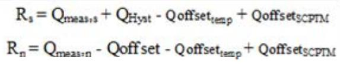

where:

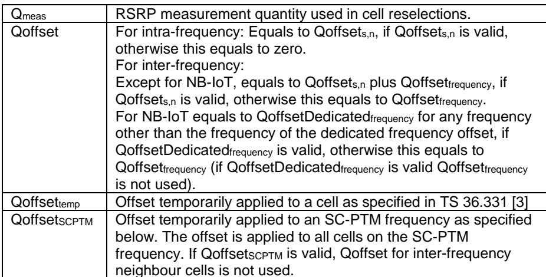

If the NB-IoT UE or UE in enhanced coverage is capable of SC-PTM reception and is receiving or interested to receive an MBMS service and can only receive this MBMS service while camping on a frequency on which it is provided (SC-PTM frequency), the UE considers QoffsetSCPTM to be valid during the MBMS session TS 36.300 [2] as long as the following condition is fulfilled:

Either:

SIB15 (or SIB15-NB) of the serving cell indicates for that frequency one or more MBMS SAIs included in the MBMS User Service Description (USD) TS 26.346 [22] of this service; or

\- SIB15 (or SIB15-NB) is not broadcast in the serving cell and that frequency is included in the USD of this service.

NOTE: UE should search for a higher ranked cell on another frequency for cell reselection as soon as possible after the UE stops using QoffsetSCPTM.

The UE shall perform ranking of all cells that fulfil the cell selection criterion S, which is defined in 5.2.3.2 (5.2.3.2a for NB-IoT), but may exclude all CSG cells that are known by the UE not to be CSG member cells.

The cells shall be ranked according to the R criteria specified above, deriving Qmeas,n and Qmeas,s and calculating the R values using averaged RSRP results.

If a cell is ranked as the best cell the UE shall perform cell reselection to that cell. If this cell is found to be not-suitable, the UE shall behave according to clause 5.2.4.4.

In all cases, the UE shall reselect the new cell, only if the following conditions are met:

the new cell is better ranked than the serving cell during a time interval TreselectionRAT;

more than 1 second has elapsed since the UE camped on the current serving cell.

When the UE uses infinite dBs for QoffsetSCPTM, the UE shall use QoffsetSCPTM zero and rank the cells on the SC-PTM frequency(ies) only first. If the UE cannot find a suitable cell on an SC-PTM frequency, the UE shall rank the cells on all frequencies.

## 5.2.4.6a Reselection for enhanced coverage

Ranking as defined in clause 5.2.4.6 is applied for intra-frequency and inter-frequency cell reselection (irrespective of configured frequency priorities, if any) while the UE is in enhanced coverage.

If a UE considers itself to be in enhanced coverage when S criteria for normal coverage is fulfilled, the absolute priority reselection cell reselection criteria as defined in clause 5.2.4.5 is applied for inter-frequency cell reselection.

## 5.2.4.7 Cell reselection parameters in system information broadcasts

Cell reselection parameters are broadcast in system information and are read from the serving cell as follows:

## altCellReselectionPriority

This specifies the absolute priority of E-UTRAN frequency used by the UE, if altFreqPriorities is configured.

## altCellReselectionSubPriority

This specifies fractional priority value added to altCellReselectionPriority for E-UTRAN frequency used by the UE, if altFreqPriorities is configured.

## cellReselectionPriority

This specifies the absolute priority for E-UTRAN frequency or NR frequency or UTRAN frequency or group of GERAN frequencies or band class of CDMA2000 HRPD or band class of CDMA2000 1xRTT.

## cellReselectionSubPriority

This specifies the fractional priority value added to cellReselectionPriority for E-UTRAN frequency or NR frequency.

## distanceThresh

This specifies the distance threshold from serving cell reference locationthat is used by UE to be used in distance based measurement initiation.

## nrs-PowerOffsetNonAnchor

This specifies the power offset of the downlink narrowband reference-signal EPRE of the anchor/non-anchor carrier relative to the anchor carrier for NB-IoT UE.

## Poffset

This specifies the offset for 14 dBm power class for BL or NB-IoT UE.

## Qoffsetauthorization

This specifies the offset for enhanced coverage authorization for NB-IoT.

## Qoffsets,n

This specifies the offset between the two cells.

## Qoffsetfrequency

Frequency specific offset for equal priority E-UTRAN frequencies.

## Qoffsetscptm

This specifies the offset to be used for cell re-selection for SC-PTM service reception for BL UE, UE in enhanced coverage and NB-IoT UE. The same offset is applicable to all frequencies providing MBMS services via SC-PTM.

## Qoffsettemp

This specifies the additional offset to be used for cell selection and re-selection. It is temporarily used in case the T300 expires consecutively on the cell as specified in TS 36.331 [3].

## Qhyst

This specifies the hysteresis value for ranking criteria.

## Qqualmin

This specifies the minimum required quality level in the cell in dB.

## Qqualmin\_CE, Qqualmin\_CE1

This specifies the coverage specific minimum required quality level in the cell in dB.

## Qrxlevmin

This specifies the minimum required Rx level in the cell in dBm.

## Qrxlevmin\_CE, Qrxlevmin\_CE1

This specifies the coverage specific minimum required Rx level in the cell in dBm.

## RedistributionFactorFreq

This specifies the redistribution factor for a neighbour E-UTRAN frequency.

## RedistributionFactorCell

This specifies the redistribution factor for a neighbour E-UTRAN cell.

## RedistributionFactorServing

This specifies the redistribution factor for serving cell or serving frequency.

## referenceLocation

This specifies the reference location of the serving cell satellite and also whether the serving cell is fixed cell or moving cell, to be used in distance based measurement initiation.

## TreselectionRAT

This specifies the cell reselection timer value. For each target E-UTRA frequency and for each RAT (other than E-UTRA) a specific value for the cell reselection timer is defined, which is applicable when evaluating reselection within E-UTRAN or towards other RAT (i.e. TreselectionRAT for E-UTRAN is TreselectionEUTRA, for NR TreselectionNR, for UTRAN TreselectionUTRA for GERAN TreselectionGERA, for TreselectionCDMA\_HRPD, and for TreselectionCDMA\_1xRTT). For NB-IoT intra-frequency and inter-frequency specific values for the cell reselection timer are defined, which are applicable when evaluating reselection within NB-IoT.

NOTE: TreselectionRAT is not sent on system information, but used in reselection rules by the UE for each RAT.

## TreselectionEUTRA\_ CE

This specifies the cell reselection timer value TreselectionRAT for E-UTRAN when a neighbour cell is evaluated for camping in enhanced coverage. The parameter can be set per E-UTRAN frequency.

## TreselectionEUTRA

This specifies the cell reselection timer value TreselectionRAT for E-UTRAN. The parameter can be set per E-UTRAN frequency TS 36.331 [3].

## TreselectionNR

This specifies the cell reselection timer value TreselectionRAT for NR.

## TreselectionNB-IoT\_Intra

This specifies the intra-frequency cell reselection timer value TreselectionRAT for NB-IoT.TreselectionNB-IoT\_Inter

This specifies the inter-frequency cell reselection timer value TreselectionRAT for NB-IoT.

TreselectionUTRA

This specifies the cell reselection timer value TreselectionRAT for UTRAN.

## TreselectionGERA

This specifies the cell reselection timer value TreselectionRAT for GERAN.

## TreselectionCDMA\_HRPD

This specifies the cell reselection timer value TreselectionRAT for CDMA HRPD.

## TreselectionCDMA\_1xRTT

This specifies the cell reselection timer value TreselectionRAT for CDMA 1xRTT.

## Tservice

This indicates the time when a quasi-Earth fixed cell is going to stop serving the area it is currently covering, to be used in time-based measurement initiation.

## TserviceStartNeigh

This indicates the time when a quasi-Earth fixed neighbour cell is going to start serving the coverage area currently served by the serving cell, to be used in time-based measurement initiation.

## ThreshX, HighP

This specifies the Srxlev threshold (in dB) used by the UE when reselecting towards a higher priority RAT/ frequency than the current serving frequency. Each frequency of E-UTRAN, NR and UTRAN, each group of GERAN frequencies, each band class of CDMA2000 HRPD and CDMA2000 1xRTT might have a specific threshold.

## ThreshX, HighQ

This specifies the Squal threshold (in dB) used by the UE when reselecting towards a higher priority RAT/ frequency than the current serving frequency. Each frequency of E-UTRAN, NR and UTRAN FDD might have a specific threshold.

## ThreshX, LowP

This specifies the Srxlev threshold (in dB) used by the UE when reselecting towards a lower priority RAT/ frequency than the current serving frequency. Each frequency of E-UTRAN, NR and UTRAN, each group of GERAN frequencies, each band class of CDMA2000 HRPD and CDMA2000 1xRTT might have a specific threshold.

## ThreshX, LowQ

This specifies the Squal threshold (in dB) used by the UE when reselecting towards a lower priority RAT/ frequency than the current serving frequency. Each frequency of E-UTRAN, NR and UTRAN FDD might have a specific threshold.

## ThreshServing, LowP

This specifies the Srxlev threshold (in dB) used by the UE on the serving cell when reselecting towards a lower priority RAT/ frequency.

## ThreshServing, LowQ

This specifies the Squal threshold (in dB) used by the UE on the serving cell when reselecting towards a lower priority RAT/ frequency.

## SIntraSearchP

This specifies the Srxlev threshold (in dB) for intra-frequency measurements.

## SIntraSearchQ

This specifies the Squal threshold (in dB) for intra-frequency measurements.

## SnonIntraSearchP

This specifies the Srxlev threshold (in dB) for E-UTRAN inter-frequency and inter-RAT measurements.

## SnonIntraSearchQ

This specifies the Squal threshold (in dB) for E-UTRAN inter-frequency and inter-RAT measurements.

## SSearchDeltaP

This specifies the Srxlev delta threshold (in dB) during relaxed monitoring.

## 5.2.4.7.1 Speed dependant reselection parameters

## TCRmax

This specifies the duration for evaluating allowed amount of cell reselection(s).

## NCR\_M

This specifies the maximum number of cell reselections to enter Medium-mobility state.

## NCR\_H

This specifies the maximum number of cell reselections to enter High-mobility state.

## TCRmaxHyst

This specifies the additional time period before the UE can enter Normal-mobility state.

## Speed dependent ScalingFactor for Qhyst

This specifies scaling factor for Qhyst in sf-High for High-mobility state and sf-Medium for Medium-mobility state

## Speed dependent ScalingFactor for TreselectionNR

This specifies scaling factor for TreselectionNR in sf-High for High-mobility state and sf-Medium for Medium-mobility state

## Speed dependent ScalingFactor for TreselectionEUTRA

This specifies scaling factor for TreselectionEUTRA in sf-High for High-mobility state and sf-Medium for Mediummobility state

## Speed dependent ScalingFactor for TreselectionUTRA

This specifies scaling factor for TreselectionUTRA in sf-High for High-mobility state and sf-Medium for Mediummobility state

## Speed dependent ScalingFactor for TreselectionGERA

This specifies scaling factor for TreselectionGERA in H sf-High for High-mobility state and sf-Medium for Mediummobility state

## Speed dependent ScalingFactor for TreselectionCDMA\_HRPD

This specifies scaling factor for TreselectionCDMA\_HRPD in sf-High for High mobility state and sf-Medium for Mediummobility state

## Speed dependent ScalingFactor for TreselectionCDMA\_1xRTT

This specifies scaling factor for TreselectionCDMA\_1xRTT in sf-High for High mobility state and sf-Medium for Mediummobility state

## 5.2.4.8 Cell reselection with CSG cells

## 5.2.4.8.1 Cell reselection from a non-CSG cell to a CSG cell

In addition to normal cell reselection, the UE shall use an autonomous search function to detect at least previously visited CSG member cells on non-serving frequencies, including inter-RAT frequencies, according to the performance requirements specified in TS 36.133 [10], when at least one CSG ID with associated PLMN identity is included in the UE's Permitted CSG list. The UE may also use autonomous search on the serving frequency. The UE shall disable the autonomous search function for CSG cells if the UE's Permitted CSG list is empty.

NOTE 1: The UE autonomous search function, per UE implementation, determines when and/or where to search for CSG member cells.

If the UE detects one or more suitable CSG cells on different frequencies, then the UE shall reselect to one of the detected cells irrespective of the frequency priority of the cell the UE is currently camped on, if the concerned CSG cell is the highest ranked cell on that frequency.

NOTE 2: NR mobile-IAB cell reselection priority as specified in clause 5.2.4.1 does not override the reselection of the suitable CSG cell.

If the UE detects a suitable CSG cell on the same frequency, it shall reselect to this cell as per normal reselection rules (5.2.4.6.).

If the UE detects one or more suitable CSG cells on another RAT, the UE shall reselect to one of them according to TS 25.304 [19].

## 5.2.4.8.2 Cell reselection from a CSG cell

While camped on a suitable CSG cell, the UE shall apply the normal cell reselection rules as defined in clause 5.2.4.

To search for suitable CSG cells on non-serving frequencies, the UE may use an autonomous search function. If the UE detects a CSG cell on a non-serving frequency, the UE may reselect to the detected CSG cell if it is the highest ranked cell on its frequency.

If the UE detects one or more suitable CSG cells on another RAT, the UE may reselect to one of them if allowed according to TS 25.304 [19].

## 5.2.4.9 Cell reselection with Hybrid cells

In addition to normal cell reselection rules, the UE shall use an autonomous search function to detect at least previously visited hybrid cells whose CSG ID and associated PLMN identity is in the UE's Permitted CSG list according to the performance requirements specified in TS 36.133 [10]. The UE shall treat detected hybrid cells as CSG cells if the CSG ID and associated PLMN identity of the hybrid cell is in the UE's Permitted CSG list and as normal cells otherwise.

## 5.2.4.10 E-UTRAN Inter-frequency Redistribution procedure

If a UE is redistribution capable and redistributionServingInfo is included in SystemInformationBlockType3 and redistributionInterFreqInfo is included in SystemInformationBlockType5 and the UE is not configured with dedicated priorities and

\- if T360 is not running and if redistrOnPagingOnly is not present in SystemInformationBlockType3; or

\- if T360 expires and if redistrOnPagingOnly is not present in SystemInformationBlockType3; or

\- if Paging message is received and the redistributionIndication is included:

Perform inter-frequency measurement as specified in 5.2.4.2;

\- Once measurement results are available perform redistribution target selection as specified in 5.2.4.10.1;

Start T360.

The UE shall stop T360 and cease to consider a frequency or cell to be redistribution target when:

\- the UE enters RRC\_CONNECTED state; or

\- T360 expires; or

\- if Paging message is received and the redistributionIndication is included while T360 is running; or

\- the UE reselects a cell not belonging to redistribution target.

## 5.2.4.10.1 Redistribution target selection

The UE shall compile a sorted list of one or more candidate redistribution targets, and for each candidate entry [j] a valid redistrFactor[j], in which entries are added in increasing index order starting with index 0 as follows:

for the serving frequency (redistributionFactorServing is included in SystemInformationBlockType3 whenever redistribution is configured):

\- the serving cell if redistributionFactorCell is included;

otherwise the serving frequency;

\- In both cases, redistrFactor[0] is set to redistributionFactorServing;

\- for each entry in InterFreqCarrierFreqList and subsequent for each entry in InterFreqCarrierFreqListExt:

the cell ranked as the best cell on this frequency according to clause 5.2.4.6 if redistributionNeighCellList is configured and includes this cell;

otherwise, the concerned frequency if redistributionFactorFreq is configured and if at least one cell on the frequency fullfills the cell selection criterion S defined in 5.2.3.2;

If the cell is included, redistrFactor[j] is set to the corresponding redistributionFactorCell; If the frequency is included, redistrFactor[j] is set to the corresponding redistributionFactorFreq;

The UE shall choose a redistribution target as follows:

\- If [0], the UE shall choose the frequency or the cell corresponding to redistrFactor[0] as its redistribution target or;

\- If , then the UE shall choose the frequency or cell corresponding to redistrFactor[i] as its redistribution target;

If there are no redistribution candidates apart from the serving frequency or cell, the redistrRange[0] = 1.

Otherwise, the redistrRange[i] of E-UTRAN frequency or cell is defined by:

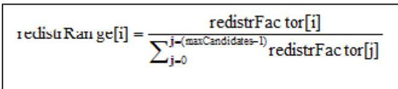

Where: maxCandidates is the total number of frequencies/cells with valid redistrFactor[j].

## 5.2.4.11 Cell reselection or CN type change when storing UE AS context

For UEs storing UE AS context and resumeIdentity as specified in TS 36.331 [3], upon cell reselection to another RAT or upon reselecting to another CN type, the UE shall discard the stored UE AS context and resumeIdentity.

## 5.2.4.12 Relaxed monitoring

## 5.2.4.12.0 Relaxed monitoring measurement rules

When the UE is required to perform intra-frequency or inter-frequency measurement according to the measurement rules in clause 5.2.4.2 or 5.2.4.2a, the UE may choose not to perform intra-frequency or inter-frequency measurements when:

\- The relaxed monitoring criterion in clause 5.2.4.12.1 is fulfilled for a period of TSearchDeltaP, and

\- Less than 24 hours have passed since measurements for cell reselection were last performed, and

The UE has performed intra-frequency or inter-frequency measurements for at least TSearchDeltaP after selecting or reselecting a new cell.

## 5.2.4.12.1 Relaxed monitoring criterion

The relaxed monitoring criterion is fulfilled when:

(SrxlevRef – Srxlev) < SSearchDeltaP

Where:

Srxlev = current Srxlev value of the serving cell (dB).

\- SrxlevRef = reference Srxlev value of the serving cell (dB), set as follows:

\- After selecting or reselecting a new cell, or

\- If (Srxlev - SrxlevRef) > 0, or

\- If the relaxed monitoring criterion has not been met for TSearchDeltaP:

\- the UE shall set the value of SrxlevRef to the current Srxlev value of the serving cell;

TSearchDeltaP = 5 minutes, or the eDRX cycle length if eDRX is configured and the eDRX cycle length is longer than 5 minutes.

## 5.2.4.13 Cell reselection or CN type change in RRC\_INACTIVE state

For UE in the RRC\_INACTIVE state, upon cell reselection to another RAT or CN type change, UE transitions from RRC\_INACTIVE to RRC\_IDLE and performs actions as specified in TS 36.331 [3].

## 5.2.5 Void

## 5.2.6 Camped Normally state

This state is applicable for RRC\_IDLE and RRC\_INACTIVE state.

When camped normally, the UE shall perform the following tasks:

monitor the paging channel of the cell as specified in clause 7 according to information sent in system information;

monitor relevant System Information as specified in TS 36.331 [3];

perform necessary measurements for the cell reselection evaluation procedure;

execute the cell reselection evaluation process on the following occasions/triggers:

1) UE internal triggers, so as to meet performance as specified in TS 36.133 [10];

2) When information on the BCCH or BR-BCCH used for the cell reselection evaluation procedure has been modified.

## 5.2.7 Cell Selection at transition to RRC\_IDLE or RRC\_INACTIVE state

For NB-IoT cell selection at transition to RRC\_IDLE state is defined in clause 5.2.7a.

At reception of RRCConnectionRelease message or RRCEarlyDataComplete message to move the UE into RRC\_IDLE or RRC\_INACTIVE, UE shall attempt to camp on a suitable cell according to redirectedCarrierInfo, if included in the RRCConnectionRelease message or RRCEarlyDataComplete message. If the UE cannot find a suitable cell, the UE is allowed to camp on any suitable cell of the indicated RAT. If the RRCConnectionRelease message or

RRCEarlyDataComplete message does not contain the redirectedCarrierInfo UE shall attempt to select a suitable cell on an EUTRA carrier. If no suitable cell is found according to the above, the UE shall perform a cell selection starting with Stored Information Cell Selection procedure in order to find a suitable cell to camp on.

When returning to RRC\_IDLE or RRC\_INACTIVE state after UE moved to RRC\_CONNECTED state from camped on any cell state, UE shall attempt to camp on an acceptable cell according to redirectedCarrierInfo, if included in the RRCConnectionRelease message. If the UE cannot find an acceptable cell, the UE is allowed to camp on any acceptable cell of the indicated RAT. If the RRCConnectionRelease message does not contain redirectedCarrierInfo UE shall attempt to select an acceptable cell on an EUTRA carrier. If no acceptable cell is found according to the above, the UE shall continue to search for an acceptable cell of any PLMN in state any cell selection.

## 5.2.7a Cell Selection at transition to RRC\_IDLE state for NB-IoT

At reception of RRCConnectionRelease-NB message or RRCEarlyDataComplete-NB message to move the UE into RRC\_IDLE, UE shall attempt to camp on a suitable cell according to redirectedCarrierInfo, if included in the RRCConnectionRelease-NB message or RRCEarlyDataComplete-NB message. If the UE cannot find a suitable cell, the UE is allowed to camp on a suitable cell of any NB-IoT carrier. If the RRCConnectionRelease-NB message or RRCEarlyDataComplete-NB message does not contain the redirectedCarrierInfo UE shall attempt to select a suitable cell on a NB-IoT carrier.

## 5.2.8 Any Cell Selection state

For NB-IoT Any Cell Selection state is defined in clause 5.2.8a.

This state is applicable for RRC\_IDLE and RRC\_INACTIVE state. In this state, the UE shall perform cell selection process to find a suitable cell. If the cell selection process fails to find a suitable cell after a complete scan of all RATs and all frequency bands supported by the UE, the UE shall attempt to find an acceptable cell of any PLMN to camp on, trying all RATs that are supported by the UE and searching first for a high quality cell, as defined in clause 5.1.2.2.

The UE, which is not camped on any cell, shall stay in this state.

## 5.2.8a Any Cell Selection state for NB-IoT

In this state, the UE shall attempt to find a suitable cell of any PLMN to camp on and searching first for a high quality cell, as defined in clause 5.1.2.2.

The UE, which is not camped on any cell, shall stay in this state until a suitable cell is found.

## 5.2.9 Camped on Any Cell state

In this state, the UE shall perform the following tasks:

monitor the paging channel of the cell as specified in clause 7 according to information sent in system information;

monitor relevant System Information as specified in TS 36.331 [3];

perform necessary measurements for the cell reselection evaluation procedure;

execute the cell reselection evaluation process on the following occasions/triggers:

1) UE internal triggers, so as to meet performance as specified in TS 36.133 [10];

2) When information on the BCCH or BR-BCCH used for the cell reselection evaluation procedure has been modified;

regularly attempt to find a suitable cell trying all frequencies of all RATs that are supported by the UE. If a suitable cell is found, UE shall move to camped normally state;

if the UE supports voice services and the current cell does not support emergency call as indicated in System information specified in TS 36.331 [3], the UE should perform cell selection/ reselection to an acceptable cell of any supported RAT regardless of priorities provided in system information from current cell, if no suitable cell is found.

NOTE: The UE is allowed to not perform reselection to an inter-frequency E-UTRAN cell in order to prevent camping on a cell on which it cannot initiate an IMS emergency call.

## 5.3 Cell Reservations and Access Restrictions

There are two mechanisms which allow an operator to impose cell reservations or access restrictions. The first mechanism uses indication of cell status and special reservations for control of cell selection and reselection procedures. The second mechanism, referred to as Access Control, shall allow preventing selected classes of users or ACDC categories from sending initial access messages for load control reasons. For Access Control based on Access Classes, at subscription, one or more Access Classes are allocated to the subscriber and stored in the USIM TS 22.011 [4]. For Access Control based on ACDC categories, at subscription at least four ACDC categories are allocated to the subscriber and stored in the ACDC MO TS 24.105 [31] or USIM TS 31.102 [32].

IAB-MT does not apply the access control.

## 5.3.1 Cell status and cell reservations

Cell status and cell reservations are indicated in the SystemInformationBlockType1 message (or SystemInformationBlockType1-BR message or SystemInformationBlockType1-NB message) TS 36.331 [3] by means of the following fields:

\- cellBarred (IE type: "barred" or "not barred")

This field indicates if the cell is barred for connectivity to EPC.

This field is ignored by the UEs supporting crs-IntfMitig while crs-IntfMitigEnabled is included in SIB1. This field is ignored by the BL UEs or UEs in CE supporting ce-CRS-IntfMitig while crs-IntfMigitNumPRBs is included in SIB1-BR.

This field is ignored by UEs supporting NTN while cellBarred-NTN is included in SIB1-BR or SIB1-NB. In case of multiple EPC PLMNs indicated in SIB1/SIB1-BR, this field is common for all EPC PLMNs

NOTE 1: IAB-MT ignores the cellBarred, cellReservedForOperatorUse, intraFreqReselection and csg-Indication (i.e. treats intraFreqReselection as if it was set to allowed and the csg-Indication as if it was set to FALSE) as defined in TS 36.331 [3].

\- cellBarred-5GC (IE type: "barred" or "not barred")

This field indicates if the cell is barred for connectivity to 5GC.

This field is ignored if the UE does not support E-UTRA connected to 5GC or if the UE supports network-based CRS interference mitigation and nw-BasedCRS-InterferenceMitigation is included in SystemInformationBlockType1.

In case of multiple 5GC PLMNs indicated in SIB1, this field is common for all 5GC PLMNs.

\- cellReservedForOperatorUse (IE type: "reserved" or "not reserved")

This field indicates if the cell is reserved for operator use.

This field is ignored by the UEs supporting crs-IntfMitig while crs-IntfMitigEnabled is included in SIB1. This field is ignored by the BL UEs or UEs in CE supporting ce-CRS-IntfMitig while crs-IntfMigitNumPRBs is included in SIB1-BR.

In case of multiple EPC or 5GC PLMNs indicated in SIB1/SIB1-BR, this field is specified per EPC or 5GC PLMN.

\- cellBarred-CRS (IE type: "barred" or "not barred")

This field indicates if the cell is barred for connectivity to EPC for UEs supporting network-based CRS interference mitigation.

barred means the cell is barred for UEs supporting crs-IntfMitig while crs-IntfMitigEnabled is included in SIB1. For BL UEs or UEs in CE capable of ce-CRS-IntfMitig, barred means the cell is barred while crs-IntfMitigNumPRBs is included in SIB1-BR.

This field is ignored by the UE if the UE does not support CRS interference mitigation or while crs-IntfMitigConfig is not included in SIB1 (SIB1-BR for BL UEs or UEs in CE).

In case of multiple PLMNs indicated in SIB1/SIB1-BR, this field is common for all PLMNs.

## cellBarred-5GC-CRS (IE type: "barred" or "not barred")

This field indicates if the cell is barred for connectivity to 5GC for UEs supporting network-based CRS interference mitigation.

This field is ignored if the UE does not support E-UTRA connected to 5GC or network-based CRS interference mitigation.

In case of multiple 5GC PLMNs indicated in SIB1, this field is common for all 5GC PLMNs.

\- cellReservedForOperatorUse-CRS (IE type: "reserved" or "not reserved")

This field indicates if the cell is reserved for operator use for UEs supporting network-based CRS interference mitigation.

reserved means the cell is "reserved" for operator use for UEs supporting crs-IntfMitig while crs-IntfMitigEnabled is included in SIB1.

For BL UEs or UEs in CE capable of ce-CRS-IntfMitig, reserved means the cell is "reserved" for operator use while crs-IntfMitigNumPRBs is included in SIB1-BR.

This field is ignored if the UE does not support CRS interference mitigation or while crs-IntfMitigConfig is not included in SIB1 (SIB1-BR for BL UEs or UEs in CE).

In case of multiple PLMNs indicated in SIB1/SIB1-BR, this field is specified per PLMN.

## - iab-Support (IE type: "true")

Indicated in SIB1 message. In case of multiple PLMNs indicated in SIB1, this field is specified per PLMN. This field indicates if the cell is barred for IAB node or the cell does not support IAB node, or both. When this field is absent, the IAB node shall treat this cell as if cell status is barred.

\- cellBarred-NTN (IE type: "barred" or "not barred")

This field indicates if the cell is barred for connectivity to EPC via NTN.

This field is ignored if the UE does not support NTN connectivity.

The following description for handling of barred and reserved cells is per CN type. If the UE supports more than one CN type, the UE shall only exclude a cell as candidate for selection/reselection if it is excluded for both CN types.

NOTE 2: Fields cellBarred-CRS and cellReservedForOperatorUse-CRS are not indicated in SystemInformationBlockType1-NB

When cell status is indicated as "not barred" and "not reserved" for operator use,

\- All UEs shall treat this cell as candidate during the cell selection and cell reselection procedures.

When cell status is indicated as "not barred" and "reserved" for operator use for any PLMN,

UEs assigned to Access Class 11 or 15 (or corresponding Access Identity) operating in their HPLMN/EHPLMN shall treat this cell as candidate during the cell selection and reselection procedures if the field cellReservedForOperatorUse for that PLMN set to "reserved".

UEs assigned to an Access Class in the range of 0 to 9 (or corresponding Access Identity 0), 12 to 14 (or corresponding Access Identity) or to Access Identity 1, 2 or 3 shall behave as if the cell status is "barred" in case the cell is "reserved for operator use" for the registered PLMN or the selected PLMN.

NOTE 3: ACs 11, 15 (or corresponding Access Identity) are only valid for use in the HPLMN/ EHPLMN; ACs 12, 13, 14 (or corresponding Access Identity) are only valid for use in the home country TS 22.011 [4].

NOTE 4: Access Identities 1, 2 are valid in the PLMNs as specified in TS 22.261 [41].

NOTE 5: Access Identity 3 is only valid for PLMNs that indicate to potential Disaster Inbound Roamers that the UEs can access the PLMN as specified in TS 22.261 [41].

When cell status "barred" is indicated or to be treated as if the cell status is "barred",

\- The UE is not permitted to select/reselect this cell, not even for emergency calls.

\- The UE shall consider other cells for cell selection/reselection according to the following rule:

If the cell is to be treated as if the cell status is "barred" due to being unable to acquire the MasterInformationBlock (or MasterInformationBlock-NB), the SystemInformationBlockType1 (or SystemInformationBlockType1-BR message or SystemInformationBlockType1-NB), the SystemInformationBlockType2 (or SystemInformationBlockType2-NB) or SystemInformationBlockType31 (or SystemInformationBlockType31-NB) if broadcasted for UEs supporting NTN:

\- the UE may exclude the barred cell as a candidate for cell selection/reselection for up to 300 seconds.

\- the UE may select another cell on the same frequency if the selection criteria are fulfilled.

the UE may select the same cell in normal coverage if the UE was barred in the cell due to being unable to acquire MasterInformationBlock, SystemInformationBlockType1-BR, or SystemInformationBlockType2 in enhanced coverage, but was able to acquire MasterInformationBlock, SystemInformationBlockType1, and SystemInformationBlockType2 in normal coverage, if the selection criteria are fulfilled.

the UE may select the same cell in enhanced coverage if the UE was barred in the cell due to being unable to acquire MasterInformationBlock, SystemInformationBlockType1, or SystemInformationBlockType2 in normal coverage, but was able to acquire MasterInformationBlock, SystemInformationBlockType1-BR, and SystemInformationBlockType2, if the selection criteria are fulfilled.

## else

\- If the cell is a CSG cell:

\- the UE may select another cell on the same frequency if the selection/reselection criteria are fulfilled.

else

If the field intraFreqReselection in field cellAccessRelatedInfo in SystemInformationBlockType1 (or SystemInformationBlockType1-BR message or SystemInformationBlockType1-NB) message is set to "allowed", the UE may select another cell on the same frequency if re-selection criteria are fulfilled.

\- The UE shall exclude the barred cell as a candidate for cell selection/reselection for 300 seconds.

If the field intraFreqReselection in field cellAccessRelatedInfo in SystemInformationBlockType1 (or SystemInformationBlockType1-BR message or SystemInformationBlockType1-NB) message is set to "not allowed" the UE shall not re-select a cell on the same frequency as the barred cell;

The UE shall exclude the barred cell and the cells on the same frequency as a candidate for cell selection/reselection for 300 seconds.

The cell selection of another cell may also include a change of RAT or, if the previous and selected cell are both E-UTRA cells, a change of the CN type.

## 5.3.2 Access control

For UE camping on E-UTRA connected to EPC, information on cell access restrictions associated with the Access Classes or ACDC categories is broadcast as system information, TS 36.331 [3]. For UE camping on E-UTRA connected to 5GC, information on cell access restrictions associated with Access Categories and Identities is broadcast as system information, TS 36.331 [3].

For UE camping on E-UTRA connected to EPC, the UE shall ignore Access Class or ACDC category related cell access restrictions when selecting a cell to camp on, i.e. it shall not reject a cell for camping on because access on that cell is not allowed for any of the Access Classes or ACDC categories of the UE. A change of the indicated access restriction shall not trigger cell reselection by the UE. For UE camping on E-UTRA connected to 5GC, the UE shall ignore Access Category and Identity related cell access restrictions for cell reselection. A change of the indicated access restriction shall not trigger cell reselection by the UE.

For UE camping on E-UTRA connected to EPC, access Class or ACDC category related cell access restrictions shall be checked by the UE when starting RRC connection establishment procedure as specified in TS 36.331 [3]. For UE camping on E-UTRA connected to 5GC, Access Category and Identity related cell access restrictions shall be checked by the UE for NAS initiated access attempts and RNAU as specified in TS 36.331 [3].

## 5.3.3 Emergency call

A restriction on emergency calls, if needed, is indicated by the field ac-BarringForEmergency TS 36.331 [3]. If access class 10 is indicated as barred in a cell, UEs with access class 0 to 9 or without an IMSI are not allowed to initiate emergency calls in this cell. For UEs with access classes 11 to 15, emergency calls are not allowed if both access class 10 and the relevant access class (11 to 15) are barred. Otherwise, emergency calls are allowed for those UEs.

Full details of operation under "Access class barred list" are described in TS 22.011 [4].

For E-UTRA connected to 5GC, the restriction on emergency calls is indicated by access control information of access category 2 under unified access control TS 36.331 [3].

## 5.4 Tracking Area registration

In the UE, the AS shall report tracking area information to the NAS.

If the UE reads more than one PLMN identity in the current cell, the UE shall report the found PLMN identities that make the cell suitable in the tracking area information to NAS.

The NAS part of the location registration process is specified in TS 23.122 [5].

Actions for the UE AS upon reception of Location Registration reject are specified in TS 22.011 [4] and TS 24.301 [16].

## 5.5 Support for manual CSG selection

## 5.5.1 E-UTRA case

In the UE on request of NAS, the AS shall scan all RF channels in the E-UTRA bands according to its capabilities to find available CSGs. On each carrier, the UE shall at least search for the strongest cell, read its system information and report available CSG ID(s) together with their "HNB name" (if broadcast) and PLMN(s) to the NAS. The search for available CSGs may be stopped on request of the NAS.

If NAS has selected a CSG and provided this selection to AS, the UE shall search for an acceptable or suitable cell belonging to the selected CSG to camp on.

## 5.5.2 UTRA case

Support for manual CSG selection in UTRA is described in TS 25.304 [8].

## 5.6 RAN-assisted WLAN interworking

The purpose of this procedure is to facilitate RAN-assisted WLAN interworking.

## 5.6.1 RAN assistance parameter handling in RRC\_IDLE

RAN assistance parameters may be provided to the UE in SystemInformationBlockType17 or in the RRCConnectionReconfiguration message. RAN assistance parameters are used only if the UE is camped normally.

## 5.6.2 Access network selection and traffic steering rules

The rules in this clause are only applicable for WLANs for which identifiers has been signaled to the UE by E-UTRAN and the UE is capable of RAN-assisted WLAN interworking based on access network selection and traffic steering rules. Coexistence with ANDSF based WLAN selection and traffic steering methods on the UE is based on mechanism described in TS 23.402 [25]. The rules refer to the following quantities:

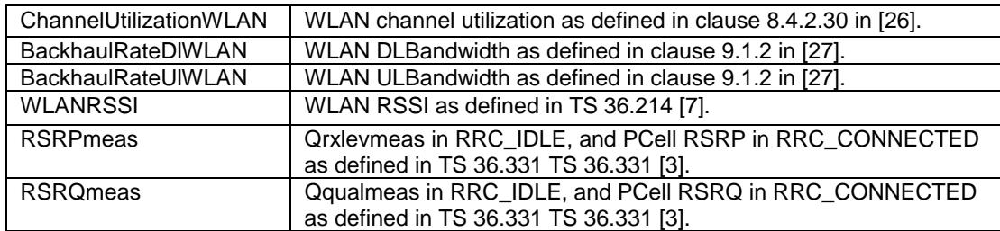

The upper layers in the UE shall be notified (see TS 24.302 [28]) when and for which WLAN(s), that matches all the provided identifiers (in clause 5.6.3) for a specific entry in the list, the following conditions 1 and 2 for steering traffic from E-UTRAN to WLAN are satisfied for a time interval TsteeringWLAN:

1. In the E-UTRAN serving cell:

RSRPmeas < ThreshServingOffloadWLAN, LowP; or

RSRQmeas < ThreshServingOffloadWLAN, LowQ;

2. In the target WLAN:

ChannelUtilizationWLAN < ThreshChUtilWLAN, Low; and

BackhaulRateDlWLAN > ThreshBackhRateDLWLAN, High; and

BackhaulRateUlWLAN > ThreshBackhRateULWLAN, High; and

WLANRSSI > ThreshWLANRSSI, High;

The UE shall not consider the metrics for which a threshold has not been provided. The UE shall evaluate the E-UTRAN conditions on PCell only. If not all metrics related to the provided thresholds can be acquired for a WLAN BSS, the UE shall exclude that WLAN BSS from the evaluation of the above rule.

The upper layers in the UE shall be notified (see TS 24.302 [28]) when the following conditions 3 or 4 for steering traffic from WLAN to E-UTRAN are satisfied for a time interval TsteeringWLAN:

1. In the source WLAN:

ChannelUtilizationWLAN > ThreshChUtilWLAN, High; or

BackhaulRateDlWLAN < ThreshBackhRateDLWLAN, Low; or

BackhaulRateUlWLAN < ThreshBackhRateULWLAN, Low; or

WLANRSSI < ThreshWLANRSSI, Low;

2. In the target E-UTRAN cell:

RSRPmeas > ThreshServingOffloadWLAN, HighP; and

RSRQmeas > ThreshServingOffloadWLAN, HighQ;

The UE shall not consider the metrics for which a threshold has not been provided. The UE shall evaluate the E-UTRAN conditions on PCell only.

## 5.6.3 RAN assistance parameters definition

The following RAN assistance parameters for RAN-assisted WLAN interworking may be provided:

ThreshServingOffloadWLAN, LowP

This specifies the RSRP threshold (in dBm) used by the UE for traffic steering to from E-UTRAN to WLAN.

ThreshServingOffloadWLAN, HighP

This specifies the RSRP threshold (in dBm) used by the UE for traffic steering from WLAN to E-UTRAN.

## ThreshServingOffloadWLAN, LowQ

This specifies the RSRQ threshold (in dB) used by the UE for traffic steering from E-UTRAN to WLAN.

## ThreshServingOffloadWLAN, HighQ

This specifies the RSRQ threshold (in dB) used by the UE for traffic steering from WLAN to E-UTRAN.

## ThreshChUtilWLAN, Low

This specifies the WLAN channel utilization (BSS load) threshold used by the UE for traffic steering from E-UTRAN to WLAN.

## ThreshChUtilWLAN, High

This specifies the WLAN channel utilization (BSS load) threshold used by the UE for traffic steering from WLAN to E-UTRAN.

## ThreshBackhRateDLWLAN, Low

This specifies the backhaul available downlink bandwidth threshold used by the UE for traffic steering from WLAN to E-UTRAN.

## ThreshBackhRateDLWLAN, High

This specifies the backhaul available downlink bandwidth threshold used by the UE for traffic steering from E-UTRAN to WLAN.

## ThreshBackhRateULWLAN, Low

This specifies the backhaul available uplink bandwidth threshold used by the UE for traffic steering from WLAN to E-UTRAN.

## ThreshBackhRateULWLAN, High

This specifies the backhaul available uplink bandwidth threshold used by the UE for traffic steering from E-UTRAN to WLAN.

## ThreshWLANRSSI, Low

This specifies the WLAN RSSI threshold used by the UE for traffic steering from WLAN to E-UTRAN.

## ThreshWLANRSSI, High

This specifies the Beacon RSSI threshold used by the UE for traffic steering from E-UTRAN to WLAN.

## TsteeringWLAN

This specifies the timer value TsteeringWLAN during which the rules should be fulfilled before starting traffic steering between E-UTRAN and WLAN.

## WLAN identifiers

Only the SSIDs, BSSIDs and HESSIDs which are provided in this parameter shall be considered for traffic steering between E-UTRAN and WLAN based on the rules in this clause.

## 6 Reception of broadcast information

## 6.1 Reception of system information

The NAS is informed if the cell selection and reselection results in changes in the received NAS system information.

The UE shall monitor the Paging Occasions (POs) as described in clause 7.1 to receive System Information change notifications in RRC\_IDLE. Changes in the system information are indicated by the network using a Paging message or Direct Indication information on MPDCCH and NPDCCH respectively. When the Paging message or Direct Indication information indicates system information changes then the UE shall re-acquire the concerned system information, as specified in TS 36.331 [3].

## 6.2 Reception of MBMS

A UE, except for BL UE or UE in enhanced coverage or NB-IoT UE, interested to receive MBMS services provided using MBSFN transmission shall apply the MCCH information acquision procedure as specified in TS 36.331 [3] to receive the MCCH information upon entering the corresponding MBSFN area and upon receiving a notification that the MCCH information has changed. A UE interested to receive MBMS services provided using MBSFN transmission identifies if a service that it is interested to receive is started or ongoing by receiving the MCCH information, and then receives a MTCH corresponding to the identified service.

A UE interested to receive MBMS services provided using SC-PTM transmission shall apply the SC-MCCH information acquisition procedure as specified in TS 36.331 [3] to receive the SC-MCCH information upon entering a new cell and upon receiving a notification that the SC-MCCH information has changed. A UE interested to receive MBMS services provided using SC-PTM transmission identifies if a service that it is interested to receive is started or ongoing by receiving the SC-MCCH information, and then receives a SC-MTCH configured using the SC-MRB establishment procedure in TS 36.331 [3] and using the DL-SCH reception and SC-PTM DRX procedure as specified in TS 36.321 [30].

For BL UE or UE in enhanced coverage or NB-IoT UE interested to receive MBMS services provided using SC-PTM transmission, in case of conflict, reception of paging or establishment of a RRC connection for Mobile Terminated Call and Mobile Originated Signalling takes precedence over SC-PTM reception.

## 7 Paging

## 7.1 Discontinuous Reception for paging

The UE may use Discontinuous Reception (DRX) in idle mode in order to reduce power consumption. One Paging Occasion (PO) is a subframe where there may be P-RNTI transmitted on PDCCH or MPDCCH or, for NB-IoT on NPDCCH addressing the paging message. In P-RNTI transmitted on MPDCCH case, PO refers to the starting subframe of MPDCCH repetitions. In case of P-RNTI transmitted on NPDCCH, PO refers to the starting subframe of NPDCCH repetitions unless subframe determined by PO is not a valid NB-IoT downlink subframe then the first valid NB-IoT downlink subframe after PO is the starting subframe of the NPDCCH repetitions. The paging message is same for both RAN initiated paging and CN initiated paging.

The UE initiates RRC Connection Resume procedure upon receiving RAN paging. If the UE receives a CN initiated paging in RRC\_INACTIVE state, the UE moves to RRC\_IDLE and informs NAS.

One Paging Frame (PF) is one Radio Frame, which may contain one or multiple Paging Occasion(s). When DRX is used the UE needs only to monitor one PO per DRX cycle.

One Paging Narrowband (PNB) is one narrowband, on which the UE performs the paging message reception.

PF, PO, and PNB are determined by following formulae:

PF is given by following equation:

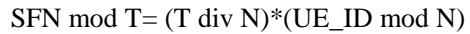

Index i\_s pointing to PO from subframe pattern defined in 7.2 will be derived from following calculation:

i\_s = floor(UE\_ID/N) mod Ns

If P-RNTI is monitored on MPDCCH, the PNB is determined by the following equation:

PNB = floor(UE\_ID/(N\*Ns)) mod Nn

If P-RNTI is monitored on NPDCCH and the UE supports paging on a non-anchor carrier, and if paging configuration for non-anchor carrier is provided in system information, then the paging carrier is determined by the paging carrier with smallest index n (0  n  Nn-1) fulfilling the following equation:

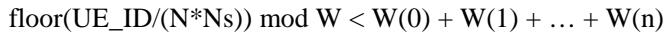

System Information DRX parameters stored in the UE shall be updated locally in the UE whenever the DRX parameter values are changed in SI. If the UE has no IMSI, for instance when making an emergency call without USIM, the UE shall use as default identity UE\_ID = 0 in the PF, i\_s, and PNB formulas above. If the UE has no 5G-S-TMSI, for instance when the UE has not yet registered onto the network, the UE shall use as default identity UE\_ID = 0 in the PF and i\_s formulas above.

The following Parameters are used for the calculation of the PF, i\_s, PNB, wg, and the NB-IoT paging carrier:

\- T: DRX cycle of the UE.

In RRC\_IDLE state:

Except for NB-IoT: If a UE specific extended DRX value of 512 radio frames is configured by upper layers according to 7.3, T =512. Otherwise, T is determined by the shortest of the UE specific DRX value, if allocated by upper layers, and a default DRX value broadcast in system information. If UE specific DRX is not configured by upper layers, the default value is applied.

In RRC\_INACTIVE state, if extended DRX is not configured by upper layers as defined in 7.3:

T is determined by the shortest of the RAN paging cycle, if configured, the UE specific paging cycle, if allocated by upper layers, and the default paging cycle.

In RRC\_INACTIVE state if extended DRX is configured by upper layers according to 7.3:

If a UE specific extended DRX value of 512 radio frames is configured, T is determined by the shortest of the RAN paging cycle, if configured, and 512 radio frames.

\- If a UE specific extended DRX value other than 512 radio frames is configured:

During the PTW, T is determined by the shortest of the RAN paging cycle, if configured, the UE specific paging cycle, if allocated by upper layers, and the default paging cycle. Outside the PTW, T is determined by the RAN paging cycle, if configured.

In RRC\_INACTIVE state, if the UE supports inactiveStatePO-Determination and the network broadcasts ranPagingInIdlePO with value "true", the UE uses the T value applicable for RRC\_IDLE state for the determination of i\_s. Otherwise, the UE uses the T value applicable for RRC\_INACTIVE state.

In RRC\_INACTIVE state, a BL UE or a UE in enhanced coverage uses the T value applicable for RRC\_IDLE state for the determination of PNB and i\_s.

For NB-IoT: If UE specific DRX value is allocated by upper layers and minimum UE specific DRX value is broadcast in system information, T = min (default DRX value, max (UE specific DRX value, minimum UE specific DRX value broadcast in system information)). If UE specific DRX is not configured by upper layers or if the minimum UE specific DRX value is not broadcast in system information, the default DRX value is applied.

\- nB: 4T, 2T, T, T/2, T/4, T/8, T/16, T/32, T/64, T/128, and T/256, and for NB-IoT also T/512, and T/1024.

\- N: min(T,nB)

\- Ns: max(1,nB/T)

\- Nn: number of paging narrowbands (for P-RNTI monitored on MPDCCH) or paging carriers (for P-RNTI monitored on NPDCCH) determined as follows:

If UE monitors GWUS according to clause 7.5.1:

this is the number of paging narrowbands (paging carriers) that are configured with GWUS.

else:

this is the number of paging narrowbands (paging carriers) provided in system information.

UE\_ID

If the UE supports E-UTRA connected to 5GC and NAS indicated to use 5GC for the selected cell:

5G-S-TMSI mod 1024, if P-RNTI is monitored on PDCCH.

5G-S-TMSI mod 16384, if P-RNTI is monitored on NPDCCH or MPDCCH.

else

IMSI mod 1024, if P-RNTI is monitored on PDCCH and Accepted IMSI Offset is not available.

Alternative IMSI mod 1024, if P-RNTI is monitored on PDCCH and Accepted IMSI Offset is available.

IMSI mod 4096, if P-RNTI is monitored on NPDCCH.

IMSI mod 16384, if P-RNTI is monitored on MPDCCH or if P-RNTI is monitored on NPDCCH and the UE supports paging on a non-anchor carrier, and if paging configuration for non-anchor carrier is provided in system information.

W(i): Weight for NB-IoT paging carrier i.

\- W: Total weight of all NB-IoT paging carriers, i.e. W = W(0) + W(1) + … + W(Nn-1). If UE monitors GWUS according to clause 7.5.1, Total weight of all NB-IoT paging carriers configured with GWUS.

IMSI is given as sequence of digits of type Integer (0..9), IMSI shall in the formulae above be interpreted as a decimal integer number, where the first digit given in the sequence represents the highest order digit.

For example:

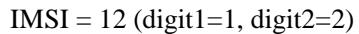

In the calculations, this shall be interpreted as the decimal integer "12", not "1x16+2 = 18".

If an Accepted IMSI Offset is forwarded by upper layers, the UE shall use the Accepted IMSI Offset value and IMSI to calculate an Alternative IMSI value as defined in TS 23.401 [23].

5G-S-TMSI is a 48 bit long bit string as defined in TS 23.501 [39]. 5G-S-TMSI shall in the PF and i\_s formulae above be interpreted as a binary number where the left most bit represents the most significant bit.

## 7.2 Subframe Patterns

FDD:

If P-RNTI is transmitted on PDCCH or NPDCCH, or if P-RNTI is transmitted on MPDCCH with system bandwidth > 3MHz:

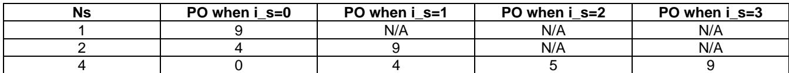

\- If P-RNTI is transmitted on MPDCCH with system bandwidth of 1.4MHz and 3MHz:

TDD (all UL/DL configurations):

If P-RNTI is transmitted on PDCCH or NPDCCH, or if P-RNTI is transmitted on MPDCCH with system bandwidth > 3MHz:  
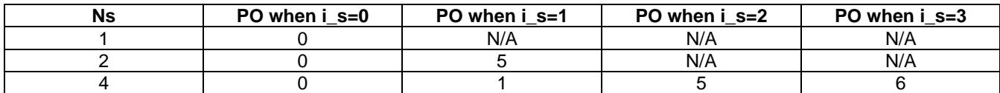

- If P-RNTI is transmitted on MPDCCH with system bandwidth of 1.4MHz and 3MHz:  
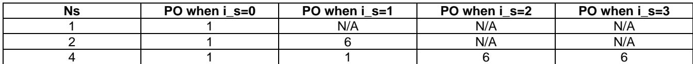

## 7.3 Paging in extended DRX

The UE may be configured by upper layers with an extended DRX (eDRX) cycle TeDRX. Except for NB-IoT, the UE may operate in extended DRX only if the UE is configured by upper layers and the cell indicates support for eDRX in System Information. For NB-IoT, the UE may operate in extended DRX only if the UE is configured by upper layers. If the UE is configured with a TeDRX cycle of 512 radio frames, it monitors POs as defined in 7.1 with parameter T = 512. Otherwise, a UE configured with eDRX monitors POs as defined in 7.1 (i.e, based on the upper layer configured DRX value and a default DRX value determined in 7.1 or if the UE is in RRC-INACTIVE based on the upper layer configured DRX value,default DRX cycle and RAN paging cycle determined in 7.1), during a periodic Paging Time Window (PTW) configured for the UE or until a paging message including the UE's NAS identity is received for the UE during the PTW, whichever is earlier. The PTW is UE-specific and is determined by a Paging Hyperframe (PH), a starting position within the PH (PTW\_start) and an ending position (PTW\_end). PH, PTW\_start and PTW\_end are given by the following formulae:

The PH is the H-SFN satisfying the following equation:

H-SFN mod TeDRX,H= (UE\_ID\_H mod TeDRX,H), where

UE\_ID\_H:

\- 10 most significant bits of the Hashed ID, if P-RNTI is monitored on PDCCH or MPDCCH

\- 12 most significant bits of the Hashed ID, if P-RNTI is monitored on NPDCCH

T eDRX,H : eDRX cycle of the UE in Hyper-frames, (TeDRX,H =1, 2, …, 256 Hyper-frames) (for NB-IoT, TeDRX,H =2, …, 1024 Hyper-frames) and configured by upper layers.

PTW\_start denotes the first radio frame of the PH that is part of the PTW and has SFN satisfying the following equation:

SFN = 256\* ieDRX, where

\- ieDRX = floor(UE\_ID\_H /TeDRX,H) mod 4

PTW\_end is the last radio frame of the PTW and has SFN satisfying the following equation:

SFN = (PTW\_start + L\*100 - 1) mod 1024, where

\- L = Paging Time Window length (in seconds) configured by upper layers

Hashed ID is defined as follows:

Hashed\_ID is Frame Check Sequence (FCS) for the bits b31, b30…, b0 of S-TMSI or 5G-S-TMSI. 5G-S-TMSI is used for Hashed-ID if the UE supports connection to 5GC and NAS indicated to use 5GC for the selected cell.

S-TMSI = <b39, b38, …, b0> as defined in TS 23.003 [35]

5G-S-TMSI = <b47, b46, …, b0> as defined in TS 23.003 [35].

The 32-bit FCS shall be the ones complement of the sum (modulo 2) of Y1 and Y2, where

Y1 is the remainder of xk (x31 + x30 + x29 + x28 + x27 + x26 + x25 + x24 + x23 + x22 + x21 + x20 + x19 + x18 + x17 + x16 + x15 + x14 + x13 + x12 + x11 + x10 + x9 + x8 + x7 + x6 + x5 + x4 + x3 + x2 + x1 + 1) divided (modulo 2) by the generator polynomial x32 + x26 + x23 + x22 + x16 + x12 + x11 + x10 + x8 + x7 + x5 + x4 + x2 + x + 1, where k is 32; and

Y2 is the remainder of Y3 divided (modulo 2) by the generator polynomial x32 + x26 + x23 + x22 + x16 + x12 + x11 + x10 + x8 + x7 + x5 + x4 + x2 + x + 1, where Y3 is the product of x32 by "b31, b30…, b0 of S-TMSI or 5G-S-TMSI", i.e., Y3 is the generator polynomial x32 (b31\*x31 + b30\*x30 + … + b0\*1).

NOTE: The Y1 is 0xC704DD7B for any S-TMSI or 5G-S-TMSI value. An example of hashed ID calculation is in Annex B.

## 7.4 Paging with Wake Up Signal

Paging with Wake Up Signal is only used in the cell in which the UE most recently entered RRC\_IDLE triggered by:

reception of RRCEarlyDataComplete; or

\- reception of RRCConnectionRelease not including noLastCellUpdate; or

reception of RRCConnectionRelease including noLastCellUpdate and the UE was using (G)WUS in this cell prior to this RRC connection attempt.

If the UE is in RRC\_IDLE, the UE is not using GWUS according to clause 7.5 and the UE supports WUS and WUS configuration is provided in system information, the UE shall monitor WUS using the WUS parameters provided in System Information. When DRX is used and the UE detects WUS the UE shall monitor the following PO. When extended DRX is used and the UE detects WUS the UE shall monitor the following numPOs POs or until a paging message including the UE's NAS identity is received, whichever is earlier. If the UE does not detect WUS the UE is not required to monitor the following PO(s). If the UE missed a WUS occasion (e.g. due to cell reselection), it monitors every PO until the start of next WUS or until the PTW ends, whichever is earlier.

\- numPOs = Number of consecutive Paging Occasions (PO) mapped to one WUS provided in system information where (numPOs 1).

The WUS configuration, provided in system information, includes time-offset between end of WUS and start of the first PO of the numPOs POs UE is required to monitor. The timeoffset in subframes, used to calculate the start of a subframe g0 (see TS 36.213 [6]), is defined as follows:

\- for UE using DRX, it is the signalled timeoffsetDRX;

\- for UE using eDRX, it is the signalled timeoffset-eDRX-Short if timeoffset-eDRX-Long is not broadcasted;

\- for UE using eDRX, it is the value determined according to Table 7.4-1 if timeoffset-eDRX-Long is broadcasted

Table 7.4-1: Determination of GAP between end of WUS and associated PO  
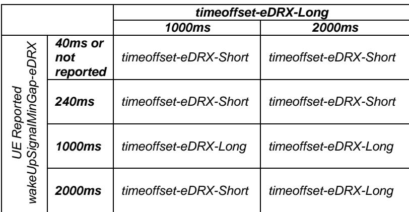

The timeoffset is used to determine the actual subframe g0 as follows (taking into consideration resultant SFN and/or H-SFN wrap-around of this computation):

g0 = PO – timeoffset, where PO is the Paging Occasion subframe as defined in clause 7.1

For UE using eDRX, the same timeoffset applies between the end of WUS and associated first PO of the numPOs POs for all the WUS occurrences for a PTW.

The timeoffset, g0, is used to calculate the start of the WUS as defined in TS 36.213 [6].

## 7.5 Paging with Group Wake Up Signal

## 7.5.1 General

Paging with Group Wake Up Signal is only used in the cell in which the UE most recently entered RRC\_IDLE triggered by:

\- reception of RRCEarlyDataComplete; or

\- reception of RRCConnectionRelease not including noLastCellUpdate; or

reception of RRCConnectionRelease including noLastCellUpdate and the UE was using (G)WUS in this cell prior to this RRC connection attempt.

When all of the following conditions are met then the UE shall monitor GWUS using the GWUS parameters provided in system information:

\- the UE is in RRC\_IDLE;

\- the UE supports GWUS;

\- GWUS configuration (gwus-Config) is provided in system information;

\- groupAlternation is present in gwus-Config and UE supports GWUS with group resource alternation; or

\- groupAlternation is not present in gwus-Config.

A UE supporting GWUS can be configured to monitor a WUS group and a common WUS. Upon detecting either of them, UE shall monitor POs as defined in clause 7.4.

For NB-IoT, E-UTRAN may configure up to 2 WUS resources (numbered 0 and 1). The timeoffset, g0, from the end of WUS resource 0 to the start of corresponding PO is determined as defined in clause 7.4. When both wus-Config and gwus-Config are present, WUS resource 0 shares radio resources with wus-Config.The timeoffset from the end of WUS resource 1 to the start of corresponding PO is sum of the timeoffset g0 and the maximum WUS duration.

After the UE has determined the applicable gap between end of WUS resource and associated PO as specified in clause 7.4, UE selects the WUS group set for the corresponding gap as specified in clause 7.5.2. From the selected WUS group set, UE selects one WUS group as defined in clause 7.5.3. If groupAlternation is not present in gwus-Config, the UE monitors the selected WUS group with the corresponding timeoffset for each PO. If groupAlternation is present in gwus-Config and UE supports GWUS with group resource alternation, the UE determines the WUS group to monitor for each PO and the corresponding timeoffset as specified in clause 7.5.4.

For BL UEs and UEs in enhanced coverage, E-UTRAN may configure up to 4 WUS resources. The resource number, time and frequency location of these resources is determined as specified in clause 7.5.5.

## 7.5.2 WUS group sets selection

The total number of WUS groups, maxWG, configured for a gap is determined with the following equation:

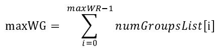

where:

maxWR is the total number of WUS resources configured for the gap.

numGroupsList[i] is the number of WUS groups configured for WUS resource i, provided in gwus-Config, for the gap.

 WUS ) where the first entry corresponds to the first WUS group on the first configured WUS resource, the second entry corresponds to the second WUS group on the first configured WUS resource and so on, with the last entry corresponds to the last WUS group on the last configured WUS resource.

numGroupsList.

For a BL UE or UE in enhanced coverage, UE determines  resourceof the configured resources as specified in clause 7.5.4.

If probThreshList is present in gwus-Config, the UE determines the WUS group sets as defined in Table 7.5.2.1. The total number of WUS group sets is equal to the number of entries in probThreshList + 1. The WUS groups are first assigned to WUS group set 1, followed by WUS group set 2, and so on. The UE determines the WUS group set corresponding to its probability PNAS, if configured, as defined in Table 7.5.2-1. If PNAS is not configured, the UE selects the WUS group set with the index equal to the number of entries in probThreshList + 1.

Table 7.5.2-1: WUS group set definition when probThreshList is configured  
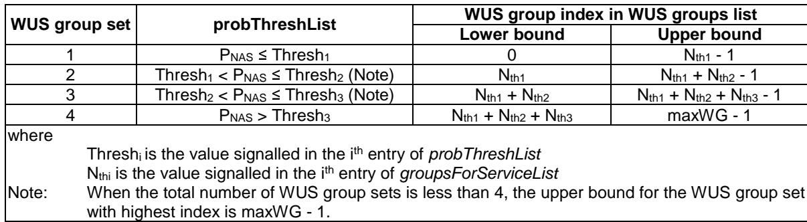

If probThreshList is not present in gwus-Config, there is only one WUS group set containing all the WUS groups configured in numGroupsList. The total number of WUS groups is maxWG.

## 7.5.3 WUS group selection

After selection of the WUS group set as specified in clause 7.5.2, the UE selects the WUS group to monitor as below.

For BL UE or UE in enhanced coverage, the UE determines wg with following equation:

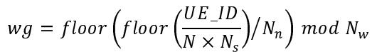

For NB-IoT, the UE determines wg with following equation:

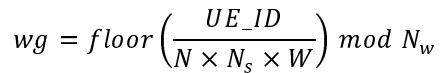

where:

UE\_ID, N, Ns, Nn and W are defined in clause 7.1.

\- Nw is the number of WUS groups in the selected WUS group set.

wg is the index of the WUS group in the selected WUS group set, determined as defined in clause 7.5.2, 0 .. Nw-1.

If probThreshList is not present, WG = wg. If probThreshList is present, the UE determines WG, the index of the corresponding WUS group within the WUS groups list, as defined in Table 7.5.3-1.

Table 7.5.3-1: Index of the WUS group to monitor  
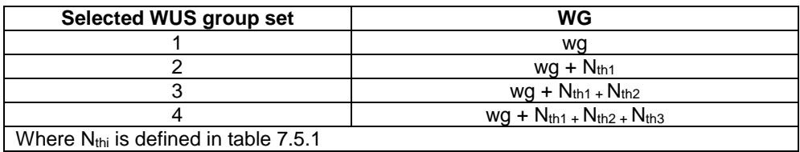

in TS 36.213 [6].

## 7.5.4 WUS Group Alternation

If groupAlternation is present in gwus-Config, the UE determines the WUS group to monitor for the current PO as follows:

\- if probThreshList is not present in gwus-Config and commonSequence is set to g0:

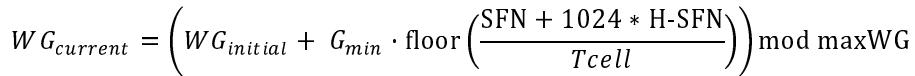

where:

\- Tcell is the default DRX cycle for the cell.

SFN is the SFN corresponding to the PO.

H-SFN is the H-SFN corresponding to the PO.

maxWG is the total number of WUS groups configured in numGroupsList for the gap.

Gmin is the lowest number of WUS groups configured amongst all WUS resources for the gap.

\- WGcurrent is the index of the WUS group to monitor for the current PO.

\- WGinitial is the index, WG, of the WUS group determined in clause 7.5.3.

else:

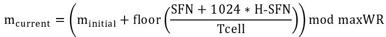

where:

\- Tcell is the default DRX cycle for the cell.

SFN is the SFN corresponding to the PO.

\- H-SFN is the H-SFN corresponding to the PO.

maxWR is the total number of WUS resources configured in numGroupsList for the gap.

minitial is defined based on resource given in the entry corresponding to the index WG determined in clause 7.5.3:

\- For a BL UE or UE in enhanced coverage:

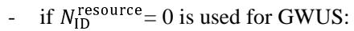

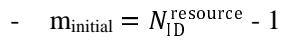

else:

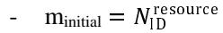

\- mcurrent is used to determine resource of the WUS group to monitor for the current PO as follows:

\- For a BL UE or UE in enhanced coverage:

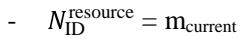

else:

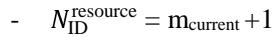

groupWG determined in clause 7.5.3.

## 7.5.5 WUS Resource Location for BL UEs and UEs in Enhanced coverage

A BL UE or UE in enhanced coverage determines the time/frequency location of WUS resources based on the number IDfrequency location for WUS resource 0 is defined by frequencyLocation parameter in wus-Config. Otherwise, frequency location for WUS resource 0 is defined by resourceLocationWithoutWUS in gwus-Config. The frequency location of other WUS resources (i.e., WUS resource 1, 2, 3), based on frequency location of WUS resource 0, is given in Table 7.5.5-1.

Table 7.5.5-1: WUS resource frequency location  
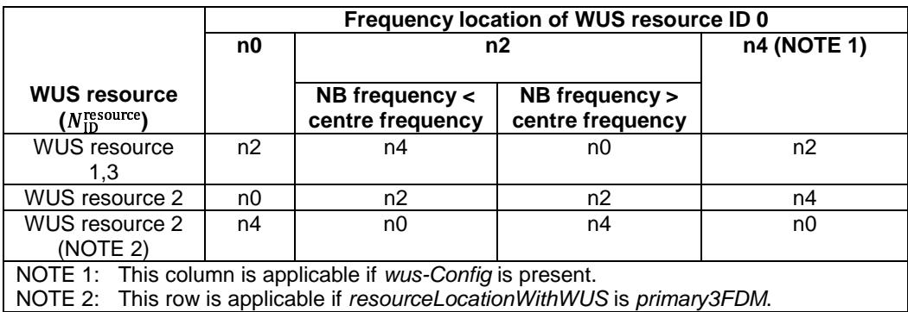

The timeoffset, g0, from the end of WUS resource 0 and WUS resource 1 to the start of corresponding PO is determined as defined in clause 7.4. Except when resourceLocationWithWUS is set to primary3FDM , the timeoffset from the end of WUS resource 2 and WUS resource 3 to the start of corresponding PO is sum of the timeoffset g0 and the maximum WUS duration. When resourceLocationWithWUS is set to primary3FDM, the timeoffset for WUS resource 2 is same as WUS resource 0 and 1.

The resource pattern ID (rp-ID) which indicates the WUS resources applicable for GWUS is derived based on resourceMappingPattern and the configured number of WUS resources as follows:

If resourceLocationWithWUS is configured:

rp-ID = 2\*(maxWR - 1) if resourceLocationWithWUS is set to primary.

rp-ID = 2\*maxWR - 1 if resourceLocationWithWUS is set to secondary.

rp-ID = 7 if resourceLocationWithWUS is set to primary3FDM.

If resourceLocationWithoutWUS is configured:

rp-ID = 2\*(maxWR - 1)

where maxWR is the total number of WUS resources configured in numGroupsList for the gap.

The WUS resource IDs corresponding to the resource pattern ID are determined as defined in Table 7.5.5-2.

Table 7.5.5-2: WUS resources applicable for Resource Pattern  
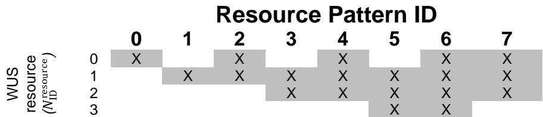

IDindex of the WUS resources in numGroupsList.

## 7.6 NRS presence on non-anchor paging carrier in NB-IoT

For FDD, when nrs-NonAnchorConfig is signalled in system information, the POs with associated NRS are determined using the DRX parameters broadcast in systeminformationBlockType2-NB:

\- T is the value of defaultPagingCycle broadcast in system information.

nB is the value corresponding to nB broadcast in system information: 4T, 2T, T, T/2, T/4, T/8, T/16, T/32, T/64, T/128, T/256, T/512, and T/1024.

The POs are determined by:

\- Paging Frame (PF) given by: SFN mod T= (T div N) \* k

where:

\- N: min(T, nB)

\- k: 0, 1, .., N-1

\- Paging subframe given by index i\_s

where:

\- Index i\_s: values pointing to a subframe for which a PO is defined in the row referenced by Ns in clause 7.2.

\- Ns: max(1, nB/T)

The POs with associated NRS are determined as follows:

\- if nB is equal to 4T, 2T, T or T/2:

POs for which R = 1 have associated NRS

where:

R = (PO\_Index+ Offset) mod 2

where:

\- PO\_Index = (SFN \* nB/T + i\_s) mod nB

Offset = (FLOOR ((SFN + 1024\*H-SFN) / T)) mod 2

SFN is the SFN corresponding to the PO

H-SFN is the H-SFN corresponding to the PO

\- i\_s is the index i\_s corresponding to the PO

else:

all POs have associated NRS.

## 7.7 Coverage based paging

Coverage-based paging carrier selection is only used in the cell in which the UE most recently entered RRC-IDLE triggered by:

\- reception of RRCEarlyDataComplete-NB or RRCConnectionRelease-NB;

and the message includes cbp-Index.

Coverage-based paging is enabled when at least one DL carrier in dl-ConfigList is configured with cbp-Index.

When coverage-based paging is used, the UE shall:

\- if cbp-HystTimer is not running:

\- if Srxlev > nrsrpMin in the entry of cbp-ConfigList indexed by value of the received cbp-Index:

use the list of carriers in dl-ConfigList configured with pcch-Config-r17 where the configured cbp-Index equals to the value of the received cbp-Index for carrier selection as described in clause 7.1.

use the nB and ue-SpecificDRX-CycleMin configured in the entry of cbp-ConfigList indexed by value of the received cbp-Index.

else:

use the list of carriers in dl-ConfigList configured with pcch-Config-r14 for carrier selection as described in clause 7.1.

else:

\- continue using list of DL carriers previously selected for carrier selection as described in clause 7.1.

when UE switches between paging carriers configured with pcch-Config-r14 and paging carriers configured with pcch-Config-r17 for carrier selection:

start cbp-HystTimer;

## 8 Logged measurements

The UE may be configured to perform logging of measurement results in RRC\_IDLE mode with the LoggedMeasurementConfiguration message as specified in TS 36.331 [3]. This configuration is valid while the logging duration timer is running.

If the configuration of logged measurements is valid, the UE shall perform logging of measurement results if all of the following conditions are met:

\- The UE is in camped normally state in RRC\_IDLE mode;

The RPLMN of the UE is the same as the RPLMN at the point of time of LoggedMeasurementConfiguration message reception, or is present in the plmn-IdentityList (see TS 36.331 [3]) if configured;

\- The UE is camped on a cell belonging to the areaConfiguration (see TS 36.331 [3]), if configured;

\- The UE is camped on the RAT where the logged measurement configuration was received;

The UE receives MBMS service from MBSFN area(s) belonging to targetMBSFN-AreaList, if included in the logged measurement configuration;

\- The IDC capable UE does not detect the presence of in-device coexistence interference.

If the configuration of logged measurements is valid, but the UE is in any cell selection state in RRC\_IDLE mode, the UE perform logging of available information (i.e. at least indicator on any cell selection state and time stamp).

If the configuration of logged MBSFN measurements is valid, the UE shall perform logging of measurement results in RRC\_CONNECTED in addition to RRC\_IDLE, as described in TS 36.331 [3].

If the configuration of event-triggered logged measurements is valid, the UE shall perform logging of measurement results whenever the conditions for the configured event are met as specified in TS 36.331 [3].

Otherwise, the logging of measurement results shall be suspended.

NOTE: Even if logging of measurement results is suspended, the logging duration timer and time stamp will continue, and the logged measurement configuration and corresponding log are kept.

## 9 Accessibility measurements

The UE logs failure information when the RRC connection establishment procedure fails as specified in TS 36.331 [3].

## 10 Mobility History Information

The UE stores the history of serving cells as specified in TS 36.331[3].

## 11 Sidelink operation

## 11.1 Sidelink communication and V2X sidelink communication and NR sidelink communication

The UE may transmit or receive sidelink communication if it fulfils the condition(s) defined in TS 36.331 [3], clause 5.10.1a. The UE may transmit or receive V2X sidelink communication if it fulfils the condition(s) defined in TS 36.331 [3], clause 5.10.1d. When UE is in-coverage for sidelink operation as defined in clause 11.4, the UE may perform the sidelink communication according to SystemInformationBlockType18 or perform the V2X sidelink communication according to SystemInformationBlockType21 or SystemInformationBlockType26, and when out-of-coverage for sidelink, the UE may perform the sidelink communication according to SL-Preconfiguration or perform V2X sidelink communication according to SL-V2X-Preconfiguration or according to SystemInformationBlockType21 or SystemInformationBlockType26 of the cell on the frequency which provides inter-carrier V2X sidelink configuration, as specified in TS 36.331 [3]. The UE shall not perform V2X sidelink communication according to SL-V2X-Preconfiguration if the UE detects a cell providing V2X sidelink configuration or inter-carrier V2X sidelink configuration for the frequency UE is interested to perform V2X sidelink communication on.

The UE may transmit or receive NR sidelink communication if it fulfills the condition(s) defined in TS 38.331 [37], clause 5.8.2. When UE is in-coverage for sidelink operation as defined in clause 11.4, the UE may perform NR sidelink communication according to SystemInformationBlockType28 of the cell on an E-UTRAN frequency.

## 11.2 Sidelink discovery

The UE may transmit sidelink discovery if it fulfils the condition(s) defined in TS 36.331 [3], clauses 5.10.1b and 5.10.1c. When UE is in-coverage for sidelink as defined in clause 11.4, the UE may perform the sidelink discovery according to SystemInformationBlockType19, and when out-of-coverage for sidelink as defined in clause 11.4, the UE may perform the sidelink discovery according to SL-Preconfiguration, as specified in TS 36.331 [3].

NOTE: Sidelink discovery reception in idle mode is up to UE implementation.

## 11.3 Sidelink synchronisation

The UE may perform sidelink synchronisation according to SystemInformationBlockType18 for sidelink communication, SystemInformationBlockType19 for sidelink discovery or SystemInformationBlockType21 for V2X sidelink communication, as specified in TS 36.331 [3].

## 11.4 Cell selection and reselection for sidelink

The requirements defined in this clause for sidelink operation apply for UEs in RRC\_IDLE and in RRC\_CONNECTED.

When UE is interested to perform sidelink communication or sidelink discovery announcement on non-serving frequency, it shall perform measurements on that frequency for cell selection and intra-frequency reselection purpose in accordance with TS 36.133 [10]. When UE is interested to perform V2X sidelink communication on non-serving frequency, it may perform measurements on that frequency or the frequencies which can provide inter-carrier V2X sidelink configuration for that frequency for cell selection and intra-frequency reselection purpose in accordance with TS 36.133 [10]. When UE is interested to perform NR sidelink communication on non-serving frequency, it may perform measurements on that frequency or the frequencies which can provide inter-carrier NR sidelink configuration for that frequency for cell selection and reselection purpose in accordance with TS 36.133[10].

If the UE detects at least one cell on the frequency which UE is configured to perform sidelink operation on fulfilling the S criterion in accordance with clause 11.4.1, it shall consider itself to be in-coverage for sidelink operation on that frequency. If the UE cannot detect any cell on that frequency meeting the S criterion, it shall consider itself to be out-ofcoverage for sidelink operation on that frequency.

If the UE detects at least one cell on the frequency which UE is configured to perform NR sidelink communication on fulfilling the S criterion in accordance with clause 11.4.1, it shall consider itself to be in-coverage for NR sidelink communication on that frequency. If the UE cannot detect any cell on that frequency meeting the S criterion, it shall consider itself to be out-of-coverage for NR sidelink communication on that frequency.

If the UE has selected a cell on a non-serving frequency for sidelink communication or V2X sidelink communication or sidelink discovery announcement, it shall perform additional intra-frequency reselection process to select a better cell for sidelink operation on that frequency in accordance with clause 11.4.1.

If the UE has selected a cell on a non-serving frequency for NR sidelink communication, it shall perform additional reselection process to select a better cell for sidelink operation in accordance with clause 11.4.1.

NOTE 1: The UE may consider the carrier pre-configured for sidelink communication or V2X sidelink communication, or the frequencies pre-configured for providing inter-carrier V2X sidelink configuration to have the highest cell reselection priority in accordance with clause 5.2.4.1.

NOTE 2: If the frequency the UE is configured to perform sidelink communication on is a serving frequency, the UE uses the serving cell on that frequency for the sidelink operation.

## 11.4.1 Parameters used for cell selection and reselection triggered for sidelink

When evaluating S criterion, R criterion (ranking) or inter-frequency cell reselection criterion, as defined in clause 5.2.3.2, clause 5.2.4.6 and clause 5.2.4.5 respectively, for cell selection/reselection triggered for sidelink communication or V2X sidelink communication or sidelink discovery announcement or NR sidelink communication on a non-serving frequency, UE shall perform the evaluation as follows:

if the UE intends to perform sidelink discovery announcement and it is configured with discCellSelectionInfo applicable for that frequency as specified in TS 36.331 [3], the UE shall use cell selection/reselection parameters included in the discCellSelectionInfo for the evaluation, and for a parameter used in the evaluation but not included in the discCellSelectionInfo applicable for that frequency, UE shall apply zero value.

else, the UE shall use cell selection/reselection parameters broadcast by the concerned cell (i.e. selected cell for the sidelink operation) for the evaluation.

## 12. General description of UE camping on E-UTRA connected to 5GC

The functions listed below are applicable to UE camping on E-UTRA connected to 5GC:

\- RAN paging (only applicable to RRC\_INACTIVE state)

Unified Access Control

The functions listed below are not applicable to UE camping on E-UTRA connected to 5GC:

\- 5.5 Support for manual CSG selection

\- 5.6 RAN-assisted WLAN interworking

\- 6.2 Reception of MBMS

\- 7.3 Paging in extended DRX (except for BL UE, UE in enhanced coverage or NB-IoT UE)

\- 8 Logged measurements

\- 9 Accessibility measurements

\- 11 Sidelink operation

Annex A (informative): Void

# Annex B (informative): Example of Hashed ID Calculation using 32-bit FCS

## Inputs:

\- Least significant bits of S-TMSI: 0x12341234

Generator polynomial: 0x104C11DB7 (1 0000 0100 1100 0001 0001 1101 1011 0111)

Procedure to Calculate Hashed ID:

step a)

\- k = 32

numerator: 0xFFFF FFFF 0000 0000

denominator: 0x1 04C1 1DB7

\- remainder Y1 = 0xC704DD7B

step b)

numerator: 0x1234 1234 0000 0000

denominator: 0x1 04C1 1DB7

\- remainder Y2 = 0x1D66F1A6

Hashed\_ID = FCS = ones complement of (remainder Y1 XOR remainder Y2)

= ones complement of (0xC704DD7B XOR 0x1D66F1A6)

= negation of (0xDA622CDD)

= 0x259DD322

## Annex C (informative): Change history

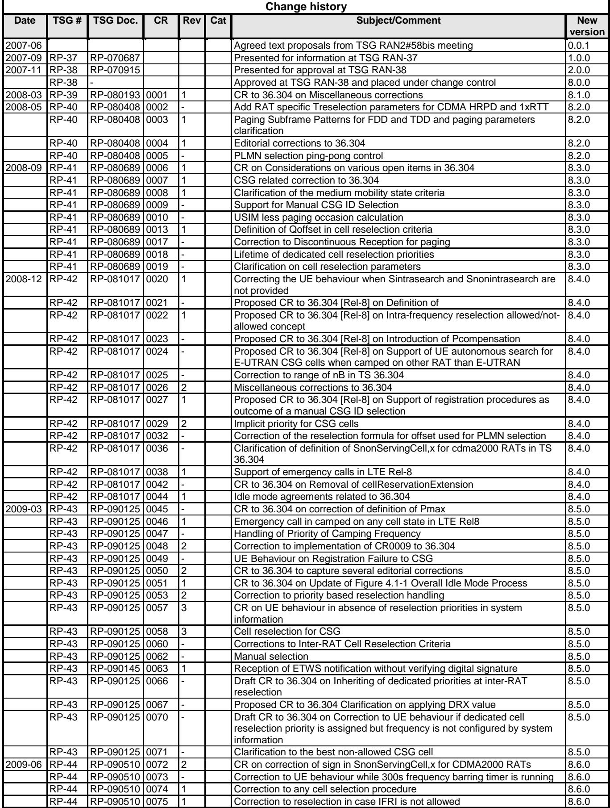

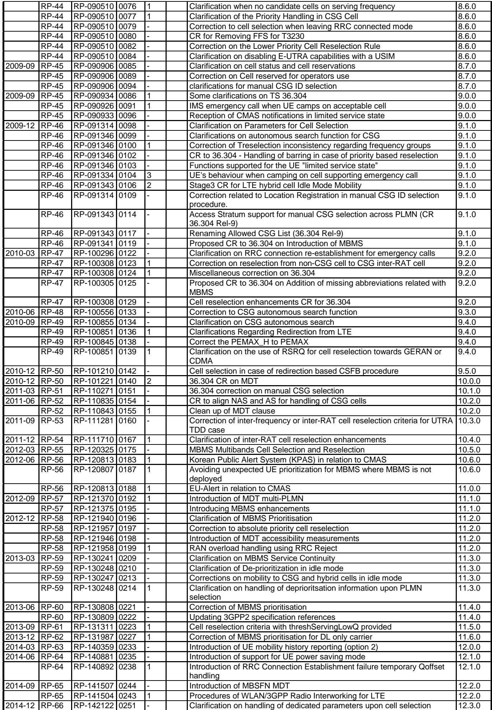

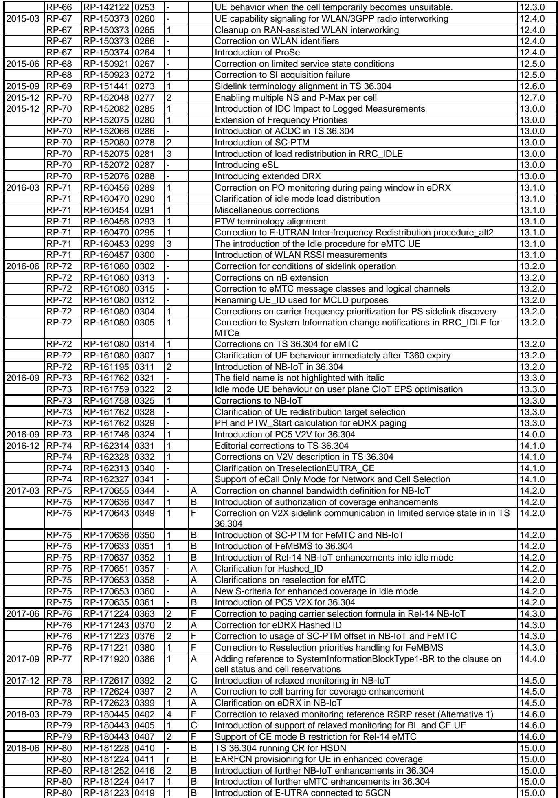

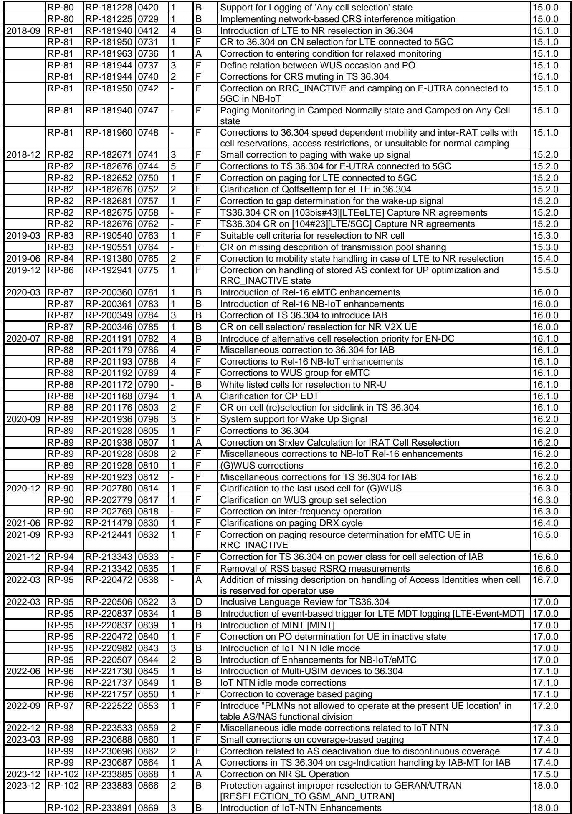

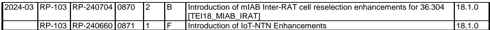

History

