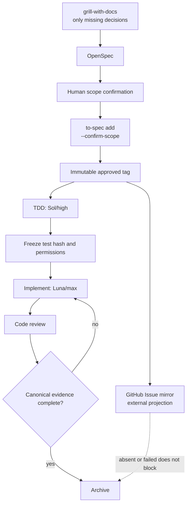

# Code Implementation Flow

Use this page when starting, reviewing, or archiving an OpenSpec-backed code
change. OpenSpec remains the canonical record; GitHub Issues only display its
approved revision.

## Minimal flow

```text
grill-with-docs
  → OpenSpec
  → human scope confirmation
  → approved tag
  → GitHub Issue mirror and TDD (parallel)
  → implement
  → code-review
  → archive
```



Use [grill-with-docs](../.agents/skills/grill-with-docs/SKILL.md) only to
resolve missing behavior, non-goals, owner, acceptance/evidence, or rollback
decisions. Do not turn a complete plan into another interview.

## Pipeline responsibilities

| Stage | Owner | Completion evidence | Does not block it |
|---|---|---|---|
| `grill-with-docs` | Human and agent | Missing decision is explicit | A complete plan needs no new interview |
| OpenSpec | Human-approved proposal | Proposal, design, spec, and tasks | GitHub Issue |
| Approval | Human; agent runs the approved operation | Immutable annotated tag | Manual Git commands by the user |
| Mirror | GitHub Actions | One matching read-only Issue or diagnosis | TDD, implementation, archive |
| TDD | Sol/high | Frozen test hash and baseline | Live GitHub access |
| Implement | Luna/max | Frozen tests pass | Commit permission |
| Code review | Review workflow | Boundary, business-logic, readability review | Mirror success alone |
| Archive | OpenSpec workflow | Approved tag, completed canonical tasks, validation, review | Absent or `failed` Issue mirror |

## Approval and mirror

After explicit human approval, the agent runs:

```text
to-spec add <change-id> --confirm-scope
```

It creates and pushes only the immutable annotated tag:

```text
openspec/<change-id>/approved/<short-sha>
```

The user does not separately run `git tag` or `git push`. The tag annotation
records the confirmation, parent task, full SHA, and proposal path. The tag
push triggers the GitHub Issue mirror. A repeated operation accepts an existing
remote tag only when its target SHA and annotation match; it never overwrites a
tag. If local creation succeeded but remote push is uncertain, retain the local
tag and safely retry the same push. Local tag existence alone is not proof that
the remote received it.

Before tag creation, check only the requested
`openspec/changes/<change-id>/` directory. It must have no modified, deleted,
or untracked content, so the approved tag identifies exactly the OpenSpec
revision that was reviewed. Unrelated dirty worktree paths do not block it.

`to-spec add` uses only `origin`. It verifies that `origin` exists and is
reachable before creating a tag. A missing or unreachable preflight stops with
exit `1` and creates no tag; a later uncertain push preserves the already
created local tag for safe retry.

The tag annotation is fixed and machine-parseable. Root changes write
`Parent: none`:

```text
OpenSpec approved revision
Human scope confirmation: confirmed
Change: <change-id>
Parent: <parent-change-id|none>
Parent tag: <parent-approved-tag|none>
Commit: <full-sha>
Proposal: openspec/changes/<change-id>/proposal.md
```

The first implementation of `to-spec add` is the only self-hosting exception.
After explicit human approval and commit, the agent may use `rtk git` in one
action to create and push exactly the parent and child fixed-format tags because
the helper does not yet exist. The child tag carries its parent tag, so it can
link to the parent's immutable proposal. Record that action as bootstrap
evidence. All later changes use automatic `to-spec add` only.

For a child change, resolve `Parent tag` before any GitHub API call. It must be
an annotated approved tag whose `Change` is the declared `Parent`, and its
target must match its declared `Commit`. Otherwise refuse before API access.

## Version boundary guide

Before the first `to-spec add` TDD, create one **pipeline-contract baseline
commit**. It contains only the approved rules and reader documentation:

```text
include
- .agents/skills/to-spec/SKILL.md
- .codex/skills/openspec-archive-change/SKILL.md
- openspec/changes/govern-skill-pipeline-contract/
- openspec/changes/implement-github-issue-mirror-publisher/
- redcap_library/code_implementation.md
- redcap_library/README.md

exclude
- redcap_library/bash_tool/scripts/to_spec_status.sh
- redcap_library/bash_tool/scripts/test_to_spec_status.sh
- redcap_library/bash_tool/registry.json
```

The approved parent and child tags may point to this same baseline commit, but
remain independent immutable tags. Because `to-spec add` does not yet exist,
the agent uses the one-time `rtk git` bootstrap only after explicit approval
and commit.

The decision context under `agent_doc/Project_management/` is intentionally
Git-ignored local project-management evidence. Do not force-add it to this
baseline; OpenSpec and this library page are the tracked traceability record.

Keep production code, its tests, and registry updates outside this baseline.
They enter a later code commit only after the frozen TDD test passes and
`$code-review` completes. Do not include unrelated dirty worktree paths in
either commit.

The unreviewed `to_spec_status.sh` draft and its test remain reference material
only. Do not register or ship them before Sol/high writes and freezes the
approved public-boundary tests.

The `to-spec add` test fixture is isolated beneath
`redcap_library/.test_tmp/to_spec_add.<random>/`, with a temporary worktree and
local bare remote. Its cleanup removes only its own random directory. It never
uses GitHub, network, credentials, the repository's real Git metadata, or
generated mirror state.

The mirror is one read-only Issue:

```text
[OpenSpec] <change-id>
```

It links to the approved OpenSpec proposal and, for a child task, its parent
proposal. It does not own requirements, owner, priority, schedule, or
acceptance decisions.

## One-time deployment conditions

A repository administrator performs these once before the first live mirror:

- Enable GitHub Actions.
- Grant `issues: write` to the publisher job only.

The daily cleanup job receives no Issue permission and makes no GitHub API
call. It runs only on a self-hosted runner with persistent staging; a
GitHub-hosted fresh checkout must reject the configuration rather than claim a
successful no-op cleanup. There is no special first-tag approval or bootstrap
release phase: the first later valid approved tag follows the same route as
every other tag.

## TDD, implementation, and review

For code changes, record the public seam, acceptance condition, irreversible
side effects, model/effort, frozen test hash, and test-diff baseline before
implementation. If boundary, acceptance, or irreversible side effects are
unclear, stop before writing a test and use `grill-with-docs`.

### Reusable reference: fail-closed KPM qualification tracer

This run-specific reference records the Task 3.5 `ul-prb-cap-v1` first vertical
slice. It does not replace the user-selected model/effort gate above.

| Step | Recorded practice |
| --- | --- |
| Decide | Record the profile-owned measurement-post decision in OpenSpec before writing a tracer. The initial policy is `UNFROZEN`; observation is allowed but E2SM-RC control is not. |
| Boundary | Test `NativeFlexric.qualify("ul-prb-cap-v1")`, not a private callback collector or a Docker/live-E2 path. |
| Arrange | Supply one eligible node, distinct supported cell/UE styles, primitive observations, a complete KPM-to-RC UE binding, and UE `source_seq_origin="e2_indication"`. Leave the measurement-post policy unfrozen. |
| RED | Add one separate refusal-path test in `redcap_library/bash_tool/scripts/test_redcap_drl_xapp.py`. Assert the independent literal `MEASUREMENT_POST_UNFROZEN`, `failed_stage="qualification"`, and `control_attempted=false`. Retain the prior source-sequence tracer unchanged. |
| Evidence | Run the full Python suite and keep a timestamped log in `test_log/compiler_logs/`. The RED log recorded `KPM_QUALIFICATION_POLICY_REQUIRED`; the matching GREEN log recorded 31/31 passing tests. |
| GREEN | Change only the terminal qualification refusal needed by the tracer. Do not add policy loading, freshness/skew/sample logic, a candidate controller, Docker activity, KPM live subscription, or E2SM-RC control. |
| Review | Check the narrow source diff, `git diff --check`, Python syntax, and strict OpenSpec validation. State the remaining evidence boundary explicitly. |

The F1AP test reference is its shape: construct known-good input, call the
public seam, and assert the observable result. Do not copy its CMake target or
assert private implementation call order into the Python bridge test.

For this recorded slice the user selected GPT-5.6 Terra/high for TDD and
GPT-5.6 Luna/max for the minimal GREEN implementation. The TDD contract and
RED/GREEN evidence remain in
`openspec/changes/build-redcap-drl-xapp-gated-runtime/design.md` and
`test_log/compiler_logs/drl_xapp_task35_measurement_post_unfrozen_*.log`.

Use GPT-5.6 Sol/high to design and write TDD tests. GPT-5.6 Terra/high is a
fallback only when Sol is unavailable and the reason is recorded in the TDD
contract. GPT-5.6 Luna/max implements production code only after tests are
frozen.

Implementation does not alter frozen tests. Code review verifies the agreed
behavior through boundary, business-logic, and readability lenses. For
documentation or governance changes, use a validation contract and review
links, consistency, and boundaries instead of inventing program tests.

## Archive gate

Archive only when all of the following exist:

1. A valid approved annotated tag.
2. Completed canonical OpenSpec implementation, validation, and review tasks.
3. For code: frozen TDD evidence and completed code review.
4. For documentation/governance: validation-contract evidence and completed review.

Do not wait for a real GitHub Issue to succeed. An absent or `failed` mirror is
external operational evidence: preserve its diagnosis and recover it later
idempotently, but do not treat completed canonical work as unarchivable.

## Related records

- [Pipeline parent proposal](../openspec/changes/govern-skill-pipeline-contract/proposal.md)
- [GitHub mirror publisher proposal](../openspec/changes/implement-github-issue-mirror-publisher/proposal.md)
- [to-spec contract](../.agents/skills/to-spec/SKILL.md)
- [archive skill](../.codex/skills/openspec-archive-change/SKILL.md)
