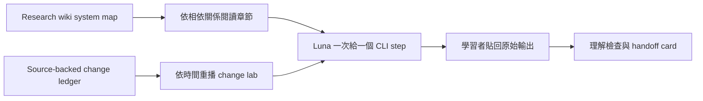

# Luna CLI Trace 工程教科書

本教材用來學會兩件事：理解 RedCap、A-IoT/AIOTF、xApp/dApp 的
修改內容，以及親自使用 CLI 把一項參數追到 source owner、控制判斷與
可觀察證據。Luna 是導讀教練，不是技術證據來源。

## 在 Obsidian 開啟

1. 在 Obsidian 選擇 **Open folder as vault**。
2. 選擇 repository 根目錄
   `/home/tonywang/OAI/Red_cap_openairinterface5g_exp`。
3. 開啟本頁：
   `redcap_library/luna_cli_trace_course/README.zh-TW.md`。

Repository 根目錄必須是 vault boundary，因為教材需要連到
`openair1/2/3`、research wiki、project plans 與 OpenSpec。教材只使用
標準 Markdown 相對連結及 Obsidian 原生 Mermaid，不要求外掛。

## 目前交付

| 項目 | 狀態 | 入口 |
| --- | --- | --- |
| Source-backed change ledger | Ready | [開啟 ledger](change-ledger.md) |
| Chapter 00–10 工程教科書 | Review required | [從 Chapter 00 開始](chapters/00-cli-and-evidence.md) |
| 個人進度 | 本機未追蹤 | 建立 `local-progress.md`；本目錄已忽略該檔 |

## 雙軸學習方式

### 軸 A：系統化章節

| 順序 | 章節 | 狀態 | System map |
| ---: | --- | --- | --- |
| 00 | [CLI 與證據層級](chapters/00-cli-and-evidence.md) | Review required | [Research method](../../agent_doc/Project_management/redcap_research_wiki/concepts/evidence-first-research-method.md) |
| 01 | [Change intake 與 source owner](chapters/01-change-intake-and-source-owner.md) | Review required | [Simulator decision contract](../../agent_doc/Project_management/redcap_research_wiki/decisions/simulator-decision-contract.md) |
| 02 | [RedCap config 與 capability](chapters/02-redcap-config-and-capability.md) | Pilot approved | [Configuration and capability](../../agent_doc/Project_management/redcap_research_wiki/systems/redcap/configuration-capability.md) |
| 03 | [BWP、RA 與 scheduling](chapters/03-bwp-ra-and-scheduling.md) | Review required | [BWP, RA, and scheduling](../../agent_doc/Project_management/redcap_research_wiki/systems/redcap/bwp-ra-scheduling.md) |
| 04 | [RRC_INACTIVE、DRX 與 SDT](chapters/04-inactive-drx-and-sdt.md) | Review required | [Inactive, power, and SDT](../../agent_doc/Project_management/redcap_research_wiki/systems/redcap/inactive-power-sdt.md) |
| 05 | [Runtime validation](chapters/05-runtime-validation.md) | Review required | [Runtime evidence](../../agent_doc/Project_management/redcap_research_wiki/systems/redcap/runtime-evidence.md) |
| 06 | [A-IoT Tag 與 UE Reader](chapters/06-aiot-tag-and-reader.md) | Review required | [Tag and Reader](../../agent_doc/Project_management/redcap_research_wiki/systems/aiot/tag-reader.md) |
| 07 | [AIOTF、CN5G 與 standard-path stop](chapters/07-aiotf-cn5g-and-standard-stop.md) | Review required | [AIOTF](../../agent_doc/Project_management/redcap_research_wiki/systems/aiot/aiotf.md) |
| 08 | [xApp 與 E2 control](chapters/08-xapp-and-e2-control.md) | Review required | [xApp observation/control](../../agent_doc/Project_management/redcap_research_wiki/systems/xapp-dapp/xapp-observation-control.md) |
| 09 | [dApp guard、gNB apply 與 rollback](chapters/09-dapp-guard-apply-and-rollback.md) | Review required | [gNB apply/rollback](../../agent_doc/Project_management/redcap_research_wiki/systems/xapp-dapp/gnb-apply-rollback.md) |
| 10 | [Change replay capstone](chapters/10-change-replay-capstone.md) | Review required | [Outcome evidence](../../agent_doc/Project_management/redcap_research_wiki/systems/xapp-dapp/outcome-evidence.md) |

### 軸 B：歷史修改重播

先在 [change ledger](change-ledger.md) 選一個已具備三方佐證的 change
family，再進入對應章節。三方佐證是：

1. Project 或 OpenSpec record。
2. Affected source path。
3. Validation 或 retained-evidence owner。

未滿足三項者不標記 Codex authorship，並留為 `[Needs Verification]`。

## 每次 60–90 分鐘的使用方法

1. 只開一章，先讀「問題與邊界」。
2. 把章節的 Luna prompt 貼給教練。
3. Luna 只給一個 CLI 指令；由您執行並貼回完整輸出。
4. 確認 producer、consumer、guard 與 marker 後才進下一步。
5. 回答三題理解檢查，再保存本機 handoff card。

## 證據邊界

教材使用下列階梯；停在最強的已完成層級：

1. Definition/reference。
2. Source implementation。
3. Producer called/transport observed。
4. ACK。
5. Accept/reject。
6. Apply/snapshot/rollback marker。
7. UE-visible/peer-visible completion。
8. Outcome metric。

Build、container healthy、attach、ping、transport 或 ACK 都不能自動推導
後續層級。詳細研究方法見
[evidence-first research method](../../agent_doc/Project_management/redcap_research_wiki/concepts/evidence-first-research-method.md)。

## Canonical 素材入口

- [既有三週導讀課程](../../redcap_doc/manuals/aiot_redcap_to_aiotf_two_week_course.zh-TW.md)
- [RedCap 參數實作與驗證導讀](../../agent_doc/Project_management/projects/redcap_mmtc_priority_execution_v1/redcap_parameter_implementation_validation_tutorial.md)
- [RedCap L1-L3 function lookup](../../redcap_doc/specs/function_reference/redcap_l1_l3_function_lookup.md)
- [A-IoT/AIOTF function trace](../../redcap_doc/specs/function_reference/aiot_tag_aiotf_function_trace.md)
- [xApp/dApp SDK guide](../../agent_doc/Project_management/projects/redcap_dapp_xapp_sdk_test_validation_v1/Doc/sdk_development_guide.zh-TW.md)

## 本輪停止點

本輪完成 Chapter 00–10 的 core review draft。它不執行 L4 runtime，也不
同步或取代 canonical 文件。A-IoT standard path停在缺少matched AMF/RAN/NEF
owner；xApp/dApp outcome停在retained parameter-specific evidence，不宣告一般
效能改善。
