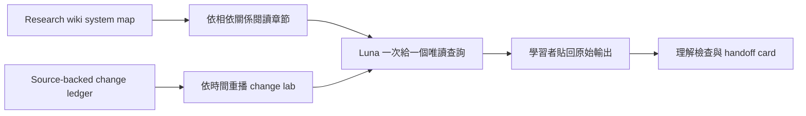

# Luna CLI Trace 工程教科書

完成本教材後，您可以獨立把一項 RedCap、A-IoT/AIOTF 或 xApp/dApp 的修改，
追到它的 source owner、控制判斷與可觀察證據；也能說明目前證據支持什麼、
還不能支持什麼。Luna 是導讀教練，不是技術證據來源；結論仍以 source、
project record、test 或 retained runtime evidence 為準。

## 在 Obsidian 開啟

1. 在 Obsidian 選擇 **Open folder as vault**。
2. 選擇 repository 根目錄
   `/home/tonywang/OAI/Red_cap_openairinterface5g_exp`。
3. 開啟本頁：
   `redcap_library/luna_cli_trace_course/README.zh-TW.md`。

Repository 根目錄必須是 vault boundary，因為教材需要連到
`openair1/2/3`、research wiki、project plans 與 OpenSpec。教材只使用
標準 Markdown 相對連結及 Obsidian 原生 Mermaid，不要求外掛。

## 讀者設定與讀法

本教材假設讀者是大學部三年級的資工或電機學生，已會基本 C/C++、Linux
shell 與網路概念，但沒有 OAI RAN 專案經驗。教材不要求先背完所有縮寫；
每章先讀一個問題，再看主線圖，接著只進行一個唯讀查詢，最後把完整
結果貼給 Luna。讀者要回答的是「這份結果能證明什麼、不能證明什麼」，而
不是把搜尋結果當成答案。

若查詢結果與預期不同，先保留原始輸出並停下。下一步不是擴大搜尋範圍，而是
先確認要找的是程式 owner、Git 歷史，還是文件／log 的內容。

## Luna 導讀與查詢方式

Luna/high 是您的私人導讀教師：一次帶一個唯讀查詢、先請您預測會看到什麼，
再根據您貼回的結果校正理解。它不代替您執行 build、改設定或宣告未提供的
runtime 證據。

| 工作 | 優先工具 | 查詢結果能回答什麼 |
| --- | --- | --- |
| 找程式 owner、symbol、caller 或 callee | Symdex | 定義、關係與所在模組 |
| 看 Git status、diff、log、blame | rtk | 工作樹與版本歷史 |
| 讀 Markdown、PDF、config、log 或一般檔案 | filesystem MCP | 文件或紀錄中的直接內容 |

只有優先工具無法處理查詢時才使用 fallback，並在當次導讀說明原因。即使使用
fallback，source trace 仍不等於 runtime application。

課程維護採三層模型分工：推薦使用 Terra/high 撰寫與修訂章節；Luna/high
執行互動導讀；Sol/high 僅用於跨 owner 或證據互相衝突的困難審查。模型不構成
技術證據。

## 先備詞彙

| 詞彙 | 第一次出現時的意思 |
| --- | --- |
| source owner | 真正擁有這段行為的模組或檔案；不是最先搜到關鍵字的檔案 |
| producer | 產生或寫入某個 state 的函式、parser 或 caller |
| consumer | 讀取該 state 並據此行動的下一個函式或模組 |
| program state | 程式執行期間保存的值，例如 parsed struct、FSM 或 UE context |
| guard | 決定繼續、接受或拒絕的條件判斷 |
| marker | 可觀察的文字、欄位或狀態，表示某一個事件已發生 |
| evidence tier | 這份證據允許主張的最高層級 |
| bounded / frozen | 只限於明確設定的範圍／固定情境，不代表一般化能力 |
| `[Needs Verification]` | 目前缺少足夠證據；保留問題，不用猜測補上 |

教材保留 source 中的英文 identifier（例如 `RRC_INACTIVE`、`RNTI`、
`CONTROL ACK`）以便直接搜尋；說明文字則先用中文，再在括號中放英文。

## 句子與證據的讀法

每章刻意把三種句子分開：

1. **事實**：只描述 source、規格或同一次 run 直接觀察到的內容。
2. **推論**：說明由哪些前提推出哪個結論；前提不完整就停在較低證據層級。
3. **解釋**：說明這個結果對目前問題的意義；示範案例只用來幫助理解，
   不自動證明所有情境都成立。

先定義條件與讀者需要的詞，再給結論。若一句話同時混合多個 owner、時間點
或證據層級，拆成兩句；尚缺的證據留到章末附錄處理。

## 目前交付

| 項目 | 狀態 | 入口 |
| --- | --- | --- |
| Source-backed change ledger | Ready | [開啟 ledger](change-ledger.md) |
| Chapter 00–10 工程教科書 | Review required | [從 Chapter 00 開始](chapters/00-cli-and-evidence.md) |
| DRL Control Run evidence memo | One approved live fixed transaction passed; host-clock and broader interoperability boundaries remain `[Needs Verification]` | [Chapter 08 memo](chapters/08-xapp-and-e2-control.md#15-control-run-orchestration-memo-architecture-decision) |
| 個人進度 | 本機未追蹤 | 建立 `local-progress.md`；本目錄已忽略該檔 |

## 雙軸學習方式

### 軸 A：系統化章節

| 順序 | 章節 | 狀態 | System map |
| ---: | --- | --- | --- |
| 00 | [CLI 與證據層級](chapters/00-cli-and-evidence.md) | Review required | [Research method](../../agent_doc/Project_management/redcap_research_wiki/concepts/evidence-first-research-method.md) |
| 01 | [Change intake 與 source owner](chapters/01-change-intake-and-source-owner.md) | Review required | [Simulator decision contract](../../agent_doc/Project_management/redcap_research_wiki/decisions/simulator-decision-contract.md) |
| 02 | [RedCap config 與 capability](chapters/02-redcap-config-and-capability.md) | Pilot approved | [Configuration and capability](../../agent_doc/Project_management/redcap_research_wiki/systems/redcap/configuration-capability.md) |
| 03 | [BWP、RA 與 scheduling](chapters/03-bwp-ra-and-scheduling.md) | Review required | [BWP, RA, and scheduling](../../agent_doc/Project_management/redcap_research_wiki/systems/redcap/bwp-ra-scheduling.md) |
| 04 | [RRC_INACTIVE、DRX 與 SDT](chapters/04-inactive-drx-and-sdt.md) | Review required | [Inactive, power, and SDT](../../agent_doc/Project_management/redcap_research_wiki/systems/redcap/inactive-power-sdt.md) |
| 05 | [Runtime validation](chapters/05-runtime-validation.md) | Review required | [Runtime evidence](../../agent_doc/Project_management/redcap_research_wiki/systems/redcap/runtime-evidence.md) |
| 06 | [A-IoT Tag 與 UE Reader](chapters/06-aiot-tag-and-reader.md) | Review required | [Tag and Reader](../../agent_doc/Project_management/redcap_research_wiki/systems/aiot/tag-reader.md) |
| 07 | [AIOTF、CN5G 與 standard-path stop](chapters/07-aiotf-cn5g-and-standard-stop.md) | Review required | [AIOTF](../../agent_doc/Project_management/redcap_research_wiki/systems/aiot/aiotf.md) |
| 08 | [xApp 與 E2 control](chapters/08-xapp-and-e2-control.md) | Review required | [xApp observation/control](../../agent_doc/Project_management/redcap_research_wiki/systems/xapp-dapp/xapp-observation-control.md) |
| 09 | [dApp guard、gNB apply 與 rollback](chapters/09-dapp-guard-apply-and-rollback.md) | Review required | [gNB apply/rollback](../../agent_doc/Project_management/redcap_research_wiki/systems/xapp-dapp/gnb-apply-rollback.md) |
| 10 | [Change replay capstone](chapters/10-change-replay-capstone.md) | Review required | [Outcome evidence](../../agent_doc/Project_management/redcap_research_wiki/systems/xapp-dapp/outcome-evidence.md) |

### 軸 B：歷史修改重播

先在 [change ledger](change-ledger.md) 選一個已具備三方佐證的 change
family，再進入對應章節。三方佐證是：

1. Project 或 OpenSpec record。
2. Affected source path。
3. Validation 或 retained-evidence owner。

未滿足三項者不標記 Codex authorship，並留為 `[Needs Verification]`。

## 每次 60–90 分鐘的使用方法

1. 只開一章，先讀「問題與邊界」。
2. 把章節的 Luna prompt 貼給教練。
3. Luna 只給一個唯讀查詢；由您執行並貼回完整結果。
4. 確認 producer、consumer、guard 與 marker 後才進下一步。
5. 回答三題理解檢查，再保存本機 handoff card。

## 證據邊界

教材使用下列階梯；停在最強的已完成層級：

1. Definition/reference。
2. Source implementation。
3. Producer called/transport observed。
4. ACK。
5. Accept/reject。
6. Apply/snapshot/rollback marker。
7. UE-visible/peer-visible completion。
8. Outcome metric。

Build、container healthy、attach、ping、transport 或 ACK 都不能自動推導
後續層級。詳細研究方法見
[evidence-first research method](../../agent_doc/Project_management/redcap_research_wiki/concepts/evidence-first-research-method.md)。

## Canonical 素材入口

- [既有三週導讀課程](../../redcap_doc/manuals/aiot_redcap_to_aiotf_two_week_course.zh-TW.md)
- [RedCap 參數實作與驗證導讀](../../agent_doc/Project_management/projects/redcap_mmtc_priority_execution_v1/redcap_parameter_implementation_validation_tutorial.md)
- [RedCap L1-L3 function lookup](../../redcap_doc/specs/function_reference/redcap_l1_l3_function_lookup.md)
- [A-IoT/AIOTF function trace](../../redcap_doc/specs/function_reference/aiot_tag_aiotf_function_trace.md)
- [xApp/dApp SDK guide](../../agent_doc/Project_management/projects/redcap_dapp_xapp_sdk_test_validation_v1/Doc/sdk_development_guide.zh-TW.md)

## 本輪停止點

本輪完成 Chapter 00–10 的 core review draft。它不執行 L4 runtime，也不
同步或取代 canonical 文件。A-IoT standard path 停在「尚未找到相符的
AMF/RAN/NEF owner」；xApp/dApp outcome 停在「已保留、且只對應特定參數的
證據」，因此不宣告一般效能改善。
