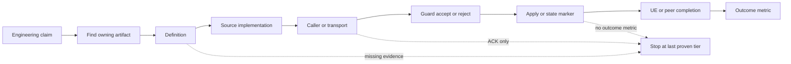
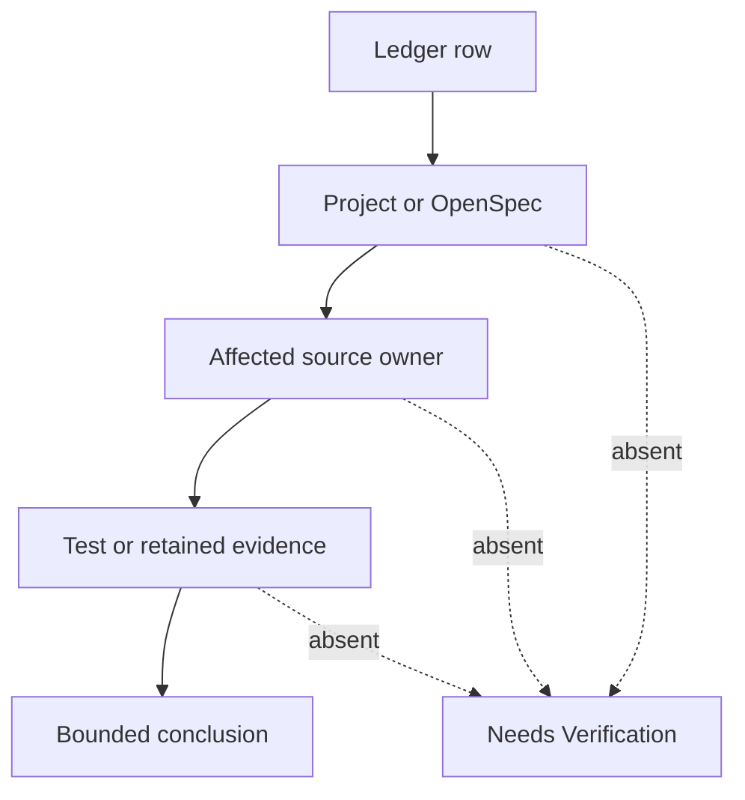

# Chapter 00：CLI 與證據層級

[回到課程首頁](../README.zh-TW.md) ·
[查看 change ledger](../change-ledger.md) ·
[研究方法](../../../agent_doc/Project_management/redcap_research_wiki/concepts/evidence-first-research-method.md)

本章只回答一個問題：**看到一項 RedCap 主張時，如何用唯讀 CLI 找到
owner，並把「存在」與「真的在 runtime 生效」分開？**

### 本章主線

先找出行為的 **source owner**，再確認誰產生 state、誰讀取 state，最後用
evidence tier 限制主張。CLI 是觀察工具；它不會替您補上缺少的 caller 或
runtime marker。

## 1. 學習目標

完成本章後，您應能：

1. 從 repository 根目錄辨識 source、project、OpenSpec、wiki、report。
2. 解釋 `rg`、`sed`、`git diff` 與 `openspec status` 各自能證明什麼。
3. 把 operator input、program state、pass criterion 分開。
4. 用證據階梯停止過度推論。
5. 留下一張 Luna 可直接接續的 handoff card。

### 本章不處理

- 不修改 source、config、文件或 Git state。
- 不執行 build、container、RFsim、CN5G 或 L4 runtime。
- 不把搜尋結果當作 caller 或 runtime 證據。

## 2. 60–90 分鐘配置

| 時間 | 活動 | 產出 |
| ---: | --- | --- |
| 0–10 分 | 建立 repository 地圖 | 知道五種 owner 在哪裡 |
| 10–30 分 | CLI Step 1–3 | 能安全定位檔案與文字 |
| 30–50 分 | CLI Step 4–5 | 能讀 OpenSpec 與 local diff |
| 50–70 分 | 三類參數與證據階梯 | 不混淆輸入、狀態、判準 |
| 70–90 分 | 反證、三題與 handoff | 可進 Chapter 01 |

## 3. 問題與工程邊界

### Expected behavior

一項可追查的工程主張至少要回答：

| 問題 | 優先 owner |
| --- | --- |
| 要做什麼、接受條件是什麼？ | OpenSpec／project plan |
| 哪個元件實作？ | `openair1/2/3`、`executables`、`radio` |
| 哪個輸入啟用它？ | config、CLI、environment、request |
| 哪個 state 被改變？ | owning struct/context/FSM |
| 哪個 marker 才算通過？ | test contract、runtime checklist、report |
| 最強可說到哪裡？ | accepted retained evidence |

### 不可直接推論

- 檔案存在不等於 code path 被呼叫。
- symbol 被呼叫不等於 guard 接受。
- build PASS 不等於 runtime PASS。
- attach 不等於 PDU session、forward ping 或 feature completion。
- E2 `ACK` 不等於 gNB apply，更不等於效能改善。
- 舊 report 只能支持該 frozen scenario，不能自動支持目前工作樹。

## 4. 第一性原理：CLI 是量測工具，不是答案

任何結論都由「被量測的狀態」與「量測方法」共同決定。`rg` 找到文字，
`sed` 顯示局部 source，`git diff` 顯示工作樹與基準的差異；這些命令都不會
直接量到正在執行的程序狀態。Runtime marker 也只表示 marker owner 宣告的
那一個事件，不能代替後續事件。



## 5. 三類參數

| 類型 | 問題 | 例子 | 常見錯誤 |
| --- | --- | --- | --- |
| Operator input | 人或控制器要求什麼？ | YAML field、CLI option、E2 request | 把輸入值當成已套用值 |
| Program state | 程式目前保存什麼？ | parsed struct、FSM、UE context | 只找到 struct 定義，未找 producer/consumer |
| Pass criterion | 什麼觀測才算完成？ | unit assertion、apply marker、forward ping | 用較弱 marker 代替較強判準 |

Pass criterion 不是可隨意調整的「參數」。它是實驗契約；更改它等於更改
問題本身，必須回到 project/OpenSpec owner。

## 6. Repository ownership matrix

| 路徑 | 角色 | 本章可支持的結論 |
| --- | --- | --- |
| [`openair1`](../../../openair1/) | PHY | PHY owner 存在與局部實作 |
| [`openair2`](../../../openair2/) | MAC/RLC/PDCP/RRC/E2/E3 | L2/L3/control owner 存在與局部實作 |
| [`openair3`](../../../openair3/) | NAS/NGAP/GTP/AIOTF | core-facing owner 與 AIOTF 實作 |
| [`agent_doc/Project_management`](../../../agent_doc/Project_management/) | project acceptance/decision | 專案範圍、狀態、停止點 |
| [`openspec/changes`](../../../openspec/changes/) | change contract | requirement、design、tasks |
| [research wiki](../../../agent_doc/Project_management/redcap_research_wiki/README.md) | source-backed routing | owner 地圖，不是新 runtime 證據 |
| [`redcap_library`](../../README.md) | reusable reports/config/tool routes | retained evidence 與重用入口 |

## 7. 修改流程重建

歷史 change 不從檔名猜作者。最小重建順序是：

1. 從 [change ledger](../change-ledger.md) 選 change family。
2. 找 OpenSpec 或 project record，取得 intended behavior。
3. 找 affected source owner 與 caller。
4. 找 test/report owner，辨識 strongest evidence。
5. 若三方不齊，保留 `[Needs Verification]`，不宣告 Codex authorship。



## 8. CLI 導讀

本章命令前綴 `rtk` 是專案提供的精簡輸出 wrapper；真正執行的查詢仍是後面
列出的標準命令。每一步都要保留完整輸出，因為空結果本身也是邊界證據。

### Luna 固定 prompt

```text
你是 Luna CLI 教練。一次只給一個唯讀指令。先解釋指令、主要參數、
預期 owner 與停止條件；等我貼回完整輸出後，要求我指出這份輸出能證明
與不能證明的各一件事。不要執行命令，不要把搜尋或舊報告升級成 fresh
runtime evidence。
```

### Step 1：確認 vault 與 repository boundary

```bash
pwd
```

預期：輸出路徑以 `Red_cap_openairinterface5g_exp` 結尾。若不是，停止並先
回到 repository 根目錄；否則後續相對路徑與 Obsidian 連結基準不同。

### Step 2：看工作樹，不改工作樹

```bash
git status --short
```

主要參數：`--short` 使用穩定的精簡狀態格式。預期可能看到使用者既有
修改；它們不是本課程授權清理的目標。空輸出只表示 Git 未偵測到差異，
不表示 runtime 環境乾淨。

### Step 3：用檔案 owner 限縮搜尋

```bash
rtk rg --files agent_doc/Project_management/redcap_research_wiki openspec/changes redcap_library | rtk sed -n '1,40p'
```

`--files` 只列檔名；`sed -n '1,40p'` 限制認知負荷。預期看到 wiki、change
與 library 路徑。找不到時先檢查 Step 1，不要改成全磁碟搜尋。

### Step 4：查一個可反證的關鍵字

```bash
rtk rg -n 'ACK.*apply|apply.*ACK|ACK alone|ACK-only' agent_doc/Project_management/redcap_research_wiki
```

`-n` 顯示行號。預期找到 ACK/apply 邊界；這證明文件有明文契約，不證明
任何本次 request 曾送達。

### Step 5：讀一個 change 的機械狀態

```bash
rtk openspec status --change redcap-oran-sdk-workflow-v3 --json
```

`--change` 選 owner，`--json` 讓狀態可機械解析。預期看到 artifact/task
狀態。OpenSpec complete 代表 change tasks 完成，不自動代表每個 runtime
outcome 成功。

### Step 6：看局部差異

```bash
git diff -- redcap_library/luna_cli_trace_course
```

`--` 結束 Git options 並鎖定 path。輸出是基準與 tracked working tree 的
差異；untracked 檔案可能不會出現在 diff，因此必須與 Step 2 合讀。

## 9. Boundary value 檢查

| 邊界 | 檢查方式 | 停止條件 |
| --- | --- | --- |
| 空搜尋結果 | 先驗證 path 與 spelling | 不擴大到 `/` 或 home |
| 第一／最後 match | 保留行號與局部上下文 | 不靠單行猜 caller |
| untracked file | `git status --short` | 不把 `git diff` 空輸出當無變更 |
| stale report | 檢查 scenario/date/config owner | 不套用到 current runtime |
| concurrent state | runtime 需 request ID/slot/timestamp | 本章不執行 runtime |

## 10. Competing explanations 與最小 falsifier

現象：搜尋到 `RedCap UL PRB control` marker。

| 解釋 | 目前搜尋能否支持 | 最小 distinguishing check |
| --- | --- | --- |
| Source 具備 marker | 可以 | 讀 marker 所在 function |
| Function 有 production caller | 不足 | 找 caller 與 dispatch branch |
| 本次 request 已 apply | 不足 | 同 request identity 的 fresh gNB log |
| PRB cap 改善效能 | 不足 | 等價 baseline/treatment outcome metric |

因此最小反證檢查是先問：「marker 來自 source，還是來自同一次 runtime
log？」不要因為一個關鍵字就直接跑更大的實驗。

## 11. Evidence ladder

| 層級 | 例子 | 允許主張 |
| ---: | --- | --- |
| 1 | 定義、規格、文件 | interface/期望存在 |
| 2 | source + test | local logic 已實作／可測 |
| 3 | caller/transport | request 到下一 owner |
| 4 | ACK | 對端確認 transport/protocol result |
| 5 | accept/reject | guard 決策完成 |
| 6 | apply/snapshot/rollback | owning state 已處理 |
| 7 | UE/peer completion | 對端完成所需流程 |
| 8 | outcome metric | 指定效應在相符實驗被量測 |

本章 strongest claim：您能用唯讀 CLI 找到 owner 並分類證據。沒有產生
fresh runtime evidence。

## 12. 理解檢查

1. 為何 `git diff` 空白仍不能證明沒有 untracked 教材？
2. `CONTROL ACK rx` 最多支持證據階梯哪一層？還缺哪一層才能說 apply？
3. 一份 56 UE 舊 report 為何不能證明現在 checkout 仍可 56/56？

## 13. Handoff card

把下列內容存到本機未追蹤的 `../local-progress.md`：

```markdown
## Chapter 00 handoff
- repository root:
- inspected owner:
- strongest evidence tier:
- one supported claim:
- one unsupported claim:
- command/output that needs follow-up:
- ready for Chapter 01: yes/no
```

## 14. 下一章入口

進入 [Chapter 01：Change intake 與 source owner](01-change-intake-and-source-owner.md)。

## 15. 教材維護資訊

- Source owners：repository `AGENTS.md`、research wiki、OpenSpec、library README。
- Exact runtime 狀態會變動；本章只教 routing contract。
- 新證據必須由 owning project/report 接受後才能升級結論。
