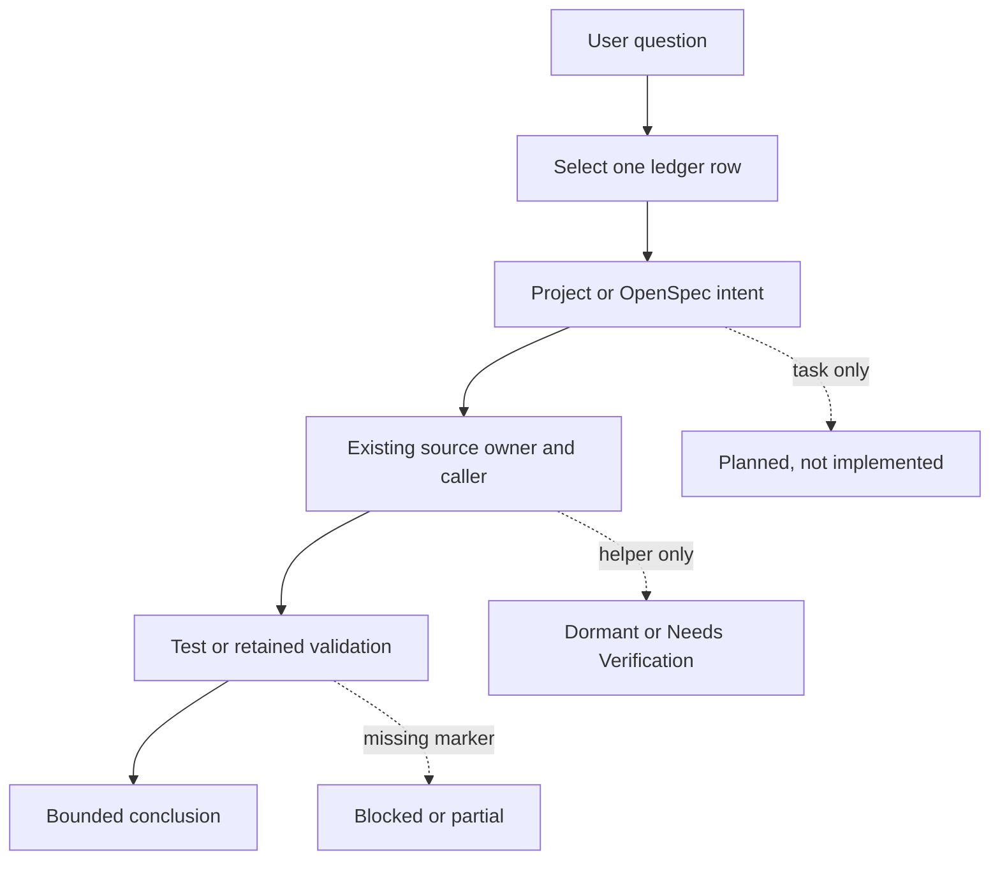

# Chapter 01：Change intake 與 source owner

[回到課程首頁](../README.zh-TW.md) ·
[Change ledger](../change-ledger.md) ·
[Decision contract](../../../agent_doc/Project_management/redcap_research_wiki/decisions/simulator-decision-contract.md)

本章只回答一個問題：**接到「這幾個月 Codex 改了什麼」時，如何把需求
縮成一個可驗證 change slice，而不是從大量 diff 猜故事？**

## 1. 學習目標

完成本章後，您應能：

1. 用 ledger 選出一個具備 project/source/evidence 三方佐證的 change。
2. 分辨 requirement、affected owner、validation acceptance。
3. 使用 OpenSpec 與 `rg` 找到 intended behavior 及 existing owner。
4. 解釋 dirty working tree、commit attribution 與行為證據的差異。
5. 寫出一張 Research Reading Card 與 bounded repair question。

### 本章不處理

- 不用 `git log` 猜作者或把目前 source 全部歸因給 Codex。
- 不修改 OpenSpec task、source 或 report。
- 不執行 change 的 build/runtime command。

## 2. 60–90 分鐘配置

| 時間 | 活動 | 產出 |
| ---: | --- | --- |
| 0–15 分 | 選 ledger row | 一個 bounded change family |
| 15–35 分 | 讀 project/OpenSpec | intended behavior 與 stop point |
| 35–55 分 | 找 source owner/caller | producer-consumer 路線 |
| 55–70 分 | 找 validation owner | strongest evidence 與缺口 |
| 70–90 分 | Research Card、三題、handoff | Chapter 02 起點 |

## 3. 問題與工程邊界

### Expected behavior

Change intake 的產出不是「所有可能相關檔案」，而是一個最小可反證句：

> 在指定 baseline 與 input 下，owner A 產生 state B；consumer C 依 guard D
> 接受或拒絕，並由 marker E 判定完成。

### 不可直接推論

- OpenSpec `complete` 不代表所有外部 blocker 消失。
- project plan 的 planned task 不代表 source 已存在。
- source 中有 helper 不代表 production caller 已接上。
- report 的 PASS 不代表超出 frozen config 的一般化能力。
- local diff 不能單獨證明作者、修改時間或原始動機。

## 4. 第一性原理：三角定位比逐檔閱讀可靠

需求文件提供「應該怎樣」，source 提供「目前怎樣」，證據提供「哪一段
真的被觀察」。三者任一缺失，就不能完整回答歷史 change。



## 5. 三類參數

以一個 change slice 而言：

| 類型 | 在 intake 的角色 | 必答問題 |
| --- | --- | --- |
| Operator input | 啟用 change 的 config/CLI/request | 誰設定？default 是什麼？ |
| Program state | owner 寫入、consumer 讀取的值 | lifetime、identity、並行 owner 是誰？ |
| Pass criterion | project 接受的 markers | 哪些 marker 必須同一 run、同一 identity？ |

例：`redcap_ul_prb_cap` request 是 operator/control input；UE context 中的
effective cap 是 program state；合約、ACK 與 gNB apply marker 是不同階段
的 pass criteria。效能改善仍需另一份 outcome contract。

## 6. Intake worksheet

| 欄位 | 填寫規則 |
| --- | --- |
| Change family | 只選 ledger 一列 |
| Governing record | OpenSpec change 或 active project |
| Expected behavior | 一句因果句，不寫願景 |
| Existing owner | 優先 `openair1/2/3`，不建立平行模組 |
| Producer/consumer | 至少各一個 symbol/path |
| Boundaries | null/empty/zero/min/max/±1/first/last/concurrent |
| Strongest evidence | 停在已保留且被接受的層級 |
| Missing next step | 明確 owner，不寫「再測看看」 |
| Attribution | 未核對 commit 時寫 `[Needs Verification]` |

## 7. 修改流程重建

本課程採下面順序重建；不是依檔案修改時間排序：

1. **Requirement**：先讀 `proposal/spec/tasks` 或 project acceptance。
2. **Owner**：定位既有 module，找 producer、consumer、guard。
3. **Boundary**：找最近 test 與 failure behavior。
4. **Evidence**：對照 frozen config、marker contract、retained report。
5. **Conclusion**：寫 strongest supported claim 與 missing next step。

這個順序符合 YAGNI：若既有 project、wiki 或 function lookup 已回答 owner，
就直接引用，不再建立新清單或新 helper。

## 8. CLI 導讀

### Luna 固定 prompt

```text
你是 Luna change-intake 教練。一次只讓我查一個 owner。先問我選了 ledger
哪一列，再依 project/OpenSpec -> source -> evidence 的順序給一個唯讀 CLI
指令。每次輸出後要求我填 worksheet 一格。若三方證據不齊，標記
[Needs Verification]，不要替我補故事。
```

### Step 1：選一列，而非掃描整個 repository

```bash
rtk sed -n '1,180p' redcap_library/luna_cli_trace_course/change-ledger.md
```

預期：看到 CL-01 至 CL-09 的 project/source/evidence route。只選一列。
本章示範 CL-02；其他列留到相依章節。

### Step 2：列出 change，而非猜名稱

```bash
rtk openspec list --json
```

預期：得到 change name 與機械狀態。若目標只有 project 而沒有 OpenSpec，
改讀 ledger 指定的 project plan，不建立替代 change。

### Step 3：查看一個 change 的 artifacts

```bash
rtk openspec status --change evolve-redcap-research-wiki-english-cases --json
```

預期：只回答 artifacts/tasks readiness。這個指令不讀 requirement 內容，
下一步仍要開 owning spec。

### Step 4：從 requirement 找 affected term

```bash
rtk rg -n 'RedCap|case|review-required|validation' openspec/changes/evolve-redcap-research-wiki-english-cases
```

預期：找到規格語彙及 task。結果若過多，縮到一個 artifact，不直接搜索
全部 source。

### Step 5：先用 symbol index；未索引才 narrow fallback

對 Luna 說明要找的 symbol，例如 `get_redcap_config`。若 symdex 回覆
`repo_not_indexed`，再執行：

```bash
rtk rg -n 'get_redcap_config' openair2/GNB_APP openair2/LAYER2
```

預期：同時看到 definition 與 caller。只有 definition 時，status 最多是
implemented；production caller 尚 `[Needs Verification]`。

### Step 6：找最近 test owner

```bash
rtk rg -n 'get_redcap_config|redcap_sib1_access_allowed|test_nr_rrc_redcap' openair2 --glob '*test*' --glob 'CMakeLists.txt'
```

預期：找到 test source 或 registration。找不到不代表功能錯誤，只表示
目前不能從最近 test 支持 boundary claim。

### Step 7：讀 retained conclusion，不重跑 runtime

```bash
rtk rg -n 'Claim Boundary|Strongest claim|PASS|blocked|Needs Verification' agent_doc/Project_management/redcap_research_wiki/systems/redcap redcap_library/library_reports_summary
```

預期：結論彼此範圍不同。只採用與所選 change、config、marker 相符者。

## 9. Boundary value 檢查

| 對象 | 必查邊界 |
| --- | --- |
| Config/input | absent、empty、zero、min/max、invalid enum |
| Collection | zero/one/max/max+1、first/last、duplicate |
| Timer/window | N-1、N、N+1、expiry coincides with occasion |
| Identity | zero、unknown、stale、same ID concurrent request |
| Evidence | missing marker、stale run、baseline mismatch、empty sample |

只有 source/test 能支持邊界邏輯；是否在完整 runtime 被命中仍需相符 log。

## 10. Research Reading Card

```markdown
### Question
在指定 input 下，哪個 owner 應改變哪個 state，下一個 consumer 是誰？

### Sources
- Requirement/project:
- Source/caller:
- Test/evidence:

### Competing explanations
1. Input 未進 parser/decoder。
2. State 已建立，但 guard 或下一 consumer 拒絕。
3. 行為成功，但 marker/retention 路徑缺失。

### Minimal falsifier
把同一 identity 的 producer output 與下一個 consumer input 對在一起。

### Strongest conclusion
只寫已完成的 evidence tier；下一層列為 missing next step。
```

## 11. Competing explanations 範例

現象：RedCap UE 未開始 RA。

| 解釋 | 最小檢查 |
| --- | --- |
| UE local RedCap disabled | 看 loader output/state |
| gNB SIB1 policy barred | 看 decoded SIB1 field |
| access guard passed但 MAC state 不符 | 對 `can_start_ra` 與 MAC state |
| RA 已開始但 Msg2/BWP 失敗 | 轉交 Chapter 03 |

先做區分度最高的 producer/consumer 對照；不先跑完整 RFsim。

## 12. Evidence ladder 與 supported conclusion

本章完成後可支持：

- 已找到 change 的 governing record。
- 已找到 source owner、可能 caller 與最近 evidence owner。
- 已標記 strongest tier 與 missing next step。

仍不能支持：精確 commit/author attribution、fresh runtime、一般化效能或
標準一致性。未核對者標 `[Needs Verification]`。

## 13. 理解檢查

1. 為何 helper 有 self-test 仍可能是 dormant？
2. Project task、source caller、retained runtime report 三者各回答什麼？
3. 若 producer state 正確而 consumer input 不同，下一個調查 owner 是誰？

## 14. Handoff card

```markdown
## Chapter 01 handoff
- ledger ID:
- governing record:
- expected behavior:
- producer -> state -> consumer:
- boundary selected:
- strongest evidence:
- missing next owner:
- attribution verified: yes/no/[Needs Verification]
```

## 15. 下一章入口

進入 [Chapter 02：RedCap config 與 capability](02-redcap-config-and-capability.md)。

## 16. 教材維護資訊

- Ledger 是 route，不是作者資料庫。
- Change 狀態可能變動；以 owning OpenSpec/project 的 current artifact 為準。
- 本章不新增 source inventory；既有 wiki/function lookup 已覆蓋此需求。
