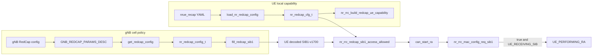

# Chapter 02：RedCap config 與 capability

[回到課程首頁](../README.zh-TW.md) ·
[查看 change ledger](../change-ledger.md) ·
[System map](../../../agent_doc/Project_management/redcap_research_wiki/systems/redcap/configuration-capability.md)

本章只回答一個問題：**gNB 與 UE 各自讀入的 RedCap 設定，如何變成
SIB1、UE capability 與「能否開始 RA」的決策？**

不要一次執行本章全部指令。把「Luna 固定 prompt」與目前 step 交給
Luna；每次只執行一個指令，貼回完整輸出後再繼續。

## 1. 學習目標

完成本章後，您應能：

1. 分辨 gNB `RedCap` section 與 UE `nrue_recap` section 的 owner。
2. 將欄位分類為 operator input、program state 或 control guard。
3. 說明 `input → parser → state → SIB1/capability → access guard → RA`
   的因果路徑。
4. 指出一個欄位「已被解析」為何仍不能證明 UE 已 attach。
5. 用 `rg`、`sed` 和 CTest registration 找到最近的 source 與測試證據。

### 本章不處理

- RedCap initial BWP、CORESET#0 或 Msg2 排程細節；留到 Chapter 03。
- Connected DRX、RRC_INACTIVE 或 SDT；留到 Chapter 04。
- 新 build、RFsim 或 L4 runtime execution。
- exact TS 38.306/38.331 clause optionality；未完成的 mapping 保留
  `[Needs Verification]`。

## 2. 60–90 分鐘配置

| 時間 | 活動 | 產出 |
| ---: | --- | --- |
| 0–10 分 | 建立雙端心智模型 | gNB policy 與 UE capability 不混用 |
| 10–25 分 | CLI Step 1–2：查看兩份輸入 | 能指出 section 與參數 |
| 25–45 分 | CLI Step 3–4：追 gNB parser/state/SIB1 | gNB producer-to-consumer 表 |
| 45–65 分 | CLI Step 5–6：追 UE capability/access guard | UE decision table |
| 65–75 分 | CLI Step 7：找測試與邊界 | 最近測試 owner |
| 75–90 分 | 反證、三題檢查與 handoff | 下一章起點 |

## 3. 問題與工程邊界

### Expected behavior

- gNB 把 cell-side RedCap access policy 轉成 SIB1-v1700 RedCap IEs。
- UE 把本機 `nrue_recap` 轉成 capability state。
- UE 收到 SIB1 後，用自己的 Rx/HD-FDD capability 與 cell policy 判斷
  `can_start_ra`。

### 不可直接推論

- 看到 YAML 欄位，不代表 parser 已讀到。
- 看到 parser log，不代表 SIB1 已成功編碼、傳送或解碼。
- `can_start_ra=true` 只表示通過這個入口 gate，不代表 Msg1、Msg2、
  RRCSetup、Registration、PDU session 或 user-plane 成功。

## 4. 第一性原理：為什麼是兩條輸入線

一個 access decision 至少需要兩個事實：

1. **Cell policy**：這個 cell 是否允許特定 RedCap UE 類型進入。
2. **UE capability**：目前 UE 是 1Rx、2Rx、HD-FDD Type A，還是未宣告
   RedCap support。

這兩個事實不能由同一端決定。gNB 不能替 UE 宣告硬體能力；UE 也不能
自行更改 cell barring policy。因此 source 中存在兩個不同 struct：

| Side | Operator input | Program state | 主要用途 |
| --- | --- | --- | --- |
| gNB | `gNBs.[0].RedCap` | `nr_redcap_config_t` | 建立 SIB1 RedCap policy 與後續 MAC config |
| UE | `nrue_recap` | `nr_redcap_cfg_t` | 建立 UE capability，並選擇 1Rx/2Rx/HD-FDD access branch |

兩條線在 UE 解碼 SIB1 後才匯合。



## 5. 三類參數

### 5.1 Operator input

Operator input 是操作員可以在 YAML/config 改動的值。它尚未成為 runtime
事實。

| Input | Side | 基本作用 | 第一個 parser owner |
| --- | --- | --- | --- |
| `cellBarredRedCap1Rx_r17` | gNB | SIB1 對 1Rx RedCap UE 的 barred/notBarred policy | `get_redcap_config()` |
| `cellBarredRedCap2Rx_r17` | gNB | SIB1 對 2Rx RedCap UE 的 barred/notBarred policy | `get_redcap_config()` |
| `halfDuplexRedCapAllowed_r17` | gNB | 以 optional IE presence 表示 cell 允許 HD-FDD RedCap | `get_redcap_config()` |
| `enable` | UE | 是否啟用 `nrue_recap` loader | `load_nr_redcap_config()` |
| `support_of_redcap_r17` | UE | 是否建立 `supportOfRedCap-r17` capability | `load_nr_redcap_config()` |
| `number_of_rx_redcap_r17` | UE | access guard 使用 1Rx 或 2Rx branch | `load_nr_redcap_config()` |
| `half_duplex_fdd_type_a_redcap_r17` | UE | 是否要求 SIB1 包含 HD-FDD allowed IE | `load_nr_redcap_config()` |

目前 generated ASN.1 header 定義 `barred=0`、`notBarred=1`。保留設定名稱與
symbol 判讀，不要只記「0/1 開關」；`halfDuplexRedCapAllowed-r17` 更是
optional field，presence 與數值的語意不同。

### 5.2 Program state

Program state 是 parser 產生、由後續函式消費的記憶體狀態。

| State | Producer | Consumer | 生命週期／影響 |
| --- | --- | --- | --- |
| `nr_redcap_config_t` | `get_redcap_config()` | MAC radio config、SIB1 builder、scheduler owners | gNB initialization 產生，複製到 `gNB_MAC_INST.radio_config` |
| `NR_SIB1_v1700_IEs_t` RedCap fields | `fill_redcap_sib1()` | UE RRC parser/access guard | 經 ASN.1 encode、broadcast、decode 後才是 UE 輸入 |
| `nr_redcap_cfg_t` | `load_nr_redcap_config()` | capability builder、SIB1 access guard | 每次 loader call 填入本地 temporary struct |
| `NR_UE_NR_Capability_t` | `nr_rrc_build_redcap_ue_capability()` | `UECapabilityInformation` path | 對 gNB 宣告 UE capability；不等於 cell access permission |
| `can_start_ra` | UE RRC SIB1 processing | UE MAC `nr_rrc_mac_config_req_sib1()` | 只控制是否從 `UE_RECEIVING_SIB` 進入 `UE_PERFORMING_RA` |

### 5.3 Control guard

Control guard 是用 state 決定「繼續、拒絕或 fallback」的判斷式，不是
使用者直接設定的參數。

| Guard | Inputs | Decision | Downstream effect |
| --- | --- | --- | --- |
| `ret <= 0` in `get_redcap_config()` | gNB section read result | 無 section 時回傳 `NULL` | 不建立 gNB RedCap config |
| either barred field equals default `-1` | parsed gNB fields | 視為沒有完整 RedCap config | `config.redcap == NULL` |
| `!cfg->enabled` | UE local config | loader 回傳 false | 不注入 RedCap capability |
| Rx count `<1` or `>2` | UE local config | fallback to 1Rx and warning | 防止 guard 使用不存在的 Rx branch |
| HD-FDD UE and SIB1 IE absent | UE cfg + decoded SIB1 | access false | `can_start_ra=false` |
| matching 1Rx/2Rx field is `barred` | UE cfg + decoded SIB1 | access false | `can_start_ra=false` |
| MAC state is `UE_RECEIVING_SIB && can_start_ra` | UE MAC state + RRC decision | state transition | 進入 `UE_PERFORMING_RA` |

## 6. Source ownership matrix

| 順序 | Owner | Symbol/field | Input | Output/marker | Status |
| ---: | --- | --- | --- | --- | --- |
| 1 | `openair2/GNB_APP/gnb_paramdef.h` | `GNB_REDCAP_PARAMS_DESC` | gNB config keys/defaults | parser descriptor | Definition |
| 2 | `openair2/GNB_APP/gnb_config.c` | `get_redcap_config()` | `gNBs.[0].RedCap` | `nr_redcap_config_t *` and config log | Implemented-called |
| 3 | `openair2/GNB_APP/gnb_config.c` | `RCconfig_nr_macrlc()` | parsed SCC/config | `config.redcap` passed to `mac_top_init_gNB()` | Implemented-called |
| 4 | `openair2/LAYER2/NR_MAC_gNB/main.c` | `mac_top_init_gNB()` | `nr_mac_config_t` | `gNB_MAC_INST.radio_config` | Implemented-called |
| 5 | `openair2/LAYER2/NR_MAC_gNB/nr_radio_config.c` | `fill_redcap_sib1()` | gNB runtime config | SIB1-v1700 RedCap fields | Implemented-called |
| 6 | `openair3/UICC/nr_redcap_config.c` | `load_nr_redcap_config()` | `nrue_recap` | `nr_redcap_cfg_t`, config log | Implemented-called |
| 7 | `openair2/RRC/NR_UE/rrc_ue_redcap.c` | `nr_rrc_build_redcap_ue_capability()` | UE cfg | RedCap capability/log | Implemented-called |
| 8 | same | `nr_rrc_redcap_sib1_access_allowed()` | UE cfg + SIB1 | allow/reject and warning | Implemented-called |
| 9 | `openair2/RRC/NR_UE/rrc_UE.c` | SIB1 processing | decoded SIB1 | `can_start_ra` | Implemented-called |
| 10 | `openair2/LAYER2/NR_MAC_UE/config_ue.c` | `nr_rrc_mac_config_req_sib1()` | SIB1 + `can_start_ra` | `UE_PERFORMING_RA` when allowed | Implemented-called |

Canonical function descriptions在
[RedCap L1-L3 lookup](../../../redcap_doc/specs/function_reference/redcap_l1_l3_function_lookup.md)；
本章不另行維護完整 signature 清單。

## 7. 修改流程重建

依 project M2 record 與目前 source，可以重建下列工程路徑。這是
project/source-backed reconstruction，不是個人 author attribution。

| Modification point | 為什麼需要 | Affected files | 行為結果 |
| --- | --- | --- | --- |
| 定義 gNB RedCap config keys | 讓 cell policy 有穩定輸入 schema | `gnb_paramdef.h` | parser 能取得 barring、HD-FDD 與 reselection fields |
| 建立 gNB runtime struct | 後續 owner 不應反覆直接讀 YAML | `gnb_config.c`, `nr_mac_gNB.h` | `nr_redcap_config_t` 成為 MAC/SIB1 input |
| 將 policy 寫入 SIB1-v1700 | UE 必須從 broadcast information 得知 cell policy | `nr_radio_config.c` | 建立 `redCap_ConfigCommon_r17` |
| 建立 UE local loader/capability | UE 硬體/協定能力不能由 gNB config 代替 | `nr_redcap_config.c`, `rrc_ue_redcap.c` | `nr_redcap_cfg_t` 與 minimal RedCap capability |
| 加入 access guard | parser presence 必須轉成明確 accept/reject decision | `rrc_ue_redcap.c`, `rrc_UE.c`, `config_ue.c` | 1Rx/2Rx/HD-FDD mismatch 可阻止開始 RA |
| 加入最近單元測試 | encode/decode 與 branch boundary 可在不跑 RFsim 時檢查 | `test_nr_rrc_redcap.cpp`, tests `CMakeLists.txt` | barring、optional IE、capability round-trip coverage |

### Before/after 的主張邊界

Project tutorial 描述修改前 RedCap barring fields 可能停在 config，而未形成
完整 UE access gate；目前 source 明確存在 SIB1 builder、UE parser、access
guard 與 MAC `can_start_ra` consumer。沒有在本章核對對應 commit，因此
精確 commit、作者與逐行 before-state 維持 `[Needs Verification]`。

## 8. CLI 導讀

### Luna 固定 prompt

```text
你是本章的 Luna CLI 教練。只根據我貼出的教材段落、repository path 與
原始 CLI 輸出回答。一次只給我目前 step 的一個指令，先說明：
1. 指令中每個主要參數的作用。
2. 預期找到的 owner、symbol 或 guard。
3. 找不到時的停止條件。
等我貼回完整輸出後，先讓我指出 producer 與 consumer，再進下一步。
不要把 config/source/unit test 升級成 runtime PASS。
```

### Step 1：找到 gNB operator input

```bash
rtk rg -n -A 18 '^    RedCap:' redcap_library/library_gnb_config/gnb_redcap_case_a_final.yaml
```

| 項目 | 說明 |
| --- | --- |
| `rg` | 快速文字搜尋 |
| `-n` | 顯示行號 |
| `-A 18` | 顯示 match 之後 18 行 |
| `^    RedCap:` | 只匹配以四個空白開始的 gNB section |
| 預期 | 看見 1Rx/2Rx、HD-FDD、inactive 與 initial-BWP inputs |
| 停止條件 | 無輸出時先確認檔案存在與 indentation；不要猜欄位名稱 |

貼回輸出後，先回答：「這是 cell policy 還是 UE capability？」

### Step 2：找到 UE operator input

```bash
rtk rg -n -A 12 '^nrue_recap:' ci-scripts/conf_files/nrue_recap/redcap_capability.example.yaml
```

| 項目 | 說明 |
| --- | --- |
| 預期 | 看見 `enable`、band、RedCap capability、Rx 與 HD-FDD fields |
| 比較 | gNB 使用 `RedCap`；UE 使用 `nrue_recap`，兩者不是同一個 section |
| 停止條件 | 若把 `cellBarred*` 當 UE capability，回到第一性原理表重讀 |

### Step 3：把 gNB input 對到 descriptor 與 parser

```bash
rtk rg -n 'GNB_REDCAP_PARAMS_DESC|get_redcap_config|config\.redcap = get_redcap_config' openair2/GNB_APP/gnb_paramdef.h openair2/GNB_APP/gnb_config.c
```

| 項目 | 說明 |
| --- | --- |
| regex `A|B|C` | 同時尋找 descriptor、parser 和 caller |
| `config\.` | `.` 在 regex 代表任意字元，反斜線讓它匹配真正的 dot |
| 預期 | descriptor 位於 header；static parser 與 caller 位於 `gnb_config.c` |
| 停止條件 | 找到 definition 但找不到 caller 時，不能標記 implemented-called |

### Step 4：閱讀 gNB parser 的 guard 與 state assignment

```bash
rtk sed -n '1367,1415p' openair2/GNB_APP/gnb_config.c
```

| 項目 | 說明 |
| --- | --- |
| `sed -n` | 不自動輸出所有行 |
| `'1367,1415p'` | 只印指定範圍；行號漂移時改用 Step 3 找到的新範圍 |
| 預期 | `config_get`、`ret <= 0`、default `-1` guard、`calloc_or_fail`、field assignments 與 log |
| 停止條件 | 若 function 已移動，使用 `rtk rg -n '^static nr_redcap_config_t \*get_redcap_config'` 重新定位 |

閱讀時標註：哪幾行是 operator input、哪幾行建立 program state、哪幾行是
control guard。

### Step 5：確認 gNB state 如何進入 SIB1

```bash
rtk rg -n 'mac_top_init_gNB|radio_config = \*config|fill_redcap_sib1|get_SIB1_NR' openair2/GNB_APP/gnb_config.c openair2/LAYER2/NR_MAC_gNB/main.c openair2/LAYER2/NR_MAC_gNB/config.c openair2/LAYER2/NR_MAC_gNB/nr_radio_config.c
```

| 項目 | 說明 |
| --- | --- |
| 預期 | `config.redcap` 經 `mac_top_init_gNB()` 複製到 MAC；SIB1 builder 讀 `radio_config` |
| 關鍵問題 | 這裡證明 source call path，還是證明 air-interface 已收到？答案只能是前者 |
| 停止條件 | 沒有 encode/UE decode evidence 時，不宣稱 SIB1 已被 UE 使用 |

### Step 6：閱讀 UE access guard

```bash
rtk sed -n '84,122p' openair2/RRC/NR_UE/rrc_ue_redcap.c
```

依序回答：

1. 非 RedCap UE 為何直接回傳 true？
2. 缺少 RedCap SIB container 時，目前 source 為何回傳 true？
3. 哪個條件會拒絕 HD-FDD Type A UE？
4. 1Rx 與 2Rx 使用哪個不同的 SIB1 field？

| 預期 | 看見 null/support guards、HD-FDD optional IE guard、1Rx/2Rx enum comparison |
| 停止條件 | 若只看到 parser，不要推論 `can_start_ra`；繼續找 caller |

### Step 7：找到 test owner 與 boundary cases

```bash
rtk rg -n 'TEST\(NrRrcRedcap|add_test\(NAME test_nr_rrc_redcap' openair2/RRC/NR/tests/test_nr_rrc_redcap.cpp openair2/RRC/NR/tests/CMakeLists.txt
```

| 項目 | 說明 |
| --- | --- |
| 預期 | HD-FDD absence/presence、1Rx/2Rx barring、SIB1 encode/decode、capability round-trip tests |
| 最強證據 | Source implementation 加 registered unit tests；本章未 fresh-run tests |
| 停止條件 | CMake 有 executable 但沒有 `add_test` 時，不能宣稱 CTest 會執行它 |

## 9. Boundary value 檢查

| Boundary | Current source behavior | 課程判讀 |
| --- | --- | --- |
| UE `enable=0` | loader returns false | 不注入 RedCap capability |
| `band=0` or negative | warning, fallback to 78 | parser sanitation，不是 scenario band proof |
| Rx count `0` | warning, fallback to 1 | boundary-1 |
| Rx count `1` | selects 1Rx barring field | minimum accepted |
| Rx count `2` | selects 2Rx barring field | maximum accepted |
| Rx count `3` | warning, fallback to 1 | boundary+1 |
| gNB barred field default `-1` | returns no RedCap config | incomplete section fail-closed at config creation |
| SIB1 RedCap container absent | UE access helper returns true | current compatibility behavior; exact standard optionality `[Needs Verification]` |
| HD-FDD UE + allowed IE absent | returns false | explicit access rejection |
| matching Rx field `barred` | returns false | explicit access rejection |
| `can_start_ra=false` | MAC does not enter RA from `UE_RECEIVING_SIB` | still not a full attach diagnosis |

本章沒有修改 shared state，也沒有新增 concurrent path。若未來改成 runtime
dynamic reconfiguration，lifetime、locking 與 SIB1 update race 必須重新設計；
目前 init/SIB1 path 不能直接推導該能力。

## 10. 參數影響範圍

| Parameter | 直接影響 | 間接影響 | 不可宣稱 |
| --- | --- | --- | --- |
| `cellBarredRedCap1Rx_r17` | SIB1 1Rx enum | 1Rx UE `can_start_ra` | 所有 UE attach 結果 |
| `cellBarredRedCap2Rx_r17` | SIB1 2Rx enum | 2Rx UE `can_start_ra` | RF branch 實際硬體數 |
| `halfDuplexRedCapAllowed_r17` | SIB1 optional IE presence | HD-FDD access；另有 scheduler gap consumer | 完整 HD-FDD PHY behavior |
| `number_of_rx_redcap_r17` | UE guard branch selection | 選擇 cell 的 1Rx/2Rx policy | gNB antenna configuration |
| `support_of_redcap_r17` | capability optional field | 是否走 RedCap-local capability/access path | gNB 已保存或套用 capability |
| `can_start_ra` | UE MAC state transition gate | 是否開始 RA | Msg1/Msg2/Msg3/Msg4 或 PDU success |

## 11. Competing explanations 與最小 falsifier

### 現象

UE 讀完 SIB1 後沒有開始 RA。

### Competing explanations

1. UE `nrue_recap` 沒有載入，因此實際走的是不同 capability/path。
2. UE capability 已載入，但 matching 1Rx/2Rx field 是 `barred`，或 HD-FDD
   allowed IE 缺失。
3. RedCap access guard 已通過，但 MAC state 或後續 BWP/RA owner 阻止流程。

### 最小 distinguishing check

先同時定位兩個相鄰 owner，不要直接跑完整 RFsim：

- UE config log：`nrue_recap RedCap config: ...`。
- Access warning或 `can_start_ra` source branch；若 access 通過，再進 Chapter
  03 查看 `UE_PERFORMING_RA` 與 Msg1/Msg2 markers。

若沒有 runtime log，本章最強結論只能是 source path 與 registered unit-test
coverage，不能選定上述任一 runtime explanation。

## 12. Evidence ladder

| Tier | 本章 evidence | 狀態 |
| ---: | --- | --- |
| 1 Definition | Config descriptors、ASN.1 generated enum | Confirmed in workspace |
| 2 Source | gNB/UE parsers、builders、guards、consumer | Confirmed in current source |
| 3 Called | Static caller chain to SIB1/MAC | Confirmed by source trace |
| 4 ACK | 不適用 | Not claimed |
| 5 Accept/reject | Unit-test branch behavior | Registered test; no fresh run |
| 6 Apply marker | `can_start_ra`/MAC state source branch | No fresh runtime marker |
| 7 UE-visible completion | None in this chapter | Not claimed |
| 8 Outcome metric | None | Not claimed |

### Supported conclusion

目前 source 建立兩條獨立輸入線，並在 UE SIB1 processing 形成 access decision；
最近的 unit-test owner涵蓋 HD-FDD、1Rx/2Rx、SIB1 codec 與 capability codec
邊界。

### `[Needs Verification]`

- Exact selected-release TS 38.306/38.331 clause 與 optionality。
- 精確 historical commit/author attribution。
- 本 workspace 的 fresh unit-test result。
- 任一 fresh UE attach、BWP、RA 或 user-plane結果。

## 13. 理解檢查

1. `number_of_rx_redcap_r17=1` 且 decoded SIB1 1Rx field 為 `barred` 時，
   哪個函式回傳什麼值？下一個受到影響的 state 是什麼？
2. 為何 `halfDuplexRedCapAllowed_r17=1` 不能直接證明 HD-FDD PHY 已完成？
   請列出本章能證明與不能證明的兩個層級。
3. 如果看到 `nrue_recap RedCap config` log，但 UE 沒有 attach，請提出兩個
   competing explanations 與第一個最小檢查。

Luna 訂正時必須要求答案包含 path、symbol、producer、consumer 與 evidence
tier；只回答「參數錯了」不算完成。

## 14. Handoff card

將下列內容存入本機 `redcap_library/luna_cli_trace_course/local-progress.md`；
該檔已被本目錄 `.gitignore` 排除。

```markdown
## Chapter 02 handoff
- Question and system:
- 我能分辨的兩個 operator-input sections:
- 一個 gNB program state 與 consumer:
- 一個 UE program state 與 consumer:
- 我找到的 access control guard:
- Confirmed path: producer -> consumer -> marker/state
- Strongest evidence tier:
- Not claimed / [Needs Verification]:
- 我的三題答案:
- 下一個 path 或 symbol:
```

## 15. 下一章入口

下一章從 `can_start_ra` 之後開始，沿 UE initial BWP、Msg1、gNB Msg2 BWP
與 CORESET#0 追到 RA evidence。先讀
[BWP、RA 與 scheduling system map](../../../agent_doc/Project_management/redcap_research_wiki/systems/redcap/bwp-ra-scheduling.md)，
不要在本章提前把 access permission 當成 RA success。

## 16. 教材維護資訊

| 變更觸發 | 先更新 | 再更新本章 |
| --- | --- | --- |
| Config key/default 改變 | `gnb_paramdef.h` 或 `nr_redcap_config.c` owner | Operator-input 表與 CLI locator |
| Struct/caller 改變 | function lookup + system map | Program-state/source matrix |
| Access rule改變 | nearest RRC test | Control-guard table、boundary cases |
| 新 runtime marker | owning project report/ledger | Evidence ladder；不得跳級 |
| Exact spec mapping確認 | local 3GPP source/traceability owner | 移除對應 `[Needs Verification]` |
