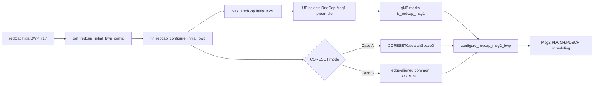

# Chapter 03：BWP、RA 與 scheduling

[回到課程首頁](../README.zh-TW.md) ·
[前一章](02-redcap-config-and-capability.md) ·
[System map](../../../agent_doc/Project_management/redcap_research_wiki/systems/redcap/bwp-ra-scheduling.md)

本章回答：**RedCap initial BWP 與 RACH partition 如何讓 gNB 在辨識 RedCap
Msg1 後，為 Msg2 選到一致的 BWP、search space 與 CORESET view？**

## 1. 學習目標

完成後，您應能：

1. 說明 BWP start/size/SCS、RIV、CORESET0 Case A/B 的基本作用。
2. 追出 config → validated state → SIB1 clone → RedCap preamble → Msg2 view。
3. 解釋為何「BWP 建立正確」仍可能在 scheduler 使用錯誤 active view。
4. 找到 BWP/CORESET/RACH 最近單元測試與 bounded reports。

### 本章不處理

- 不執行 BWP matrix、build 或 RFsim。
- 不宣告所有 carrier geometry 或完整 TS 38.213/38.321/38.331 conformance。
- exact clause mapping 未核對者保留 `[Needs Verification]`。

## 2. 60–90 分鐘配置

| 時間 | 活動 | 產出 |
| ---: | --- | --- |
| 0–15 分 | BWP/CORESET/RACH 心智模型 | 三種 state 不混用 |
| 15–35 分 | CLI Step 1–3 | config 與 validation trace |
| 35–60 分 | CLI Step 4–6 | RACH partition 與 Msg2 consumer |
| 60–75 分 | tests/reports/boundaries | strongest bounded evidence |
| 75–90 分 | 反證、三題、handoff | Chapter 04 起點 |

## 3. 問題與工程邊界

RA 要成功，至少要滿足：UE 使用的 Msg1 資源能被 gNB 分類，且 gNB 回應
Msg2 時使用 UE 能監聽的 PDCCH/BWP view。兩者任何一端錯位，表面都可能是
「沒收到 Msg2」。



## 4. 三類參數與基本作用

| 類型 | 參數/state | 基本作用 | 影響 |
| --- | --- | --- | --- |
| Input | `initialDLBWPStart_r17`, `initialDLBWPSize_r17` | 定義 DL PRB 幾何 | RIV、PDCCH/PDSCH view |
| Input | `initialULBWPStart_r17`, `initialULBWPSize_r17` | 定義 UL PRB 幾何 | PRACH/PUCCH/PUSCH view |
| Input | `initial*BWPSubcarrierSpacing_r17` | 選 SCS domain | FR1 PRB limit與 slot geometry |
| Input | `coreset0_redcap_mode_r17` | `0` Case A、`1` Case B | CORESET/search-space binding |
| State | `nr_redcap_bwp_config_t` | 保存 validated BWP/RIV/control fields | radio config 與 SIB1 builder input |
| State | `featureCombinationPreamblesList_r17` | 標記 RedCap RA preamble partition | Msg1 classification |
| Guard | `ra->is_redcap_msg1` | 防止 baseline RA 誤用 RedCap Msg2 view | Case B selection gate |
| Criterion | `[RedCap RA][gNB Msg2 BWP selected]` | gNB 已選該 view | 只到 apply/view marker，不等於 attach |

## 5. 第一性原理與修改流程

| 修改點 | 原因 | Existing owner | 行為結果 |
| --- | --- | --- | --- |
| 定義 BWP config schema | 不讓 scheduler 直接讀 YAML | `gnb_paramdef.h` | 同組 start/size/SCS/defaults |
| 驗證 geometry | 防止 RIV 指向 carrier 外 | `nr_mac_redcap_bwp.c` | size、SCS、start+size fail-fast |
| 分 Case A/B | 兩種 CORESET binding 不可混用 | same | Case B 要求 edge alignment |
| 複製到 RedCap SIB1 BWP | UE 要取得相同 common config | `nr_radio_config.c` | RedCap DL/UL BWP broadcast state |
| 建立 RACH partition | Msg1 要攜帶可分類的 feature domain | `nr_mac_redcap_bwp.c` | 最後一段 preambles 標 RedCap |
| Msg2 切換 view | response 必須回到同一 RedCap control geometry | `gNB_scheduler_RA.c` | 更新 UE current DL/UL BWP 與 PDCCH |

這是 project/source-backed reconstruction；精確 commit、author 與逐行
before state 未於本章核對，標記 `[Needs Verification]`。

## 6. Source ownership matrix

| 順序 | Owner | Symbol | Output |
| ---: | --- | --- | --- |
| 1 | `openair2/GNB_APP/gnb_paramdef.h` | `GNB_REDCAP_INITIAL_BWP_PARAMS_DESC` | input schema/default |
| 2 | `openair2/GNB_APP/gnb_config.c` | `get_redcap_initial_bwp_config()` | populated config |
| 3 | `openair2/LAYER2/NR_MAC_gNB/nr_mac_redcap_bwp.c` | `nr_redcap_configure_initial_bwp()` | validated RIV/BWP state |
| 4 | same | `nr_redcap_validate_coreset0_dl_bwp()` | Case B edge guard |
| 5 | same | `nr_redcap_configure_rach_feature_combination_preambles()` | RedCap partition |
| 6 | `openair2/LAYER2/NR_MAC_gNB/nr_radio_config.c` | RedCap initial-BWP clone | SIB1 state |
| 7 | `openair2/LAYER2/NR_MAC_gNB/gNB_scheduler_RA.c` | `get_redcap_msg1_rach_config()` | classification config |
| 8 | same | `configure_redcap_msg2_bwp()` | Msg2 scheduler view |

## 7. CLI 導讀

### Luna 固定 prompt

```text
一次只給一個唯讀 CLI step。每次要求我說出 input、derived state、guard、
consumer 四者之一。若只看到 config/helper，不可宣告 Msg2 或 attach PASS。
```

### Step 1：讀 config schema 與 defaults

```bash
rtk sed -n '540,605p' openair2/GNB_APP/gnb_paramdef.h
```

預期：看到 `redCapInitialBWP_r17`、DL/UL start/size/SCS、Case mode 與 `-1`
defaults。若 key 不在此範圍，用 symbol 搜尋，不猜 YAML spelling。

### Step 2：追 parser 到 helper

```bash
rtk sed -n '1270,1355p' openair2/GNB_APP/gnb_config.c
```

預期：start/size/SCS 需成組，Case mode 被驗證，DL/UL 分別配置。

### Step 3：讀 geometry guard

```bash
rtk sed -n '93,165p' openair2/LAYER2/NR_MAC_gNB/nr_mac_redcap_bwp.c
```

預期：null、non-positive size、unsupported SCS、max PRB、carrier overflow、
Case B edge alignment 都有 fail-fast。這是 source guard，不是 runtime result。

### Step 4：找 RACH partition producer/consumer

```bash
rtk rg -n 'featureCombinationPreambles|is_redcap_msg1|nr_redcap_is_msg1_preamble' openair2/LAYER2/NR_MAC_gNB openair2/LAYER2/NR_MAC_UE
```

預期：看到 partition 建立、UE/gNB classification 及 RA state。需把同一
preamble domain 對起來，不能只讀 producer。

### Step 5：讀 Msg2 gate

```bash
rtk sed -n '216,292p' openair2/LAYER2/NR_MAC_gNB/gNB_scheduler_RA.c
```

預期：`is_redcap_msg1` 與 Case B 為入口 guard，接著更換 search space、
CORESET、current DL/UL BWP。任一 assertion 失敗都停在 Msg2 view 建立。

### Step 6：找最近單元測試

```bash
rtk rg -n 'configure_initial_bwp|validate_coreset0|feature_combination|preamble' openair2/LAYER2/NR_MAC_gNB/tests/test_nr_redcap_bwp.cpp
```

預期：positive、death/boundary、partition cases。測試不覆蓋完整 RFsim。

### Step 7：讀 bounded report

```bash
rtk sed -n '1,180p' redcap_library/library_reports_summary/m3t2_coreset0_case_matrix_report.md
```

預期：辨識 Case A/B 的 accepted boundary 與未涵蓋項目；不外推所有頻寬。

## 8. Boundary value 檢查

| 邊界 | 期待 |
| --- | --- |
| size `0`、negative | reject |
| FR1 PRB max-1/max/max+1 | max+1 reject；exact max依 SCS |
| `start + size = carrier_bw` | 邊界合法；超一 reject |
| Case B edge/non-edge | non-edge reject |
| first/last RedCap partition preamble | 兩端 inclusive/exclusive 正確 |
| Msg2 frame/slot N-1/N/N+1 | 對同一 RA identity 與 window |
| simultaneous baseline/RedCap RA | 不污染 shared scheduler view |

## 9. 參數影響與 failure propagation

錯誤的 BWP start/size 會先污染 RIV；錯誤 CORESET/search-space binding 會使
PDCCH 監聽位置不同；錯誤 preamble partition 會讓 gNB 不進 RedCap Msg2
branch。即使這些都正確，active BWP、SR 或 grant consumer 仍可能不同步。

## 10. Competing explanations 與 falsifier

現象：UE 沒收到 Msg2。

| 解釋 | 最小 falsifier |
| --- | --- |
| UE 沒送 RedCap partition preamble | 對 UE selected preamble 與 partition |
| gNB 未分類 `is_redcap_msg1` | 查同 RA identity classification |
| Case B BWP/CORESET 無效 | 對 validated config 與 cloned SIB1 |
| Msg2 使用 baseline view | 查 `gNB Msg2 BWP selected` 及 scheduler state |
| Msg2 已排但 PHY/UE 未接收 | 轉交 PHY/runtime owner，不改 BWP helper |

## 11. Evidence ladder

- Source/tests：BWP/RIV/Case/partition local logic。
- Retained Case A/B reports：指定情境的 bounded behavior。
- Msg2 selection marker：scheduler view 被選；不等於 Msg2 decode。
- Attach/PDU/ping：屬 Chapter 05，不能由本章前三級推得。

Strongest claim：本 checkout 具備 implemented-called helper 與 bounded
Case A/B evidence；普遍頻寬／標準一致性為 `[Needs Verification]`。

## 12. 理解檢查

1. Case B 為何除了 BWP size 還要檢查 edge alignment？
2. `is_redcap_msg1=true` 能證明與不能證明什麼？
3. BWP source test PASS 後，為何仍要比對 Msg2 consumer state？

## 13. Handoff card

```markdown
## Chapter 03 handoff
- selected Case A/B:
- input BWP start/size/SCS:
- validated RIV/state:
- RedCap preamble boundary:
- Msg2 consumer view:
- strongest evidence:
- unresolved clause/geometry:
```

## 14. 下一章入口

進入 [Chapter 04：RRC_INACTIVE、DRX 與 SDT](04-inactive-drx-and-sdt.md)。

## 15. 教材維護資訊

- Canonical trace：[BWP/RA system map](../../../agent_doc/Project_management/redcap_research_wiki/systems/redcap/bwp-ra-scheduling.md)。
- Tests 與 reports 是 bounded owners；本章不複製完整 matrix。
