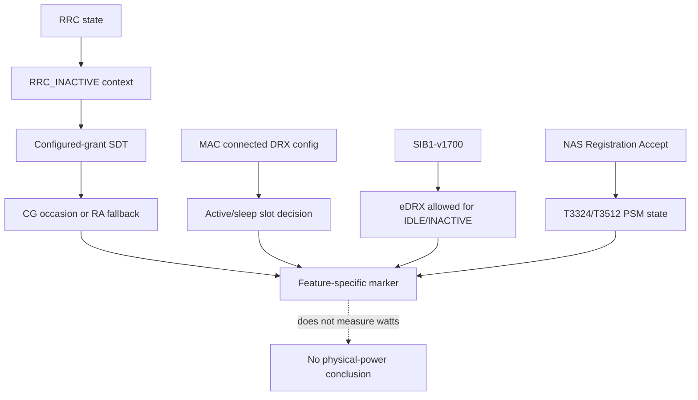

# Chapter 04：RRC_INACTIVE、DRX 與 SDT

[回到課程首頁](../README.zh-TW.md) ·
[前一章](03-bwp-ra-and-scheduling.md) ·
[System map](../../../agent_doc/Project_management/redcap_research_wiki/systems/redcap/inactive-power-sdt.md)

本章回答：**RRC_INACTIVE、CG-SDT、connected DRX、eDRX 與 PSM 各自由誰
擁有，為何不能用一個「低功耗成功」marker 取代？**

### 本章主線

RRC_INACTIVE/SDT、DRX、eDRX 與 PSM 都可能降低活動量，但由不同 layer
擁有。先找 owner，再判斷它自己的 marker；不要把任何一個 marker 叫成
「低功耗成功」。

## 1. 學習目標

1. 將五條路徑依 RRC/MAC/NAS owner 分開。
2. 追 `configuredGrantConfig` 到 CG-SDT occasion、PUSCH 與 fallback。
3. 說明 DRX active slot、eDRX allowance、PSM timer readiness 的差異。
4. 指出 local readiness 為何不能證明物理耗電下降。

### 本章不處理

- 不聲稱完整 RRC_INACTIVE/SDT interoperability。
- 不執行 Gate 2/3/4、DRX A/B 或功耗量測。
- 不把 eDRX/PSM log、DRX unit test、SDT marker互相替代。

## 2. 60–90 分鐘配置

| 時間 | 活動 | 產出 |
| ---: | --- | --- |
| 0–15 分 | 五路徑分層 | owner matrix |
| 15–40 分 | INACTIVE/CG-SDT CLI | state/occasion/fallback trace |
| 40–60 分 | DRX/eDRX/PSM CLI | 三種 power state 分離 |
| 60–75 分 | boundary/evidence | feature-specific conclusion |
| 75–90 分 | 反證、三題、handoff | Runtime chapter 起點 |

## 3. 第一性原理：省電機制不是同一層



RRC state 決定連線上下文；SDT 是在特定狀態傳小量資料的 procedure；DRX
決定 MAC 監聽時窗；eDRX 是 SIB1 allowance 與更長 paging behavior；PSM 是
NAS timer/state。它們可能互動，但 owner 與 acceptance 必須分開。

## 4. 三類參數與作用

| 類型 | 例子 | 作用 | Consumer/marker |
| --- | --- | --- | --- |
| Input | `redcap_inactive_allowed` | cell-side inactive enablement | RRC suspend/inactive path |
| Input | `MMTC_RRC_INACTIVE_GATE3_CG_CONFIG` | bounded validation-only CG injection | gNB radio config |
| Input | DRX cycle/on-duration/inactivity/HARQ timers | 建立 MAC active window | `nr_ue_drx_is_active()` |
| Input | SIB1 eDRX optional IEs | 允許 IDLE/INACTIVE eDRX | `nr_rrc_edrx_allowed_for_state()` |
| Input | NAS `T3324`, `T3512` | active time/periodic registration state | PSM readiness |
| State | `redcap_rrc_state` | connected/inactive transition | UE/gNB SDT consumers |
| State | `configuredGrantConfig` | CG-SDT resource/periodicity | UE scheduler/gNB UL receiver |
| Guard | `nr_ue_has_cg_sdt_config()` | 缺任何 nested state 都不走 CG | probe/fallback |
| Criterion | Gate-specific markers | 證明該步 producer/consumer | 不跨 feature 升級 |

`MMTC_*` flags 是 validation operator inputs，不是 3GPP parameter；其標準
對應保持 `[Needs Verification]`。

## 5. 修改流程重建

| 路徑 | Existing owner | 修改目的 | 主要影響 |
| --- | --- | --- | --- |
| INACTIVE | `rrc_UE.c`, `L2_interface_ue.c` | 保存/傳遞 inactive state | MAC 能辨識 inactive |
| gNB SDT state | `nr_mac_sdt_fsm.c` | 限定 FSM transition | scheduler-side state |
| CG config | `nr_radio_config.c`, `config_ue.c` | 建立並 parse grant | active UL BWP state |
| CG scheduler | `nr_ue_scheduler.c` | 在 occasion 排 autonomous PUSCH | SDT TX 或 fallback |
| gNB receive | `gNB_scheduler_ulsch.c` | 分類 CG-SDT PUSCH | confirmation marker |
| DRX | `nr_ue_drx.c` | unwrapped slot與 timer guards | active/sleep decision |
| eDRX | `rrc_ue_lowpower.c` | 保存 SIB1 allowances | per-state allow bool |
| PSM | `nr_nas_msg.c`, `nr_nas_lowpower.c` | decode timer並判 readiness | NAS low-power state |

## 6. CLI 導讀

### Luna 固定 prompt

```text
一次只追 RRC_INACTIVE、CG-SDT、DRX、eDRX、PSM 中的一條。每個 step 先說
owner layer 與 marker tier；禁止用一條路徑的 PASS 代替另一條，禁止推論
physical power。
```

### Step 1：找 inactive producer 與 MAC handoff

```bash
rtk rg -n 'RRC_INACTIVE entered|redcap_rrc_state = NR_REDCAP_RRC_INACTIVE' openair2/RRC/NR_UE
```

預期：RRC entry 與 L2 interface handoff。看到 entry 不表示 resume 或 SDT。

### Step 2：讀 CG-SDT existence guard

```bash
rtk sed -n '1240,1280p' openair2/LAYER2/NR_MAC_UE/nr_ue_scheduler.c
```

預期：UL BWP、configured grant、RRC grant、`ext2`、`cg_SDT_Configuration_r17`
逐層非空。任一缺失都應停在 no-config probe。

### Step 3：找 occasion、TX、fallback markers

```bash
rtk rg -n '\[RRC_INACTIVE Gate [34]\].*(CG|TX|Fallback)' openair2/LAYER2/NR_MAC_UE/nr_ue_scheduler.c openair2/LAYER2/NR_MAC_gNB/gNB_scheduler_ulsch.c
```

預期：no occasion、pending data、scheduled/TX、RSRP fallback、gNB receive。
必須依同一 UE/frame.slot 串接。

### Step 4：讀 DRX active decision

```bash
rtk sed -n '105,166p' openair2/LAYER2/NR_MAC_UE/nr_ue_drx.c
```

預期：未設定時 active、timer/HARQ/SR/cycle/on-duration guards，及 atomic
slot metrics。這是 MAC scheduling availability，不是電力計讀值。

### Step 5：讀 eDRX allowance

```bash
rtk sed -n '20,42p' openair2/RRC/NR_UE/rrc_ue_lowpower.c
```

預期：SIB1 optional-field presence 轉為 IDLE/INACTIVE bool。Presence 不等於
paging procedure 已完整執行。

### Step 6：讀 PSM readiness

```bash
rtk rg -n 'T3324|T3512|low_power_ready' openair3/NAS/NR_UE/nr_nas_msg.c openair3/NAS/NR_UE/nr_nas_lowpower.c
```

預期：NAS timer decode/state與 readiness helper。Timer configured 不等於 UE
已進入或維持 PSM。

### Step 7：找 feature-specific tests/reports

```bash
rtk rg -n 'add_test|On Duration|T3324|T3512|RRC_INACTIVE|CG' openair2/LAYER2/NR_MAC_UE/tests openair2/RRC/NR/tests openair3/NAS/NR_UE/5GS/tests redcap_library/library_reports_summary/m4b_lowpower_unit_test_report.md
```

預期：不同 owner 的 test/summary；不要把一個 aggregate PASS 改寫成全路徑。

## 7. Boundary value 檢查

| Feature | 邊界 |
| --- | --- |
| DRX | On Duration N-1/N/N+1、cycle min/max、SFN wrap、pending SR、HARQ expiry |
| CG-SDT | zero/max payload、missing grant、occasion N-1/N/N+1、existing PUSCH |
| Fallback | threshold below/equal/above、`phy_test` guard |
| eDRX | IE absent、IDLE only、INACTIVE only、both present |
| PSM | timer absent/zero/max、T3324/T3512 combination |
| Concurrency | timer expiry coinciding paging/occasion、UE release during apply |

## 8. Failure propagation

錯誤 active UL BWP 會讓 configured grant 看似存在但 scheduler 使用不同
resource；沒有 pending LCID data 會使 occasion 合法卻無 TX；eDRX IE absent
應被判不允許，而非 parser failure；NAS timer未設定不應由 DRX state補足。

## 9. Competing explanations 與 falsifier

現象：沒有 CG-SDT TX marker。

| 解釋 | 最小 falsifier |
| --- | --- |
| UE 未進 inactive | 對 RRC entry 與 MAC state handoff |
| active UL BWP 無 CG-SDT | 讀 nested existence guard |
| 當下不是 CG occasion | 計算同一 frame/slot periodicity |
| 沒有 pending LCID data | 對 buffer marker |
| threshold 觸發 fallback | 對 RSRP/fallback marker |
| 已 TX 但 gNB 未分類 | 對 UE TX 與 gNB receive identity |

## 10. Evidence ladder

| 路徑 | 本地 strongest tier | 不可推論 |
| --- | --- | --- |
| DRX | unit/flow/apply state | 物理省電 |
| eDRX | SIB1 allowance/runtime readiness log | 完整 paging |
| PSM | NAS timer/readiness log | modem 實際 power state |
| CG-SDT | Gate markers/retained bounded flow | 完整 interoperability |

## 11. 理解檢查

1. `configuredGrantConfig` 存在，還缺哪兩類 state 才可能排 CG-SDT？
2. DRX slot count 能量到什麼，不能量到什麼？
3. eDRX allowance 與 PSM timer為何不能合成一個 low-power PASS？

## 12. Handoff card

```markdown
## Chapter 04 handoff
- selected feature:
- input and owner layer:
- program state:
- guard/occasion:
- producer marker:
- next consumer marker:
- strongest evidence:
- physical-power claim: not supported
```

## 13. 下一章入口

進入 [Chapter 05：Runtime validation](05-runtime-validation.md)。

## 14. 教材維護資訊

- Canonical owner：[Inactive/power/SDT map](../../../agent_doc/Project_management/redcap_research_wiki/systems/redcap/inactive-power-sdt.md)。
- Exact clause 與未通過 feature combinations 維持 `[Needs Verification]`。
