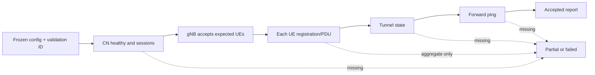

# Chapter 05：Runtime validation

[回到課程首頁](../README.zh-TW.md) ·
[前一章](04-inactive-drx-and-sdt.md) ·
[System map](../../../redcap_research_wiki/systems/redcap/runtime-evidence.md)

本章回答：**如何讀懂固定情境的 RFsim/CN5G 證據（frozen evidence），確認
56/56 accepted 與 64 UE upper-bound failure 各自能支持什麼，而不在本輪重跑
L4？**

### 本章主線

先固定一個 run，再依 **CN → gNB → UE → tunnel → forward ping** 核對證據。
其中任何一層缺 marker，就停在 partial 或 failed，不把不同 run 拼成一個
PASS。

## 1. 學習目標

1. 分辨 scenario input、runtime counters/state、acceptance markers。
2. 依 CN → gNB → UE → tunnel → forward ping 順序判讀 retained evidence。
3. 解釋 56/56 success 與 64 UE failure 不能合成「容量約 60」。
4. 將 simulator result 與 paper reproduction／physical claims 分開。

### 本章不處理

- 不啟動 container、build、RFsim、iperf 或 fresh campaign。
- 不修改 frozen config、threshold 或 acceptance criteria。
- 不聲稱 real network、latency、power 或 standards conformance。

## 2. 60–90 分鐘配置

| 時間 | 活動 | 產出 |
| ---: | --- | --- |
| 0–15 分 | acceptance contract | 必要 marker 清單 |
| 15–40 分 | 56/64 reports | accepted vs failed boundary |
| 40–60 分 | CN/RAN/UE evidence chain | missing marker classification |
| 60–75 分 | Paper 07 boundary | comparability vs reproduction |
| 75–90 分 | 反證、三題、handoff | A-IoT 起點 |

## 3. 第一性原理：一次 run 是一個不可拆散的證據單位



不同 run 的 attach、tunnel 與 ping 不能拼成一個 PASS。Validation ID、config
fingerprint、時間與 UE identity 必須能彼此關聯。

## 4. 三類參數

| 類型 | 例子 | 基本作用 | 風險 |
| --- | --- | --- | --- |
| Input | UE count、Case B/static-CN scenario、`MMTC_*` | 定義測試處理量與 feature profile | 改一項即非同 baseline |
| State | attach count、PDU session、tunnel、per-UE IP | 描述當次程序狀態 | aggregate 隱藏 last UE failure |
| Criterion | 56/56、required tunnel、forward ping | project acceptance | 不可事後降低門檻 |

Pass criterion 的 owner 是 project plan/runtime checklist，不是 log parser。
Parser 只機械收集 marker。

## 5. Source/evidence ownership matrix

| Owner | 作用 | Claim boundary |
| --- | --- | --- |
| [mMTC project plan](../../../agent_doc/Project_management/projects/redcap_mmtc_priority_execution_v1/project_plan.md) | milestone與 acceptance | project scope |
| [runtime checklist](../../../agent_doc/Project_management/projects/redcap_mmtc_priority_execution_v1/validation/runtime_checklist.md) | required markers | 不能由 report 自訂 |
| [56 UE report](../../library_reports_summary/m5_caseb_56ue_static_cn_pass_report.md) | accepted frozen result | 只到 56/56 Case B/static-CN |
| [64 UE report](../../library_reports_summary/m5_caseb_64ue_static_cn_threshold_report.md) | upper-bound failure classification | 不是 partial acceptance |
| [CN migration report](../../library_reports_summary/cn5g_runtime_migration_report.md) | CN route/evidence | 不證明 RAN feature |
| [simulator project](../../../agent_doc/Project_management/projects/redcap_simulator_performance_eval_v1/project_plan.md) | performance experiment contract | 不等於 production network |

## 6. 修改流程重建

這一階段的工程修改主要是「使結果可重現與可判定」，不是新增另一套 RAN
owner：

1. 固定 scenario/config 與 validation ID。
2. 定義每一層 required marker。
3. 收集 per-UE 而非只看總數。
4. 將 success 與 threshold failure分別保存。
5. 報告只接受完整 evidence chain，並明列 claim boundary。

Exact scripts/commit attribution 未逐一核對，維持 `[Needs Verification]`；
canonical acceptance 以上列 project/report 為準。

## 7. CLI 導讀

### Luna 固定 prompt

```text
本章只讀 retained evidence。一次給一個唯讀指令，要求我指出 validation ID、
frozen input、required marker、strongest conclusion 與 missing step。不要啟動
container或重跑 L4；不要把不同 run 的 marker 合併。
```

### Step 1：讀 acceptance owner

```bash
rtk rg -n 'accept|PASS|required|marker|56|64|ping|tunnel' agent_doc/Project_management/projects/redcap_mmtc_priority_execution_v1/project_plan.md agent_doc/Project_management/projects/redcap_mmtc_priority_execution_v1/validation/runtime_checklist.md
```

預期：找到 project 判準。若 checklist 與 report 不一致，停止並以 project
owner 為準，不自行挑較容易通過者。

### Step 2：讀 56 UE accepted result

```bash
rtk sed -n '1,220p' redcap_library/library_reports_summary/m5_caseb_56ue_static_cn_pass_report.md
```

預期：辨識 56/56、PDU/tunnel、forward ping 與 frozen scenario。只寫 report
明示結論。

### Step 3：讀 max+1 failure

```bash
rtk sed -n '1,220p' redcap_library/library_reports_summary/m5_caseb_64ue_static_cn_threshold_report.md
```

預期：64 UE 是分類過的 upper-bound failure；不要插值成未知 UE 數的容量。

### Step 4：比較 report schema，不比較想像中的效能

```bash
rtk rg -n 'Validation|Config|attach|PDU|tunnel|ping|Conclusion|Boundary|failed|blocked' redcap_library/library_reports_summary/m5_caseb_56ue_static_cn_pass_report.md redcap_library/library_reports_summary/m5_caseb_64ue_static_cn_threshold_report.md
```

預期：找到同維度欄位與差異。缺欄位表示不可比，不是數值零。

### Step 5：檢查 Paper 07 claim boundary

```bash
rtk rg -n 'Conclusion|comparable|proxy|256QAM|Needs Verification|limitation|boundary' agent_doc/Project_management/projects/redcap_simulator_performance_eval_v1/analysis/paper07_ul_peak_reproduction_report.md agent_doc/Project_management/projects/redcap_simulator_performance_eval_v1/analysis/p5_platform_validity_report.md
```

預期：區分 reproduction、proxy、platform validity 與限制。圖表接近不等於
協定路徑或硬體相同。

### Step 6：理解 stateful command 路由，但不執行

```bash
rtk rg -n 'description|script_path|side_effects|log_path|status_field' redcap_library/bash_tool/registry.json
```

預期：長命令應由 registered tool、task manifest 與 log owner 管理。本章
沒有 L4 approval，因此停在 read-only inspection。

## 8. Boundary value 與 failure classification

| 邊界 | 判讀 |
| --- | --- |
| 0 UE | harness/CN sanity，不是 capacity |
| first/last UE | 防止 aggregate count 掩蓋尾端 failure |
| 56 | accepted maximum for exact retained setup |
| 57–63 | 未由兩份報告證明 `[Needs Verification]` |
| 64 | retained upper-bound failure |
| restart | 新 validation ID，不沿用舊 marker |
| missing tunnel/ping | 停在 prior tier |
| stale config | report 不適用 current checkout |

## 9. Competing explanations 與 falsifier

現象：attach count 未達目標。

| 解釋 | 最小 falsifier |
| --- | --- |
| RAN/CN 真失敗 | 查第一個缺失 per-UE marker及 owner log |
| 收集器遺漏 | 原始 log有 marker但 report缺失 |
| stale/mixed run | validation ID/config/time 不一致 |
| last UE timeout | 對 first/last identity與 deadline |

只有在原始與 retained evidence一致時才分類 component failure；否則結果是
unknown/retention failure，不虛構成功或失敗。

## 10. Evidence ladder

本章 strongest claim：frozen Case B/static-CN setup 有一份 56/56 accepted
result；64 UE 是另一份 upper-bound failure。不存在一般 capacity、real-network
latency、physical power 或 universal standard claim。

## 11. 理解檢查

1. 為何 56 PASS、64 FAIL 不能推出 60 UE PASS？
2. attach 56/56 後還需要哪些 CN/user-plane markers？
3. 若 report 缺 marker但 raw log 有，這是 feature failure 還是 retention問題？

## 12. Handoff card

```markdown
## Chapter 05 handoff
- report/validation ID:
- frozen config:
- accepted UE boundary:
- required CN/RAN/UE/tunnel/ping markers:
- first missing marker:
- failure owner or retention owner:
- strongest conclusion:
- fresh runtime executed: no
```

## 13. 下一章入口

進入 [Chapter 06：A-IoT Tag 與 UE Reader](06-aiot-tag-and-reader.md)。

## 14. 教材維護資訊

- 本章只導讀 retained evidence；新 runtime 需要獨立 L4 approval。
- Report 的 current applicability 可能漂移，重跑前須重新 freeze config。
