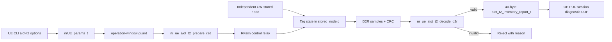

# Chapter 06：A-IoT Tag 與 UE Reader

[回到課程首頁](../README.zh-TW.md) ·
[前一章](05-runtime-validation.md) ·
[System map](../../../agent_doc/Project_management/redcap_research_wiki/systems/aiot/tag-reader.md)

本章回答：**disabled-by-default 的 experimental Topology 2 profile，如何從
UE Reader operation window，經 R2D、external CW、Tag D2R/CRC，產生一份
40-byte diagnostic report？**

## 1. 學習目標

1. 說明 Reader、observer、Tag、external CW 在本地 profile 的角色。
2. 將 CLI options 追到 `nrUE_params_t`、slot gate、codec 與 UDP report。
3. 區分 RFsim deterministic behavior、diagnostic N6 與標準 Topology 2。
4. 用 CRC/identity/window/context 反證「Tag 沒回應」的多種原因。

### 本章不處理

- 不宣告 physical RF、UE 自己持續供 CW 或 3GPP conformance。
- 不把 experimental Manchester/SFS 當 TS 38.291 implementation。
- 不啟動 RFsim、AIOTF 或 container。

## 2. 60–90 分鐘配置

| 時間 | 活動 | 產出 |
| ---: | --- | --- |
| 0–15 分 | Topology 2角色與能量路徑 | Reader/Tag/CW 分工 |
| 15–35 分 | CLI options與guards | valid profile table |
| 35–60 分 | R2D/D2R/CRC/report trace | producer-consumer flow |
| 60–75 分 | boundaries/evidence | experimental claim boundary |
| 75–90 分 | 反證、三題、handoff | AIOTF input card |

## 3. 第一性原理：能量、控制與資料是三件事

Passive Tag 需要外部能量路徑；Reader 發 R2D command；Tag 以 backscatter
形成 D2R response。Local RFsim 用不同 option flags 模擬三種流，不能把
Reader command 說成供能 CW。



## 4. 三類參數與基本作用

| 類型 | 參數 | 作用 | 邊界 |
| --- | --- | --- | --- |
| Input | `--aiot-t2-reader` | 啟用 R2D primary role | 與 observer互斥 |
| Input | `--aiot-t2-observer` | 只觀察 D2R | 與 reader互斥 |
| Input | `--aiot-t2-tag-id` | 選 transaction Tag | 1..60 |
| Input | `--aiot-t2-window-period/offset/duration` | 定義 active slots | period>0；window不越界 |
| Input | `--aiot-t2-reader-handle` | AIOTF stable reader identity | 1..2 |
| Input | `--aiot-t2-report-ip/port` | 40-byte report destination | valid IPv4、port>0 |
| State | `aiot_t2_rf_packet_t` | R2D/D2R samples與header | bounded sample count |
| State | `aiot_t2_inventory_report_t` | wire report | compile-time size=40 |
| Guard | `aiot_t2_role_window_active()` | 只在 operation window收送 | offset/duration |
| Criterion | `D2R_CRC_OK`, `UE_REPORT_SENT` | codec/report producer完成 | 不等於 AIOTF accepted |

## 5. Source ownership 與修改流程

| 順序 | Existing owner | 修改目的 | Output |
| ---: | --- | --- | --- |
| 1 | `executables/nr-uesoftmodem.h` | 定義 CLI schema/defaults | `nrUE_params_t` fields |
| 2 | `executables/nr-uesoftmodem.c` | profile validation | fail-fast invalid role/ID/window/destination |
| 3 | `radio/COMMON/common_lib.h` | 定義 RFsim flags/wire structs | 40-byte report contract |
| 4 | `radio/rfsimulator/stored_node.c` | Tag/CW/codec behavior | D2R or reason marker |
| 5 | `radio/rfsimulator/simulator.cpp` | relay control packets | Reader↔Tag transport |
| 6 | `openair1/PHY/NR_UE_TRANSPORT/nr_ue_rf_helpers.c` | UE R2D encode/D2R decode | CRC-qualified payload |
| 7 | `executables/nr-ue.c` | per-slot Reader flow | UDP diagnostic report |

這些 owners 已存在，因此不建立新的 `redcap_library` simulator module。

## 6. CLI 導讀

### Luna 固定 prompt

```text
一次只追一個 Topology 2 state。每步要求我標示 energy、command、response、
diagnostic report中的哪一類。只允許 experimental RFsim 結論；若提到標準
或 physical RF，標記 [Needs Verification]。
```

### Step 1：讀 CLI contract

```bash
rtk sed -n '24,110p' executables/nr-uesoftmodem.h
```

預期：看到九個 `aiot-t2-*` options、types、defaults。Default disabled 防止
baseline UE 被改變。

### Step 2：讀跨參數 guards

```bash
rtk sed -n '185,212p' executables/nr-uesoftmodem.c
```

預期：role互斥、Tag 1..60、period/window、reader 1..2、IPv4/port。單個 option
合法仍可能因組合無效而 fail。

### Step 3：確認 wire contract

```bash
rtk sed -n '688,740p' radio/COMMON/common_lib.h
```

預期：R2D/Tag/CW/D2R flags、max payload 16、report magic/version/CRC flag、
40-byte static assertion。Wire size正確不等於 socket送達。

### Step 4：讀 UE codec input guards

```bash
rtk sed -n '38,135p' openair1/PHY/NR_UE_TRANSPORT/nr_ue_rf_helpers.c
```

預期：R2D prepare、D2R option/Tag/sample length、line code、payload、CRC。
Manchester/SFS 是 experimental local encoding。

### Step 5：讀 operation window與slot producer

```bash
rtk sed -n '934,1092p' executables/nr-ue.c
```

預期：window start送 R2D、active window收 D2R、decode OK後送 report；每個
reject有不同 reason。

### Step 6：找 Tag/CW behavior markers

```bash
rtk rg -n 'AIOT_T2_(CW|R2D|D2R|ROUNDTRIP|TIMEOUT|SELF_TEST)' radio/rfsimulator/stored_node.c
```

預期：CW off、reader asleep、invalid line code、CRC、timeout等互斥失敗。

### Step 7：讀 owning change 與 retained report

```bash
rtk rg -n 'Topology 2|experimental|physical|PASS|STOP|Needs Verification' openspec/changes/add-aiot-topology2-reader-experiment/tasks.md openspec/changes/add-aiot-topology2-reader-experiment/review/review_findings.md redcap_library/library_reports_summary/aiotf_cn5g_experimental_n6_validation_report.md
```

預期：experimental flow有 bounded evidence，physical RF/standard path不在
accepted claim。

## 7. Boundary value 檢查

| 對象 | 邊界 |
| --- | --- |
| Tag | 0 reject；1、60 valid；61 reject |
| Reader handle | 0 reject；1、2 valid；3 reject |
| Payload | 0 reject；1、16 valid；17 reject |
| Window | duration 0、offset=period、offset+duration=period/+1 |
| Frame/slot report | frame 0/1023、slot 0/159 |
| Codec | invalid `00/11` pair、CRC mismatch、length not divisible |
| Runtime | missing CW、reader asleep、duplicate report、timeout |

## 8. Failure propagation

Missing CW 停在 Tag energy path；invalid R2D停在 command decode；D2R CRC failure
停在 Reader codec；UDP send failure停在 diagnostic transport；AIOTF context
reject屬下一章。不要用後段錯誤回寫前段「radio failed」。

## 9. Competing explanations 與 falsifier

現象：AIOTF沒有接受 report。

| 解釋 | 最小 falsifier |
| --- | --- |
| window 未 active | 計算 absolute slot modulo period |
| CW absent/Tag未回 | 對 CW/R2D/D2R marker |
| line code/CRC錯 | 讀 exact decode result |
| UDP未送 | 查 `UE_REPORT_SENT`/reject |
| report送達但 context不匹配 | 轉 Chapter 07，同 Tag/frame/slot/reader對 pending context |

## 10. Evidence ladder

本章 strongest claim：disabled-by-default profile具備 deterministic experimental
RFsim/diagnostic source flow與 bounded retained evidence。`UE_REPORT_SENT` 最多
到 producer/transport attempt；AIOTF association、standard path、physical RF
均未由此證明。

## 11. 理解檢查

1. 為何 Reader發 R2D不能被描述為「Reader持續供 CW」？
2. `D2R_CRC_OK` 後還缺哪兩段才到 AIOTF accepted？
3. `reader_handle` 與 `tag_id` 各自解決哪一種 identity 問題？

## 12. Handoff card

```markdown
## Chapter 06 handoff
- role: reader/observer
- Tag ID / reader handle:
- window period/offset/duration:
- CW evidence:
- R2D marker:
- D2R/CRC marker:
- 40-byte report marker:
- strongest claim: experimental RFsim only
```

## 13. 下一章入口

進入 [Chapter 07：AIOTF、CN5G 與 standard-path stop](07-aiotf-cn5g-and-standard-stop.md)。

## 14. 教材維護資訊

- Canonical function route：[A-IoT trace](../../../redcap_doc/specs/function_reference/aiot_tag_aiotf_function_trace.md)。
- Manchester/SFS 與 Stage-3 mapping 持續標 `[Needs Verification]`。
