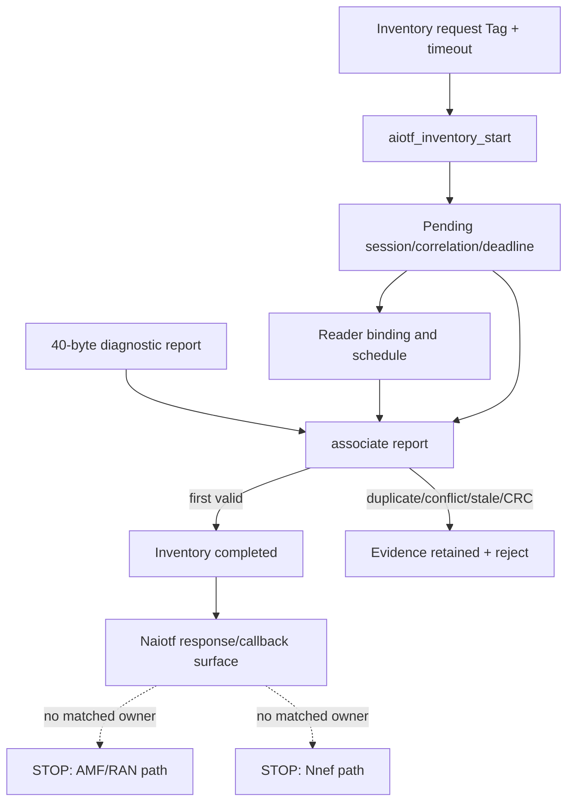

# Chapter 07：AIOTF、CN5G 與 standard-path stop

[回到課程首頁](../README.zh-TW.md) ·
[前一章](06-aiot-tag-and-reader.md) ·
[AIOTF map](../../../agent_doc/Project_management/redcap_research_wiki/systems/aiot/aiotf.md) ·
[Standard-path boundary](../../../agent_doc/Project_management/redcap_research_wiki/systems/aiot/standard-path.md)

本章回答：**40-byte diagnostic report 如何與 pending Inventory context
關聯、完成 first-valid arbitration，並在哪裡明確停止，避免把 NRF/Naiotf
成功誤寫成 AMF/RAN/NEF end-to-end？**

### 本章主線

先把 report 綁到正確的 transaction，再判斷服務與 standard path。process
healthy、NRF registered 或 HTTP 2xx 都不能取代 correlation；找不到相符的
AMF/RAN/NEF owner 時，應明確停在 negative source trace。

## 1. 學習目標

1. 追 AIOTF request、binding、transaction、deadline、report association。
2. 說明 Tag 1..60、reader 1..2、first-valid/duplicate/conflict guards。
3. 分辨 process health、NRF lifecycle、Naiotf Inventory、AMF/RAN、NEF。
4. 用 negative source trace 說明 standard-path stop。

### 本章不處理

- 不實作或執行缺失的 `Namf_AIoT`、Topology-2 NGAP/RRC、`Nnef_AIoT_*`。
- 不修改 `oai-cn5g` compose、AIOTF source或 OpenSpec tasks。
- 不把 experimental permanent ID/authorization contract稱為 conformance。

## 2. 60–90 分鐘配置

| 時間 | 活動 | 產出 |
| ---: | --- | --- |
| 0–15 分 | AIOTF state model | request/transaction/report分離 |
| 15–40 分 | Inventory CLI trace | accept/reject/arbitration |
| 40–60 分 | service/NRF/Naiotf | network-function evidence ladder |
| 60–75 分 | missing-owner trace | standard-path stop card |
| 75–90 分 | 反證、三題、handoff | xApp/dApp 起點 |

## 3. 第一性原理：correlation 先於服務成功



Process healthy、NRF registered 與 HTTP 2xx 回答的是不同問題。只有同一個
transaction identity 沿各 owner 前進，才能升級 evidence tier。

## 4. 三類參數與基本作用

| 類型 | 參數/state | 作用 | 邊界 |
| --- | --- | --- | --- |
| Input | `--profile experimental_n6` | 選 bounded diagnostic profile | 不等於 standard profile |
| Input | `--tags` | 建立 Inventory Tag set | 1..60、無 duplicate |
| Input | `--pending-context` | 提供 diagnostic correlation context | exact schema/identity |
| Input | timeout/deadline | 限制 transaction lifetime | zero/overflow reject |
| State | binding table | Tag對 eligible reader | max two readers |
| State | session/correlation/epoch | 防止 stale/mixed report | identity不可重用 |
| Guard | tag/frame/slot/reader/deadline/CRC | association acceptance | 任一 mismatch reject |
| Criterion | `AIOTF_DIAGNOSTIC_ASSOCIATED` | report已關聯 | 不等於 callback/standard path |

## 5. Source ownership matrix

| Owner | 角色 | Status |
| --- | --- | --- |
| `openair3/AIOTF/aiotf_inventory.h/.c` | bounded state、binding、schedule、arbitration | implemented-called |
| `openair3/AIOTF/aiotf_service.c` | CLI、health、diagnostic listener、NRF、Naiotf、callback | implemented-called by profile |
| `openair3/AIOTF/tests/test_aiotf_inventory.c` | null/limit/deadline/duplicate tests | local test owner |
| `oai-cn5g/docker-compose.yaml` | repository-owned deployment route | infrastructure only |
| `integrate-aiotf-cn5g-tag-workflow` | requirements/status/evidence owner | incomplete tasks remain |
| `standard-path.md` | missing AMF/RAN/NEF owners | blocked/negative trace |

## 6. 修改流程重建

| 修改點 | 第一性原因 | 結果 |
| --- | --- | --- |
| bounded inventory model | 不可用 loose logs關聯 Tag | typed request/session/report |
| binding與first-valid arbitration | 兩 Reader可能競爭/重複 | deterministic accept/duplicate/conflict |
| diagnostic listener | 先驗證 local 40-byte path | `experimental_n6` association |
| NRF lifecycle | NF需可註冊/探索 | registration/readback/discovery markers |
| bounded Naiotf surface | 驗證 Inventory API/callback contract | HTTP request/notification |
| blocker preservation | 缺 Stage-3 owner不可由 N6替代 | AMF/RAN/NEF STOP |

## 7. CLI 導讀

### Luna 固定 prompt

```text
一次只追同一 transaction ID 的一個 AIOTF boundary。要求我指出 request、
state、guard、marker與下一 owner。NRF、Naiotf、AMF/RAN、NEF證據不得合併；
找不到 matched owner 就停止並標 [Needs Verification]。
```

### Step 1：讀 bounded constants/result enums

```bash
rtk sed -n '1,215p' openair3/AIOTF/aiotf_inventory.h
```

預期：60 Tags、2 readers、16-byte payload、request/report/arbitration results。
Enum存在只證明 contract，caller留到後續。

### Step 2：讀 request/session guards

```bash
rtk sed -n '401,470p' openair3/AIOTF/aiotf_inventory.c
```

預期：invalid argument/tag/timeout/overflow/correlation，及 report pending、
deadline、tag、reader、payload、CRC guards。

### Step 3：讀 first-valid arbitration

```bash
rtk sed -n '292,350p' openair3/AIOTF/aiotf_inventory.c
```

預期：correlation/session/tag/epoch/reader/deadline/CRC順序，以及 first-valid、
duplicate、conflict。失敗reason是可診斷輸出，不應摺疊成 timeout。

### Step 4：找 diagnostic service markers

```bash
rtk rg -n 'AIOTF_(PENDING_CONTEXT|DIAGNOSTIC_ASSOCIATED|DIAGNOSTIC_REJECT)' openair3/AIOTF/aiotf_service.c
```

預期：同一 Tag、reader、correlation、session、epoch、frame/slot。Associated
只完成 local diagnostic association。

### Step 5：讀 unit boundaries

```bash
rtk rg -n 'tag_id = (0|1|60|61)|AFTER_TIMEOUT|CRC_FAILURE|DUPLICATE|CONFLICT' openair3/AIOTF/tests/test_aiotf_inventory.c
```

預期：min/max/max+1、deadline與evidence分類。Unit PASS不證明 network path。

### Step 6：讀 current change stop point

```bash
rtk openspec status --change integrate-aiotf-cn5g-tag-workflow --json
```

預期：仍有未完成 task。機械狀態決定不得把 standard path寫成完成。

### Step 7：讀 negative source trace

```bash
rtk sed -n '16,90p' agent_doc/Project_management/redcap_research_wiki/systems/aiot/standard-path.md
```

預期：selected AMF route 404、無 matched Topology-2 NGAP/RRC owner、無
`Nnef_AIoT_*` owner。這是 selected baseline的 negative trace，不是永遠不存在。

### Step 8：讀 retained conclusion

```bash
rtk rg -n 'PASS|STOP|NRF|Naiotf|AMF|NGAP|RRC|NEF|physical' redcap_library/library_reports_summary/aiotf_cn5g_experimental_n6_validation_report.md
```

預期：experimental N6、state/lifecycle、NRF與bounded Naiotf分層；standard
AMF/RAN STOP、NEF未執行、physical dual beam未評估。

## 8. Boundary value 檢查

| 對象 | 邊界 |
| --- | --- |
| Tag set | 0/1/60/61、duplicate |
| Readers | 0/1/2/3、primary unavailable |
| Pending contexts | zero/exactly one/multiple |
| Deadline | before/at/after、overflow |
| Evidence | first-valid/duplicate/conflict/stale epoch |
| Callback | expected status/non-204/retry/restart |
| NRF | unavailable/timeout/register/readback/deregister |

## 9. Failure propagation

Association reject表示 report與pending state不匹配；NRF失敗影響 lifecycle或
discovery；callback失敗不會倒推 radio失敗；AMF/RAN/NEF owner缺失使 standard
flow在 source boundary停止，Docker network connectivity不能填補。

## 10. Competing explanations 與 falsifier

現象：Inventory沒有 completed。

| 解釋 | 最小 falsifier |
| --- | --- |
| 無 pending context | 對 request accepted/session state |
| context ambiguous | 計數同 Tag/frame/slot候選 |
| reader/tag/CRC/deadline reject | 讀 exact arbitration reason |
| association完成但 callback失敗 | 沿 transaction ID到 service callback |
| 想走 standard path但 owner缺失 | 找同 release route/model/handler/caller |

## 11. Evidence ladder

本章可支持：bounded Inventory state/arbitration、experimental N6 association、
NRF registration/lifecycle與限定 Naiotf surface的既有證據。不能支持：AMF/RAN
round trip、NEF、完整 SBI、3GPP conformance。後三者為 STOP／`[Needs Verification]`。

## 12. 理解檢查

1. `AIOTF_DIAGNOSTIC_ASSOCIATED` 與 callback success差在哪一個 owner？
2. NRF registration成功為何不能證明 AMF路徑存在？
3. Negative source trace要被推翻，最少需找到哪四樣同 baseline證據？

## 13. Handoff card

```markdown
## Chapter 07 handoff
- profile / Tag set:
- transaction/correlation/session/epoch:
- reader binding:
- association result/reason:
- NRF tier:
- Naiotf tier:
- AMF/RAN stop:
- NEF stop:
- strongest conclusion:
```

## 14. 下一章入口

Standard path在此停止。概念上進入獨立控制面課程：
[Chapter 08：xApp 與 E2 control](08-xapp-and-e2-control.md)。

## 15. 教材維護資訊

- AIOTF與standard blockers分別由兩張 system map擁有。
- 未來若 baseline更新，先重做 matched route/model/handler/caller trace。
