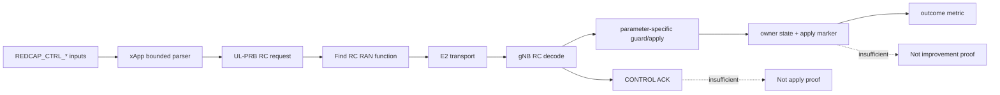

# Chapter 08：xApp 與 E2 control

[回到課程首頁](../README.zh-TW.md) ·
[前一章](07-aiotf-cn5g-and-standard-stop.md) ·
[xApp map](../../../agent_doc/Project_management/redcap_research_wiki/systems/xapp-dapp/xapp-observation-control.md) ·
[E2 map](../../../agent_doc/Project_management/redcap_research_wiki/systems/xapp-dapp/e2-transport.md)

本章回答：**xApp 如何把 UE identity、RNTI 與 UL PRB cap 編成 E2SM-RC
request，找到 RC RAN function 並送出；為何 request dump 與
`CONTROL ACK rx` 都還不能代替 gNB apply？**

### 本章主線

xApp 只負責把輸入選成 request 並送出；E2 ACK、gNB apply 與 outcome 是三個
不同 owner 的觀察點。每個觀察點都要用同一個 request identity 關聯。

## 1. 學習目標

1. 追 environment input → SDK parse → RC request → RAN-function selection。
2. 說明 UE ID、RNTI、max UL PRB 各自的作用與邊界。
3. 分開 builder、transport、decode、ACK、guard、apply、outcome。
4. 辨識 production caller與 self-test/dormant helper。

### 本章不處理

- 不執行 live xApp、E2 agent、RFsim或 control request。
- 不確認 exact O-RAN parameter mapping；保留 `[Needs Verification]`。
- 不把 priority-hint helper說成 production scheduling control。

## 2. 60–90 分鐘配置

| 時間 | 活動 | 產出 |
| ---: | --- | --- |
| 0–15 分 | control evidence ladder | 七段邊界 |
| 15–35 分 | input/builder CLI | request contract |
| 35–55 分 | RAN function/transport/decode | correlated handoff |
| 55–70 分 | ACK vs apply report | strongest bounded claim |
| 70–90 分 | boundary、三題、handoff | dApp/apply起點 |

## 3. 第一性原理：每個 owner只承擔一段責任



ACK 通常回答「request 已被協定端接受或回覆」；apply marker 才回答 owning
state 是否被寫入；outcome 還需要同條件的 baseline、treatment 與 metric owner。

## 4. 三類參數與基本作用

| 類型 | 參數/state | 作用 | Boundary |
| --- | --- | --- | --- |
| Input | `REDCAP_CTRL_UE_ID` | E2SM UE identity | parser允許0，但live identity需對應節點 |
| Input | `REDCAP_CTRL_RNTI` | gNB MAC UE lookup identity | 1..65535 |
| Input | `REDCAP_CTRL_UL_PRB_CAP` | requested max UL PRB | 0..65535；effective值由gNB sanitize |
| Input | `REDCAP_CTRL_DRY_RUN` | 只印request，不送E2 | 不產生transport evidence |
| State | `rc_ctrl_req_data_t` | E2SM-RC header/message | action/parameter IDs |
| State | RC RAN function index | 選 connected node的RC function | no match則不送 |
| Criterion | request-sent/handler/ACK/apply marker | 各自一層 | 不可跳級 |

## 5. Source ownership 與修改流程

| 順序 | Existing owner | 目的 | Status |
| ---: | --- | --- | --- |
| 1 | `openair2/E2AP/REDCAP_SDK/xapp/redcap_xapp_sdk.c` | parse、builder、RC lookup | reusable helper |
| 2 | `ci-scripts/redcap_ul_prb_ctrl_xapp.c` | production-integrated caller | implemented-called |
| 3 | FlexRIC/E2 integration | node discovery與transport | transport owner |
| 4 | `ran_func_rc_redcap.c` | parameter extraction/parse | decoder owner |
| 5 | `ran_func_rc.c` | RC dispatch | gNB handler owner |
| 6 | G4 report | contract+ACK+UL-PRB apply slice | bounded runtime evidence |

`redcap_xapp_make_priority_hint()`與top selection存在且可 self-test，但 production
conversion caller未驗證，狀態是 dormant/self-test-only，不併入 live UL-PRB路徑。

## 6. CLI 導讀

### Luna 固定 prompt

```text
一次只追 request identity的一個 E2 boundary。要求我保留 ue_id、RNTI、cap、
action與request correlation；request builder、sent、decode、ACK、apply、outcome
每次只升一層。找不到 production caller就標 dormant/[Needs Verification]。
```

### Step 1：讀 xApp public contract

```bash
rtk sed -n '1,70p' openair2/E2AP/REDCAP_SDK/xapp/redcap_xapp_sdk.h
```

預期：parse/env、UL-PRB/DRX builders、RC lookup、priority-hint types。Header
存在不表示每個 helper都有live caller。

### Step 2：讀 UL-PRB builder

```bash
rtk sed -n '13,150p' openair2/E2AP/REDCAP_SDK/xapp/redcap_xapp_sdk.c
```

預期：bounded integer parse、gNB UE ID、control action與RNTI/cap parameters、
RC function lookup。Builder不讀gNB current state。

### Step 3：讀 integrated caller

```bash
rtk sed -n '15,96p' ci-scripts/redcap_ul_prb_ctrl_xapp.c
```

預期：三個 required env、dry-run、connected nodes、RC function、send/cleanup。
Dry-run output只支持request construction。

### Step 4：區分 live與dormant helpers

```bash
rtk rg -n 'redcap_xapp_(make_ul_prb_ctrl_req|make_priority_hint|select_top_priority_hint)' openair2 ci-scripts agent_doc/Project_management/projects/redcap_oran_sdk_workflow_v3 --glob '*.[ch]' --glob '*.md'
```

預期：UL-PRB builder有integrated caller；priority helper主要在SDK/tests/docs。
文件提及不算 production caller。

### Step 5：找 gNB decode/dispatch

```bash
rtk rg -n 'parse_ul_prb|CTRL_ACT_ID_UL_PRB_CAP|apply_redcap_ul_prb_control' openair2/E2AP/RAN_FUNCTION/O-RAN
```

預期：parameter parser與RC dispatch/apply owner。這一步是source call path，
不是本次request transport。

### Step 6：讀 ACK/apply evidence contract

```bash
rtk rg -n 'Contract|CONTROL ACK|RedCap UL PRB control|latency|improvement|Boundary' agent_doc/Project_management/projects/redcap_oran_sdk_workflow_v3/report/G4_rfsim_case_b_ul_prb_2026-07-04.md
```

預期：同一bounded slice具 contract PASS、ACK、gNB apply marker；報告未建立
latency/access/resource-allocation improvement。

### Step 7：確認 current workflow state

```bash
rtk openspec status --change redcap-oran-sdk-workflow-v3 --json
```

完成狀態只代表 owning tasks完成；仍依G4 report限制 outcome claim。

## 7. Boundary value 檢查

| 對象 | 邊界 |
| --- | --- |
| env parse | null/empty/non-number/negative/overflow/trailing text |
| RNTI | 0 reject；1/max；unknown but numeric |
| PRB cap | 0/min/max/max+1 relative to actual BWP/min grant |
| node list | null/empty/multiple、no RC function |
| request | stale/duplicate identity、unsupported style/action |
| transport | no send/decode failure/ACK failure/ACK-only |

## 8. Failure propagation

Parse failure不建立request；no RC function不送出；transport/decode failure不進
handler；ACK-only不能判 apply；apply後若scheduler未消費或沒有metric，也不能
判 improvement。每段使用不同 owner/falsifier。

## 9. Competing explanations 與 falsifier

現象：xApp顯示control sent，但預期行為未改。

| 解釋 | 最小 falsifier |
| --- | --- |
| 送到錯 node/function | 對 node與RAN function ID |
| request identity/parameter錯 | 對 builder dump與decoder值 |
| transport無ACK | correlation ACK/failure |
| ACK有但apply未發生 | 查同RNTI/cap gNB apply marker |
| apply有但scheduler/outcome未變 | 轉Chapter 09/10讀owner state與metric |

## 10. Evidence ladder

G4 retained slice支持：contract、correlated ACK與一個selected RNTI/cap的gNB
UL-PRB apply marker。它不支持完整SDK、priority helper live path、DRX path、
效能改善或exact O-RAN mapping。

## 11. 理解檢查

1. Dry-run與`control sent`各自到哪個evidence tier？
2. UE ID與RNTI為何需要同時存在？
3. 有ACK後，哪個marker才能證明UL-PRB owner state被寫入？

## 12. Handoff card

```markdown
## Chapter 08 handoff
- node/RAN function:
- UE ID / RNTI / requested cap:
- request/action IDs:
- builder evidence:
- transport evidence:
- ACK evidence:
- apply evidence or missing owner:
- outcome claim: not established
```

## 13. 下一章入口

進入 [Chapter 09：dApp guard、gNB apply與rollback](09-dapp-guard-apply-and-rollback.md)。

## 14. 教材維護資訊

- Canonical SDK guide：[xApp/dApp guide](../../../agent_doc/Project_management/projects/redcap_dapp_xapp_sdk_test_validation_v1/Doc/sdk_development_guide.zh-TW.md)。
- Exact O-RAN parameter mapping仍 `[Needs Verification]`。
