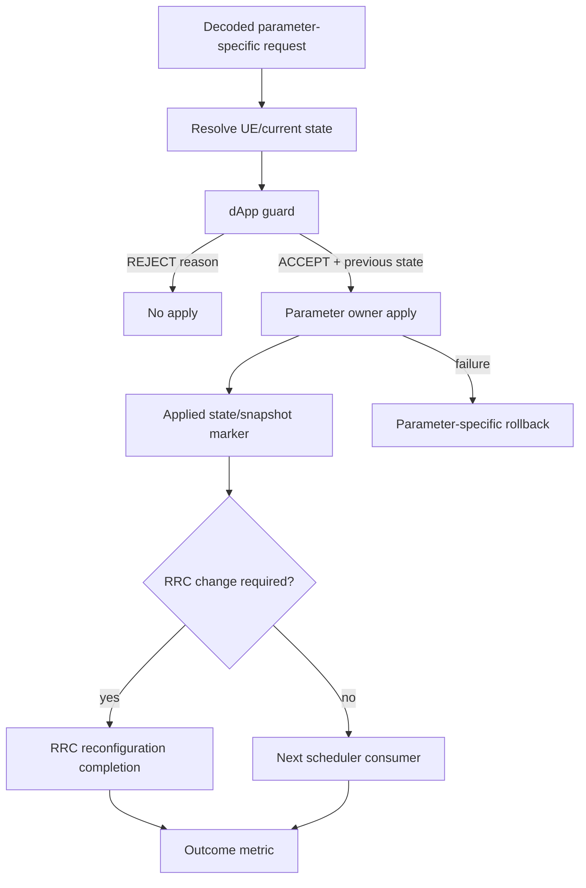

# Chapter 09：dApp guard、gNB apply 與 rollback

[回到課程首頁](../README.zh-TW.md) ·
[前一章](08-xapp-and-e2-control.md) ·
[dApp guard](../../../agent_doc/Project_management/redcap_research_wiki/systems/xapp-dapp/dapp-guard.md) ·
[Apply/rollback](../../../agent_doc/Project_management/redcap_research_wiki/systems/xapp-dapp/gnb-apply-rollback.md)

本章回答：**一個decoded control何時被local guard拒絕，何時可寫入gNB
state；snapshot/rollback為何必須按參數定義，而不能宣告generic rollback？**

## 1. 學習目標

1. 分辨 dApp helper contract、production caller、guard marker與apply owner。
2. 追 live DRX request → dApp guard → MAC apply → RRC completion boundary。
3. 對照 UL-PRB direct apply，理解不同參數的rollback語意不同。
4. 解釋 self-test、guard ACCEPT、apply marker與outcome的差距。

### 本章不處理

- 不假定所有 dApp helpers都有production caller。
- 不執行 Gate E、core36/core56或 adaptive DRX campaign。
- 不宣告allocation/latency/access improvement，除非owner report明示且可比較。

## 2. 60–90 分鐘配置

| 時間 | 活動 | 產出 |
| ---: | --- | --- |
| 0–15 分 | parameter-specific model | UL-PRB與DRX分線 |
| 15–40 分 | DRX guard CLI | accept/reject contract |
| 40–60 分 | gNB apply/snapshot/RRC | consumer trace |
| 60–75 分 | reports與claim boundary | strongest outcome |
| 75–90 分 | 反證、三題、handoff | capstone起點 |

## 3. 第一性原理：rollback不是一個布林值



UL-PRB cap是UE scheduler context中的bounded值；DRX會牽涉profile、policy
version、cooldown、previous state與可能的RRC reconfiguration。不能用同一
rollback contract描述兩者。

## 4. 三類參數與基本作用

| 類型 | 參數/state | 作用 | Guard/impact |
| --- | --- | --- | --- |
| Input | RNTI / RRC UE ID | 尋找live UE context | unknown identity reject |
| Input | requested UL PRB cap | 限制UL allocation上限 | sanitize後寫scheduler state |
| Input | DRX long cycle / policy version | 選approved profile與順序 | unsupported/stale reject |
| State | current DRX config/snapshot | rollback來源 | missing/invalid reject |
| State | cooldown/RRC pending | 防止重疊reconfiguration | active cooldown reject |
| Guard | `redcap_dapp_guard_e2_drx_cycle()` | parameter-specific accept/reject | marker含reason |
| Criterion | apply/snapshot/RRC completion | 證據逐層前進 | ACCEPT不是apply |

PRB allocation ratio、access-pressure、RA selector與prediction helpers有mixed
self-test/experimental/dormant狀態；只有實際 caller 可提升為implemented-called。

## 5. Source ownership 與修改流程

| 路徑 | Existing owner | 目前作用 | 邊界 |
| --- | --- | --- | --- |
| SDK guard | `openair2/E3AP/sdk/redcap_dapp_sdk.h/.c` | bounded contract與reason | helper本身不apply |
| live DRX caller | `openair2/E2AP/RAN_FUNCTION/O-RAN/ran_func_rc.c` | resolve state、guard、MAC apply | RRC completion另算 |
| UL-PRB apply | same `apply_redcap_ul_prb_control()` | sanitize並寫UE sched ctrl | 無generic rollback claim |
| MAC DRX apply | `nr_mac_apply_drx_policy()` route | state/snapshot | failure須parameter-specific處理 |
| scheduler hooks | `gNB_scheduler_uci.c`, `gNB_scheduler_ulsch.c` | allocation/observation consumers | mutation依caller逐一驗證 |

## 6. CLI 導讀

### Luna 固定 prompt

```text
一次只選UL-PRB或DRX一條參數路徑。要求我指出production caller、current
state、guard reason、apply owner、snapshot/rollback、UE/scheduler consumer。
若helper只在test中出現，標dormant；ACCEPT不能直接升級成apply/outcome。
```

### Step 1：讀 dApp contract types

```bash
rtk sed -n '1,180p' openair2/E3AP/sdk/redcap_dapp_sdk.h
```

預期：UL-PRB/allocation/access-pressure與DRX request/config/result types，包含
policy version、rollback availability、marker。型別共存不代表共同live path。

### Step 2：讀 DRX guard順序

```bash
rtk sed -n '237,350p' openair2/E3AP/sdk/redcap_dapp_sdk.c
```

預期：schema/RNTI/connected/stale version/sample/prediction/profile/cooldown/
rollback guards，以及ACCEPT previous/accepted state。

### Step 3：確認 live production caller

```bash
rtk sed -n '90,172p' openair2/E2AP/RAN_FUNCTION/O-RAN/ran_func_rc.c
```

預期：resolve gNB/UE state、建立current snapshot與request、印guard result、
只在allows-apply後呼叫MAC apply。此處是DRX path，不泛化到所有helper。

### Step 4：讀 UL-PRB direct apply對照

```bash
rtk sed -n '48,88p' openair2/E2AP/RAN_FUNCTION/O-RAN/ran_func_rc.c
```

預期：null/gNB/unknown RNTI guards、sanitize requested cap、寫
`UE_sched_ctrl.redcap_ul_prb_cap`與effective marker。這條路沒有使用DRX guard。

### Step 5：找 helper callers，分類live/dormant

```bash
rtk rg -n 'redcap_dapp_(guard_prb_allocation|access_pressure_policy|select_ra_pressure_priority|guard_e2_drx_cycle)' openair2 --glob '*.[ch]'
```

預期：逐 helper看到test或scheduler/RC caller。只有test caller不能聲稱production。

### Step 6：讀 guard/apply system boundary

```bash
rtk rg -n 'implemented-called|dormant|ACCEPT|REJECT|apply|rollback|Claim Boundary' agent_doc/Project_management/redcap_research_wiki/systems/xapp-dapp/dapp-guard.md agent_doc/Project_management/redcap_research_wiki/systems/xapp-dapp/gnb-apply-rollback.md
```

預期：PRB allocation/live DRX與其他helpers分級；apply marker不等於每個grant
消費新state。

### Step 7：讀 outcome reports的限制

```bash
rtk rg -n 'Conclusion|PASS|comparable|latency|improvement|blocked|partial|core36|core56' agent_doc/Project_management/projects/redcap_dapp_xapp_sdk_test_validation_v1/report/gate_e_core56_ab_latency_2026-07-09.md agent_doc/Project_management/projects/redcap_dapp_xapp_sdk_test_validation_v1/report/gate_e_core36_pressure_2026-07-10.md
```

預期：core56比較不自動等於latency improvement；core36 follow-up依report
保留的runtime boundary判讀，不用static helper補成PASS。

## 7. Boundary value 檢查

| 對象 | 邊界 |
| --- | --- |
| identity | zero、unknown、stale、UE release during apply |
| cap | 0、min grant、BWP max、max+1 |
| ratio | 0/1000、sum=999/1000/1001 |
| policy version | 0、current-1/current/current+1 |
| cooldown | just before/at/after elapsed |
| rollback | unavailable、invalid profile、apply failure、rollback failure |
| concurrency | two requests同UE、RRC completion pending |

## 8. Failure propagation

Decode error停在transport handler；guard reject必須不呼叫apply；apply failure要
保留previous state與reason；RRC-changing control缺completion就停在apply；
scheduler未消費或metric不具可比性時，不能宣告outcome。

## 9. Competing explanations 與 falsifier

現象：看到 `[RedCap DRX][dApp ACCEPT]`，但UE行為未變。

| 解釋 | 最小 falsifier |
| --- | --- |
| apply caller未執行/失敗 | 同policy version的MAC apply result |
| state套用但RRC未完成 | RRC reconfiguration completion |
| completion有但UE scheduler未消費 | readback與next active-slot consumer |
| control有效但metric不敏感 | 檢查metric contract/baseline equivalence |

## 10. Evidence ladder

- Self-test：guard contract logic。
- Production caller+marker：同request的accept/reject。
- Apply/snapshot：owning state處理。
- RRC completion：需要UE config change時的下一層。
- Outcome：獨立metric contract。

本章不做generic rollback或performance improvement claim。

## 11. 理解檢查

1. 為何UL-PRB與DRX不能共用一個rollback結論？
2. dApp ACCEPT後，至少還需哪兩層才能討論UE-visible DRX？
3. 如何判斷一個SDK helper是production caller還是self-test-only？

## 12. Handoff card

```markdown
## Chapter 09 handoff
- parameter path: UL-PRB/DRX
- request identity/version:
- current state/snapshot:
- guard result/reason:
- apply owner/marker:
- rollback availability:
- RRC/scheduler next consumer:
- strongest evidence:
- outcome claim: not established unless owning report says so
```

## 13. 下一章入口

進入 [Chapter 10：Change replay capstone](10-change-replay-capstone.md)。

## 14. 教材維護資訊

- Guard與apply由兩張system map分別維護；本章不複製完整API清單。
- 新parameter必須重新建立parameter-specific guard/apply/rollback/evidence路線。
