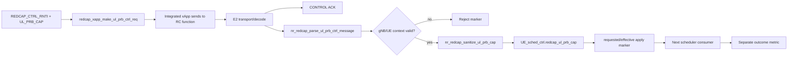

# Chapter 10：Change replay capstone

[回到課程首頁](../README.zh-TW.md) ·
[前一章](09-dapp-guard-apply-and-rollback.md) ·
[Outcome evidence](../../../agent_doc/Project_management/redcap_research_wiki/systems/xapp-dapp/outcome-evidence.md)

本章讓您獨立重播一項範圍受限的變更（bounded change）：**`redcap_ul_prb_cap`
從 xApp input，經 E2SM-RC request/ACK，到 gNB UE context apply marker。**
選它是因為 project、source 與 retained evidence 三方齊全；本章仍不把它
擴張成效能改善。

### 本章主線

用一個 UL-PRB cap change 完整重播 **input → request → decode → apply**，再
刻意停在「沒有 outcome metric」的位置。這樣可以同時練習 trace 與停止推論。

## 1. 學習目標

1. 從 ledger 建立 project/source/evidence 三方 route。
2. 自己完成 input → request → decode → sanitize → state → marker trace。
3. 為 ACK-only、unknown RNTI、cap boundary 與 missing metric 設計 falsifier。
4. 產出可交給 Luna 或下一位工程師的 Research Reading Card 與 handoff。

### 本章不處理

- 不發送live E2 request、不執行G4或Gate E。
- 不修改SDK、RC handler、scheduler或report。
- 不宣告commit author；未核對commit attribution為 `[Needs Verification]`。

## 2. 60–90 分鐘配置

| 時間 | 活動 | 產出 |
| ---: | --- | --- |
| 0–10 分 | 定義capstone question | 一句因果主張 |
| 10–25 分 | project/ledger route | scope與acceptance |
| 25–50 分 | source trace | producer-consumer table |
| 50–65 分 | retained G4 evidence | strongest completed tier |
| 65–80 分 | falsifier/boundaries | repair decision |
| 80–90 分 | 三題與handoff | 可獨立重播下一change |

## 3. Capstone question 與完成條件

要驗證的句子：

> 在有效 `REDCAP_CTRL_RNTI` 與 `REDCAP_CTRL_UL_PRB_CAP` 下，integrated xApp
> 建立 UL-PRB RC request；gNB decoder 取得同一 RNTI 與 requested cap，apply
> owner 將 sanitize 後的 effective cap 寫入該 UE scheduler context，並留下
> marker。

完成條件不是「找到所有關鍵字」，而是填完：

| 欄位 | 必須具備 |
| --- | --- |
| Requirement owner | project/OpenSpec/report scope |
| Input | exact name、range、default/required |
| Producer | actual integrated caller |
| Transport identity | node/RAN function/action/request |
| Decoder | parameter IDs與typed state |
| Guard | malformed/no gNB/unknown UE/sanitize |
| Apply state | exact owning field |
| Evidence | contract、ACK、apply marker分列 |
| Missing outcome | metric/baseline/treatment owner |

## 4. 第一性原理因果圖



## 5. 三類參數

| 類型 | 本capstone項目 | 基本作用 | 影響 |
| --- | --- | --- | --- |
| Operator input | `REDCAP_CTRL_RNTI` | 選gNB UE context | 錯值被unknown RNTI拒絕 |
| Operator input | `REDCAP_CTRL_UL_PRB_CAP` | requested upper bound | 可能被min-grant sanitize |
| Program state | decoded `nr_redcap_rc_ul_prb_ctrl_t` | 跨E2後的typed request | apply function input |
| Program state | `UE_sched_ctrl.redcap_ul_prb_cap` | owning effective cap | scheduler後續consumer |
| Control guard | null/no MAC/unknown UE | 防止錯寫shared state | reject/no mutation |
| Pass criterion | contract + ACK + apply marker | 三個不同層級 | 仍不含outcome |

## 6. 修改流程重建

| 修改點 | 第一性原因 | Affected owner | 結果 |
| --- | --- | --- | --- |
| 建立bounded env parser | 防止無效數字進request | xApp SDK/caller | invalid input fail early |
| 建立RC request builder | identity與params需stable schema | xApp SDK | two integer RAN params |
| 建立integrated caller | helper需live transport owner | CI xApp caller | node/function selection與send |
| 建立gNB decoder/dispatch | wire state需typed local request | RC parser/handler | malformed reject或apply handoff |
| 建立parameter apply | 只修改target UE owner state | `ran_func_rc.c` | requested/effective marker |
| 建立G4 gate | 防止ACK被報成apply | workflow report | contract+ACK+apply bounded proof |

精確commit序列、作者與before code未在本章核對，標 `[Needs Verification]`。

## 7. CLI 導讀

### Luna 固定 prompt

```text
這是capstone。不要先給答案；一次只給一個唯讀指令。每次讓我填一列
producer-consumer表，並問我該輸出最高支持哪個evidence tier。保持同一RNTI、
requested/effective cap與request identity。完成後審查我的Research Reading Card。
```

### Step 1：確認 ledger route

```bash
rtk rg -n 'CL-09|UL-PRB|G4|xApp|dApp' redcap_library/luna_cli_trace_course/change-ledger.md
```

預期：取得project、source、evidence入口。Ledger不是runtime evidence。

### Step 2：讀 acceptance owner

```bash
rtk rg -n 'G4|UL PRB|ACK|apply|required|scope|outcome' agent_doc/Project_management/projects/redcap_oran_sdk_workflow_v3/project_plan.md agent_doc/Project_management/projects/redcap_oran_sdk_workflow_v3/milestones/G4_rfsim_case_b_marker_validation.md
```

預期：先寫出required markers與非目標；後面不得變更判準。

### Step 3：找 integrated producer

```bash
rtk rg -n 'REDCAP_CTRL_(UE_ID|RNTI|UL_PRB_CAP)|make_ul_prb_ctrl_req|find_rc_ran_func_idx|control sent' ci-scripts/redcap_ul_prb_ctrl_xapp.c
```

預期：input ranges、builder、RAN function與send marker。指出dry-run branch
不能進transport。

### Step 4：讀 builder內部parameter mapping

```bash
rtk sed -n '121,153p' openair2/E2AP/REDCAP_SDK/xapp/redcap_xapp_sdk.c
```

預期：UE ID header、UL-PRB control action、RNTI與max PRB parameter。Exact
O-RAN標準mapping仍 `[Needs Verification]`。

### Step 5：追decoder到apply state

```bash
rtk rg -n 'parse_ul_prb_ctrl_message|apply_redcap_ul_prb_control|redcap_ul_prb_cap|requested %u effective %u' openair2/E2AP/RAN_FUNCTION/O-RAN openair2/LAYER2/NR_MAC_gNB
```

預期：decoder、dispatch、sanitize、owning field與可能scheduler consumer。
只有source trace，不代表G4 run。

### Step 6：讀apply guards

```bash
rtk sed -n '48,88p' openair2/E2AP/RAN_FUNCTION/O-RAN/ran_func_rc.c
```

預期：malformed、no active gNB、unknown RNTI與effective cap。記錄每個branch
是否允許shared state mutation。

### Step 7：讀retained三層證據

```bash
rtk rg -n 'Contract|CONTROL ACK|requested|effective|PASS|not establish|Conclusion' agent_doc/Project_management/projects/redcap_oran_sdk_workflow_v3/report/G4_rfsim_case_b_ul_prb_2026-07-04.md
```

預期：contract、ACK、apply分開；沒有latency/access/resource improvement。

### Step 8：檢查working tree與attribution boundary

```bash
git status --short
```

預期：辨識tracked/untracked/local edits。此輸出不能證明歷史作者；若需要
commit attribution，另開明確audit，不在capstone猜測。

## 8. Producer-consumer worksheet

| Stage | Producer | State/output | Consumer | Evidence tier |
| --- | --- | --- | --- | --- |
| Input parse |  |  |  |  |
| RC builder |  |  |  |  |
| E2 transport |  |  |  |  |
| gNB decode |  |  |  |  |
| guard/sanitize |  |  |  |  |
| apply |  |  |  |  |
| scheduler outcome |  |  |  |  |

若任一列沒有actual consumer，停止並標 dormant／`[Needs Verification]`。

## 9. Boundary value與side-effect檢查

| Case | Expected |
| --- | --- |
| empty/non-number env | xApp parse failure、no send |
| RNTI 0 | xApp reject |
| unknown valid RNTI | gNB reject、no mutation |
| cap 0 | allowed request；effective值依sanitize owner |
| cap below min grant | effective值不得低於owner minimum |
| cap above active BWP | downstream consumption需另驗證 |
| duplicate/concurrent request | identity/order behavior `[Needs Verification]` |
| UE release during apply | reject/no stale pointer mutation required |

本章不更改shared state；live mutation只在另行核准的runtime。

## 10. Research Reading Card

```markdown
### Question
同一RNTI/requested cap是否從xApp request抵達gNB，並成為owning effective state？

### Source set
- Requirement/project:
- xApp producer:
- E2 decoder:
- gNB apply/consumer:
- Retained evidence:

### Competing explanations
1. request未建立或送到錯RC function。
2. transport/ACK完成但decoder/identity錯。
3. apply完成但scheduler未消費。
4. scheduler消費但實驗無法量測聲稱的outcome。

### Minimal falsifier
對同一request identity、RNTI、requested/effective cap，逐一相關builder、decoder、
ACK與apply marker；缺哪一層就停在哪一層。

### Strongest conclusion
G4 retained slice到parameter-specific gNB apply；沒有performance outcome。
```

## 11. Evidence ladder與修復決策

| 最後完成層 | 下一個owner | 合理動作 |
| --- | --- | --- |
| builder | E2 send/transport | 查node/function/correlation |
| transport/ACK | gNB decoder/apply | 查decoded identity與apply marker |
| guard reject | input/current-state owner | 修input或證明guard錯誤 |
| apply | scheduler consumer | 查同UE下一grant state |
| consumer | metric owner | 先定baseline/treatment與判準 |

只有guard或owner邏輯被反證時才進source fix；否則不寫code。

## 12. 理解檢查

1. G4已具ACK與apply，為何仍不能寫「UL throughput改善」？
2. 若requested=0而effective>0，先查哪個owner，為何不先改xApp？
3. 哪三份artifact共同支持一次bounded historical change replay？

## 13. Handoff card

```markdown
## Chapter 10 handoff
- change/ledger ID:
- bounded question:
- project acceptance:
- input values/ranges:
- producer -> decoder -> guard -> apply -> consumer:
- contract marker:
- ACK marker:
- apply marker:
- missing outcome metric:
- one falsified explanation:
- one [Needs Verification]:
- next safe action:
```

## 14. 完課後的下一次重播

回到 [change ledger](../change-ledger.md)，依相依順序選下一列。每次只重播
一個parameter或procedure，不同feature的markers不得混用。若要執行build或
runtime，先確認registered tool、task manifest、project acceptance與L4授權。

## 15. 教材維護資訊

- Capstone故意採既有owner與G4 evidence，不新增script/template。
- Current working tree與runtime可能漂移；本章只保存可重做的方法。
