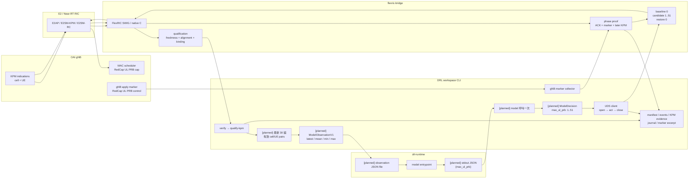

```mermaid
flowchart LR
    subgraph GNB["OAI gNB"]
      MAC["MAC scheduler<br/>RedCap UL PRB cap"]
      KPM["KPM indications<br/>cell + UE"]
      MARKER["gNB apply marker<br/>RedCap UL PRB control"]
    end

    subgraph E2["E2 / Near-RT RIC"]
      RIC["E2AP / E2SM-KPM / E2SM-RC"]
    end

    subgraph BRIDGE["flexric-bridge"]
      SWIG["FlexRIC SWIG / native C"]
      QUAL["qualification<br/>freshness + alignment + binding"]
      PROOF["phase proof<br/>ACK + marker + later KPM"]
      TXN["baseline 0<br/>candidate 1..51<br/>restore 0"]
    end

    subgraph CLI["DRL workspace CLI"]
      GATE["verify → qualify-kpm"]
      WINDOW["[planned] 最新 30 組<br/>有效 cell/UE pairs"]
      SUMMARY["[planned] ModelObservationV1<br/>latest / mean / min / max"]
      CALL["[planned] model 呼叫一次"]
      DECISION["[planned] ModelDecision<br/>max_ul_prb: 1..51"]
      UDS["UDS client<br/>open → act → close"]
      EVIDENCE["manifest / events / KPM evidence<br/>journal / marker excerpt"]
      COLLECTOR["gNB marker collector"]
    end

    subgraph MODEL["drl-runtime"]
      INPUT["[planned] observation JSON file"]
      INFER["model entrypoint"]
      OUTPUT["[planned] stdout JSON<br/>{max_ul_prb}"]
    end

    KPM --> RIC --> SWIG --> QUAL
    QUAL --> GATE
    GATE --> WINDOW --> SUMMARY --> INPUT
    INPUT --> INFER --> OUTPUT --> CALL --> DECISION --> UDS
    UDS --> TXN --> SWIG --> RIC --> MAC

    MARKER --> COLLECTOR --> PROOF
    KPM --> RIC --> SWIG --> PROOF
    PROOF --> TXN

    GATE --> EVIDENCE
    UDS --> EVIDENCE
    PROOF --> EVIDENCE

```
