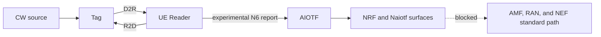

# A-IoT Tag, Reader, and AIOTF System Map

## Scope

This map separates the implemented experimental Topology-2 RFsim path, bounded
AIOTF/NRF/Naiotf surfaces, and missing AMF/RAN/NEF standard-path owners.

## System Flow

## Component Index

| Component | Current state | Strongest evidence | Page |
|---|---|---|---|
| Tag and UE Reader | Implemented-called for `experimental_n6` | RFsim source/runtime boundary | [Open](tag-reader.md) |
| AIOTF | Implemented-called for bounded Inventory/NRF/Naiotf | Source/runtime boundary | [Open](aiotf.md) |
| Standard path | Missing/blocked endpoints | Negative source trace | [Open](standard-path.md) |

## Current State

[Source Trace] The experimental RFsim Tag/Reader path and bounded AIOTF
surfaces have owners. `Namf_AIoT`, matched Topology-2 NGAP/RRC, and
`Nnef_AIoT_*` remain missing or `[Needs Verification]`.

## Evidence Ladder

1. Tag/CW and R2D/D2R codec/relay source exists.
2. UE Reader produces a validated diagnostic report.
3. AIOTF finds unambiguous pending context and accepts arbitration input.
4. NRF or Naiotf request/callback succeeds for the bounded surface.
5. AMF/RAN/NEF standard endpoint exists and is called.
6. End-to-end standard-path outcome is retained.

The current path stops before steps 5 and 6.

## Repair Order

1. Identify the active profile.
2. Find the last Tag, relay, UE, AIOTF, NRF, or Naiotf producer marker.
3. Verify the next consumer owner and input contract.
4. Stop when the next standard endpoint is missing; do not substitute N6.

## Course Route

Prerequisite: [RedCap runtime evidence](../redcap/runtime-evidence.md). Read
[Tag and Reader](tag-reader.md), then [AIOTF](aiotf.md), then
[Standard path](standard-path.md), and continue to [xApp/dApp](../xapp-dapp/overview.md).

## Claim Boundary

This map does not establish complete SBI readiness, AMF/RAN round trip, 3GPP
conformance, or physical-RF behavior.

## Open Questions

- A matched, implementable Topology-2 Stage-3 NGAP/RRC owner remains
  `[Needs Verification]`.
- `Nnef_AIoT_*` ownership remains `[Needs Verification]`.
