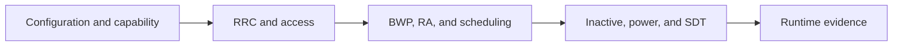

# RedCap System Map

## Scope

This map routes RedCap configuration, UE capability, RRC/access, BWP/RA,
inactive/power/SDT, and retained runtime evidence. [Source Trace] The mMTC
project plan remains the status owner; this page is navigation and synthesis.

## System Flow

## Component Index

| Component | Current state | Strongest evidence | Page |
|---|---|---|---|
| Configuration and capability | Implemented-called | Source trace | [Open](configuration-capability.md) |
| RRC and access | Implemented-called with bounded gates | Source/project evidence | [Open](rrc-access.md) |
| BWP, RA, and scheduling | Implemented-called | Source plus retained Case A/B evidence | [Open](bwp-ra-scheduling.md) |
| Inactive, power, and SDT | Partial by feature | Unit/flow/log tiers | [Open](inactive-power-sdt.md) |
| Runtime evidence | Retained project evidence | Accepted RFsim boundary | [Open](runtime-evidence.md) |

## Current State

[Runtime Evidence] The project accepts a 56/56 Case B RFsim boundary and keeps
the 64-UE run as a classified upper-bound failure. This does not establish
general network capacity or physical-power behavior.

## Evidence Ladder

1. Configuration and capability fields exist and are parsed.
2. RRC/access selects the intended RedCap path.
3. BWP/RA/scheduler owners consume that state.
4. Inactive/power/SDT behavior reaches its feature-specific marker.
5. Retained runtime evidence satisfies the owning project criteria.

Stop at the first missing step. A build or attach result does not prove later
feature behavior.

## Repair Order

1. Confirm the requested config and UE capability.
2. Find the last RRC/access producer marker.
3. Check the next BWP/RA/scheduler consumer and active BWP state.
4. Inspect inactive/SDT or low-power state only when the earlier route passes.
5. Reuse the nearest project validation ID; L4 execution requires separate
   approval.

## Course Route

Read this domain in Component Index order. Continue to [A-IoT Topology 2](../aiot/overview.md),
then AIOTF, then the xApp/dApp SDK map.

## Claim Boundary

This page establishes project and source navigation. It does not confirm exact
3GPP clause mappings, real-network capacity, energy consumption, or a fresh
runtime result. Those conclusions remain `[Needs Verification]` unless their
owning evidence is reviewed.

## Open Questions

- Exact Release 17/18 optionality for several local RedCap fields remains
  `[Needs Verification]` in the function lookup and traceability matrix.
- Any new runtime campaign remains outside this approval.
