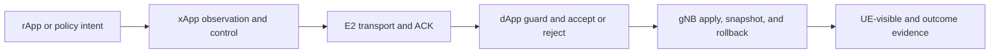

# xApp and dApp Control System Map

## Scope

This map separates policy/observation, E2 transport, dApp guard, gNB
apply/rollback, and outcome evidence for the current RedCap SDK surfaces.

## System Flow

## Component Index

| Component | Current state | Strongest evidence | Page |
|---|---|---|---|
| xApp observation/control | Mixed integrated and dormant helpers | Source plus bounded runtime | [Open](xapp-observation-control.md) |
| E2 transport | Implemented-called for selected control | Transport/ACK | [Open](e2-transport.md) |
| dApp guard | Mixed integrated and dormant guards | Guard decision/marker | [Open](dapp-guard.md) |
| gNB apply/rollback | Parameter-specific implemented paths | Apply/snapshot; rollback varies | [Open](gnb-apply-rollback.md) |
| Outcome evidence | Retained, parameter-specific | Stops at strongest completed step | [Open](outcome-evidence.md) |

## Current State

[Runtime Evidence] The project records one bounded live Case B
`redcap_ul_prb_cap` path with contract, control ACK, and gNB apply marker. It
does not establish a complete xApp/dApp/rApp SDK or a performance improvement.

## Evidence Ladder

1. Request identity and schema.
2. xApp decision/builder output.
3. E2 transport and ACK.
4. dApp/local accept or reject.
5. gNB apply marker and snapshot/rollback state.
6. UE/RRC completion when required.
7. Outcome metric from its owner.

## Repair Order

1. Correlate one request identity/version.
2. Find the last completed evidence step.
3. Inspect only the next owner.
4. Reuse the existing SDK/transport/apply module and nearest self-test.
5. Stop before source/runtime work unless separately approved.

## Course Route

Prerequisite: [A-IoT/AIOTF](../aiot/overview.md). Read Component Index in order,
reusing existing APIs before proposing a minimal in-place extension.

## Claim Boundary

Static, transport, ACK, guard, apply, UE-visible, and outcome evidence are
independent. No earlier step implies a later step. Exact O-RAN clause mappings
remain `[Needs Verification]`.

## Open Questions

- Production callers for several priority/policy helpers remain
  `[Needs Verification]`.
- Generic rollback and parameter-independent performance effects are not
  established.
